# <a name="overview-of-retention-labels"></a><span data-ttu-id="9ddb3-105">Panoramica delle etichette di conservazione</span><span class="sxs-lookup"><span data-stu-id="9ddb3-105">Overview of retention labels</span></span>

<span data-ttu-id="9ddb3-p102">All'interno dell'organizzazione sono probabilmente presenti tipi di contenuto diversi, sui quali occorre eseguire azioni differenti per garantire la conformità alle normative di settore e ai criteri interni. Ad esempio, possono essere presenti:</span><span class="sxs-lookup"><span data-stu-id="9ddb3-p102">Across your organization, you probably have different types of content that require different actions taken on them in order to comply with industry regulations and internal policies. For example, you might have:</span></span>
  
- <span data-ttu-id="9ddb3-108">Moduli fiscali che devono essere **conservati** per un periodo di tempo minimo.</span><span class="sxs-lookup"><span data-stu-id="9ddb3-108">Tax forms that need to be **retained** for a minimum period of time.</span></span> 
    
- <span data-ttu-id="9ddb3-109">Materiali per la stampa che devono essere **eliminati definitivamente** dopo un determinato periodo di tempo.</span><span class="sxs-lookup"><span data-stu-id="9ddb3-109">Press materials that need to be **permanently deleted** when they reach a certain age.</span></span> 
    
- <span data-ttu-id="9ddb3-110">Ricerche competitive che devono essere **conservate** e in seguito **eliminate definitivamente**.</span><span class="sxs-lookup"><span data-stu-id="9ddb3-110">Competitive research that needs to be both **retained** and then **permanently deleted**.</span></span> 
    
- <span data-ttu-id="9ddb3-111">Permessi di lavoro che devono essere **classificati come record** in modo che non sia possibile modificarli o eliminarli.</span><span class="sxs-lookup"><span data-stu-id="9ddb3-111">Work visas that must be **marked as a record** so that they can't be edited or deleted.</span></span> 
    
<span data-ttu-id="9ddb3-p103">In tutti questi casi, le etichette di conservazione in Office 365 aiutano a identificare le azioni corrette da eseguire per ogni contenuto. Con le etichette di conservazione è possibile classificare i dati all'interno dell'organizzazione a scopi di governance e applicare regole di conservazione in base alla classificazione.</span><span class="sxs-lookup"><span data-stu-id="9ddb3-p103">In all of these cases, retention labels in Office 365 can help you take the right actions on the right content. With retention labels, you can classify data across your organization for governance, and enforce retention rules based on that classification.</span></span>
  
<span data-ttu-id="9ddb3-114">Con le etichette di conservazione è possibile:</span><span class="sxs-lookup"><span data-stu-id="9ddb3-114">With retention labels, you can:</span></span>
  
- <span data-ttu-id="9ddb3-p104">**Permettere agli utenti dell'organizzazione di applicare manualmente un’etichetta di conservazione** a contenuti in Outlook sul web, Outlook 2010 e versioni successive, OneDrive, SharePoint e gruppi di Office 365. Spesso gli utenti sono quelli che conoscono meglio il tipo di contenuto che stanno usando, per cui sono in grado di classificarlo e applicare i criteri appropriati.</span><span class="sxs-lookup"><span data-stu-id="9ddb3-p104">**Enable people in your organization to apply a retention label manually** to content in Outlook on the web, Outlook 2010 and later, OneDrive, SharePoint, and Office 365 groups. Users often know best what type of content they're working with, so they can classify it and have the appropriate policy applied.</span></span> 
    
- <span data-ttu-id="9ddb3-117">**Applicare automaticamente etichette di conservazione al contenuto** se soddisfa specifiche condizioni, ad esempio se include:</span><span class="sxs-lookup"><span data-stu-id="9ddb3-117">**Apply retention labels to content automatically** if it matches specific conditions, such as when the content contains:</span></span> 
    
  - <span data-ttu-id="9ddb3-118">Tipi specifici di informazioni riservate.</span><span class="sxs-lookup"><span data-stu-id="9ddb3-118">Specific types of sensitive information.</span></span>
    
  - <span data-ttu-id="9ddb3-119">Parole chiave specifiche che corrispondono a una query creata.</span><span class="sxs-lookup"><span data-stu-id="9ddb3-119">Specific keywords that match a query you create.</span></span>
    
    <span data-ttu-id="9ddb3-120">La possibilità di applicare automaticamente etichette di conservazione al contenuto è importante perché:</span><span class="sxs-lookup"><span data-stu-id="9ddb3-120">The ability to apply retention labels to content automatically is important because:</span></span>
    
  - <span data-ttu-id="9ddb3-121">Non è necessario formare gli utenti su tutte le classificazioni.</span><span class="sxs-lookup"><span data-stu-id="9ddb3-121">You don't need to train your users on all of your classifications.</span></span>
    
  - <span data-ttu-id="9ddb3-122">Non è necessario affidarsi solo agli utenti per la classificazione corretta di tutto il contenuto.</span><span class="sxs-lookup"><span data-stu-id="9ddb3-122">You don't need to rely on users to classify all content correctly.</span></span>
    
  - <span data-ttu-id="9ddb3-123">Gli utenti non hanno più bisogno di conoscere i criteri di governance dai dati e possono concentrarsi sul loro lavoro.</span><span class="sxs-lookup"><span data-stu-id="9ddb3-123">Users no longer need to know about data governance policies - they can instead focus on their work.</span></span>

  > [!NOTE]
  > <span data-ttu-id="9ddb3-p105">La possibilità di applicare automaticamente etichette richiede una licenza di Office 365 Enterprise E5 per ogni utente che dispone delle autorizzazioni per modificare il contenuto a cui è stata assegnata automaticamente un’etichetta in un sito o in una cassetta postale. Per gli utenti che dispongono di accesso di sola lettura non è necessaria una licenza.</span><span class="sxs-lookup"><span data-stu-id="9ddb3-p105">The capability to apply labels automatically requires an Office 365 Enterprise E5 license for each user who has permissions to edit content that's been automatically labeled in a site or mailbox. Users who simply have read-only access do not require a license.</span></span>
      
- <span data-ttu-id="9ddb3-126">**Applicare un'etichetta di conservazione predefinita a una raccolta documenti** nei siti di SharePoint e dei gruppi di Office 365, in modo che tutti i documenti nella raccolta ricevano l'etichetta di conservazione predefinita.</span><span class="sxs-lookup"><span data-stu-id="9ddb3-126">**Apply a default retention label to a document library** in SharePoint and Office 365 group sites, so that all documents in that library get the default retention label.</span></span> 
    
- <span data-ttu-id="9ddb3-p106">**Implementare la gestione dei record in Office 365**, compresi posta elettronica e documenti. È possibile usare un'etichetta di conservazione per classificare il contenuto come record. In questo caso, non è possibile cambiare o rimuovere l'etichetta e il contenuto non può essere modificato o eliminato.</span><span class="sxs-lookup"><span data-stu-id="9ddb3-p106">**Implement records management across Office 365**, including both email and documents. You can use a retention label to classify content as a record. When this happens, the label can't be changed or removed, and the content can't be edited or deleted.</span></span> 
    
<span data-ttu-id="9ddb3-130">Le etichette di conservazione vengono create e gestite nella scheda **Conservazione** della pagina **Etichette** nel Centro sicurezza e conformità di Office 365.</span><span class="sxs-lookup"><span data-stu-id="9ddb3-130">You create and manage retention labels on the **Retention** tab on the **Labels** page in the Office 365 Security &amp; Compliance Center.</span></span> 
  
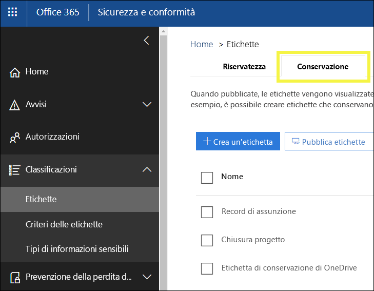
 
## <a name="how-retention-labels-work-with-label-policies"></a><span data-ttu-id="9ddb3-132">Funzionamento delle etichette di conservazione con i criteri di etichetta</span><span class="sxs-lookup"><span data-stu-id="9ddb3-132">How retention labels work with label policies</span></span>

<span data-ttu-id="9ddb3-p107">Rendere disponibili le etichette di conservazione agli utenti dell'organizzazione in modo che possano classificare il contenuto è un processo in due passaggi. Il primo consiste nel creare le etichette, il secondo nel pubblicarle nelle posizioni scelte. Quando si pubblicano le etichette di conservazione, vengono creati criteri di etichetta.</span><span class="sxs-lookup"><span data-stu-id="9ddb3-p107">Making retention labels available to people in your organization so that they can classify content is a two-step process: first you create the labels, and then you publish them to the locations you choose. When you publish retention labels, a label policy gets created.</span></span>
  
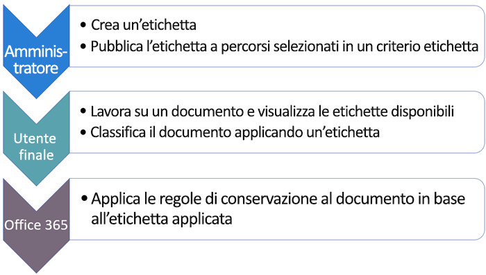
  
<span data-ttu-id="9ddb3-p108">Le etichette di conservazione sono blocchi predefiniti indipendenti e riutilizzabili che vengono inclusi in un criterio di etichetta e pubblicati in posizioni diverse. Le etichette di conservazione possono essere riutilizzate in più criteri. Lo scopo principale di un criterio di etichetta è raggruppare un set di etichette di conservazione e specificare le posizioni in cui si desidera che vengano visualizzate.</span><span class="sxs-lookup"><span data-stu-id="9ddb3-p108">Retention labels are independent, reusable building blocks that are included in a label policy and published to different locations. Retention labels can be reused across many policies. The primary purpose of the label policy is to group a set of retention labels and specify the locations where you want those labels to appear.</span></span>
  
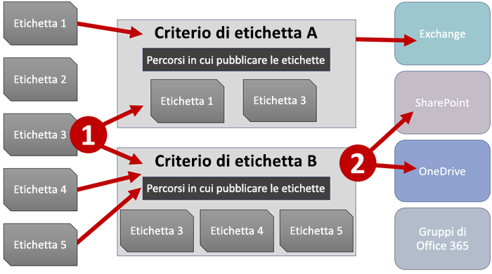
  
1. <span data-ttu-id="9ddb3-p109">Quando si pubblicano le etichette di conservazione, vengono incluse in criteri di etichetta. Una singola etichetta di conservazione può essere inclusa in molti criteri.</span><span class="sxs-lookup"><span data-stu-id="9ddb3-p109">When you publish retention labels, they're included in a label policy. A single retention label can be included in many policies.</span></span>
    
2. <span data-ttu-id="9ddb3-142">I criteri di etichetta specificano le posizioni di pubblicazione delle etichette di conservazione.</span><span class="sxs-lookup"><span data-stu-id="9ddb3-142">Label policies specify the locations to publish the retention labels.</span></span>
    
## <a name="only-one-retention-label-at-a-time"></a><span data-ttu-id="9ddb3-143">Solo un'etichetta di conservazione alla volta</span><span class="sxs-lookup"><span data-stu-id="9ddb3-143">Only one retention label at a time</span></span>

<span data-ttu-id="9ddb3-144">È importante tenere presente che a contenuti come un messaggio di posta elettronica o un documento è possibile assegnare una sola etichetta di conservazione alla volta:</span><span class="sxs-lookup"><span data-stu-id="9ddb3-144">It's important to know that content like an email or document can have only a single retention label assigned to it at a time:</span></span>
  
- <span data-ttu-id="9ddb3-145">Per le etichette assegnate manualmente dagli utenti finali, è possibile rimuovere o cambiare l'etichetta di conservazione assegnata.</span><span class="sxs-lookup"><span data-stu-id="9ddb3-145">For labels assigned manually by end users, people can remove or change the retention label that's assigned.</span></span>
    
- <span data-ttu-id="9ddb3-146">Se al contenuto è assegnata un'etichetta applicata automaticamente, questa può essere sostituita da un'etichetta di conservazione assegnata manualmente da un utente finale.</span><span class="sxs-lookup"><span data-stu-id="9ddb3-146">If content has an auto-apply label assigned, an auto-apply label can be replaced by a retention label assigned manually by an end user.</span></span>
    
- <span data-ttu-id="9ddb3-147">Se al contenuto è assegnata un'etichetta di conservazione applicata manualmente da un utente finale, questa non può essere sostituita da un'etichetta di conservazione applicata automaticamente.</span><span class="sxs-lookup"><span data-stu-id="9ddb3-147">If content has a retention label assigned manually by an end user, an auto-apply label cannot replace the manually assigned retention label.</span></span>
    
- <span data-ttu-id="9ddb3-148">Se sono presenti più regole che assegnano automaticamente un'etichetta e il contenuto soddisfa le condizioni di più regole, viene assegnata l'etichetta di conservazione della regola meno recente.</span><span class="sxs-lookup"><span data-stu-id="9ddb3-148">If there are multiple rules that assign an auto-apply label and content meets the conditions of multiple rules, the retention label for the oldest rule is assigned.</span></span>
    
<span data-ttu-id="9ddb3-p110">Le etichette assegnate manualmente vengono assegnate in modo esplicito, mentre le etichette applicate automaticamente vengono assegnate in modo implicito. Un'etichetta di conservazione esplicita ha la precedenza su un'etichetta implicita. Per altre informazioni, vedere la sezione [Principi di conservazione o criteri per determinare la precedenza](labels.md#principles), più avanti.</span><span class="sxs-lookup"><span data-stu-id="9ddb3-p110">Manually assigned labels are explicitly assigned; auto-apply labels are implicitly assigned; an explicit retention label takes precedence over an implicit label. For more information, see the below section on [The principles of retention, or what takes precedence?](labels.md#principles).</span></span>

<span data-ttu-id="9ddb3-p111">Le informazioni contenute in questa sezione si applicano solo alle etichette di conservazione. Si noti che, in aggiunta a un’etichetta di conservazione, è possibile applicare a un contenuto anche un’etichetta di riservatezza.</span><span class="sxs-lookup"><span data-stu-id="9ddb3-p111">All of the information in this section applies only to retention labels. Note that an item of content can also have one sensitivity label applied to it, in addition to one retention label.</span></span>
  
## <a name="how-long-it-takes-for-retention-labels-to-take-effect"></a><span data-ttu-id="9ddb3-153">Tempo necessario per l'applicazione delle etichette di conservazione</span><span class="sxs-lookup"><span data-stu-id="9ddb3-153">How long it takes for retention labels to take effect</span></span>

<span data-ttu-id="9ddb3-154">Quando si pubblicano o si applicano automaticamente le etichette di conservazione, queste non hanno effetto immediato:</span><span class="sxs-lookup"><span data-stu-id="9ddb3-154">When you publish or auto-apply retention labels, they don't take effect immediately:</span></span>
  
1. <span data-ttu-id="9ddb3-155">Per prima cosa i criteri di etichetta devono essere sincronizzati dal Centro sicurezza e conformità alle posizioni indicate nei criteri.</span><span class="sxs-lookup"><span data-stu-id="9ddb3-155">First the label policy needs to be synced from the Security &amp; Compliance Center to the locations in the policy.</span></span>
    
2. <span data-ttu-id="9ddb3-p112">Quindi, la posizione potrebbe richiedere del tempo per rendere disponibili le etichette manuali agli utenti finali o per applicare automaticamente etichette al contenuto. Il tempo necessario dipende dalla posizione e dal tipo di etichetta.</span><span class="sxs-lookup"><span data-stu-id="9ddb3-p112">Then the location may require time to make manual labels available to end users or auto-apply labels to content. How long this takes depends on the location and type of label.</span></span>
    
### <a name="manual-retention-labels"></a><span data-ttu-id="9ddb3-158">Etichette di conservazione manuali</span><span class="sxs-lookup"><span data-stu-id="9ddb3-158">Manual retention labels</span></span>

<span data-ttu-id="9ddb3-p113">Se si pubblicano etichette di conservazione in SharePoint o OneDrive, può essere necessario un giorno perché le etichette di conservazione siano visibili agli utenti finali. Se si pubblicano etichette di conservazione in Exchange, possono essere necessari 7 giorni perché le etichette di conservazione siano visibili agli utenti finali, inoltre la cassetta postale deve contenere almeno 10 MB di dati.</span><span class="sxs-lookup"><span data-stu-id="9ddb3-p113">If you publish retention labels to SharePoint or OneDrive, it can take one day for those retention labels to appear for end users. In addition, if you publish retention labels to Exchange, it can take 7 days for those retention labels to appear for end users, and the mailbox needs to contain at least 10 MB of data.</span></span>
  
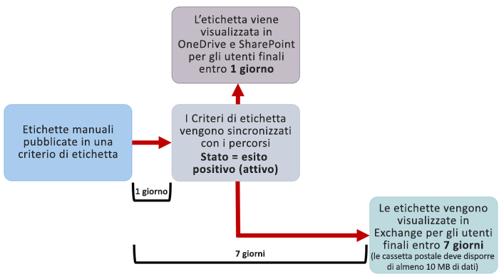
  
### <a name="auto-apply-retention-labels"></a><span data-ttu-id="9ddb3-162">Applicare automaticamente etichette di conservazione</span><span class="sxs-lookup"><span data-stu-id="9ddb3-162">Auto-apply retention labels</span></span>

<span data-ttu-id="9ddb3-163">In caso di applicazione automatica di etichette di conservazione ai contenuti che soddisfano condizioni specifiche, possono essere necessari 7 giorni prima che le etichette di conservazione vengano applicate a tutto il contenuto che soddisfa le condizioni.</span><span class="sxs-lookup"><span data-stu-id="9ddb3-163">If you auto-apply retention labels to content matching specific conditions, it can take seven days for the retention labels to be applied to all content that matches the conditions.</span></span>
  
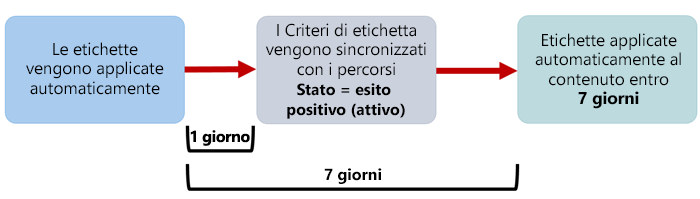
  
### <a name="how-to-check-on-the-status-of-exchange-labels"></a><span data-ttu-id="9ddb3-165">Come verificare lo stato delle etichette di Exchange</span><span class="sxs-lookup"><span data-stu-id="9ddb3-165">How to check on the status of Exchange labels</span></span>

<span data-ttu-id="9ddb3-p114">In Exchange Online le etichette di conservazione vengono rese disponibili agli utenti finali mediante un processo eseguito ogni sette giorni. Usando Powershell è possibile vedere quando è stato eseguito per l'ultima volta questo processo e quindi stabilire quando verrà eseguito nuovamente.</span><span class="sxs-lookup"><span data-stu-id="9ddb3-p114">In Exchange Online, retention labels are made available to end users by a process that runs every seven days. By using Powershell, you can see when this process last ran and thus determine when it will run again.</span></span>
  
1. <span data-ttu-id="9ddb3-168">[Connettersi a Exchange Online PowerShell](https://go.microsoft.com/fwlink/?linkid=799773).</span><span class="sxs-lookup"><span data-stu-id="9ddb3-168">[Connect to Exchange Online PowerShell](https://go.microsoft.com/fwlink/?linkid=799773).</span></span>
    
2. <span data-ttu-id="9ddb3-169">Eseguire questi comandi.</span><span class="sxs-lookup"><span data-stu-id="9ddb3-169">Run these commands.</span></span>
    
  ```
  $logProps = Export-MailboxDiagnosticLogs <user> -ExtendedProperties
  ```

  ```
  $xmlprops = [xml]($logProps.MailboxLog)
  ```

  ```
  $xmlprops.Properties.MailboxTable.Property | ? {$_.Name -like "ELC*"}
  ```

<span data-ttu-id="9ddb3-p115">Nei risultati, la proprietà`ELCLastSuccessTimeStamp` (UTC) mostra quando il sistema ha elaborato la casetta postale per l'ultima volta. Se questa operazione non è stata eseguita da quando è stato creato il criterio, le etichette non verranno visualizzate. Per forzare l'elaborazione, eseguire `Start-ManagedFolderAssistant -Identity <user>`.</span><span class="sxs-lookup"><span data-stu-id="9ddb3-p115">In the results, the  `ELCLastSuccessTimeStamp` (UTC) property shows when the system last processed your mailbox. If it has not happened since the time you created the policy, the labels are not going to appear. To force processing, run  `Start-ManagedFolderAssistant -Identity <user>`.</span></span>
    
<span data-ttu-id="9ddb3-173">Se le etichette non compaiono in Outlook sul web e si ritiene che invece debbano comparire, svuotare la cache del browser (CTRL+F5).</span><span class="sxs-lookup"><span data-stu-id="9ddb3-173">If labels aren't appearing in Outlook on the web and you think they should be, make sure to clear the cache in your browser (CTRL+F5).</span></span>
    
## <a name="label-policies-and-locations"></a><span data-ttu-id="9ddb3-174">Criteri per le etichette e posizioni</span><span class="sxs-lookup"><span data-stu-id="9ddb3-174">Label policies and locations</span></span>

<span data-ttu-id="9ddb3-175">È possibile pubblicare tipi di etichette di conservazione differenti in posizioni diverse, a seconda dell'azione eseguita dall'etichetta di conservazione.</span><span class="sxs-lookup"><span data-stu-id="9ddb3-175">Different types of retention labels can be published to different locations, depending on what the retention label does.</span></span>
  
|<span data-ttu-id="9ddb3-176">**Se l'etichetta di conservazione è...**</span><span class="sxs-lookup"><span data-stu-id="9ddb3-176">**If the retention label is…**</span></span>|<span data-ttu-id="9ddb3-177">**Il criterio di etichetta può essere applicato a…**</span><span class="sxs-lookup"><span data-stu-id="9ddb3-177">**Then the label policy can be applied to…**</span></span>|
|:-----|:-----|
|<span data-ttu-id="9ddb3-178">Pubblicata agli utenti finali</span><span class="sxs-lookup"><span data-stu-id="9ddb3-178">Published to end users</span></span>  <br/> |<span data-ttu-id="9ddb3-179">Exchange, SharePoint, OneDrive, gruppi di Office 365</span><span class="sxs-lookup"><span data-stu-id="9ddb3-179">Exchange, SharePoint, OneDrive, Office 365 groups</span></span>  <br/> |
|<span data-ttu-id="9ddb3-180">Applicata automaticamente in base ai tipi di informazioni riservate</span><span class="sxs-lookup"><span data-stu-id="9ddb3-180">Auto-applied based on sensitive information types</span></span>  <br/> |<span data-ttu-id="9ddb3-181">Exchange (solo a tutte le cassette postali), SharePoint, OneDrive</span><span class="sxs-lookup"><span data-stu-id="9ddb3-181">Exchange (all mailboxes only), SharePoint, OneDrive</span></span>  <br/> |
|<span data-ttu-id="9ddb3-182">Applicata automaticamente in base a una query</span><span class="sxs-lookup"><span data-stu-id="9ddb3-182">Auto-applied based on a query</span></span>  <br/> |<span data-ttu-id="9ddb3-183">Exchange, SharePoint, OneDrive, gruppi di Office 365</span><span class="sxs-lookup"><span data-stu-id="9ddb3-183">Exchange, SharePoint, OneDrive, Office 365 groups</span></span>  <br/> |
   
<span data-ttu-id="9ddb3-p116">Le etichette di conservazione applicate automaticamente in Exchange (sia per le query che per i tipi di informazioni riservate) vengono applicate solo ai messaggi inviati di recente (dati in transito), non a tutti gli elementi attualmente nella cassetta postale (dati inattivi). Inoltre, le etichette di conservazione applicate automaticamente per i tipi di informazioni riservate possono essere applicate solo a tutte le cassette postali, non a cassette postali specifiche.</span><span class="sxs-lookup"><span data-stu-id="9ddb3-p116">Note that in Exchange, auto-apply retention labels (for both queries and sensitive information types) are applied only to messages newly sent (data in transit), not to all items currently in the mailbox (data at rest). Also, auto-apply retention labels for sensitive information types can apply only to all mailboxes; you can't select the specific mailboxes.</span></span>
  
<span data-ttu-id="9ddb3-186">Si noti che le cartelle pubbliche di Exchange e Skype non supportano le etichette.</span><span class="sxs-lookup"><span data-stu-id="9ddb3-186">Note that Exchange public folders and Skype do not support labels.</span></span>
  
## <a name="how-retention-labels-enforce-retention"></a><span data-ttu-id="9ddb3-187">Modalità di applicazione della conservazione da parte delle etichette di conservazione</span><span class="sxs-lookup"><span data-stu-id="9ddb3-187">How retention labels enforce retention</span></span>

<span data-ttu-id="9ddb3-p117">Le etichette di conservazione possono applicare esattamente le stesse azioni di conservazione dei criteri di conservazione. Si possono usare le etichette di conservazione per implementare un piano contenuti (o un piano file) sofisticato. Per altre informazioni sul funzionamento della conservazione, vedere [Panoramica dei criteri di conservazione](retention-policies.md).</span><span class="sxs-lookup"><span data-stu-id="9ddb3-p117">Retention labels can enforce exactly the same retention actions that a retention policy can. You can use retention labels to implement a sophisticated content plan (or file plan). For more information on how retention works, see [Overview of retention policies](retention-policies.md).</span></span>
  
<span data-ttu-id="9ddb3-p118">Inoltre, un'etichetta di conservazione ha due opzioni di conservazione che sono disponibili solo in un'etichetta di conservazione e non in un criterio di conservazione. Con un'etichetta di conservazione, è possibile:</span><span class="sxs-lookup"><span data-stu-id="9ddb3-p118">In addition, a retention label has two retention options that are available only in a retention label and not in a retention policy. With a retention label, you can:</span></span>
  
- <span data-ttu-id="9ddb3-p119">Attivare una revisione per l'eliminazione alla fine del periodo di conservazione, in modo che venga impostata una revisione obbligatoria dei documenti di SharePoint e OneDrive prima che vengano eliminati. Per altre informazioni, vedere [Panoramica delle revisioni per l'eliminazione](disposition-reviews.md).</span><span class="sxs-lookup"><span data-stu-id="9ddb3-p119">Trigger a disposition review at the end of the retention period, so that SharePoint and OneDrive documents must be reviewed before they can be deleted. For more information, see [Overview of disposition reviews](disposition-reviews.md).</span></span>
    
- <span data-ttu-id="9ddb3-195">Iniziare il periodo di conservazione dal momento in cui il contenuto è stato etichettato invece che in base all'età o alla data dell'ultima modifica.</span><span class="sxs-lookup"><span data-stu-id="9ddb3-195">Start the retention period from when the content was labeled, instead of the age of the content or when it was last modified.</span></span>
    
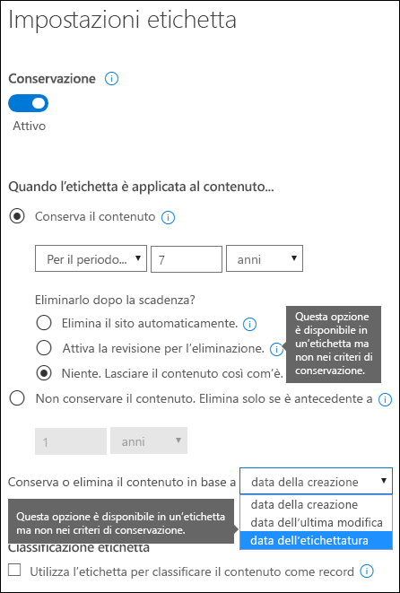
  
## <a name="where-published-retention-labels-can-appear-to-end-users"></a><span data-ttu-id="9ddb3-197">Posizioni in cui è possibile visualizzare le etichette di conservazione pubblicate agli utenti finali</span><span class="sxs-lookup"><span data-stu-id="9ddb3-197">Where published retention labels can appear to end users</span></span>

<span data-ttu-id="9ddb3-198">Se l'etichetta di conservazione verrà assegnata al contenuto dagli utenti finali, è possibile pubblicarla in:</span><span class="sxs-lookup"><span data-stu-id="9ddb3-198">If your retention label will be assigned to content by end users, you can publish it to:</span></span>
  
- <span data-ttu-id="9ddb3-199">Outlook sul web</span><span class="sxs-lookup"><span data-stu-id="9ddb3-199">Outlook on the web</span></span>
    
- <span data-ttu-id="9ddb3-200">Outlook 2010 e versioni successive</span><span class="sxs-lookup"><span data-stu-id="9ddb3-200">Outlook 2010 and later</span></span>
    
- <span data-ttu-id="9ddb3-201">OneDrive</span><span class="sxs-lookup"><span data-stu-id="9ddb3-201">OneDrive</span></span>
    
- <span data-ttu-id="9ddb3-202">SharePoint</span><span class="sxs-lookup"><span data-stu-id="9ddb3-202">SharePoint</span></span>
    
- <span data-ttu-id="9ddb3-203">Gruppi di Office 365 (sia nel sito del gruppo che nella cassetta postale del gruppo in Outlook sul web)</span><span class="sxs-lookup"><span data-stu-id="9ddb3-203">Office 365 groups (both the group site and group mailbox in Outlook on the web)</span></span>
    
<span data-ttu-id="9ddb3-204">Le sezioni seguenti mostrano il modo in cui le etichette verranno visualizzate agli utenti dell'organizzazione in app diverse.</span><span class="sxs-lookup"><span data-stu-id="9ddb3-204">The sections below show how labels will appear in different apps to people in your organization.</span></span>
  
### <a name="outlook-on-the-web"></a><span data-ttu-id="9ddb3-205">Outlook sul web</span><span class="sxs-lookup"><span data-stu-id="9ddb3-205">Outlook on the web</span></span>

<span data-ttu-id="9ddb3-206">Per assegnare un'etichetta a un elemento in Outlook sul web, fare clic con il pulsante destro del mouse sull'elemento\> **Assegna criteri** \> scegliere l'etichetta di conservazione.</span><span class="sxs-lookup"><span data-stu-id="9ddb3-206">To label an item in Outlook on the web, right-click the item \> **Assign policy** \> choose the retention label.</span></span> 
  
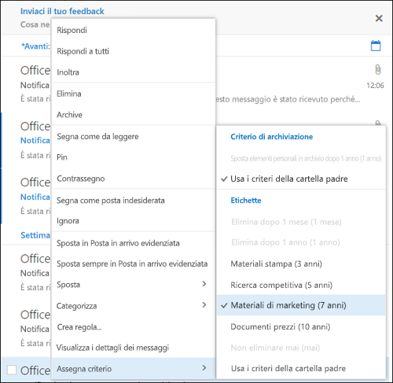
  
<span data-ttu-id="9ddb3-p120">Una volta applicata, l'etichetta di conservazione può essere visualizzata insieme all'azione che esegue nella parte superiore dell'elemento. Se un messaggio di posta elettronica viene classificato ed è associato a un periodo di conservazione, con una rapida occhiata se ne conoscerà la data di scadenza.</span><span class="sxs-lookup"><span data-stu-id="9ddb3-p120">After the retention label is applied, you can view that retention label and what action it takes at the top of the item. If an email is classified and has an associated retention period, you can know at a glance when the email will expire.</span></span>
  

  
<span data-ttu-id="9ddb3-211">È anche possibile applicare etichette di conservazione a cartelle. In questo caso:</span><span class="sxs-lookup"><span data-stu-id="9ddb3-211">You can also apply retention labels to folders, in which case:</span></span>
  
- <span data-ttu-id="9ddb3-p121">Tutti gli elementi nella cartella ricevono automaticamente la stessa etichetta di conservazione **tranne** gli elementi ai quali è stata applicata esplicitamente un'etichetta di conservazione. Gli elementi etichettati esplicitamente mantengono l'etichetta di conservazione esistente. Per altre informazioni, vedere la sezione sui principi di conservazione più avanti.</span><span class="sxs-lookup"><span data-stu-id="9ddb3-p121">All items in the folder automatically get the same retention label, **except** for items that have had a retention label applied explicitly to them. Explicitly labeled items keep their existing retention label. For more information, see the below section on the principles of retention.</span></span> 
    
- <span data-ttu-id="9ddb3-215">Se si modifica o si rimuove l'etichetta di conservazione predefinita per una cartella, l'etichetta viene modificata o rimossa anche da tutti gli elementi nella cartella **tranne** che dagli elementi con etichette di conservazione esplicite.</span><span class="sxs-lookup"><span data-stu-id="9ddb3-215">If you change or remove the default retention label for a folder, the retention label's also changed or removed for all items in the folder, **except** items with explicit retention labels.</span></span> 
    
- <span data-ttu-id="9ddb3-216">Se si sposta un elemento con un'etichetta di conservazione predefinita da una cartella a un'altra cartella con un'etichetta di conservazione predefinita diversa, l'elemento riceverà la nuova etichetta di conservazione predefinita.</span><span class="sxs-lookup"><span data-stu-id="9ddb3-216">If you move an item with a default retention label from one folder to another folder with a different default retention label, the item will get the new default retention label.</span></span>
    
- <span data-ttu-id="9ddb3-217">Se si sposta un elemento con un'etichetta di conservazione predefinita da una cartella a un'altra cartella senza alcuna etichetta di conservazione predefinita, l’etichetta di conservazione precedente è rimossa.</span><span class="sxs-lookup"><span data-stu-id="9ddb3-217">If you move an item with a default retention label from one folder to another folder with no default retention label, the old default retention label is removed.</span></span>
    
### <a name="outlook-2010-and-later"></a><span data-ttu-id="9ddb3-218">Outlook 2010 e versioni successive</span><span class="sxs-lookup"><span data-stu-id="9ddb3-218">Outlook 2010 and later</span></span>

<span data-ttu-id="9ddb3-219">Per assegnare un'etichetta a un elemento in Outlook sul web, fare clic con il pulsante destro del mouse sull'elemento \> sulla **barra multifunzione** \> **Assegna criteri** \>scegliere l'etichetta di conservazione.</span><span class="sxs-lookup"><span data-stu-id="9ddb3-219">To label an item in Outlook on the web, right-click the item \> on the **Ribbon** \> **Assign Policy** \> choose the retention label.</span></span> 
  
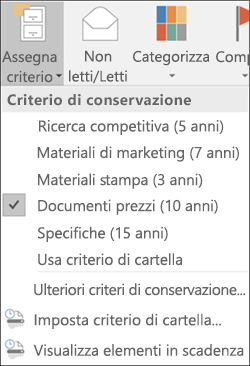
  
<span data-ttu-id="9ddb3-p122">Una volta applicata, l'etichetta di conservazione può essere visualizzata insieme all'azione che esegue nella parte superiore dell'elemento. Se un messaggio di posta elettronica viene classificato ed è associato a un periodo di conservazione, con una rapida occhiata se ne conoscerà la data di scadenza.</span><span class="sxs-lookup"><span data-stu-id="9ddb3-p122">After the retention label is applied, you can view that retention label and what action it takes at the top of the item. If an email is classified and has an associated retention period, you can know at a glance when the email will expire.</span></span>
  
<span data-ttu-id="9ddb3-p123">È anche possibile applicare etichette di conservazione a cartelle. Questa operazione funziona allo stesso modo in Outlook 2010 e versioni successive e in Outlook sul web. Per altre informazioni, vedere la sezione precedente.</span><span class="sxs-lookup"><span data-stu-id="9ddb3-p123">You can also apply retention labels to folders. This works the same in Outlook 2010 and later as it does in Outlook on the web -- see the previous section for more info.</span></span>
  
### <a name="onedrive-and-sharepoint"></a><span data-ttu-id="9ddb3-225">OneDrive e SharePoint</span><span class="sxs-lookup"><span data-stu-id="9ddb3-225">OneDrive and SharePoint</span></span>

<span data-ttu-id="9ddb3-226">Per assegnare un'etichetta a un documento (inclusi i file di OneNote) in OneDrive o SharePoint, selezionare l'elemento \> nell'angolo in alto a destra, scegliere **Apri il riquadro dei dettagli** \> **Applica etichetta** \>scegliere l'etichetta di conservazione.</span><span class="sxs-lookup"><span data-stu-id="9ddb3-226">To label a document (including OneNote files) in OneDrive or SharePoint, select the item \> in the upper-right corner, choose **Open the details pane** \> **Apply label** \> choose the retention label.</span></span> 
  
<span data-ttu-id="9ddb3-227">È possibile applicare un'etichetta di conservazione anche a un set di cartelle o di documenti e si può impostare un'etichetta di conservazione predefinita per una raccolta documenti. Per altre informazioni, vedere la sezione seguente.</span><span class="sxs-lookup"><span data-stu-id="9ddb3-227">Note that you can also apply a retention label to a folder or document set, and you can set a default retention label for a document library - see the section below for more information.</span></span>
  
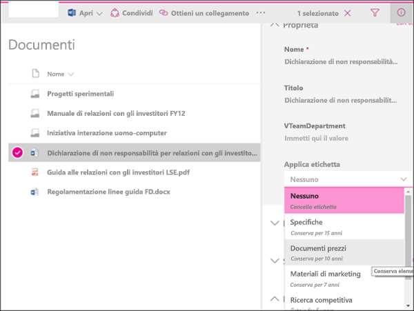
  
<span data-ttu-id="9ddb3-229">Dopo l'applicazione di un'etichetta di conservazione a un elemento, è possibile visualizzarla nel riquadro dei dettagli quando l'elemento viene selezionato.</span><span class="sxs-lookup"><span data-stu-id="9ddb3-229">After a retention label is applied to an item, you can view it in the details pane when that item's selected.</span></span>
  
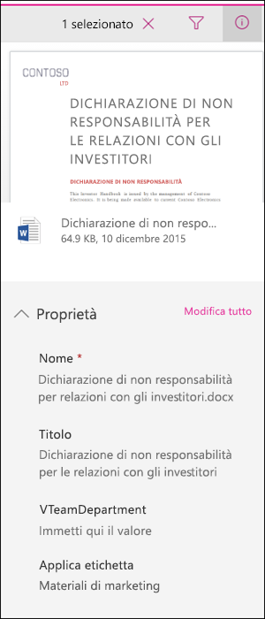
  
<span data-ttu-id="9ddb3-p124">È anche possibile creare una visualizzazione della raccolta che contenga la colonna **Etichette** o la colonna **L'elemento è un record**, in modo da poter vedere a colpo d'occhio le etichette di conservazione assegnate a tutti gli elementi e quali elementi sono record. Tuttavia, non è possibile filtrare la visualizzazione per la colonna **L'elemento è un record**.</span><span class="sxs-lookup"><span data-stu-id="9ddb3-p124">You can also create a view of the library that contains the **Labels** column or **Item is a Record** column, so that you can see at a glance the retention labels assigned to all items and which items are records. Note, however, that you can't filter the view by the **Item is a Record** column.</span></span> 
  
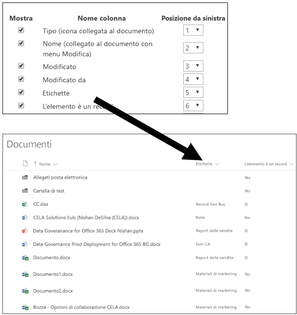
  
### <a name="office-365-groups"></a><span data-ttu-id="9ddb3-234">Gruppi di Office 365</span><span class="sxs-lookup"><span data-stu-id="9ddb3-234">Office 365 groups</span></span>

<span data-ttu-id="9ddb3-p125">Quando si pubblicano etichette di conservazione in un gruppo di Office 365, le etichette di conservazione vengono visualizzate sia nel sito del gruppo che nella cassetta postale del gruppo in Outlook sul web. L'esperienza di applicazione di un'etichetta di conservazione al contenuto è identica a quella illustrata in precedenza per posta elettronica e documenti.</span><span class="sxs-lookup"><span data-stu-id="9ddb3-p125">When you publish retention labels to an Office 365 group, the retention labels appear in both the group site and group mailbox in Outlook on the web. The experience of applying a retention label to content is identical to that shown above for email and documents.</span></span>
  
## <a name="applying-a-retention-label-automatically-based-on-conditions"></a><span data-ttu-id="9ddb3-237">Applicazione automatica di un'etichetta di conservazione in base alle condizioni</span><span class="sxs-lookup"><span data-stu-id="9ddb3-237">Applying a retention label automatically based on conditions</span></span>

<span data-ttu-id="9ddb3-p126">Una delle funzionalità più efficaci delle etichette di conservazione è la possibilità di applicarle automaticamente al contenuto che soddisfa determinate condizioni. In questo caso, gli utenti dell'organizzazione non dovranno applicare le etichette di conservazione, perché Office 365 lo farà al loro posto.</span><span class="sxs-lookup"><span data-stu-id="9ddb3-p126">One of the most powerful features of retention labels is the ability to apply them automatically to content that matches certain conditions. In this case, people in your organization don't need to apply the retention labels - Office 365 does the work for them.</span></span>
  
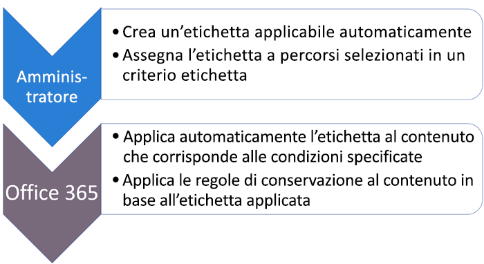
  
<span data-ttu-id="9ddb3-241">Le etichette di conservazione applicate automaticamente sono potenti perché:</span><span class="sxs-lookup"><span data-stu-id="9ddb3-241">Auto-apply retention labels are powerful because:</span></span>
  
- <span data-ttu-id="9ddb3-242">Non è necessario formare gli utenti su tutte le classificazioni.</span><span class="sxs-lookup"><span data-stu-id="9ddb3-242">You don't need to train your users on all of your classifications.</span></span>
    
- <span data-ttu-id="9ddb3-243">Non è necessario affidarsi solo agli utenti per la classificazione corretta di tutto il contenuto.</span><span class="sxs-lookup"><span data-stu-id="9ddb3-243">You don't need to rely on users to classify all content correctly.</span></span>
    
- <span data-ttu-id="9ddb3-244">Gli utenti non hanno più bisogno di conoscere i criteri di governance dai dati e possono concentrarsi sul loro lavoro.</span><span class="sxs-lookup"><span data-stu-id="9ddb3-244">Users no longer need to know about data governance policies - they can focus on their work.</span></span>
    
<span data-ttu-id="9ddb3-245">È possibile scegliere di applicare automaticamente etichette di conservazione al contenuto quando questo contiene:</span><span class="sxs-lookup"><span data-stu-id="9ddb3-245">You can choose to apply retention labels to content automatically when that content contains:</span></span>
  
- <span data-ttu-id="9ddb3-246">Tipi specifici di informazioni riservate.</span><span class="sxs-lookup"><span data-stu-id="9ddb3-246">Specific types of sensitive information.</span></span>
    
- <span data-ttu-id="9ddb3-247">Parole chiave specifiche che corrispondono a una query creata.</span><span class="sxs-lookup"><span data-stu-id="9ddb3-247">Specific keywords that match a query you create.</span></span>
    
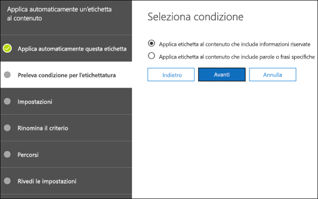
  
<span data-ttu-id="9ddb3-249">Si noti che per l'applicazione automatica delle etichette di conservazione è necessario un abbonamento a Office 365 Enterprise E5 e che possono essere necessari fino a sette giorni per l'applicazione automatica delle etichette di conservazione a tutto il contenuto che soddisfa le condizioni, come illustrato in precedenza.</span><span class="sxs-lookup"><span data-stu-id="9ddb3-249">Note that auto-apply retention labels require an Office 365 Enterprise E5 subscription, and that it can take up to seven days for auto-apply retention labels to be applied to all content that matches the conditions, as described above.</span></span>
  
### <a name="auto-apply-retention-labels-to-content-with-specific-types-of-sensitive-information"></a><span data-ttu-id="9ddb3-250">Applicare automaticamente etichette di conservazione al contenuto con tipi specifici di informazioni riservate</span><span class="sxs-lookup"><span data-stu-id="9ddb3-250">Auto-apply retention labels to content with specific types of sensitive information</span></span>

<span data-ttu-id="9ddb3-p127">Quando si creano etichette di conservazione ad applicazione automatica per le informazioni riservate, viene visualizzato lo stesso elenco di modelli di criteri mostrato quando si creano criteri di prevenzione della perdita dei dati (DLP). Ogni modello di criteri è preconfigurato in modo da cercare tipi specifici di informazioni riservate. Ad esempio, il modello illustrato di seguito cerca codici identificativi del singolo contribuente (ITIN), codici di previdenza sociale (SSN) e numeri di passaporto statunitensi. Per altre informazioni sui criteri DLP, vedere [Panoramica dei criteri di prevenzione della perdita dei dati](data-loss-prevention-policies.md).</span><span class="sxs-lookup"><span data-stu-id="9ddb3-p127">When you create auto-apply retention labels for sensitive information, you see the same list of policy templates as when you create a data loss prevention (DLP) policy. Each policy template is preconfigured to look for specific types of sensitive information - for example, the template shown here looks for U.S. ITIN, SSN, and passport numbers. To learn more about DLP, see [Overview of data loss prevention policies](data-loss-prevention-policies.md).</span></span>
  
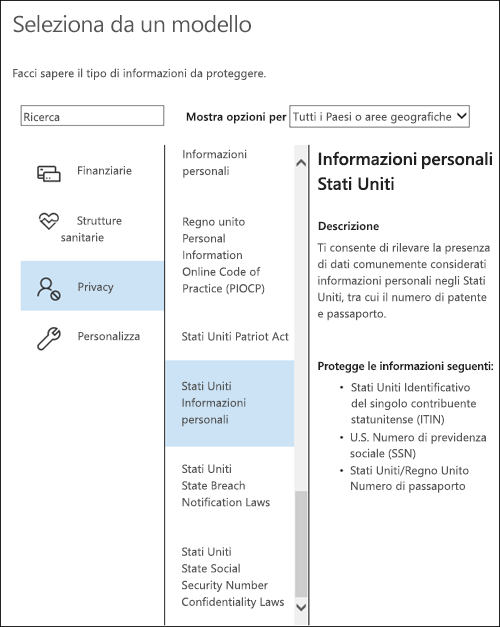
  
<span data-ttu-id="9ddb3-p128">Dopo aver selezionato un modello di criteri, è possibile aggiungere o rimuovere qualunque tipo di informazioni riservate e modificare il numero di istanze e l'accuratezza della corrispondenza. Nell'esempio mostrato di seguito, verrà applicata automaticamente un'etichetta di conservazione solo quando:</span><span class="sxs-lookup"><span data-stu-id="9ddb3-p128">After you select a policy template, you can add or remove any types of sensitive information, and you can change the instance count and match accuracy. In the example shown here, a retention label will be auto-applied only when:</span></span>
  
- <span data-ttu-id="9ddb3-p129">Il contenuto include tra 1 e 9 istanze di qualsiasi di tipo di informazioni riservate. È possibile eliminare il valore **max** in modo che diventi **qualsiasi**.</span><span class="sxs-lookup"><span data-stu-id="9ddb3-p129">The content contains between 1 and 9 instances of any of these three sensitive information types. You can delete the **max** value so that it changes to **any**.</span></span>
    
- <span data-ttu-id="9ddb3-p130">Il tipo di informazioni riservate rilevate ha un'accuratezza della corrispondenza (o livello di attendibilità) di almeno 75. Molti tipi di informazioni riservate sono definiti con più criteri. I criteri con un livello di accuratezza della corrispondenza superiore richiedono l'individuazione di ulteriori elementi di prova (ad esempio parole chiave, date o indirizzi), mentre i criteri con un livello di accuratezza della corrispondenza inferiore richiedono meno elementi di prova. In parole povere, più basso è il valore di accuratezza della corrispondenza **min**, più facile sarà che il contenuto soddisfi la condizione.</span><span class="sxs-lookup"><span data-stu-id="9ddb3-p130">The type of sensitive information that's detected has a match accuracy (or confidence level) of at least 75. Many sensitive information types are defined with multiple patterns, where a pattern with a higher match accuracy requires more evidence to be found (such as keywords, dates, or addresses), while a pattern with a lower match accuracy requires less evidence. Simply put, the lower the **min** match accuracy, the easier it is for content to match the condition.</span></span> 
    
<span data-ttu-id="9ddb3-262">Per altre informazioni su queste opzioni, vedere [Tuning rules to make them easier or harder to match](data-loss-prevention-policies.md#tuning-rules-to-make-them-easier-or-harder-to-match) (Ottimizzazione delle regole per rendere più facile o difficile la corrispondenza).</span><span class="sxs-lookup"><span data-stu-id="9ddb3-262">For more information on these options, see [Tuning rules to make them easier or harder to match](data-loss-prevention-policies.md#tuning-rules-to-make-them-easier-or-harder-to-match).</span></span>
    
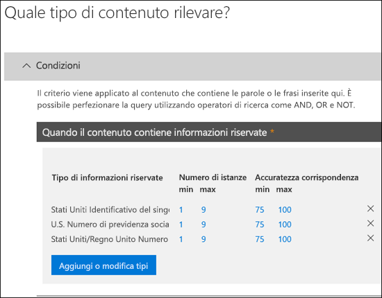
  
### <a name="auto-apply-labels-to-content-with-keywords-or-searchable-properties"></a><span data-ttu-id="9ddb3-264">Applicare automaticamente etichette al contenuto con parole chiave o con proprietà disponibili per le ricerche</span><span class="sxs-lookup"><span data-stu-id="9ddb3-264">Auto-apply labels to content with keywords or searchable properties</span></span>

<span data-ttu-id="9ddb3-p131">È possibile applicare automaticamente etichette al contenuto che soddisfa determinate condizioni. Le condizioni disponibili ora supportano l'applicazione di un'etichetta al contenuto che include parole, frasi, valori o proprietà disponibili per le ricerche specifiche. È possibile perfezionare la query usando operatori di ricerca come AND, OR e NOT.</span><span class="sxs-lookup"><span data-stu-id="9ddb3-p131">You can auto-apply labels to content that satisfies certain conditions. The conditions now available support applying a label to content that contains specific words, phrases, or values of searchable properties. You can refine your query by using search operators like AND, OR, and NOT.</span></span>

<span data-ttu-id="9ddb3-268">Per altre informazioni sulla sintassi della query, vedere:</span><span class="sxs-lookup"><span data-stu-id="9ddb3-268">For more information on query syntax, see:</span></span>

- [<span data-ttu-id="9ddb3-269">Riferimenti per la sintassi di Keyword Query Language (KQL)</span><span class="sxs-lookup"><span data-stu-id="9ddb3-269">Keyword Query Language (KQL) syntax reference</span></span>](https://docs.microsoft.com/it-IT/sharepoint/dev/general-development/keyword-query-language-kql-syntax-reference)

<span data-ttu-id="9ddb3-p132">Le etichette basate su query usano l’indice di ricerca per identificare il contenuto. Per altre informazioni sulle proprietà disponibili per la ricerca valide, vedere:</span><span class="sxs-lookup"><span data-stu-id="9ddb3-p132">Query-based labels use the search index to identify content. For more information on valid searchable properties, see:</span></span>

- [<span data-ttu-id="9ddb3-272">Query con parole chiave e condizioni di ricerca per la Ricerca contenuto</span><span class="sxs-lookup"><span data-stu-id="9ddb3-272">Keyword queries and search conditions for Content Search</span></span>](keyword-queries-and-search-conditions.md)
- [<span data-ttu-id="9ddb3-273">Panoramica delle proprietà gestite e sottoposte a ricerca per indicizzazione in SharePoint Server</span><span class="sxs-lookup"><span data-stu-id="9ddb3-273">Overview of crawled and managed properties in SharePoint Server</span></span>](https://docs.microsoft.com/it-IT/SharePoint/technical-reference/crawled-and-managed-properties-overview)

<span data-ttu-id="9ddb3-274">Esempi di query:</span><span class="sxs-lookup"><span data-stu-id="9ddb3-274">Examples queries:</span></span>

- <span data-ttu-id="9ddb3-275">Exchange</span><span class="sxs-lookup"><span data-stu-id="9ddb3-275">Exchange</span></span>
    - <span data-ttu-id="9ddb3-276">subject:"Quarterly Financials"</span><span class="sxs-lookup"><span data-stu-id="9ddb3-276">subject:"Quarterly Financials"</span></span>
    - <span data-ttu-id="9ddb3-277">recipients:garthf<!--nolink-->@contoso.com</span><span class="sxs-lookup"><span data-stu-id="9ddb3-277">recipients:garthf<!--nolink-->@contoso.com</span></span>
- <span data-ttu-id="9ddb3-278">SharePoint e OneDrive for Business</span><span class="sxs-lookup"><span data-stu-id="9ddb3-278">SharePoint and OneDrive for Business</span></span>
    - <span data-ttu-id="9ddb3-279">contenttype:contract</span><span class="sxs-lookup"><span data-stu-id="9ddb3-279">contenttype:contract</span></span>
    - <span data-ttu-id="9ddb3-280">site:https<!--nolink-->://contoso.sharepoint.com/sites/teams/procurement AND contenttype:contract</span><span class="sxs-lookup"><span data-stu-id="9ddb3-280">site:https<!--nolink-->://contoso.sharepoint.com/sites/teams/procurement AND contenttype:contract</span></span>

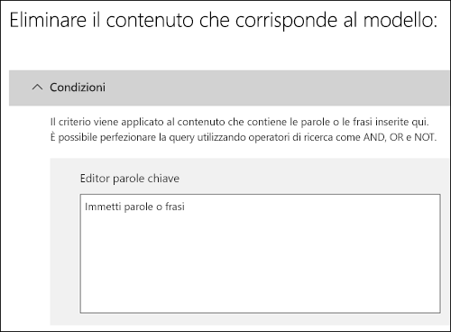

## <a name="applying-a-default-retention-label-to-all-content-in-a-sharepoint-library-folder-or-document-set"></a><span data-ttu-id="9ddb3-282">Applicazione di un'etichetta di conservazione predefinita a tutto il contenuto in una raccolta, una cartella o un set di documenti di SharePoint</span><span class="sxs-lookup"><span data-stu-id="9ddb3-282">Applying a default retention label to all content in a SharePoint library, folder, or document set</span></span>

<span data-ttu-id="9ddb3-283">Oltre a permettere agli utenti di applicare un'etichetta di conservazione a singoli documenti, è anche possibile applicare un'etichetta di conservazione predefinita a una raccolta, una cartella o un set di documenti di SharePoint, in modo che tutti i documenti in quella posizione ricevano l'etichetta di conservazione predefinita.</span><span class="sxs-lookup"><span data-stu-id="9ddb3-283">In addition to enabling people to apply a retention label to individual documents, you can also apply a default retention label to a SharePoint library, folder, or document set, so that all documents in that location get the default retention label.</span></span>
  
<span data-ttu-id="9ddb3-p133">Per una raccolta documenti, questa operazione viene eseguita nella pagina **Impostazioni raccolta** di una raccolta documenti. Quando si sceglie l'etichetta di conservazione predefinita, è anche possibile scegliere di applicarla a qualunque elemento esistente nella raccolta.</span><span class="sxs-lookup"><span data-stu-id="9ddb3-p133">For a document library, this is done on the **Library settings** page for a document library. When you choose the default retention label, you can also choose to apply it to any existing items in the library.</span></span> 
  
<span data-ttu-id="9ddb3-286">Ad esempio, se si ha un tag per il materiale di marketing e si sa che una specifica raccolta documenti conterrà solo quel tipo di contenuto, è possibile impostare il tag Materiali marketing come predefinito per tutti i documenti nella raccolta.</span><span class="sxs-lookup"><span data-stu-id="9ddb3-286">For example, if you have a tag for marketing materials, and you know a specific document library will contain only that type of content, you can make the Marketing Materials tag the default for all documents in that library.</span></span>
  
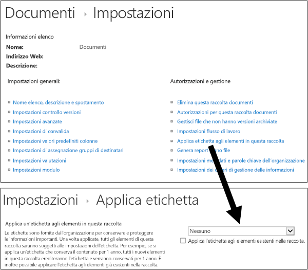
  
<span data-ttu-id="9ddb3-288">Se si applica un'etichetta di conservazione predefinita agli elementi esistenti nella raccolta, nella cartella o nel set di documenti:</span><span class="sxs-lookup"><span data-stu-id="9ddb3-288">If you apply a default retention label to existing items in the library, folder, or document set:</span></span>
  
- <span data-ttu-id="9ddb3-p134">Tutti gli elementi nella raccolta, nella cartella o nel set di documenti ricevono automaticamente la stessa etichetta di conservazione **tranne** gli elementi ai quali è stata applicata esplicitamente un'etichetta di conservazione. Gli elementi etichettati esplicitamente mantengono l'etichetta esistente. Per altre informazioni, vedere la sezione seguente [Principi di conservazione o criteri che determinano la precedenza](#the-principles-of-retention-or-what-takes-precedence).</span><span class="sxs-lookup"><span data-stu-id="9ddb3-p134">All items in the library, folder, or document set automatically get the same retention label, **except** for items that have had a retention label applied explicitly to them. Explicitly labeled items keep their existing label. For more information, see the below section on [The principles of retention, or what takes precedence?](#the-principles-of-retention-or-what-takes-precedence).</span></span>
    
- <span data-ttu-id="9ddb3-292">Se si modifica o si rimuove l'etichetta di conservazione predefinita per una raccolta, una cartella o un set di documenti, l'etichetta viene modificata o rimossa anche da tutti gli elementi nella raccolta, nella cartella o nel set di documenti **tranne** che dagli elementi con etichette di conservazione esplicite.</span><span class="sxs-lookup"><span data-stu-id="9ddb3-292">If you change or remove the default retention label for a library, folder, or document set, the retention label's also changed or removed for all items in the library, folder, or document set, **except** items with explicit retention labels.</span></span> 
    
- <span data-ttu-id="9ddb3-293">Se si sposta un elemento con un'etichetta di conservazione predefinita da una raccolta, una cartella o un set di documenti a un'altra raccolta, cartella o set di documenti, l'elemento mantiene l'etichetta di conservazione predefinita esistente anche se la nuova posizione ne ha una diversa.</span><span class="sxs-lookup"><span data-stu-id="9ddb3-293">If you move an item with a default retention label from one library, folder, or document set to another library, folder, or document set, the item keeps its existing default retention label, even if the new location has a different default retention label.</span></span>
    
## <a name="applying-a-retention-label-to-email-by-using-rules"></a><span data-ttu-id="9ddb3-294">Applicazione di un'etichetta di conservazione alla posta elettronica mediante regole</span><span class="sxs-lookup"><span data-stu-id="9ddb3-294">Applying a retention label to email by using rules</span></span>

<span data-ttu-id="9ddb3-295">In Outlook 2010 o versioni successive è possibile creare regole per applicare un'etichetta di conservazione o criteri di conservazione.</span><span class="sxs-lookup"><span data-stu-id="9ddb3-295">In Outlook 2010 or later, you can create rules to apply a retention label or retention policy.</span></span>
  
<span data-ttu-id="9ddb3-296">Ad esempio, si può creare una regola che applica un'etichetta di conservazione specifica a tutti i messaggi inviati a o da un particolare gruppo di distribuzione.</span><span class="sxs-lookup"><span data-stu-id="9ddb3-296">For example, you can create a rule that applies a specific retention label to all messages sent to or from a specific distribution group.</span></span>
  
<span data-ttu-id="9ddb3-297">Per creare una regola, fare clic su un elemento\> **Regole** \> **Crea regola** \> **Opzioni avanzate** \> **Creazione guidata regole** \> **Applica i criteri di conservazione.**.</span><span class="sxs-lookup"><span data-stu-id="9ddb3-297">To create a rule, right-click an item \> **Rules** \> **Create Rule** \> **Advanced Options** \> **Rules Wizard** \> **apply retention policy**.</span></span>
  
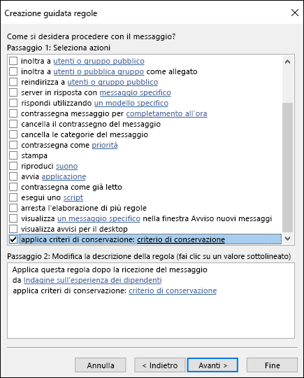
  
## <a name="classifying-content-without-applying-any-actions"></a><span data-ttu-id="9ddb3-299">Classificazione del contenuto senza applicazione di azioni</span><span class="sxs-lookup"><span data-stu-id="9ddb3-299">Classifying content without applying any actions</span></span>

<span data-ttu-id="9ddb3-p135">Quando si crea un'etichetta di conservazione, è possibile farlo senza attivare criteri di conservazione o altre azioni, come illustrato di seguito. In questo caso, si può usare un'etichetta di conservazione semplicemente come etichetta di testo, senza applicare azioni.</span><span class="sxs-lookup"><span data-stu-id="9ddb3-p135">When you create a retention label, you can do so without turning on any retention or other actions, as shown below. In this case, you can use a retention label simply as a text label, without enforcing any actions.</span></span>
  
<span data-ttu-id="9ddb3-302">Ad esempio, si può creare un'etichetta di conservazione denominata "Rivedere in un secondo momento" senza azioni e quindi applicarla automaticamente a contenuto con tipi di informazioni riservate o a contenuto in cui vengono eseguite query.</span><span class="sxs-lookup"><span data-stu-id="9ddb3-302">For example, you can create a retention label named "Review later" with no actions, and then auto-apply that retention label to content with sensitive information types or queried content.</span></span>
  
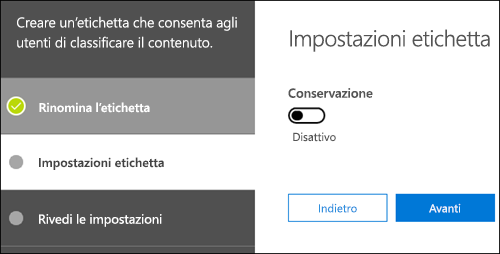
  
## <a name="using-retention-labels-for-records-management"></a><span data-ttu-id="9ddb3-304">Uso di etichette di conservazione per la gestione dei record</span><span class="sxs-lookup"><span data-stu-id="9ddb3-304">Using retention labels for records management</span></span>

<span data-ttu-id="9ddb3-305">A livello generale, la gestione dei record significa che:</span><span class="sxs-lookup"><span data-stu-id="9ddb3-305">At a high level, records management means that:</span></span>
  
- <span data-ttu-id="9ddb3-306">Gli utenti classificano il contenuto importante come record.</span><span class="sxs-lookup"><span data-stu-id="9ddb3-306">Important content is classified as a record by users.</span></span>
    
- <span data-ttu-id="9ddb3-307">Un record non può essere modificato o eliminato.</span><span class="sxs-lookup"><span data-stu-id="9ddb3-307">A record can't be modified or deleted.</span></span>
    
- <span data-ttu-id="9ddb3-308">I record vengono eliminati al termine della durata specificata.</span><span class="sxs-lookup"><span data-stu-id="9ddb3-308">Records are finally disposed of after their stated lifetime is past.</span></span>
    
<span data-ttu-id="9ddb3-p136">È possibile usare le etichette di conservazione per implementare un'unica strategia di gestione dei record coerente in Office 365. Altre funzionalità di gestione dei record, al contrario, ad esempio Centro record, si applicano solo al contenuto di SharePoint. È inoltre possibile applicare ai record azioni di conservazione, in modo che vengano eliminati automaticamente al termine del ciclo di vita.</span><span class="sxs-lookup"><span data-stu-id="9ddb3-p136">You can use retention labels to implement a single, consistent records-management strategy across Office 365, whereas other records-management features such as the Record Center apply only to SharePoint content. And you can enforce retention actions on records, so that they're disposed of automatically at the end of their lifecycle.</span></span>
  
<span data-ttu-id="9ddb3-311">Quando si crea un'etichetta di conservazione, si può scegliere di usarla per classificare il contenuto come record.</span><span class="sxs-lookup"><span data-stu-id="9ddb3-311">When you create a retention label, you have the option to use the retention label to classify the content as a record.</span></span>
  
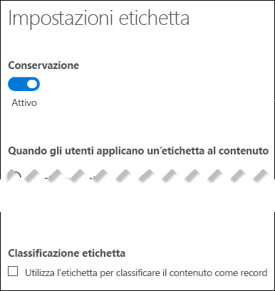
  
<span data-ttu-id="9ddb3-313">Quando un elemento viene classificato come record, si verificano i seguenti eventi:</span><span class="sxs-lookup"><span data-stu-id="9ddb3-313">When an item is labeled as a record, four things happen:</span></span>
  
- <span data-ttu-id="9ddb3-314">L'elemento non può essere eliminato definitivamente.</span><span class="sxs-lookup"><span data-stu-id="9ddb3-314">The item can't be permanently deleted.</span></span>
    
- <span data-ttu-id="9ddb3-315">L'elemento non può essere modificato.</span><span class="sxs-lookup"><span data-stu-id="9ddb3-315">The item can't be edited.</span></span>
    
- <span data-ttu-id="9ddb3-316">L'etichetta non può essere modificata.</span><span class="sxs-lookup"><span data-stu-id="9ddb3-316">The label can't be changed.</span></span>
    
- <span data-ttu-id="9ddb3-317">L'etichetta non può essere rimossa.</span><span class="sxs-lookup"><span data-stu-id="9ddb3-317">The label can't be removed.</span></span>
    
### <a name="who-can-classify-content-as-a-record"></a><span data-ttu-id="9ddb3-318">Chi può classificare il contenuto come record</span><span class="sxs-lookup"><span data-stu-id="9ddb3-318">Who can classify content as a record</span></span>

<span data-ttu-id="9ddb3-p137">Per il contenuto di SharePoint, qualsiasi utente del gruppo Membri predefinito (con livello di autorizzazione Collaborazione) può applicare un'etichetta di record al contenuto. Solo l'amministratore della raccolta siti può rimuovere o modificare questa etichetta di conservazione dopo che è stata applicata. Inoltre, un'etichetta di conservazione che classifica il contenuto come record può essere [applicata automaticamente al contenuto](#auto-apply-retention-labels).</span><span class="sxs-lookup"><span data-stu-id="9ddb3-p137">For SharePoint content, any user in the default Members group (the Contribute permission level) can apply a record label to content. Only the site collection administrator can remove or change that retention label after it's been applied. In addition, a retention label that classifies content as a record needs to be applied manually; it can't be auto-applied.</span></span>
  
### <a name="records-and-folders"></a><span data-ttu-id="9ddb3-322">Record e cartelle</span><span class="sxs-lookup"><span data-stu-id="9ddb3-322">Records and folders</span></span>

<span data-ttu-id="9ddb3-p138">È possibile applicare un'etichetta di conservazione a una cartella di Exchange, SharePoint o OneDrive. Se una cartella viene etichettata come record e si sposta un elemento al suo interno, l'elemento viene identificato come record. Quando si sposta l'elemento dalla cartella, l'elemento continuerà a essere etichettato come record.</span><span class="sxs-lookup"><span data-stu-id="9ddb3-p138">You can apply a retention label to a folder in Exchange, SharePoint, or OneDrive. If a folder is labeled as a record, and you move an item into the folder, the item is labeled as a record. When you move the item out of the folder, the item will continue to be labeled as a record.</span></span>
  
### <a name="records-cant-be-deleted"></a><span data-ttu-id="9ddb3-326">Non è possibile eliminare i record</span><span class="sxs-lookup"><span data-stu-id="9ddb3-326">Records can't be deleted</span></span>

<span data-ttu-id="9ddb3-327">Se si prova a eliminare un record in Exchange, l'elemento viene spostato nella cartella Elementi ripristinabili, come descritto in [Funzionamento dei criteri di conservazione con il contenuto presente](retention-policies.md#how-a-retention-policy-works-with-content-in-place).</span><span class="sxs-lookup"><span data-stu-id="9ddb3-327">If you attempt to delete a record in Exchange, the item is moved to the Recoverable Items folder as described in [How a retention policy works with content in place](retention-policies.md#how-a-retention-policy-works-with-content-in-place).</span></span>
  
<span data-ttu-id="9ddb3-328">Se si prova a eliminare un record in SharePoint, viene visualizzato un messaggio di errore che indica che l'elemento non è stato eliminato e l'elemento rimane nella raccolta.</span><span class="sxs-lookup"><span data-stu-id="9ddb3-328">If you attempt to delete a record in a SharePoint, you see an error that the item wasn't deleted, and the item remains in the library.</span></span>
  
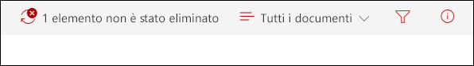
  
<span data-ttu-id="9ddb3-330">Se si prova a eliminare un record in OneDrive, l'elemento viene spostato nella raccolta di archiviazione, come descritto in [Funzionamento dei criteri di conservazione con il contenuto presente](retention-policies.md#how-a-retention-policy-works-with-content-in-place).</span><span class="sxs-lookup"><span data-stu-id="9ddb3-330">If you attempt to delete a record in OneDrive, the item is moved to the Preservation Hold library as described in [How a retention policy works with content in place](retention-policies.md#how-a-retention-policy-works-with-content-in-place).</span></span>
  
## <a name="using-a-retention-label-as-a-condition-in-a-dlp-policy"></a><span data-ttu-id="9ddb3-331">Uso di un'etichetta di conservazione come condizione nei criteri di prevenzione della perdita dei dati</span><span class="sxs-lookup"><span data-stu-id="9ddb3-331">Using a retention label as a condition in a DLP policy</span></span>

<span data-ttu-id="9ddb3-p139">Un'etichetta di conservazione può applicare azioni di conservazione sul contenuto. Inoltre, è possibile usare un'etichetta di conservazione come condizione in un criterio di prevenzione della perdita dei dati (DLP), e il criterio DLP può applicare altre azioni, come la limitazione dell'accesso, sui contenuti che includono un'etichetta di conservazione specifica.</span><span class="sxs-lookup"><span data-stu-id="9ddb3-p139">A retention label can enforce retention actions on content. In addition, you can use a retention label as a condition in a data loss prevention (DLP) policy, and the DLP policy can enforce other actions, such as restricting access, on content that contains a specific label.</span></span> 
  
<span data-ttu-id="9ddb3-334">Per altre informazioni, vedere [Uso di un'etichetta come condizione nei criteri di prevenzione della perdita dei dati](data-loss-prevention-policies.md#using-a-label-as-a-condition-in-a-dlp-policy).</span><span class="sxs-lookup"><span data-stu-id="9ddb3-334">For more information, see [Using a label as a condition in a DLP policy](data-loss-prevention-policies.md#using-a-label-as-a-condition-in-a-dlp-policy).</span></span>
  
## <a name="using-the-label-activity-explorer-and-the-data-governance-reports"></a><span data-ttu-id="9ddb3-335">Uso dei report di Esplora attività con etichette e Governance dei dati</span><span class="sxs-lookup"><span data-stu-id="9ddb3-335">Using the Label Activity Explorer and the data governance reports</span></span>

<span data-ttu-id="9ddb3-p140">Dopo aver pubblicato o applicato automaticamente le etichette di conservazione, è consigliabile verificare che vengano applicate al contenuto come previsto. Per monitorare le etichette di conservazione, si può usare:</span><span class="sxs-lookup"><span data-stu-id="9ddb3-p140">After you publish or auto-apply your retention labels, you'll want to verify that they're being applied to content as you intended. To monitor your retention labels, you can use the:</span></span>
  
- <span data-ttu-id="9ddb3-p141">**Esplora attività con etichette**. Con Esplora attività con etichette (mostrato di seguito), è possibile cercare e visualizzare rapidamente le attività relative alle etichette di conservazione per tutto il contenuto di SharePoint e OneDrive for Business degli ultimi 30 giorni. Per altre informazioni, vedere [Visualizzare le attività con etichette per i documenti](view-label-activity-for-documents.md).</span><span class="sxs-lookup"><span data-stu-id="9ddb3-p141">**Label Activity Explorer**. With the explorer (shown below), you can quickly search and view retention label activity for all content across SharePoint and OneDrive for Business over the past 30 days. For more information, see [View label activity for documents](view-label-activity-for-documents.md).</span></span>
    
- <span data-ttu-id="9ddb3-p142">**Report di Governance dei dati**. Con questi report, è possibile visualizzare rapidamente le tendenze delle etichette di conservazione e le attività per tutto il contenuto di Exchange, SharePoint e OneDrive for Business degli ultimi 90 giorni. Per altre informazioni, vedere [Visualizzare i report di Governance dei dati](view-the-data-governance-reports.md).</span><span class="sxs-lookup"><span data-stu-id="9ddb3-p142">**Data governance reports**. With these reports, you can quickly view retention label trends and activity for all content across Exchange, SharePoint, and OneDrive for Business over the past 90 days. For more information, see [View the data governance reports](view-the-data-governance-reports.md).</span></span>
    
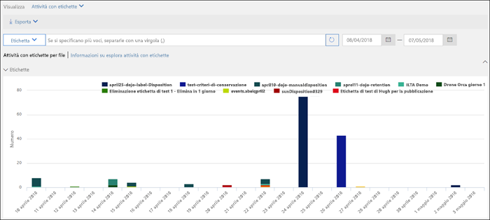
  
## <a name="using-content-search-to-find-all-content-with-a-specific-retention-label-applied-to-it"></a><span data-ttu-id="9ddb3-345">Uso di Ricerca contenuto per trovare tutto il contenuto a cui è applicata una specifica etichetta di conservazione</span><span class="sxs-lookup"><span data-stu-id="9ddb3-345">Using Content Search to find all content with a specific retention label applied to it</span></span>

<span data-ttu-id="9ddb3-346">Dopo l'assegnazione automatica o manuale di etichette di conservazione al contenuto, è possibile usare Ricerca contenuto nel Centro sicurezza e conformità per trovare tutto il contenuto che ha una specifica etichetta di conservazione.</span><span class="sxs-lookup"><span data-stu-id="9ddb3-346">After retention labels are assigned to content, either by users or auto-applied, you can use content search in the Security &amp; Compliance Center to find all content that's classified with a specific retention label.</span></span>
  

  
<span data-ttu-id="9ddb3-p143">Quando si crea una ricerca di contenuto, scegliere la condizione **Tag di conformità**, quindi immettere il nome completo dell'etichetta o parte di esso e usare un carattere jolly. Per altre informazioni, vedere [Query con parola chiave e condizioni di ricerca per la ricerca di contenuto](keyword-queries-and-search-conditions.md).</span><span class="sxs-lookup"><span data-stu-id="9ddb3-p143">When you create a content search, choose the **Compliance Tag** condition, and then enter the complete label name or part of the label name and use a wildcard. For more information, see [Keyword queries and search conditions for Content Search](keyword-queries-and-search-conditions.md).</span></span>
  
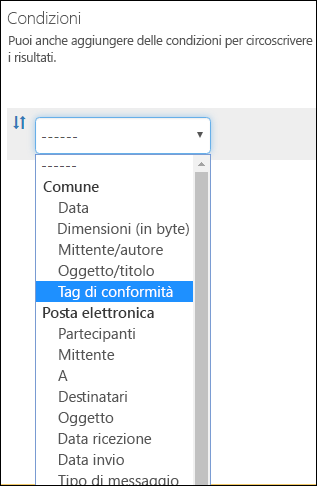
  
## <a name="the-principles-of-retention-or-what-takes-precedence"></a><span data-ttu-id="9ddb3-351">Precedenza nei principi di conservazione</span><span class="sxs-lookup"><span data-stu-id="9ddb3-351">The principles of retention, or what takes precedence?</span></span>

<span data-ttu-id="9ddb3-p144">È possibile, o addirittura probabile, che al contenuto siano applicati più criteri di conservazione con azioni (conservare, eliminare o entrambi) e periodi di conservazione diversi. Quali sono i criteri che hanno la precedenza? Al livello più alto, un contenuto che viene conservato in base a un particolare criterio non può essere eliminato definitivamente da un altro criterio.</span><span class="sxs-lookup"><span data-stu-id="9ddb3-p144">It's possible or even likely that content might have several retention policies applied to it, each with a different action (retain, delete, or both) and retention period. What takes precedence? At the highest level, rest assured that content being retained by one policy can't be permanently deleted by another policy.</span></span>
  
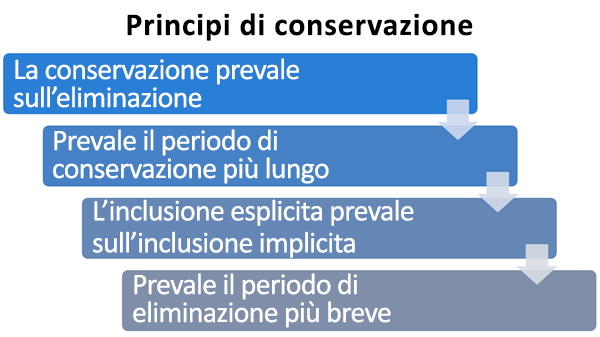
  
<span data-ttu-id="9ddb3-356">Per comprendere in che modo le diverse etichette con azioni di conservazione vengono applicate al contenuto, tenere presente questi principi di conservazione:</span><span class="sxs-lookup"><span data-stu-id="9ddb3-356">To understand how different labels with retention actions are applied to content, keep these principles of retention in mind:</span></span>
  
1. <span data-ttu-id="9ddb3-p145">**La conservazione prevale sull'eliminazione.** Si supponga di avere un criterio di conservazione che indica di eliminare la posta elettronica di Exchange dopo tre anni e un altro criterio di conservazione che indica di conservare la posta elettronica di Exchange per cinque anni e quindi eliminarla. Il contenuto che supera i tre anni verrà eliminato e nascosto agli utenti, ma comunque conservato nella cartella Elementi ripristinabili fino a raggiungere i cinque anni, quando verrà eliminato definitivamente.</span><span class="sxs-lookup"><span data-stu-id="9ddb3-p145">**Retention wins over deletion.** Suppose that one retention policy says to delete Exchange email after three years, but another retention policy says to retain Exchange email for five years and then delete it. Any content that reaches three years old will be deleted and hidden from the users' view, but still retained in the Recoverable Items folder until the content reaches five years old, when it will be permanently deleted.</span></span> 
    
2. <span data-ttu-id="9ddb3-p146">**Prevale il periodo di conservazione più lungo.** Se un contenuto è soggetto a più criteri di conservazione, verrà mantenuto fino al termine del periodo di conservazione più lungo.</span><span class="sxs-lookup"><span data-stu-id="9ddb3-p146">**The longest retention period wins.** If content's subject to multiple policies that retain content, it will be retained until the end of the longest retention period.</span></span> 
    
3. <span data-ttu-id="9ddb3-p147">**L'inclusione esplicita prevale sull'inclusione implicita.** Questo significa che:</span><span class="sxs-lookup"><span data-stu-id="9ddb3-p147">**Explicit inclusion wins over implicit inclusion.** This means:</span></span> 
    
    1. <span data-ttu-id="9ddb3-p148">Se un utente assegna manualmente un'etichetta di conservazione con impostazioni di conservazione a un elemento, ad esempio un messaggio di posta elettronica di Exchange o un documento di OneDrive, quell'etichetta ha la precedenza sui criteri assegnati a livello di sito o di cassetta postale e su un'etichetta di conservazione predefinita assegnata tramite la raccolta documenti. Ad esempio, se l'etichetta di conservazione esplicita indica un periodo di conservazione di dieci anni, ma i criteri assegnati dal sito indicano di conservare solo per cinque anni, l'etichetta ha la precedenza. Si noti che le etichette di conservazione applicate automaticamente sono considerate implicite e non esplicite, perché vengono applicate automaticamente da Office 365.</span><span class="sxs-lookup"><span data-stu-id="9ddb3-p148">If a retention label with retention settings is manually assigned by a user to an item, such as an Exchange email or OneDrive document, that retention label takes precedence over both a policy assigned at the site or mailbox level and a default retention label assigned by the document library. For example, if the explicit retention label says to retain for ten years, but the retention policy assigned to the site says to retain for only five years, the retention label takes precedence. Note that auto-apply retention labels are considered implicit, not explicit, because they're applied automatically by Office 365.</span></span>
    
    2. <span data-ttu-id="9ddb3-367">Se un criterio di conservazione include una posizione specifica, ad esempio la cassetta postale o l'account di OneDrive for Business di un particolare utente, il criterio ha la precedenza su un altro criterio di conservazione applicato alle cassette postali o agli account di OneDrive for Business di tutti gli utenti, ma che non include specificamente la cassetta postale di quell'utente.</span><span class="sxs-lookup"><span data-stu-id="9ddb3-367">If a retention policy includes a specific location, such as a specific user's mailbox or OneDrive for Business account, that policy takes precedence over another retention policy that applies to all users' mailboxes or OneDrive for Business accounts but doesn't specifically include that user's mailbox.</span></span>
    
4. <span data-ttu-id="9ddb3-p149">**Prevale il periodo di eliminazione più breve.** Analogamente, se un contenuto è soggetto a più criteri di eliminazione (senza conservazione), verrà eliminato alla fine del periodo di conservazione più breve.</span><span class="sxs-lookup"><span data-stu-id="9ddb3-p149">**The shortest deletion period wins.** Similarly, if content's subject to multiple policies that delete content (with no retention), it will be deleted at the end of the shortest retention period.</span></span> 
    
<span data-ttu-id="9ddb3-370">I principi di conservazione funzionano come un flusso di risoluzione di conflitti dall'alto verso il basso: se le regole applicate da tutti i criteri o le etichette sono le stesse in un determinato livello, il flusso si sposta verso il basso al livello successivo per determinare la priorità di applicazione di ogni regola.</span><span class="sxs-lookup"><span data-stu-id="9ddb3-370">Understand that the principles of retention work as a tie-breaking flow from top to bottom: If the rules applied by all policies or labels are the same at one level, the flow moves down to the next level to determine precedence for which rule is applied.</span></span>
  
<span data-ttu-id="9ddb3-p150">Infine, un criterio o un'etichetta di conservazione non può eliminare definitivamente qualsiasi contenuto che si trovi in stato di blocco per eDiscovery. Quando il blocco viene rilasciato, il contenuto torna idoneo per il processo di pulizia descritto in precedenza.</span><span class="sxs-lookup"><span data-stu-id="9ddb3-p150">Finally, a retention policy or label cannot permanently delete any content that's on hold for eDiscovery. When the hold is released, the content again becomes eligible for the cleanup process described above.</span></span>
  
## <a name="use-retention-labels-instead-of-these-features"></a><span data-ttu-id="9ddb3-373">Usare le etichette di conservazione anziché queste funzionalità</span><span class="sxs-lookup"><span data-stu-id="9ddb3-373">Use retention labels instead of these features</span></span>

<span data-ttu-id="9ddb3-p151">Le etichette di conservazione possono facilmente essere rese disponibili per un'intera organizzazione e il relativo contenuto in Office 365, compresi Exchange, SharePoint, OneDrive e gruppi di Office 365. Se è necessario classificare il contenuto o gestire i record ovunque in Office 365, è consigliabile usare le etichette di conservazione.</span><span class="sxs-lookup"><span data-stu-id="9ddb3-p151">Retention labels can easily be made available to an entire organization and its content across Office 365, including Exchange, SharePoint, OneDrive, and Office 365 groups. If you need to classify content or manage records anywhere in Office 365, we recommend that you use retention labels.</span></span>
  
<span data-ttu-id="9ddb3-p152">Per classificare il contenuto o gestire i record in Office 365 esistono già altre funzionalità, elencate di seguito, che continueranno a funzionare insieme alle etichette di conservazione create nel Centro sicurezza e conformità. Anche se ci sono istanze in cui l'implementazione delle etichette di conservazione è diversa rispetto alle funzionalità precedenti, l'evoluzione delle etichette di conservazione determinerà il futuro della gestione dei record in Office 365. In futuro, quindi, per la governance dei dati si consiglia di usare le etichette di conservazione invece di queste funzionalità.</span><span class="sxs-lookup"><span data-stu-id="9ddb3-p152">There are several other features that have previously been used to classify content or manage records in Office 365. These are listed below. These features will continue to work side by side with retention labels created in the Security &amp; Compliance Center. Note that while there are instances where the implementation of retention labels differs from previous features, the evolution of retention labels will drive the future of records management across Office 365. Therefore, moving forward, for data governance, we recommend that you use retention labels instead of these features.</span></span>
  
### <a name="exchange-online"></a><span data-ttu-id="9ddb3-381">Exchange Online</span><span class="sxs-lookup"><span data-stu-id="9ddb3-381">Exchange Online</span></span>

- <span data-ttu-id="9ddb3-382">[Tag di conservazione e criteri di conservazione](https://go.microsoft.com/fwlink/?linkid=846125), noti anche come [gestione record di messaggistica](https://go.microsoft.com/fwlink/?linkid=846126) (solo eliminazione)</span><span class="sxs-lookup"><span data-stu-id="9ddb3-382">[Retention tags and retention policies](https://go.microsoft.com/fwlink/?linkid=846125), also known as [messaging records management (MRM)](https://go.microsoft.com/fwlink/?linkid=846126) (Deletion only)</span></span> 
    
### <a name="sharepoint-online-and-onedrive-for-business"></a><span data-ttu-id="9ddb3-383">SharePoint Online e OneDrive for Business</span><span class="sxs-lookup"><span data-stu-id="9ddb3-383">SharePoint Online and OneDrive for Business</span></span>

- <span data-ttu-id="9ddb3-384">[Configurazione di gestione dei record sul posto](https://support.office.com/article/7707a878-780c-4be6-9cb0-9718ecde050a) (conservazione)</span><span class="sxs-lookup"><span data-stu-id="9ddb3-384">[Configuring in place records management](https://support.office.com/article/7707a878-780c-4be6-9cb0-9718ecde050a) (Retention)</span></span> 
    
- <span data-ttu-id="9ddb3-385">[Introduzione al Centro record](https://support.office.com/article/bae6ca5a-7b19-40e0-b433-e3613a747c2c) (conservazione)</span><span class="sxs-lookup"><span data-stu-id="9ddb3-385">[Introduction to the Records Center](https://support.office.com/article/bae6ca5a-7b19-40e0-b433-e3613a747c2c) (Retention)</span></span> 
    
- <span data-ttu-id="9ddb3-386">[Criteri di gestione delle informazioni ](intro-to-info-mgmt-policies.md) (solo eliminazione)</span><span class="sxs-lookup"><span data-stu-id="9ddb3-386">[Information management policies](intro-to-info-mgmt-policies.md) (Deletion only)</span></span> 
    
## <a name="permissions"></a><span data-ttu-id="9ddb3-387">Autorizzazioni</span><span class="sxs-lookup"><span data-stu-id="9ddb3-387">Permissions</span></span>

<span data-ttu-id="9ddb3-p153">Ai membri del team di conformità che creeranno etichette di conservazione è necessario assegnare autorizzazioni per il Centro sicurezza e conformità. Per impostazione predefinita, l'amministratore del tenant avrà accesso a questa posizione e potrà fornire ai responsabili della conformità e ad altre persone l'accesso al Centro sicurezza e conformità, senza concedere tutte le autorizzazioni di un amministratore del tenant. A questo scopo, è consigliabile accedere alla pagina **Autorizzazioni** del Centro sicurezza e conformità, modificare il gruppo di ruoli **Amministratore conformità** e aggiungere membri a tale gruppo di ruoli.</span><span class="sxs-lookup"><span data-stu-id="9ddb3-p153">Members of your compliance team who will create retention labels need permissions to the Security &amp; Compliance Center. By default, your tenant admin will have access to this location and can give compliance officers and other people access to the Security &amp; Compliance Center, without giving them all of the permissions of a tenant admin. To do this, we recommend that you go to the **Permissions** page of the Security &amp; Compliance Center, edit the **Compliance Administrator** role group, and add members to that role group.</span></span> 
  
<span data-ttu-id="9ddb3-390">Per ulteriori informazioni, vedere [Concedere agli utenti l'accesso al Centro sicurezza e conformità di Office 365](grant-access-to-the-security-and-compliance-center.md).</span><span class="sxs-lookup"><span data-stu-id="9ddb3-390">For more information, see [Give users access to the Office 365 Security &amp; Compliance Center](grant-access-to-the-security-and-compliance-center.md).</span></span>
  
<span data-ttu-id="9ddb3-p154">Queste autorizzazioni sono necessarie solo per creare e applicare etichette di conservazione e criteri di etichetta. L'applicazione dei criteri non richiede l'accesso al contenuto.</span><span class="sxs-lookup"><span data-stu-id="9ddb3-p154">These permissions are required only to create and apply retention labels and a label policy. Policy enforcement does not require access to the content.</span></span>
  
## <a name="find-the-powershell-cmdlets-for-labels"></a><span data-ttu-id="9ddb3-393">Trovare i cmdlet di PowerShell per le etichette</span><span class="sxs-lookup"><span data-stu-id="9ddb3-393">Find the PowerShell cmdlets for labels</span></span>

<span data-ttu-id="9ddb3-394">Per usare i cmdlet per le etichette è necessario:</span><span class="sxs-lookup"><span data-stu-id="9ddb3-394">To use the label cmdlets, you need to:</span></span>
  
1. [<span data-ttu-id="9ddb3-395">Connettersi a PowerShell in Centro sicurezza e conformità di Office 365</span><span class="sxs-lookup"><span data-stu-id="9ddb3-395">Connect to the Office 365 Security & Compliance Center Powershell</span></span>](https://docs.microsoft.com/powershell/exchange/office-365-scc/connect-to-scc-powershell/connect-to-scc-powershell)
    
2. <span data-ttu-id="9ddb3-396">Usare questi cmdlet del Centro sicurezza e conformità di Office 365:</span><span class="sxs-lookup"><span data-stu-id="9ddb3-396">Use these Office 365 Security & Compliance Center cmdlets:</span></span>

  - [<span data-ttu-id="9ddb3-397">Get-ComplianceTag</span><span class="sxs-lookup"><span data-stu-id="9ddb3-397">Get-ComplianceTag</span></span>](https://docs.microsoft.com/powershell/module/exchange/policy-and-compliance-retention/get-compliancetag)

  - [<span data-ttu-id="9ddb3-398">New-ComplianceTag</span><span class="sxs-lookup"><span data-stu-id="9ddb3-398">New-ComplianceTag</span></span>](https://docs.microsoft.com/powershell/module/exchange/policy-and-compliance-retention/new-compliancetag)

  - [<span data-ttu-id="9ddb3-399">Remove-ComplianceTag</span><span class="sxs-lookup"><span data-stu-id="9ddb3-399">Remove-ComplianceTag</span></span>](https://docs.microsoft.com/powershell/module/exchange/policy-and-compliance-retention/remove-compliancetag)

  - [<span data-ttu-id="9ddb3-400">Set-ComplianceTag</span><span class="sxs-lookup"><span data-stu-id="9ddb3-400">Set-ComplianceTag</span></span>](https://docs.microsoft.com/powershell/module/exchange/policy-and-compliance-retention/set-compliancetag)

  - [<span data-ttu-id="9ddb3-401">Enable-ComplianceTagStorage</span><span class="sxs-lookup"><span data-stu-id="9ddb3-401">Enable-ComplianceTagStorage</span></span>](https://docs.microsoft.com/powershell/module/exchange/policy-and-compliance-retention/enable-compliancetagstorage)

  - [<span data-ttu-id="9ddb3-402">Get-ComplianceTagStorage</span><span class="sxs-lookup"><span data-stu-id="9ddb3-402">Get-ComplianceTagStorage</span></span>](https://docs.microsoft.com/powershell/module/exchange/policy-and-compliance-retention/get-compliancetagstorage)

  - [<span data-ttu-id="9ddb3-403">Get-RetentionCompliancePolicy</span><span class="sxs-lookup"><span data-stu-id="9ddb3-403">Get-RetentionCompliancePolicy</span></span>](https://docs.microsoft.com/powershell/module/exchange/policy-and-compliance-retention/get-retentioncompliancepolicy)

  - [<span data-ttu-id="9ddb3-404">New-RetentionCompliancePolicy</span><span class="sxs-lookup"><span data-stu-id="9ddb3-404">New-RetentionCompliancePolicy</span></span>](https://docs.microsoft.com/powershell/module/exchange/policy-and-compliance-retention/new-retentioncompliancepolicy)

  - [<span data-ttu-id="9ddb3-405">Remove-RetentionCompliancePolicy</span><span class="sxs-lookup"><span data-stu-id="9ddb3-405">Remove-RetentionCompliancePolicy</span></span>](https://docs.microsoft.com/powershell/module/exchange/policy-and-compliance-retention/remove-retentioncompliancepolicy)

  - [<span data-ttu-id="9ddb3-406">Set-RetentionCompliancePolicy</span><span class="sxs-lookup"><span data-stu-id="9ddb3-406">Set-RetentionCompliancePolicy</span></span>](https://docs.microsoft.com/powershell/module/exchange/policy-and-compliance-retention/set-retentioncompliancepolicy)

  - [<span data-ttu-id="9ddb3-407">Get-RetentionComplianceRule</span><span class="sxs-lookup"><span data-stu-id="9ddb3-407">Get-RetentionComplianceRule</span></span>](https://docs.microsoft.com/powershell/module/exchange/policy-and-compliance-retention/get-retentioncompliancerule)

  - [<span data-ttu-id="9ddb3-408">New-RetentionComplianceRule</span><span class="sxs-lookup"><span data-stu-id="9ddb3-408">New-RetentionComplianceRule</span></span>](https://docs.microsoft.com/powershell/module/exchange/policy-and-compliance-retention/new-retentioncompliancerule)

  - [<span data-ttu-id="9ddb3-409">Remove-RetentionComplianceRule</span><span class="sxs-lookup"><span data-stu-id="9ddb3-409">Remove-RetentionComplianceRule</span></span>](https://docs.microsoft.com/powershell/module/exchange/policy-and-compliance-retention/remove-retentioncompliancerule)

  - [<span data-ttu-id="9ddb3-410">Set-RetentionComplianceRule</span><span class="sxs-lookup"><span data-stu-id="9ddb3-410">Set-RetentionComplianceRule</span></span>](https://docs.microsoft.com/powershell/module/exchange/policy-and-compliance-retention/set-retentioncompliancerule)

## <a name="more-information"></a><span data-ttu-id="9ddb3-411">Ulteriori informazioni</span><span class="sxs-lookup"><span data-stu-id="9ddb3-411">More information</span></span>

[<span data-ttu-id="9ddb3-412">Panoramica dei criteri di conservazione</span><span class="sxs-lookup"><span data-stu-id="9ddb3-412">Overview of retention policies</span></span>](retention-policies.md)
