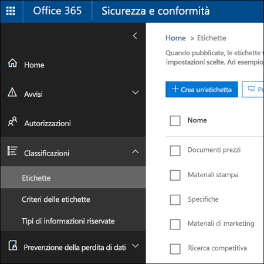

# <a name="overview-of-labels"></a>Panoramica delle etichette

All'interno dell'organizzazione sono probabilmente presenti tipi di contenuto diversi, sui quali occorre eseguire azioni differenti per garantire la conformità alle normative di settore e ai criteri interni. Ad esempio, possono essere presenti:
  
- Moduli fiscali che devono essere **conservati** per un periodo di tempo minimo. 
    
- Materiali per la stampa che devono essere **eliminati definitivamente** dopo un determinato periodo di tempo. 
    
- Ricerche competitive che devono essere **conservate** e in seguito **eliminate definitivamente**. 
    
- Permessi di lavoro che devono essere **classificati come record** in modo che non sia possibile modificarli o eliminarli. 
    
In tutti questi casi, le etichette in Office 365 aiutano a identificare le azioni corrette da eseguire per ogni contenuto. Con le etichette è possibile classificare i dati all'interno dell'organizzazione a scopi di governance e applicare regole di conservazione in base alla classificazione.
  
Le etichette consentono di:
  
- **Permettere agli utenti dell'organizzazione di applicare manualmente** un'etichetta a contenuti in Outlook sul web, Outlook 2010 e versioni successive, OneDrive, SharePoint e gruppi di Office 365. Spesso gli utenti sono quelli che conoscono meglio il tipo di contenuto che stanno usando, per cui sono in grado di classificarlo e applicare i criteri appropriati. 
    
- **Applicare automaticamente etichette al contenuto** se soddisfa specifiche condizioni, ad esempio se include: 
    
  - Tipi specifici di informazioni riservate.
    
  - Parole chiave specifiche che corrispondono a una query creata.
    
    La possibilità di applicare automaticamente etichette al contenuto è importante perché:
    
  - Non è necessario formare gli utenti su tutte le classificazioni.
    
  - Non è necessario affidarsi solo agli utenti per la classificazione corretta di tutto il contenuto.
    
  - Gli utenti non hanno più bisogno di conoscere i criteri di governance dai dati e possono concentrarsi sul loro lavoro.
    
    Si noti che per l'applicazione automatica delle etichette è necessario un abbonamento a Office 365 Enterprise E5.
    
- **Applicare un'etichetta predefinita a una raccolta documenti** nei siti di SharePoint e dei gruppi di Office 365, in modo che tutti i documenti nella raccolta ricevano l'etichetta predefinita. 
    
- **Implementare la gestione dei record in Office 365**, compresi posta elettronica e documenti. Si può usare un'etichetta per classificare il contenuto come record. In questo caso, non è possibile cambiare o rimuovere l'etichetta e il contenuto non può essere modificato o eliminato. 
    
Le etichette si creano e si gestiscono nella pagina **Etichette** del Centro sicurezza e conformità di Office 365. 
  

 
## <a name="how-labels-work-with-label-policies"></a>Funzionamento delle etichette con i criteri di etichetta

Rendere disponibili le etichette agli utenti dell'organizzazione in modo che possano classificare il contenuto è un processo in due passaggi. Il primo consiste nel creare le etichette, il secondo nel pubblicarle nelle posizioni scelte. Quando si pubblicano le etichette, vengono creati criteri di etichetta.
  

  
Le etichette sono blocchi predefiniti indipendenti e riutilizzabili che vengono inclusi in un criterio di etichetta e pubblicati in posizioni diverse. Le etichette possono essere riutilizzate in più criteri. Lo scopo principale di un criterio di etichetta è raggruppare un set di etichette e specificare le posizioni in cui si desidera che vengano visualizzate.
  

  
1. Quando si pubblicano le etichette, vengono incluse in criteri di etichetta. Una singola etichetta può essere inclusa in molti criteri.
    
2. I criteri di etichetta specificano le posizioni di pubblicazione delle etichette.
    
## <a name="only-one-label-at-a-time"></a>Solo un'etichetta alla volta

È importante tenere presente che a contenuti come un messaggio di posta elettronica o un documento è possibile assegnare una sola etichetta alla volta:
  
- Per le etichette assegnate manualmente dagli utenti finali, è possibile rimuovere o cambiare l'etichetta assegnata.
    
- Se al contenuto è assegnata un'etichetta applicata automaticamente, questa può essere sostituita da un'etichetta assegnata manualmente da un utente finale.
    
- Se al contenuto è assegnata un'etichetta applicata manualmente da un utente finale, questa non può essere sostituita da un'etichetta applicata automaticamente.
    
- Se sono presenti più regole che assegnano automaticamente un'etichetta e il contenuto soddisfa le condizioni di più regole, viene assegnata l'etichetta della regola meno recente.
    
Le etichette assegnate manualmente vengono assegnate in modo esplicito, mentre le etichette applicate automaticamente vengono assegnate in modo implicito. Un'etichetta esplicita ha la precedenza su un'etichetta implicita. Per altre informazioni, vedere la sezione [Principi di conservazione o criteri per determinare la precedenza](labels.md#principles), più avanti.
  
## <a name="how-long-it-takes-for-labels-to-take-effect"></a>Tempo necessario per l'applicazione delle etichette

Quando si pubblicano o si applicano automaticamente le etichette, queste non hanno effetto immediato:
  
1. Per prima cosa i criteri di etichetta devono essere sincronizzati dal Centro sicurezza e conformità alle posizioni indicate nei criteri.
    
2. Quindi, la posizione potrebbe richiedere del tempo per rendere disponibili le etichette manuali agli utenti finali o per applicare automaticamente etichette al contenuto. Il tempo necessario dipende dalla posizione e dal tipo di etichetta.
    
### <a name="manual-labels"></a>Etichette manuali

Se si pubblicano etichette in SharePoint o OneDrive, può essere necessario un giorno perché le etichette siano visibili agli utenti finali. Se si pubblicano etichette in Exchange, possono essere necessari 7 giorni perché le etichette siano visibili agli utenti finali, inoltre la cassetta postale deve contenere almeno 10 MB di dati.
  

  
### <a name="auto-apply-labels"></a>Etichette applicate automaticamente

In caso di applicazione automatica di etichette ai contenuti che soddisfano condizioni specifiche, possono essere necessari 7 giorni prima che le etichette vengano applicate a tutto il contenuto che soddisfa le condizioni.
  

  
### <a name="how-to-check-on-the-status-of-exchange-labels"></a>Come verificare lo stato delle etichette di Exchange

In Exchange Online le etichette vengono rese disponibili agli utenti finali mediante un processo eseguito ogni sette giorni. Usando Powershell è possibile vedere quando è stato eseguito per l'ultima volta questo processo e quindi stabilire quando verrà eseguito nuovamente.
  
1. [Connettersi a Exchange Online PowerShell](https://go.microsoft.com/fwlink/?linkid=799773).
    
2. Eseguire questi comandi.
    
  ```
  $logProps = Export-MailboxDiagnosticLogs <user> -ExtendedProperties
  ```

  ```
  $xmlprops = [xml]($logProps.MailboxLog)
  ```

  ```
  $xmlprops.Properties.MailboxTable.Property | ? {$_.Name -like "ELC*"}
  ```

    Nei risultati, la proprietà`ELCLastSuccessTimeStamp` (UTC) mostra quando il sistema ha elaborato la casetta postale per l'ultima volta. Se questa operazione non è stata eseguita da quando è stato creato il criterio, le etichette non verranno visualizzate. Per forzare l'elaborazione, eseguire `Start-ManagedFolderAssistant -Identity <user>`.
    
    Se le etichette non compaiono in Outlook sul web e si ritiene che invece debbano comparire, svuotare la cache del browser (CTRL+F5).
    
## <a name="label-policies-and-locations"></a>Criteri per le etichette e posizioni

È possibile pubblicare tipi di etichette differenti in posizioni diverse, a seconda dell'azione eseguita dall'etichetta.
  
|**Se l'etichetta viene...**|**Il criterio di etichetta può essere applicato a…**|
|:-----|:-----|
|Pubblicata agli utenti finali  <br/> |Exchange, SharePoint, OneDrive, gruppi di Office 365  <br/> |
|Applicata automaticamente in base ai tipi di informazioni riservate  <br/> |Exchange (solo a tutte le cassette postali), SharePoint, OneDrive  <br/> |
|Applicata automaticamente in base a una query  <br/> |Exchange, SharePoint, OneDrive, gruppi di Office 365  <br/> |
   
Le etichette applicate automaticamente in Exchange (sia per le query che per i tipi di informazioni riservate) vengono applicate solo ai messaggi inviati di recente (dati in transito), non a tutti gli elementi attualmente nella cassetta postale (dati inattivi). Inoltre, le etichette applicate automaticamente per i tipi di informazioni riservate possono essere applicate solo a tutte le cassette postali, non a cassette postali specifiche.
  
Si noti che le cartelle pubbliche di Exchange e Skype non supportano le etichette.
  
## <a name="how-labels-enforce-retention"></a>Modalità di applicazione della conservazione da parte delle etichette

Le etichette possono applicare esattamente le stesse azioni di conservazione dei criteri di conservazione. Si possono usare le etichette per implementare un piano contenuti (o un piano file) sofisticato. Per altre informazioni sul funzionamento della conservazione, vedere [Panoramica dei criteri di conservazione](retention-policies.md).
  
Inoltre, un'etichetta ha due opzioni di conservazione che sono disponibili solo in un'etichetta e non in un criterio di conservazione. Con un'etichetta, è possibile:
  
- Attivare una revisione per l'eliminazione alla fine del periodo di conservazione, in modo che venga impostata una revisione obbligatoria dei documenti di SharePoint e OneDrive prima che vengano eliminati. Per altre informazioni, vedere [Panoramica delle revisioni per l'eliminazione](disposition-reviews.md).
    
- Iniziare il periodo di conservazione dal momento in cui il contenuto è stato etichettato invece che in base all'età o alla data dell'ultima modifica.
    

  
## <a name="where-published-labels-can-appear-to-end-users"></a>Posizioni in cui è possibile visualizzare le etichette pubblicate agli utenti finali

Se l'etichetta verrà assegnata al contenuto dagli utenti finali, è possibile pubblicarla in:
  
- Outlook sul web
    
- Outlook 2010 e versioni successive
    
- OneDrive
    
- SharePoint
    
- Gruppi di Office 365 (sia nel sito del gruppo che nella cassetta postale del gruppo in Outlook sul web)
    
Le sezioni seguenti mostrano il modo in cui le etichette verranno visualizzate agli utenti dell'organizzazione in app diverse.
  
### <a name="outlook-on-the-web"></a>Outlook sul web

Per assegnare un'etichetta a un elemento in Outlook sul web, fare clic con il pulsante destro del mouse sull'elemento\> **Assegna criteri** \> scegliere l'etichetta. 
  

  
Una volta applicata, l'etichetta può essere visualizzata insieme all'azione che esegue nella parte superiore dell'elemento. Se un messaggio di posta elettronica viene classificato ed è associato a un periodo di conservazione, con una rapida occhiata se ne conoscerà la data di scadenza.
  

  
È anche possibile applicare etichette a cartelle. In questo caso:
  
- Tutti gli elementi nella cartella ricevono automaticamente la stessa etichetta **tranne** gli elementi ai quali è stata applicata esplicitamente un'etichetta. Gli elementi etichettati esplicitamente mantengono l'etichetta esistente. Per altre informazioni, vedere la sezione sui principi di conservazione più avanti. 
    
- Se si modifica o si rimuove l'etichetta predefinita per una cartella, l'etichetta viene modificata o rimossa anche da tutti gli elementi nella cartella **tranne** che dagli elementi con etichette esplicite. 
    
- Se si sposta un elemento con un'etichetta predefinita da una cartella a un'altra cartella con un'etichetta predefinita diversa, l'elemento riceverà la nuova etichetta predefinita.
    
- Se si sposta un elemento con un'etichetta predefinita da una cartella a un'altra cartella priva di un'etichetta predefinita, l'etichetta predefinita precedente viene rimossa.
    
### <a name="outlook-2010-and-later"></a>Outlook 2010 e versioni successive

Per assegnare un'etichetta a un elemento in Outlook sul web, fare clic con il pulsante destro del mouse sull'elemento \> sulla **barra multifunzione** \> **Assegna criteri** \>scegliere l'etichetta. 
  

  
Una volta applicata, l'etichetta può essere visualizzata insieme all'azione che esegue nella parte superiore dell'elemento. Se un messaggio di posta elettronica viene classificato ed è associato a un periodo di conservazione, con una rapida occhiata se ne conoscerà la data di scadenza.
  
È anche possibile applicare etichette a cartelle. Questa operazione funziona allo stesso modo in Outlook 2010 e versioni successive e in Outlook sul web. Per altre informazioni, vedere la sezione precedente.
  
### <a name="onedrive-and-sharepoint"></a>OneDrive e SharePoint

Per assegnare un'etichetta a un documento (inclusi i file di OneNote) in OneDrive o SharePoint, selezionare l'elemento \> nell'angolo in alto a destra, scegliere **Apri il riquadro dei dettagli** \> **Applica etichetta** \>scegliere l'etichetta. 
  
È possibile applicare un'etichetta anche a un set di cartelle o di documenti e si può impostare un'etichetta predefinita per una raccolta documenti. Per altre informazioni, vedere la sezione seguente.
  

  
Dopo l'applicazione di un'etichetta a un elemento, è possibile visualizzarla nel riquadro dei dettagli quando l'elemento viene selezionato.
  

  
È anche possibile creare una visualizzazione della raccolta che contenga la colonna **Etichette** o la colonna **L'elemento è un record**, in modo da poter vedere a colpo d'occhio le etichette assegnate a tutti gli elementi e quali elementi sono record. Tuttavia, non è possibile filtrare la visualizzazione per la colonna **L'elemento è un record**. 
  

  
### <a name="office-365-groups"></a>Gruppi di Office 365

Quando si pubblicano etichette in un gruppo di Office 365, le etichette vengono visualizzate sia nel sito del gruppo che nella cassetta postale del gruppo in Outlook sul web. L'esperienza di applicazione di un'etichetta al contenuto è identica a quella illustrata in precedenza per posta elettronica e documenti.
  
## <a name="applying-a-label-automatically-based-on-conditions"></a>Applicazione automatica di un'etichetta in base alle condizioni

Una delle funzionalità più efficaci delle etichette è la possibilità di applicarle automaticamente al contenuto che soddisfa determinate condizioni. In questo caso, gli utenti dell'organizzazione non dovranno applicare le etichette, perché Office 365 lo farà al loro posto.
  

  
Le etichette applicate automaticamente sono potenti perché:
  
- Non è necessario formare gli utenti su tutte le classificazioni.
    
- Non è necessario affidarsi solo agli utenti per la classificazione corretta di tutto il contenuto.
    
- Gli utenti non hanno più bisogno di conoscere i criteri di governance dai dati e possono concentrarsi sul loro lavoro.
    
È possibile scegliere di applicare automaticamente etichette al contenuto quando questo contiene:
  
- Tipi specifici di informazioni riservate.
    
- Parole chiave specifiche che corrispondono a una query creata.
    

  
Si noti che per l'applicazione automatica delle etichette è necessario un abbonamento a Office 365 Enterprise E5 e che possono essere necessari fino a sette giorni per l'applicazione delle etichette automatiche a tutto il contenuto che soddisfa le condizioni, come illustrato in precedenza.
  
### <a name="auto-apply-labels-to-content-with-specific-types-of-sensitive-information"></a>Applicare automaticamente etichette al contenuto con tipi specifici di informazioni riservate

Quando si creano etichette ad applicazione automatica per le informazioni riservate, viene visualizzato lo stesso elenco di modelli di criteri mostrato quando si creano criteri di prevenzione della perdita dei dati (DLP). Ogni modello di criteri è preconfigurato in modo da cercare tipi specifici di informazioni riservate. Ad esempio, il modello illustrato di seguito cerca codici identificativi del singolo contribuente (ITIN), codici di previdenza sociale (SSN) e numeri di passaporto statunitensi. Per altre informazioni sui criteri DLP, vedere [Panoramica dei criteri di prevenzione della perdita dei dati](data-loss-prevention-policies.md).
  

  
Dopo aver selezionato un modello di criteri, è possibile aggiungere o rimuovere qualunque tipo di informazioni riservate e modificare il numero di istanze e l'accuratezza della corrispondenza. Nell'esempio mostrato di seguito, verrà applicata automaticamente un'etichetta solo quando:
  
- Il contenuto include tra 1 e 9 istanze di qualsiasi di tipo di informazioni riservate. È possibile eliminare il valore **max** in modo che diventi **qualsiasi**.
    
- Il tipo di informazioni riservate rilevate ha un'accuratezza della corrispondenza (o livello di attendibilità) di almeno 75. Molti tipi di informazioni riservate sono definiti con più criteri. I criteri con un livello di accuratezza della corrispondenza superiore richiedono l'individuazione di ulteriori elementi di prova (ad esempio parole chiave, date o indirizzi), mentre i criteri con un livello di accuratezza della corrispondenza inferiore richiedono meno elementi di prova. In parole povere, più basso è il valore di accuratezza della corrispondenza **min**, più facile sarà che il contenuto soddisfi la condizione. 
    
    Se si modifica l'accuratezza della corrispondenza (o livello di attendibilità), è consigliabile usare uno dei livelli di attendibilità impostati in un criterio per quel tipo di informazioni riservate, come indicato in [Elementi cercati dai tipi di informazioni riservate](what-the-sensitive-information-types-look-for.md).
    

  
### <a name="auto-apply-labels-to-content-with-specific-keywords"></a>Applicare automaticamente etichette al contenuto con parole chiave specifiche

È possibile applicare automaticamente etichette al contenuto che soddisfa determinate condizioni. Le condizioni disponibili ora supportano l'applicazione di un'etichetta al contenuto che include parole o frasi specifiche. È possibile perfezionare la query usando operatori di ricerca come AND, OR e NOT. Per altre informazioni sugli operatori, vedere [Query con parola chiave e condizioni di ricerca per la ricerca di contenuto](keyword-queries-and-search-conditions.md).
  
Il supporto per l'aggiunta delle proprietà disponibili per le ricerche (ad esempio, **subject:**) sarà disponibile a breve. 
  
Si noti che le etichette basate su query usano l'indice di ricerca per identificare il contenuto.
  

  
## <a name="applying-a-default-label-to-all-content-in-a-sharepoint-library-folder-or-document-set"></a>Applicazione di un'etichetta predefinita a tutto il contenuto in una raccolta, una cartella o un set di documenti di SharePoint

Oltre a permettere agli utenti di applicare un'etichetta a singoli documenti, è anche possibile applicare un'etichetta predefinita a una raccolta, una cartella o un set di documenti di SharePoint, in modo che tutti i documenti in quella posizione ricevano l'etichetta predefinita.
  
Per una raccolta documenti, questa operazione viene eseguita nella pagina **Impostazioni raccolta** di una raccolta documenti. Quando si sceglie l'etichetta predefinita, è anche possibile scegliere di applicarla a qualunque elemento esistente nella raccolta. 
  
Ad esempio, se si ha un tag per il materiale di marketing e si sa che una specifica raccolta documenti conterrà solo quel tipo di contenuto, è possibile impostare il tag Materiali marketing come predefinito per tutti i documenti nella raccolta.
  

  
Se si applica un'etichetta predefinita agli elementi esistenti nella raccolta, nella cartella o nel set di documenti:
  
- Tutti gli elementi nella raccolta, nella cartella o nel set di documenti ricevono automaticamente la stessa etichetta **tranne** gli elementi ai quali è stata applicata esplicitamente un'etichetta. Gli elementi etichettati esplicitamente mantengono l'etichetta esistente. Per altre informazioni, vedere la sezione seguente [Principi di conservazione o criteri che determinano la precedenza](labels.md#principles).
    
- Se si modifica o si rimuove l'etichetta predefinita per una raccolta, una cartella o un set di documenti, l'etichetta viene modificata o rimossa anche da tutti gli elementi nella raccolta, nella cartella o nel set di documenti **tranne** che dagli elementi con etichette esplicite. 
    
- Se si sposta un elemento con un'etichetta predefinita da una raccolta, una cartella o un set di documenti a un'altra raccolta, cartella o set di documenti, l'elemento mantiene l'etichetta predefinita esistente anche se la nuova posizione ne ha una diversa.
    
## <a name="applying-a-label-to-email-by-using-rules"></a>Applicazione di un'etichetta alla posta elettronica mediante regole

In Outlook 2010 o versioni successive è possibile creare regole per applicare un'etichetta o criteri di conservazione.
  
Ad esempio, si può creare una regola che applica un'etichetta specifica a tutti i messaggi inviati a o da un particolare gruppo di distribuzione.
  
Per creare una regola, fare clic su un elemento\> **Regole** \> **Crea regola** \> **Opzioni avanzate** \> **Creazione guidata regole** \> **Applica i criteri di conservazione.**.
  

  
## <a name="classifying-content-without-applying-any-actions"></a>Classificazione del contenuto senza applicazione di azioni

Quando si crea un'etichetta, è possibile farlo senza attivare criteri di conservazione o altre azioni, come illustrato di seguito. In questo caso, si può usare un'etichetta semplicemente come etichetta di testo, senza applicare azioni.
  
Ad esempio, si può creare un'etichetta denominata "Rivedere in un secondo momento" senza azioni e quindi applicarla automaticamente a contenuto con tipi di informazioni riservate o a contenuto in cui vengono eseguite query.
  

  
## <a name="using-labels-for-records-management"></a>Uso di etichette per la gestione dei record

A livello generale, la gestione dei record significa che:
  
- Gli utenti classificano il contenuto importante come record.
    
- Un record non può essere modificato o eliminato.
    
- I record vengono eliminati al termine della durata specificata.
    
È possibile usare le etichette per implementare un'unica strategia di gestione dei record coerente in Office 365. Altre funzionalità di gestione dei record, al contrario, ad esempio Centro record, si applicano solo al contenuto di SharePoint. È inoltre possibile applicare ai record azioni di conservazione, in modo che vengano eliminati automaticamente al termine del ciclo di vita.
  
Quando si crea un'etichetta, si può scegliere di usarla per classificare il contenuto come record.
  

  
Quando un elemento viene classificato come record, si verificano i seguenti eventi:
  
- L'elemento non può essere eliminato definitivamente.
    
- L'elemento non può essere modificato.
    
- L'etichetta non può essere modificata.
    
- L'etichetta non può essere rimossa.
    
### <a name="who-can-classify-content-as-a-record"></a>Chi può classificare il contenuto come record

Per il contenuto di SharePoint, qualsiasi utente del gruppo Membri predefinito (con livello di autorizzazione Collaborazione) può applicare un'etichetta di record al contenuto. Solo l'amministratore della raccolta siti può rimuovere o modificare questa etichetta dopo che è stata applicata. Inoltre, un'etichetta che classifica il contenuto come record non può essere applicata automaticamente, ma solo manualmente.
  
### <a name="records-and-folders"></a>Record e cartelle

È possibile applicare un'etichetta a una cartella di Exchange, SharePoint o OneDrive. Se una cartella viene etichettata come record e si sposta un elemento al suo interno, l'elemento viene identificato come record. Quando si sposta l'elemento dalla cartella, l'elemento continuerà a essere etichettato come record.
  
### <a name="records-cant-be-deleted"></a>Non è possibile eliminare i record

Se si prova a eliminare un record in Exchange, l'elemento viene spostato nella cartella Elementi ripristinabili, come descritto in [Funzionamento dei criteri di conservazione con il contenuto presente](retention-policies.md#how-a-retention-policy-works-with-content-in-place).
  
Se si prova a eliminare un record in SharePoint, viene visualizzato un messaggio di errore che indica che l'elemento non è stato eliminato e l'elemento rimane nella raccolta.
  

  
Se si prova a eliminare un record in OneDrive, l'elemento viene spostato nella raccolta di archiviazione, come descritto in [Funzionamento dei criteri di conservazione con il contenuto presente](retention-policies.md#how-a-retention-policy-works-with-content-in-place).
  
## <a name="using-a-label-as-a-condition-in-a-dlp-policy"></a>Uso di un'etichetta come condizione nei criteri di prevenzione della perdita dei dati

Un'etichetta può applicare azioni di **conservazione** sul contenuto. Inoltre, si può usare un'etichetta come condizione in un criterio di prevenzione della perdita dei dati. Un criterio di questo tipo può quindi applicare azioni di **protezione**, come la limitazione dell'accesso, sui contenuti che includono un'etichetta specifica. 
  
Per altre informazioni, vedere [Uso di un'etichetta come condizione nei criteri di prevenzione della perdita dei dati](data-loss-prevention-policies.md#using-a-label-as-a-condition-in-a-dlp-policy).
  
## <a name="using-the-label-activity-explorer-and-the-data-governance-reports"></a>Uso dei report di Esplora attività con etichette e Governance dei dati

Dopo aver pubblicato o applicato automaticamente le etichette, è consigliabile verificare che vengano applicate al contenuto come previsto. Per monitorare le etichette, si può usare:
  
- **Esplora attività con etichette**. Con Esplora attività con etichette (mostrato di seguito), è possibile cercare e visualizzare rapidamente le attività relative alle etichette per tutto il contenuto di SharePoint e OneDrive for Business degli ultimi 30 giorni. Per altre informazioni, vedere [Visualizzare le attività con etichette per i documenti](view-label-activity-for-documents.md).
    
- **Report di Governance dei dati**. Con questi report, è possibile visualizzare rapidamente le tendenze delle etichette e le attività per tutto il contenuto di Exchange, SharePoint e OneDrive for Business degli ultimi 90 giorni. Per altre informazioni, vedere [Visualizzare i report di Governance dei dati](view-the-data-governance-reports.md).
    

  
## <a name="using-content-search-to-find-all-content-with-a-specific-label-applied-to-it"></a>Uso di Ricerca contenuto per trovare tutto il contenuto a cui è applicata una specifica etichetta

Dopo l'assegnazione automatica o manuale di etichette al contenuto, è possibile usare Ricerca contenuto nel Centro sicurezza e conformità per trovare tutto il contenuto che ha una specifica etichetta.
  

  
Quando si crea una ricerca di contenuto, scegliere la condizione **Tag di conformità**, quindi immettere il nome completo dell'etichetta o parte di esso e usare un carattere jolly. Per altre informazioni, vedere [Query con parola chiave e condizioni di ricerca per la ricerca di contenuto](keyword-queries-and-search-conditions.md).
  

  
## <a name="the-principles-of-retention-or-what-takes-precedence"></a>Precedenza nei principi di conservazione

È possibile, o addirittura probabile, che al contenuto siano applicati più criteri di conservazione con azioni (conservare, eliminare o entrambi) e periodi di conservazione diversi. Quali sono i criteri che hanno la precedenza? Al livello più alto, un contenuto che viene conservato in base a un particolare criterio non può essere eliminato definitivamente da un altro criterio.
  

  
Per comprendere in che modo le diverse etichette con azioni di conservazione vengono applicate al contenuto, tenere presente questi principi di conservazione:
  
1. **La conservazione prevale sull'eliminazione.** Si supponga di avere un criterio di conservazione che indica di eliminare la posta elettronica di Exchange dopo tre anni e un altro criterio di conservazione che indica di conservare la posta elettronica di Exchange per cinque anni e quindi eliminarla. Il contenuto che supera i tre anni verrà eliminato e nascosto agli utenti, ma comunque conservato nella cartella Elementi ripristinabili fino a raggiungere i cinque anni, quando verrà eliminato definitivamente. 
    
2. **Prevale il periodo di conservazione più lungo.** Se un contenuto è soggetto a più criteri di conservazione, verrà mantenuto fino al termine del periodo di conservazione più lungo. 
    
3. **L'inclusione esplicita prevale sull'inclusione implicita.** Questo significa che: 
    
    1. Se un utente assegna manualmente un'etichetta con impostazioni di conservazione a un elemento, ad esempio un messaggio di posta elettronica di Exchange o un documento di OneDrive, l'etichetta ha la precedenza sui criteri assegnati a livello di sito o di cassetta postale e su un'etichetta predefinita assegnata tramite la raccolta documenti. Ad esempio, se l'etichetta esplicita indica di conservare per dieci anni, ma i criteri assegnati dal sito indicano di conservare solo per cinque anni, l'etichetta ha la precedenza. Si noti che le etichette applicate automaticamente sono considerate implicite e non esplicite, perché vengono applicate automaticamente da Office 365.
    
    2. Se un criterio di conservazione include una posizione specifica, ad esempio la cassetta postale o l'account di OneDrive for Business di un particolare utente, il criterio ha la precedenza su un altro criterio di conservazione applicato alle cassette postali o agli account di OneDrive for Business di tutti gli utenti, ma che non include specificamente la cassetta postale di quell'utente.
    
4. **Prevale il periodo di eliminazione più breve.** Analogamente, se un contenuto è soggetto a più criteri di eliminazione (senza conservazione), verrà eliminato alla fine del periodo di conservazione più breve. 
    
I principi di conservazione funzionano come un flusso di risoluzione di conflitti dall'alto verso il basso: se le regole applicate da tutti i criteri o le etichette sono le stesse in un determinato livello, il flusso si sposta verso il basso al livello successivo per determinare la priorità di applicazione di ogni regola.
  
Infine, un criterio o un'etichetta di conservazione non può eliminare definitivamente qualsiasi contenuto che si trovi in stato di blocco per eDiscovery. Quando il blocco viene rilasciato, il contenuto torna idoneo per il processo di pulizia descritto in precedenza.
  
## <a name="use-labels-instead-of-these-features"></a>Usare le etichette anziché queste funzionalità

Le etichette possono facilmente essere rese disponibili per un'intera organizzazione e il relativo contenuto in Office 365, compresi Exchange, SharePoint, OneDrive e gruppi di Office 365. Se è necessario classificare il contenuto o gestire i record ovunque in Office 365, è consigliabile usare le etichette.
  
Per classificare il contenuto o gestire i record in Office 365 esistono già altre funzionalità, elencate di seguito, che continueranno a funzionare insieme alle etichette create nel Centro sicurezza e conformità. Anche se ci sono istanze in cui l'implementazione delle etichette è diversa rispetto alle funzionalità precedenti, l'evoluzione delle etichette determinerà il futuro della gestione dei record in Office 365. In futuro, quindi, per la governance dei dati si consiglia di usare le etichette invece di queste funzionalità.
  
### <a name="exchange-online"></a>Exchange Online

- [Tag di conservazione e criteri di conservazione](https://go.microsoft.com/fwlink/?linkid=846125), noti anche come [gestione record di messaggistica](https://go.microsoft.com/fwlink/?linkid=846126) (solo eliminazione) 
    
### <a name="sharepoint-online-and-onedrive-for-business"></a>SharePoint Online e OneDrive for Business

- [Configurazione di gestione dei record sul posto](https://support.office.com/article/7707a878-780c-4be6-9cb0-9718ecde050a) (conservazione) 
    
- [Introduzione al Centro record](https://support.office.com/article/bae6ca5a-7b19-40e0-b433-e3613a747c2c) (conservazione) 
    
- [Criteri di gestione delle informazioni ](intro-to-info-mgmt-policies.md) (solo eliminazione) 
    
## <a name="permissions"></a>Autorizzazioni

Ai membri del team di conformità che creeranno etichette è necessario assegnare autorizzazioni per il Centro sicurezza e conformità. Per impostazione predefinita, l'amministratore del tenant avrà accesso a questa posizione e potrà fornire ai responsabili della conformità e ad altre persone l'accesso al Centro sicurezza e conformità, senza concedere tutte le autorizzazioni di un amministratore del tenant. A questo scopo, è consigliabile accedere alla pagina **Autorizzazioni** del Centro sicurezza e conformità, modificare il gruppo di ruoli **Amministratore conformità** e aggiungere membri a tale gruppo di ruoli. 
  
Per altre informazioni, vedere [Concedere agli utenti l'accesso al Centro sicurezza e conformità di Office 365](grant-access-to-the-security-and-compliance-center.md).
  
Queste autorizzazioni sono necessarie solo per creare e applicare etichette e criteri di etichetta. L'applicazione dei criteri non richiede l'accesso al contenuto.
  
## <a name="find-the-powershell-cmdlets-for-labels"></a>Trovare i cmdlet di PowerShell per le etichette

Per usare i cmdlet per le etichette è necessario:
  
1. [Connettersi al Centro sicurezza e conformità Office 365 utilizzando sessione remota di PowerShell](http://go.microsoft.com/fwlink/?LinkID=799771&amp;clcid=0x409).
    
2. Usare questi cmdlet del [Centro sicurezza e conformità di Office 365](http://go.microsoft.com/fwlink/?LinkID=799772&amp;clcid=0x409)
    
## <a name="more-information"></a>Ulteriori informazioni

- [Panoramica dei criteri di conservazione](retention-policies.md)
    

