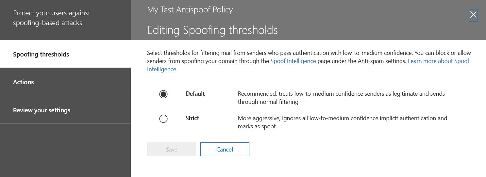

# Ulteriori informazioni su spoof intelligence

Utilizzare lo spoofing significa intelligence nella protezione &amp; centro conformità della **pagina Impostazioni di protezione da posta indesiderata** per esaminare tutti i mittenti che lo spoofing entrambi i domini che fanno parte della propria organizzazione o lo spoofing i domini esterni. Business intelligence di spoofing è disponibile come parte di Office 365 Enterprise E5 o separatamente come parte di protezione avanzata di rischio. 
  
## Quali tipi di spoofing di posta elettronica è possibile esaminare e che deve essere implementata di protezione contro con intelligence spoofing?

Per i domini si possiede, è possibile esaminare i mittenti che sono lo spoofing del dominio e quindi scegliere di consentire al mittente di continuare o bloccare il mittente. Per i domini esterni, è possibile consentire del dominio del mittente combinato con l'infrastruttura di invio, anche se non un singolo messaggio di posta elettronica indirizzo del mittente.
  
Quando un mittente esegue lo spoofing un indirizzo di posta elettronica, sembrano essere l'invio dei messaggi per conto di uno o più account utente all'interno di uno dei domini dell'organizzazione o un dominio esterno l'invio dell'organizzazione. Sorprendentemente, esistono alcuni motivi aziendali legittimi per lo spoofing. In questi casi, ad esempio, evitare di bloccare il mittente da attacchi di spoofing del dominio:
  
- È necessario mittenti di terze parti che utilizzano il dominio per l'invio di posta in blocco ai dipendenti di società sondaggi.
    
- Si è appena assunto una società esterna per creare e inviare aggiornamenti pubblicità o prodotto per conto dell'utente.
    
- Un Assistente che regolarmente deve inviare la posta elettronica per un altro utente all'interno dell'organizzazione.
    
- Applicazione che è configurata per eseguire lo spoofing all'organizzazione per inviare notifiche interne tramite posta elettronica.
    
I domini esterni frequenza inviare la posta elettronica di spoofing e molti dei motivi seguenti sono legittimi. Ad esempio, di seguito sono alcuni casi legittimi quando i mittenti esterni inviano la posta elettronica falsificato:
  
- Il mittente è incluso un elenco di indirizzi discussioni e lista di distribuzione è l'inoltro di posta elettronica del mittente originale a tutti i partecipanti della lista.
    
- Una società esterna è l'invio di posta elettronica per conto di un'altra società (ad esempio, un report automatizzato o una società di software come servizio).
    
È necessario un modo per verificare che la posta inviata da curiosi legittimi venga incrementata filtro da posta indesiderata in Office 365 o sistemi di posta elettronica esterno. Office 365 in genere, considera i messaggi di posta elettronica come posta indesiderata. L'amministratore di Office 365, si hanno la possibilità di evitare questo problema configurando spoofing filtri di sicurezza &amp; centro conformità. Se si è proprietari del dominio, è possibile configurare SPF, DKIM e DMARC consentiti per i mittenti.
  
D'altra parte, curiosi dannosi, i mittenti che spoofing il dominio o domini esterni, inviare la posta elettronica da posta indesiderata o phishing, devono essere bloccate. Lo spoofing è inoltre spesso utilizzati per autori ottenere le credenziali dell'utente. Office 365 dispone di una protezione incorporata spoofing per proteggere l'organizzazione da mittenti di questi messaggi di posta elettronica. Spoofing di protezione per i domini dell'organizzazione è sempre abilitata per tutti i clienti di Office 365 e protezione spoofing dominio esterno è in per impostazione predefinita per i clienti di protezione da minacce avanzate. Per ulteriori informazioni potenziare la protezione, commenti mittenti a cui sono autorizzati a effettuare lo spoofing domini dell'organizzazione e inviare la posta elettronica per conto dell'utente e se sono consentiti effettuare lo spoofing i domini esterni. Qualsiasi messaggio di posta elettronica inviato da un mittente che non li si autorizza verrà considerato come posta indesiderata o lo spoofing da Office 365. Uno sguardo ai mittenti lo spoofing del dominio e a migliorare spoofing intelligence utilizzando la protezione &amp; centro conformità.
  
## Gestione di business intelligence di simulazione in sicurezza &amp; centro conformità

Il criterio di business intelligence spoofing che è impostare viene sempre applicato da Office 365. Non è possibile disabilitare, ma è possibile scegliere la quantità attivamente gestirlo.
  
È possibile esaminare mittenti spoofing del dominio o domini esterni e quindi decidere se ogni mittente deve essere consentito a tale scopo, utilizzare la sicurezza &amp; centro conformità. Per ogni account utente spoofing che esegue lo spoofing un mittente dal dominio o un dominio esterno, è possibile visualizzare le informazioni nella tabella seguente.
  
|**Parametro**|**Descrizione**|
|:-----|:-----|
|Mittente    |Acronimo di mittente true. Si tratta in genere il dominio da cui proviene il messaggio di posta elettronica spoofing. Office 365 determina il dominio del puntatore del record DNS (PTR) dell'indirizzo IP del mittente che è lo spoofing dell'organizzazione. Se non viene trovato alcun dominio, il report viene invece visualizzato indirizzo IP del mittente.    |
|Spoofing utente    |L'account utente che è spoofing dal mittente.    Solo per la scheda **interno** . Questo campo viene visualizzato un indirizzo di posta elettronica singolo o se il mittente è lo spoofing più account utente, contiene **uno o più**.  Scheda **esterno** . Solo i domini esterni contengono un dominio di invio e non contengono un indirizzo di posta elettronica completo.  > [!TIP]> **Per gli amministratori esperti.** L'utente spoofing è From indirizzo (5322.From) che è anche l'indirizzo visualizzato come indirizzo dal client di posta elettronica. Questo è detto anche indirizzo header.from. La validità di questo indirizzo non viene controllato da SPF.           |
|Numero di messaggi    |Il numero di messaggi di posta elettronica inviati dal mittente dell'organizzazione per conto del mittente spoofing identificati o mittenti negli ultimi 30 giorni.    |
|Numero di reclami degli utenti    |Reclami archiviati per gli utenti di questo mittente dagli utenti negli ultimi 30 giorni. Reclami sono in genere sotto forma di invio di posta indesiderata a Microsoft.    |
|Risultato dell'autenticazione    |Questo valore viene **passato** se il mittente passato mittente di Exchange Online Protection (EOP) controlli di autenticazione, ad esempio SPF o DKIM, **non è riuscita** se il mittente ha superato i controlli di autenticazione mittente EOP o **sconosciuto** se non è il risultato di questi controlli Nota.    |
|Per impostare decisione    |Visualizza se l'amministratore di Office 365 o i criteri di business intelligence spoofing determinato se il mittente è consentito effettuare lo spoofing dell'utente.    |
|Ultimo rilevamento    |Ultima data in cui è stato ricevuto un messaggio da questo mittente per conto di questo utente falsificato.    |
|È consentito effettuare lo spoofing?    | Consente di visualizzare o meno il mittente è autorizzato a inviare posta elettronica per conto dell'utente falsificato. I valori possibili sono:  **Sì** Tutti gli indirizzi spoofing da questo mittente spoofing saranno consentiti effettuare lo spoofing dell'organizzazione.    **N** Spoofing degli indirizzi da questo mittente spoofing non sarà consentiti effettuare lo spoofing dell'organizzazione. Al contrario, i messaggi da questo mittente verranno contrassegnati come posta indesiderata da Office 365.  **Alcuni utenti** Se un mittente è lo spoofing più utenti, alcuni spoofing degli indirizzi da questo mittente saranno consentiti effettuare lo spoofing dell'organizzazione, nella parte restante verrà contrassegnata come posta indesiderata. Utilizzare la scheda **Detailed** per visualizzare gli indirizzi specifici.  |
|Tipo di spoofing    |Questo valore su **Internal** se il dominio è uno dei domini di provisioning dell'organizzazione, in caso contrario il valore è **esterna**.    |
   
 **Per gestire i mittenti che sono lo spoofing del dominio utilizzando la protezione &amp; centro conformità**
  
1. Visitare il [protezione &amp; centro conformità](https://protection.office.com).
    
2. Accedere a Office 365 con l'account di lavoro o della scuola. L'account deve disporre delle credenziali di amministratore dell'organizzazione Office 365.
    
3. In sicurezza &amp; centro conformità, espandere **Threat Management** \> **criteri** \> **protezione da posta indesiderata**.
  

  
4. Nella pagina **impostazioni di protezione da posta indesiderata** nel riquadro destro, selezionare la scheda **personalizzata** e quindi scorrere verso il basso ed espandere **criteri di business intelligence spoofing**. 
  

  
5. Per visualizzare l'elenco dei mittenti lo spoofing del dominio, scegliere **i mittenti di nuovo la revisione** e selezionare il * * domini Your * * scheda. 
    
    Se già stato rivisto mittenti e si desidera modificare alcune delle scelte precedenti, è possibile scegliere **Mostra mittenti già esaminato** invece. In entrambi i casi, viene visualizzato il riquadro successivo. 
  

  
Ogni utente spoofing viene visualizzato in una riga separata in modo che è possibile scegliere se consentire o bloccare il mittente di spoofing singolarmente ogni utente.
  
Per aggiungere un mittente all'elenco Consenti di un utente, selezionare **Sì** nella colonna **consentito effettuare lo spoofing** . Per aggiungere un mittente all'elenco di blocco per un utente, scegliere **No**.
  
Per impostare i criteri per i domini non si è proprietari, selezionare la scheda **Domini esterni** modificare qualsiasi mittente su **Sì** nella colonna **è consentito effettuare lo spoofing significa** consentire che mittente di inviare la posta elettronica non autenticato nell'organizzazione. In alternativa, se si ritiene che Office 365 apportate da un errore in consente al mittente di inviare la posta elettronica falsificato, modificare la colonna **consentito effettuare lo spoofing** su **No**. 
  

  
6. Scegliere **Salva** per salvare le modifiche. 
    
## Configurazione dei criteri anti-spoofing

Oltre che per consentire o bloccare un determinato mittente di inviare posta elettronica falsificato nella propria organizzazione, è inoltre possibile configurare come strict si desidera filtrare per essere, l'azione da eseguire quando viene rilevato un messaggio di spoofing e per suggerimenti sulla sicurezza per consentire o meno protezione anti-spoofing.
  
Protezione anti-spoofing viene applicata alla posta elettronica da mittenti da domini esterni all'organizzazione di Office 365. È possibile applicare i criteri ai destinatari le cui cassette postali vengono concessi in licenza per Office 365 Enterprise E5 o avanzate Threat Protection. Gestire i criteri anti-spoofing e le altre impostazioni di protezione anti-phishing degli strumenti di analisi. Per ulteriori informazioni sulle impostazioni di protezione anti-phishing degli strumenti di analisi, vedere [impostare i criteri di anti-phishing Office 365](https://support.office.com/article/set-up-office-365-atp-anti-phishing-policies-5a6f2d7f-d998-4f31-b4f5-f7cbf6f38578?ui=en-US&amp;rs=en-US&amp;ad=US#phishpolicyoptions).
  
Office 365 include la protezione anti-spoofing predefinita che è sempre in esecuzione. Questo tipo di protezione predefinita non è visibile nella protezione &amp; centro conformità o recuperabile tramite i cmdlet di Windows PowerShell. È possibile modificare la protezione anti-spoofing predefinito. In realtà, è possibile configurare come Office 365 impone la protezione anti-spoofing in ogni criterio di protezione anti-phishing creati personalmente. 
  
Anche se il criterio di protezione anti-spoofing viene visualizzato in base ai criteri per la protezione anti-phishing degli strumenti di analisi &amp; centro conformità, non eredita il relativo comportamento predefinito dal phishing esistente impostazione in configurazione protezione da posta indesiderata. Se si dispone di impostazioni di **protezione da posta indesiderata** \> **Phishing** che si desidera eseguire la replica per la protezione anti-spoofing, è necessario creare un criterio di protezione anti-phishing e quindi modificare la parte di spoofing dei criteri anti-phishing in modo da riflettere le impostazioni di spoofing come descritto nella sezione seguente invece che da accettare le impostazioni predefinite che vengono eseguite in background. 
  
 **Per configurare la protezione anti-spoofing all'interno di un criterio di protezione anti-phishing utilizzando la protezione &amp; centro conformità**
  
1. Visitare il [protezione &amp; centro conformità](https://protection.office.com).
    
2. Accedere a Office 365 con l'account di lavoro o della scuola. L'account deve disporre delle credenziali di amministratore dell'organizzazione Office 365.
    
3. In sicurezza &amp; centro conformità, espandere **Threat Management** \> **criteri** \> **Anti-phishing degli strumenti di analisi**. 
    
4. Nella pagina **protezione Anti-phishing** nel riquadro destro selezionare i criteri di anti-phishing che si desidera configurare. 
    
5. Nella pagina visualizzata nella riga **spoofing** , scegliere **Modifica**. 
    
6. Alle **soglie Spoofing** pagina, se si seleziona **predefinito**, quindi vengono recapitati tutti i messaggi in modo esplicito o implicito passare l'autenticazione, vale a dire inviato per il filtro di posta elettronica normale. Se si seleziona **Strict**, quindi i messaggi che transitano in modo implicito l'autenticazione con confidenza medie dimensioni, anche noto come un composito autenticazione "pass soft", verrà ignorata comunque e contrassegnati come spoofing di messaggi di posta elettronica. L'impostazione Strict è aggressivo e genererà falsi positivi. Effettuare la selezione e quindi selezionare **le azioni**. 
  

  
7. Configurare quindi le azioni da intraprendere quando un messaggio viene rilevato come una simulazione di altri domini. Il comportamento predefinito consiste nello spostare il messaggio nella cartella posta indesiderata del destinatario. L'opzione altro deve inviare il messaggio in quarantena. Per ulteriori informazioni sulla gestione dei messaggi messi in quarantena, vedere [i messaggi di posta elettronica quarantena in Office 365](quarantine-email-messages.md).
  

  
8. Scegliere se abilitare o disabilitare lo spoofing anti suggerimenti sulla sicurezza. Office 365 è consigliabile abilitare la punta di sicurezza **autenticazione ha esito negativo** per avvisare gli utenti quando si interagisce con un mittente non è possibile verificare la cui identità. Office 365 consiglia inoltre di abilitare la punta di sicurezza per un **passaggio di autenticazione reversibile** per piccoli gruppi di utenti, poiché questo suggerimento sicurezza può generare una quantità elevata di avvisi se l'utente riceve posta elettronica provenienti da origini legittimi, ma non autenticati. 
  

  
Effettuare la selezione e quindi selezionare **Salva**. 
    
## Altri modi per gestire lo spoofing e phishing con Office 365

Essere attente sulla protezione di phishing e spoofing. Di seguito sono i metodi correlati per controllo sul mittenti lo spoofing del dominio e impedirne danneggiare l'organizzazione:
  
- Controllare il report di posta di Exchange Online Protection spoofing come parte di una routine. È possibile utilizzare questo rapporto spesso per visualizzare e gestire i mittenti spoofing. Per informazioni, vedere **report tramite posta elettronica di spoofing** in [rapporti di protezione di utilizzo della posta in Office 365 per visualizzare i dati su malware, posta indesiderata e rilevamenti delle regole](https://technet.microsoft.com/library/dn500744%28v=exchg.150%29.aspx).
    
- Per più avanzate: gli amministratori di Office 365
    
  - Esaminare la configurazione del mittente Policy Framework (SPF). Per una breve introduzione a SPF e per ottenere una configurazione rapidamente, vedere [impostare SPF in Office 365 per evitare attacchi di spoofing](https://technet.microsoft.com/library/dn789058%28v=exchg.150%29.aspx). Per una più approfondita dei come Office 365 utilizza SPF o per le distribuzioni di risoluzione dei problemi o non standard, ad esempio le distribuzioni ibride, iniziare con [la modalità di Office 365 utilizza mittente Policy Framework (SPF) per impedire attacchi di spoofing](https://technet.microsoft.com/library/mt712724%28v=exchg.150%29.aspx).
    
  - Esaminare la configurazione DomainKeys identificato posta (DKIM). È consigliabile utilizzare DKIM oltre SPF e DMARC al fine di evitare curiosi di inviare messaggi che sembrano provenire dal dominio. DKIM consente di aggiungere una firma digitale per i messaggi di posta elettronica nell'intestazione del messaggio. Per informazioni, vedere [Utilizzo DKIM per convalidare la posta elettronica inviata dal dominio in Office 365](https://technet.microsoft.com/library/mt695945%28v=exchg.150%29.aspx).
    
  - Esaminare la configurazione di autenticazione dei messaggi, Reporting e conformità (DMARC) basati sul dominio. L'implementazione di DMARC con DKIM e SPF offre ulteriore protezione da posta elettronica di phishing e spoofing. Vengono fornite informazioni utili DMARC ricevente sistemi di posta elettronica determinano cosa fare con i messaggi inviati dal dominio che SPF fail o DKIM per i controlli. Per informazioni, vedere [Utilizzo DMARC per convalidare la posta elettronica in Office 365](https://technet.microsoft.com/library/mt734386%28v=exchg.150%29.aspx).
    
  - Utilizzare il cmdlet [Get-PhishFilterPolicy](https://technet.microsoft.com/en-us/library/mt735158%28v=exchg.160%29.aspx) Windows PowerShell per raccogliere dati dettagliati sul mittenti spoofing, generare Consenti e blocca elenchi e consentono di determinare la modalità di generare più completo record SPF, DKIM e DMARC DNS senza difficoltà la posta elettronica legittimi venga incrementato filtro da posta indesiderata esterno. Per ulteriori informazioni, vedere [funzionamento antispoofing della protezione in Office 365](https://blogs.msdn.microsoft.com/tzink/2016/02/23/how-antispoofing-protection-works-in-office-365/).
    

