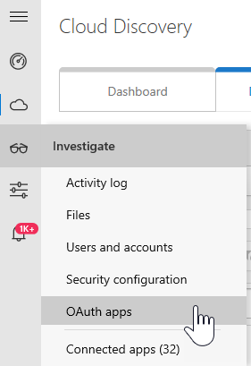
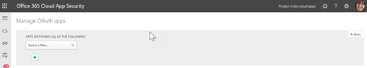

# Gestire le app di OAuth con Office 365 Cloud App Security

|Valutazione * *\>**|Pianificazione * *\>**|Distribuzione * *\>**|Utilizzo * * *|
|:-----|:-----|:-----|:-----|
|[Avviare la valutazione](office-365-cas-overview.md)   |[Iniziare a pianificare](get-ready-for-office-365-cas.md)   |[Avviare la distribuzione](turn-on-office-365-cas.md)   |Si è seguito!    [Passaggi successivi](manage-app-permissions-in-ocas.md#nextsteps)   |
   
Persone amare App e vengono scaricati spesso, soprattutto delle applicazioni che utenti interazione utente verranno risparmiare tempo e rendere più semplice ottenere il proprio lavoro o scuola informazioni. Alcune applicazioni potenzialmente potrebbero comportare rischi di protezione dell'organizzazione, a seconda delle informazioni che accedono e modalità di gestione di tali informazioni. Con [Office 365 Cloud App protezione](office-365-cas-overview.md), in caso di un amministratore globale o di sicurezza, è possibile gestire App OAuth per l'organizzazione. È possibile visualizzare le persone App utilizza con Office 365 dati, quali autorizzazioni tali applicazioni hanno e altro ancora. 
  
In questo articolo viene descritto dove è possibile per gestire le app OAuth, come approvare, escludere o un'app di report e come creare una query di app.
  
## Come trovare la pagina di App gestire OAuth

> [!NOTE]
> OAuth App vengono gestite nel portale di Office 365 Cloud App sicurezza. È necessario essere un amministratore globale o sicurezza per eseguire l'attività seguente. Per informazioni su ulteriori, vedere [autorizzazioni in Office 365 Security &amp; centro conformità](permissions-in-the-security-and-compliance-center.md). 
  
1. Accedere a [https://protection.office.com](https://protection.office.com) e accedere utilizzando l'account di lavoro o della scuola per Office 365. (Si passa alla sicurezza &amp; centro conformità.) 
    
2. Accedere agli **avvisi** \> **Gestione avanzata degli avvisi**.
    
3. Fare clic su (o toccare) **accedere a Office 365 Cloud App sicurezza**.  **Nota**: se Office 365 Cloud App è attivata la protezione non ancora, è possibile farlo in questa pagina. Vedere [prepararsi per la protezione di Office 365 Cloud App](get-ready-for-office-365-cas.md). 
  
4. Scegliere **indagare** \> **apps OAuth**.  
  
## Verrà visualizzato nella pagina Gestisci OAuth App

Nella tabella seguente vengono descritti i controlli e le opzioni disponibili nella pagina Gestisci OAuth app.
  
|**Elemento**|**Descrizione**|
|:-----|:-----|
|Base icona nella barra delle applicazioni query    |Selezionare questa opzione per passare alla visualizzazione avanzata.    (Se viene visualizzata **base**, si utilizza la visualizzazione avanzata)    |
|Icona avanzata nella barra delle applicazioni query    |Selezionare questa opzione per passare alla visualizzazione di base.    (Se viene visualizzata **Avanzate**, si utilizza la visualizzazione di base.)    |
|Aprire o chiudere tutti i dettagli delle icone app    |Selezionare questa icona per visualizzare più o meno informazioni dettagliate su ogni app.    |
|Esporta l'icona nell'elenco app    |Selezionare questa icona per esportare un file CSV contenente un elenco delle App, numero di utenti per ogni applicazione, le autorizzazioni associate le app, il livello di autorizzazioni, allo stato delle app, e Usa il livello di community.    |
|Name    |Utilizzare per visualizzare il nome di una selezione di App, il nome per visualizzare ulteriori informazioni, ad esempio la descrizione, publisher, sito Web app e ID app.    |
|Autorizzato da    |Questa scheda per visualizzare il numero di utenti è autorizzati a un'applicazione di accedere al proprio account di Office 365. Selezionare il numero di visualizzare ulteriori informazioni, ad esempio un elenco di account utente.    |
|Livello di autorizzazione    |Questa scheda per visualizzare il tipo di accesso un'app sia ai dati di Office 365. Livelli di autorizzazioni indicano **bassa**, **Media**o **alta**, in **basso** potrebbe indicare che l'app accede solo profili e il nome dell'utente. Selezionare il livello di visualizzare ulteriori informazioni, ad esempio le autorizzazioni concesse per le app, l'utilizzo di community e attività correlati nel [Registro di Governance](suspend-or-restore-an-account-in-ocas.md).  |
|Ultima autorizzato   |Questa scheda per visualizzare la data e ora che un'app OAuth ultimo è stata autorizzata ad accedere i dati dell'organizzazione Office 365.    |
|Azioni   |Utilizzare questa opzione per visualizzare o per contrassegnare un'applicazione come approvato o Banned, segnalare un'app OAuth a Microsoft oppure lasciare come indeterminato.    |
   
## Contrassegnare un'applicazione come approvati

Nella pagina **applicazioni di gestire OAuth** , individuare l'app che si desidera approvare e scegliere l'icona **app contrassegna come approvati** . 
  

  
L'icona viene verde e l'applicazione viene approvata per tutti gli utenti di Office 365.
  
> [!NOTE]
> Quando si contrassegna un'app come approvati, non esiste alcun effetto sull'utente finale. Contrassegno visivamente le app approvate consente di separarli da applicazioni che non sono state implementate ancora. 
  
## Escludere un'app

1. Nella pagina **applicazioni di gestire OAuth** , individuare l'app che si desidera escludere e scegliere l'icona **vietata app contrassegna come** . 
  
2. Nella finestra di messaggio di notifica, mantenere il testo esistente invariata o personalizzare il testo. Scegliere se si desidera informare gli utenti che è stata vietata la propria applicazione.   
  
3. Scegliere **divieto app**.

## Segnalare un'app OAuth a Microsoft

Se si desidera inviare un'app OAuth a Microsoft per l'analisi, è possibile segnalare che app.

1. Nella pagina **applicazioni di gestire OAuth** , individuare l'app che si desidera inviare per l'analisi.

2. Fare clic sui puntini di sospensione verticale e quindi fare clic su **Report app....**.  

3. Nella finestra di dialogo **Report l'app** , utilizzare l'elenco a discesa per indicare il problema. Per impostazione predefinita, **questa applicazione è dannosa** viene selezionata. Tuttavia, è possibile scegliere una delle opzioni disponibili.  

4. (Scelta consigliata) Mantenere l'opzione per contattare l'utente selezionato e verificare l'indirizzo di posta elettronica elencato (o modifica).

5. Scegliere **Submit**. 
    
## Creare una query di app

È consigliabile utilizzare la visualizzazione avanzata, simile al seguente: 

Nella barra di query delle applicazioni, se viene visualizzata **Avanzate**, si utilizza la visualizzazione di base. Fare clic su **Avanzate** per passare alla visualizzazione avanzata (o toccare). 

    
1. Nella barra di query, utilizzare l'elenco **Selezionare un filtro** per scegliere un'opzione. 
    - **App** App con determinati nomi
    - **Stato delle App** Applicazioni in base al proprio stato (approvato, Banned o elementi indeterminati)
    - **Utilizzare community** App basato sulla community di utilizzare i livelli (Rare, Uncommon o comune)
    - **Livello di autorizzazione** App basato su determinati livelli di autorizzazione 
    - **Autorizzazioni** App che richiedono autorizzazioni specifiche
    - **Server di pubblicazione**  App da determinati autori
    - **Utente** Applicazioni che un determinato utente autorizzato
   
2. Selezionare **è uguale a** o **diverso**e quindi specificare un valore per il filtro.
    
3. Per aggiungere ulteriori filtri, selezionare il segno di addizione () e quindi ripetere i passaggi 2 e 3.
    
4. Per rimuovere un filtro, selezionare il x () accanto al nome di un filtro.
    
Vengono applicati automaticamente i filtri e l'elenco di applicazioni viene aggiornata di conseguenza.
  
## Passaggi successivi

- [Leggere ed eseguire l'azione gli avvisi](review-office-365-cas-alerts.md)
    
- Esaminare i [registri di traffico Web e le origini dati per la protezione di Office 365 Cloud App](web-traffic-logs-and-data-sources-for-ocas.md)
    
- Esaminare le [attività di utilizzo per la protezione di Office 365 Cloud App](utilization-activities-for-ocas.md)
    

