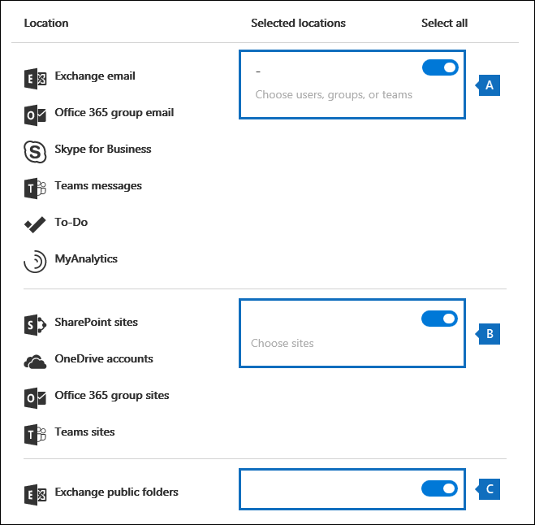

# <a name="manage-gdpr-data-subject-requests-with-the-dsr-case-tool-in-the-security--compliance-center"></a>Gestire le richieste del soggetto dei dati di GDPR con lo strumento dei casi DSR nel centro sicurezza & Compliance

Il regolamento generale sulla protezione dei dati (GDPR) dell'UE riguarda la protezione e l'abilitazione dei diritti di privacy degli individui all'interno dell'Unione europea (UE). Il GDPR fornisce agli individui nell'Unione europea (noti come soggetti di dati) il diritto di accedere, recuperare, correggere, cancellare e limitare l'elaborazione dei dati personali. In GDPR, i dati personali significano tutte le informazioni relative a una persona fisica identificata o identificabile. Una richiesta formale da parte di una persona alla propria organizzazione di intraprendere un'azione sui propri dati personali è denominata richiesta del soggetto dei dati o DSR. Per informazioni dettagliate sulla risposta a richieste DSR per i dati in Office 365, vedere [office 365 data Subject Request guide](https://go.microsoft.com/fwlink/?linkid=871169 ).
  
Per gestire le indagini in risposta a un DSR inviato da una persona all'interno dell'organizzazione, è possibile utilizzare lo strumento di gestione dei casi DSR nel centro sicurezza & Compliance per individuare il contenuto archiviato in:
  
- Qualsiasi cassetta postale dell'utente nell'organizzazione. Questo include conversazioni di Skype for business e chat One-to-One in Microsoft Teams
    
- Tutte le cassette postali associate a un gruppo di Office 365 e a tutte le cassette postali di Microsoft Teams
    
- Tutti i siti di SharePoint Online e gli account di OneDrive for Business nell'organizzazione
    
- Tutti i siti dei team e i siti del gruppo di Office 365 nell'organizzazione
    
- Tutte le cartelle pubbliche in Exchange Online
    
Se si utilizza lo strumento di caso DSR, è possibile:
  
- Creare un caso distinto per ogni indagine DSR.
    
- Controllare chi ha accesso al caso DSR aggiungendo persone come membri del caso. solo i membri possono accedere al caso e possono visualizzarne solo i casi nell'elenco dei casi nella pagina **casi DSR** nel centro sicurezza & Compliance. È inoltre possibile assegnare autorizzazioni diverse a membri diversi dello stesso caso. Ad esempio, è possibile consentire ad alcuni membri di visualizzare solo il caso e i risultati della ricerca e consentire ad altri membri di creare ricerche ed esportare i risultati della ricerca. 
    
- Utilizzare la ricerca incorporata per cercare tutto il contenuto creato o caricato da uno specifico soggetto dei dati.
    
- Facoltativamente, rivedere la query di ricerca incorporata e rieseguire la ricerca per restringere i risultati della ricerca.
    
- Aggiungere altre ricerche di contenuto associate al caso DSR. Ciò include la creazione di ricerche che restituiscono elementi parzialmente indicizzati e log generati dal sistema da My Analytics e dal servizio di roaming di Office.
    
- Esportare i dati in risposta a una richiesta di accesso o di esportazione DSR.
    
- Eliminare i casi in cui il processo di analisi DSR è stato completato; in questo modo verranno rimosse tutte le ricerche e i processi di esportazione associati al caso.
    
Di seguito è indicato il processo di alto livello per l'utilizzo dello strumento di gestione dei casi DSR per gestire le indagini DSR:
  
[Step 1: Assign eDiscovery permissions to potential case members](#step-1-assign-ediscovery-permissions-to-potential-case-members)

[Passaggio 2: creare un caso DSR e aggiungere membri](#step-2-create-a-dsr-case-and-add-members)

[Passaggio 3: eseguire la query di ricerca](#step-3-run-the-search-query)

[Passaggio 4: esportare i dati](#step-4-export-the-data)

[Optional Passaggio 5: Revisione della query di ricerca incorporata](#optional-step-5-revise-the-built-in-search-query)

[Ulteriori informazioni sull'utilizzo dello strumento di caso DSR](#more-information-about-using-the-dsr-case-tool)
  
> [!IMPORTANT]
> Gli strumenti consentono agli amministratori di eseguire le richieste di accesso o di esportazione DSR, consentendo loro di utilizzare la funzionalità di ricerca e esportazione incorporata trovata nello strumento di caso DSR. Lo strumento consente di semplificare un metodo di maggiore rilevanza per esportare i dati rilevanti per una richiesta DSR inviata da un soggetto dei dati. Tuttavia, è importante tenere presente che i risultati della ricerca possono variare in base all'interessato o alle azioni amministrative adottate che possono influire sul fatto che un elemento venga considerato o meno come "dati personali" ai fini dell'esportazione. Ad esempio, se l'interessato è stato l'ultimo a modificare un file che non è stato creato, il file potrebbe non essere restituito nei risultati della ricerca. Analogamente, un amministratore può esportare dati senza includere elementi parzialmente indicizzati o tutte le versioni dei documenti di SharePoint. Gli strumenti forniti consentono pertanto di semplificare l'accesso e l'esportazione delle richieste di dati. Tuttavia, i risultati sono soggetti a scenari di utilizzo specifici dell'amministratore e del soggetto dei dati. 
  
## <a name="step-1-assign-ediscovery-permissions-to-potential-case-members"></a>Passaggio 1: Assegnare autorizzazioni di eDiscovery a potenziali membri del caso

Per impostazione predefinita, un amministratore globale di Office 365 può accedere allo strumento dei casi DSR nel centro sicurezza & Compliance. In base alla progettazione, altri utenti, ad esempio un responsabile della privacy dei dati, un manager delle risorse umane o altre persone coinvolte in indagini DSR, non hanno accesso allo strumento per i casi DSR e dovranno essere assegnate le autorizzazioni appropriate per accedere allo strumento. Il modo più semplice per eseguire questa operazione consiste nell'accedere alla pagina **autorizzazioni** nel centro sicurezza e conformità di & e aggiungere gli utenti al gruppo di ruoli Gestione eDiscovery. Tenere presente che è inoltre necessario assegnare queste autorizzazioni in modo da poterle aggiungere come membri del caso DSR creato nel passaggio 2. 
  
Per istruzioni dettagliate, vedere [assegnare le autorizzazioni di eDiscovery nel centro conformità _AMP_ sicurezza di Office 365](assign-ediscovery-permissions.md).
  
> [!NOTE]
> Per impostazione predefinita, un amministratore globale di Office 365 (o altri membri del gruppo di ruoli Gestione organizzazione nel centro sicurezza & Compliance non dispongono delle autorizzazioni necessarie per esportare i risultati della ricerca del contenuto (vedere il passaggio 4 in questo articolo). Per risolvere questo ruolo, un amministratore può aggiungersi come membro del gruppo di ruoli eDiscovery Manager. 
  
## <a name="step-2-create-a-dsr-case-and-add-members"></a>Passaggio 2: creare un caso DSR e aggiungere membri

Il passaggio successivo consiste nel creare un caso DSR. Quando si crea un caso, è possibile scegliere di avviare la ricerca incorporata oppure è possibile creare il caso senza avviare la ricerca. La procedura seguente consente di creare il caso senza avviare la ricerca e quindi di mostrare come aggiungere membri al caso.
  
1. [https://protection.office.com](https://protection.office.com) Accedere a Office 365 utilizzando l'account aziendale o dell'Istituto di istruzione. 
    
2. Nel centro sicurezza & Compliance fare clic su richieste degli \> **interessati**per la **privacy dei dati** e quindi fare clic su  **nuovo caso DSR**.
    
3. Nella pagina **nuovo** riquadro a comparsa del modello DSR, assegnare un nome al caso, digitare una descrizione facoltativa e quindi fare clic su **Avanti**. Tenere presente che il nome del caso deve essere univoco nell'organizzazione.
    
    > [!TIP]
    > È consigliabile aggiungere il nome della persona che ha inviato la richiesta DSR che si sta esaminando nel nome e/o nella descrizione del nuovo caso. Tenere presente che solo i membri di questo caso (e gli amministratori di eDiscovery) saranno in grado di visualizzare il caso nell'elenco dei casi della pagina **richieste del soggetto dei dati** . 
  
4. Nella pagina dei **Dettagli della richiesta** , in **oggetto dati (la persona che ha archiviato questa richiesta)**, selezionare la persona a cui si desidera trovare ed esportare i dati e quindi fare clic su **Avanti**.
    
5. Nella pagina **conferma le impostazioni del caso** , è possibile modificare il nome e la descrizione del caso, quindi selezionare un soggetto dei dati differente. In caso contrario, è sufficiente fare clic su **Salva**.
    
    Viene visualizzata una pagina che conferma che è stato creato il nuovo caso DSR.
    
    
  
    A questo punto, è possibile eseguire una delle due operazioni seguenti:
    
    un. Facendo clic su **Mostra i risultati della ricerca** viene avviata la ricerca. Questa è la selezione predefinita. La ricerca incorporata eseguita quando si seleziona questa opzione e i risultati restituiti vengono descritti nel passaggio 3.
    
    b. Se si fa clic su **fine** , il nuovo caso DSR viene chiuso senza avviare la ricerca incorporata. Quando si seleziona questa opzione, il nuovo caso DSR viene visualizzato nella pagina **richieste del soggetto dei dati** .
    
6. Fare clic su **fine** in modo che sia possibile accedere al nuovo caso DSR e aggiungervi i membri. 
    
7. Nella pagina **richieste del soggetto dei dati** fare clic sul nome del caso DSR appena creato. 
    
8. Nella pagina Gestisci il riquadro a comparsa di **questo caso** , in **Gestisci membri**fare clic su **Aggiungi**. 
    
    In **utenti**è visualizzato un elenco di persone a cui sono state assegnate le autorizzazioni di eDiscovery appropriate. Tenere presente che gli utenti a cui sono state assegnate le autorizzazioni di eDiscovery nel passaggio 1 verranno visualizzati in questo elenco. 
    
9. Selezionare gli utenti da aggiungere come membri del caso DSR, fare clic su **Aggiungi**e quindi salvare le modifiche apportate.
    
    Si noti che è inoltre possibile aggiungere gruppi di ruoli come membri del caso DSR facendo clic su **Aggiungi** in **Gestisci gruppi di ruoli**. 
    
## <a name="step-3-run-the-search-query"></a>Passaggio 3: eseguire la query di ricerca

Dopo aver creato un caso DSR e aver aggiunto membri, il passaggio successivo consiste nell'eseguire la ricerca incorporata associata al caso. Questa query di ricerca predefinita esegue le operazioni seguenti:
  
- Esegue la ricerca in tutte le cassette postali dell'organizzazione per tutti gli elementi di posta elettronica inviati o ricevuti dall'interessato. Questa operazione viene eseguita utilizzando la proprietà di posta elettronica dei *partecipanti* , che esegue la ricerca dell'interessato in tutti i campi persone di un messaggio di posta elettronica. Questa proprietà restituisce gli elementi in cui il soggetto dei dati si trova nei campi **da**, **a**, **CC**e **Ccn** . Le cartelle pubbliche in Exchange Online vengono ricercate anche per i messaggi inviati o ricevuti dall'interessato. 
    
- Cerca in tutti i siti dell'organizzazione documenti ed elementi creati o caricati dall'interessato. Questa operazione viene eseguita utilizzando le proprietà del sito seguenti:
    
  - La proprietà *Author* restituisce gli elementi in cui il soggetto dei dati è elencato nel campo autore nei documenti di Office. Questo valore viene mantenuto, anche se il documento viene copiato e caricato da un altro utente. 
    
  - La proprietà *CreatedBy* restituisce gli elementi che sono stati creati o caricati dall'interessato. 
    
Di seguito è riportato l'aspetto della query con parole chiave per la ricerca incorporata che viene creata automaticamente quando si crea un caso DSR.
  
```
participants:"<email address>" OR author:"<display name>" OR createdby:"<display name>"
```

Ad esempio, se il nome del soggetto dei dati è ina Fanucci, la query di parole chiave avrà l'aspetto seguente:
  
```
participants:"ina@contoso.com" OR author:"Ina Leonte" OR createdby:"Ina Leonte"
```

 **Per eseguire la ricerca incorporata per un caso DSR:**
  
1. Nel centro sicurezza & Compliance fare clic su \> **richieste degli interessati**per la **privacy dei dati** e quindi fare clic su **Apri** accanto al caso DSR creato nel passaggio 2. 
    
    Fare clic sulla scheda **ricerca** nella parte superiore della pagina e quindi fare clic sulla casella di controllo accanto alla ricerca incorporata creata quando è stato creato il nuovo caso DSR. Nota la ricerca ha lo stesso nome del caso DSR. 
    
2. Nella pagina riquadro a comparsa di ricerca fare clic su **Apri query**.
    
    Quando si apre la query, la ricerca viene avviata e verrà completata in pochi istanti. 
    
3. Al termine della ricerca, fare clic su **Anteprima risultati** per visualizzare in anteprima i risultati della ricerca. Per ulteriori informazioni, vedere [anteprima dei risultati della ricerca](content-search.md#preview-search-results).
    
    > [!TIP]
    > È inoltre possibile visualizzare le statistiche delle query di ricerca per visualizzare il numero di cassette postali e gli elementi del sito restituiti dalla ricerca e le posizioni di contenuto principali che contengono elementi che corrispondono alla query di ricerca. Per ulteriori informazioni, vedere [visualizzare informazioni e statistiche su una ricerca](content-search.md#view-information-and-statistics-about-a-search). 
  
È possibile modificare la query di ricerca incorporata, modificare i percorsi di contenuto ricercati e quindi eseguire di nuovo la ricerca. Per ulteriori informazioni, vedere [passaggio 5](#optional-step-5-revise-the-built-in-search-query) . 
  
## <a name="step-4-export-the-data"></a>Passaggio 4: esportare i dati

Dopo aver eseguito la ricerca incorporata, è possibile esportare i risultati della ricerca. In alternativa, prima di esportare i dati, è possibile che si desideri rivedere la query per ridurre il numero di risultati di ricerca. Per ulteriori informazioni su come limitare i risultati della ricerca, vedere passaggio 5.
  
Quando si esportano i risultati della ricerca, è possibile scaricare gli elementi delle cassette postali nei file PST o come singoli messaggi. Quando si esporta contenuto dagli account di SharePoint e OneDrive, vengono esportate copie dei documenti di Office native e di altri documenti. Nei risultati della ricerca è incluso anche un file dei risultati che contiene informazioni su tutti gli elementi esportati. Per informazioni più dettagliate sull'esportazione, vedere [Export content search results](export-search-results.md).
  
> [!NOTE]
> Per impostazione predefinita, un amministratore globale di Office 365 (o altri membri del gruppo di ruoli Gestione organizzazione nel centro sicurezza & Compliance) non dispone delle autorizzazioni necessarie per esportare i risultati della ricerca del contenuto. Per risolvere questo ruolo, un amministratore può aggiungersi come membro del gruppo di ruoli eDiscovery Manager. 
  
Il computer utilizzato per esportare i dati deve soddisfare i seguenti requisiti di sistema:
  
- Windows 7 a 32 o 64 bit e versioni successive
    
- Microsoft .NET Framework 4.7
    
- Browser supportato:
    
  - Microsoft Edge
    
    Oppure
    
  - Microsoft Internet Explorer 10 e versioni successive
    
    > [!NOTE]
    > Microsoft non produce estensioni o componenti aggiuntivi di terze parti per le applicazioni ClickOnce. L'esportazione dei dati utilizzando un browser non supportato con estensioni o componenti aggiuntivi di terze parti non è supportata. 
  
 **Per esportare i dati dalla ricerca incorporata in un caso DSR:**
  
1. Nel centro sicurezza & Compliance fare clic su \> **richieste degli interessati**per la **privacy dei dati** e quindi fare clic su **Apri** accanto al caso DSR da cui si desidera esportare i dati. 
    
2. Fare clic sulla scheda **ricerca** nella parte superiore della pagina e quindi fare clic sulla casella di controllo accanto alla ricerca incorporata creata quando è stato creato il caso DSR. Oppure fare clic su un'altra ricerca per esportare i dati dalla ricerca. 
    
3. Nella pagina riquadro a comparsa di ricerca  **altre**icone dei risultati di ricerca e quindi selezionare **Esporta risultati** dall'elenco a discesa. 
    
4. Nella pagina **Export results** selezionare le opzioni consigliate seguenti per le richieste di esportazione DSR. 
    
    
  
    un. In **Opzioni di output**selezionare la prima opzione ( **tutti gli elementi, ad eccezione di quelli che dispongono di un formato non riconosciuto, sono crittografati o non sono stati indicizzati per altri motivi**) per esportare solo gli elementi indicizzati. Il motivo per cui non si desidera esportare gli elementi parzialmente indicizzati dalla ricerca incorporata è dato che gli elementi parzialmente indicizzati provenienti da altri utenti verranno esportati. Per esportare solo gli elementi parzialmente indicizzati per il soggetto dei dati, si consiglia di creare una ricerca distinta. Per ulteriori informazioni, vedere [esportare gli elementi parzialmente indicizzati](#exporting-partially-indexed-items) nella sezione "ulteriori informazioni sull'utilizzo dello strumento del caso DSR".
    
    b. In **Esporta contenuto di Exchange come**selezionare la terza opzione, **un file PST contenente tutti i messaggi in una singola cartella**. Poiché alcuni dei risultati possono essere per gli elementi originati dalla cassetta postale di un altro utente, questa opzione consente di elencare solo l'elemento in una singola cartella senza indicare la cassetta postale effettiva ed è l'opzione migliore da utilizzare per la deduplicazione dei risultati come consigliato nell'elemento successivo. . Questa opzione consente inoltre agli elementi di revisione del soggetto dei dati in ordine cronologico (gli elementi sono ordinati in base alla data di invio) senza dover esplorare la struttura delle cartelle della cassetta postale originale per ogni elemento.
    
    c. Selezionare **Abilita** opzione di deduplicazione per escludere i messaggi di posta elettronica duplicati. Questa opzione è consigliabile perché la ricerca incorporata esegue ricerche in tutte le cassette postali dell'organizzazione. Pertanto, se vengono trovate più copie dello stesso messaggio nelle cassette postali che sono state cercate, questa opzione significa che verrà esportata solo una copia di un messaggio. Questa opzione, insieme esporterà i messaggi in un unico file PST in una singola cartella, consentirà di ottenere la migliore esperienza utente per le richieste di esportazione DSR. Si noti che il report Export results. csv elenca tutte le posizioni in cui sono stati trovati messaggi duplicati.
    
    Facoltativamente, è possibile selezionare l'opzione **Includi versioni per documenti di SharePoint** per esportare tutte le versioni dei documenti di SharePoint e OneDrive. Questo richiede che il controllo delle versioni sia attivato per le raccolte documenti. Questa opzione consente di garantire che tutti i dati rilevanti vengano esportati.
    
5. Dopo aver scelto le impostazioni di esportazione, fare clic su **Esporta**.
    
    I risultati della ricerca sono pronti per il download, il che significa che sono stati caricati nell'area di archiviazione di Azure per l'organizzazione nel cloud Microsoft. Nei passaggi successivi viene illustrato come scaricare questi dati nel computer locale.
    
6. Fare clic sulla scheda **Esporta** per visualizzare il processo di esportazione appena creato. Si noti che i processi di esportazione hanno lo stesso nome della ricerca corrispondente con **_Export** accodati alla fine del nome della ricerca. 
    
7. Fare clic sul processo di esportazione appena creato per visualizzare la pagina di esportazione del riquadro a comparsa. In questa pagina sono riportate informazioni sulla ricerca, ad esempio le dimensioni e il numero totale di elementi da esportare, e la percentuale degli elementi trasferiti in un'area di archiviazione di Azure. Fare clic su **Aggiorna** per aggiornare le informazioni sullo stato del caricamento. 
    
8. In **Chiave di esportazione**, fare clic su **Copia negli Appunti**. Per scaricare i risultati della ricerca, è possibile utilizzare questa chiave nel passaggio 11.
    
9. Fare  della ricerca dell'icona **download** nella parte superiore della pagina Esporta riquadro a comparsa. 
    
10. Nella finestra popup nella parte inferiore della pagina, fare clic su **Apri** per aprire lo strumento di **esportazione di eDiscovery di Microsoft Office 365**. Lo **strumento di esportazione di eDiscovery** verrà installato la prima volta che si scaricano i risultati della ricerca. 
    
11. Nello **strumento di esportazione di eDiscovery**incollare la chiave di esportazione copiata nel passaggio 8 nella casella appropriata.
    
12. Fare clic su **Sfoglia** per specificare il percorso in cui si desidera scaricare i file dei risultati della ricerca. 
    
    > [!NOTE]
    > A causa dell'elevato numero di attività del disco (letture e scritture), è necessario scaricare i risultati della ricerca in un'unità disco locale. non scaricarli in un'unità di rete mappata o in un altro percorso di rete. 
  
13. Fare clic su **Avvia** per scaricare i risultati della ricerca nel computer. 
    
    Lo **Strumento di esportazione eDiscovery** consente di visualizzare informazioni sullo stato delle informazioni relative al processo di esportazione, incluso il numero stimato (e le dimensioni) degli elementi rimanenti da scaricare. Al termine del processo di esportazione, è possibile accedere ai file nel percorso in cui sono stati scaricati. Per ulteriori informazioni sui report che includono quando si scaricano i risultati della ricerca contenuto, vedere la sezione [altre informazioni](export-search-results.md#more-information) in "esportare i risultati della ricerca del contenuto". 
    
Una volta esportati i dati, i risultati della ricerca e i report di esportazione si trovano in una cartella con lo stesso nome del caso DSR. I file PST che contengono gli elementi delle cassette postali si trovano in una sottocartella denominata **Exchange**. I documenti e gli altri elementi provenienti dai siti si trovano in una sottocartella denominata **SharePoint**. 
  
## <a name="optional-step-5-revise-the-built-in-search-query"></a>Optional Passaggio 5: Revisione della query di ricerca incorporata

Dopo aver eseguito la ricerca incorporata, è possibile modificarla in modo da restringere l'ambito per restituire un numero minore di risultati della ricerca. È possibile eseguire questa operazione aggiungendo condizioni alla query. Una condizione è connessa logicamente alla query di parole chiave dall'operatore **and** . Questo significa che per essere restituiti nei risultati della ricerca, gli elementi devono soddisfare sia la query di parole chiave che tutte le condizioni aggiunte. Questo è il modo in cui le condizioni aiutano a limitare i risultati. Se si aggiungono due o più condizioni univoche a una query di ricerca (condizioni che specificano proprietà diverse), tali condizioni sono connesse logicamente dall'operatore **and** . Questo significa che vengono restituiti solo gli elementi che soddisfano tutte le condizioni (oltre alla query con parole chiave). Se si aggiungono più valori, separati da virgole o da due punti a una singola condizione, tali valori sono connessi dall'operatore **or** . Ciò significa che gli elementi vengono restituiti se contengono uno dei valori specificati per la proprietà nella condizione. 
  
Di seguito sono riportati alcuni esempi delle condizioni che è possibile aggiungere alla query di ricerca incorporata di un caso DSR. Il nome della proprietà effettiva utilizzata in una query di ricerca viene visualizzato tra parentesi.
  
- **Tipo file ( `filetype`)** -specifica l'estensione di un documento o di un file. Utilizzare questa condizione per cercare i documenti e i file creati da specifiche applicazioni di Office, ad esempio Word, Excel e OneNote. 
    
- **Tipo di messaggio `kind`()** -specifica il tipo di elemento di posta elettronica da cercare. Ad esempio, è possibile utilizzare la sintassi `kind:email OR kind:im` per restituire solo messaggi di posta elettronica e conversazioni di Skype for business o chat uno-a-uno in Microsoft teams. 
    
- **Tag Compliance`compliancetag`()** -specifica un'etichetta assegnata a un messaggio di posta elettronica o a un documento. Questa condizione restituirà gli elementi classificati con una specifica etichetta. Le etichette vengono utilizzate per classificare la posta elettronica e i documenti per la governance dei dati e applicare le regole di conservazione in base alla classificazione definita dall'etichetta. Si tratta di una condizione utile per le indagini DSR perché l'organizzazione può utilizzare etichette per classificare il contenuto relativo alla privacy dei dati o che contiene dati personali o informazioni riservate. Per il valore di questa condizione, utilizzare il nome completo dell'etichetta o la prima parte del nome dell'etichetta con un carattere jolly. Per ulteriori informazioni, vedere [Overview of labels in Office 365](labels.md).
    
Per un elenco e una descrizione di tutte le condizioni disponibili nello strumento dei casi DSR, [](keyword-queries-and-search-conditions.md#search-conditions) vedere l'articolo relativo alle condizioni di ricerca nella sezione "query con parole chiave e condizioni di ricerca per la ricerca di contenuto". 
  
### <a name="changing-the-content-locations-that-are-searched"></a>Modifica dei percorsi di contenuto in cui è stata eseguita la ricerca

Oltre a rivedere la ricerca incorporata per un caso DSR, è anche possibile modificare i percorsi di contenuto in cui è stata eseguita la ricerca. Come spiegato in precedenza, la ricerca integrata Cerca tutte le cassette postali e i siti dell'organizzazione e tutte le cartelle pubbliche di Exchange Online. Ad esempio, è possibile limitare la ricerca per cercare solo la cassetta postale dell'interessato e l'account OneDrive e i siti di SharePoint selezionati. Se si sceglie di cercare siti specifici, è necessario aggiungere ogni sito che si desidera ricercare.
  
Per modificare i percorsi di contenuto per la ricerca:
  
1. Aprire la ricerca incorporata per la quale si desidera modificare le posizioni di contenuto.
    
2. Nella query di ricerca, in **percorsi**, fare clic su **modifica** accanto all'opzione **percorsi specifici** . 
    
    
  
    Viene visualizzata la pagina **modifica** riquadro a comparsa. Di seguito sono riportate le descrizioni dei percorsi di contenuto nella ricerca incorporata e alcune informazioni sulla modifica delle posizioni ricercate. 
    
    
  
    un. La sezione attiva/disattiva in **Seleziona tutto** in cassetta postale nella parte superiore della pagina a comparsa è selezionata, che indica che tutte le cassette postali vengono cercate. Per limitare l'ambito della ricerca, fare clic sull'interruttore per deselezionarlo e quindi fare clic su **Scegli utenti, gruppi o team** e scegliere cassette postali specifiche per la ricerca.
    
    b. L'opzione toggle in **Seleziona tutto** nella sezione siti al centro della pagina a comparsa è selezionata, che indica che vengono ricercati tutti i siti. Per limitare la ricerca ai siti selezionati, deselezionare l'opzione toggle e quindi fare clic su **Scegli siti**. Sarà necessario aggiungere ogni sito specifico che si desidera cercare, incluso l'account OneDrive dell'interessato.
    
    c. L'opzione toggle nella sezione cartelle pubbliche di Exchange è selezionata, il che significa che tutte le cartelle pubbliche di Exchange vengono cercate. Si noti che è possibile eseguire la ricerca solo in tutte le cartelle pubbliche di Exchange o in nessuna di esse. Non è possibile scegliere quelle specifiche per la ricerca.
    
3. Se si modificano i percorsi di contenuto nella ricerca incorporata, fare clic su **Salva &amp; esecuzione** per riavviare la ricerca. 
  
## <a name="more-information-about-using-the-dsr-case-tool"></a>Ulteriori informazioni sull'utilizzo dello strumento di caso DSR

Nelle sezioni seguenti sono disponibili ulteriori informazioni sull'utilizzo dello strumento del caso DSR per rispondere alle richieste di esportazione DSR.
  
[Esportazione di dati da analisi e servizio di roaming di Office](#exporting-data-from-myanalytics-and-the-office-roaming-service)

[Esportazione di elementi parzialmente indicizzati](#exporting-partially-indexed-items)

[Ricerca ed esportazione di dati da Microsoft teams e gruppi di Office 365](#searching-and-exporting-data-from-microsoft-teams-and-office-365-groups)

[Ricerca di cartelle pubbliche di Exchange](#searching-exchange-public-folders)
  
### <a name="exporting-data-from-myanalytics-and-the-office-roaming-service"></a>Esportazione di dati da analisi e servizio di roaming di Office

È possibile utilizzare lo strumento dei casi DSR per cercare ed esportare i dati di utilizzo generati da Analytics e dal servizio di roaming di Office. Ecco una descrizione di cosa fanno questi servizi:
  
- **Analisi** : fornisce agli utenti informazioni su come passano il proprio tempo in base ai dati del calendario e della posta nella loro cassetta postale. Tutte le informazioni di analisi sono derivate da intestazioni di posta elettronica e riunioni nella cassetta postale dell'utente. Gli utenti a cui è assegnata una licenza di analisi possono accedere a Office 365 e passare al dashboard di analisi per visualizzare le informazioni dettagliate su come passano il proprio tempo. Gli utenti possono schermare queste informazioni in risposta a una richiesta di accesso DSR. La ricerca incorporata in un caso DSR esporterà i dati utilizzati per generare informazioni di analisi. 
    
- **Office roamIng Service** -roaming è un servizio in cui vengono archiviate le impostazioni relative a Office, ad esempio il tema di Office, il dizionario personalizzato, le impostazioni della lingua, la modalità di sviluppo e la correzione automatica. 
    
I dati di Analytics e del servizio di roaming di Office sono archiviati in una cassetta postale di un soggetto dei dati nelle cartelle nascoste che si trovano in un sottoalbero non-interpersonale (non IPM) delle cassette postali di Exchange Online. Questo significa che i dati vengono nascosti dalla visualizzazione dell'utente quando utilizzano Outlook o altri client di posta elettronica per accedere alla propria cassetta postale. Per ulteriori informazioni sulle cartelle nascoste, vedere [MAPI hidden folders](https://go.microsoft.com/fwlink/?linkid=872758).
  
È possibile creare una ricerca di contenuto distinta e associarla a un caso DSR che restituisce i dati di utilizzo del servizio di analisi e di gestione del roaming di Office nei soggetti dei dati. Questi dati non sono inclusi nelle statistiche di ricerca e non saranno disponibili per l'anteprima. Tuttavia, è possibile esportarlo e quindi darlo all'interessato in risposta a una richiesta di esportazione DSR.
  
Quando si esportano dati da Analytics e dal servizio di roaming di Office, i dati vengono salvati in una cartella distinta per ogni applicazione che si trova nella cartella **ApplicationDataRoot** , che si trova in una cartella con il nome dell'indirizzo di posta elettronica del soggetto dei dati. Questi dati vengono esportati come file JSON, che sono file di testo leggibili in modo umano simili ai file XML o TXT, allegati ai messaggi di posta elettronica. Attualmente, queste cartelle sono denominate con un identificatore univoco globale (GUID) assegnato a Analytics e il servizio di roaming di Office, elencati nella tabella seguente. Nelle versioni future dello strumento dei casi DSR, il GUID verrà sostituito con il nome dell'applicazione effettiva. 
  
|**Applicazione**|**GUID/nome cartella**|
|:-----|:-----|
|MyAnalytics  <br/> |3c896ded-22c5-450F-91F6-3d1ef0848f6e  <br/> |
|Servizio di roaming di Office  <br/> |1caee58f-EB14-4a6b-9339-1fe2ddf6692b  <br/> |
   
 **Per eseguire la ricerca e l'esportazione di dati di analisi e di servizio di roaming di Office:**
  
1. Nel centro sicurezza & Compliance fare clic su \> **richieste degli interessati**per la **privacy dei dati** e quindi fare clic su **Apri** accanto al caso DSR per l'oggetto dei dati per il quale si desidera esportare i dati di utilizzo. 
    
2. Fare clic sulla scheda **ricerca** nella parte superiore della pagina e quindi fare clic  **Ricerca guidata**icona.
    
3. Fare clic su **Annulla** nella pagina **nome della ricerca** . 
    
4. In **query di ricerca**, nella condizione di **tipo** , selezionare le caselle di controllo accanto a **analisi** e servizio di roaming di **Office**. 
    
    
  
    Si noti che la condizione di **tipo** (ovvero le classi dei messaggi di posta elettronica) dovrebbe essere l'unico elemento nella query di ricerca. È possibile eliminare la casella **parole chiave** o lasciarla vuota. 
    
5. In **percorsi**verificare che le **posizioni specifiche** siano selezionate e quindi fare clic su **modifica**.
    
6. Nella parte superiore della pagina **modifica** riquadro a comparsa posizioni (la sezione cassetta postale), fare clic su **Scegli utenti, gruppi o team**.
    
7. Nella pagina **modifica posizioni** fare clic su **Scegli utenti, gruppi o team**, scegliere la cassetta postale del soggetto dei dati e quindi salvare la selezione. 
    
8. Fare clic su **Salva &amp; esecuzione**e quindi assegnare un nome alla ricerca e salvarla.
    
    Viene avviata la ricerca.
    
 **Per esportare i dati di analisi e servizi di roaming di Office:**
  
1. Quando la ricerca creata nel passaggio precedente è stata completata, fare clic sulla scheda **ricerca** nella parte superiore della pagina e quindi fare clic sulla casella di controllo accanto alla ricerca. Potrebbe essere necessario fare clic  Aggiorna **aggiornamento** per visualizzare la ricerca. 
    
2. Nella pagina riquadro a comparsa di ricerca  **altre**icone dei risultati di ricerca e quindi selezionare **Esporta risultati** dall'elenco a discesa. 
    
3. Nella pagina **Export results** selezionare le opzioni consigliate per esportare i dati di utilizzo. 
    
    
  
    un. In **Opzioni di output**selezionare la prima opzione ( **tutti gli elementi, ad eccezione di quelli che dispongono di un formato non riconosciuto, sono crittografati o non sono stati indicizzati per altri motivi**) per esportare solo gli elementi indicizzati.
    
    b. In **Esporta contenuto di Exchange come**selezionare la seconda opzione, **un file PST contenente tutti i messaggi**.
    
    c. Lasciare deselezionate le opzioni di esportazione rimanenti.
    
4. Dopo aver scelto le impostazioni di esportazione, fare clic su **Esporta**.
    
    I risultati della ricerca sono pronti per il download, il che significa che sono stati caricati nell'area di archiviazione di Azure per l'organizzazione nel cloud Microsoft. Nei passaggi successivi viene illustrato come scaricare questi dati nel computer locale.
    
5. Fare clic sulla scheda **Esporta** per visualizzare il processo di esportazione appena creato. Si noti che i processi di esportazione hanno lo stesso nome della ricerca corrispondente con **_Export** accodati alla fine del nome della ricerca. 
    
6. Fare clic sul processo di esportazione appena creato per visualizzare la pagina di esportazione del riquadro a comparsa. 
    
7. In **Chiave di esportazione**, fare clic su **Copia negli Appunti**. Per scaricare i risultati della ricerca, è possibile utilizzare questa chiave nel passaggio 10.
    
8. Fare  della ricerca dell'icona **download** nella parte superiore della pagina Esporta riquadro a comparsa. 
    
9. Nella finestra popup nella parte inferiore della pagina, fare clic su **Apri** per aprire lo strumento di **esportazione di eDiscovery di Microsoft Office 365**. Lo **strumento di esportazione di eDiscovery** verrà installato la prima volta che si scaricano i risultati della ricerca. 
    
10. Nello **strumento di esportazione di eDiscovery** incollare nella casella appropriata la chiave di esportazione copiata nel passaggio 7.
    
11. Fare clic su **Sfoglia** per specificare il percorso in cui si desidera scaricare i file dei risultati della ricerca. 
    
    > [!NOTE]
    > A causa dell'elevato numero di attività del disco (letture e scritture), è necessario scaricare i risultati della ricerca in un'unità disco locale. non scaricarli in un'unità di rete mappata o in un altro percorso di rete. 
  
12. Fare clic su **Avvia** per scaricare i risultati della ricerca nel computer. 
    
    Lo **Strumento di esportazione eDiscovery** consente di visualizzare informazioni sullo stato delle informazioni relative al processo di esportazione, incluso il numero stimato (e le dimensioni) degli elementi rimanenti da scaricare. Al termine del processo di esportazione, è possibile aprire il file PST di Exchange in Outlook e quindi passare alla cartella **ApplicationDataRoot** per accedere alle sottocartelle di Analytics e del servizio di roaming. 
    
    Come spiegato in precedenza, i file JSON che contengono i dati di utilizzo sono allegati ai messaggi. Per visualizzare un file JSON, fare clic su un messaggio e quindi aprire il file JSON collegato. 
  
### <a name="exporting-partially-indexed-items"></a>Esportazione di elementi parzialmente indicizzati

Si consiglia di non esportare gli elementi parzialmente indicizzati (denominati anche elementi non indicizzati) dalla ricerca incorporata creata quando si crea un nuovo caso DSR. Questo perché i risultati della ricerca saranno più che probabili includere gli elementi parzialmente indicizzati per gli altri utenti dell'organizzazione e non solo gli elementi parzialmente indicizzati per il soggetto dei dati. Si consiglia invece di creare una ricerca di contenuto distinta associata al caso DSR che è stato creato per esportare solo gli elementi parzialmente indicizzati correlati all'interessato. 
  
Di seguito viene indicato un processo di alto livello per esportare gli elementi parzialmente indicizzati. Una volta esportati, è possibile esaminarli per determinare se un elemento risponde a una richiesta di accesso o di esportazione DSR.
  
1. Aprire il caso DSR e creare una nuova ricerca nella pagina di **ricerca** . 
    
2. Utilizzare i criteri seguenti per configurare la query di ricerca e i percorsi di contenuto per la ricerca:
    
    - Utilizzare una query di parole chiave vuota/vuota. Verranno restituiti tutti gli elementi presenti nei percorsi di contenuto in cui viene eseguita la ricerca.
    
    - Cercare solo la cassetta postale di Exchange Online del soggetto dei dati e il relativo account OneDrive.
    
3. Dopo aver eseguito la ricerca e il completamento, è possibile esportare e scaricare i risultati della ricerca, come descritto nel [passaggio 4](#step-4-export-the-data). Per esportare gli elementi parzialmente indicizzati, utilizzare le impostazioni seguenti. 
    
    - In **Opzioni di output**selezionare la terza opzione ( **solo gli elementi che dispongono di un formato non riconosciuto, sono crittografati o non sono stati indicizzati per altri motivi**) per esportare solo gli elementi parzialmente indicizzati.
    
    - In **Esporta contenuto di Exchange come**, è possibile selezionare qualsiasi opzione in base alle preferenze. 
    
    - Se si seleziona l'opzione **Includi versioni per documenti di SharePoint** , verranno esportate le versioni dei documenti se una versione è parzialmente indicizzata. 
    
Per ulteriori informazioni sugli elementi parzialmente indicizzati, vedere: 
  
- [Partially indexed items in Content Search in Office 365](partially-indexed-items-in-content-search.md) (Elementi parzialmente indicizzati in Ricerca contenuto in Office 365)

- [Esportazione di elementi parzialmente indicizzati](export-search-results.md#exporting-partially-indexed-items)
    
### <a name="searching-and-exporting-data-from-microsoft-teams-and-office-365-groups"></a>Ricerca ed esportazione di dati da Microsoft teams e gruppi di Office 365

Le conversazioni che fanno parte dell'elenco chat in Microsoft Teams (denominate chat del team o chat di uno-a-uno) sono archiviate nella cassetta postale di Exchange Online degli utenti che partecipano alle chat. Inoltre, i file che una persona condivide in una chat uno-a-uno sono archiviati nell'account OneDrive della persona che condivide il file. Poiché la ricerca incorporata Cerca tutte le cassette postali e gli account di OneDrive nell'organizzazione, le chat del team e i documenti condivisi in una sessione di chat (in cui il soggetto dei dati è stato creato o caricato) verranno restituiti dalla ricerca incorporata in un caso DSR.
  
In alternativa, le conversazioni che fanno parte di un canale di Teams (denominati anche messaggi di canale) vengono memorizzate nella cassetta postale associata a un team. Questi tipi di conversazioni a cui ha partecipato il soggetto dei dati vengono restituiti anche dalla ricerca incorporata perché vengono cercate tutte le cassette postali associate a Microsoft teams. Inoltre, le mattonelle che un soggetto dei dati potrebbe avere condiviso in un canale teams vengono archiviate nel sito di SharePoint del team. I file creati o uploadedby i dati verranno restituiti dalla ricerca incorporata in un caso DSR perché i siti associati a Microsoft teams sono inclusi nella ricerca.
  
Analogamente, le cassette postali e i siti di SharePoint che corrispondono a un gruppo di Office 365 sono anch ' essi inclusi nella ricerca incorporata. Questo significa che verranno restituiti i messaggi di posta elettronica inviati o ricevuti dall'interessato e dai file creati o caricati dall'interessato. 
  
Per ulteriori informazioni sull'utilizzo di ricerca contenuto per cercare gli elementi in Microsoft teams e i gruppi di Office 365 o per visualizzare un elenco di membri, vedere la sezione "ricerca di gruppi di Microsoft teams e Office 365" in [Ricerca contenuto in Office 365](content-search.md#searching-microsoft-teams-and-office-365-groups). 
  
### <a name="searching-exchange-public-folders"></a>Ricerca di cartelle pubbliche di Exchange

La ricerca incorporata in un caso DSR restituirà solo i messaggi di posta elettronica che il soggetto dei dati ha inviato a una cartella pubblica abilitata alla posta elettronica o ai messaggi inviati da un altro utente a una cartella pubblica e ha copiato anche l'interessato. Non restituirà un messaggio che potrebbe essere stato inviato a una cartella pubblica. Per cercare gli elementi inseriti nell'oggetto dei dati in una cartella pubblica, è possibile creare una ricerca di contenuto di creare una distinta che consente di ricercare tutti gli elementi inseriti in una cartella pubblica dall'interessato.
  
Di seguito viene indicato un processo di alto livello per cercare gli elementi che il soggetto dei dati potrebbe aver postato in una cartella pubblica. 
  
1. Aprire il caso DSR e creare una nuova ricerca nella pagina di **ricerca** . 
    
2. Utilizzare i criteri seguenti per configurare la query di ricerca e i percorsi di contenuto per la ricerca:
    
  - Nella casella **parole chiave** utilizzare la query di ricerca seguente: 
    
    ```
    itemclass:ipm.post AND "<email address of the data subject>"
    ```

  - Eseguire una ricerca in tutte le cartelle pubbliche di Exchange
    
  - Dopo aver eseguito la ricerca e il completamento, è possibile esportare e scaricare i risultati della ricerca, come descritto nel [passaggio 4](#step-4-export-the-data). Per esportare gli elementi parzialmente indicizzati, utilizzare le impostazioni seguenti. 
