# Utilizzare Compliance Manager per soddisfare i requisiti normativi e garantire la protezione dei dati quando si utilizzano i servizi cloud Microsoft

 *Compliance Manager non è disponibile in Office 365 gestito da 21Vianet, Office 365 Germany, Office 365 U.S. Government Community High (GCC High) o Office 365 Dipartimento della Difesa.* 
  
Compliance Manager è uno strumento di valutazione dei rischi basato sul flusso di lavoro in Microsoft [Introduzione a Microsoft Service Trust Portal](https://support.office.com/article/f30e2353-0bd6-41ed-8347-eea1fb8d2662), che consente di monitorare, assegnare e verificare le attività di conformità dell'organizzazione correlate ai Microsoft Professional Services e a servizi cloud come Microsoft Office 365, Microsoft Dynamics 365 e Microsoft Azure. Compliance Manager:
  
- Combina le informazioni dettagliate fornite da Microsoft ai revisori e ai regolatori come parte di vari audit di terze parti dei servizi cloud Microsoft in relazione a vari standard (ad esempio, ISO 27001, ISO 27018 e NIST) e le informazioni che Microsoft elabora internamente per la conformità alle normative (come HIPAA e il Regolamento generale sulla protezione dei dati dell'UE o GDPR) con la propria autovalutazione della conformità dell'organizzazione a questi standard e normative.
    
- Consente di assegnare, monitorare e registrare le attività correlate alla valutazione, che consentono all'organizzazione di superare gli ostacoli riscontrati dai team e di raggiungere gli obiettivi di conformità.
    
- Fornisce un punteggio di conformità che consente di monitorare i progressi e dare la priorità ai controlli che aiuteranno a ridurre l'esposizione al rischio dell'organizzazione.
    
- Fornisce un archivio sicuro per poter caricare e gestire le evidenze e altri elementi correlati per le attività di conformità.
    
- Produce report dettagliati in Microsoft Excel che documentano le attività di conformità eseguite da Microsoft e dall'organizzazione, da fornire ai revisori, alle autorità di regolamentazione e ad altre parti interessate della conformità.
    
> [!IMPORTANT]
> Compliance Manager è un dashboard che fornisce un riepilogo della protezione e della conformità dei dati, suggerendo come migliorarli. Le azioni dei clienti fornite nel Compliance Manager sono elementi consigliati; spetta a ciascuna organizzazione valutarne l'efficacia nel rispettivo contesto normativo prima dell'implementazione. Gli elementi consigliati disponibili nel Compliance Manager non devono essere interpretati come una garanzia di conformità.
    
## Che cos'è il Compliance Manager?

Compliance Manager è uno strumento di valutazione dei rischi in base al flusso di lavoro, concepito per gestire la conformità alle normative nel modello di responsabilità condivisa del cloud. Offre una visualizzazione su dashboard di standard, normative e valutazioni che contengono i risultati dei test e i dettagli sull'implementazione del controllo Microsoft e il monitoraggio e le linee guida all'implementazione del controllo del cliente che l'organizzazione può inserire. Compliance Manager garantisce definizioni sul controllo di valutazione delle certificazioni, indicazioni sull'implementazione e test dei controlli, con classificazione dei controlli in base al rischio, gestione di accesso in base al ruolo e flusso di lavoro di assegnazione delle azioni di controllo sul posto per monitorare l'implementazione del controllo e testare la gestione delle evidenze. Compliance Manager ottimizza il carico di lavoro di conformità consentendo ai clienti di raggruppare le valutazioni in modo logico e applicare test di controllo di valutazione a controlli identici o correlati, riducendo la moltiplicazione degli sforzi necessaria per eseguire controlli identici tra certificazioni diverse.
  
## Uso della ricerca

  
Fare clic sulla lente di ingrandimento nell'angolo in alto a destra della pagina per espandere il campo di inserimento della ricerca, inserire i termini di ricerca e premere Invio. Apparirà il controllo di ricerca, con il termine di ricerca nel campo di inserimento del riquadro di ricerca, quindi i risultati della ricerca appariranno sotto.
  
Per impostazione predefinita, la ricerca restituirà i documenti risultanti e tramite l'opzione di filtro degli elenchi a discesa sarà possibile restringere l'elenco dei documenti visualizzati, aggiungere o rimuovere i risultati visualizzati. Per restringere i documenti restituiti in base a servizi cloud specifici, categorie di conformità o procedure di sicurezza, zone del mondo o settori, utilizzare più attributi del filtro contemporaneamente. Fare clic sul collegamento al nome del documento per scaricare il documento.
  

  
Fare clic sul collegamento Compliance Manager per visualizzare i risultati della ricerca per i controlli di valutazione Compliance Manager. I risultati della ricerca nell'elenco mostrano la data di creazione della valutazione, il nome di raggruppamento delle valutazioni, il servizio cloud applicabile e se si tratta di controlli gestiti da Microsoft o dai clienti.
  

  
> [!NOTE]
> Report e documenti di Service Trust Portal possono essere scaricati per almeno 12 mesi dalla pubblicazione o finché non diventa disponibile una nuova versione del documento. 
 
## Supporto alla localizzazione

Service Trust Portal consente di visualizzare il contenuto della pagina in diverse lingue. Per cambiare la lingua della pagina, basta fare clic sull'icona del globo nell'angolo inferiore sinistro della pagina e selezionare la lingua scelta. 
  

## Valutazioni in Compliance Manager

Il componente di base di Compliance Manager è la *valutazione*. Una valutazione è la valutazione di un servizio Microsoft rispetto allo standard di certificazione o alle normative sulla protezione dei dati (ad esempio ISO 27001:2013 e GDPR). Le valutazioni consentono di individuare le condizioni di conformità e protezione dei dati dell'organizzazione rispetto agli standard del settore selezionato, per il servizio cloud Microsoft scelto. Le valutazioni vengono completate dall'implementazione dei controlli associati agli standard di certificazione valutati. 
  
La struttura di una valutazione si basa sulla responsabilità condivisa tra Microsoft e l'organizzazione per valutare i rischi relativi alla sicurezza e alla conformità nel cloud e per implementare le misure di protezione dei dati specificate da uno standard di conformità, uno standard di protezione dei dati, una normativa o una legge.
  
Una valutazione è costituita da diversi componenti:
  
- **Servizi in ambito**: ogni valutazione si applica a un set di servizi Microsoft, elencati nella sezione relativa ai servizi cloud in ambito. 
    
- **Controlli gestiti da Microsoft**: per ogni servizio cloud Microsoft implementa e gestisce un set di *controlli* nell'ambito di conformità di Microsoft a vari standard e normative. Tali controlli sono organizzati in *famiglie di controlli* in linea con la struttura della certificazione o normativa corrispondente a sua volta in linea con la valutazione. Per ogni controllo gestito da Microsoft, Compliance Manager offre informazioni dettagliate su come è stato implementato il controllo, nonché su come e quando tale implementazione è stata testata e convalidata da un revisore di terze parti indipendente. 
    
    Di seguito viene riportato un esempio di tre controlli gestiti da Microsoft nella famiglia **Protezione** da una valutazione di Office 365 e del GDPR. 

    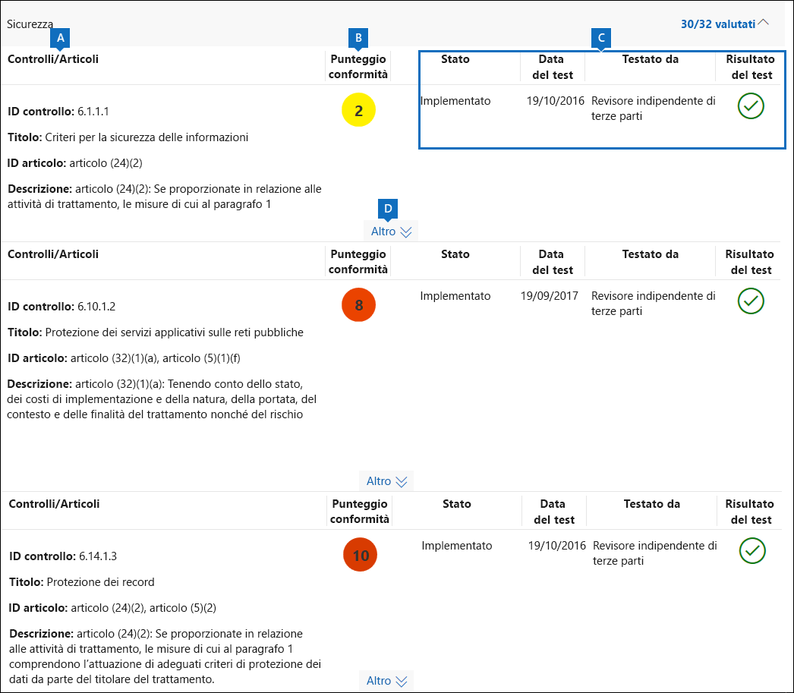
  
  a. Specifica le informazioni seguenti dalla certificazione o dalle normative associate al controllo gestito da Microsoft.

  - **ID di controllo**: il numero della sezione o dell'articolo della certificazione o delle normative associati al controllo.
    
  - **Titolo**: il titolo della certificazione o della normativa corrispondenti.
    
  - **ID dell'articolo**: questo campo è incluso solo per le valutazioni GDPR, poiché specifica il numero dell'articolo GDPR corrispondente.
    
  - **Descrizione**: il testo dello standard o della normativa associati al controllo gestito da Microsoft selezionato.

  b. Il punteggio di conformità per il controllo, che indica il livello di rischio (a causa di problemi di conformità o di controllo) associato a ogni controllo gestito da Microsoft. Vedere [Informazioni sul punteggio di conformità](#understanding-the-compliance-score) per ulteriori informazioni. Si noti che i punteggi di conformità vengono valutati da 1 a 10 e sono contraddistinti dal colore. Giallo indica controlli a basso rischio, arancione indica i controlli di rischio medio e rosso indica i controlli ad alto rischio. 
    
  c. Le informazioni relative allo stato di implementazione di un controllo, alla data in cui il controllo è stato sottoposto a test, alla persona che ha eseguito il test e al risultato del test.
    
  d. Per ciascun controllo, è possibile selezionare **Altro** per visualizzare maggiori informazioni, tra cui i dettagli sull'implementazione del controllo di Microsoft e su come il controllo è stato testato e convalidato da un revisore di terze parti indipendente. 
    
- **Controlli gestiti dal cliente**: si tratta della raccolta di controlli che sono gestiti dall'organizzazione. L'organizzazione è responsabile dell'implementazione di questi controlli in ambito del processo di conformità, per determinati standard o normative. I controlli gestiti dal cliente sono inoltre organizzati in famiglie di controlli per la certificazione o la normativa corrispondenti. Utilizzare i controlli gestiti dal cliente per implementare le azioni raccomandate suggerite da Microsoft in ambito delle attività di conformità. L'organizzazione può utilizzare le guide prescrittive e le azioni cliente suggerite in ciascun controllo gestito dai clienti, per gestire il processo di implementazione per quel determinato controllo.
    
    I controlli gestiti dai clientie nelle valutazioni dispongono inoltre di funzionalità di gestione del flusso di lavoro incorporate che consentono di gestire e monitorare lo stato di avanzamento dell'organizzazione nel completamento della valutazione. Ad esempio, un responsabile della conformità dell'organizzazione può assegnare un'attività a un amministratore IT, che ha la responsabilità e le autorizzazioni necessarie per eseguire le operazioni consigliate per il controllo. Una volta completato il lavoro, l'amministratore IT può caricare evidenze delle proprie attività di implementazione (ad esempio schermate di configurazione o delle impostazioni dei criteri) e quindi riassegnare l'attività al responsabile della conformità per valutare le evidenze raccolte, testare l'implementazione del controllo e registrare la data di implementazione e i risultati del test in Compliance Manager. Per ulteriori informazioni, vedere la sezione [Gestione del processo di valutazione](#managing-the-assessment-process) dell'articolo. 
  
## Autorizzazioni e controllo dell'accesso basato sui ruoli

Per impostazione predefinita, tutti gli utenti dell'organizzazione con un account Office 365 o Azure Active Directory hanno accesso a Compliance Manager e vi possono eseguire qualsiasi operazione. Per passare dal modello delle autorizzazioni predefinite al controllo dell'accesso in base ai ruoli di Compliance Manager, è necessario aggiungere almeno un utente a ciascun ruolo di Compliance Manager (vedere di seguito). Una volta aggiunto un utente a un ruolo, le autorizzazioni per eseguire le operazioni assegnate a tale ruolo vengono rimosse dal set di autorizzazioni predefinito disponibile per tutti gli utenti e solo gli utenti cui è stato fornito tale ruolo potranno accedere a Compliance Manager ed eseguire le operazioni consentite per quel ruolo.
  
Una volta implementato l'accesso in base ai ruoli, tutti gli utenti cui non è assegnato un ruolo definito in Compliance Manager avranno accesso come guest.
  
> [!NOTE]
> Per implementare completamente il controllo dell'accesso basato sui ruoli per gestire chi può accedere ed eseguire operazioni in Compliance Manager, è necessario aggiungere un utente a ciascun ruolo, per modificare le impostazioni predefinite. Ad esempio, se si aggiunge un utente al ruolo che consente agli utenti di gestire le valutazioni, solo i membri di quel ruolo potranno gestire le valutazioni. Analogamente, se non si aggiunge un utente al ruolo che consente agli utenti di leggere i dati nelle valutazioni, allora tutti gli utenti dell'organizzazione potranno accedere a Compliance Manager e leggere i dati di qualsiasi valutazione. 
  
La tabella seguente descrive ogni autorizzazione per Compliance Manager e le operazioni che consente di svolgere all'utente. La tabella indica anche le autorizzazioni assegnate a ciascun ruolo.
  
||**Compliance Manager - Lettore**|**Compliance Manager - Collaboratore**|**Compliance Manager - Valutatore**|**Compliance Manager - Amministratore**|**Amministratore del portale**|
|:-----|:-----|:-----|:-----|:-----|:-----|
|**Lettura dati**: gli utenti possono leggere i dati, ma non modificarli.    |             |             |             |             |             |
|**Modifica dati**: gli utenti possono modificare tutti i campi, tranne i campi Risultato del test e Data del test.    ||             |             |             |             |
|**Modifica risultati del test**: gli utenti possono modificare i campi Risultato del test e Data del test.    |||             |             |             |
|**Gestione valutazioni**: gli utenti possono creare, archiviare ed eliminare le valutazioni.    ||||             |             |
|**Gestione utenti**: gli utenti possono aggiungere altri utenti dell'organizzazione per i ruoli di lettore, collaboratore, valutatore e amministratore. Solo gli utenti con ruolo di amministratore globale dell'organizzazione possono aggiungere o rimuovere utenti dal ruolo di amministratore del portale.    |||||             |
   
### Accesso guest
  
Dopo aver configurato l'accesso a Compliance Manager, tutti gli utenti cui non è stato assegnato un ruolo, hanno il ruolo predefinito di **accesso guest** (lo stesso fornito agli account che non fanno parte dell'organizzazione come gli account Microsoft personali). Gli utenti con accesso guest non hanno accesso completo a tutte le funzionalità di Compliance Manager e non possono visualizzare i dati di valutazione della conformità dell'organizzazione. Tuttavia, sono in grado di usare il servizio per visualizzare i report di valutazione della conformità di Microsoft e i documenti di Service Trust. Per un vedere quali funzionalità sono accessibili e quali non lo sono, vedere le immagini seguenti in cui le funzionalità disponibili sono contrassegnate in blu e quelle non disponibili sono sottolineate in rosso. 
  
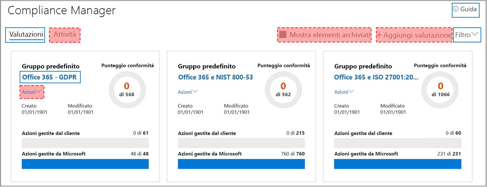
  
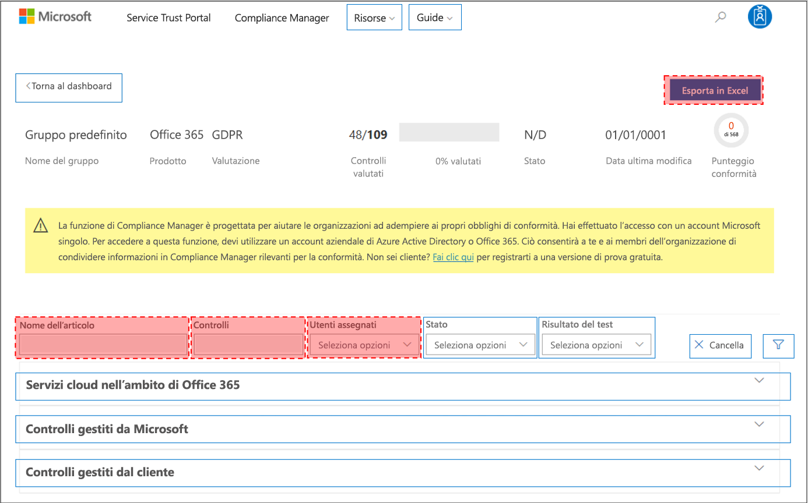

## Comprendere il punteggio di conformità

Nell'angolo superiore destro del riquadro del dashboard di Compliance Manager è indicato un punteggio totale relativo alle valutazioni di Office 365. Si tratta del punteggio totale di conformità della valutazione costituito da ciascun punto ricevuto per la valutazione di ogni controllo contrassegnato come implementato e testato. Quando si aggiunge una valutazione, si potrà notare che il processo di completamento del punteggio di conformità è già stato avviato, poiché sono già stati applicati i punti dei controlli gestiti e implementati da Microsoft e testati da terze parti indipendenti.
  

  
I punti rimanenti derivano dalla valutazione del controllo del cliente e dall'implementazione e dalla verifica dei controlli gestiti dal cliente, ciascuno con un valore specifico che contribuisce al punteggio complessivo di conformità. 
  
Ciascuna valutazione indica un punteggio di conformità basato sul rischio che consente di valutare il livello di rischio (a causa di non conformità o controllo non riuscito) associato ad ogni controllo (sia controlli gestiti da Microsoft che dai clienti) di una valutazione. Ad ogni controllo gestito dai clienti è assegnato un numero di punti possibili (il *livello di gravità*) in base a una scala da 1 a 10, in cui più è alto il fattore di rischio se il controllo non viene superato, maggiore è il numero di punti associati, più il fattore di rischio è basso, minore sarà il punteggio. 
  
Ad esempio, il controllo di valutazione per User Access Management mostrato in basso è classificato con un fattore di rischio molto alto, quindi il punteggio assegnato è 10.
  
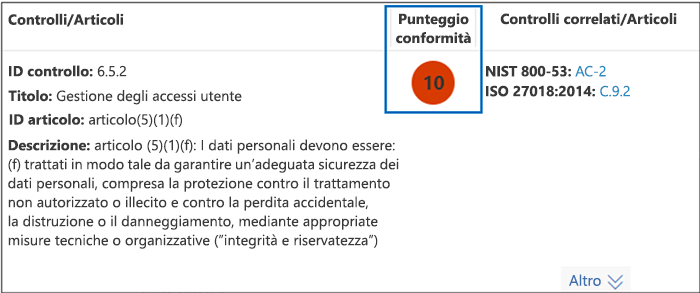
  
 Per fare un confronto, il controllo di valutazione per User Access Management mostrato in basso è classificato con un fattore di rischio inferiore, quindi il punteggio assegnato è 3. 
  
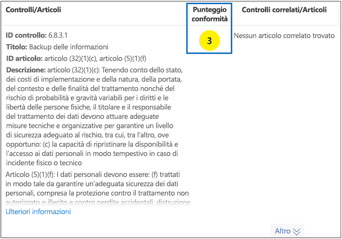
  
Compliance Manager assegna un livello di gravità predefinito ad ogni controllo. La classificazione del rischio viene calcolata in base ai criteri seguenti:
  
- Se un controllo previene gli incidenti avrà un livello più alto in classifica, se rileva gli incidenti verificatisi o ne corregge l'impatto, la classificazione sarà più bassa. In termini di classificazione della gravità, a un controllo che impedisce una minaccia ed è obbligatorio viene assegnato il numero più alto di punti, mentre ai controlli che sono investigativi o correttivi (indipendentemente dal fatto che siano obbligatori o a discrezione dell'utente) viene assegnato un numero più basso di punti.
    
- Se un controllo (dopo che è stato implementato) è obbligatorio e quindi non può essere bypassato dagli utenti (ad esempio, gli utenti devono reimpostare la propria password e soddisfare i requisiti di lunghezza e caratteri della password) o a discrezione dell'utente e può essere bypassato dagli utenti (ad esempio, in caso di regole aziendali che richiedono agli utenti di bloccare i propri schermi quando si allontanano dalla propria postazione).
    
- Controlli relativi ai rischi per la riservatezza, l'integrità e la disponibilità dei dati, se questi rischi derivano da minacce interne o esterne e se la minaccia è dannosa o accidentale. Ad esempio, ai controlli che aiuterebbero a impedire a un utente malintenzionato esterno di violare quella rete e ottenere accesso a informazioni di identificazione personale sarebbero assegnati più punti rispetto a un controllo che impedisce a un dipendente di configurare erroneamente un'impostazione del router di rete con conseguente interruzione della rete.
    
- Rischi connessi a driver legali e esterni, come contratti, regolamenti e impegni pubblici, per ciascun controllo.
    
I valori del punteggio di conformità indicati per il controllo vengono applicati *completamente* al punteggio di conformità totale in base al risultato - il controllo è implementato e supera il test di valutazione successivo o meno; non vi è alcun credito parziale per un'implementazione parziale. Solo quando il controllo ha lo **stato di implementazione** impostato su **Implementato** o **Implementazione alternativa** e il **risultato del test** è impostato su **Superato** vengono aggiunti punti al punteggio di conformità totale. 
  
La cosa più importante è che il punteggio di conformità può aiutare a stabilire le priorità su quali controlli concentrarsi per l'implementazione, indicando quali controlli hanno un rischio potenziale più elevato di fallimento relativo a un controllo. Oltre alla definizione delle priorità basata sul rischio, vale la pena notare che quando i controlli di valutazione sono correlati ad altri controlli (all'interno della stessa valutazione o in un'altra valutazione che si trova nello stesso gruppo di valutazioni) il completamento di un singolo controllo può comportare una riduzione significativa in base alla sincronizzazione dei risultati dei test di controllo.
  
Nell'immagine seguente, ad esempio, si può notare che Office 365 - valutazione GDPR è valutato al 46% con 51 valutazioni di controllo su 111 completate, per un punteggio di conformità totale di 289 su 600 possibili.
  
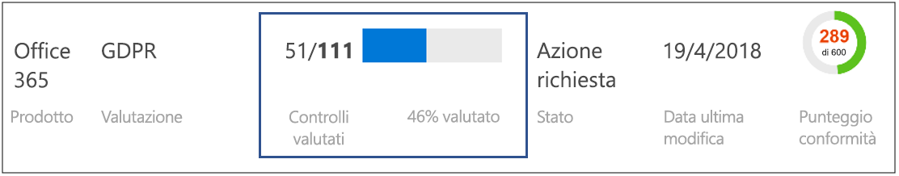
  
All'interno della valutazione il controllo GDPR 7.5.5 è correlato a 5 altri controlli (7.4.1, 7.4.3, 7.4.4, 7.4.8 e 7.4.9) ciascuno con un punteggio di valutazione del rischio di gravità da moderato ad alto di 6 o 8. Utilizzando il filtro di valutazione, abbiamo selezionato tutti questi controlli, rendendoli visibili nella vista di valutazione, e come mostrato di seguito, nessuno di essi è stato valutato. 
  
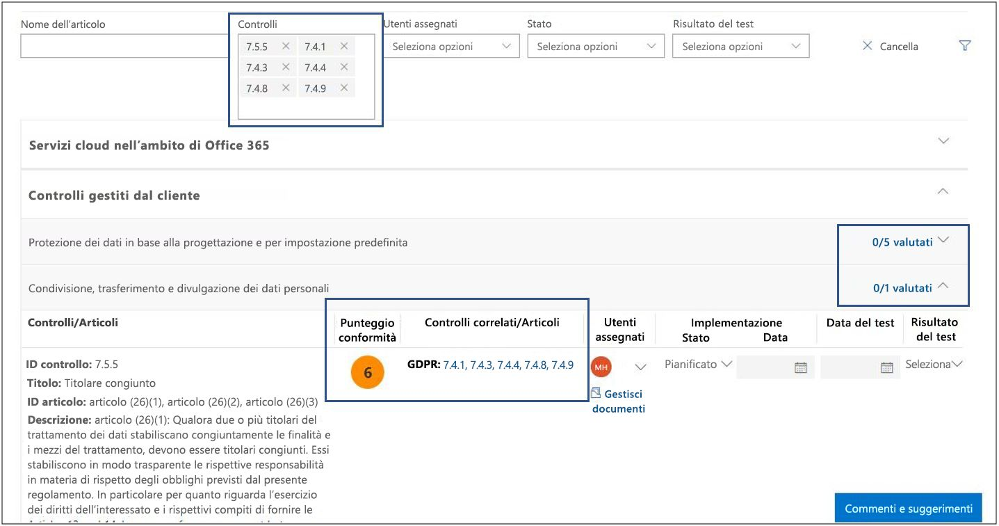 Poiché questi 6 controlli sono correlati, il completamento di ognuno di essi comporterà una sincronizzazione dei risultati di questi test attraverso i relativi controlli all'interno di questa valutazione (proprio come per qualsiasi controllo correlato in una valutazione che si trova nello stesso gruppo di valutazione). Al completamento dell'implementazione e della verifica del controllo GDPR 7.5.5, l'area dei dettagli di controllo si aggiorna per mostrare che tutti e 6 i controlli sono stati valutati, con un corrispondente aumento del numero di controlli valutati a 57 e 51% e un cambiamento nel punteggio di conformità totale superiore a 40. 
  
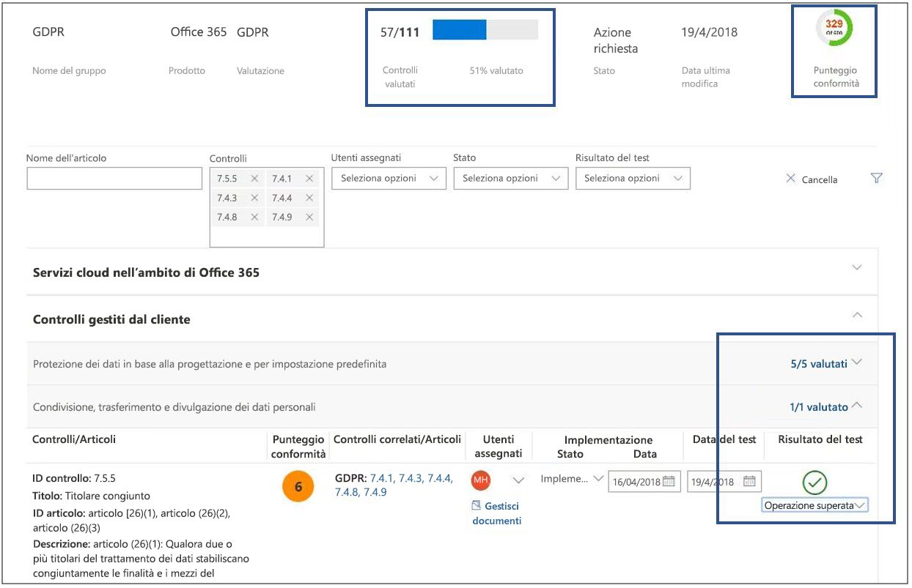
  
Questa finestra di dialogo di aggiornamento di conferma verrà visualizzata se si sta per modificare lo stato di implementazione di un controllo correlato con impatto sugli altri controlli correlati.
  
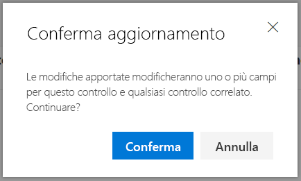
  
> [!NOTE]
> Attualmente, solo le valutazioni per i servizi cloud di Office 365 includono un punteggio di conformità. Le valutazioni per Azure e Dynamics mostrano uno stato di valutazione. 

## Metodologia del punteggio di conformità

Il punteggio di conformità, come Microsoft Secure Score, è simile ad altri sistemi di punteggio basati sul comportamento; l'attività dell'organizzazione può aumentare il punteggio di conformità svolgendo attività correlate alla protezione dei dati, alla privacy e alla sicurezza.
  
> [!NOTE]
> Il punteggio di conformità non esprime una misura assoluta di conformità organizzativa a nessun particolare standard o regolamento. Esprime la misura in cui sono stati adottati controlli che possono ridurre i rischi per i dati personali e la privacy individuale. Nessun servizio può garantire la conformità a uno standard o regolamento e il punteggio di conformità non deve essere interpretato come una garanzia in alcun modo. 
  
Le valutazioni in Compliance Manager si basano sul modello di responsabilità condivisa per il cloud computing. Nel modello di responsabilità condivisa, Microsoft e ciascun cliente condividono la responsabilità per la protezione dei dati del cliente quando tali dati sono archiviati nel cloud.
  
Come mostrato di seguito nella valutazione GDPR di Office 365, Microsoft e i clienti sono responsabili di eseguire una serie di azioni ideate per soddisfare i requisiti dello standard o del regolamento da valutare. Per razionalizzare e comprendere le azioni richieste in una varietà di standard e normative, Compliance Manager tratta tutti gli standard e le normative come se fossero quadri di controllo. Pertanto, le azioni eseguite da Microsoft e dai clienti per ciascuna valutazione implicano l'implementazione e la convalida di vari controlli.
  
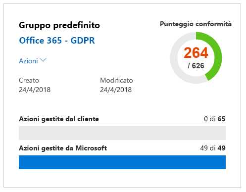
  
Di seguito viene indicato il flusso di lavoro di base per un'azione tipica:
  
1. Il responsabile della conformità, del rischio, della privacy e/o della protezione dei dati di un'organizzazione assegna l'incarico a qualcuno nell'organizzazione per implementare un controllo. Può ricevere tale incarico:

    - Il proprietario di un criterio di business
    
    - Un implementatore IT
    
    - Un'altra persona dell'organizzazione responsabile dell'esecuzione dell'attività
    
2. L'individuo svolge le attività necessarie per implementare il controllo, carica le evidenze di implementazione in Compliance Manager e contrassegna i controlli legati all'azione come implementati. Una volta completate queste attività, assegna l'attività a un valutatore per la convalida. I valutatori possono essere:
    
    - Valutatori interni che eseguono la convalida dei controlli all'interno di un'organizzazione
    
    - Valutatori esterni che esaminano, verificano e certificano la conformità, come le organizzazioni di terze parti indipendenti che controllano i servizi cloud di Microsoft
    
3. Il valutatore convalida il controllo, esamina le evidenze e contrassegna il controllo/i controlli come valutati e i risultati della valutazione (ad esempio, se il controllo è stato superato).
    
Quando tutti i controlli associati a una valutazione sono stati valutati, la valutazione è completata.
  
Ogni valutazione in Compliance Manager viene pre-caricata con informazioni che forniscono dettagli sulle azioni intraprese da Microsoft per soddisfare i requisiti dei controlli per i quali Microsoft è responsabile. Queste informazioni includono dettagli su come Microsoft ha implementato ciascun controllo e su come e quando l'implementazione di Microsoft è stata valutata e verificata da un revisore esterno. Per questo motivo, i controlli gestiti da Microsoft per ciascuna valutazione sono contrassegnati come valutati e il punteggio di conformità per la valutazione riflette tale situazione.
  
Ogni valutazione include un punteggio di conformità totale basato sul modello di responsabilità condivisa. L'implementazione e la verifica dei controlli di Microsoft per Office 365 contribuiscono a una parte dei punti totali possibili associati a una valutazione GDPR. Quando il cliente implementa e testa ciascuna delle azioni del cliente, il punteggio di conformità per la valutazione aumenterà del valore assegnato al controllo. 
  
 ### Metodologia del punteggio basata sul rischio
  
Compliance Manager utilizza una metodologia di valutazione basata sul rischio con una scala da 1 a 10 che assegna un valore superiore ai controlli che rappresentano un rischio più elevato nel caso in cui il controllo non venga superato o risultasse non conforme. Il sistema di punteggio utilizzato per il punteggio di conformità si basa su diversi fattori chiave, quali:
  
- Essenza del controllo
    
- Il livello di rischio del controllo in base al tipo di minacce
    
- I driver esterni per il controllo
    
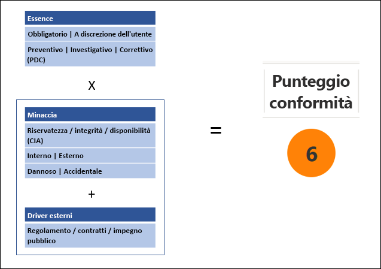
  
 ### Essenza del controllo
  
L'essenza del controllo dipende dalla natura del controllo: obbligatorio o a discrezione dell'utente e preventivo, investigativo o correttivo.
  
 ### Obbligatorio o a discrezione dell'utente
  
 *I controlli obbligatori* sono controlli che non possono essere aggirati intenzionalmente o accidentalmente. Un esempio di controllo obbligatorio comune è un criterio di password gestito centralmente che imposta i requisiti per la lunghezza, la complessità e la scadenza della password. Gli utenti devono rispettare questi requisiti per accedere al sistema. 
  
 *I controlli a discrezione dell'utente* fanno affidamento sugli utenti per comprendere i criteri e agire di conseguenza. Ad esempio, un criterio che richiede agli utenti di bloccare il proprio computer quando si allontanano dalla postazione è un controllo a discrezione dell'utente perché dipende dall'utente. 
  
 ### Preventivo, investigativo o correttivo
  
 *I controlli preventivi* sono quelli che prevengono rischi specifici. Ad esempio, proteggere le informazioni a riposo utilizzando la crittografia è un controllo preventivo contro attacchi, violazioni, ecc. La separazione delle funzioni è un controllo preventivo per gestire il conflitto di interessi e proteggersi dalle frodi. 
  
 *I controlli investigativi* sono quelli che monitorano attivamente i sistemi per identificare condizioni o comportamenti irregolari che rappresentano un rischio o che possono essere utilizzati per rilevare intrusioni o determinare se si è verificata una violazione. Il controllo dell'accesso al sistema e il controllo delle azioni amministrative privilegiate sono tipi di controlli di monitoraggio investigativi. I controlli di conformità normativa sono un tipo di controllo investigativo utilizzato per individuare i problemi del processo. 
  
 *I controlli correttivi* sono quelli che cercano di limitare al minimo gli effetti negativi di un incidente di sicurezza, intraprendono azioni correttive per ridurre l'effetto immediato e, se possibile, riparano il danno. La risposta agli incidenti sulla privacy è un controllo correttivo per limitare i danni e ripristinare i sistemi a uno stato operativo dopo una violazione. 
  
Valutando ciascun controllo utilizzando questi fattori, viene determinata l'essenza del controllo e viene assegnato un valore relativo al rischio che rappresenta.
  
 **Minaccia**
  
||||
|:-----|:-----|:-----|
||**Obbligatorio**   |**A discrezione dell'utente**   |
|**Preventivo**   |Rischio elevato    |Rischio medio    |
|**Investigativo**   |Rischio medio    |Basso rischio    |
|**Correttivo**   |Rischio medio    |Basso rischio    |
   
La minaccia si riferisce a tutto ciò che rappresenta un rischio per lo standard di sicurezza fondamentale, universalmente accettato, noto come CIA (Confidentiality, Integrity e Availability) o triade della sicurezza dei dati: riservatezza, integrità e disponibilità:
  
- Riservatezza significa che le informazioni possono essere lette e comprese solo da parti attendibili e autorizzate.
    
- Integrità significa che le informazioni non sono state modificate o eliminate da parti non autorizzate.
    
- Disponibilità significa che le informazioni sono facilmente accessibili con un elevato livello di qualità del servizio.
    
Un errore di una qualsiasi di queste caratteristiche è considerato un compromesso del sistema nel suo complesso. Le minacce possono provenire da fonti interne ed esterne e l'intento di un attore può essere accidentale o dannoso. Questi fattori sono stimati in una matrice di minacce che assegna livelli di minaccia alti, moderati o bassi a ciascuna combinazione di scenari.

||**Interno** ||**Esterno** ||||
|:-----|:-----|:-----|:-----|:-----|:-----|:-----|
||*Dannoso* |*Accidentale* |*Dannoso* |*Accidentale* |||
|**Riservatezza** |(H, M o L)    |(H, M o L)    |(H, M o L)    |(H, M o L)|
|**Integrità** |(H, M o L)    |(H, M o L)    |(H, M o L)    |(H, M o L)|
|**Disponibilità** |(H, M o L)    |(H, M o L)    |(H, M o L)    |(H, M o L)|
   
 **Driver esterni**
  
|**Contratti**|**Normative**|**Impegni pubblici**|
|:-----|:-----|:-----|
|(H, M o L)    |(H, M o L)    |(H, M o L)    |
   
Fattori esterni come regolamenti, contratti e impegni pubblici applicabili possono influenzare i controlli ideati per proteggere e prevenire la violazione dei dati e a ciascuno di questi fattori sono assegnati valori di rischio alto, moderato o basso.
  
Il numero stimato di occorrenze di questi valori di rischio alto, moderato o basso nei 15 possibili scenari di rischio rappresentati in CIA/minaccia e driver esterni/legali sono combinati per fornire una ponderazione del rischio, che considera la probabilità e il numero di occorrenze del rischio ad un dato valore significativa e viene preso in considerazione quando si calcola il livello di gravità del controllo.
  
In base al livello di gravità del controllo, a quest'ultimo viene assegnato il valore del punteggio di conformità, un numero compreso tra 1 (basso) e 10 (alto), raggruppato nelle seguenti categorie di rischio:
  
|**Livello di rischio**|**Valore del controllo**|
|:-----|:-----|
|Basso    |1-3    |
|Moderato    |6    |
|Alto    |8    |
|Grave    |10    |
   
Assegnando delle priorità ai controlli di valutazione con i valori più elevati del punteggio di conformità, l'organizzazione si concentra sugli elementi di rischio più elevato e riceve un feedback positivo proporzionalmente più elevato sotto forma di più punti aggiunti al punteggio totale di conformità per la valutazione di ciascuna valutazione di controllo completata.
  
### Riepilogo sulla metodologia di assegnazione del punteggio
  
Il punteggio di conformità è un componente fondamentale del modo in cui Compliance Manager aiuta le organizzazioni a comprendere e gestire il proprio livello di conformità. Il punteggio di conformità per una valutazione è un'espressione sotto forma di numero della conformità della società a un dato standard o regolamento, dove più alto è il punteggio (fino al numero massimo di punti assegnati per la valutazione) migliore è il livello di conformità dell'azienda. Comprendere la metodologia del punteggio di conformità in cui i controlli di valutazione sono assegnati a valori di gravità del rischio compresi tra 1 e 10 (da basso ad alto) e il modo in cui le valutazioni di controllo completano il punteggio di conformità totale è fondamentale per le organizzazioni che danno priorità alle loro operazioni.

## Raggruppamento delle valutazioni

Quando si crea una nuova valutazione, viene richiesto di creare un nuovo gruppo per assegnare la valutazione o assegnare la valutazione a un gruppo esistente. I gruppi consentono di organizzare in modo logico le valutazioni e condividere le informazioni comuni e le attività del flusso di lavoro tra le valutazioni che hanno controlli gestiti dal cliente identici o correlati.
  
Ad esempio, è possibile raggruppare le valutazioni per anno o gruppi, reparti o agenzie all'interno della propria organizzazione o raggrupparli per anno. Ecco alcuni esempi di gruppi e le valutazioni che potrebbero contenere.
  
- Valutazioni GDPR - 2018
    
  - Office 365 ed EMS
    
  - Azure e GDPR
    
  - Dynamics e GDPR
    
- Valutazioni Azure - 2018
    
  - Azure e GDPR
    
  - Azure e ISO 27001:2013
    
  - Azure e ISO 27018:2014
    
- Sicurezza dei dati e valutazione della privacy
    
  - Office 365 e ISO 27001:2013
    
  - Office 365 e ISO 27018:2014
    
  - Azure e ISO 27001:2013
    
  - Azure e ISO 27018:2014
    
> [!TIP]
> È consigliabile determinare una strategia di raggruppamento per l'organizzazione prima di aggiungere nuove valutazioni. 
  
Questi sono i requisiti per il raggruppamento delle valutazioni:
  
- I nomi dei gruppi (noti anche come *ID gruppo*) devono essere univoci all'interno dell'organizzazione. 
    
- I gruppi possono contenere valutazioni per la stessa certificazione/regolamento, ma ciascun gruppo può contenere solo una valutazione per una coppia di servizi/certificazioni cloud specifici. Ad esempio, un gruppo non può contenere due valutazioni per Office 365 e GDPR. Analogamente, un gruppo può contenere più valutazioni per lo stesso servizio cloud purché la certificazione/regolamento corrispondente sia diverso per ciascuno di essi.
    
Una volta aggiunta una valutazione a un gruppo di valutazione, il raggruppamento non può essere modificato. È possibile rinominare il gruppo di valutazione, che modifica il nome del gruppo di valutazione per tutte le valutazioni associate a quel gruppo. È possibile creare una nuova valutazione e un nuovo gruppo di valutazione e copiare le informazioni da una valutazione esistente, che crea effettivamente un duplicato di tale valutazione in un gruppo di valutazione diverso. L'archiviazione di una valutazione interrompe la relazione tra quella valutazione e il gruppo di valutazione; eventuali ulteriori aggiornamenti ad altre valutazioni correlate non si riflettono più nella valutazione archiviata.
  
Come illustrato in precedenza, uno dei vantaggi principali dell'utilizzo dei gruppi è che quando due diverse valutazioni nello stesso gruppo condividono lo stesso controllo gestito dai clienti (e quindi le azioni del cliente sarebbero uguali per ciascun controllo), il completamento dei dettagli di implementazione, le informazioni di verifica e lo stato per il controllo in una valutazione sono sincronizzati con lo stesso controllo in qualsiasi altra valutazione del gruppo. In altre parole, se le valutazioni condividono lo stesso controllo e si trovano nello stesso gruppo, è sufficiente gestire la procedura di valutazione per il controllo in un'unica valutazione. I risultati per tale controllo verranno automaticamente sincronizzati con altre valutazioni. Ad esempio, ISO 27001 e ISO 27018 hanno entrambi un controllo relativo alle politiche delle password. Se lo stato del test per il controllo è impostato su "superato" in una valutazione, il controllo verrà aggiornato (e contrassegnato come "superato") nell'altra valutazione, purché entrambe le valutazioni facciano parte dello stesso gruppo di valutazione.
  
Ad esempio, si pensi a questi due controlli di valutazione correlati, ognuno dei quali riguarda la crittografia dei dati sulle reti pubbliche, il controllo 6.10.1.2 in Office 365 - valutazione GDPR e il controllo SC-13 in Office 365 - valutazione NIST 800-53. Si tratta di controlli di valutazione correlati, in due diverse valutazioni, entrambi nel gruppo predefinito; inizialmente, nessuna valutazione ha completato alcuna valutazione del controllo del cliente, come indicato sul dashboard di Compliance Manager che mostra queste due valutazioni.
  
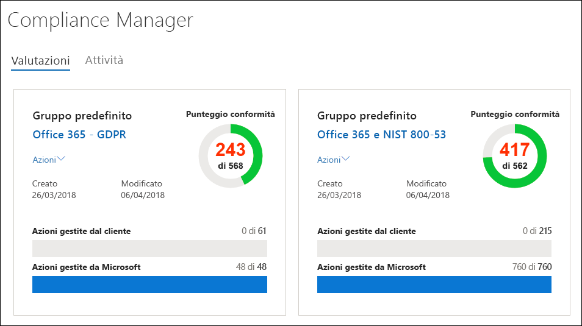
  
Selezionando la valutazione **Office 365 - GDPR** e utilizzando i controlli di filtro per visualizzare il controllo GDPR 6.10.1.2, si noterà che il controllo NIST 800-53 SC-13 è elencato come controllo correlato.
  
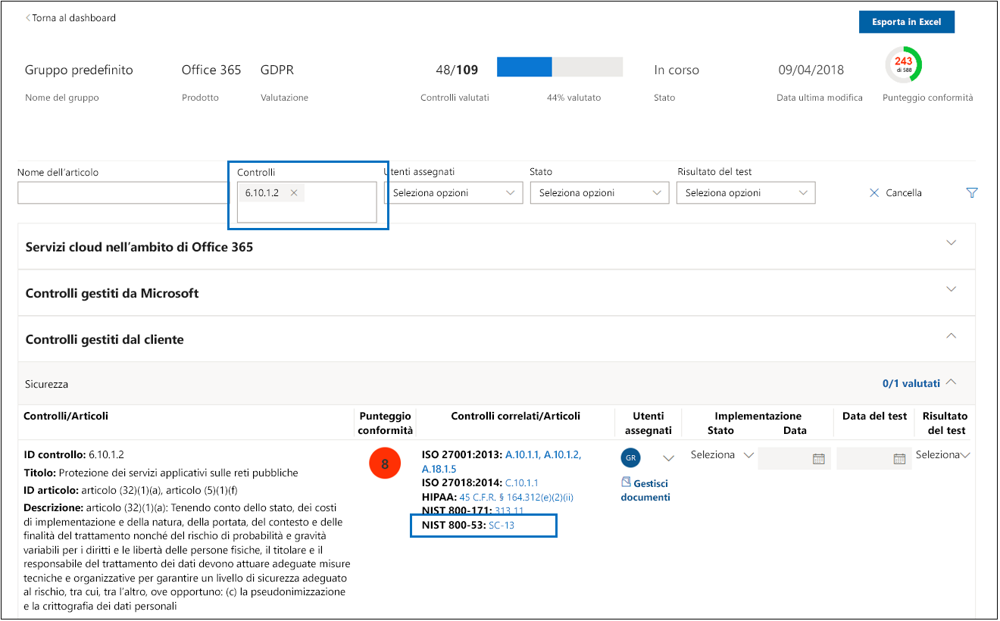
  
 In questa sezione viene indicato il completamento dell'implementazione e di verifica del controllo GDPR 6.10.1.2. 
  
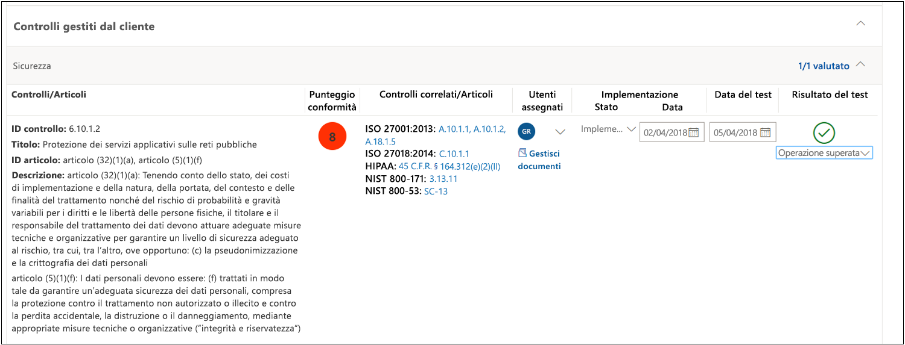
  
Passando al controllo correlato nella valutazione raggruppata, vediamo che NIST 800-53 SC-13 è stato contrassegnato come completato con la stessa data e ora, senza ulteriori implementazioni o test.
  
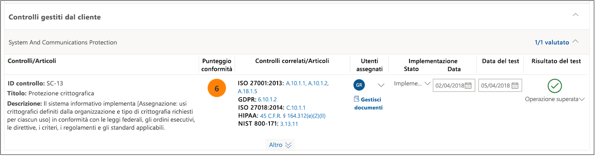
  
Tornando al dashboard, si noti che ogni valutazione ha 1 valutazione del controllo completata e che il punteggio di conformità totale per ogni valutazione è aumentato di 8 (il valore del punteggio di conformità del controllo condiviso).
  
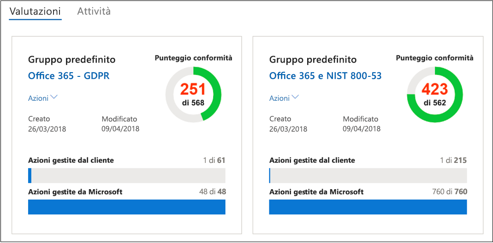

## Funzioni amministrative

Funzioni amministrative specifiche sono disponibili solo per l'account dell'amministratore del tenant e sono visibili solo quando si accede come amministratore globale.
  
> [!NOTE]
> L'autorizzazione di accesso ai documenti con restrizioni nell'elenco a discesa consentirà agli amministratori di fornire agli utenti l'accesso a documenti riservati condivisi da Microsoft sul Service Trust Porta. La funzione dei documenti con restrizioni sarà presto disponibile. 
  
### Assegnazione di ruoli Compliance Manager agli utenti

Per ogni ruolo Compliance Manager sono previste autorizzazioni leggermente diverse. È possibile visualizzare le autorizzazioni assegnate a ciascun ruolo, vedere quali utenti sono in quali ruoli e aggiungere o rimuovere utenti da tale ruolo dal Service Trust Portal selezionando la voce di menu **Amministratore** e scegliendo **Impostazioni**. 
  
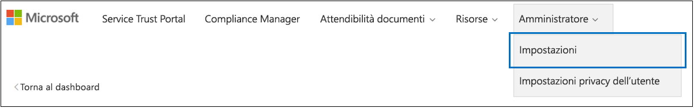
  
Per aggiungere o rimuovere utenti da ruoli Compliance Manager.
  
1. Passare a [https://servicetrust.microsoft.com](https://servicetrust.microsoft.com).
    
2. Accedere con l'account di amministratore globale di Azure Active Directory.
    
3. Sulla barra dei menu superiore del Service Trust Portal, fare clic su **Amministratore** e quindi scegliere **Impostazioni**. 
    
4. Nell'elenco a discesa **Seleziona ruolo**, fare clic sul ruolo da gestire. 
    
5. Gli utenti aggiunti a ciascun ruolo sono aggiunti nella pagina **Seleziona ruolo**. 
    
6. Per aggiungere utenti al ruolo, fare clic su **Aggiungi**. Nella finestra di dialogo **Aggiungi utenti**, fare clic sul campo utente. È possibile scorrere l'elenco degli utenti disponibili o iniziare a digitare il nome utente per filtrare l'elenco in base al termine di ricerca. Fare clic sull'utente per aggiungere l'account all'elenco **Aggiungi utenti** cui assegnare il ruolo. Per aggiungere più utenti contemporaneamente, iniziare a digitare un nome utente per filtrare l'elenco, quindi fare clic sull'utente da aggiungere all'elenco. Fare clic su **Salva** per assegnare il ruolo selezionato agli utenti. 
    
    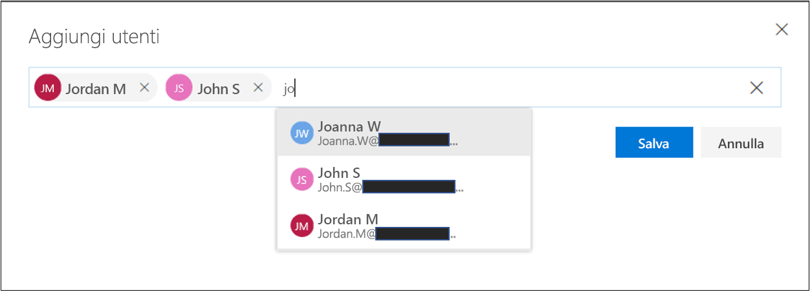
  
7. Per rimuovere utenti da questo ruolo, selezionare gli utenti e fare clic su **Elimina**. 
    
    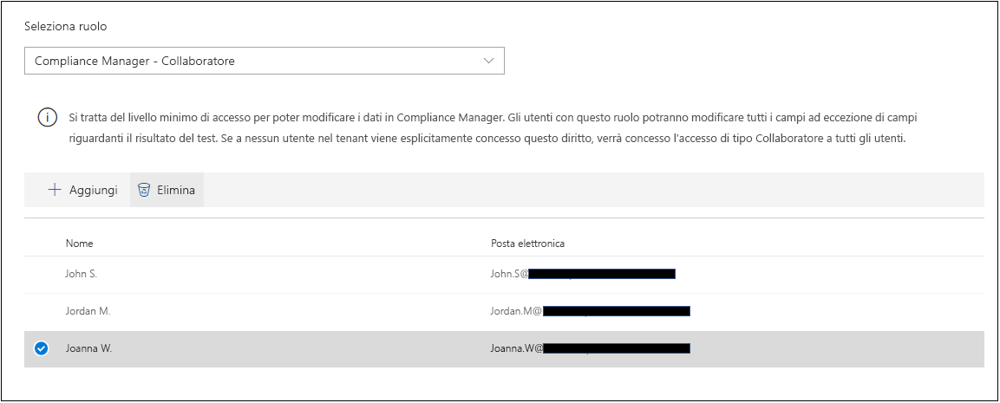
 
## Impostazioni di privacy dell'utente

Alcune normative richiedono che un'organizzazione debba essere in grado di eliminare i dati della cronologia utente. Per consentire ciò, Compliance Manager fornisce le funzioni delle **impostazioni di privacy dell'utente**, che consentono agli amministratori di: 
  
- [Cercare un utente](#search-for-a-user)

- [Esportare un report di cronologia dei dati dell'account](#export-report-of-account-data-history)

- [Riassegnare attività](#reassign-action-items)

- [Eliminare la cronologia dei dati dell'utente](#delete-user-data-history)
    
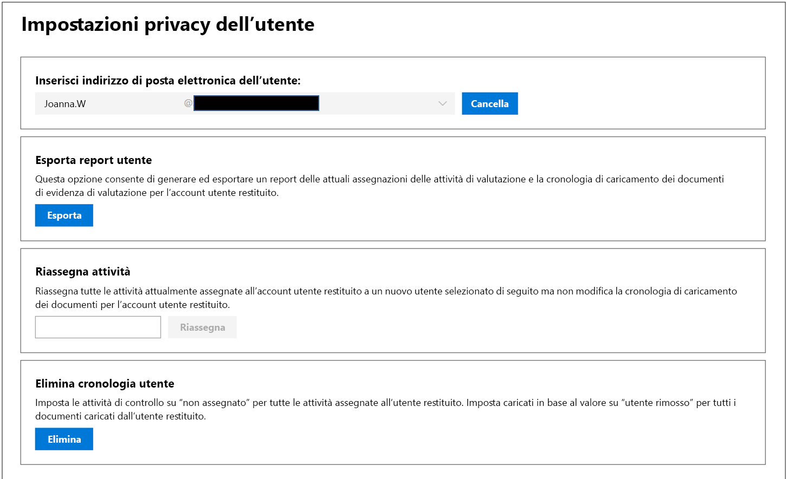
  
### Cercare un utente

Cercare un account utente:
  
1. Immettere l'indirizzo e-mail dell'utente digitando l'alias (le informazioni a sinistra del simbolo @) e scegliere il nome del dominio facendo clic sull'elenco dei suffissi di dominio sulla destra. Se si tratta di un tenant con più domini registrati, ricontrollare il suffisso del nome di dominio dell'indirizzo e-mail per verificare che sia corretto.
    
2. Dopo aver immesso correttamente il nome utente, fare clic su **Cerca**. 
    
3. Se l'account utente non viene trovato, il messaggio di errore "utente non trovato" verrà visualizzato nella pagina. Controllare le informazioni sull'indirizzo e-mail dell'utente, apportare le correzioni necessarie e fare clic su **Cerca** per riprovare. 
    
4. Se viene rilevato l'account utente, il testo del pulsante cambierà da **Cerca** a **Cancella**, che indica che l'account utente restituito è il contesto operativo per le funzioni aggiuntive che verranno visualizzate di seguito e che l'esecuzione di tali funzioni si applicherà a questo account utente. 
    
5. Per cancellare i risultati e cercare un altro utente, fare clic su **Cancella**. 
    
### Esportare un report di cronologia dei dati dell'account

Una volta che l'account utente è stato identificato, è possibile generare un report di dipendenze esistente collegato a questo account. Queste informazioni consentiranno di riassegnare le attività aperte o garantire l'accesso alle evidenze caricate in precedenza. 
  
 Per generare ed esportare un report:
  
1. Fare clic su **Esporta** per generare e scaricare un report delle attività di controllo di Compliance Manager attualmente assegnate all'account utente restituito, nonché l'elenco dei documenti caricati da tale utente. Se non sono presenti attività assegnate o documenti caricati, un messaggio di errore indicherà "Nessun dato per questo utente". 
    
2. Il report viene scaricato sullo sfondo della finestra del browser attiva - se non si visualizza il popup di download, controllare la cronologia dei download del browser.
    
3. Aprire il documento per visualizzare i dati del report.
    
> [!NOTE]
> Non si tratta di un report cronologico che conserva e indica le modifiche di stato alla cronologia delle assegnazioni delle attività. Il report generato è un'istantanea delle attività di controllo assegnate al momento dell'esecuzione del report (data e ora scritti nel report). Ad esempio, qualsiasi successiva riassegnazione delle attività genererà dati del report snapshot diversi se questo report viene generato di nuovo per lo stesso utente. 
  
### Riassegnare attività

Questa funzione consente a un'organizzazione di rimuovere tutte le dipendenze attive o in sospeso sull'account utente riassegnando la proprietà di tutte le attività (che include attività sia attivi sia completati) dall'account utente restituito a un nuovo utente selezionato di seguito. Questa operazione non modifica la cronologia di caricamento dei documenti per l'account utente restituito. 
  
 Per riassegnare attività a un altro utente:
  
1. Fare clic sulla casella di input per cercare e selezionare un altro utente all'interno dell'organizzazione a cui devono essere assegnate le attività dell'utente restituito.
    
2. Selezionare **Sostituisci** per riassegnare tutte le attività di controllo dall'utente restituito all'utente appena selezionato. 
    
3. Viene visualizzata una finestra di dialogo di conferma, che indica "Tutte le attività verranno riassegnate dall'utente corrente a quello selezionato. L'operazione non può essere annullata. Continuare?"
    
4. Per continuare a fare clic su **OK**, in caso contrario, fare clic su **Annulla**. 
    
> [!NOTE]
> Tutte le attività (sia attive che completate) saranno assegnate all'utente appena selezionato. Tuttavia, questa operazione non influisce sulla cronologia di caricamento del documento; tutti i documenti caricati dall'utente precedentemente assegnato mostreranno ancora la data/l'ora e il nome dell'utente precedentemente assegnato. 
  
La modifica della cronologia di caricamento dei documenti per rimuovere l'utente precedentemente assegnato dovrà essere eseguita come una procedura manuale. In tal caso, l'amministratore dovrà:
  
1. Aprire il report esportazione scaricato in precedenza.
  
2. Individuare e selezionare l'attività di controllo desiderata.
  
3. Fare clic su **Gestione documenti** per passare all'archivio delle evidenze per il controllo. 
  
4. Scaricare il documento.
  
5. Eliminare il documento nell'archivio delle evidenze.
  
6. Ricaricare il documento. Il documento ora conterrà una nuova data, ora e nome utente di caricamento. 
  
### Eliminare la cronologia dei dati dell'utente

Imposta gli elementi delle attività di controllo su "non assegnati" per tutte le attività assegnate all'utente restituito. Questo imposta anche il valore caricato su "utente rimosso" per tutti i documenti caricati dall'utente restituito
  
 Per eliminare l'attività dell'account utente e la cronologia di caricamento dei documenti:
  
1. Fare clic su **Elimina**. 

    Viene visualizzata una finestra di dialogo di conferma, che indica "Questa operazione rimuoverà tutte le assegnazioni delle attività e la cronologia di caricamento dei documenti per l'utente selezionato. L'operazione non può essere annullata. Continuare?"
    
3. Per continuare, fare clic su **OK**, in caso contrario, fare clic su **Annulla**. 
  
## Uso di Compliance Manager

Compliance Manager fornisce gli strumenti per assegnare, monitorare e registrare le attività correlate alla valutazione e consente all'organizzazione di superare le barriere riscontrate dai team e di raggiungere gli obiettivi di conformità.
  
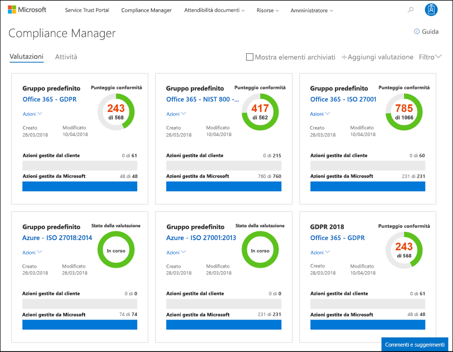

## Accesso a Compliance Manager

Chiunque abbia un account Microsoft o un account organizzativo di Azure Active Directory può accedere a Compliance Manger dal Service Trust Portal.
  
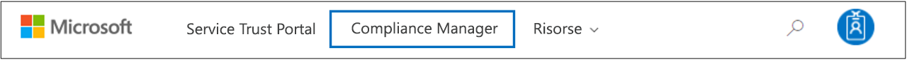
  
1. Passare a [https://servicetrust.microsoft.com](https://servicetrust.microsoft.com/).
    
2. Accedere con utente di Azure Active Directory (Azure AD).
    
3. Selezionare **Compliance Manger** dal Service Trust Portal. 
    
4. Quando viene visualizzato il contratto di riservatezza, leggere il messaggio e quindi fare clic su **Accetto** per continuare. È necessario eseguire questa operazione una sola volta per visualizzare il dashboard di Compliance Manager. 

    Per iniziare, sono stati aggiunti le valutazioni seguenti per impostazione predefinita:
    
    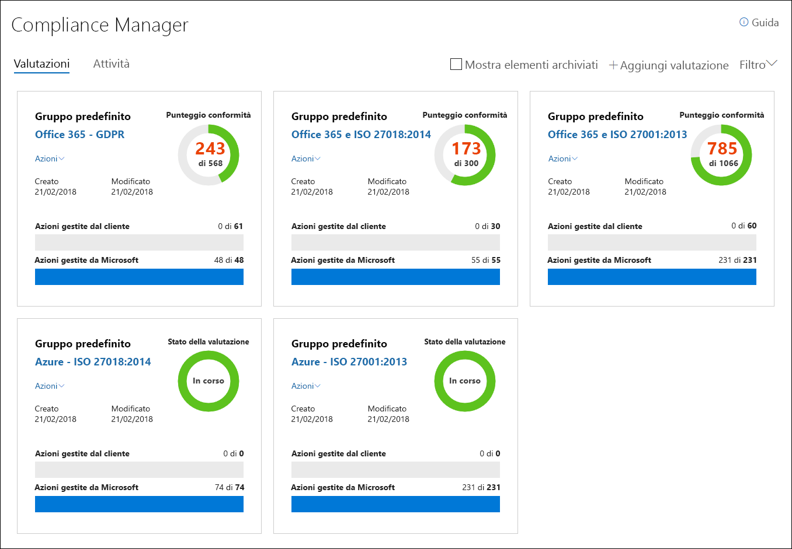
    
5. Fare clic sull' **Guida** per visualizzare una breve presentazione di Compliance Manager. 
  
## Visualizzazione delle attività

Compliance Manager offre una comoda visualizzazione di tutte le attività di controllo assegnate, consentendo di agire rapidamente e facilmente su di esse. È possibile visualizzare tutte le attività o selezionare quelle che corrispondono a una certificazione specifica, facendo clic sulla scheda associata a tale valutazione. Ad esempio, nell'immagine sottostante, è stata selezionata la scheda GDPR, che mostra i controlli relativi alla valutazione GDPR.
  
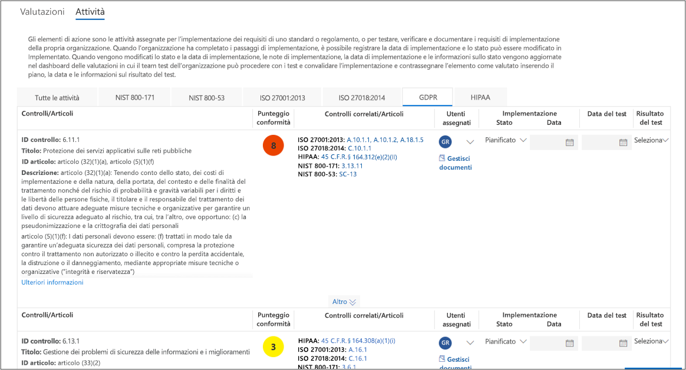
  
Per visualizzare le attività:
  
1. Passare al dashboard di Compliance Manager
    
2. Facendo clic sul collegamento **Attività**, la pagina verrà aggiornata per mostrare le attività assegnate all'utente. 
    
    Per impostazione predefinita, vengono mostrate tutte le attività. Se sono presenti attività tra più certificazioni, i nomi delle certificazioni saranno elencati in schede nella parte superiore del controllo di valutazione. Per visualizzare le attività per una certificazione specifica, fare clic sulla scheda.

## Aggiungere una valutazione

Per aggiungere una valutazione a Compliance Manager:
  
1. Nel dashboard di Compliance Manager, fare clic sull' **Aggiungi valutazione**. 
    
2. Nella finestra **Aggiungere valutazione**, è possibile creare un nuovo gruppo per aggiungere la valutazione oppure aggiungerla a un gruppo esistente (il gruppo predefinito è denominato "Gruppo iniziale"). A seconda dell'opzione scelta, digitare il nome di un nuovo gruppo o selezionare un gruppo esistente dall'elenco a discesa. Per ulteriori informazioni, vedere [Raggruppamento delle valutazioni](meet-data-protection-and-regulatory-reqs-using-microsoft-cloud.md#grouping).
    
    Se si crea un nuovo gruppo, è anche possibile copiare le informazioni da un gruppo esistente alla nuova valutazione. Ciò significa che qualsiasi informazione che è stata aggiunta ai campi Dettagli di implementazione, Piano di test e Risposta del management dei controlli gestiti dal cliente da Valutazioni nel gruppo da cui si copia, viene copiata nello stesso (o correlato) controllo gestito dai clienti nella nuova valutazione. Se si aggiunge una nuova valutazione a un gruppo esistente, le informazioni comuni delle valutazioni in quel gruppo verranno copiate nella nuova valutazione. Per ulteriori informazioni, vedere [Copiare informazioni da valutazioni esistenti](meet-data-protection-and-regulatory-reqs-using-microsoft-cloud.md#copying).
    
3. Fare clic su **Avanti** e procedere come segue:
    
    a. Scegliere un servizio cloud di Microsoft per verificare la conformità dall'elenco a discesa **Seleziona un prodotto**. 
    
    b. Scegliere un certificato da valutare per il servizio cloud selezionato dall'elenco a discesa **Seleziona un certificato**. 
    
4. Fare clic su **Aggiungere al dashboard** per creare la valutazione. La valutazione verrà aggiunta al dashboard di Compliance Manager come nuova sezione alla fine dell'elenco di quelle esistenti. 
    
    La **sezione di valutazione** sul dashboard di Compliance Manager visualizza il gruppo di valutazione, il nome della valutazione (creato automaticamente come combinazione del nome del servizio e della certificazione selezionati), la data di creazione e l'ultima modifica, il punteggio di conformità totale (che è la somma di tutti i valori di rischio del controllo assegnati che sono stati implementati, testati e superati) e gli indicatori di avanzamento in basso che mostrano il numero di controlli che sono stati valutati. 
    
5. Fare clic sul nome della valutazione per aprirla e visualizzarne i dettagli.
    
6. Scegliere il menu **Azioni** per visualizzare le attività assegnate, rinominare il gruppo di valutazione, esportare il report di valutazione o archiviare la valutazione. 
    
    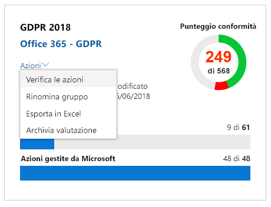

## Copiare le informazioni da valutazioni esistenti

Come precedentemente spiegato, quando si crea un nuovo gruppo di valutazione, è possibile copiare le informazioni dalle valutazioni in un gruppo esistente nella nuova valutazione del nuovo gruppo. Ciò consente di applicare la valutazione e il lavoro di verifica che è stato completato agli stessi controlli gestiti dal cliente nella nuova valutazione. Ad esempio, se si dispone di un gruppo per tutte le valutazioni relative a GDPR nella propria organizzazione, è possibile copiare informazioni comuni dal lavoro di valutazione esistente quando si aggiunge una nuova valutazione al gruppo.
  
È possibile copiare le informazioni seguenti dal cliente a una nuova valutazione:
  
- Utenti della valutazione. L'utente di una valutazione è un utente assegnato al controllo.
    
- Stato, data e risultati del test.
    
- Dettagli dell'implementazione e informazioni del piano.
    
Analogamente, vengono sincronizzate le informazioni provenienti dai controlli condivisi gestiti dal cliente all'interno dello stesso gruppo di valutazione. Vengono sincronizzate anche le informazioni relative ai controlli gestiti dal cliente nell'ambito della stessa valutazione.

## Visualizzazione delle valutazioni

1. Individuare la sezione di valutazione corrispondente alla valutazione da visualizzare, quindi fare clic sul nome della valutazione per aprirla e visualizzare i controlli gestiti da Microsoft e dai clienti associati alla valutazione, insieme a un elenco dei servizi cloud che rientrano nell'ambito della valutazione. Di seguito viene riportato un esempio di valutazione per Office 365 e GDPR.
    
    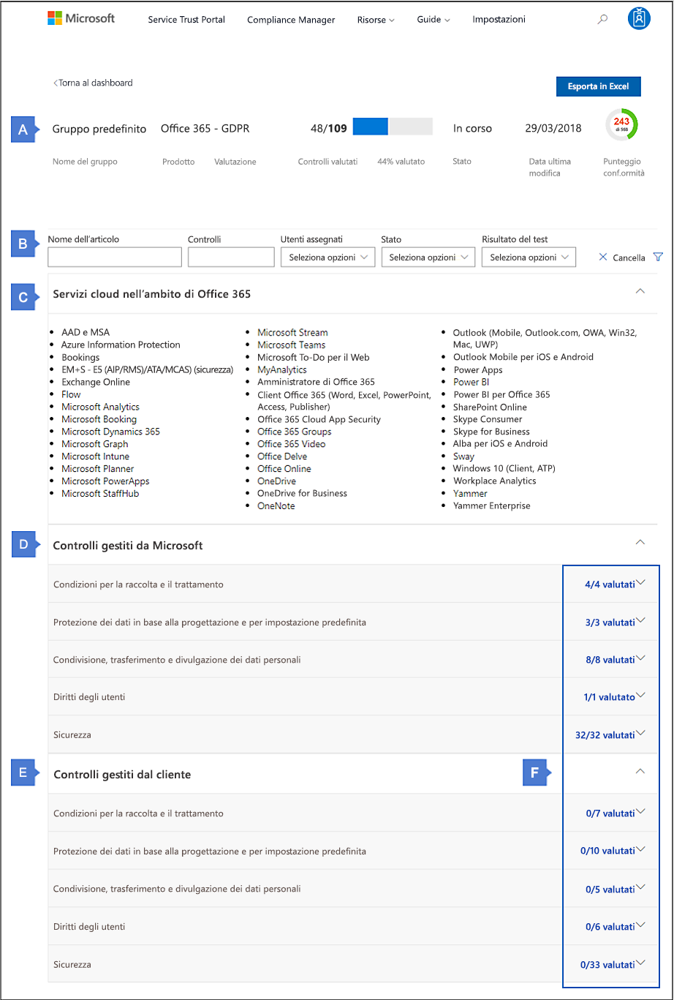
  
1. Questa sezione mostra le informazioni di riepilogo della valutazione, incluso il nome del gruppo di valutazione, del prodotto, della valutazione e il numero di controlli di valutazione
    
2. Questa sezione mostra i controlli del filtro di valutazione. Per una spiegazione più dettagliata su come utilizzare i controlli del filtro di valutazione, vedere la sezione [Gestire il processo di valutazione](meet-data-protection-and-regulatory-reqs-using-microsoft-cloud.md#managecomplianceprocess_1). 
    
3. Questa sezione mostra i singoli servizi cloud che rientrano nell'ambito della valutazione.
    
4. Questa sezione contiene i controlli gestiti da Microsoft. I controlli correlati sono organizzati dalla famiglia di controlli. Fare clic su una famiglia di controlli per espanderla e visualizzare i singoli controlli.
    
5. Questa sezione contiene i controlli gestiti dai clienti, che sono anche organizzati dalla famiglia di controlli. Fare clic su una famiglia di controlli per espanderla e visualizzare i singoli controlli.
    
6. Visualizza il numero totale di controlli nella famiglia di controlli e quanti di questi controlli sono stati valutati. Una funzionalità chiave di Compliance Manager è il monitoraggio dei progressi della tua organizzazione sulla valutazione dei controlli gestiti dai clienti. Per ulteriori informazioni, vedere la sezione [Comprendere il punteggio di conformità](meet-data-protection-and-regulatory-reqs-using-microsoft-cloud.md#compliancescore). 

## Gestire il processo di valutazione

Il creatore di una valutazione è inizialmente l'unico utente della valutazione. Per ciascun controllo gestito dal cliente, è possibile assegnare un'attività a una persona della propria organizzazione in modo tale che tale persona diventi un utente della valutazione che può eseguire le azioni del cliente consigliate e raccogliere e caricare le evidenze. Quando si assegna un'attività, è possibile scegliere di inviare un messaggio di posta elettronica alla persona che contenga dettagli come le azioni del cliente raccomandate e la priorità dell'attività. La notifica e-mail include un link al dashboard **Attività**, che elenca tutte le attività assegnate a tale persona. 
  
Di seguito viene riportato un elenco delle attività che è possibile eseguire utilizzando le funzionalità del flusso di lavoro di Compliance Manager.
  
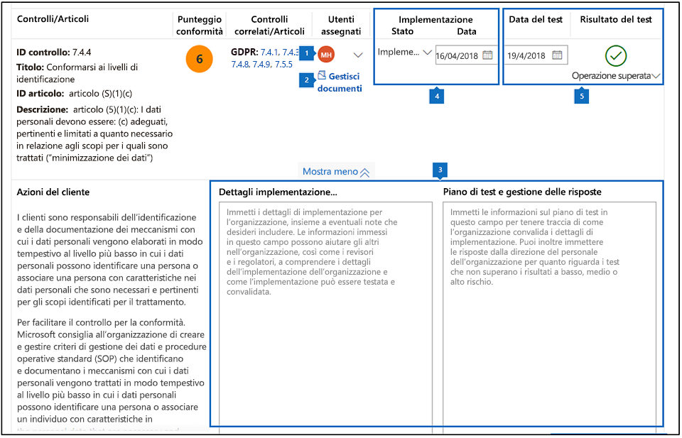
  
1. **Utilizzare le opzioni filtro per trovare controlli di valutazione specifici** - Compliance Manager offre **opzioni filtro**, che forniscono all'utente criteri di selezione altamente dettagliati per la visualizzazione dei controlli di valutazione e lo aiutano a individuare con precisione aree specifiche di conformità. 
    
    Fare clic sull'icona a forma di imbuto sul lato destro della pagina per mostrare o nascondere i controlli per le **opzioni filtro**. Questi controlli consentono di specificare i criteri di filtro e di seguito verranno visualizzati solo i controlli di valutazione che soddisfano tali criteri. 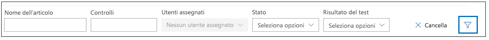
  
    - **Articoli**: filtra il nome dell'articolo e restituisce i controlli per la valutazione associati a quell'articolo. Ad esempio, digitando "Articolo (5)" viene restituito un elenco di selezione di articoli il cui nome include quella stringa, vale a dire l'articolo (5) (1) (a), l'articolo (5) (1) (b), l'articolo (5) (1) (c), ecc. La selezione dell'articolo (5) (1) (c) restituirà i controlli associati all'articolo (5) (1) (c). Questo campo di selezione multipla utilizza un operatore OR con più valori: ad esempio, se si seleziona l'articolo (5) (1) (a) e si aggiunge l'articolo (5) (1) (c), il filtro restituirà i controlli associati all'articolo (5)(1)(a) o all'articolo (5)(1)(c). 
    
      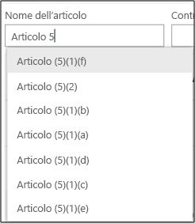
  
    - **Controlli**: restituisce l'elenco dei controlli i cui nomi si adattano al filtro, ad esempio, digitando 7.3 restituisce un elenco di selezione di elementi come 7.3.1, 7.3.4, 7.3.5, ecc. Questo campo di selezione multipla utilizza un operatore OR con più valori: ad esempio, se si seleziona 7.3.1 e si aggiunge 7.3.4, il filtro restituirà i controlli associati a 7.3.1 o a 7.3.4 
    
      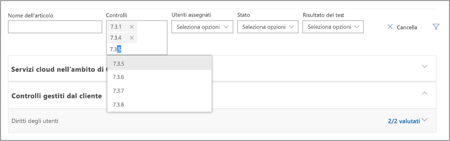
  
    - **Utenti assegnati**: restituisce l'elenco dei controlli assegnati all'utente selezionato. 
    
    - **Stato**: restituisce l'elenco dei controlli con lo stato selezionato. 
    
    - **Risultato del test**: restituisce l'elenco dei controlli con il risultato del test selezionato. 
    
    Quando si applicano le condizioni del filtro, la vista dei controlli applicabili cambierà per corrispondere alle condizioni del filtro. Espandere le sezioni della famiglia di controllo per mostrare i dettagli del controllo di seguito. 
    
    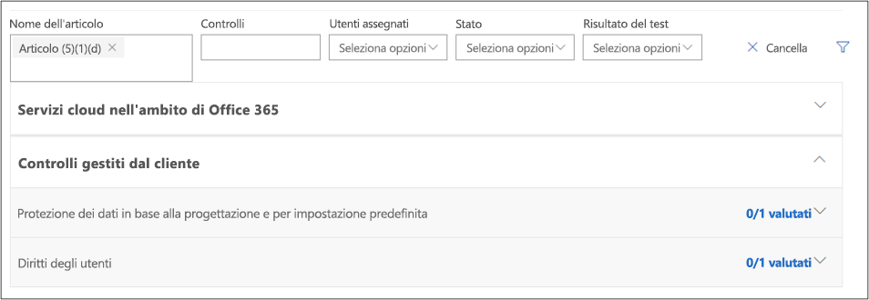
  
2. Se dopo aver selezionato i filtri desiderati non vengono visualizzati risultati, significa che non ci sono controlli che corrispondono alle condizioni di filtro specificate. Ad esempio, se si seleziona un particolare **Utente assegnato** e si sceglie un nome per il **controllo** che non corrisponde al controllo assegnato a quell'utente, non verrà mostrata nessuna valutazione nella pagina sottostante. 
    
3. **Assegnare un'azione a un utente**: è possibile assegnare un'attività a una persona per implementare i requisiti di una certificazione/regolamento o per testare, verificare e documentare i requisiti di implementazione dell'organizzazione. Quando si assegna un'attività, è possibile scegliere di inviare un messaggio di posta elettronica alla persona che contiene dettagli, tra cui le azioni cliente raccomandate e la priorità dell'attività. È inoltre possibile annullare l'assegnazione o riassegnare un'attività a un'altra persona. 
    
4. **Gestione documenti**: i controlli gestiti dai clienti dispongono anche di una posizione per gestire i documenti correlati all'esecuzione di attività di implementazione e per l'esecuzione di attività di test e convalida. Chiunque disponga delle autorizzazioni per modificare i dati in Compliance Manager può caricare i documenti facendo clic su **Gestione documenti**. Dopo aver caricato un documento, fare clic su **Gestione documenti** per visualizzare e scaricare i file. 
    
5. **Fornire dettagli di implementazione e test**: ogni controllo gestito dal cliente ha un campo modificabile in cui gli utenti possono aggiungere dettagli di implementazione che documentano le misure adottate dalla propria organizzazione per soddisfare i requisiti della certificazione/regolamento e per convalidare e documentare il modo in cui la propria organizzazione soddisfa tali requisiti.
    
6. **Impostare lo stato**: impostare lo stato di ogni elemento nell'ambito del processo di valutazione. I valori di stato disponibili sono **implementato**, **implementazione alternativa**, **pianificato** e **non in ambito**. 
    
7. **Immettere la data e il risultato del test**: la persona con il ruolo di valutatore di Compliance Manager può verificare il corretto svolgimento delle verifiche, esaminare i dettagli dell'implementazione, il piano di test, i risultati dei test e qualsiasi evidenza caricata, quindi impostare la data e il risultato del test. I valori dei risultati dei test disponibili sono **superato**, **non superato - basso rischio**, **non superato - rischio medio** **** e **non superato - alto rischio**. 

## Gestione delle attività

Le persone coinvolte nel processo di valutazione nella propria organizzazione possono utilizzare Compliance Manager per esaminare i controlli gestiti dai clienti da tutte le valutazioni per le quali sono utenti. Quando un utente accede a Compliance Manager e apre il dashboard **Attività**, viene visualizzato un elenco delle attività ad esso assegnate. A seconda del ruolo di Compliance Manager assegnato all'utente, vengono forniti dettagli di implementazione o test, aggiornamento dello stato o assegnazione di attività. 
  
Poiché i controlli di certificazione sono generalmente implementati da una sola persona e testati da un'altra persona, l'attività di controllo può essere inizialmente assegnata a una persona per l'implementazione e, una volta completata, tale persona può riassegnare l'attività di controllo alla persona successiva per i test di controllo e il caricamento delle evidenze. Questa assegnazione/riassegnazione delle azioni di controllo può essere eseguita da qualsiasi utente che abbia un ruolo di Compliance Manager con autorizzazioni sufficienti e consente la gestione centralizzata delle assegnazioni di controllo o il routing decentralizzato delle attività di controllo, dalla persona che si occupa dell'implementazione a quella che si occupa del test, come appropriato.
  
Per assegnare un'attività:
  
1. Individuare la sezione di valutazione sul dashboard di Compliance Manager per l'assegnazione su cui si desidera operare e fare clic sul nome della valutazione per passare alla pagina dei dettagli della valutazione.
    
2. È possibile fare clic su **Filtro** e usare i controlli di filtro per individuare il controllo di valutazione specifico da assegnare o 
    
3. scorrere fino alla sezione dei controlli gestiti dai clienti, espandere la famiglia di controllo e scorrere l'elenco di controllo fino a quando non viene individuato il controllo di valutazione da assegnare
    
4. Nella colonna **Utente assegnato**, fare clic su **Assegna**. 
    
5. Nella finestra di dialogo Assegna attività, fare clic sul campo **Assegna a** per popolare l'elenco degli utenti cui assegnare l'attività. È possibile scorrere l'elenco per individuare l'utente di destinazione o iniziare a digitare nella casella per cercare il nome utente. 
    
6. Selezionare l'utente per assegnare l'attività.
    
7. Se si desidera inviare una notifica e-mail all'utente, assicurarsi che la casella di controllo **Invia e-mail di notifica** sia selezionata. 
    
8. Digitare eventuali appunti da mostrare a tale utente e fare clic su **Assegna**. 
 
    L'utente riceverà una notifica dell'assegnazione dell'attività e le eventuali note fornite.
    
Le note associate all'attività sono conservate nella sezione delle note e restano a disposizione per l'assegnazione della successiva attività. Queste note non sono di sola lettura, possono essere modificate, sostituite o rimosse da chi assegna l'attività.

## Esportazione delle informazioni da una valutazione

È possibile esportare una valutazione in un file Excel, che può essere esaminato dai soggetti interessati alla conformità nella propria organizzazione e fornito a revisori e regolatori. Questo report sulla valutazione rappresenta un'istantanea della valutazione stessa a partire dalla data e dall'ora di creazione del report e contiene i dettagli sia dei controlli gestiti da Microsoft sia dei controlli gestiti dal cliente per tale valutazione, incluso lo stato dell'implementazione del controllo, la data del test di controllo e i risultati del test e, inoltre, fornisce collegamenti alle evidenze caricate. Si consiglia di esportare il report sulla valutazione prima di archiviarla, poiché le valutazioni archiviate non conservano i loro collegamenti ai documenti caricati.
  
Per esportare un report sulla valutazione:
  
- Nel dashboard di Compliance Manager, fare clic su **Azioni** nella sezione di valutazione che si desidera esportare, quindi **Esporta in Excel**

  Oppure
    
- Se si sta visualizzando la pagina dei dettagli, fare clic sul pulsante **Esporta in Excel** nell'angolo superiore destro della pagina sopra il punteggio di conformità della valutazione.
    
Il report sulla valutazione verrà scaricato nella sessione del browser in uso. Se non si visualizza un popup con tali informazioni, verificare la cartella di download del browser.

## Archiviazione della valutazione

Una volta completata una valutazione, se non più necessaria a i fini di conformità, è possibile archiviarla. Quando si archivia una valutazione, questa viene rimossa dal dashboard di valutazione.
  
> [!NOTE]
> Quando una valutazione viene archiviata, l'operazione non può essere annullata, quindi la valutazione non può essere ripristinata in stato di lettura-scrittura. Si noti che le valutazioni archiviate non mantengono i loro collegamenti alle evidenze caricate, quindi si consiglia vivamente di eseguire un'esportazione della valutazione prima di archiviarla, poiché dal report sulla valutazione esportato sarà possibile accedere ai collegamenti alle evidenze contenute. 
  
Per archiviare una valutazione:
  
1. Nella sezione del dashboard della valutazione, fare clic su **Azioni**. 
    
2. Selezionare **Archivia valutazione**. 
 
    Viene visualizzata la finestra di dialogo **Archivia valutazioni** che chiede di confermare se si desidera archiviare la valutazione.
    
4. Per continuare con l'archiviazione, fare clic su **Archivia**, in caso contrario fare clic su **Annulla**. 
    
Per visualizzare le valutazioni archiviate:
  
1. Nel dashboard di Compliance Manager, selezionare la casella di controllo **Mostra archiviati**. 
    
    Le valutazioni archiviate appariranno in una sezione nuovamente visibile sotto il resto delle valutazioni attive in una barra con titolo **Valutazioni archiviate**.
    
3. Fare clic sul nome della valutazione che si desidera visualizzare.
    
Durante la visualizzazione di una valutazione archiviata, nessuno dei controlli normalmente modificabili (ad esempio l'implementazione, i risultati del test) sarà attivo e il pulsante **Documenti gestiti** non sarà disponibile.

## Log delle modifiche per i controlli gestiti dai clienti

Compliance Manager è progettato per essere aggiornato regolarmente per tenere il passo con i cambiamenti dei requisiti normativi e con i cambiamenti all'interno dei servizi cloud. Questi aggiornamenti includono le modifiche ai controlli gestiti dai clienti. Viene fornito un log delle modifiche per aiutare l'utente a comprendere l'impatto di queste modifiche, inclusi i dettagli sul contenuto aggiunto o modificato e le linee guida sull'impatto delle modifiche sulle valutazioni esistenti. In generale, sono possibili due tipi di modifiche:
  
- Una modifica **principale** è una modifica significativa a un'azione del cliente, come l'aggiunta o la rimozione di un controllo o di passaggi numerati specifici oppure un cambiamento nella Guida relativa a responsabilità, elementi consigliati o evidenze. Per le modifiche principali, si consiglia di rivalutare l'implementazione e/o la valutazione del controllo interessato.
    
- Una modifica **secondaria** è una modifica irrilevante a un'azione del cliente, come la correzione di un errore di ortografia o di formattazione oppure l'aggiornamento o la correzione di collegamenti ipertestuali. Le modifiche secondarie in genere non richiedono la rivalutazione del controllo; tuttavia, si consiglia di rivedere l'azione del cliente aggiornata.
  
### Controlli gestiti dai clienti di Office 365 - Log delle modifiche di luglio 2018

|**ID di controllo**|**Valutazione**|**Tipo di modifica**|**Descrizione della modifica**|**Azioni consigliate per i clienti**|
|:-----|:-----|:-----|:-----|:-----|:-----|:-----|:-----|:-----|
|45 C.F.R. § 164.308(a)(7)(ii)(A)  |Office 365: HIPAA|Principale|Controllo HITECH aggiunto alla valutazione HIPAA per Office 365 |Esaminare il controllo aggiunto e le azioni del cliente raccomandate  |
|45 C.F.R.  164.312(a)(6)(ii)|Office 365: HIPAA|Principale|Controllo HITECH aggiunto alla valutazione HIPAA per Office 365|Esaminare il controllo aggiunto e le azioni del cliente raccomandate |
45 C.F.R. § 164.312(c)(1)| Office 365: HIPAA|Principale| Controllo HITECH aggiunto alla valutazione HIPAA per Office 365 |Esaminare il controllo aggiunto e le azioni del cliente raccomandate  |
45 C.F.R.  § 164.316(b)(2)(iii)| Office 365: HIPAA|Principale|Controllo HITECH aggiunto alla valutazione HIPAA per Office 365|Esaminare il controllo aggiunto e le azioni del cliente raccomandate |
|

### Controlli gestiti dai clienti di Office 365 - Log delle modifiche di aprile 2018

|**GDPR**|**HIPAA**|**ISO 27001**|**ISO 27018**|**NIST 800-53**|**NIST 800-171**|**Tipo di modifica**|**Descrizione della modifica**|**Azioni consigliate per i clienti**|
|:-----|:-----|:-----|:-----|:-----|:-----|:-----|:-----|:-----|
|6.13.2    |||C.16.1.1    |||Principale    |In precedenza numerato come 6.12.1.1.    Aggiunti dettagli agli elementi consigliati.    |Valutare nuovamente il controllo: esaminare le indicazioni aggiornate nelle azioni del cliente e seguire la procedura consigliata per l'implementazione e la valutazione del controllo.    |
||||||3.1.6    |Principale    |Aggiunti alla Guida i passaggi che includono l'abilitazione del controllo e la ricerca nei log di controllo.    |Esaminare gli elementi consigliati aggiornati nelle azioni del cliente.    |
|6.8.2    |||A.10.2    |||Principale    |In precedenza numerato come 6.7.2.9.    Guida aggiornata con ulteriori consigli e attività.    |Valutare nuovamente il controllo: esaminare le indicazioni aggiornate nelle azioni del cliente e seguire la procedura consigliata per l'implementazione e la valutazione del controllo.    |
|6.6.4    |45 C.F.R. § 164.312(a)(2)(i)              45 C.F.R. § 164.312(d)    |A.9.4.2    ||IA-2    |3.5.1    |Principale    |In precedenza numerato come 6.5.2.3.    Guida aggiornata con ulteriori consigli e attività.    |Valutare nuovamente il controllo: esaminare le indicazioni aggiornate nelle azioni del cliente e seguire la procedura consigliata per l'implementazione e la valutazione del controllo.    |
|6.13.1    |45 C.F.R. § 164.308(a)(1)(i)    |A.16.1    |C.16.1    |IR-4(a)    |3.6.1    |Principale    |In precedenza numerato come 6.12.1.    Guida aggiornata con ulteriori consigli e attività.    |Valutare nuovamente il controllo: esaminare le indicazioni aggiornate nelle azioni del cliente e seguire la procedura consigliata per l'implementazione e la valutazione del controllo.    |
|6.7    ||||||Principale    |In precedenza numerato come 6.6.1.1.    Guida aggiornata con ulteriori consigli e attività.    |Valutare nuovamente il controllo: esaminare le indicazioni aggiornate nelle azioni del cliente e seguire la procedura consigliata per l'implementazione e la valutazione del controllo.    |
|6.6.5    |||A.10.8    |IA-3    |3.5.2    |Principale    |In precedenza numerato come 6.5.4.2.    Guida aggiornata con ulteriori consigli e attività.    |Valutare nuovamente il controllo: esaminare le indicazioni aggiornate nelle azioni del cliente e seguire la procedura consigliata per l'implementazione e la valutazione del controllo.    |
|6.15.1    ||||||Principale    |In precedenza numerato come 6.14.1.3.    Guida aggiornata con ulteriori consigli e attività.    |Valutare nuovamente il controllo: esaminare le indicazioni aggiornate nelle azioni del cliente e seguire la procedura consigliata per l'implementazione e la valutazione del controllo.    |
|||||AC-2(h)(2)    ||Secondaria    |Aggiunto un collegamento per attivare il pannello Controllo.    |Nessuna operazione necessaria.    |
|||||AC-2(7)(b)    ||Secondaria    |Aggiunto un collegamento per attivare il pannello Controllo.    |Nessuna operazione necessaria.    |
|||||AC-2(h)(1)    ||Secondaria    |Aggiunto un collegamento per attivare il pannello Controllo.    |Nessuna operazione necessaria.    |
||45 C.F.R. § 164.308(a)(5)(ii)(C)    |||AC-2(g)    ||Secondaria    |Aggiunto un collegamento per attivare il pannello Controllo.    |Nessuna operazione necessaria.    |
|||||AC-2(12)    ||Secondaria    |Aggiunto un collegamento per attivare il pannello Controllo.    |Nessuna operazione necessaria.    |
||45 C.F.R. § 164.312(b)    |A.12.4.3    ||AU-2(d)    ||Secondaria    |Aggiunto un collegamento per attivare il pannello Controllo.    |Nessuna operazione necessaria.    |
|||||AC-2(4)    ||Secondaria    |Aggiunto un collegamento per attivare il pannello Controllo.    |Nessuna operazione necessaria.    |
||||||3.1.7    |Secondaria    |Aggiunto un collegamento per attivare il pannello Controllo.    |Nessuna operazione necessaria.    |
|||A.16.1.7    |C.12.4.2, parte 2    |||Secondaria    |Aggiunto un collegamento per attivare il pannello Controllo.    |Nessuna operazione necessaria.    |
|||||AC-2(h)(3)    ||Secondaria    |Aggiunto un collegamento per attivare il pannello Controllo.    |Nessuna operazione necessaria.    |
|||A.12.4.2    ||||Secondaria    |Aggiunto un collegamento per attivare il pannello Controllo.    |Nessuna operazione necessaria.    |
|||A.7.2.8    ||||Secondaria    |Aggiunti collegamenti al pannello Ricerca contenuto e al portale DSR.    |Nessuna operazione necessaria.    |
||45 C.F.R. § 164.308(a)(3)(ii)(C)    |||||Secondaria    |Aggiunti collegamenti per abilitare il pannello Controllo e per gli argomenti di supporto per il ruolo di amministratore di Office 365.    |Nessuna operazione necessaria.    |
|5.2.1    ||||||Secondaria    |In precedenza numerato come 5.2.2.    Chiarimento sulle responsabilità del cliente all'interno della Guida.    |Esaminare gli elementi consigliati aggiornati nelle azioni del cliente.    |
|6.11.1    |45 C.F.R. § 164.312(e)(2)(ii)    |A.10.1.1          A.10.1.2          A.18.1.5    |C.10.1.1    |SC-13    |3.13.11    |Secondaria    |In precedenza numerato come 6.10.1.2.    Errore di ortografia corretto.    |Nessuna operazione necessaria.    |
|7.5.1    ||||||Secondaria    |In precedenza numerato come A.7.4.1.    Errore di ortografia corretto.    |Nessuna operazione necessaria.    |
|||A.8.2.3    |||3.1.3    |Secondaria    |Rimossa frase non necessaria.    |Nessuna operazione necessaria.    |
||45 C.F.R. § 164.308(a)(4)(i)    |A.6.1.2    ||AC-5(a)    |3.1.2          3.1.4    |Secondaria    |Guida aggiornata con ulteriori consigli e attività.    |Esaminare gli elementi consigliati aggiornati nelle azioni del cliente.    |
||45 C.F.R. § 164.308(a)(7)(ii)(E)    |||RA-2(a)    ||Secondaria    |Aggiornato il collegamento all'argomento della Guida relativo al servizio di importazione per usare FWLink.    |Nessuna operazione necessaria.    |
|

### Modifica riferimento all'ID di controllo per la valutazione GDPR - Log delle modifiche di febbraio 2018 

|**ID di controllo precedente (anteprima di novembre 2017)**|**Nuovo ID di controllo (versione di febbraio 2018 GA)**|
|:-----|:-----|
|5.2.2    |5.2.1    |
|5.2.3    |5.2.2    |
|5.2.4    |5.2.3    |
|6.1.1.1    |6.2    |
|6.10.1.2    |6.11.1    |
|6.10.2.5    |6.11.2    |
|6.11.1.2    |6.12    |
|6.12.1    |6.13.1    |
|6.12.1.1    |6.13.2    |
|6.12.1.5    |6.13.3    |
|6.14.1.3    |6.15.1    |
|6.14.2.1    |6.15.2    |
|6.14.2.3    |6.15.3    |
|6.2.1.1    |6.3    |
|6.3.2.2    |6.4    |
|6.4.3.1    |6.5.2    |
|6.4.3.2    |6.8.1    |
|6.4.3.3    |6.5.3    |
|6.5.2    |6.6.1    |
|6.5.2.1    |6.6.2    |
|6.5.2.2    |6.6.3    |
|6.5.2.3    |6.6.4    |
|6.5.4.2    |6.6.5    |
|6.6.1.1    |6.7      |
|6.7.2.7    |6.8.1    |
|6.7.2.9    |6.8.2    |
|6.8.1.4    |6.9.1    |
|6.8.4.1    |6.9.3    |
|6.8.4.2    |6.9.4    |
|6.9.2.1    |6.10.1   |
|6.9.2.3    |6.10.2   |
|A.7.1.1    |7.2.1    |
|A.7.1.2    |7.2.2    |
|A.7.1.3    |7.2.3    |
|A.7.1.4    |7.2.4    |
|A.7.1.5    |7.2.5    |
|A.7.1.6    |7.2.6    |
|A.7.1.7    |7.2.7    |
|A.7.2.1    |7.3.1    |
|A.7.2.10   |7.3.9    |
|A.7.2.11   |7.3.10   |
|A.7.2.2    |7.3.2    |
|A.7.2.3    |7.3.3    |
|A.7.2.4    |7.3.4    |
|A.7.2.5    |7.3.5    |
|A.7.2.6    |7.3.6    |
|A.7.2.7    |7.3.7    |
|A.7.2.8    |7.3.8    |
|A.7.3.1    |7.4.1    |
|A.7.3.10   |7.4.10   |
|A.7.3.2    |7.4.2    |
|A.7.3.3    |7.4.3    |
|A.7.3.4    |7.4.4    |
|A.7.3.5    |7.4.5    |
|A.7.3.6    |7.4.6    |
|A.7.3.7    |7.4.7    |
|A.7.3.8    |7.4.8    |
|A.7.3.9    |7.4.9    |
|A.7.4.1    |7.5.1    |
|A.7.4.2    |7.5.2    |
|A.7.4.3    |7.5.3    |
|A.7.4.4    |7.5.4    |
|A.7.4.5    |7.5.5    |
|B.8.1.1    |8.2.1    |
|B.8.1.2    |8.2.2    |
|B.8.1.3    |8.2.3    |
|B.8.1.4    |8.2.4    |
|B.8.1.5    |8.2.5    |
|B.8.1.6    |8.2.6    |
|B.8.2.1    |8.3.1    |
|B.8.3.1    |8.4.1    |
|B.8.3.2    |8.4.2    |
|B.8.3.3    |8.4.3    |
|B.8.4.1    |8.5.1    |
|B.8.4.2    |8.5.2    |
|B.8.4.3    |8.5.4    |
|B.8.4.4    |8.5.5    |
|B.8.4.5    |8.5.3    |
|B.8.4.6    |8.5.6    |
|B.8.4.7    |8.5.7    |
|B.8.4.8    |8.5.8    |
|
   
## Vedere anche

- [Annuncio della disponibilità generale di Compliance Manager](https://techcommunity.microsoft.com/t5/Security-Privacy-and-Compliance/Announcing-Compliance-Manager-general-availability/ba-p/161922)
    
- [Microsoft 365 offre una strategia di protezione delle informazioni per facilitare la conformità al GDPR](https://blogs.office.com/it-IT/2018/02/22/microsoft-365-provides-an-information-protection-strategy-to-help-with-the-gdpr)
    

