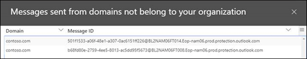

# Risolvere il dominio del mittente InsightFix sender domain insight

> [!NOTE]
> Le funzionalità descritte in questo argomento non sono state distribuite in tutte le organizzazioni di Office 365 e sono soggette a modifiche.The features described in this topic haven't been deployed to all Office 365 organizations, and are subject to change.

Office 365 richiede l'invio di messaggi da ambienti di posta elettronica locali interni a Office 365 per rispondere a determinati criteri di sicurezza:Office 365 requires messages sending from internal on-premises email environments to Office 365 to meet certain security criteria:

- È stato creato un connettore in ingresso in Office 365 per autenticare le connessioni SMTP dal server di posta elettronica locale utilizzando l'indirizzo IP di origine o un certificato.You've created an inbound connector in Office 365 to authenticate SMTP connections from your on-premises email server by using the source IP address or a certificate.

- Il server di posta elettronica locale è stato configurato per inoltrare la posta elettronica tramite Office 365 al mondo esterno.You've configured your on-premises email server to relay email via Office 365 to external world.

- Nella configurazione, una delle seguenti affermazioni è vera:In your configuration, one of the following statements is true:

  - Il dominio di posta elettronica del mittente è registrato nell'organizzazione di Office 365.The sender's email domain is registered in your Office 365 organization. Per ulteriori informazioni, vedere Add Domains in Office 365.For more information, see Add Domains in Office 365.

  - Il server di posta elettronica locale è configurato per l'utilizzo di un certificato per l'invio di posta elettronica a Office 365, il certificato contiene o corrisponde esattamente a un nome di dominio registrato in Office 365 ed è stato creato un connettore basato su certificato in Office 365 con tale dominio.Your on-premises email server is configured to use a certificate to send email to Office 365, the certificate contains or exactly matches a domain name that you've registered in Office 365, and you've created a certificate based connector in Office 365 with that domain. 

I messaggi che non soddisfano i criteri non verranno attribuiti all'organizzazione e potrebbero essere rifiutati.Messages that don't meet the criteria will not be attributed to the organization and could be rejected.

La **correzione del dominio del mittente** consente di visualizzare la posta elettronica dall'ambiente locale che non soddisfa i criteri, consente di identificare le macchine e gli account utente potenzialmente compromessi nell'ambiente di posta elettronica locale, contribuendo a eseguire azioni di correzione.The **Fix sender domain** insight shows you email from your on-premises environment that doesn't meet the criteria, helps you to identify potentially compromised machines and user accounts in your on-premises email environment, and helps you to take remediation actions.

Quando si fa clic su **Visualizza dettagli**, si viene indirizzati a un altro widget con maggiori dettagli, come illustrato nel diagramma seguente:When you click **View details**, you are taken to another widget with more details as shown in the following diagram:

Verrà visualizzato il connettore in ingresso utilizzato per recapitare i messaggi a Office 365.You'll see the inbound connector that was used to deliver the messages to Office 365. È inoltre possibile fare clic su **Visualizza ID messaggio di esempio** per visualizzare i dettagli relativi ai messaggi inviati dall'ambiente di posta elettronica locale.You can also click **view sample message IDs** to see details for the messages that were sent from your on-premises email environment. Poiché questi messaggi sono stati rifiutati da Office 365, non è possibile utilizzare la traccia dei messaggi, ma gli ID del messaggio di esempio possono essere rintracciati nell'ambiente di posta elettronica locale.Because these messages were rejected by Office 365, you can't use message trace, but you can use the sample message ids to track the messages in your on-premises email environment.

## Vedere ancheSee also

Per ulteriori informazioni su altre comprensioni del flusso di posta nel dashboard del flusso di posta, vedere [Mail Flow Insights in the Security _AMP_ Compliance Center](mail-flow-insights-v2.md).For more information about other mail flow insights in the mail flow dashboard, see [Mail flow insights in the Security & Compliance Center](mail-flow-insights-v2.md).
