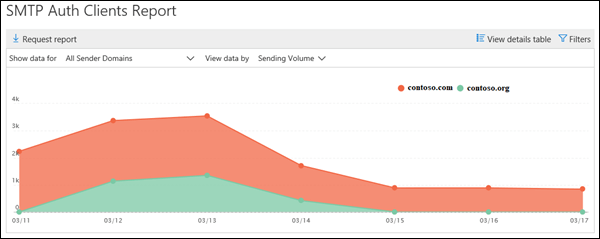

# Report sui client di autenticazione SMTP

Il rapporto **client auth SMTP** evidenzia l'utilizzo del protocollo di invio client auth SMTP da parte degli utenti o degli account di sistema nell'organizzazione. Questo protocollo legacy (che utilizza l'endpoint smtp.office365.com) offre solo l'autenticazione di base ed è suscettibile di essere utilizzato dagli account compromessi per inviare messaggi di posta elettronica.  Questo rapporto consente di verificare la possibilità di attività inusuali. Vengono inoltre visualizzati i dati di utilizzo di TLS per client o dispositivi che utilizzano l'autenticazione SMTP.

Il widget visualizzato nel dashboard del flusso di posta indica il numero di utenti o di account di servizio che hanno utilizzato il protocollo di autenticazione SMTP negli ultimi 7 giorni.

Se si fa clic sul widget, verrà aperto un riquadro a comparsa che fornisce una visualizzazione aggregata dell'utilizzo e dei volumi TLS per l'ultima settimana.

Quando si fa clic sul collegamento del **rapporto client auth SMTP** , vengono visualizzati due pivot di dati principali e due visualizzazioni di dati. I pivot di dati sono il **volume di invio** e l' **utilizzo di TLS**. Le visualizzazioni dati sono il grafico e la tabella details.

La visualizzazione **volume di invio** Mostra il numero di messaggi che sono stati inviati utilizzando l'autenticazione SMTP per l'intervallo di tempo specificato. È possibile modificare l'intervallo facendo clic su **filtri**. Il grafico è organizzato dal dominio del mittente. È possibile visualizzare i dati separati per ogni dominio selezionando il dominio nell'elenco a discesa **Mostra dati per** .

È possibile visualizzare informazioni dettagliate sui mittenti e sui relativi conteggi dei messaggi facendo clic su **Visualizza tabella dettagli**. Per tornare al grafico, fare clic su **Visualizza report**.

Il pivot **utilizzo TLS** è importante a causa dell'imminente deprecazione di TLS 1.0 e TLS 1.1 in Office 365. Molti dispositivi e applicazioni legacy non saranno in grado di inviare messaggi di posta elettronica se sono in grado di utilizzare solo TLS 1.0 con l'autenticazione SMTP. In questo pivot è possibile identificare ed eseguire azioni su utenti e account di sistema che continuano a utilizzare versioni precedenti di TLS.

È possibile visualizzare informazioni dettagliate sui mittenti, sulle versioni di TLS che utilizzano con l'autenticazione SMTP e sui conteggi dei messaggi facendo clic su **Visualizza tabella dettagli**. Per tornare al grafico, fare clic su **Visualizza report**.

È inoltre possibile scaricare una versione più dettagliata del rapporto facendo clic su Richiedi report.

## Vedere anche

Per ulteriori informazioni su altre comprensioni del flusso di posta nel dashboard del flusso di posta, vedere [Mail Flow Insights in the Security _AMP_ Compliance Center](mail-flow-insights-v2.md).
