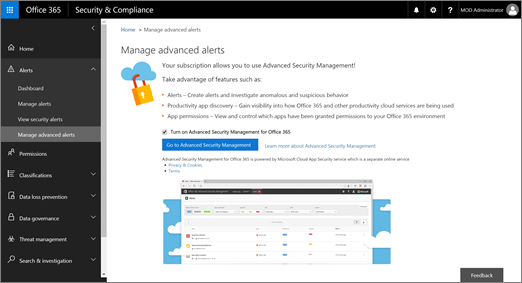

# Aggiornamenti di sicurezza di applicazione Cloud di Office 365 durante 2017Office 365 Cloud App Security updates during 2017
    
## Versione di Office 365 Cloud App sicurezza 112Office 365 Cloud App Security release 112

*Rilasciato il 24 dicembre 2017**Released December 24, 2017* 
  
**In seguito [Microsoft Cloud App Security versione 112](https://docs.microsoft.com/cloud-app-security/release-notes#cloud-app-security-release-112)**:**Following [Microsoft Cloud App Security release 112](https://docs.microsoft.com/cloud-app-security/release-notes#cloud-app-security-release-112)**: 
  
- **Cassetto delle conoscenze pertinenti**. Nel Registro di attività, è ora possibile accedere il cassetto delle conoscenze pertinenti facendo clic su un nome utente o l'indirizzo IP.**Relevant insight drawer**. In the Activity log, you can now access the relevant insight drawer by clicking on a user name or IP address. 
    
    
  
- **Possibilità di visualizzare più attività con un clic**. Nel cassetto delle conoscenze rilevanti, è possibile fare clic sull'icona del clock per visualizzare tutte le attività eseguite all'interno di 48 ore di un'attività selezionata.**Ability to view more activities with a click**. In the relevant insight drawer, you can click the clock icon to view all activities performed within 48 hours of a selected activity. 
    
    
  
- **Miglioramenti di log parser per SRX Juniper**. Sono stati apportati miglioramenti al parser registro individuazione Cloud per SRX Juniper.**Log parser improvements for Juniper SRX**. Improvements were made to the Cloud Discovery log parser for Juniper SRX. 
    
## Versione di Office 365 Cloud App sicurezza 111Office 365 Cloud App Security release 111

*Rilasciati il 10 dicembre 2017**Released December 10, 2017* 
  
**In seguito [Microsoft Cloud App Security versione 111](https://docs.microsoft.com/cloud-app-security/release-notes#cloud-app-security-release-111)**:**Following [Microsoft Cloud App Security release 111](https://docs.microsoft.com/cloud-app-security/release-notes#cloud-app-security-release-111)**: 
  
- **Miglioramenti relativi alla filtro fase**. Filtri temporali sono ora più semplici da utilizzare. Per accedere a un filtro di tempo, in una visualizzazione, ad esempio registro attività, i criteri, gli avvisi, utilizzando la visualizzazione avanzata, scegliere **Data** nell'elenco dei filtri. Scegliere un'opzione, ad esempio prima, dopo o in tra per applicare il filtro di tempo.**Time filter improvements**. Time filters are now easier to use. To access a time filter, in a view, such as Activity log, Policies, Alerts, using the Advanced view, choose **Date** in the list of filters. Then choose an option, such as before, after, or in between to apply the time filter. 
    
    
  
## Versione di Office 365 Cloud App sicurezza 110Office 365 Cloud App Security release 110

*Rilasciato il 26 novembre 2017**Released November 26, 2017* 
  
**In seguito [Microsoft Cloud App Security versione 110](https://docs.microsoft.com/cloud-app-security/release-notes#cloud-app-security-release-110)**:**Following [Microsoft Cloud App Security release 110](https://docs.microsoft.com/cloud-app-security/release-notes#cloud-app-security-release-110)**: 
  
- **Integrazione del server SIEM ora in genere disponibile**. Connessione a Office 365 Cloud App protezione di server SIEM. È possibile inviare gli avvisi e le attività automaticamente al server SIEM della scelta configurando gli agenti SIEM. Vedere [integrazione con Office 365 Cloud App Security sul server SIEM](integrate-your-siem-server-with-office-365-cas.md).**SIEM server integration now generally available**. Connect your SIEM server to Office 365 Cloud App Security. You can now send alerts and activities automatically to your SIEM server of choice by configuring SIEM Agents. See [Integrate your SIEM server with Office 365 Cloud App Security](integrate-your-siem-server-with-office-365-cas.md).
    
- **Semplificare l'accesso al contenuto della Guida**. Utilizzando il nuovo punto interrogativo nell'angolo superiore destro, è possibile accedere il contenuto della Guida all'interno delle pagine del portale di Office 365 Cloud App sicurezza. Ogni collegamento è sensibile al contesto, che consentirà delle informazioni che necessarie, basate sulla pagina in che si è.**Easier access to help content**. Using the new question mark in the upper right corner, you can now access the help content from within the pages of the Office 365 Cloud App Security portal. Each link is context-sensitive, taking you to the information you need, based on the page you're on. 
    
- **Invia commenti e suggerimenti**. Utilizza la faccina sorridente nell'angolo superiore destro, è possibile inviare commenti e suggerimenti da tutte le pagine del portale di Office 365 Cloud App sicurezza. In questo modo è possibile segnalare errori richiede le nuove funzionalità e condividere l'esperienza dell'utente direttamente con il team di protezione di Office 365 Cloud App.**Send us feedback**. Using the smiley face in the upper right corner, you can now send feedback from every page of the Office 365 Cloud App Security portal. This enables you to report bugs, request new features and share your experience directly with the Office 365 Cloud App Security team. 
    
## Versione di Office 365 Cloud App sicurezza 102Office 365 Cloud App Security release 102

*Rilasciato il 13 agosto 2017**Released August 13, 2017* 
  
**In seguito [Microsoft Cloud App Security versione 102](https://docs.microsoft.com/cloud-app-security/release-notes#cloud-app-security-release-102)**:**Following [Microsoft Cloud App Security release 102](https://docs.microsoft.com/cloud-app-security/release-notes#cloud-app-security-release-102)**: 
  
- **Nuove azioni indagini utente** abilitare un livello aggiuntivo di drill-down per indagini utente. In una pagina indagare, è possibile al passaggio del mouse su un'attività, all'utente o account e applicarlo come filtro e da quest'ultimo, è possibile visualizzare gli eventi o attività correlate.**New user investigation actions** enable an added level of drill-down to user investigations. On an Investigate page, you can hover on an activity, user, or account and apply it as a filter, and from there, you can view related activities or events. 
    
## Versione di Office 365 Cloud App sicurezza 100Office 365 Cloud App Security release 100

*Rilasciato il 17 luglio 2017**Released July 17, 2017* 
  
**In seguito [Microsoft Cloud App Security versione 100](https://docs.microsoft.com/cloud-app-security/release-notes#cloud-app-security-release-100)**:**Following [Microsoft Cloud App Security release 100](https://docs.microsoft.com/cloud-app-security/release-notes#cloud-app-security-release-100)**: 
  
- **Estensioni di protezione** è un nuovo dashboard a cui è possibile gestire centralmente tutte le estensioni di protezione per Office 365 Cloud App sicurezza, tra cui i token di API e gli agenti SIEM. Per visualizzare il dashboard di estensioni di protezione, procedere come segue:**Security extensions** is a new dashboard where you can centrally manage all your security extensions for Office 365 Cloud App Security, including API tokens and SIEM agents. To view the Security extensions dashboard, follow these steps: 
    
1. Accedere a [https://protection.office.com](https://protection.office.com) e accedere utilizzando l'account di lavoro o della scuola per Office 365. (Si passa alla sicurezza &amp; centro conformità.)Go to [https://protection.office.com](https://protection.office.com) and sign in using your work or school account for Office 365. (This takes you to the Security &amp; Compliance Center.) 
    
2. Accedere agli **avvisi** \> **Gestione avanzata degli avvisi**.Go to **Alerts** \> **Manage advanced alerts**.
    
3. Scegliere **Vai a Office 365 Cloud App protezione**.Choose **Go to Office 365 Cloud App Security**.
    
    
  
4. Fare clic su **Impostazioni** \> **estensioni di protezione**.Choose **Settings** \> **Security extensions**.
    
    
  
- **Migliori l'analisi**. Il meccanismo di analisi del Registro di individuazione Cloud sono stati apportati miglioramenti. Sono molto meno probabile che si verificano errori interni.**Improved parsing**. Improvements were made in the Cloud Discovery log parsing mechanism. Internal errors are significantly less likely to occur. 
    
- **Formati dei registri previsti**. Il formato previsto del registro per i registri di individuazione Cloud ora è elencati esempi di sia Registro di sistema e formato FTP.**Expected log formats**. The expected log format for Cloud Discovery logs now provides examples for both Syslog format and FTP format. 
    
## Argomenti correlatiRelated topics

[Contenuto della Guida alla protezione App Cloud di Office 365Office 365 Cloud App Security help content](office-365-cas-help.md)
  
[Attività di utilizzo dopo la distribuzione di Office 365 Cloud App SecurityUtilization activities after rolling out Office 365 Cloud App Security](utilization-activities-for-ocas.md)
  
[Le autorizzazioni di sicurezza di Office 365 &amp; centro conformitàPermissions in the Office 365 Security &amp; Compliance Center](permissions-in-the-security-and-compliance-center.md)
  

