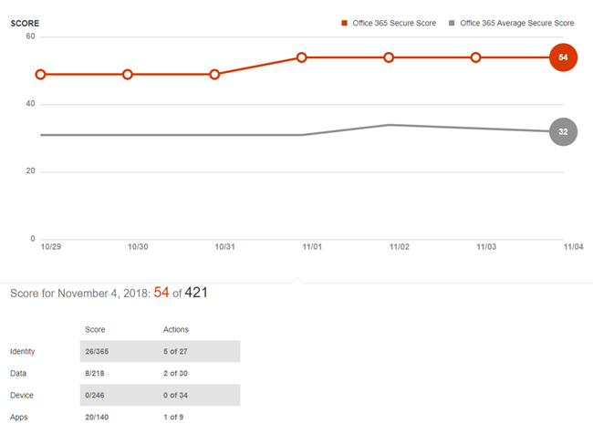

# Office 365 Secure Score

**Riepilogo** Vi è mai chiesto come la sicurezza dell'organizzazione sia davvero in Office 365? Il Punteggio sicuro è qui per aiutarti. Secure Score analizza la sicurezza dell'organizzazione in base alle normali attività e alle impostazioni di sicurezza di Office 365 e assegna un punteggio. Leggere questo articolo per ottenere una panoramica del Punteggio sicuro e come utilizzarlo.
  
## Come ottenere il Punteggio sicuro

Se l'organizzazione dispone di un abbonamento che include [office 365 Enterprise](https://docs.microsoft.com/office365/enterprise/), [Microsoft 365 business](https://docs.microsoft.com/microsoft-365/business/)o Office 365 Business Premium ed è necessario disporre delle [autorizzazioni necessarie](#required-permissions), è possibile visualizzare il Punteggio sicuro dell'organizzazione visitando [https://securescore.office.com](https://securescore.office.com). 

In alternativa, è possibile visitare il Centro sicurezza & Compliance[https://protection.office.com](https://protection.office.com)(), in cui si trova un widget Punteggio sicuro che fornisce il punteggio corrente.

Il widget include un collegamento al dashboard di Punteggio sicuro.

  
## Funzionamento

Il Punteggio sicuro determina quali servizi di Office 365 si sta utilizzando (ad esempio, OneDrive, SharePoint e Exchange), quindi confronta le impostazioni e le attività con una linea di base stabilita da Microsoft. Si otterrà un punteggio basato sul modo in cui l'organizzazione è allineata con le procedure consigliate per la sicurezza. Sono inoltre disponibili suggerimenti sui passaggi che è possibile eseguire per migliorare il punteggio dell'organizzazione. 
  

  
Il Punteggio sicuro calcola il punteggio in base ai servizi acquistati. Ad esempio, se è stato acquistato solo un piano di Exchange Online, non verranno segnate le caratteristiche di sicurezza di SharePoint Online. Il denominatore del punteggio è la somma di tutte le linee di base per i controlli che si applicano ai prodotti acquistati. Il numeratore è la somma di tutti i controlli per cui sono state completate o parzialmente completate le azioni da eseguire per il controllo.

Espandi un'azione per conoscere i passaggi da eseguire, le minacce che ti aiuteranno a proteggere e il numero di punti che il tuo punteggio aumenterà dopo aver seguito il suggerimento.
  

  
Per visualizzare l'impatto delle azioni sulla sicurezza dell'organizzazione, selezionare la scheda **analizzaTore Punteggio** e esaminare la cronologia. 
  

  
Al di sotto del grafico, verrà visualizzato un elenco di punteggi e azioni per categoria. 
  

 
Le azioni contrassegnate come **[non segnate]** sono quelle che è possibile eseguire per l'organizzazione, ma poiché non sono connesse al Punteggio sicuro, non vengono segnate.  

Nella pagina **analizzaTore partitura** fare clic su un punto dati per un giorno specifico, quindi scorrere verso il basso per visualizzare le azioni completate e incomplete per quel giorno per scoprire cosa è cambiato. Il Punteggio viene calcolato una volta al giorno (circa 1:00 AM PST). Se si apportano modifiche a un'azione misurata, il punteggio verrà aggiornato automaticamente il giorno successivo. Le modifiche apportate alla partitura richiedono fino a 48 ore.

Il Punteggio sicuro non esprime una misura assoluta della probabilità di essere violati. Esprime la misura in cui sono state adottate caratteristiche che possono compensare il rischio di essere violate. Nessun servizio può garantire che l'utente non verrà violato e che il Punteggio sicuro non debba essere interpretato come garanzia in alcun modo.
 
## Come aiuta il Punteggio sicuro

Con il Punteggio sicuro, è possibile migliorare la posizione di sicurezza dell'organizzazione utilizzando le funzionalità di sicurezza predefinite di Office 365 (molte delle quali sono già state acquistate ma potrebbero non essere a conoscenza di). Per saperne di più su queste funzionalità, è possibile garantire la tranquillità che si sta prendendo la procedura giusta per proteggere l'organizzazione dalle minacce.
  
Ma non basta prendere la parola. I clienti che utilizzano il Punteggio sicuro hanno visto il loro punteggio aumentare cinque volte di più rispetto ai clienti che non lo utilizzano. L'aumento del punteggio corrisponde alle caratteristiche di sicurezza utilizzate nelle rispettive organizzazioni.
  
> [!NOTE]
> Il Punteggio sicuro non esprime una misura assoluta della probabilità di essere violati. Esprime la misura in cui sono stati adottati controlli che possono compensare il rischio di essere violati. Nessun servizio può garantire che l'utente non verrà violato e che il Punteggio sicuro non debba essere interpretato come garanzia in alcun modo. 
  
## Autorizzazioni necessarie

Per visualizzare e utilizzare il dashboard di Punteggio sicuro, è necessario essere assegnati a uno dei ruoli seguenti in [Azure Active Directory](https://docs.microsoft.com/azure/active-directory/users-groups-roles/directory-assign-admin-roles#available-roles):
- Amministratore globale
- Amministratore fatturazione
- Amministratore utente
- Amministratore password
- Amministratore della sicurezza
- Lettore di sicurezza
- Amministratore di Exchange
- Amministratore di SharePoint

 Gli utenti a cui non è assegnato un ruolo di amministratore non saranno in grado di accedere al Punteggio sicuro.

## Argomenti correlati

[Panoramica del dashboard di sicurezza](security-dashboard.md)

[Qual è l’abbonamento corrente?](https://docs.microsoft.com/office365/admin/admin-overview/what-subscription-do-i-have?view=o365-worldwide)
