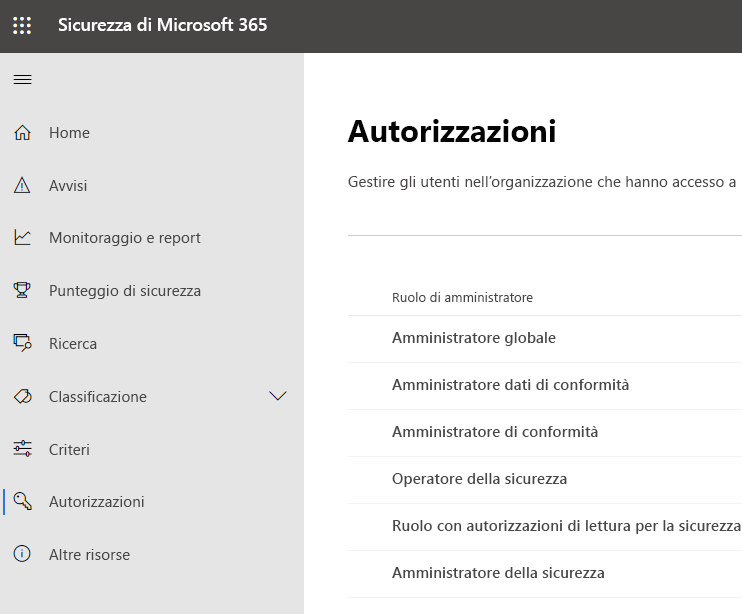
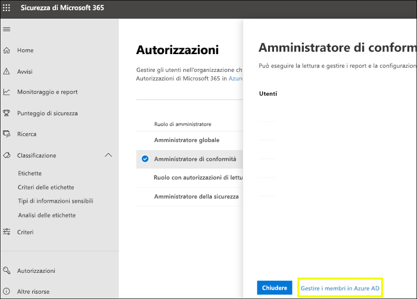
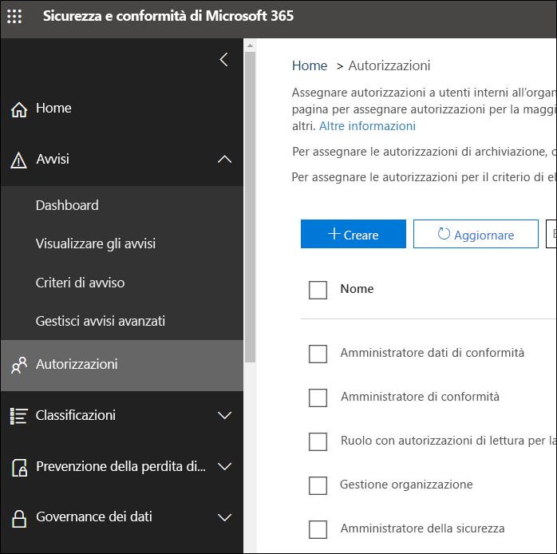

# Autorizzazioni nel Centro conformità Microsoft 365 e nel Centro sicurezza Microsoft 365

L'organizzazione deve gestire gli scenari di sicurezza e conformità che riguardano tutti i servizi di Microsoft 365. Inoltre, è necessaria flessibilità per fornire le corrette autorizzazioni di amministratore alle persone giuste nel gruppo IT dell'organizzazione. Utilizzando il Centro sicurezza Microsoft 365 o il Centro conformità Microsoft 365, è possibile gestire le autorizzazioni in una posizione centralizzata per tutte le attività relative alla sicurezza o alla conformità.

In seguito all'assegnazione dei ruoli di amministratore da parte dell'amministratore globale, gli amministratori avranno accesso a funzionalità e dati che riguardano tutti i servizi di Microsoft 365, come il Centro sicurezza Microsoft 365, il Centro conformità Microsoft 365, Azure, Office 365 ed Enterprise Mobility + Security.

## Quali sono i ruoli di Microsoft 365

I ruoli visualizzati nel Centro conformità Microsoft 365 e nel Centro sicurezza Microsoft 365 sono ruoli di Azure Active Directory. Tali ruoli sono progettati per uniformarsi alle funzioni lavorative nel gruppo IT della propria organizzazione, semplificando quindi l'assegnazione di autorizzazioni necessarie per svolgere il lavoro.

|**Ruolo**|**Descrizione**|
|:-----|:-----|
|**Amministratore globale**|Gli utenti con questo ruolo hanno accesso a tutte le funzionalità amministrative presenti in ogni servizio di Microsoft 365. Solo gli amministratori globali possono assegnare altri ruoli di amministratore.|
|**Amministratore dati di conformità**|Gli utenti con questo ruolo possono tenere traccia dei dati dell'organizzazione su Microsoft 365, assicurarsi che siano protetti e ottenere informazioni dettagliate su eventuali problemi in modo da attenuarne i rischi.|
|**Amministratore di conformità**|Gli utenti con questo ruolo possono aiutare l'organizzazione a rimanere conforme ai requisiti normativi, gestire i casi di eDiscovery e mantenere i criteri di governance dei dati nelle posizioni, identità e app di Microsoft 365.|
|**Operatore della sicurezza**|Gli utenti con questo ruolo possono visualizzare, analizzare e rispondere alle minacce attive a utenti, dispositivi e contenuti di Microsoft 365.|
|**Ruolo con autorizzazioni di lettura per la sicurezza**|Gli utenti con questo ruolo possono visualizzare, analizzare e rispondere alle minacce attive a utenti, dispositivi e contenuti di Microsoft 365 ma, a differenza del ruolo di Operatore della sicurezza, non hanno le autorizzazioni necessarie per intervenire.|
|**Amministratore della sicurezza**|Gli utenti con questo ruolo possono controllare la sicurezza complessiva dell'organizzazione gestendo i criteri di sicurezza, esaminando l'analisi e i report della sicurezza nei prodotti di Microsoft 365 e tenendosi informati sul panorama delle minacce.|

## A cosa hanno accesso i ruoli di Microsoft 365

Ecco i ruoli disponibili e le operazioni consentite alle persone a cui vengono assegnati.

### Amministratore globale

Gli utenti con questo ruolo hanno accesso a tutte le funzionalità amministrative in Azure Active Directory, nonché ai servizi che usano identità di Azure Active Directory come Centro sicurezza Microsoft 365, Centro conformità Microsoft 365, Exchange Online, SharePoint Online e Skype for Business Online. La persona che effettua l'iscrizione per il tenant di Azure Active Directory diventa amministratore globale. Solo gli amministratori globali possono assegnare altri ruoli di amministratore. In una società possono essere presenti più amministratori globali. Gli amministratori globali possono reimpostare la password per qualsiasi utente e per tutti gli altri amministratori.

### Amministratore di conformità

Gli utenti con questo ruolo hanno le autorizzazioni necessarie per gestire le funzionalità relative alla conformità nel Centro conformità Microsoft 365, nell'interfaccia di amministrazione di Microsoft 365, in Azure e nel Centro sicurezza e conformità di Office 365. Gli utenti possono anche gestire tutte le funzionalità all'interno dell'interfaccia di amministrazione di Exchange e nell'interfaccia di amministrazione di Teams e Skype for Business e creare ticket di supporto per Azure e Microsoft 365.

|**In questo servizio...**|**L'amministratore di conformità può...**|
|:-----|:-----|
|[**Centro conformità Microsoft 365**](https://compliance.microsoft.com/)|Proteggere e gestire i dati dell'organizzazione in tutti i servizi di Microsoft 365.    Gestire gli avvisi di conformità.|
|[**Compliance Manager**](https://docs.microsoft.com/office365/securitycompliance/meet-data-protection-and-regulatory-reqs-using-microsoft-cloud)|Monitorare, assegnare e verificare le attività di conformità alle normative dell'organizzazione.|
|[**Centro sicurezza e conformità di Office 365**](https://support.office.com/article/About-Office-365-admin-roles-da585eea-f576-4f55-a1e0-87090b6aaa9d)|Gestire la governance dei dati.    Eseguire analisi sui dati e di carattere legale.    Gestire le richieste degli interessati.|
|[**Intune**](https://docs.microsoft.com/intune/role-based-access-control)|Visualizzare tutti i dati di controllo di Intune.|
|[**Cloud App Security**](https://docs.microsoft.com/cloud-app-security/manage-admins)|Disporre di autorizzazioni di sola lettura e gestire gli avvisi.    Creare e modificare i criteri di file e consentire azioni di governance sui file.    Visualizzare tutti i report predefiniti in Gestione dati.|

### Amministratore dati di conformità

Gli utenti con questo ruolo hanno le autorizzazioni necessarie per proteggere e monitorare i dati nel Centro conformità Microsoft 365, nell'interfaccia di amministrazione di Microsoft 365 e in Azure. Gli utenti possono anche gestire tutte le funzionalità all'interno dell'interfaccia di amministrazione di Exchange, in Compliance Manager, nell'interfaccia di amministrazione di Teams e Skype for Business e creare ticket di supporto per Azure e Microsoft 365.

|**In questo servizio...**|**L'amministratore dati di conformità può...**|
|:-----|:-----|
|[**Centro conformità Microsoft 365**](https://compliance.microsoft.com/)|Proteggere e gestire i dati dell'organizzazione in tutti i servizi di Microsoft 365.    Gestire gli avvisi di conformità.    Gestire le etichette di riservatezza.|
|[**Compliance Manager**](https://docs.microsoft.com/office365/securitycompliance/meet-data-protection-and-regulatory-reqs-using-microsoft-cloud)|Monitorare, assegnare e verificare le attività di conformità alle normative dell'organizzazione.|
|[**Centro sicurezza e conformità di Office 365**](https://support.office.com/article/About-Office-365-admin-roles-da585eea-f576-4f55-a1e0-87090b6aaa9d)|Gestire la governance dei dati.    Eseguire analisi sui dati e di carattere legale.    Gestire le richieste degli interessati.    Gestire le etichette di riservatezza.|
|[**Intune**](https://docs.microsoft.com/intune/role-based-access-control) (presto disponibile)|Visualizzare tutti i dati di controllo di Intune.|
|[**Cloud App Security**](https://docs.microsoft.com/cloud-app-security/manage-admins)|Utilizzare le autorizzazioni di sola lettura per visualizzare le informazioni.  Gestire gli avvisi.    Creare e modificare i criteri di file e consentire azioni di governance sui file.    Visualizzare tutti i report predefiniti in Gestione dati.|

### Amministratore della sicurezza

Gli utenti con questo ruolo hanno le autorizzazioni necessarie per gestire le funzionalità relative alla sicurezza nel Centro sicurezza Microsoft 365, in Azure Active Directory Identity Protection, in Azure Information Protection e nel Centro sicurezza e conformità di Office 365.

|**In questo servizio...**|**L'amministratore della sicurezza può...**|
|:-----|:-----|
|[**Centro sicurezza Microsoft 365**](https://security.microsoft.com/)|Monitorare i criteri correlati alla sicurezza in tutti i servizi di Microsoft 365.     Gestire gli avvisi e le minacce alla sicurezza.    Visualizzare i report.    Gestire le etichette di riservatezza.|
|**Identity Protection Center**|Eseguire le stesse operazioni del ruolo con autorizzazioni di lettura per la sicurezza, oltre a eseguire tutte le operazioni di Identity Protection Center, ad eccezione del ripristino delle password.|
|[**Privileged Identity Management**](https://docs.microsoft.com/azure/active-directory/privileged-identity-management/pim-configure)|Eseguire le stesse operazioni del ruolo con autorizzazioni di lettura per la sicurezza.    **Non può** gestire le assegnazioni o le impostazioni dei ruoli di Azure AD.|
|[**Centro sicurezza e conformità di Office 365**](https://support.office.com/article/About-Office-365-admin-roles-da585eea-f576-4f55-a1e0-87090b6aaa9d)|Gestire i criteri di sicurezza.    Visualizzare, analizzare e rispondere alle minacce alla sicurezza    Visualizzare i report.    Gestire le etichette di riservatezza.|
|**Azure Advanced Threat Protection**|Monitorare e rispondere alle attività sospette dal punto di vista della sicurezza.|
|**Windows Defender ATP ed EDR**|Assegnare ruoli.    Gestire i gruppi di computer.    Configurare il rilevamento delle minacce agli endpoint e le funzionalità automatizzate di correzione.    Visualizzare, analizzare e rispondere agli avvisi.|
|[**Intune**](https://docs.microsoft.com/intune/role-based-access-control)|Visualizzare le informazioni relative a utenti, dispositivi e applicazioni e i dati di registrazione e configurazione.    **Non può** apportare modifiche a Intune.|
|[**Cloud App Security**](https://docs.microsoft.com/cloud-app-security/manage-admins)|Aggiungere amministratori, criteri e impostazioni, caricare i log ed eseguire azioni di governance.|
|[**Centro sicurezza di Azure**](https://docs.microsoft.com/azure/role-based-access-control/built-in-roles) (presto disponibile)|Visualizzare i criteri di sicurezza e gli stati di sicurezza, modificare i criteri di sicurezza, visualizzare gli avvisi e le raccomandazioni, ignorare gli avvisi e le raccomandazioni.|
|[**Integrità dei servizi di Office 365**](https://docs.microsoft.com/office365/enterprise/view-service-health)|Visualizzare l'integrità dei servizi di Office 365.|

### Operatore della sicurezza

Gli utenti con questo ruolo possono gestire gli avvisi e hanno accesso globale di sola lettura alle funzionalità relative alla sicurezza, incluse tutte le informazioni nel Centro sicurezza Microsoft 365, in Azure Active Directory, Identity Protection e Privileged Identity Management, oltre alla possibilità di accedere in lettura ai log di controllo e ai report di accesso di Azure Active Directory, e nel Centro sicurezza e conformità di Office 365.

|**In questo servizio...**|**L'operatore della sicurezza può...**|
|:-----|:-----|
|[**Centro sicurezza Microsoft 365**](https://security.microsoft.com/)|Eseguire le stesse operazioni del ruolo con autorizzazioni di lettura per la sicurezza.    Visualizzare, analizzare e rispondere agli avvisi di sicurezza.|
|**Identity Protection Center** (presto disponibile)|Eseguire le stesse operazioni del ruolo con autorizzazioni di lettura per la sicurezza.|
|[**Privileged Identity Management**](https://docs.microsoft.com/azure/active-directory/privileged-identity-management/pim-configure)|Eseguire le stesse operazioni del ruolo con autorizzazioni di lettura per la sicurezza.|
|[**Centro sicurezza e conformità di Office 365**](https://support.office.com/article/About-Office-365-admin-roles-da585eea-f576-4f55-a1e0-87090b6aaa9d)|Eseguire le stesse operazioni del ruolo con autorizzazioni di lettura per la sicurezza.    Visualizzare, analizzare e rispondere alle minacce alla sicurezza|
|**Windows Defender ATP ed EDR**|Eseguire le stesse operazioni del ruolo con autorizzazioni di lettura per la sicurezza.    Visualizzare, analizzare e rispondere agli avvisi.|
|[**Intune**](https://docs.microsoft.com/intune/role-based-access-control)|Visualizzare le informazioni relative a utenti, dispositivi e applicazioni e i dati di registrazione e configurazione.    **Non può** apportare modifiche a Intune.|
|[**Cloud App Security**](https://docs.microsoft.com/cloud-app-security/manage-admins)|Eseguire le stesse operazioni del ruolo con autorizzazioni di lettura per la sicurezza, oltre a visualizzare e ignorare gli avvisi.|
|[**Integrità dei servizi di Office 365**](https://docs.microsoft.com/office365/enterprise/view-service-health)|Visualizzare l'integrità dei servizi di Office 365.|

### Ruolo con autorizzazioni di lettura per la sicurezza

Gli utenti con questo ruolo hanno accesso globale di sola lettura alle funzionalità relative alla sicurezza, incluse tutte le informazioni nel Centro sicurezza Microsoft 365, in Azure Active Directory, Identity Protection e Privileged Identity Management, oltre alla possibilità di accedere in lettura ai log di controllo e ai report di accesso di Azure Active Directory e nel Centro sicurezza e conformità di Office 365.

|**In questo servizio...**|**Il ruolo con autorizzazioni di lettura per la sicurezza può...**|
|:-----|:-----|
|[**Centro sicurezza Microsoft 365**](https://security.microsoft.com/)|Visualizzare i criteri correlati alla sicurezza in tutti i servizi di Microsoft 365.    Visualizzare gli avvisi e le minacce alla sicurezza.    Visualizzare i report.|
|**Identity Protection Center**|Leggere tutti i report sulla sicurezza e le informazioni sulle impostazioni per le funzionalità di sicurezza: protezione da posta indesiderata, crittografia, prevenzione della perdita di dati (DLP), antimalware, Advanced Threat Protection (ATP), anti-phishing e regole del flusso di posta (note anche come regole di trasporto).|
|[**Privileged Identity Management**](https://docs.microsoft.com/azure/active-directory/privileged-identity-management/pim-configure)|Utilizzare l'accesso in sola lettura per visualizzare tutte le informazioni presentate in Azure AD PIM: criteri e report per le assegnazioni di ruoli in Azure AD, verifiche della sicurezza e, in futuro, report e dati dei criteri per gli scenari in aggiunta all'assegnazione di ruoli in Azure AD.    **Non può** eseguire l'iscrizione ad Azure AD PIM o apportarvi modifiche. Nel portale di PIM o tramite PowerShell, un utente con questo ruolo può attivare altri ruoli, ad esempio amministratore globale o amministratore di ruoli con privilegi, se è idoneo per questi ruoli.|
|[**Centro sicurezza e conformità di Office 365**](https://support.office.com/article/About-Office-365-admin-roles-da585eea-f576-4f55-a1e0-87090b6aaa9d)|Visualizzare i criteri di sicurezza.    Visualizzare e analizzare le minacce alla sicurezza.    Visualizzare i report.|
|**Windows Defender ATP ed EDR**|Visualizzare e analizzare gli avvisi.|
|[**Intune**](https://docs.microsoft.com/intune/role-based-access-control)|Visualizzare le informazioni relative a utenti, dispositivi e applicazioni e i dati di registrazione e configurazione.    **Non può** apportare modifiche a Intune.|
|[**Cloud App Security**](https://docs.microsoft.com/cloud-app-security/manage-admins)|Utilizzare le autorizzazioni di sola lettura per visualizzare le informazioni.    Gestire gli avvisi.|
|[**Centro sicurezza di Azure**](https://docs.microsoft.com/azure/role-based-access-control/built-in-roles)|Visualizzare raccomandazioni e avvisi.    Visualizzare i criteri di sicurezza.    Visualizzare gli stati di sicurezza, ma non può apportare modifiche.|
|[**Integrità dei servizi di Office 365**](https://docs.microsoft.com/office365/enterprise/view-service-health)|Visualizzare l'integrità dei servizi di Office 365.|

## Gli amministratori globali possono gestire i ruoli in Azure Active Directory

Quando un ruolo viene selezionato nel Centro conformità Microsoft 365 e nel Centro sicurezza Microsoft 365, è possibile visualizzarne le assegnazioni. Tuttavia, per gestire tali assegnazioni, è necessario accedere ad Azure Active Directory.

Per altre informazioni, vedere [Visualizzare e assegnare i ruoli di amministratore in Azure Active Directory](https://docs.microsoft.com/azure/active-directory/users-groups-roles/directory-manage-roles-portal).

## Gestione dei ruoli in un servizio anziché in Azure Active Directory

I ruoli visualizzati nel Centro conformità Microsoft 365 e nel Centro sicurezza Microsoft 365 sono visualizzati anche nei servizi per cui si hanno le autorizzazioni necessarie. Ad esempio, è possibile visualizzare questi ruoli nel Centro sicurezza e conformità di Office 365.

### Interruzione dell'ereditarietà

È importante tenere presente che quando si gestiscono questi ruoli in Azure Active Directory, **tutti** i servizi di Microsoft 365 sono gestiti in una posizione centralizzata. Tuttavia, quando si gestisce un ruolo in un servizio specifico, come il Centro sicurezza e conformità di Office 365, si sta gestendo il ruolo **solo** per quel servizio specifico. Le assegnazioni e le autorizzazioni per un ruolo in un servizio hanno la precedenza su tutte le autorizzazioni concesse al ruolo di Azure Active Directory.

Ciò può rilevarsi utile. Ad esempio, se viene assegnato il ruolo di amministratore della sicurezza a un utente, questo non dispone delle autorizzazioni necessarie per gestire gli incidenti. È tuttavia possibile utilizzare le autorizzazioni in Windows Defender Advanced Threat Protection per fornirgli le autorizzazioni specifiche per la gestione degli incidenti in quel servizio.

## Dove trovare le informazioni sui ruoli per ogni servizio Microsoft 365

Assegnando uno dei ruoli di amministratore di conformità o di sicurezza di Microsoft 365 a un utente, gli vengono concesse le autorizzazioni a una gamma di servizi di Microsoft 365. Utilizzare i collegamenti seguenti per trovare ulteriori informazioni sulle autorizzazioni specifiche per un ruolo in ciascun servizio.

|**Servizio Microsoft 365**|**Informazioni sul ruolo**|
|:-----|:-----|
|Ruoli di amministratore in Office 365 e piani aziendali di Microsoft 365|[Ruoli di amministrazione di Office 365](https://docs.microsoft.com/office365/admin/add-users/about-admin-roles?view=o365-worldwide)|
|Azure Active Directory (Azure AD) e Azure AD Identity Protection|[Ruoli di amministratore di Azure AD](https://docs.microsoft.com/azure/active-directory/users-groups-roles/directory-assign-admin-roles)|
|Azure Advanced Threat Protection|[Gruppi di ruoli di Azure ATP](https://docs.microsoft.com/azure-advanced-threat-protection/atp-role-groups)|
|Azure Information Protection|[Ruoli di amministratore di Azure AD](https://docs.microsoft.com/azure/active-directory/users-groups-roles/directory-assign-admin-roles)|
|Compliance Manager|[Ruoli di Compliance Manager](https://docs.microsoft.com/office365/securitycompliance/meet-data-protection-and-regulatory-reqs-using-microsoft-cloud#permissions-and-role-based-access-control)|
|Exchange Online|[Controllo degli accessi in base al ruolo di Exchange](https://docs.microsoft.com/exchange/understanding-role-based-access-control-exchange-2013-help)|
|Intune|[Controllo degli accessi in base al ruolo di Intune](https://docs.microsoft.com/intune/role-based-access-control)|
|Managed Desktop|[Ruoli di amministratore di Azure AD](https://docs.microsoft.com/azure/active-directory/users-groups-roles/directory-assign-admin-roles)|
|Microsoft Cloud App Security|[Controllo degli accessi in base al ruolo](https://docs.microsoft.com/cloud-app-security/manage-admins)|
|Centro sicurezza e conformità di Office 365|[Ruoli di amministrazione di Office 365](https://docs.microsoft.com/office365/SecurityCompliance/permissions-in-the-security-and-compliance-center)|
|Privileged Identity Management|[Ruoli di amministratore di Azure AD](https://docs.microsoft.com/azure/active-directory/users-groups-roles/directory-assign-admin-roles)|
|Secure Score|[Ruoli di amministratore di Azure AD](https://docs.microsoft.com/azure/active-directory/users-groups-roles/directory-assign-admin-roles)|
|SharePoint Online|[Ruoli di amministratore di Azure AD](https://docs.microsoft.com/azure/active-directory/users-groups-roles/directory-assign-admin-roles)    [Informazioni sul ruolo di amministratore di SharePoint in Office 365](https://docs.microsoft.com/sharepoint/sharepoint-admin-role)|
|Teams/Skype for Business|[Ruoli di amministratore di Azure AD](https://docs.microsoft.com/azure/active-directory/users-groups-roles/directory-assign-admin-roles)|
|Windows Defender Advanced Threat Protection|[Controllo degli accessi in base al ruolo di Windows Defender ATP](https://docs.microsoft.com/windows/security/threat-protection/windows-defender-atp/rbac-windows-defender-advanced-threat-protection)|

## Presto disponibile

Le autorizzazioni nel Centro conformità Microsoft 365 e nel Centro sicurezza Microsoft 365 sono ancora in fase di sviluppo. Ad esempio, è in fase di sviluppo il supporto per:

- Gestire i ruoli nel Centro conformità Microsoft 365 e nel Centro sicurezza Microsoft 365, senza dover accedere ad Azure Active Directory.

- Personalizzare i ruoli aggiungendo o rimuovendo autorizzazioni specifiche.

- Creare ruoli personalizzati con le autorizzazioni scelte.
