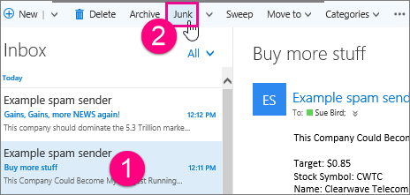

# Segnalare la posta indesiderata e i tentativi di phishing in Outlook sul WebReport junk email and phishing scams in Outlook on the web 

Può essere frustrante quando gli utenti dell'organizzazione ricevono messaggi di posta indesiderata o manca un messaggio di posta elettronica importante perché è stato erroneamente identificato come posta indesiderata.It can be frustrating when users in your organization receive junk email or miss an important email because it was misidentified as spam. La ottimizzazione dei filtri per la posta indesiderata di Exchange Online Protection (EOP) è sempre più accurata e gli utenti finali possono essere utili per questo processo. Gli utenti di Microsoft Outlook sul Web possono segnalare la posta indesiderata (posta indesiderata) e i tentativi di phishing utilizzando le opzioni di segnalazione della posta elettronica predefinite.We're constantly fine-tuning the Exchange Online Protection (EOP) spam filters to be more accurate, and you and your end users can help with this process; Microsoft Outlook on the web users can report junk (spam) and phishing scams by using built-in email reporting options. È inoltre possibile consentire a Microsoft di sapere se un messaggio di posta elettronica è stato erroneamente identificato come posta indesiderata.You can also let Microsoft know if an email was incorrectly identified as junk (spam).
  
## Invio di messaggi di posta indesiderata in Outlook sul WebSubmit junk messages in Outlook on the web

Per inviare un messaggio di posta indesiderata a Microsoft:To submit a junk mail message to Microsoft:
  
1. Fare clic sul messaggio indesiderato e quindi fare clic su **posta** indesiderata sulla barra degli strumenti.Click on the junk message and then click **Junk** on the toolbar. Questo sposta il messaggio nella cartella posta indesiderata e aggiunge il mittente all'elenco dei mittenti bloccati.This moves the message to your Junk email folder and adds the sender to your blocked sender list. 
    
  
    > [!NOTE]
    > In alternativa, fare clic con il pulsante destro del mouse su un messaggio per visualizzare un menu e scegliere **Contrassegna come posta**indesiderata.Alternatively, right-click a message to display a menu, and click **Mark as junk**. 
  
È possibile segnalare un messaggio di posta indesiderata dalla cartella **posta in arrivo**, **disordine**o **elementi eliminati** .You can report a junk message from your **Inbox**, **Clutter**, or **Deleted Items** folder. 
  
2. Si aprirà una finestra di dialogo che chiede all'utente se desidera inviare una copia del messaggio di posta indesiderata a Microsoft per l'analisi.A dialog box opens asking if you want to send a copy of the junk email message to Microsoft for analysis. Fare clic su **report** per inviare il messaggio al team di analisi di posta indesiderata Microsoft.Click **report** to send the message to the Microsoft Spam Analysis Team. In alternativa, selezionare la casella di controllo **Non visualizzare più questo messaggio** se si desidera inviare automaticamente a Microsoft messaggi di posta indesiderata futuri senza che venga prima chiesto.Optionally, select the **Don't show me this message again** check box if you want to automatically submit future junk messages to Microsoft without being prompted. 
    
  
    > [!TIP]
    > Anche se si seleziona la casella di controllo **non visualizzare più questo messaggio** , è possibile modificare le preferenze per la segnalazione della posta indesiderata tramite l'accesso alle impostazioni di visualizzazione in Outlook sul Web.Even if you select the **Don't show me this message again** check box, you can later change your preferences for reporting junk email by accessing the display settings in Outlook on the web. È possibile accedere a queste impostazioni tramite il menu ingranaggio accanto al nome di accesso.(You can access these settings through the gear menu next to your sign in name.) 
  
## Invio di messaggi di truffa di phishing in Outlook sul WebSubmit phishing scam messages in Outlook on the web

Per inviare un messaggio di truffa di phishing a Microsoft:To submit a phishing scam message to Microsoft:
  
1. Fare clic sul messaggio di truffa di phishing, fare clic sulla freccia in giù accanto a **posta**indesiderata, quindi fare clic su **phishing** sulla barra degli strumenti.Click on the phishing scam message, click the down arrow next to **Junk**, and then click **Phishing** on the toolbar. Office 365 non blocca il mittente perché i mittenti dei messaggi di truffa di phishing in genere impersonano i mittenti legittimi.Office 365 does not block the sender because senders of phishing scam messages typically impersonate legitimate senders. Se si preferisce, aggiungere il mittente all'elenco dei mittenti bloccati attenendosi alle istruzioni riportate nell'argomento [blocca o Consenti (impostazioni di posta indesiderata)](https://go.microsoft.com/fwlink/?LinkId=627572).If you prefer, add the sender to your blocked senders list by following the instructions in the topic [Block or allow (junk email settings)](https://go.microsoft.com/fwlink/?LinkId=627572). 
     In alternativa, fare clic con il pulsante destro del mouse su un messaggio per visualizzare un menu e scegliere **Contrassegna come phishing**.Alternatively, right-click a message to display a menu, and click **Mark as Phishing**. È possibile segnalare un messaggio di truffa di phishing dalla cartella **posta in arrivo**, **disordine**o **elementi eliminati** .You can report a phishing scam message from your **Inbox**, **Clutter**, or **Deleted Items** folder. 
  
2. Per alcune organizzazioni, viene visualizzata una finestra di dialogo in cui viene chiesto se si desidera inviare una copia del messaggio di posta elettronica di phishing a Microsoft per l'analisi.For some organizations, a dialog box opens asking if you want to send a copy of the phishing scam email to Microsoft for analysis. Fare clic su **report** per inviare il messaggio al team di analisi di posta indesiderata Microsoft.Click **report** to send the message to the Microsoft Spam Analysis Team. Questa opzione per la creazione di report è attualmente disponibile per un numero limitato di organizzazioni. potrebbe non essere richiesto di segnalare una truffa di phishing a Microsoft.This reporting option is currently available to a limited number of organizations; you might not be asked to report a phishing scam to Microsoft. 
    
## Invio di messaggi di posta indesiderata in Outlook sul WebSubmit "not junk" messages in Outlook on the web

Quando un messaggio viene identificato erroneamente come posta indesiderata da Office 365, inviare un messaggio come "non indesiderato" a Microsoft:When a message is incorrectly identified as junk by Office 365, submit a message as "not junk" to Microsoft:
  
1. Nella cartella posta indesiderata, fare clic sul messaggio e quindi fare clic su **non** indesiderata sulla barra degli strumenti.In your Junk email folder, click on the message and then click **Not Junk** on the toolbar. Questo consente di spostare il messaggio nella **posta in arrivo** e di aggiungere il mittente all'elenco dei mittenti attendibili.This moves the message to your **Inbox** and adds the sender to your safe senders list.  È inoltre possibile fare clic con il pulsante destro del mouse su un messaggio nella cartella posta indesiderata per visualizzare un menu e fare clic su **Segna come non**indesiderato.You can also right-click on a message in your Junk mail folder to display a menu and click **Mark as not junk**. 
  
2. Si aprirà una finestra di dialogo che chiede all'utente se desidera inviare una copia del messaggio di posta non indesiderata a Microsoft per l'analisi.A dialog box opens asking if you want to send a copy of the not junk email message to Microsoft for analysis. Fare clic su **report** per inviare il messaggio al team di analisi di posta indesiderata di Microsoft.Click **report** to send the message to the Microsoft Spam Analysis Team.. 
    
## Ulteriori informazioniFor more information

[Informazioni generali sulla posta indesiderata e sul phishingLearn about junk email and phishing](https://go.microsoft.com/fwlink/p/?LinkId=270068)

[Componente aggiuntivo per la segnalazione della posta indesiderata per Microsoft OutlookJunk email reporting add-in for Microsoft Outlook](https://docs.microsoft.com/en-us/office365/securitycompliance/junk-email-reporting-add-in-for-microsoft-outlook)
  
  

