# Panoramica dei criteri di conservazioneOverview of retention policies

Per la maggior parte delle organizzazioni, il volume e la complessità dei dati aumentano giorno dopo giorno, per via di posta elettronica, documenti, messaggi istantanei e altro ancora. La gestione o il controllo efficace di queste informazioni è importante perché è necessario:For most organizations, the volume and complexity of their data is increasing daily - email, documents, instant messages, and more. Effectively managing or governing this information is important because you need to:
  
- **Conformarsi in modo proattivo alle normative del settore e ai criteri interni** che richiedono di conservare il contenuto per un periodo di tempo minimo, ad esempio la norma Sarbanes-Oxley Act richiede che alcuni tipi di contenuto vengano conservati per sette anni.**Comply proactively with industry regulations and internal policies** that require you to retain content for a minimum period of time - for example, the Sarbanes-Oxley Act might require you to retain certain types of content for seven years. 
    
- **Ridurre i rischi in caso di controversie legali o di violazioni della sicurezza** eliminando definitivamente i contenuti obsoleti che non è più necessario mantenere.**Reduce your risk in the event of litigation or a security breach** by permanently deleting old content that you're no longer required to keep. 
    
- **Aiutare l'organizzazione a condividere le informazioni in modo efficace e a essere più flessibile** assicurando che gli utenti usino solo contenuti aggiornati e pertinenti.**Help your organization to share knowledge effectively and be more agile** by ensuring that your users work only with content that's current and relevant to them. 
    
I criteri di conservazione in Office 365 consentono di raggiungere tutti questi obiettivi. La gestione dei contenuti in genere richiede due azioni:A retention policy in Office 365 can help you achieve all of these goals. Managing content commonly requires two actions:
  
- **Conservare** il contenuto in modo che non possa essere eliminato definitivamente prima del termine del periodo di conservazione.**Retaining** content so that it can't be permanently deleted before the end of the retention period. 
    
- **Eliminare** il contenuto in modo permanente alla fine del periodo di conservazione.**Deleting** content permanently at the end of the retention period. 
    
Con i criteri di conservazione è possibile:With a retention policy, you can:
  
- Decidere proattivamente se conservare il contenuto, eliminarlo o entrambe le cose, ovvero conservarlo ed eliminarlo successivamente.Decide proactively whether to retain content, delete content, or both - retain and then delete the content.
    
- Applicare un singolo criterio all'intera organizzazione o solo a posizioni o utenti specifici.Apply a single policy to the entire organization or just specific locations or users.
    
- Applicare i criteri a tutti i contenuti o solo al contenuto che soddisfa determinate condizioni, ad esempio che contiene parole chiave specifiche o [tipi specifici di informazioni riservate](what-the-sensitive-information-types-look-for.md).Apply a policy to all content or just content meeting certain conditions, such as content containing specific keywords or [specific types of sensitive information](what-the-sensitive-information-types-look-for.md).
    
Quando si impostano criteri di conservazione per il contenuto, gli utenti possono continuare a modificare e usare il contenuto come sempre perché il contenuto viene mantenuto nella posizione originale. Se però qualcuno modifica o elimina il contenuto soggetto ai criteri, ne viene salvata una copia in una posizione sicura dove viene conservata finché restano in vigore i criteri.When content is subject to a retention policy, people can continue to edit and work with the content as if nothing's changed because the content is retained in place, in its original location. But if someone edits or deletes content that's subject to the policy, a copy is saved to a secure location where it's retained while the policy is in effect.
  
È infine possibile che alcune organizzazioni debbano conformarsi a normative come la regola 17a-4 della SEC (Securities and Exchange Commission), in base alla quale i criteri di conservazione attivati non possono essere disattivati o resi meno restrittivi. Per soddisfare questo requisito, è possibile usare la caratteristica Protezione dell'archiviazione. Dopo aver bloccato i criteri, nessuno, incluso l'amministratore, può disattivarli o renderli meno restrittivi.Finally, some organizations might need to comply with regulations such as Securities and Exchange Commission (SEC) Rule 17a-4, which requires that after a retention policy is turned on, it cannot be turned off or made less restrictive. To meet this requirement, you can use Preservation Lock. After a policy's been locked, no one—including the administrator—can turn off the policy or make it less restrictive.
  
I criteri di conservazione vengono creati e gestiti nella pagina **Conservazione** del Centro sicurezza e conformità di Office 365.You create and manage retention policies on the **Retention** page in the Office 365 Security &amp; Compliance Center. 
  
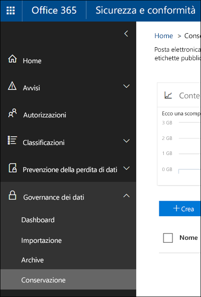
  
  
## Funzionamento dei criteri di conservazione con il contenuto presenteHow a retention policy works with content in place

Quando si include una posizione, ad esempio un sito o una cassetta postale, nei criteri di conservazione, il contenuto rimane nella posizione originale. Gli utenti possono continuare a lavorare normalmente con i propri documenti o messaggi di posta elettronica. Tuttavia, se modificano o eliminano il contenuto incluso nei criteri, viene conservata una copia del contenuto al momento dell'applicazione dei criteri.When you include a location such as a site or mailbox in a retention policy, the content remains in its original location. People can continue to work with their documents or mail as if nothing's changed. But if they edit or delete content that's included in the policy, a copy of the content as it existed when you applied the policy is retained.
  
Per le raccolte siti di SharePoint una copia del contenuto originale viene conservata nella raccolta di archiviazione quando gli utenti modificano o eliminano il contenuto. Per la posta elettronica e le cartelle pubbliche la copia viene conservata nella cartella Elementi ripristinabili. Queste posizioni sicure e il contenuto conservato non sono visibili alla maggior parte degli utenti. Con i criteri di conservazione non è neanche necessario che gli utenti sappiano che il contenuto è soggetto a criteri.For Sharepoint site collections, a copy of the original content is retained in the Preservation Hold library when users edit or delete it; for email and public folders, the copy is retained in the Recoverable Items folder. These secure locations and the retained content are not visible to most people. With a retention policy, people do not even need to know that their content is subject to the policy.
  
Note:Notes:
  
- Il contenuto Skype è archiviato in Exchange, dove i criteri sono applicati in base al tipo di messaggio (posta elettronica o conversazione).Skype content is stored in Exchange, where the policy is applied based on message type (email or conversation).
    
- I criteri di conservazione applicati a un gruppo di Office 365 includono sia la cassetta postale del gruppo che il sito.A retention policy applied to an Office 365 group includes both the group mailbox and site.
    
### Contenuto negli account di OneDrive e nei siti di SharePointContent in OneDrive accounts and SharePoint sites

I criteri di conservazione vengono applicati a livello di raccolta siti. Quando si include una raccolta siti di SharePoint o un account di OneDrive nei criteri di conservazione, viene creata una raccolta di archiviazione, se non ne esiste già una. È possibile visualizzare questa raccolta nella pagina **Contenuto del sito** del sito di primo livello della raccolta siti. La raccolta di archiviazione non è visibile a tutti gli utenti, ma solo agli amministratori della raccolta siti.A retention policy is applied at the level of a site collection. When you include a SharePoint site collection or OneDrive account in a retention policy, a Preservation Hold library will be created, if one doesn't already exist. You can view this library on the **Site contents** page in the top-level site of the site collection. Most users can't view the Preservation Hold library because it's visible only to site collection administrators.
  
Se un utente prova a modificare o eliminare il contenuto in un sito soggetto a criteri di conservazione, prima di tutto viene verificato se il contenuto è stato modificato dal momento dell'applicazione dei criteri. Se si tratta della prima modifica dall'applicazione dei criteri di conservazione, il contenuto viene copiato nella raccolta di archiviazione prima di consentire all'utente di modificare o eliminare il contenuto originale. Tutto il contenuto della raccolta siti può essere copiato nella raccolta di archiviazione, anche se non corrisponde alla query usata dai criteri di conservazione.If a person attempts to change or delete content in a site that's subject to a retention policy, first the policy checks whether the content's been changed since the policy was applied. If this is the first change since the policy was applied, the retention policy copies the content to the Preservation Hold library, and then allows the person to change or delete the original content. Note that any content in the site collection can be copied to the Preservation Hold library, even if the content does not match the query used by the retention policy.
  
Un processo timer pulisce quindi la raccolta di archiviazione. Questo processo viene eseguito periodicamente e confronta tutto il contenuto della raccolta di archiviazione con le query usate dai criteri di conservazione nel sito. A meno che il contenuto non corrisponda ad almeno una delle query, il processo timer elimina definitivamente il contenuto dalla raccolta di archiviazione.Then a timer job cleans up the Preservation Hold library. The timer job runs periodically and compares all content in the Preservation Hold library to all of the queries used by the retention policies on the site. Unless content matches at least one of the queries, the timer job permanently deletes the content from the Preservation Hold library.
  
Quanto descritto in precedenza vale per il contenuto esistente al momento dell'applicazione dei criteri di conservazione. Inoltre, tutto il nuovo contenuto creato o aggiunto alla raccolta siti dopo che è stato incluso nei criteri verrà conservato dopo l'eliminazione. Il nuovo contenuto non viene copiato nella raccolta di archiviazione alla prima modifica, ma solo quando viene eliminato. Per conservare tutte le versioni di un file, è necessario attivare il controllo delle versioni, come descritto nella sezione seguente.The previous applies to content that exists when the retention policy is applied. In addition, any new content that's created or added to the site collection after it was included in the policy will be retained after deletion. However, new content isn't copied to the Preservation Hold library the first time it's edited, only when it's deleted. To retain all versions of a file, you need to turn on versioning — see the below section on versioning.
  
Tenere presente che, se si prova a eliminare una raccolta, un elenco, una cartella o un sito soggetto a criteri di conservazione, viene visualizzato un messaggio di errore. Un utente può eliminare una cartella se prima di tutto sposta o elimina tutti i file presenti nella cartella soggetta ai criteri. Tenere presente anche che la raccolta di archiviazione viene creata solo quando è necessario creare il primo elemento nella raccolta e non quando si creano i criteri di conservazione. Per testare i criteri, è quindi necessario modificare o eliminare un documento in un sito soggetto ai criteri e quindi passare alla raccolta di archiviazione per visualizzare la copia conservata.Note that a user will receive an error if they try to delete a library, list, folder, or site that's subject to a retention policy. A user can delete a folder if they first move or delete any files in the folder that are subject to the policy. Also note that the Preservation Hold library is created only when the first item needs to be copied to the library - not when you create the retention policy. Therefore, to test your policy, you first need to edit or delete a document in a site subject to the policy, and then browse to the Preservation Hold library to view the retained copy.
  
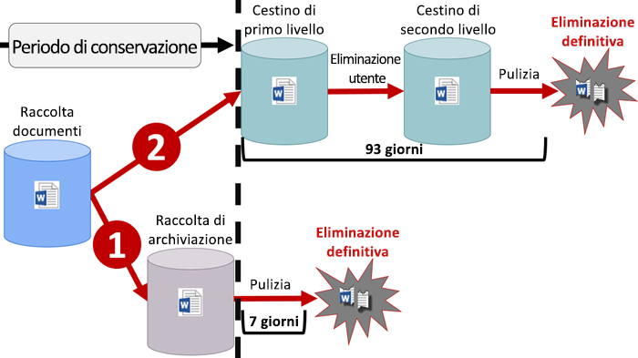
  
Dopo che i criteri di conservazione vengono assegnati a un account di OneDrive o a un sito di SharePoint, il contenuto può seguire uno dei due percorsi seguenti:After a retention policy is assigned to a OneDrive account or SharePoint site, content can follow one of two paths:
  
1. **Se il contenuto viene modificato o eliminato** durante il periodo di conservazione, una copia del contenuto originale al momento dell'assegnazione dei criteri di conservazione viene creata nella raccolta di archiviazione. In questa raccolta viene eseguito a intervalli regolari un processo timer che identifica i messaggi il cui periodo di conservazione è scaduto. Questi elementi vengono eliminati definitivamente entro sette giorni dalla data di fine del periodo di conservazione.**If the content is modified or deleted** during the retention period, a copy of the original content as it existed when the retention policy was assigned is created in the Preservation Hold library. There, a timer job runs periodically and identifies items whose retention period has expired, and these items are permanently deleted within seven days of the end of the retention period. 
    
2. **Se il contenuto non viene modificato o eliminato** durante il periodo di conservazione, viene spostato nel Cestino di primo livello alla fine del periodo di conservazione. Se un utente elimina il contenuto da questa posizione o svuota questo Cestino, il documento viene spostato nel Cestino di secondo livello. Il periodo di conservazione per i Cestini di primo e secondo livello è di 93 giorni, dopo i quali il documento viene eliminato definitivamente dal Cestino, sia di primo che di secondo livello. Il Cestino non è indicizzato, quindi la ricerca non rileva alcun contenuto al suo interno. Ciò significa che un blocco di eDiscovery non può rilevare contenuto da bloccare nel Cestino.**If the content is not modified or deleted** during the retention period, it's moved to the first-stage Recycle Bin at the end of the retention period. If a user deletes the content from there or empties this Recycle Bin (also known as purging), the document is moved to the second-stage Recycle Bin. A 93-day retention period spans both the first- and second-stage recycle bins. At the end of 93 days, the document is permanently deleted from wherever it resides, in either the first- or second-stage Recycle Bin. Note that the Recycle Bin is not indexed and therefore searches do not find content there. This means that an eDiscovery hold can't locate any content in the Recycle Bin in order to hold it. 
    
### Contenuto in cassette postali e cartelle pubblicheContent in mailboxes and public folders

Per la posta elettronica, il calendario e altri elementi di un utente, i criteri di conservazione vengono applicati a livello di cassetta postale. Per una cartella pubblica, i criteri di conservazione vengono applicati a livello di cartella e non di cassetta postale. Per conservare gli elementi sia di una cassetta postale che di una cartella pubblica viene utilizzata la cartella Elementi ripristinabili. Solo gli utenti a cui sono state assegnate autorizzazioni di eDiscovery possono visualizzare gli elementi nella cartella Elementi ripristinabili di un altro utente.For a user's mail, calendar, and other items, a retention policy is applied at the level of a mailbox. For a public folder, a retention policy is applied at the folder level, not the mailbox level. Both a mailbox and a public folder use the Recoverable Items folder to retain items. Only people whom have been assigned eDiscovery permissions can view items in another user's Recoverable Items folder.
  
Per impostazione predefinita, quando un utente elimina un messaggio in una cartella diversa dalla cartella Posta eliminata, il messaggio viene spostato nella cartella Posta eliminata. Quando un utente elimina un elemento dalla cartella Posta eliminata, il messaggio viene spostato nella cartella Elementi ripristinabili. Un utente può anche eliminare temporaneamente un elemento (MAIUSC+CANC) in qualsiasi cartella. Con questa operazione la cartella Posta eliminata viene ignorata e l'elemento viene inserito direttamente nella cartella Elementi ripristinabili.By default, when a person deletes a message in a folder other than the Deleted Items folder, the message is moved to the Deleted Items folder. When a person deletes an item in the Deleted Items folder, the message is moved to the Recoverable Items folder. In addition, a person can soft delete an item (SHIFT+DELETE) in any folder, which bypasses the Deleted Items folder and moves the item directly to the Recoverable Items folder.
  
Un processo verifica periodicamente gli elementi nella cartella Elementi ripristinabili. Se un elemento non corrisponde alle regole specificate in almeno un criterio di conservazione, viene eliminato definitivamente dalla cartella Elementi ripristinabili.A process periodically evaluates items in the Recoverable Items folder. If an item doesn't match the rules of at least one retention policy, the item is permanently deleted (also called hard deleted) from the Recoverable Items folder.
  
Quando un utente prova a modificare determinate proprietà di un elemento della cassetta postale, ad esempio, l'oggetto, il corpo, gli allegati, i mittenti, i destinatari o la data di invio o di ricezione di un messaggio, una copia dell'elemento originale viene salvata nella cartella Elementi ripristinabili prima che la modifica diventi effettiva. Questa procedura si applica anche alle modifiche successive. Al termine del periodo di conservazione, le copie presenti nella cartella Elementi ripristinabili vengono eliminate definitivamente.When a person attempts to change certain properties of a mailbox item — such as the subject, body, attachments, senders and recipients, or date sent or received for a message — a copy of the original item is saved to the Recoverable Items folder before the change is committed. This happens for each subsequent change. At the end of the retention period, copies in the Recoverable Items folder are permanently deleted.
  
Se un utente lascia l'organizzazione e la sua cassetta postale è inclusa nei criteri di conservazione, la cassetta postale diventa inattiva quando viene eliminato l'account di Office 365 dell'utente. Il contenuto di una cassetta postale inattiva è comunque soggetto ai criteri di conservazione applicati alla cassetta postale prima della sua disattivazione ed è disponibile per una ricerca eDiscovery. Per ulteriori informazioni, vedere [Cassette postali inattive in Exchange Online](https://go.microsoft.com/fwlink/?linkid=846909).If a user leaves your organization, and their mailbox is included in a retention policy, the mailbox becomes an inactive mailbox when the user's Office 365 account is deleted. The contents of an inactive mailbox are still subject to any retention policy that was placed on the mailbox before it was made inactive, and the contents are available to an eDiscovery search. For more information, see [Inactive mailboxes in Exchange Online](https://go.microsoft.com/fwlink/?linkid=846909).
  
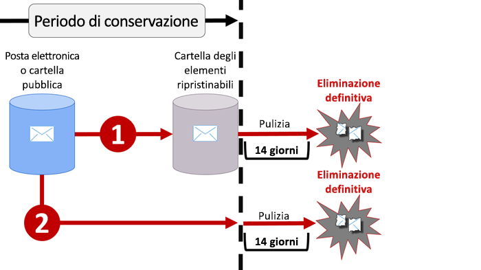
  
Dopo che i criteri di conservazione vengono assegnati a una cassetta postale o a una cartella pubblica, il contenuto può seguire uno dei due percorsi seguenti:After a retention policy is assigned to a mailbox or public folder, content can follow one of two paths:
  
1. **Se l'elemento viene modificato o eliminato** definitivamente dall'utente (con MAIUSC+CANC o eliminandolo da Posta eliminata) durante il periodo di conservazione, viene spostato (o copiato, in caso di modifica) nella cartella Elementi ripristinabili. In questa raccolta a intervalli regolari viene eseguito un processo che identifica i messaggi il cui periodo di conservazione è scaduto. Questi elementi vengono eliminati definitivamente entro 14 giorni dalla data di fine del periodo di conservazione. 14 giorni è l'impostazione predefinita, ma può essere configurato un valore fino a 30 giorni.**If the item is modified or permanently deleted** by the user (either SHIFT+DELETE or deleted from Deleted Items) during the retention period, the item is moved (or copied, in the case of edit) to the Recoverable Items folder. There, a process runs periodically and identifies items whose retention period has expired, and these items are permanently deleted within 14 days of the end of the retention period. Note that 14 days is the default setting, but it can be configured up to 30 days. 
    
2. **Se l'elemento non viene modificato o eliminato** durante il periodo di conservazione, lo stesso processo viene eseguito periodicamente in tutte le cartelle della cassetta postale e identifica i messaggi il cui periodo di conservazione è scaduto. Questi elementi vengono eliminati definitivamente entro 14 giorni dalla data di fine del periodo di conservazione. 14 giorni è l'impostazione predefinita, ma può essere configurato un valore fino a 30 giorni.**If the item is not modified or deleted** during the retention period, the same process runs periodically on all folders in the mailbox and identifies items whose retention period has expired, and these items are permanently deleted within 14 days of the end of the retention period. Note that 14 days is the default setting but it can be configured up to 30 days. 
    
## Funzionamento dei criteri di conservazione con le versioni del documento in una raccolta sitiHow a retention policy works with document versions in a site collection

Il controllo delle versioni è una funzionalità di tutte le raccolte documenti in SharePoint Online e OneDrive for Business. Per impostazione predefinita, il controllo delle versioni conserva almeno cinquecento versioni principali, sebbene sia possibile aumentare questo limite. Per ulteriori informazioni, vedere [Abilitare e configurare il controllo delle versioni per un elenco o una raccolta](https://support.office.com/article/1555d642-23ee-446a-990a-bcab618c7a37).Versioning is a feature of all document libraries in SharePoint Online and OneDrive for Business. By default, versioning retains a minimum of five hundred major versions, though you can increase this limit. For more information, see [Enable and configure versioning for a list or library](https://support.office.com/article/1555d642-23ee-446a-990a-bcab618c7a37).
  
I criteri di conservazione consentono di conservare tutte le versioni di un documento in una raccolta siti di SharePoint o in un account OneDrive. Ogni volta che un documento soggetto a criteri di conservazione viene modificato o eliminato, una versione viene copiata nella raccolta di archiviazione. Ogni versione di un documento nella raccolta di archiviazione esiste come elemento separato con il proprio periodo di conservazione:A retention policy retains all versions of a document in a SharePoint site collection or OneDrive account. Each time a document subject to a retention policy is edited or deleted, a version is copied to the Preservation Hold library. Each version of a document in the Preservation Hold library exists as a separate item with its own retention period:
  
- Se i criteri di conservazione si basano sulla data di creazione del contenuto, ciascuna versione ha la stessa data di scadenza del documento originale. Il documento originale e le sue versioni scadono tutti allo stesso tempo.If the retention policy is based on when the content was created, each version has the same expiration date as the original document. The original document and its versions all expire at the same time.
    
- Se i criteri di conservazione si basano sulla data dell'ultima modifica del contenuto, ciascuna versione ha la propria data di scadenza in base a quando il documento originale è stato modificato per creare quella versione. I documenti originali e le relative versioni scadono indipendentemente l'uno dall'altro.If the retention policy is based on when the content was last modified, each version has its own expiration date based on when the original document was modified to create that version. The original documents and its versions expire independently of each other.
    
## Conservazione del contenuto per un periodo di tempo specificoRetaining content for a specific period of time

Grazie ai criteri di conservazione è possibile conservare il contenuto per un periodo di tempo indefinito o per un numero specifico di giorni, mesi o anni. Il calcolo relativo al periodo di conservazione del contenuto è basato sulla data di modifica del contenuto e non sulla data di applicazione dei criteri di conservazione. È possibile scegliere se calcolare questo periodo a partire dalla creazione del contenuto o, per OneDrive e SharePoint, dalla data dell'ultima modifica.With a retention policy, you can retain content indefinitely or for a specific number of days, months, or years. Note that the duration for how long content is retained is calculated from the age of the content, not from when the retention policy is applied. You can choose whether the age is based on when the content was created or (for OneDrive and SharePoint) when it was last modified.
  
Se, ad esempio, si vuole conservare il contenuto di una raccolta siti per sette anni dall'ultima modifica e un documento presente in questa raccolta siti non è stato modificato per sei anni, il documento verrà conservato solo per un altro anno, se non viene modificato. Se il documento viene nuovamente modificato, il periodo di conservazione verrà ricalcolato in base alla nuova data di modifica e il documento verrà conservato per altri sette anni.For example, if you want to retain content in a site collection for seven years since it was last modified, and a document in that site collection hasn't been modified in six years, the document will be retained for only another year if it's not modified. If the document is edited again, the age of the document is calculated from the new last modified date, and it will be retained for another seven years.
  
Analogamente, se si desidera conservare il contenuto di una cassetta postale per sette anni e un messaggio è stato inviato sei anni fa, il messaggio verrà conservato solo per un altro anno. Per il contenuto di Exchange, il periodo si basa sempre sulla data di ricezione o di invio, che corrispondono. La conservazione del contenuto in base all'ultima modifica si applica solo al contenuto del sito di OneDrive e SharePoint.Similarly, if you want to retain content in a mailbox for seven years, and a message was sent six years ago, the message will be retained for only one year. For Exchange content, the age is always based on the date received or sent (they are the same). Retaining content based on when it was last modified applies only to site content in OneDrive and SharePoint.
  
È possibile scegliere se eliminare definitivamente il contenuto alla fine del periodo di conservazione. I criteri di conservazione possono anche eliminare semplicemente il vecchio contenuto senza conservarlo. Vedere la sezione successiva.You can choose whether you want the content to be permanently deleted at the end of the retention period. A retention policy can also simply delete old content without retaining it - see the next section.
  
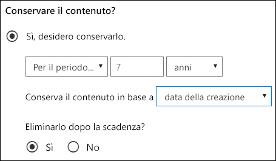
  
## Eliminazione di contenuto antecedente a una data specificaDeleting content that's older than a specific age

I criteri di conservazione possono conservare e quindi eliminare il contenuto successivamente o semplicemente eliminare il contenuto obsoleto senza conservarlo.A retention policy can both retain and then delete content, or simply delete old content without retaining it.
  
Se i criteri di conservazione eliminano il contenuto, è importante tenere presente che il periodo di tempo specificato per i criteri di conservazione viene calcolato dal momento in cui il contenuto è stato creato o modificato, non dal momento dell'assegnazione dei criteri.If your retention policy deletes content, it's important to understand that the time period specified for a retention policy is calculated from the time when the content was created or modified, not the time since the policy was assigned.
  
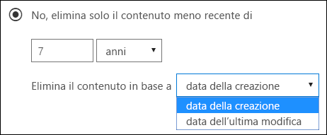
  
Ad esempio, si supponga di creare criteri di conservazione che eliminano il contenuto dopo tre anni e quindi di assegnarli a tutti gli account di OneDrive, che includono grandi quantità di contenuti creati quattro o cinque anni fa. In questo caso, molti contenuti verranno eliminati subito dopo la prima assegnazione dei criteri di conservazione. Per questo motivo, **i criteri di conservazione che eliminano il contenuto possono avere un impatto notevole**.For example, suppose that you create a retention policy that deletes content after three years, and then assign that policy to all OneDrive accounts, which contain a lot of content that was created four or five years ago. In this case, a lot of content will be deleted soon after assigning the retention policy for the first time. For this reason, **a retention policy that deletes content can have a considerable impact on your content**. 
  
Prima di assegnare criteri di conservazione a una raccolta siti per la prima volta, è quindi consigliabile considerare il tempo trascorso dalla creazione del contenuto esistente e l'impatto dei criteri sul contenuto. È anche opportuno comunicare l'introduzione dei nuovi criteri agli utenti prima di assegnarli, in modo che possano valutarne l'impatto. Questo avviso viene visualizzato quando si esaminano le impostazioni per i criteri di conservazione prima di crearli.Therefore, before you assign a retention policy to a site collection for the first time, you should first consider the age of the existing content and how the policy may impact that content. You may also want to communicate the new policy to your users before assigning it, to give them time to assess the possible impact. Note this warning that appears when you review the settings for your retention policy just before creating it.
  
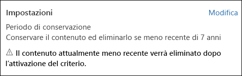
  
## Impostazioni avanzate che applicano i criteri solo a contenuti che soddisfano determinate condizioniAdvanced settings that apply a policy only to content that meets certain conditions

I criteri di conservazione possono essere applicati a tutto il contenuto nelle posizioni incluse oppure solo al contenuto che contiene parole chiave specifiche o [tipi specifici di informazioni riservate](what-the-sensitive-information-types-look-for.md).A retention policy can apply to all content in the locations that it includes, or you can choose to apply a retention policy only to content that contains specific keywords or [specific types of sensitive information](what-the-sensitive-information-types-look-for.md).
  
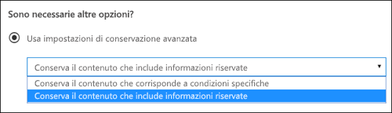
  
### Conservare il contenuto che include parole chiave specificheRetain content that contains specific keywords

È possibile applicare i criteri di conservazione solo al contenuto che soddisfa determinate condizioni e quindi eseguire azioni di conservazione solo su tale contenuto. Le condizioni disponibili ora supportano l'applicazione di criteri di conservazione al contenuto che include parole o frasi specifiche. È possibile perfezionare la query usando operatori di ricerca come AND, OR e NOT. Per ulteriori informazioni sugli operatori, vedere [Query con parole chiave e condizioni di ricerca per la ricerca di contenuto](keyword-queries-and-search-conditions.md).You can apply a retention policy only to content that satisfies certain conditions, and then take retention actions on just that content. The conditions available now support applying a retention policy to content that contains specific words or phrases. You can refine your query by using search operators like AND, OR, and NOT. For more information on these operators, see [Keyword queries and search conditions for Content Search](keyword-queries-and-search-conditions.md).
  
Il supporto delle proprietà disponibili per le ricerche (ad esempio, **subject:**) sarà disponibile a breve.Support for adding searchable properties (for example, **subject:**) is coming soon.
  
Si noti che i criteri di conservazione basati su query usano l'indice di ricerca per identificare il contenuto.Note that query-based retention uses the search index to identify content.
  
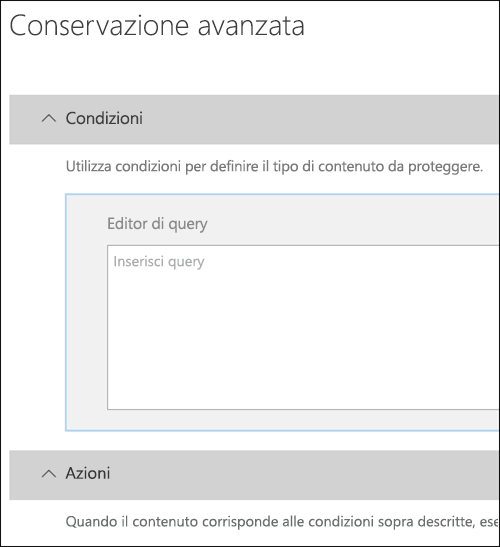
  
### Conservare il contenuto che include informazioni riservateRetain content that contains sensitive information

È possibile applicare i criteri di conservazione anche solo al contenuto che contiene [tipi specifici di informazioni riservate](what-the-sensitive-information-types-look-for.md). Ad esempio, è possibile scegliere di applicare requisiti di conservazione univoci solo al contenuto che contiene informazioni personali come codici identificativi dei singoli contribuenti, codici di previdenza sociale o numeri di passaporto.You can also apply a retention policy only to content that contains [specific types of sensitive information](what-the-sensitive-information-types-look-for.md). For example, you can choose to apply unique retention requirements only to content that contains personally identifiable information (PII) such as taxpayer identification numbers, social security numbers, or passport numbers.
  
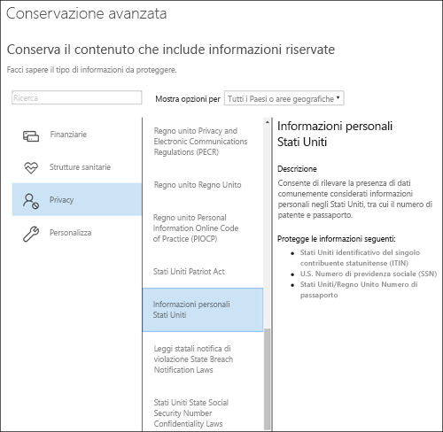
  
Note:Notes:
  
- I criteri di conservazione avanzati per le informazioni riservate non si applicano alle cartelle pubbliche di Exchange o a Skype for Business perché queste posizioni non supportano i tipi di informazioni riservate.Advanced retention for sensitive information doesn't apply to Exchange public folders or Skype for Business because those locations don't support sensitive information types.
    
- Exchange Online, infatti, usa le regole di trasporto per identificare le informazioni riservate, pertanto funziona solo per i messaggi in transito, non per tutti gli elementi già archiviati in una cassetta postale. Per Exchange Online, questo significa che i criteri di conservazione possono identificare le informazioni riservate e possono eseguire azioni di conservazione solo nei messaggi ricevuti **dopo** l'applicazione dei criteri alla cassetta postale. I criteri di conservazione basati su query descritti nella sezione precedente non hanno questa limitazione perché usano l'indice di ricerca per identificare il contenuto.You should understand that Exchange Online uses transport rules to identify sensitive information, so this works only on messages in transit — not on all items already stored in a mailbox. For Exchange Online, this means that a retention policy can identify sensitive information and take retention actions only on messages that are received **after** the policy is applied to the mailbox. (Note that query-based retention described in the previous section doesn't have this limitation because it uses the search index to identify content.) 
    
## Applicazione di criteri di conservazione a un'intera organizzazione o a posizioni specificheApplying a retention policy to an entire organization or specific locations

È possibile applicare facilmente i criteri di conservazione a un'intera organizzazione, a intere posizioni oppure a posizioni o utenti specifici.You can easily apply a retention policy to an entire organization, entire locations, or only to specific locations or users.
  
### Criteri a livello di organizzazioneOrg-wide policy

Una delle caratteristiche più efficaci dei criteri di conservazione riguarda la possibilità di applicare automaticamente i criteri alle posizioni in Office 365, tra cui:One of the most powerful features of a retention policy is that by default it applies to locations across Office 365, including:
  
- Posta elettronica di ExchangeExchange email
    
- Raccolte siti di SharePointSharePoint site collections
    
- Account di OneDriveOneDrive accounts
    
- Gruppi di Office 365 (si applica al contenuto della cassetta postale, del sito e dei documenti del gruppo). Il supporto per il contenuto in Planner, Yammer e CRM sarà disponibile a breve.Office 365 groups (applies to content in the group's mailbox, site, and documents. Support for content in Planner, Yammer, and CRM is coming soon.)
    
- Cartelle pubbliche di ExchangeExchange public folders
    
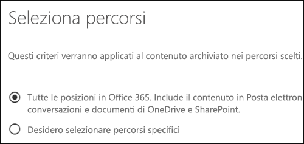
  
Altre caratteristiche importanti di un criterio di conservazione a livello di organizzazione includono:Other important features of an org-wide retention policy include:
  
- Non sono previsti limiti al numero di cassette postali o di siti inclusi nel criterio.There is no limit to the number of mailboxes or sites the policy can include.
    
- Per Exchange, le nuove cassette postali create dopo l'applicazione del criterio ereditano automaticamente il criterio.For Exchange, any new mailbox created after the policy is applied will automatically inherit the policy.
  
### Criteri validi per intere posizioniA policy that applies to entire locations

Quando si scelgono le posizioni, è possibile includere o escludere facilmente un'intera posizione, ad esempio la posta elettronica di Exchange o gli account di OneDrive. A questo scopo, è sufficiente attivare o disattivare lo **Stato** di tale posizione.When you choose locations, you can easily include or exclude an entire location, such as Exchange email or OneDrive accounts. To do so, simply toggle the **Status** of that location on or off. 
  
Come per i criteri a livello di organizzazione, un criterio applicabile a una qualsiasi combinazione di posizioni complete può includere un numero illimitato di cassette postali o siti. Ad esempio, se un criterio include tutta la posta elettronica di Exchange e tutti i siti di SharePoint, verranno inclusi tutti i siti e tutte le cassette postali, indipendentemente dal numero. Inoltre, per Exchange, le nuove cassette postali create dopo l'applicazione del criterio ereditano automaticamente il criterio.Like an org-wide policy, if a policy applies to any combination of entire locations, there is no limit to the number of mailboxes or sites the policy can include. For example, if a policy includes all Exchange email and all SharePoint sites, all sites and mailboxes will be included, no matter how many. And for Exchange, any new mailbox created after the policy is applied will automatically inherit the policy.
 
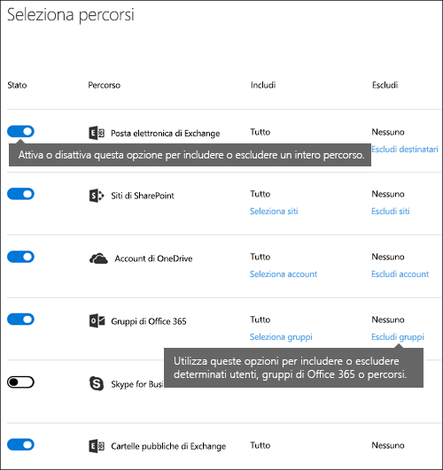
  
### Criteri con specifiche inclusioni o esclusioniA policy with specific inclusions or exclusions

È anche possibile applicare i criteri di conservazione a specifici utenti. A questo scopo, attivare lo **Stato** di tale posizione e quindi usare i collegamenti per includere o escludere determinati utenti, gruppi di Office 365 o posizioni.You can also apply a retention policy to specific users. To do so, toggle the **Status** of that location on, and then use the links to include or exclude specific users, Office 365 groups, or locations. 
  
Si noti però che sono previsti i limiti seguenti per i criteri di conservazione che includono o escludono più di 1.000 utenti specifici:However, note that the following limits exist for a retention policy that includes or excludes over 1,000 specific users:
  
- I criteri di conservazione di questo tipo non possono contenere più di 1.000 cassette postali e 100 raccolte siti.Such a retention policy can contain no more than 1,000 mailboxes and 100 site collections.
    
- Un tenant non può contenere più di 10.000 criteri di conservazione.A tenant can contain no more than 10,000 retention policies.
    
Anche se questi limiti esistono, è importante sapere che possono essere superati applicando criteri a livello di organizzazione o criteri validi per intere posizioni.Although these limits exist, understand that you can get over these limits by applying either an org-wide policy or a policy that applies to entire locations.
  
### Posizioni SkypeSkype locations

A differenza della posta elettronica di Exchange, non è possibile semplicemente attivare lo stato della posizione Skype per includere tutti gli utenti, ma è possibile attivare la posizione e quindi scegliere manualmente gli utenti di cui si desidera conservare le conversazioni.Unlike Exchange email, you can't simply toggle the status of the Skype location on to include all users, but you can turn on that location and then manually choose the users whose conversations you want to retain.
  
Quando si scelgono gli utenti di Skype for Business, è possibile includere rapidamente tutti gli utenti selezionando la casella **Nome** nell'intestazione di colonna. Tuttavia, è importante tenere presente che ogni utente viene conteggiato come una specifica inclusione nei criteri. Di conseguenza, se si includono più di 1.000 utenti, si applicano i limiti indicati nella sezione precedente. La selezione di tutti gli utenti di Skype da questa posizione non coincide con la procedura che prevede l'inclusione predefinita di tutti gli utenti di Skype con i criteri a livello di organizzazione.When you choose Skype for Business users, you can quickly include all users by selecting the **Name** box in the column header - however, it's important to understand that each user counts as a specific inclusion in the policy. Therefore, if you include over 1,000 users, the limits noted in the previous section apply. Selecting all Skype users here is not the same as if an org-wide policy were able to include all Skype users by default. 
  
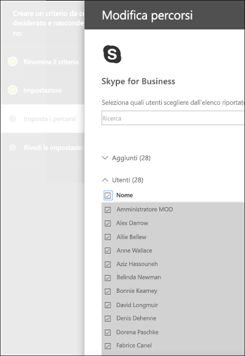
  
Si noti che**Cronologia conversazioni**, una cartella di Outlook, è una funzionalità che non ha nulla a che fare con l'archiviazione di Skype. **Cronologia conversazioni** può essere disattivata dall'utente finale, mentre l'archiviazione per Skype avviene memorizzando una copia delle conversazioni di Skype in una cartella nascosta che è inaccessibile all'utente, ma disponibile per eDiscovery.Note that **Conversation History**, a folder in Outlook, is a feature that has nothing to do with Skype archiving. **Conversation History** can be turned off by the end user, but archiving for Skype is done by storing a copy of Skype conversations in a hidden folder that is inaccessible to the user but available to eDiscovery. 
  
### Percorsi di TeamsTeams locations

È possibile usare i criteri di conservazione per conservare chat e messaggi del canale in Teams. Le chat di Teams vengono archiviate in una cartella nascosta della cassetta postale di ogni utente, incluso nella chat e i messaggi del canale di Teams vengono archiviati in un'analoga cartella nascosta della cassetta postale del gruppo per il team. Tuttavia, è importante sapere che Teams usa un servizio di chat con tecnologia Azure che archivia anche questi dati e che, per impostazione predefinita, questo servizio archivia i dati per sempre. Per questo motivo, è consigliabile usare il percorso di Teams per mantenere ed eliminare i dati di Teams. Con il percorso di Teams, i dati verranno eliminati definitivamente dalle cassette postali di Exchange e dal servizio di chat con tecnologia Azure sottostante. Per ulteriori informazioni, vedere [Panoramica di sicurezza e conformità in Microsoft Teams](https://go.microsoft.com/fwlink/?linkid=871258).You can use a retention policy to retain chats and channel messages in Teams. Teams chats are stored in a hidden folder in the mailbox of each user included in the chat, and Teams channel messages are stored in a similar hidden folder in the group mailbox for the team. However, it's important to understand that Teams uses an Azure-powered chat service that also stores this data, and by default this service stores the data forever. For this reason, we strongly recommend that you use the Teams location to retain and delete Teams data. Using the Teams location will permanently delete data from both the Exchange mailboxes and the underlying Azure-powered chat service. For more information, see [Overview of security and compliance in Microsoft Teams](https://go.microsoft.com/fwlink/?linkid=871258).
  
Le chat e i messaggi del canale di Teams non sono interessati dai criteri di conservazione applicati alle cassette postali di utenti o gruppi dei percorsi di Exchange o dei gruppi di Office 365. Anche se le chat e i messaggi del canale di Teams vengono archiviati in Exchange, sono interessati solo dai criteri di conservazione applicati al percorso di Teams.Note that Teams chats and channel messages are not affected by retention policies applied to user or group mailboxes in the Exchange or Office 365 groups locations. Even though Teams chats and channel messages are stored in Exchange, they're affected only by a retention policy that's applied to the Teams location.
  
Microsoft sta ancora lavorando sulla conservazione in Teams e renderà presto disponibili altre funzionalità. Nel frattempo, ecco alcune limitazioni da tenere presenti:We're still working on retention in Teams, and additional features are coming. In the meantime, here are a few limitations to be aware of:
  
- **Teams richiede criteri di conservazione distinti:** quando si creano i criteri di conservazione e si attiva il percorso di Teams, tutti gli altri percorsi vengono disattivati. I criteri di conservazione che includono Teams possono includere solo Teams e non altri percorsi.**Teams require a separate retention policy** When you create a retention policy and toggle on the Teams location, all other locations toggle off. A retention policy that includes Teams can include only Teams and no other locations. 
    
- **Teams non è incluso in un criterio a livello di organizzazione:** se si crea un criterio a livello di organizzazione, Teams non viene incluso perché richiede criteri di conservazione specifici.**Teams are not included in an org-wide policy** If you create an org-wide policy, Teams are not included because they require a separate retention policy. 
    
- **Teams non supporta la conservazione avanzata:** quando si creano i criteri di conservazione, se si scelgono le [impostazioni avanzate che applicano criteri solo a contenuti che soddisfano determinate condizioni](retention-policies.md#advanced), il percorso di Teams non è disponibile. Al momento, la conservazione in Teams si applica a tutto il contenuto di chat e messaggi del canale.**Teams doesn't support advanced retention** When you create a retention policy, if you choose the [Advanced settings that apply a policy only to content that meets certain conditions](retention-policies.md#advanced), the Teams location is not available. At this time, retention in Teams applies to all of the chat and channel message content.
    
- **Per essere eliminato, il contenuto di Teams deve risalire ad almeno 30 giorni:** al momento, non è supportata la creazione di un criterio per eliminare il contenuto di Teams che ha meno di 30 giorni. Per applicare questo criterio al contenuto di Teams, specificare un periodo di conservazione uguale o maggiore di 30 giorni.**Teams content must be at least 30 days old to be deleted** At this time, creating a policy to delete Teams content that's less than 30 days old is not supported. If you want this policy to apply to Teams content, specify a retention period that's equal to or greater than 30 days. 
    
- **Teams può richiedere fino a 30 giorni per la pulizia del contenuto conservato:** i criteri di conservazione applicati a Teams elimineranno il contenuto da tutti i percorsi di archiviazione pertinenti. Tuttavia, subito dopo il lancio, potrebbero servire fino a 30 giorni per pulire il contenuto nei client di Teams in base ai criteri di conservazione. Ciononostante, anche se viene ancora visualizzato nei client di Teams, il contenuto non sarà presente nelle ricerche o in eDiscovery al termine del periodo di conservazione.**Teams may take up to 30 days to clean up retained content** A retention policy applied to Teams will delete the content from all relevant storage locations. However, immediately after launch, it may take up to 30 days for Teams clients to clean up content based on the retention policy. But even though content still appears in the Teams clients, that content will not appear in content search or eDiscovery after the end of the retention period. 
    
In un team i file condivisi in chat vengono archiviati nell'account di OneDrive dell'utente che ha condiviso il file. I file caricati nei canali vengono archiviati nel sito di SharePoint del team. Di conseguenza, per conservare o eliminare i file in un team, è necessario creare un criterio di conservazione che si applica ai percorsi di SharePoint e OneDrive. Per applicare un criterio ai file di un solo team, è possibile scegliere il sito di SharePoint per il team e gli account di OneDrive per gli utenti del team.In a Team, files that are shared in chat are stored in the OneDrive account of the user who shared the file. Files that are uploaded into channels are stored in the SharePoint site for the Team. Therefore, to retain or delete files in a Team, you need to create a retention policy that applies to the SharePoint and OneDrive locations. If you want to apply a policy to the files of just a specific team, you can choose the SharePoint site for the Team and the OneDrive accounts of users in the Team.
  
I criteri di conservazione che si applicano a Teams possono usare la [protezione dell'archiviazione](retention-policies.md#locking).A retention policy that applies to Teams can use [Preservation Lock](retention-policies.md#locking).
  
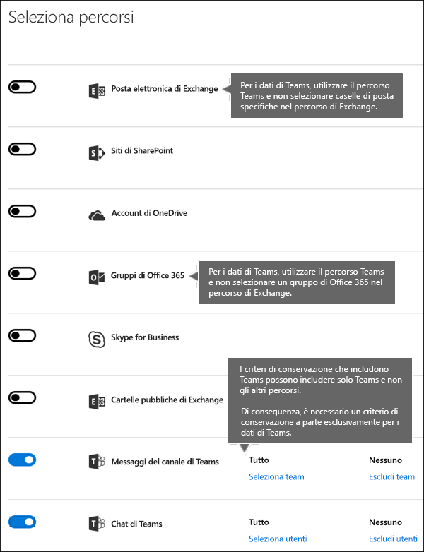
  
## Esclusione di specifici tipi di elementi di Exchange dai criteri di conservazioneExcluding specific types of Exchange items from a retention policy
È possibile usare PowerShell per escludere specifici tipi di elementi di Exchange dai criteri di conservazione. Ad esempio, è possibile escludere i messaggi vocali, le conversazioni di messaggistica istantanea e altri contenuti di Skype for Business Online nelle cassette postali. Si possono anche escludere elementi del calendario, note e attività. Questa funzionalità è disponibile solo tramite PowerShell, non è disponibile nell'interfaccia utente quando si crea un criterio di conservazione.By using PowerShell, you can exclude specific types of Exchange items from a retention policy. For example, you can exclude voicemail messages, IM conversations, and other Skype for Business Online content in mailboxes. You can also exclude calendar, note, and task items. This capability is available only by using PowerShell; it's not available in the UI when you create a retention policy.
  
A questo scopo, usare il parametro `ExcludedItemClasses` dei cmdlet `New-RetentionComplianceRule` e `Set-RetentionComplianceRule`. Per ulteriori informazioni su PowerShell, vedere la sezione [Trovare i cmdlet di PowerShell per i criteri di conservazione](#find-the-powershell-cmdlets-for-retention-policies) più avanti.To do this, use the  `ExcludedItemClasses` parameter of the  `New-RetentionComplianceRule` and  `Set-RetentionComplianceRule` cmdlets. For more information about PowerShell, see the below section [Find the PowerShell cmdlets for retention policies](#find-the-powershell-cmdlets-for-retention-policies).
  
## Blocco dei criteri di conservazioneLocking a retention policy
È possibile che alcune organizzazioni debbano attenersi ai regolamenti definiti da enti normativi, come il regolamento 17a-4 della SEC (Securities and Exchange Commission), in base al quale i criteri di conservazione attivati non possono essere disattivati o resi meno restrittivi. La funzionalità di protezione dell'archiviazione consente di bloccare i criteri in modo che nessuno, incluso l'amministratore, possa disattivarli o renderli meno restrittivi.Some organizations may need to comply with rules defined by regulatory bodies such as the Securities and Exchange Commission (SEC) Rule 17a-4, which requires that after a retention policy is turned on, it cannot be turned off or made less restrictive. With Preservation Lock, you can lock the policy so that no one — including the administrator — can turn off the policy or make it less restrictive.
  
Dopo il blocco dei criteri, nessuno può disattivarli, né rimuovere le posizioni dai criteri. Inoltre, non è possibile modificare o eliminare contenuti soggetti ai criteri durante il periodo di conservazione. Se i criteri sono stati bloccati, l'unico modo per modificarli è aggiungere posizioni oppure prolungarne la durata. I criteri bloccati possono essere aumentati o prolungati, ma non ridotti o disattivati.After a policy's been locked, no one can turn it off or remove locations from the policy. And it's not possible to modify or delete content that's subject to the policy during the retention period. After the policy's been locked, the only ways you can modify the retention policy are by adding locations to it or extending its duration. A locked policy can be increased or extended, but it can't be reduced or turned off.
  
Prima di bloccare i criteri di conservazione è quindi **essenziale** conoscere i requisiti di conformità dell'organizzazione e **non bloccare i criteri** a meno che non sia strettamente necessario.Therefore, before you lock a retention policy, it's **critical** that you understand your organization's compliance requirements, and that **you do not lock a policy** until you're certain that's what you need.

### Bloccare i criteri di conservazione con PowerShellLock a retention policy by using PowerShell
  
È possibile bloccare i criteri di conservazione solo con PowerShell.You can lock a retention policy only by using PowerShell.

Prima di tutto, [connettersi a PowerShell in Centro sicurezza e conformità di Office 365](http://go.microsoft.com/fwlink/p/?LinkID=799771).First, [connect to Office 365 Security & Compliance Center PowerShell](http://go.microsoft.com/fwlink/p/?LinkID=799771).

In secondo luogo, per visualizzare un elenco dei criteri di conservazione e trovare il nome dei criteri che si intende bloccare, eseguire `Get-RetentionCompliancePolicy`.Second, to view a list of your retention policies and find the name of the policy that you want to lock, run `Get-RetentionCompliancePolicy`.

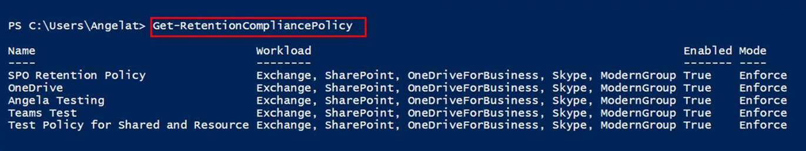

Infine, per applicare la protezione dell'archiviazione sui criteri di conservazione, eseguire `Set-RetentionCompliancePolicy` con il parametro `RestrictiveRetention` impostato su true, ad esempio:Third, to place a Preservation Lock on the retention policy, run `Set-RetentionCompliancePolicy` with the `RestrictiveRetention` parameter set to true -- for example:

`Set-RetentionCompliancePolicy -Identity “<Name of Policy>” – RestrictiveRetention $true`

Dopo aver eseguito questo cmdlet, viene visualizzata una richiesta di conferma. Scegliere **Sì a tutti**.After you run that cmdlet, you see a confirmation prompt. Choose **Yes to All**.

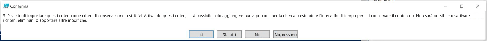

Sui criteri di conservazione è ora applicata la protezione dell'archiviazione. Se si esegue `Get-RetentionCompliancePolicy`, il parametro `RestrictiveRetention` è impostato su true, ad esempio:A Preservation Lock is now placed on the retention policy. If you run `Get-RetentionCompliancePolicy`, the `RestrictiveRetention` parameter is set to true -- for example:

`Get-RetentionCompliancePolicy -Identity “<Name of Policy>” |Fl`

  
## Precedenza nei principi di conservazioneThe principles of retention, or what takes precedence?

È possibile, o addirittura probabile, che al contenuto siano applicati più criteri di conservazione con azioni (conservare, eliminare o entrambi) e periodi di conservazione diversi. Quali sono i criteri che hanno la precedenza? Al livello più alto, un contenuto che viene conservato in base a un particolare criterio non può essere eliminato definitivamente da un altro criterio.It's possible or even likely that content might have several retention policies applied to it, each with a different action (retain, delete, or both) and retention period. What takes precedence? At the highest level, rest assured that content being retained by one policy can't be permanently deleted by another policy.
  

  
Per comprendere in che modo i diversi criteri di conservazione vengono applicati al contenuto, tenere presente questi principi di conservazione:To understand how different retention policies are applied to content, keep these principles of retention in mind:
  
1. **La conservazione prevale sull'eliminazione.** Si supponga di avere un criterio di conservazione che indica di eliminare la posta elettronica di Exchange dopo tre anni e un altro criterio di conservazione che indica di conservare la posta elettronica di Exchange per cinque anni e quindi eliminarla. Il contenuto che supera i tre anni verrà eliminato e nascosto agli utenti, ma comunque conservato nella cartella Elementi ripristinabili fino a raggiungere i cinque anni, quando verrà eliminato definitivamente.**Retention wins over deletion.** Suppose that one retention policy says to delete Exchange email after three years, but another retention policy says to retain Exchange email for five years and then delete it. Any content that reaches three years old will be deleted and hidden from the users' view, but still retained in the Recoverable Items folder until the content reaches five years old, when it will be permanently deleted. 
    
2. **Prevale il periodo di conservazione più lungo.** Se un contenuto è soggetto a più criteri di conservazione, verrà mantenuto fino al termine del periodo di conservazione più lungo.**The longest retention period wins.** If content's subject to multiple policies that retain content, it will be retained until the end of the longest retention period. 
    
3. **L'inclusione esplicita prevale sull'inclusione implicita.** Questo significa che:**Explicit inclusion wins over implicit inclusion.** This means: 
    
    1. Se un utente assegna manualmente un'etichetta con impostazioni di conservazione a un elemento, ad esempio un messaggio di posta elettronica di Exchange o un documento di OneDrive, l'etichetta ha la precedenza sui criteri assegnati a livello di sito o di cassetta postale e su un'etichetta predefinita assegnata tramite la raccolta documenti. Ad esempio, se l'etichetta esplicita indica un periodo di conservazione di dieci anni, ma i criteri assegnati dal sito indicano di conservare solo per cinque anni, l'etichetta ha la precedenza. Si noti che le etichette applicate automaticamente sono considerate implicite e non esplicite, perché vengono applicate automaticamente da Office 365.If a label with retention settings is manually assigned by a user to an item, such as an Exchange email or OneDrive document, that label takes precedence over both a policy assigned at the site or mailbox level and a default label assigned by the document library. For example, if the explicit label says to retain for ten years, but the policy assigned to the site says to retain for only five years, the label takes precedence. Note that auto-apply labels are considered implicit, not explicit, because they're applied automatically by Office 365.
    
    2. Se un criterio di conservazione include una posizione specifica, ad esempio la cassetta postale o l'account di OneDrive for Business di un particolare utente, il criterio ha la precedenza su un altro criterio di conservazione applicato alle cassette postali o agli account di OneDrive for Business di tutti gli utenti, ma che non include specificamente la cassetta postale di quell'utente.If a retention policy includes a specific location, such as a specific user's mailbox or OneDrive for Business account, that policy takes precedence over another retention policy that applies to all users' mailboxes or OneDrive for Business accounts but doesn't specifically include that user's mailbox.
    
4. **Prevale il periodo di eliminazione più breve.** Analogamente, se un contenuto è soggetto a più criteri di eliminazione (senza conservazione), verrà eliminato alla fine del periodo di conservazione più breve.**The shortest deletion period wins.** Similarly, if content's subject to multiple policies that delete content (with no retention), it will be deleted at the end of the shortest retention period. 
    
I principi di conservazione funzionano come un flusso di risoluzione di conflitti dall'alto verso il basso: se le regole applicate da tutti i criteri o le etichette sono le stesse in un determinato livello, il flusso si sposta verso il basso al livello successivo per determinare la priorità di applicazione di ogni regola.Understand that the principles of retention work as a tie-breaking flow from top to bottom: If the rules applied by all policies or labels are the same at one level, the flow moves down to the next level to determine precedence for which rule is applied.
  
Infine, un criterio o un'etichetta di conservazione non può eliminare definitivamente qualsiasi contenuto che si trovi in stato di blocco per eDiscovery. Quando il blocco viene rilasciato, il contenuto torna idoneo per il processo di pulizia descritto in precedenza.Finally, a retention policy or label cannot permanently delete any content that's on hold for eDiscovery. When the hold is released, the content again becomes eligible for the cleanup process described above.
  
## Usare i criteri di conservazione invece di queste caratteristicheUse a retention policy instead of these features

Un singolo criterio di conservazione può essere facilmente applicato a un'intera organizzazione e alle posizioni in Office 365, tra cui Exchange Online, SharePoint Online, OneDrive for Business e Gruppi di Office 365. Se si desidera conservare o eliminare il contenuto in una posizione qualsiasi di Office 365, è consigliabile usare i criteri di conservazione. È anche possibile usare le etichette con impostazioni di conservazione. Per ulteriori informazioni, vedere [Panoramica delle etichette](labels.md).A single retention policy can easily apply to an entire organization and locations across Office 365, including Exchange Online, SharePoint Online, OneDrive for Business, and Office 365 groups. If you need to retain or delete content anywhere in Office 365, we recommend that you use a retention policy. (You can also use labels with retention settings - for more information, see [Overview of labels](labels.md).)
  
Per conservare o eliminare il contenuto in Office 365 in passato sono state usate diverse altre caratteristiche, elencate di seguito, che continueranno a funzionare insieme ai criteri di conservazione e alle etichette creati nel Centro sicurezza e conformità. In futuro, tuttavia, per la governance dei dati si consiglia di usare i criteri di conservazione o le etichette invece di queste caratteristiche. I criteri di conservazione sono l'unica funzionalità che può sia conservare che eliminare il contenuto in Office 365.There are several other features that have previously been used to retain or delete content in Office 365. These are listed below. These features will continue to work side by side with retention policies and labels created in the Security &amp; Compliance Center. But moving forward, for data governance, we recommend that you use a retention policy or labels instead of all of these features. A retention policy is the only feature that can both retain and delete content across Office 365.
  
### Exchange OnlineExchange Online

- [Gestione di casi di eDiscovery nel Centro sicurezza e conformità di Office 365](https://support.office.com/article/edea80d6-20a7-40fb-b8c4-5e8c8395f6da) (blocco di eDiscovery)[Manage eDiscovery cases in the Office 365 Security &amp; Compliance Center](https://support.office.com/article/edea80d6-20a7-40fb-b8c4-5e8c8395f6da) (eDiscovery hold) 
    
- [Blocco sul posto e blocco per controversia legale](https://go.microsoft.com/fwlink/?linkid=846124) (blocco di eDiscovery)[In-Place Hold and Litigation Hold](https://go.microsoft.com/fwlink/?linkid=846124) (eDiscovery hold) 
    
- [Tag di conservazione e criteri di conservazione](https://go.microsoft.com/fwlink/?linkid=846125), noti anche come [gestione record di messaggistica](https://go.microsoft.com/fwlink/?linkid=846126) (solo eliminazione)[Retention tags and retention policies](https://go.microsoft.com/fwlink/?linkid=846125), also known as [messaging records management (MRM)](https://go.microsoft.com/fwlink/?linkid=846126) (Deletion only) 
    
### SharePoint Online e OneDrive for BusinessSharePoint Online and OneDrive for Business

- [Gestione di casi di eDiscovery nel Centro sicurezza e conformità di Office 365](https://support.office.com/article/edea80d6-20a7-40fb-b8c4-5e8c8395f6da) (blocco di eDiscovery)[Manage eDiscovery cases in the Office 365 Security &amp; Compliance Center](https://support.office.com/article/edea80d6-20a7-40fb-b8c4-5e8c8395f6da) (eDiscovery hold) 
    
- [Aggiunta di un contenuto a un caso e archiviare origini blocco nel centro eDiscovery](https://support.office.com/article/54d70de9-1ec2-4325-84f3-aeb588554479) (blocco di eDiscovery)[Add content to a case and place sources on hold in the eDiscovery Center](https://support.office.com/article/54d70de9-1ec2-4325-84f3-aeb588554479) (eDiscovery hold) 
    
- [Panoramica dei criteri di eliminazione dei documenti](https://support.office.com/article/55e8d858-f278-482b-a198-2e62d6a2e6e5) (solo eliminazione)[Overview of document deletion policies](https://support.office.com/article/55e8d858-f278-482b-a198-2e62d6a2e6e5) (Deletion only) 
    
- [Configurazione di gestione dei record sul posto](https://support.office.com/article/7707a878-780c-4be6-9cb0-9718ecde050a) (conservazione)[Configuring in place records management](https://support.office.com/article/7707a878-780c-4be6-9cb0-9718ecde050a) (Retention) 
    
- [Usare criteri per la chiusura e l'eliminazione di siti](https://support.office.com/article/a8280d82-27fd-48c5-9adf-8a5431208ba5) (solo eliminazione)[Use policies for site closure and deletion](https://support.office.com/article/a8280d82-27fd-48c5-9adf-8a5431208ba5) (Deletion only) 
    
- [Criteri per la gestione delle informazioni ](intro-to-info-mgmt-policies.md) (solo eliminazione)[Information management policies](intro-to-info-mgmt-policies.md) (Deletion only) 
    
Se in passato sono stati usati blocchi di eDiscovery per la governance dei dati, per garantire una conformità proattiva ora si devono usare invece i criteri di conservazione. È consigliabile usare un blocco creato nel Centro sicurezza e conformità solo per eDiscovery.Note that if you've previously used any of the eDiscovery holds for the purpose of data governance, you should instead use a retention policy for proactive compliance. You should use a hold created in the Security &amp; Compliance Center only for eDiscovery.
  
### I criteri di conservazione sostituiscono i criteri di gestione delle informazioniRetention policies override information management policies

Nei siti di SharePoint potrebbero essere usati [criteri di gestione delle informazioni](intro-to-info-mgmt-policies.md) per conservare il contenuto. Se si applicano criteri di conservazione creati nel Centro sicurezza e conformità a un sito che già usa criteri per il tipo di contenuto o criteri di gestione delle informazioni per un elenco o una raccolta, tali criteri vengono ignorati quando sono applicati i criteri di conservazione.In SharePoint sites, you may be using [information management policies](intro-to-info-mgmt-policies.md) to retain content. If you apply a retention policy created in the Security and Compliance Center to a site that already uses content type policies or information management policies for a list or library, those policies are ignored while the retention policy is in effect. 
  
## Modifiche apportate ai criteri di conservazioneWhat happened to preservation policies?

Se si usavano i precedenti criteri di conservazione, questi criteri ora vengono convertiti automaticamente nei nuovi criteri di conservazione che usano solo l'azione di conservazione. I criteri non eliminano il contenuto. I criteri di conservazione continueranno a funzionare e conservare il contenuto senza bisogno di interventi da parte dell'utente. Questi criteri sono disponibili nella pagina **Conservazione** del Centro sicurezza e conformità. È possibile modificare i criteri di conservazione per modificare il periodo di conservazione, ma non è possibile apportare altre modifiche, ad esempio l'aggiunta o la rimozione delle posizioni.If you were using a preservation policy, that policy has been automatically converted to a retention policy that uses only the retain action - the policy won't delete content. The preservation policy will continue to work and preserve your content without requiring any changes from you. You can find these policies on the **Retention** page in the Security &amp; Compliance Center. You can edit a preservation policy to change the retention period, but you can't make other changes, such as adding or removing locations. 
  
## AutorizzazioniPermissions

Ai membri del team di conformità che creeranno criteri di conservazione è necessario assegnare autorizzazioni per il Centro sicurezza e conformità. Per impostazione predefinita, l'amministratore del tenant avrà accesso a questa posizione e potrà fornire ai responsabili della conformità e ad altre persone l'accesso al Centro sicurezza e conformità, senza concedere tutte le autorizzazioni di un amministratore del tenant. A questo scopo, è consigliabile accedere alla pagina **Autorizzazioni** del Centro sicurezza e conformità, modificare il gruppo di ruoli **Amministratore conformità** e aggiungere membri a tale gruppo di ruoli.Members of your compliance team who will create retention policies need permissions to the Security &amp; Compliance Center. By default, your tenant admin will have access to this location and can give compliance officers and other people access to the Security &amp; Compliance Center, without giving them all of the permissions of a tenant admin. To do this, we recommend that you go to the **Permissions** page of the Security &amp; Compliance Center, edit the **Compliance Administrator** role group, and add members to that role group. 
  
Per ulteriori informazioni, vedere [Concedere agli utenti l'accesso al Centro sicurezza e conformità di Office 365](grant-access-to-the-security-and-compliance-center.md).For more information, see [Give users access to the Office 365 Security &amp; Compliance Center](grant-access-to-the-security-and-compliance-center.md).
  
Queste autorizzazioni sono necessarie solo per creare e applicare i criteri di conservazione. L'applicazione dei criteri non richiede l'accesso al contenuto.These permissions are required only to create and apply a retention policy. Policy enforcement does not require access to the content.
  
## Trovare i cmdlet di PowerShell per i criteri di conservazioneFind the PowerShell cmdlets for retention policies

Per usare i cmdlet dei criteri di conservazione, è necessario:To use the retention policy cmdlets, you need to:
  
1. [Connettersi al Centro sicurezza e conformità Office 365 utilizzando sessione remota di PowerShell](http://go.microsoft.com/fwlink/?LinkID=799771&amp;clcid=0x409).[Connect to the Office 365 Security &amp; Compliance Center using remote PowerShell](http://go.microsoft.com/fwlink/?LinkID=799771&amp;clcid=0x409)
    
2. Usare questi cmdlet del [Centro sicurezza e conformità di Office 365](http://go.microsoft.com/fwlink/?LinkID=799772&amp;clcid=0x409)Use these [Office 365 Security &amp; Compliance Center cmdlets](http://go.microsoft.com/fwlink/?LinkID=799772&amp;clcid=0x409)
    
## Ulteriori informazioniMore information

- [Panoramica delle etichetteOverview of labels](labels.md)
    

