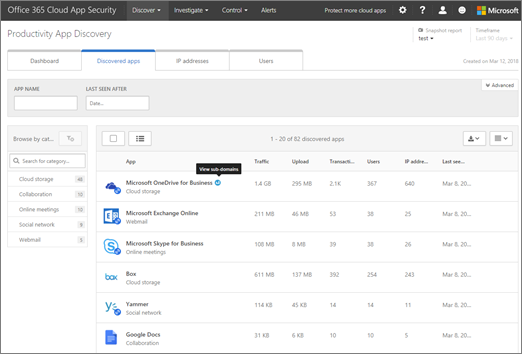

# Esaminare i risultati dell'individuazione di app in Office 365 Cloud App SecurityReview app discovery findings in Office 365 Cloud App Security
  
|Valutazione \* *\>*\*\*\*\*\*Evaluation\*\* \>\*\*|Planning \* *\>*\*\*\*\*\*Planning\*\* \>\*\*|Distribuzione \* *\>*\*\*\*\*\*Deployment\*\* \>\*\*|Utilizzo \* \* \* \*\*\*\*\*Utilization\*\*\*\*|
|:-----|:-----|:-----|:-----|
|[Iniziare a valutareStart evaluating](office-365-cas-overview.md)   |[Avviare la pianificazioneStart planning](get-ready-for-office-365-cas.md)   |[Avviare la distribuzioneStart deploying](turn-on-office-365-cas.md)   |Sei qui!You are here!    [Passaggi successiviNext steps](#next-steps)   |
   
Il dashboard di individuazione cloud è compatibile con i log del traffico web dell'organizzazione per fornire informazioni dettagliate sull'utilizzo delle app cloud.The Cloud Discovery dashboard works with your organization's web traffic logs to provide detailed information about cloud app usage. Se si è un amministratore globale, un amministratore della sicurezza o un lettore di sicurezza e l'organizzazione ha [creato rapporti di individuazione delle app in Office 365 cloud app Security](create-app-discovery-reports-in-ocas.md), è possibile utilizzare il dashboard di individuazione cloud per acquisire informazioni sul modo in cui le persone nella propria l'organizzazione utilizza Office 365 e altre app cloud.If you're a global administrator, security administrator, or security reader, and your organization has [created app discovery reports in Office 365 Cloud App Security](create-app-discovery-reports-in-ocas.md), you can use the Cloud Discovery dashboard to gain insight into how people in your organization are using Office 365 and other cloud apps. (Il dashboard di individuazione cloud è noto anche come individuazione delle app per la produttività).(The Cloud Discovery dashboard is also known as Productivity App Discovery.)
  
 Il dashboard di individuazione cloud consente di visualizzare informazioni dettagliate sul modo in cui gli utenti dell'organizzazione utilizzano Office 365 e altre app.The Cloud Discovery dashboard enables you to view detailed information about how people in your organization are using Office 365 and other apps. 
  

     
## Accedere al dashboard di individuazione cloudGo to the Cloud Discovery dashboard

1. Accedere al portale[https://portal.cloudappsecurity.com](https://portal.cloudappsecurity.com)di sicurezza delle app cloud e accedere.Go to the Cloud App Security portal ([https://portal.cloudappsecurity.com](https://portal.cloudappsecurity.com)) and sign in.
    
2. Andare a **Discover** \> **cloud Discovery dashboard**.Go to **Discover** \> **Cloud Discovery dashboard**.
    
## Visualizzare gli utenti principali, gli indirizzi IP, le app e i livelli di rischioSee your top users, IP addresses, apps, and risk levels

The Cloud Discovery dashboard offre una panoramica delle app che vengono utilizzate con Office 365 nell'organizzazione, eventuali avvisi aperti, utenti principali e livelli di rischio.The Cloud Discovery dashboard gives you an at-a-glance overview of apps that are used with Office 365 in your organization, any open alerts, top users, and risk levels.
  

  
1. Nella scheda **Dashboard** , esaminare l'utilizzo globale delle app Cloud nell'organizzazione nella sezione Panoramica nella parte superiore dello schermo.On the **Dashboard** tab, look at the overall cloud app use in your organization in the overview section across the top of the screen. 
    
2. Vedere le **categorie di Office 365** per le app che vengono utilizzate nell'organizzazione.See the **Office 365 categories** for apps that are used in your organization. 
    
3. Consultare il widget **Apps individuati** per visualizzare l'utilizzo di Office 365 e di altre app in questa visualizzazione.Look at the **Discovered apps** widget to see usage of Office 365 and other apps in this view. 
    
4. Esaminare gli **utenti principali** e il widget **indirizzi IP principali** per identificare coloro che utilizzano le app di Office 365 e cloud più all'interno dell'organizzazione.Look at the **Top users** and **Top IP addresses** widget to identify those who use Office 365 and cloud apps the most in your organization. 
    
5. Vedere dove le app persone stanno usando sono per località geografica usando la mappa del **percorso delle app** .See where the apps people are using are by geographical location by using the **Apps headquarters location** map. 
    
6. Sopra l'area mappe, esaminare il Punteggio di rischio delle app individuate nella panoramica dei **livelli di rischio** .Above the maps area, take a look at the risk score of the discovered apps in the **Risk levels** overview. È possibile esaminare i rischi per gli stessi gruppi e le stesse categorie utilizzati nell'area **app scoperte** .You can look at risks by the same groups and categories that you used in the **Discovered apps** area. Ad esempio, è possibile visualizzare la quantità di traffico in ogni raggruppamento proveniente da applicazioni di alto, medio o basso rischio.For example, you can see how much traffic in each grouping is from high, medium, or low risk apps. 
    
## Immergersi più in profondità nelle informazioniDive deeper into the information

È possibile utilizzare il cloud Discovery per approfondire le app, i sottodomini, gli indirizzi IP e gli utenti.You can use Cloud Discovery to take a deeper look at apps, subdomains, IP addresses, and users.
  
1. Nel dashboard individuazione cloud, scegliere la scheda **app individuate** .In the Cloud Discovery dashboard, choose the **Discovered apps** tab. 
    
2. Utilizzare la sezione filtri per visualizzare le app in base al nome, alla categoria, al livello di utilizzo o alla data dell'ultima visualizzazione.Use the filters section to view apps by name, category, usage level, or last seen date.
    
3. Nell'elenco dei risultati, posizionare il puntatore del mouse su un nome di app per rivelare il collegamento **Visualizza** i sottodomini.In the list of results, hover by an app name to reveal the **View sub-domains** link.   Verranno visualizzate informazioni dettagliate sull'app selezionata.Detailed information about the selected app will appear.
    
4. Per visualizzare i dettagli sugli indirizzi IP, scegliere la scheda **indirizzi IP** .To view details about IP addresses, choose the **IP addresses** tab.  Nell'elenco dei risultati, selezionare un singolo indirizzo IP per visualizzare informazioni più dettagliate.In the list of results, select an individual IP address to view more detailed information.
    
5. Per visualizzare i dettagli relativi agli utenti di Office 365 all'interno dell'organizzazione, scegliere la scheda **utenti** .To view details about Office 365 users within your organization, choose the **Users** tab. 
  
## Escludi entitàExclude entities

È possibile escludere alcuni utenti di sistema o indirizzi IP per concentrarsi su informazioni più specifiche.You can exclude certain system users or IP addresses in order to focus on more specific information.
  
1. Scegliere Settings **cloud Discovery Settings**. \*\*\*\* \>Choose **Settings** \> **Cloud Discovery settings**.
    
2. Scegliere **Escludi entità**.Choose **Exclude entities**.
    
3. Scegliere **gli utenti esclusi** o **gli indirizzi IP esclusi**.Choose either **Excluded users** or **Excluded IP addresses**.
    
4. Specificare gli utenti o gli indirizzi IP e, nella casella **Commenti** , digitare le informazioni sui motivi per cui si escludono gli utenti o gli indirizzi IP.Specify the users or IP addresses, and in the **Comments** box, type information about why you are excluding those users or IP addresses. 
    
5. Scegliere **Aggiungi**.Choose **Add**.
    
## Passaggi successiviNext steps

- [Esaminare e intervenire sugli avvisiReview and take action on alerts](review-office-365-cas-alerts.md)
    
- [Creare report di individuazione delle appCreate app discovery reports](create-app-discovery-reports-in-ocas.md)
    
- Esaminare le [attività di utilizzo per Office 365 cloud app Security](utilization-activities-for-ocas.md)Review your [utilization activities for Office 365 Cloud App Security](utilization-activities-for-ocas.md)
    

