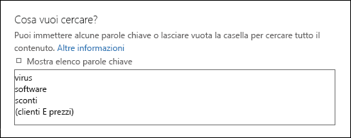
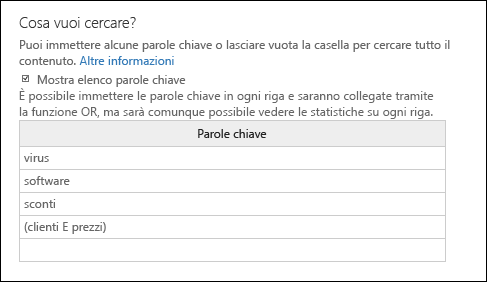
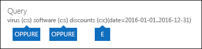

# <a name="run-a-content-search-in-the-office-365-security-amp-compliance-center"></a>Eseguire una ricerca di contenuto in Office 365 protezione &amp; centro conformità

È possibile utilizzare lo strumento di eDiscovery di ricerca del contenuto in Office 365 Security &amp; centro conformità per cercare gli elementi, ad esempio posta elettronica, documenti e nella propria organizzazione Office 365 conversazioni di messaggistica immediata. Utilizzare questo strumento per la ricerca per gli elementi di questi servizi di Office 365:
  
- Cassette postali di Exchange Online e le cartelle pubbliche
    
- SharePoint Online e OneDrive per i siti
    
- Skype per le conversazioni aziendali
    
- Microsoft Teams 
    
- Gruppi di Office 365
    
Ricerca del contenuto è un nuovo strumento ricerca eDiscovery le nuove e migliorate funzionalità di scalabilità e prestazioni. Utilizzare la ricerca del contenuto per eseguire ricerche eDiscovery molto grande. È possibile cercare tutte le cassette postali, tutte le cartelle pubbliche di Exchange e tutti i siti di SharePoint Online e OneDrive per gli account di Business in una singola ricerca contenuto. Non esistono limiti sul numero di posizioni contenute che è possibile eseguire la ricerca. Non vi sono inoltre alcun limite al numero di ricerche che è possibile eseguire contemporaneamente. Dopo l'esecuzione di una ricerca di contenuto, il numero di percorsi di contenuti e un numero stimato di risultati della ricerca viene visualizzato nel riquadro dei dettagli della pagina di **ricerca del contenuto** . Dopo l'esecuzione di una ricerca è possibile visualizzare in anteprima i risultati, ottenere statistiche sulle parole chiave per uno o più ricerche, modifica in blocco ricerche di contenuto ed esportare i risultati in un computer locale. 
  
 **Sommario**
  
[Creazione di una ricerca](run-a-content-search-in-the-security-and-compliance-center.md#create)
  
[Esportare i risultati della ricerca](run-a-content-search-in-the-security-and-compliance-center.md#export)
  
[Anteprima dei risultati della ricerca](run-a-content-search-in-the-security-and-compliance-center.md#preview)
  
[Aggiornare i risultati della ricerca](run-a-content-search-in-the-security-and-compliance-center.md#restart)
  
[Modificare una ricerca](run-a-content-search-in-the-security-and-compliance-center.md#edit)
  
[Riprovare la ricerca](run-a-content-search-in-the-security-and-compliance-center.md#retry)
  

  
## <a name="before-you-begin"></a>Informazioni preliminari

- Per informazioni e istruzioni sulla creazione query di ricerca e utilizzo di operatori booleani ricerca, vedere [query con parole chiave e condizioni di ricerca per la ricerca del contenuto](keyword-queries-and-search-conditions.md). In questo articolo contiene inoltre informazioni sulla ricerca per tipi di informazioni riservate e la ricerca per il contenuto condiviso con persone interne o esterne all'organizzazione.
    
- Per accedere alla pagina **ricerca contenuto** per eseguire ricerche e preview ed esportare i risultati della ricerca, un amministratore, responsabile della conformità o manager eDiscovery deve essere un membro del gruppo di ruoli gestione eDiscovery in sicurezza &amp; conformità Al centro. Non è necessario assegnare le autorizzazioni di ricerca aggiuntivi in Exchange in linea, SharePoint Online o per OneDrive per i siti. Per ulteriori informazioni, vedere [assegnare autorizzazioni di eDiscovery in Office 365 Security &amp; centro conformità](assign-ediscovery-permissions.md).
    
- Non esistono limiti applicati alla ricerca di contenuto per garantire l'integrità e la qualità dei servizi forniti per organizzazioni di Office 365. Nella maggior parte dei casi, è possibile modificare questi limiti, ma è necessario tenere conto di essi in modo che è possibile eseguire questi limiti in considerazione durante la pianificazione, l'esecuzione e la risoluzione dei problemi di ricerche. Per ulteriori informazioni, vedere [limiti per la ricerca in Office 365 Security &amp; centro conformità](limits-for-content-search.md).
    
- Per gli orari di ricerca stimati in base al numero di cassette postali che viene eseguita la ricerca in una singola ricerca contenuto, vedere la sezione. 
    
- Come descritto in precedenza, è possibile utilizzare ricerca il contenuto di ricerca del contenuto in gruppi di Office 365 e Microsoft Teams. Di conseguenza, che è possibile cercare la cassetta postale di gruppo, del calendario condivise e siti di SharePoint associati a un gruppo di Office 365 e un Team di Microsoft. Inoltre, è possibile cercare le conversazioni del canale in un Team di Microsoft. Per informazioni sui gruppi di Office 365 e Teams Microsoft, vedere:
    
  - [Informazioni sui gruppi di Office 365](https://support.office.com/article/b565caa1-5c40-40ef-9915-60fdb2d97fa2)
    
  - [Guida di Microsoft Teams](https://support.office.com/article/23156c0c-2c6e-49dd-8b7b-7c564b76508c)
    
    Per vedere la sezione suggerimenti per la ricerca di contenuto in gruppi di Office 365 e Microsoft Teams. 
    
[Inizio pagina](run-a-content-search-in-the-security-and-compliance-center.md#top)
  
## <a name="create-a-search"></a>Creazione di una ricerca
<a name="create"> </a>

1. Accedere a [https://protection.office.com](https://protection.office.com).
    
2. Accedere a Office 365 utilizzando l'account di lavoro o della scuola.
    
3. Nel riquadro a sinistra del Centro sicurezza e conformità, fare clic su **Ricerca e analisi** \> **Ricerca contenuto**.
    
4. Fare clic su **Nuovo**.
    
5. Nella pagina **Nuova ricerca**, digitare un nome relativo alla ricerca contenuto. Questo nome deve essere univoco nell'organizzazione. 
    
6. Scegliere i percorsi di contenuti che si desidera eseguire la ricerca. È possibile cercare cassette postali, i siti e le cartelle pubbliche nella ricerca stessa.
    
    
  
1. **Ricerca ovunque** Selezionare questa opzione per cercare tutti i percorsi di contenuti nell'organizzazione. Quando si seleziona questa opzione, è possibile scegliere di ricerca tutte le cassette postali, inclusi cassette postali inattive e le cassette postali per tutti i gruppi di Office 365 e Microsoft Teams, tutti i OneDrive per i siti e SharePoint (che include i siti per tutti i gruppi di Office 365 e Team di Microsoft) e tutte le cartelle pubbliche.
    
    
  
2. **Selezione di posizione personalizzata** Selezionare questa opzione per selezionare le cassette postali e i siti che si desidera eseguire la ricerca. Se si sceglie questa opzione, è necessario flessibilità per cercare tutti i percorsi di contenuti per un servizio specifico (ad esempio ricerca tutte le cassette postali di Exchange) oppure è possibile cercare i percorsi di contenuti specifici per un servizio di Office 365.
    
    Quando si aggiungono percorsi di contenuti per la ricerca, tenere presente quanto segue:
    
    **Cassette postali**
    
  - Quando si fa clic su **Aggiungi** per specificare le cassette postali per la ricerca, la selezione delle cassette postali che viene visualizzata sia vuota. Questo è per impostazione predefinita per migliorare le prestazioni. Per aggiungere i destinatari a questo elenco, digitare un nome (almeno 3 caratteri) nella casella Cerca e fare clic su **Cerca**.
    
  - È possibile aggiungere all'elenco delle cassette postali per la ricerca delle cassette postali inattive e i gruppi di distribuzione. Per i gruppi di distribuzione, le cassette postali dei membri del gruppo vengono eseguita la ricerca. Si noti che non sono supportati i gruppi di distribuzione dinamico.
    
  - Per ottenere un elenco delle cassette postali inattive all'interno dell'organizzazione, eseguire il comando `Get-Mailbox -InactiveMailboxOnly` in Exchange Online PowerShell. In alternativa, è possibile passare alla **governance dati** \> **conservazione** in sicurezza &amp; centro conformità e quindi fare clic su **ulteriori** \> **delle cassette postali inattive**.
    
  - È inoltre possibile aggiungere la cassetta postale associata a un Team di Microsoft o un gruppo di Office 365. In questo caso, viene eseguita la ricerca solo la cassetta postale gruppo o un team; non vengono effettuate le cassette postali dei membri gruppo o un team. Per effettuare la ricerca, è necessario aggiungerli in modo specifico per la ricerca.
    
  - Se non si desidera includere tutte le cassette postali per la ricerca, selezionare **scegliere cassette postali specifiche per la ricerca**, ma non una cassetta postale aggiungere all'elenco.
    
    **Siti**
    
  - Fare clic su **Aggiungi** per aggiungere siti per la ricerca. Digitare l'URL per ogni sito che si desidera eseguire la ricerca. Lo strumento di ricerca del contenuto verrà convalidare l'URL e quindi aggiungerlo all'elenco dei siti per la ricerca. 
    
  - È possibile aggiungere SharePoint associata a un Team di Microsoft o un gruppo di Office 365. Vedere la sezione per informazioni su come trovare l'URL di gruppo o un team. 
    
  - Se non si desidera includere tutti i siti in una ricerca, selezionare **Scegliere siti specifici per la ricerca**, ma non aggiungere un sito all'elenco.
    
    **Cartelle pubbliche**
    
    Per le cartelle pubbliche, è possibile scegliere di ricerca tutte le cartelle pubbliche nell'organizzazione Exchange Online o non cercare le cartelle pubbliche.
    
7. Fare clic su **Avanti**.
    
8. Nella pagina **Nuova ricerca**, è possibile aggiungere parole chiave e condizioni per creare la query di ricerca. 
    
    
  
1. Nella casella in **scegliere un'opzione di cercare?**, digitare una query di ricerca nella casella. È possibile specificare le parole chiave, messaggio proprietà come inviati e ricevuti, date o proprietà del documento, ad esempio i nomi di file o la data dell'ultima modifica di un documento. È possibile utilizzare una query più complesse che utilizzano un operatore booleano, ad esempio **AND**, **o**, **non**, **NEAR**o **ONEAR**. È inoltre possibile cercare informazioni sensibili (ad esempio numeri di previdenza sociale) nei documenti o ricerca per i documenti condivisi esternamente. Se si lascia vuota la casella parole chiave, tutto il contenuto disponibile nei percorsi di contenuto specificati sarà incluse nei risultati della ricerca. 
    
2. È possibile selezionare la casella di controllo **Mostra elenco di parole chiave** e il tipo di una parola chiave in ogni riga. In questo caso, le parole chiave in ogni riga sono connessi tramite l'operatore **OR** nella query di ricerca che viene creata. 
    
    
  
    Perché utilizzare l'elenco delle parole chiave? È possibile ottenere le statistiche che mostra il numero di elementi corrispondenti a ogni parola chiave. Ciò consente di identificare rapidamente i quali le parole chiave sono il massimo (e almeno) efficaci. È inoltre possibile utilizzare una frase parola chiave (racchiusa tra parentesi) in una riga. Per ulteriori informazioni sulle statistiche di ricerca, vedere [visualizzare le statistiche delle parole chiave per i risultati di ricerca del contenuto](view-keyword-statistics-for-content-search.md).
    
    Vedere la sezione per istruzioni su come utilizzare l'elenco parola chiave. 
    
3. Fare clic su **query per gli errori di battitura di controllo** per verificare la query per i caratteri non supportati e per gli operatori booleani che potrebbero non essere in maiuscolo. Caratteri non supportati sono spesso nascoste in genere causano un errore di ricerca o restituiscano risultati imprevisti. Per ulteriori informazioni sui caratteri non supportati che vengono controllati, vedere [verificare la query di ricerca del contenuto per gli errori](check-your-content-search-query-for-errors.md).
    
4. In **condizioni**, aggiungere le condizioni per una query di ricerca per restringere la ricerca e restituire un set di risultati più dettagliato. Ogni condizione aggiunge una clausola di query di ricerca KQL che viene creata ed eseguita quando si avvia la ricerca. Una condizione è connesso logicamente per le query con parole chiave (specificata nella casella parole chiave) dall'operatore di telefonia **e** . Ciò significa che gli elementi devono soddisfare entrambe le query con parole chiave e la condizione da includere nei risultati della. Si tratta come condizioni consentono di limitare i risultati. 
    
||
|:-----|
|Per ulteriori informazioni sulla creazione di una query di ricerca e utilizzo delle condizioni, vedere [query con parole chiave e le condizioni di ricerca per la ricerca del contenuto ](keyword-queries-and-search-conditions.md). |
   
9. Fare clic su **Ricerca** per salvare le impostazioni e avviare la ricerca. 
    
    La ricerca viene avviata. Al termine della ricerca, le informazioni seguenti viene visualizzate nel riquadro dei dettagli.
    
    
  
1. Data e ora dell'ultima esecuzione della ricerca.
    
2. Il numero e dimensioni totali degli elementi che sono state trovate che corrisponde alla query di ricerca. Ad esempio tipi di elementi di messaggi di posta elettronica, gli elementi del calendario e documenti. Se un elemento contiene più istanze di una parola chiave che viene ricercato, si è conteggiato una sola volta nel numero totale di elementi. Ad esempio, se si esegue la ricerca per le parole "stock" o "suggerimento" e un messaggio di posta elettronica include tre occorrenze della parola "stock", si è conteggiato una sola volta nel campo di **elementi** . 
    
3. Il numero e dimensione totale di elementi indicizzati nei percorsi di contenuti che sono stati eseguita la ricerca. Il numero di elementi indicizzati che non soddisfano i criteri di ricerca includerà le statistiche ricerca visualizzate nel riquadro dei dettagli. Se corrisponde a un elemento non indicizzate eseguire una query di ricerca (perché altre proprietà di un documento o messaggio soddisfa i criteri di ricerca), non sarà incluso il numero stimato di elementi indicizzati. Un elemento non indicizzato viene escluso per i criteri di ricerca, tuttavia, non incluso nella stima di elementi indicizzati.
    
4. Il numero di ogni tipo di percorso contenuto che è stata eseguita la ricerca. Per le cassette postali, si noti che cassette postali di archiviazione sono inclusi nel numero totale di cassette postali in cui sono stati una ricerca. Nell'esempio precedente, quattro cassette postali degli utenti sono stati eseguita la ricerca e la cassetta postale di archiviazione per ognuno di questi utenti è abilitata. Per tale motivo otto cassette postali sono indicate nelle statistiche di ricerca.
    
5. Collegamenti a visualizzare un'anteprima della ricerca dei risultati o eseguire la ricerca per aggiornare le statistiche di ricerca.
    
    Se necessario, fare clic su **Aggiorna** per aggiornare le informazioni nel riquadro dei dettagli per la ricerca selezionata. 
    
[Inizio pagina](run-a-content-search-in-the-security-and-compliance-center.md#top)
  
## <a name="export-search-results"></a>Esportare i risultati della ricerca
<a name="export"> </a>

Dopo l'esecuzione di una ricerca, è possibile esportare i risultati della ricerca in un computer locale. Quando si esportano i risultati di posta elettronica, viene scaricati al computer come file PST. Quando si esporta il contenuto di SharePoint e OneDrive per i siti di Business, vengono esportate le copie dei documenti di Office nativi. Sono inoltre ulteriori documenti e che sono inclusi con i risultati della ricerca esportato. Per ulteriori informazioni, vedere [risultati di ricerca di esportazione di Office 365 Security &amp; centro conformità](export-search-results.md).
  
## <a name="preview-search-results"></a>Anteprima dei risultati della ricerca
<a name="preview"> </a>

Al termine una ricerca, è possibile visualizzare in anteprima i risultati della ricerca. Esistono dei limiti relativi alla visualizzazione in anteprima i risultati di ricerca del contenuto. Per ulteriori informazioni, vedere [limiti per la ricerca in Office 365 Security &amp; centro conformità](limits-for-content-search.md). Si noti che gli elementi indicizzati non sono disponibili per l'anteprima.
  
1. Nella pagina di **ricerca del contenuto** , selezionare una ricerca. 
    
2. Nel riquadro dei dettagli, in **Risultati**, fare clic su **Anteprima risultati della ricerca**. Si apre la pagina **Anteprima risultati della ricerca**, contenente un elenco di elementi dei risultati della ricerca. 
    
    È possibile fare clic su un'intestazione di colonna per ordinare i risultati in base alle subject, type, mittente o la data di che un elemento ricevuto nella cassetta postale di origine.
    
3. Fare clic su un elemento da visualizzare in anteprima.
    
    L'elemento viene aperto nel riquadro di anteprima.
    
4. Se un tipo di file non è supportato per l'anteprima o per scaricare una copia di un documento, è possibile fare clic su **Download file originale** per scaricarlo nel computer locale. Per le pagine Web. aspx, l'URL per la pagina è incluso anche se non si dispone delle autorizzazioni per accedere alla pagina. 
    
> [!NOTE]
> Se si visualizza in anteprima i risultati della ricerca per una ricerca dell'ultima esecuzione di più di 7 giorni fa, verrà richiesto di aggiornare i risultati della ricerca. La ricerca viene eseguita nuovamente per ottenere i risultati più recenti che soddisfano la query di ricerca. 
  
### <a name="file-types-that-can-be-previewed"></a>Tipi di file che possono essere visualizzati in anteprima

È possibile visualizzare un'anteprima di tipi di file supportati nel riquadro di anteprima. Se non è supportato un tipo di file, è necessario scaricare una copia del file nel computer locale per visualizzarlo. I seguenti tipi di file supportati e visualizzare un'anteprima della pagina **dei risultati di ricerca di anteprima** . 
  
- file con estensione txt,. HTML, MHTML
    
- eml
    
- file con estensione doc, docx, con estensione docm
    
- file con estensione pptx, pptm
    
- .pdf
    
Inoltre, sono supportati i seguenti tipi di file contenitore. È possibile visualizzare l'elenco dei file nel contenitore nel riquadro di anteprima.
  
- .zip
    
- con estensione gzip
    
[Inizio pagina](run-a-content-search-in-the-security-and-compliance-center.md#top)
  
## <a name="update-search-results"></a>Aggiornare i risultati della ricerca
<a name="restart"> </a>

Quando si aggiorna i risultati di una ricerca di contenuto esistente, la query di ricerca viene eseguita nuovamente in tutti i percorsi contenuti specificati. Il motivo evidente per aggiornare i risultati di ricerca è per ottenere i dati più recenti.
  
1. Nella pagina **Ricerca contenuto**, selezionare la ricerca per la quale si desidera aggiornare i risultati. 
    
2. Nel riquadro dei dettagli, in **Risultati**, fare clic su **Aggiorna risultati della ricerca**.
    
    Viene visualizzato un messaggi di stato che indica che i risultati vengono recuperati. Al termine della ricerca, le informazioni aggiornate viene visualizzate nella casella **risultati** nel riquadro dei dettagli. Si noti che la data nel campo di **una ricerca** nel riquadro dei dettagli sia stata aggiornata per la data e ora correnti. Per aggiornare le informazioni nell'elenco delle ricerche di contenuto, fare clic su **Aggiorna**.
    
[Inizio pagina](run-a-content-search-in-the-security-and-compliance-center.md#top)
  
## <a name="edit-a-search"></a>Modificare una ricerca
<a name="edit"> </a>

È possibile modificare le cassette postali di origine e la query di ricerca per una ricerca di contenuto esistente.
  
1. Nella pagina di **ricerca del contenuto** , selezionare una ricerca. 
    
2. Nel riquadro dei dettagli, in **Query**, fare clic su **Modifica ricerca**.
    
3. Nella pagina **posizioni** , è possibile modificare quali cassette postali, gruppi, siti di SharePoint o OneDrive per i siti per la ricerca. È inoltre possibile selezionare (o deselezionate) per la ricerca di tutte le cartelle pubbliche in Exchange. 
    
4. Nella pagina della **Query** , è possibile modificare la query di ricerca. 
    
5. Per avviare la ricerca revisionata, fare clic su **ricerca** nella pagina le **origini** o **posizioni** . 
    
    Viene avviata la ricerca modificata. Completata la ricerca, i risultati stimati per la ricerca modificata vengono visualizzati nel riquadro dei dettagli.
    
## <a name="retry-a-search"></a>Riprovare la ricerca
<a name="retry"> </a>

Se la ricerca restituisce degli errori, non è necessario rieseguire la ricerca in tutti i percorsi di contenuti. È possibile rieseguire la ricerca in modo che solo i percorsi contenuti che non siano ricerca nuovamente. Per eseguire la ricerca nuovamente tutti i percorsi di contenuti, è possibile aggiornare i risultati della ricerca.
  
1. Nella pagina **contenuto di ricerca** , selezionare la ricerca che contiene i percorsi di contenuti che si desidera rieseguire la ricerca. 
    
2. Nel riquadro dei dettagli, in **Errore**, fare clic su **Ripeti la ricerca**.
    
    Viene visualizzato un messaggi di stato che indica che i risultati vengono recuperati. Al termine della ricerca, le informazioni aggiornate viene visualizzate nella casella **risultati** nel riquadro dei dettagli. Si noti che la data nel campo di **una ricerca** nel riquadro dei dettagli sia stata aggiornata per la data e ora correnti. Per aggiornare le informazioni nell'elenco delle ricerche, fare clic su **Aggiorna**.
    
[Return to top](run-a-content-search-in-the-security-and-compliance-center.md#top)
  
## <a name="more-information"></a>Ulteriori informazioni
<a name="moreinfo"> </a>

Di seguito viene ulteriori informazioni sulle ricerche del contenuto.
  
[Limiti e prestazioni](run-a-content-search-in-the-security-and-compliance-center.md#limits)
  
[Elementi indicizzati](run-a-content-search-in-the-security-and-compliance-center.md#unindexeditems)
  
[Team di Microsoft e i gruppi di Office 365](run-a-content-search-in-the-security-and-compliance-center.md#teams)
  
[OneDrive for Business](run-a-content-search-in-the-security-and-compliance-center.md#onedrive)
  
[Query di ricerca](run-a-content-search-in-the-security-and-compliance-center.md#queries)
  
[Ricerca delle cassette postali inattive](run-a-content-search-in-the-security-and-compliance-center.md#inactivemailboxes)
  
[Varie](run-a-content-search-in-the-security-and-compliance-center.md#misc)
  
[(Torna all'inizio)](run-a-content-search-in-the-security-and-compliance-center.md#top)
  
 **Limiti e prestazioni**
  
- Per una descrizione dei limiti applicati alla funzionalità di ricerca del contenuto, vedere [limiti per la ricerca in Office 365 Security &amp; centro conformità](limits-for-content-search.md).
    
- Microsoft raccoglie informazioni sulle prestazioni per le ricerche contenuto eseguiti da tutte le organizzazioni di Office 365. Mentre la complessità della query di ricerca può influire tempi di ricerca, il fattore più importante che influisce sulla durata take ricerche è il numero di cassette postali ricercate. Anche se Microsoft non fornisce un contratto di servizio per tempi di ricerca, nella tabella seguente sono elencati i tempi di ricerca medio per una ricerca di contenuto in base al numero di cassette postali incluse nella ricerca.
    
|**Numero di cassette postali**|**Tempo medio di ricerca**|
|:-----|:-----|
|100  <br/> |30 secondi  <br/> |
|1,000  <br/> |45 secondi  <br/> |
|10,000  <br/> |4 minuti  <br/> |
|25.000  <br/> |10 minuti  <br/> |
|50.000  <br/> |20 minuti  <br/> |
|100,000  <br/> |25 minuti  <br/> |
   

  
 **Elementi indicizzati**
  
- Come indicati in precedenza, non indicizzati gli elementi di percorsi di contenuti che vengono eseguita la ricerca vengono inclusi nei risultati della ricerca stimati. Se corrisponde a un elemento non indicizzate eseguire una query di ricerca (perché altre proprietà di un documento o messaggio soddisfa i criteri di ricerca), non sarà incluso il numero stimato di elementi indicizzati. Se un elemento non indicizzato viene escluso per i criteri di ricerca, anche non essere incluse nel numero stimato di elementi indicizzati. Per ulteriori informazioni, vedere [elementi indicizzati nella ricerca del contenuto](https://go.microsoft.com/fwlink/p/?LinkId=780739).
    

  
 **Team di Microsoft e i gruppi di Office 365**
  
- Microsoft Teams si basano sui gruppi di Office 365. Di conseguenza, la ricerca li è molto simile. Tenere presenti i seguenti aspetti durante la ricerca di contenuto in Microsoft Teams e gruppi di Office 365.
    
  - Per eseguire la ricerca per il contenuto disponibile in Microsoft Teams e gruppi di Office 365, è necessario specificare la cassetta postale e un sito di SharePoint associati a un team o un gruppo.
    
  - Eseguire il cmdlet **Get-UnifiedGroup** in Exchange Online per visualizzare le proprietà per un Team di Microsoft o un gruppo di Office 365. Si tratta di un modo efficace per ottenere l'URL per il sito di cui è associato un team o un gruppo. Ad esempio, il comando seguente consente di visualizzare le proprietà selezionate per un gruppo di Office 365 denominato Team leader Senior: 
    
  ```
  Get-UnifiedGroup "Senior Leadership Team" | FL DisplayName,Alias,PrimarySmtpAddress,SharePointSiteUrl
  DisplayName            : Senior Leadership Team
  Alias                  : seniorleadershipteam
  PrimarySmtpAddress     : seniorleadershipteam@contoso.onmicrosoft.com
  SharePointSiteUrl      : https://contoso.sharepoint.com/sites/seniorleadershipteam
  
  ```

    > [!NOTE]
    > Per eseguire il cmdlet **Get-UnifiedGroup** , è necessario essere assegnato il ruolo di amministratore destinatari di Exchange Online o essere un membro del gruppo di ruoli che è assegnato il ruolo destinatari di sola visualizzazione. 
  
  - Quando viene eseguita la ricerca cassetta postale dell'utente, qualsiasi Team di Microsoft o un gruppo di Office 365 che l'utente è un membro del non viene eseguita la ricerca. Analogamente, la ricerca un Team di Microsoft o un gruppo di Office 365, solo la cassetta postale di gruppo e gruppo sito specificato viene eseguita la ricerca; le cassette postali e OneDrive per gli account Business dei membri del gruppo non vengono effettuate a meno che non è in modo esplicito aggiungerli alla ricerca.
    
  - Per ottenere un elenco di membri del Team di Microsoft o un gruppo di Office 365, è possibile visualizzare le proprietà nel **Home \> gruppi** pagina nell'interfaccia di amministrazione di Office 365. In alternativa, è possibile eseguire il seguente comando in Exchange Online PowerShell: 
    
  ```
  Get-UnifiedGroupLinks <group or team name> -LinkType Members | FL DisplayName,PrimarySmtpAddress 
  ```

    > [!NOTE]
    > Per eseguire il cmdlet **Get-UnifiedGroupLinks** , è necessario essere assegnato il ruolo di amministratore destinatari di Exchange Online o essere un membro del gruppo di ruoli che è assegnato il ruolo destinatari di sola visualizzazione. 
  
  - Le conversazioni che fanno parte di un canale Teams Microsoft sono archiviate nella cassetta postale di cui è associato il Team di Microsoft. Analogamente, i file che i membri del team di condividere un canale vengono archiviati nel sito di SharePoint del team. Di conseguenza, è necessario aggiungere la cassetta postale del Team di Microsoft e un sito di SharePoint come un percorso di contenuto per la ricerca di conversazioni e i file in un canale.
    
  - 
    
    In alternativa, le conversazioni che fanno parte dell'elenco di Chat di Microsoft Teams sono archiviate nella cassetta postale di Exchange Online degli utenti che partecipano alla chat. E i file che un utente condivide conversazioni Chat vengono archiviati in OneDrive per account aziendale dell'utente che condivide il file. Di conseguenza, è necessario aggiungere tutte le cassette postali degli utenti singoli OneDrive per gli account aziendali come i percorsi di contenuti per la ricerca di conversazioni e i file nell'elenco Chat.
    
    > [!NOTE]
    > Utenti di partecipare a conversazioni che fanno parte dell'elenco di Chat di Microsoft Teams devono avere una Exchange Online (basata su cloud) della cassetta postale in modo che per la ricerca di conversazioni chat. Ciò avviene perché le conversazioni che fanno parte dell'elenco di Chat vengono archiviate nelle cassette postali basate su cloud partecipanti alla chat. Se un partecipante di chat non è una cassetta postale di Exchange Online, non sarà in grado di cercare le conversazioni chat. Ad esempio, in una distribuzione ibrida di Exchange, gli utenti con una cassetta postale locale potrebbero essere in grado di partecipare a conversazioni che fanno parte dell'elenco di Chat di Microsoft Teams. Tuttavia in questo caso, il contenuto da queste conversazione non sono disponibili per le ricerche perché gli utenti non dispongono di cassette postali basate sul cloud. 
  
  - Ogni canale Team di Microsoft o un team contiene un Wiki per la collaborazione e gestione delle note. Il contenuto Wiki viene automaticamente salvato in un file in formato con estensione mht. In questo file è archiviato nella raccolta documenti di team Wiki dati nel sito di SharePoint del team. È possibile utilizzare lo strumento di ricerca di contenuto per eseguire la ricerca Wiki specificando del sito del team SharePoint come posizione di contenuto per la ricerca. 
    
    > [!NOTE]
    > La funzionalità di ricerca Wiki per un Team di Microsoft o un canale (quando si esegue la ricerca del sito del team SharePoint) è stata rilasciata il 22 giugno 2017. Wiki pagine che sono state salvate o aggiornate in data o dopo che sono disponibili per eseguire la ricerca. Pagine Wiki ultimo salvataggio o aggiornato prima di tale data non sono disponibili per la ricerca. 
  

  
 **OneDrive for Business **
  
- Per raccogliere un elenco degli URL per il OneDrive per i siti all'interno dell'organizzazione, vedere [creare un elenco di tutti i percorsi di OneDrive nell'organizzazione](https://support.office.com/article/8e200cb2-c768-49cb-88ec-53493e8ad80a). Lo script in questo articolo consente di creare un file di testo contenente un elenco di tutti i OneDrive per i siti. Per eseguire questo script, è necessario installare e utilizzare SharePoint Online Management Shell. Assicurarsi di aggiungere l'URL per il dominio dell'organizzazione sito personale per ogni OneDrive per sito aziendale che si desidera eseguire la ricerca. Si tratta del dominio che contiene tutti i OneDrive for Business; ad esempio `https://contoso-my.sharepoint.com`. Di seguito è riportato un esempio di un URL per di OneDrive un utente for sito aziendale: `https://contoso-my.sharepoint.com/personal/sarad_contoso_onmicrosoft.com`.
    

  
 **Query di ricerca**
  
- Tenere presenti i seguenti aspetti quando si utilizza l'elenco delle parole chiave per creare una query di ricerca.
    
  - È necessario selezionare la casella di controllo **Mostra elenco di parole chiave** e quindi digitare ogni parola chiave in una riga separata per creare una query di ricerca in cui le parole chiave (o le frasi di parola chiave) in ogni riga sono connessi tramite l'operatore **OR** . Incolla un elenco delle parole chiave nella casella parole chiave appena o premere **INVIO** dopo avere digitato una parola chiave, non verrà connesso per l'operatore **OR** . Di seguito sono esempi non corretti e corretto dell'aggiunta di un elenco di parole chiave. 
    
    **Non corretto**
    
    
  
    **Correggere**
    
    
  
  - È possibile anche preparare un elenco di parole chiave o frasi parole chiave in un file di Excel o un file di testo normale e quindi copiare e incollare l'elenco di voci all'elenco. A tale scopo, è necessario selezionare la casella di controllo **Mostra elenco di parole chiave** . Fare clic su prima riga nell'elenco delle parole chiave, quindi incollare l'elenco. Verrà incollato ciascuna riga del file di Excel o un testo per separare le righe nell'elenco delle parole chiave. 
    
  - Dopo aver creato una query utilizzando l'elenco delle parole chiave, è consigliabile verificare la sintassi di query di ricerca (nel riquadro dei dettagli della ricerca selezionato) per effettuare la ricerca query sia quello desiderato. Nella query di ricerca che viene visualizzata in **Query** nel riquadro dei dettagli, le parole chiave sono separate dal testo **(c:s)**. Ciò indica che le parole chiave sono connessi tramite l'operatore **OR** . Analogamente, se la query di ricerca include le condizioni, le parole chiave e le condizioni sono separate dal testo **(c:c)**. Ciò indica che devono essere connessi dall'operatore di telefonia **e** le condizioni le parole chiave. Di seguito è riportato un esempio di query di ricerca (visualizzati nel riquadro dei dettagli) risultante quando si utilizza l'elenco delle parole chiave e una condizione. 
    
    
  
  - Se si dispone di una query di ricerca che contiene le parole chiave per i caratteri non inglesi (ad esempio caratteri cinesi), potrebbe essere necessario utilizzare il cmdlet **Set-ComplianceSearch** per configurare la proprietà language per la ricerca del contenuto. Quando si crea una ricerca di contenuto utilizzando l'interfaccia grafica della protezione &amp; centro conformità, la lingua predefinita è neutra. 
    
    Come è possibile stabilire se è necessario modificare l'impostazione della lingua per una ricerca di contenuto? Se si è certi percorsi contenuti contengono caratteri non inglesi che si sta cercando, ma non restituisce alcun risultato della ricerca, la causa potrebbe essere l'impostazione della lingua.
    
    Per modificare l'impostazione della lingua per una ricerca di contenuto esistente, eseguire il comando seguente in sicurezza &amp; PowerShell centro conformità:
    
  ```
  Set-ComplianceSearch <name of content search> -Language <culture code value>
  ```

    Ad esempio, per modificare l'impostazione della lingua per il cinese, utilizzerà `zh-CN` per il valore di codice di lingua. Dopo aver modificato le impostazioni della lingua, è necessario eseguire di nuovo la ricerca. Per un elenco di possibili valori codice, vedere [Classe CultureInfo](https://go.microsoft.com/fwlink/p/?LinkID=184859). Per le ricerche di contenuto, è consigliabile utilizzare codici della lingua di due parti per il valore dell'impostazione della lingua; ad esempio `ja-JP` e non `ja`.
    

  
 **Ricerca delle cassette postali inattive**
  
Come descritto in precedenza, è possibile cercare cassette postali inattive in una ricerca di contenuto. Ecco alcuni aspetti da tenere presenti durante la ricerca delle cassette postali inattive.
  
- Se una ricerca di contenuto include una cassetta postale utente e cassetta postale viene quindi rese inattive, ricerca contenuto continua per la ricerca di cassette postali inattive quando si esegue nuovamente la ricerca dopo diventa inattivo.
    
- In alcuni casi, un utente può disporre di una cassetta postale attiva e una cassetta postale inattiva che hanno lo stesso indirizzo SMTP. In questo caso, verrà cercata solo la cassetta postale specifica che si seleziona un percorso per una ricerca di contenuto. In altre parole, se si aggiunge una ricerca cassetta postale dell'utente, non è possibile presupporre che verranno eseguita la ricerca cassette postali attive e inattive, solo la cassetta postale aggiunto in modo esplicito per la ricerca verrà eseguita la ricerca.
    
- È consigliabile evitare di dover delle cassette postali attivi e inattive cassette postali con lo stesso indirizzo SMTP. Se si desidera riutilizzare l'indirizzo SMTP attualmente assegnato a una cassetta postale inattiva, è consigliabile ripristinare la cassetta postale inattiva o ripristinare il contenuto di una cassetta postale inattiva a una cassetta postale attiva (o l'archivio di una cassetta postale attiva) e quindi eliminare il cassette postali inattive. Per ulteriori informazioni, vedere uno degli argomenti seguenti:
    
  - [Ripristinare una cassetta postale inattiva in Office 365](recover-an-inactive-mailbox.md)
    
  - [Ripristinare una cassetta postale inattiva in Office 365](restore-an-inactive-mailbox.md)
    
  - [Eliminare una cassetta postale inattiva in Office 365](delete-an-inactive-mailbox.md)
    

  
 **Varie**
  
- Ricerche create nella pagina di **ricerca del contenuto** per la protezione del contenuto &amp; non vengono visualizzate nel centro conformità il **In-Place eDiscovery &amp; attesa** pagina nell'interfaccia di amministrazione di Exchange. Perché l'architettura di ricerca del contenuto e gli oggetti di ricerca creata nella protezione &amp; centro conformità è completamente diverso da quello la funzionalità eDiscovery In locale in Exchange Online. 
    
    Per lo stesso motivo ricerche create nella pagina di **ricerca del contenuto** non vengono visualizzate nella pagina **ricerche** di un caso eDiscovery in sicurezza &amp; centro conformità. 
    
- Che cos'è la differenza tra il riavvio e nuovo tentativo di una ricerca? Quando si riavvia ricerca, tutti i percorsi contenuti specificati nella ricerca vengono eseguita la ricerca nuovamente in una nuova ricerca preview. Tuttavia, quando si Riprova la ricerca, solo le posizioni del contenuto che non è riuscita durante l'ultima esecuzione della ricerca vengono eseguita la ricerca nuovamente.
   

