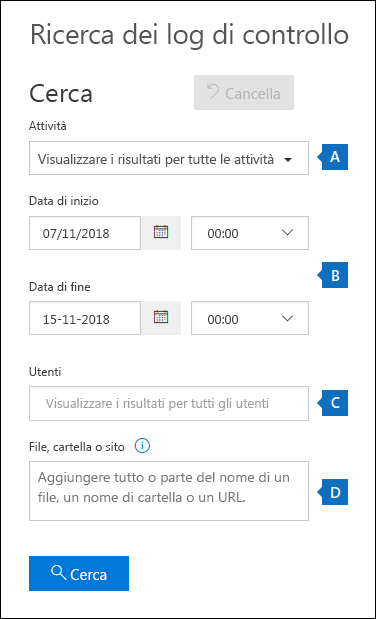
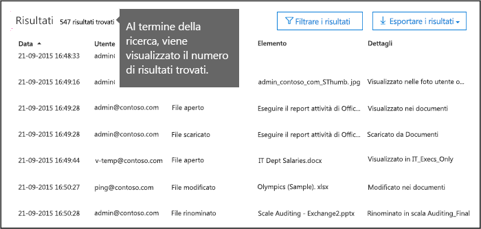
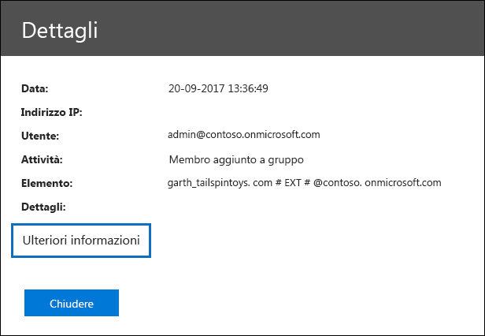
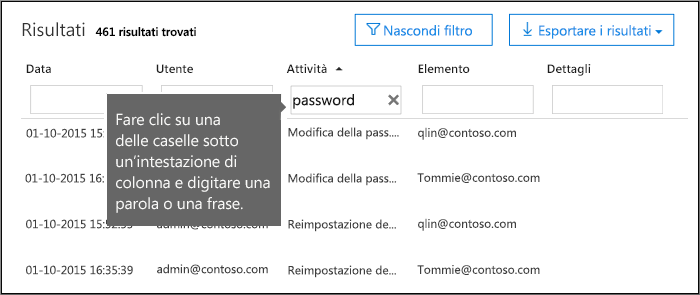
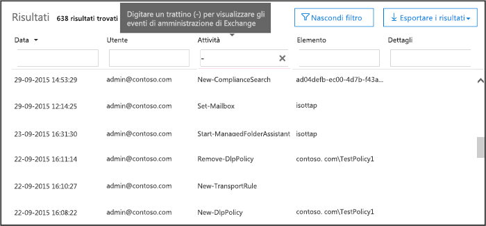

# <a name="search-the-audit-log-in-the-office-365-security--compliance-center"></a><span data-ttu-id="9c0ec-103">Eseguire una ricerca nel log di controllo nel centro conformità di Office 365 Security &</span><span class="sxs-lookup"><span data-stu-id="9c0ec-103">Search the audit log in the Office 365 Security & Compliance Center</span></span>

<span data-ttu-id="9c0ec-p101">È necessario individuare se un utente ha visualizzato un documento specifico o ha eliminato un elemento dalla propria cassetta postale? In caso affermativo, è possibile utilizzare il centro &amp; sicurezza e conformità di Office 365 per eseguire una ricerca nel registro di controllo unificato per visualizzare le attività dell'utente e dell'amministratore nell'organizzazione di Office 365. Perché un log di controllo unificato? Poiché è possibile cercare i seguenti tipi di attività di utente e di amministratore in Office 365:</span><span class="sxs-lookup"><span data-stu-id="9c0ec-p101">Need to find if a user viewed a specific document or purged an item from their mailbox? If so, you can use the Office 365 Security &amp; Compliance Center to search the unified audit log to view user and administrator activity in your Office 365 organization. Why a unified audit log? Because you can search for the following types of user and admin activity in Office 365:</span></span>
  
- <span data-ttu-id="9c0ec-108">Attività degli utenti in SharePoint Online e OneDrive for business</span><span class="sxs-lookup"><span data-stu-id="9c0ec-108">User activity in SharePoint Online and OneDrive for Business</span></span>
    
- <span data-ttu-id="9c0ec-109">Attività degli utenti in Exchange Online (registrazione di controllo delle cassette postali di Exchange)</span><span class="sxs-lookup"><span data-stu-id="9c0ec-109">User activity in Exchange Online (Exchange mailbox audit logging)</span></span>
    
    > [!IMPORTANT]
    > <span data-ttu-id="9c0ec-p102">La registrazione di controllo delle cassette postali deve essere attivata per ogni cassetta postale utente prima che l'attività dell'utente in Exchange Online venga registrata. Per ulteriori informazioni, vedere [abilitare il controllo delle cassette postali in Office 365](enable-mailbox-auditing.md).</span><span class="sxs-lookup"><span data-stu-id="9c0ec-p102">Mailbox audit logging must be turned on for each user mailbox before user activity in Exchange Online will be logged. For more information, see [Enable mailbox auditing in Office 365](enable-mailbox-auditing.md).</span></span>
  
- <span data-ttu-id="9c0ec-112">Attività di amministrazione in SharePoint Online</span><span class="sxs-lookup"><span data-stu-id="9c0ec-112">Admin activity in SharePoint Online</span></span>
    
- <span data-ttu-id="9c0ec-113">Attività di amministratore in Azure Active Directory (servizio directory per Office 365)</span><span class="sxs-lookup"><span data-stu-id="9c0ec-113">Admin activity in Azure Active Directory (the directory service for Office 365)</span></span>
    
- <span data-ttu-id="9c0ec-114">Attività di amministratore in Exchange Online (registrazione di controllo dell'amministratore di Exchange)</span><span class="sxs-lookup"><span data-stu-id="9c0ec-114">Admin activity in Exchange Online (Exchange admin audit logging)</span></span>
    
- <span data-ttu-id="9c0ec-115">Attività di utenti e amministratori in Sway</span><span class="sxs-lookup"><span data-stu-id="9c0ec-115">User and admin activity in Sway</span></span>
    
- <span data-ttu-id="9c0ec-116">attività di eDiscovery nel centro conformità & sicurezza di Office 365</span><span class="sxs-lookup"><span data-stu-id="9c0ec-116">eDiscovery activities in the Office 365 Security & Compliance Center</span></span>
    
- <span data-ttu-id="9c0ec-117">Attività di utenti e amministratori in Power BI</span><span class="sxs-lookup"><span data-stu-id="9c0ec-117">User and admin activity in Power BI</span></span>
    
- <span data-ttu-id="9c0ec-118">Attività di utenti e amministratori in Microsoft Teams</span><span class="sxs-lookup"><span data-stu-id="9c0ec-118">User and admin activity in Microsoft Teams</span></span>

- <span data-ttu-id="9c0ec-119">Attività di utenti e amministratori in Dynamics 365</span><span class="sxs-lookup"><span data-stu-id="9c0ec-119">User and admin activity in Dynamics 365</span></span>
    
- <span data-ttu-id="9c0ec-120">Attività di utenti e amministratori in Yammer</span><span class="sxs-lookup"><span data-stu-id="9c0ec-120">User and admin activity in Yammer</span></span>
 
- <span data-ttu-id="9c0ec-121">Attività di utenti e amministratori in Microsoft Flow</span><span class="sxs-lookup"><span data-stu-id="9c0ec-121">User and admin activity in Microsoft Flow</span></span>
    
- <span data-ttu-id="9c0ec-122">Attività di utenti e amministratori in Microsoft Stream</span><span class="sxs-lookup"><span data-stu-id="9c0ec-122">User and admin activity in Microsoft Stream</span></span>

- <span data-ttu-id="9c0ec-123">Attività di Analyst e di amministrazione nell'analisi del luogo di lavoro Microsoft</span><span class="sxs-lookup"><span data-stu-id="9c0ec-123">Analyst and admin activity in Microsoft Workplace Analytics</span></span>

- <span data-ttu-id="9c0ec-124">Attività di utenti e amministratori in PowerApps</span><span class="sxs-lookup"><span data-stu-id="9c0ec-124">User and admin activity in PowerApps</span></span>
    
   
## <a name="before-you-begin"></a><span data-ttu-id="9c0ec-125">Informazioni preliminari</span><span class="sxs-lookup"><span data-stu-id="9c0ec-125">Before you begin</span></span>

<span data-ttu-id="9c0ec-126">Assicurarsi di leggere gli elementi seguenti prima di iniziare la ricerca nel registro di controllo di Office 365.</span><span class="sxs-lookup"><span data-stu-id="9c0ec-126">Be sure to read the following items before you start searching the Office 365 audit log.</span></span>
  
- <span data-ttu-id="9c0ec-p103">L'utente (o un altro amministratore) deve prima attivare la registrazione di controllo prima di iniziare a eseguire la ricerca nel registro di controllo di Office 365. Per attivarla, fare clic su **Avvia registrazione attività utente e amministratore** nella pagina di **ricerca del registro di controllo** nel &amp; Centro sicurezza e conformità. Se questo collegamento non è visualizzato, il controllo è già stato attivato per l'organizzazione. Dopo averla attivata, viene visualizzato un messaggio che indica che il registro di controllo viene preparato e che è possibile eseguire una ricerca in un paio d'ore dopo il completamento della preparazione. È necessario eseguire questa operazione una sola volta.</span><span class="sxs-lookup"><span data-stu-id="9c0ec-p103">You (or another admin) must first turn on audit logging before you can start searching the Office 365 audit log. To turn it on, just click **Start recording user and admin activity** on the **Audit log search** page in the Security &amp; Compliance Center. (If you don't see this link, auditing has already been turned on for your organization.) After you turn it on, a message is displayed that says the audit log is being prepared and that you can run a search in a couple of hours after the preparation is complete. You only have to do this once.</span></span> 
    
    > [!NOTE]
    > <span data-ttu-id="9c0ec-p104">Per impostazione predefinita, è in corso l'attivazione del controllo. Fino a quel momento, è possibile attivarlo come descritto in precedenza.</span><span class="sxs-lookup"><span data-stu-id="9c0ec-p104">We're in the process of turning on auditing by default. Until then, you can turn it on as previously described.</span></span> 
  
- <span data-ttu-id="9c0ec-p105">È necessario essere assegnati al ruolo di controllo di sola visualizzazione o ai registri di controllo in Exchange Online per eseguire una ricerca nel registro di controllo di Office 365. Per impostazione predefinita, questi ruoli sono assegnati ai gruppi di ruoli Gestione conformità e gestione organizzazione nella pagina **autorizzazioni** nell'interfaccia di amministrazione di Exchange. Per concedere a un utente la possibilità di eseguire ricerche nel log di controllo di Office 365 con il livello minimo di privilegi, è possibile creare un gruppo di ruoli personalizzato in Exchange Online, aggiungere i registri di controllo o i registri di controllo di sola visualizzazione e quindi aggiungere l'utente come membro del nuovo gruppo di ruoli. Per ulteriori informazioni, vedere [gestire i gruppi di ruoli in Exchange Online](https://go.microsoft.com/fwlink/p/?LinkID=730688).</span><span class="sxs-lookup"><span data-stu-id="9c0ec-p105">You have to be assigned the View-Only Audit Logs or Audit Logs role in Exchange Online to search the Office 365 audit log. By default, these roles are assigned to the Compliance Management and Organization Management role groups on the **Permissions** page in the Exchange admin center. To give a user the ability to search the Office 365 audit log with the minimum level of privileges, you can create a custom role group in Exchange Online, add the View-Only Audit Logs or Audit Logs role, and then add the user as a member of the new role group. For more information, see [Manage role groups in Exchange Online](https://go.microsoft.com/fwlink/p/?LinkID=730688).</span></span>
    
    > [!IMPORTANT]
    > <span data-ttu-id="9c0ec-p106">Se si assegna a un utente il ruolo di controllo solo visualizzazione o log di controllo nella pagina **autorizzazioni** nel centro sicurezza &amp; e conformità, non sarà possibile eseguire la ricerca nel registro di controllo di Office 365. È necessario assegnare le autorizzazioni in Exchange Online. Ciò è dovuto al fatto che il cmdlet sottostante utilizzato per eseguire la ricerca nel registro di controllo è un cmdlet di Exchange Online.</span><span class="sxs-lookup"><span data-stu-id="9c0ec-p106">If you assign a user the View-Only Audit Logs or Audit Logs role on the **Permissions** page in the Security &amp; Compliance Center, they won't be able to search the Office 365 audit log. You have to assign the permissions in Exchange Online. This is because the underlying cmdlet used to search the audit log is an Exchange Online cmdlet.</span></span> 
  
- <span data-ttu-id="9c0ec-p107">Quando un'attività controllata viene eseguita da un utente o da un amministratore, viene generato un record di controllo che viene memorizzato nel registro di controllo di Office 365 per l'organizzazione. Il periodo di tempo in cui un record di controllo viene mantenuto (e ricercabile nel log di controllo) dipende dall'abbonamento a Office 365 e in particolare dal tipo di licenza assegnato a un utente specifico.</span><span class="sxs-lookup"><span data-stu-id="9c0ec-p107">When an audited activity is performed by a user or admin, an audit record is generated and stored in the Office 365 audit log for your organization. The length of time that an audit record is retained (and searchable in the audit log) depends on your Office 365 subscription, and specifically the type of the license that is assigned to a specific user.</span></span>

     - <span data-ttu-id="9c0ec-p108">**Office 365 E3** -i record di controllo vengono conservati per 90 giorni. Questo significa che è possibile eseguire una ricerca nel registro di controllo per le attività eseguite negli ultimi 90 giorni.</span><span class="sxs-lookup"><span data-stu-id="9c0ec-p108">**Office 365 E3** - Audit records are retained for 90 days. That means you can search the audit log for activities that were performed within the last 90 days.</span></span>

     - <span data-ttu-id="9c0ec-p109">**Office 365 E5** -i record di controllo vengono conservati per 365 giorni (un anno). Questo significa che è possibile eseguire una ricerca nel registro di controllo per le attività eseguite nell'ultimo anno. La conservazione dei record di controllo per un anno è disponibile anche per gli utenti a cui è stata assegnata una licenza E3/Exchange Online piano 1 e che dispongono di una licenza per il componente aggiuntivo per la conformità avanzata di Office 365.</span><span class="sxs-lookup"><span data-stu-id="9c0ec-p109">**Office 365 E5** - Audit records are retained for 365 days (one year). That means you can search the audit log for activities that were performed within the last year. Retaining audit records for one year is also available for users that are assigned an E3/Exchange Online Plan 1 license and have an Office 365 Advanced Compliance add-on license.</span></span>

        > [!NOTE]
        > <span data-ttu-id="9c0ec-p110">Il periodo di conservazione di un anno per i record di controllo per le organizzazioni E5 (o le organizzazioni E3 con licenze per i componenti aggiuntivi di conformità avanzate) è attualmente disponibile solo nell'ambito di un programma di anteprima privata. Per iscriversi al programma di anteprima, inviare una richiesta con il [supporto tecnico Microsoft](https://docs.microsoft.com/en-us/office365/admin/contact-support-for-business-products?redirectSourcePath=%252fen-us%252farticle%252fcontact-support-for-business-products-admin-help-32a17ca7-6fa0-4870-8a8d-e25ba4ccfd4b&view=o365-worldwide&tabs=online) e includere quanto segue come descrizione di cosa serve aiuto con: "Long-term Office 365 audit log di controllo di anteprima privata".</span><span class="sxs-lookup"><span data-stu-id="9c0ec-p110">The one-year retention period for audit records for E5 organizations (or E3 organizations that have Advanced Compliance add-on licenses) is currently available only as part of a private preview program. To enroll in this preview program, please file a request with [Microsoft Support](https://docs.microsoft.com/en-us/office365/admin/contact-support-for-business-products?redirectSourcePath=%252fen-us%252farticle%252fcontact-support-for-business-products-admin-help-32a17ca7-6fa0-4870-8a8d-e25ba4ccfd4b&view=o365-worldwide&tabs=online) and include the following as the description of what you need help with: "Long-term Office 365 audit log private preview".</span></span>

- <span data-ttu-id="9c0ec-149">Se si desidera disattivare la ricerca del registro di controllo in Office 365 per l'organizzazione, è possibile eseguire il comando riportato di seguito in Remote PowerShell connesso all'organizzazione Exchange Online:</span><span class="sxs-lookup"><span data-stu-id="9c0ec-149">If you want to turn off audit log search in Office 365 for your organization, you can run the following command in remote PowerShell connected to your Exchange Online organization:</span></span>
    
  ```
  Set-AdminAuditLogConfig -UnifiedAuditLogIngestionEnabled $false
  ```

    <span data-ttu-id="9c0ec-150">Per abilitare di nuovo la ricerca di controllo, è possibile eseguire il comando seguente in PowerShell di Exchange Online:</span><span class="sxs-lookup"><span data-stu-id="9c0ec-150">To turn on audit search again, you can run the following command in Exchange Online PowerShell:</span></span>
    
  ```
  Set-AdminAuditLogConfig -UnifiedAuditLogIngestionEnabled $true
  ```

    <span data-ttu-id="9c0ec-151">Per ulteriori informazioni, vedere [disattivazione della ricerca del registro di controllo in Office 365](turn-audit-log-search-on-or-off.md).</span><span class="sxs-lookup"><span data-stu-id="9c0ec-151">For more information, see [Turn off audit log search in Office 365](turn-audit-log-search-on-or-off.md).</span></span>
    
- <span data-ttu-id="9c0ec-p111">Come indicato in precedenza, il cmdlet sottostante utilizzato per eseguire la ricerca nel log di controllo è un cmdlet di Exchange Online, ovvero **Search-UnifiedAuditLog**. Questo significa che è possibile utilizzare questo cmdlet per eseguire una ricerca nel registro di controllo di Office 365 anziché utilizzare la pagina di ricerca &amp; del registro di **controllo** nel centro sicurezza e conformità. È necessario eseguire questo cmdlet in Remote PowerShell connesso all'organizzazione Exchange Online. Per ulteriori informazioni, vedere [Search-UnifiedAuditLog](https://go.microsoft.com/fwlink/p/?linkid=834776).</span><span class="sxs-lookup"><span data-stu-id="9c0ec-p111">As previously stated, the underlying cmdlet used to search the audit log is an Exchange Online cmdlet, which is **Search-UnifiedAuditLog**. That means you can use this cmdlet to search the Office 365 audit log instead of using the **Audit log search** page in the Security &amp; Compliance Center. You have to run this cmdlet in remote PowerShell connected to your Exchange Online organization. For more information, see [Search-UnifiedAuditLog](https://go.microsoft.com/fwlink/p/?linkid=834776).</span></span>
    
- <span data-ttu-id="9c0ec-p112">Se si desidera scaricare dati a livello di programmazione dal registro di controllo di Office 365, è consigliabile utilizzare l'API di attività di gestione di Office 365 anziché utilizzare uno script di PowerShell. L'API di attività di gestione di Office 365 è un servizio Web REST che è possibile utilizzare per sviluppare soluzioni di monitoraggio di operazioni, sicurezza e conformità per l'organizzazione. Per ulteriori informazioni, vedere Guida di [riferimento all'API di attività di gestione di Office 365](https://go.microsoft.com/fwlink/?linkid=852309).</span><span class="sxs-lookup"><span data-stu-id="9c0ec-p112">If you want to programmatically download data from the Office 365 audit log, we recommend that you use the Office 365 Management Activity API instead of using a PowerShell script. The Office 365 Management Activity API is a REST web service that you can use to develop operations, security, and compliance monitoring solutions for your organization. For more information, see [Office 365 Management Activity API reference](https://go.microsoft.com/fwlink/?linkid=852309).</span></span>
    
- <span data-ttu-id="9c0ec-p113">Possono essere necessari fino a 30 minuti o fino a 24 ore dopo che si è verificato un evento per la voce del registro di controllo corrispondente da visualizzare nei risultati della ricerca. Nella tabella seguente vengono illustrati i tempi necessari per i diversi servizi di Office 365.</span><span class="sxs-lookup"><span data-stu-id="9c0ec-p113">It can take up to 30 minutes or up to 24 hours after an event occurs for the corresponding audit log entry to be displayed in the search results. The following table shows the time it takes for the different services in Office 365.</span></span>
    
    |<span data-ttu-id="9c0ec-161">**Servizio Office 365**</span><span class="sxs-lookup"><span data-stu-id="9c0ec-161">**Office 365 service**</span></span>|<span data-ttu-id="9c0ec-162">**30 minutes**</span><span class="sxs-lookup"><span data-stu-id="9c0ec-162">**30 minutes**</span></span>|<span data-ttu-id="9c0ec-163">**24 ore**</span><span class="sxs-lookup"><span data-stu-id="9c0ec-163">**24 hours**</span></span>|
    |:-----|:-----|:-----|
    |<span data-ttu-id="9c0ec-164">Protezione avanzata dalle minacce e intelligence delle minacce</span><span class="sxs-lookup"><span data-stu-id="9c0ec-164">Advanced Threat Protection and Threat Intelligence</span></span>  <br/> || |
    |<span data-ttu-id="9c0ec-166">Azure Active Directory (eventi di accesso utente)</span><span class="sxs-lookup"><span data-stu-id="9c0ec-166">Azure Active Directory (user login events)</span></span>  <br/> ||           <br/> |
    |<span data-ttu-id="9c0ec-168">Azure Active Directory (eventi di amministrazione)</span><span class="sxs-lookup"><span data-stu-id="9c0ec-168">Azure Active Directory (admin events)</span></span>  <br/> || |
    |<span data-ttu-id="9c0ec-170">Prevenzione della perdita di dati</span><span class="sxs-lookup"><span data-stu-id="9c0ec-170">Data Loss Prevention</span></span>  <br/> |       <br/>| |
    |<span data-ttu-id="9c0ec-172">Dynamics 365 CRM</span><span class="sxs-lookup"><span data-stu-id="9c0ec-172">Dynamics 365 CRM</span></span> <br/> |           <br/>| |
    |<span data-ttu-id="9c0ec-174">eDiscovery</span><span class="sxs-lookup"><span data-stu-id="9c0ec-174">eDiscovery</span></span>  <br/> |           <br/>| |
    |<span data-ttu-id="9c0ec-176">Exchange Online</span><span class="sxs-lookup"><span data-stu-id="9c0ec-176">Exchange Online</span></span>  <br/> |           <br/> ||
    |<span data-ttu-id="9c0ec-178">Microsoft Flow</span><span class="sxs-lookup"><span data-stu-id="9c0ec-178">Microsoft Flow</span></span>  <br/> |           <br/>| |
    |<span data-ttu-id="9c0ec-180">Microsoft Forms</span><span class="sxs-lookup"><span data-stu-id="9c0ec-180">Microsoft Forms</span></span>  <br/> |           <br/>| |
    |<span data-ttu-id="9c0ec-182">Microsoft Project</span><span class="sxs-lookup"><span data-stu-id="9c0ec-182">Microsoft Project</span></span>  <br/> |           <br/>| |
    |<span data-ttu-id="9c0ec-184">Microsoft Stream</span><span class="sxs-lookup"><span data-stu-id="9c0ec-184">Microsoft Stream</span></span>  <br/> |           <br/>| |
    |<span data-ttu-id="9c0ec-186">Microsoft Teams</span><span class="sxs-lookup"><span data-stu-id="9c0ec-186">Microsoft Teams</span></span>  <br/> |           <br/> ||
    |<span data-ttu-id="9c0ec-188">Power BI</span><span class="sxs-lookup"><span data-stu-id="9c0ec-188">Power BI</span></span>  <br/> |           <br/>| |
    |<span data-ttu-id="9c0ec-190">Centro &amp; sicurezza e conformità</span><span class="sxs-lookup"><span data-stu-id="9c0ec-190">Security &amp; Compliance Center</span></span>  <br/> |           <br/> ||
    |<span data-ttu-id="9c0ec-192">SharePoint Online e OneDrive for Business</span><span class="sxs-lookup"><span data-stu-id="9c0ec-192">SharePoint Online and OneDrive for Business</span></span>  <br/> |           <br/> ||
    |<span data-ttu-id="9c0ec-194">Sway</span><span class="sxs-lookup"><span data-stu-id="9c0ec-194">Sway</span></span>  <br/> ||           <br/> |
    |<span data-ttu-id="9c0ec-196">Yammer</span><span class="sxs-lookup"><span data-stu-id="9c0ec-196">Yammer</span></span>  <br/> ||           <br/> |
   
- <span data-ttu-id="9c0ec-p114">Azure Active Directory (Azure AD) è il servizio directory per Office 365. Il registro di controllo unificato contiene le attività relative a utenti, gruppi, applicazioni, domini e directory eseguite nell'interfaccia di amministrazione di Office 365 o nel portale di gestione di Azure. Per un elenco completo degli eventi di Azure AD, vedere [eventi del rapporto di controllo di Azure Active Directory](https://go.microsoft.com/fwlink/p/?LinkID=616549).</span><span class="sxs-lookup"><span data-stu-id="9c0ec-p114">Azure Active Directory (Azure AD) is the directory service for Office 365. The unified audit log contains user, group, application, domain, and directory activities performed in the Office 365 admin center or in the in Azure management portal. For a complete list of Azure AD events, see [Azure Active Directory Audit Report Events](https://go.microsoft.com/fwlink/p/?LinkID=616549).</span></span>
    
- <span data-ttu-id="9c0ec-p115">I log di controllo di Exchange Online sono costituiti da due tipi di eventi: eventi di amministrazione di Exchange (azioni eseguite dagli amministratori) e eventi delle cassette postali (azioni eseguite dagli utenti nelle cassette postali). Si noti che il controllo delle cassette postali non è abilitato per impostazione predefinita. Deve essere abilitata per ogni cassetta postale utente prima che gli eventi della cassetta postale possano essere cercati nel registro di controllo di Office 365. Per ulteriori informazioni sul controllo delle cassette postali e sulle azioni di controllo delle cassette postali registrate, vedere [Enable Mailbox auditing in Office 365](enable-mailbox-auditing.md).</span><span class="sxs-lookup"><span data-stu-id="9c0ec-p115">Exchange Online audit logs consist of two types of events: Exchange admin events (actions taken by administrators) and mailbox events (actions taken by users on mailboxes). Note that mailbox auditing isn't enabled by default. It must be enable for each user mailbox before mailbox events can be searched for in the Office 365 audit log. For more information about mailbox auditing and the mailbox auditing actions that are logged, see [Enable mailbox auditing in Office 365](enable-mailbox-auditing.md).</span></span>
    
- <span data-ttu-id="9c0ec-p116">La registrazione di controllo per Power BI non è abilitata per impostazione predefinita. Per cercare le attività di Power BI nel log di controllo di Office 365, è necessario abilitare il controllo nel portale di amministrazione di Power BI. Per istruzioni, vedere la sezione relativa ai registri di controllo in [Power Bi Admin Portal](https://docs.microsoft.com/power-bi/service-admin-portal#audit-logs).</span><span class="sxs-lookup"><span data-stu-id="9c0ec-p116">Audit logging for Power BI isn't enabled by default. To search for Power BI activities in the Office 365 audit log, you have to enable auditing in the Power BI admin portal. For instructions, see the "Audit logs" section in [Power BI admin portal](https://docs.microsoft.com/power-bi/service-admin-portal#audit-logs).</span></span>
    
    
## <a name="search-the-audit-log"></a><span data-ttu-id="9c0ec-208">Eseguire ricerche nel log di controllo</span><span class="sxs-lookup"><span data-stu-id="9c0ec-208">Search the audit log</span></span>

<span data-ttu-id="9c0ec-209">Ecco la procedura per eseguire una ricerca nel log di controllo in Office 365.</span><span class="sxs-lookup"><span data-stu-id="9c0ec-209">Here's the process for searching the audit log in Office 365.</span></span>
  
[<span data-ttu-id="9c0ec-210">Passaggio 1: eseguire una ricerca nel registro di controllo</span><span class="sxs-lookup"><span data-stu-id="9c0ec-210">Step 1: Run an audit log search</span></span>](#step-1-run-an-audit-log-search)
  
[<span data-ttu-id="9c0ec-211">Passaggio 2: visualizzazione dei risultati della ricerca</span><span class="sxs-lookup"><span data-stu-id="9c0ec-211">Step 2: View the search results</span></span>](#step-2-view-the-search-results)

[<span data-ttu-id="9c0ec-212">Passaggio 3: filtrare i risultati della ricerca</span><span class="sxs-lookup"><span data-stu-id="9c0ec-212">Step 3: Filter the search results</span></span>](#step-3-filter-the-search-results)

[<span data-ttu-id="9c0ec-213">Passaggio 4: esportare i risultati della ricerca in un file</span><span class="sxs-lookup"><span data-stu-id="9c0ec-213">Step 4: Export the search results to a file</span></span>](#step-4-export-the-search-results-to-a-file)
  
### <a name="step-1-run-an-audit-log-search"></a><span data-ttu-id="9c0ec-214">Passaggio 1: eseguire una ricerca nel registro di controllo</span><span class="sxs-lookup"><span data-stu-id="9c0ec-214">Step 1: Run an audit log search</span></span>

1. <span data-ttu-id="9c0ec-215">Passare a [https://protection.office.com](https://protection.office.com).</span><span class="sxs-lookup"><span data-stu-id="9c0ec-215">Go to [https://protection.office.com](https://protection.office.com).</span></span>
    
    > [!TIP]
    > <span data-ttu-id="9c0ec-p117">Utilizzare una sessione di esplorazione privata (non una sessione regolare) per accedere al centro sicurezza &amp; e conformità di Office 365 perché ciò impedirà di utilizzare le credenziali a cui è attualmente connesso. Per aprire una sessione di InPrivate Browsing in Internet Explorer o Microsoft Edge, è sufficiente premere CTRL + MAIUSC + P. Per aprire una sessione di esplorazione privata in Google Chrome (denominata finestra in incognito), premere CTRL + MAIUSC + N.</span><span class="sxs-lookup"><span data-stu-id="9c0ec-p117">Use a private browsing session (not a regular session) to access the Office 365 Security &amp; Compliance Center because this will prevent the credential that you are currently logged on with from being used. To open an InPrivate Browsing session in Internet Explorer or Microsoft Edge, just press CTRL+SHIFT+P. To open a private browsing session in Google Chrome (called an incognito window), press CTRL+SHIFT+N.</span></span> 
  
2. <span data-ttu-id="9c0ec-219">Accedere a Office 365 usando l'account aziendale o dell'istituto di istruzione.</span><span class="sxs-lookup"><span data-stu-id="9c0ec-219">Sign in to Office 365 using your work or school account.</span></span>
    
3. <span data-ttu-id="9c0ec-220">Nel riquadro sinistro del Centro sicurezza &amp; e conformità fare clic su \*\*ricerca &amp; \*\*e quindi su **Ricerca log di controllo**.</span><span class="sxs-lookup"><span data-stu-id="9c0ec-220">In the left pane of the Security &amp; Compliance Center, click **Search &amp; investigation**, and then click **Audit log search**.</span></span>
    
    <span data-ttu-id="9c0ec-221">Viene visualizzata la pagina di **ricerca del registro di controllo** .</span><span class="sxs-lookup"><span data-stu-id="9c0ec-221">The **Audit log search** page is displayed.</span></span> 
    
    
  
    > [!NOTE]
    > <span data-ttu-id="9c0ec-p118">Prima di poter eseguire una ricerca nel registro di controllo, è necessario prima di tutto abilitare la registrazione di controllo. Se viene visualizzato il collegamento **Inizia registrazione utente e attività amministratore** , fare clic su di esso per attivare il controllo. Se questo collegamento non è visualizzato, il controllo è già stato attivato per l'organizzazione.</span><span class="sxs-lookup"><span data-stu-id="9c0ec-p118">You have to first turn on audit logging before you can run an audit log search. If the **Start recording user and admin activity** link is displayed, click it to turn on auditing. If you don't see this link, auditing has already been turned on for your organization.</span></span> 
  
4. <span data-ttu-id="9c0ec-226">Configurare i seguenti criteri di ricerca:</span><span class="sxs-lookup"><span data-stu-id="9c0ec-226">Configure the following search criteria:</span></span>
    
    <span data-ttu-id="9c0ec-p119">a. **Activities** fare clic sull'elenco a discesa per visualizzare le attività di cui è possibile eseguire la ricerca. Le attività di utenti e amministratori sono organizzate in gruppi di attività correlate. È possibile selezionare attività specifiche oppure fare clic sul nome del gruppo di attività per selezionare tutte le attività del gruppo. È inoltre possibile fare clic su un'attività selezionata per cancellare la selezione. Dopo aver eseguito la ricerca, vengono visualizzate solo le voci del registro di controllo per le attività selezionate. Se si seleziona **Mostra risultati per tutte le attività** , verranno visualizzati i risultati di tutte le attività eseguite dall'utente o dal gruppo di utenti selezionato.</span><span class="sxs-lookup"><span data-stu-id="9c0ec-p119">a. **Activities** Click the drop-down list to display the activities that you can search for. User and admin activities are organized in to groups of related activities. You can select specific activities or you can click the activity group name to select all activities in the group. You can also click a selected activity to clear the selection. After you run the search, only the audit log entries for the selected activities are displayed. Selecting **Show results for all activities** will display results for all activities performed by the selected user or group of users.</span></span> 
    
    <span data-ttu-id="9c0ec-p120">Nel registro di controllo di Office 365 sono registrate più di 100 utenti e attività amministrative. Fare clic sulla scheda **attività controllate** nell'argomento di questo articolo per visualizzare le descrizioni di ogni attività in ognuno dei diversi servizi di Office 365.</span><span class="sxs-lookup"><span data-stu-id="9c0ec-p120">Over 100 user and admin activities are logged in the Office 365 audit log. Click the **Audited activities** tab at the topic of this article to see the descriptions of every activity in each of the different Office 365 services.</span></span> 
    
    <span data-ttu-id="9c0ec-p121">b. **Data di inizio** e **Data di fine** gli ultimi sette giorni sono selezionati per impostazione predefinita. Selezionare un intervallo di data e ora per visualizzare gli eventi che si sono verificati entro quel periodo. La data e l'ora vengono visualizzate in formato UTC (Coordinated Universal Time). L'intervallo di date massimo che è possibile specificare è 90 giorni. Se l'intervallo di date selezionato è maggiore di 90 giorni, verrà visualizzato un messaggio di errore.</span><span class="sxs-lookup"><span data-stu-id="9c0ec-p121">b. **Start date** and **End date** The last seven days are selected by default. Select a date and time range to display the events that occurred within that period. The date and time are presented in Coordinated Universal Time (UTC) format. The maximum date range that you can specify is 90 days. An error is displayed if the selected date range is greater than 90 days.</span></span> 
    
    > [!TIP]
    > <span data-ttu-id="9c0ec-p122">Se si utilizza l'intervallo di date massimo di 90 giorni, selezionare l'ora corrente per la **Data di inizio**. In caso contrario, verrà visualizzato un messaggio di errore che indica che la data di inizio è precedente alla data di fine. Se il controllo è stato attivato negli ultimi 90 giorni, l'intervallo di date massimo non può essere avviato prima della data di attivazione del controllo.</span><span class="sxs-lookup"><span data-stu-id="9c0ec-p122">If you're using the maximum date range of 90 days, select the current time for the **Start date**. Otherwise, you'll receive an error saying that the start date is earlier than the end date. If you've turned on auditing within the last 90 days, the maximum date range can't start before the date that auditing was turned on.</span></span> 
  
    <span data-ttu-id="9c0ec-p123">c. **Users** fare clic in questa casella e quindi selezionare uno o più utenti per visualizzare i risultati della ricerca. Le voci del registro di controllo per l'attività selezionata eseguita dagli utenti selezionati in questa casella vengono visualizzate nell'elenco dei risultati. Lasciare vuota questa casella per restituire le voci per tutti gli utenti (e gli account di servizio) nell'organizzazione.</span><span class="sxs-lookup"><span data-stu-id="9c0ec-p123">c. **Users** Click in this box and then select one or more users to display search results for. The audit log entries for the selected activity performed by the users you select in this box are displayed in the list of results. Leave this box blank to return entries for all users (and service accounts) in your organization.</span></span> 
    
    <span data-ttu-id="9c0ec-p124">d. **file, cartella o sito** Digitare alcuni o tutti i nomi di file o cartelle per la ricerca di attività correlate al file della cartella contenente la parola chiave specificata. È inoltre possibile specificare un URL di un file o di una cartella. Se si utilizza un URL, accertarsi che il percorso URL completo sia digitato o se si digita solo una parte dell'URL, non includere caratteri o spazi speciali.</span><span class="sxs-lookup"><span data-stu-id="9c0ec-p124">d. **File, folder, or site** Type some or all of a file or folder name to search for activity related to the file of folder that contains the specified keyword. You can also specify a URL of a file or folder. If you use a URL, be sure the type the full URL path or if you just type a portion of the URL, don't include any special characters or spaces.</span></span> 
    
    <span data-ttu-id="9c0ec-253">Lasciare vuota questa casella per restituire le voci per tutti i file e le cartelle nell'organizzazione.</span><span class="sxs-lookup"><span data-stu-id="9c0ec-253">Leave this box blank to return entries for all files and folders in your organization.</span></span>
    
    > [!TIP]
    > <span data-ttu-id="9c0ec-254">Se si cercano tutte le attività relative a un **sito**, aggiungere il simbolo di carattere jolly\*() dopo l'URL per restituire tutte le voci per il sito. ad esempio, **"https://contoso-my.sharepoint.com/personal/\*"**.</span><span class="sxs-lookup"><span data-stu-id="9c0ec-254">If you're looking for all activities related to a **site**, add the wildcard symbol (\*) after the URL to return all entries for that site; for example, **"https://contoso-my.sharepoint.com/personal/\*"**.</span></span>
    
5. <span data-ttu-id="9c0ec-255">Fare clic su **Cerca** per eseguire la ricerca utilizzando i criteri di ricerca.</span><span class="sxs-lookup"><span data-stu-id="9c0ec-255">Click **Search** to run the search using your search criteria.</span></span> 
    
    <span data-ttu-id="9c0ec-p125">I risultati della ricerca vengono caricati e, dopo alcuni istanti, vengono visualizzati in **risultati**. Al termine della ricerca, viene visualizzato il numero di risultati trovati. Tenere presente che al massimo 5.000 eventi verranno visualizzati nel riquadro dei **risultati** con incrementi di 150 eventi. Se più di 5.000 eventi soddisfano i criteri di ricerca, vengono visualizzati gli eventi 5.000 più recenti.</span><span class="sxs-lookup"><span data-stu-id="9c0ec-p125">The search results are loaded, and after a few moments they are displayed under **Results**. When the search is finished, the number of results found is displayed. Note that a maximum of 5,000 events will be displayed in the **Results** pane in increments of 150 events; if more than 5,000 events meet the search criteria, the most recent 5,000 events are displayed.</span></span> 
    
    
  
  
#### <a name="tips-for-searching-the-audit-log"></a><span data-ttu-id="9c0ec-260">Suggerimenti per la ricerca nel registro di controllo</span><span class="sxs-lookup"><span data-stu-id="9c0ec-260">Tips for searching the audit log</span></span>

- <span data-ttu-id="9c0ec-p126">È possibile selezionare attività specifiche da cercare facendo clic sul nome dell'attività. In alternativa, è possibile cercare tutte le attività di un gruppo, ad esempio **attività di file e cartelle**, facendo clic sul nome del gruppo. Se è selezionata un'attività, è possibile fare clic su di essa per annullare la selezione. È inoltre possibile utilizzare la casella di ricerca per visualizzare le attività che contengono la parola chiave digitata.</span><span class="sxs-lookup"><span data-stu-id="9c0ec-p126">You can select specific activities to search for by clicking on the activity name. Or you can search for all activities in a group (such as **File and folder activities**) by clicking on the group name. If an activity is selected, you can click it to cancel the selection. You can also use the search box to display the activities that contain the keyword that you type.</span></span>
    
    
  
- <span data-ttu-id="9c0ec-p127">Per visualizzare gli eventi dal registro di controllo di amministrazione di Exchange, è necessario selezionare **Mostra risultati per tutte le attività** nell'elenco **attività** . Gli eventi di questo log di controllo visualizzano il nome di un cmdlet, ad esempio **Set-Mailbox** , nella colonna **attività** nei risultati. Per ulteriori informazioni, fare clic sulla scheda **attività controllate** in questo argomento, quindi fare clic su **attività di amministrazione di Exchange**.</span><span class="sxs-lookup"><span data-stu-id="9c0ec-p127">You have to select **Show results for all activities** in the **Activities** list to display events from the Exchange admin audit log. Events from this audit log display a cmdlet name (for example, **Set-Mailbox** ) in the **Activity** column in the results. For more information, click the **Audited activities** tab in this topic and then click **Exchange admin activities**.</span></span>
    
    <span data-ttu-id="9c0ec-p128">Analogamente, esistono alcune attività di controllo che non dispongono di un elemento corrispondente nell'elenco delle **attività** . Se si conosce il nome dell'operazione per queste attività, è possibile cercare tutte le attività e quindi filtrare i risultati digitando il nome dell'operazione nella casella relativa alla colonna **attività** . Per ulteriori informazioni sul filtraggio dei risultati, vedere [passaggio 3: filtrare i risultati della ricerca](#step-3-filter-the-search-results) .</span><span class="sxs-lookup"><span data-stu-id="9c0ec-p128">Similarly, there are some auditing activities that don't have a corresponding item in the **Activities** list. If you know the name of the operation for these activities, you can search for all activities, then filter the results by typing the name of the operation in the box for the **Activity** column. See [Step 3: Filter the search results](#step-3-filter-the-search-results) for more information about filtering the results.</span></span> 
    
- <span data-ttu-id="9c0ec-p129">Fare clic su **Annulla** per cancellare i criteri di ricerca correnti. L'intervallo di date restituisce il valore predefinito degli ultimi sette giorni. È inoltre possibile fare clic su **Cancella tutto per visualizzare i risultati di tutte le attività** per annullare tutte le attività selezionate.</span><span class="sxs-lookup"><span data-stu-id="9c0ec-p129">Click **Clear** to clear the current search criteria. The date range returns to the default of the last seven days. You can also click **Clear all to show results for all activities** to cancel all selected activities.</span></span> 
    
- <span data-ttu-id="9c0ec-p130">Se si verificano 5.000 risultati, è probabile che siano presenti più di 5.000 eventi che soddisfano i criteri di ricerca. È possibile affinare i criteri di ricerca e rieseguire la ricerca per restituire meno risultati oppure esportare tutti i risultati della ricerca selezionando **Esporta risultati** \> per **scaricare tutti i risultati**.</span><span class="sxs-lookup"><span data-stu-id="9c0ec-p130">If 5,000 results are found, you can probably assume there are more than 5,000 events that met the search criteria. You can either refine the search criteria and rerun the search to return fewer results, or you can export all of the search results by selecting **Export results** \> **Download all results**.</span></span>

  
### <a name="step-2-view-the-search-results"></a><span data-ttu-id="9c0ec-277">Passaggio 2: visualizzazione dei risultati della ricerca</span><span class="sxs-lookup"><span data-stu-id="9c0ec-277">Step 2: View the search results</span></span>

<span data-ttu-id="9c0ec-p131">I risultati di una ricerca del registro di controllo vengono visualizzati sotto **risultati** nella pagina di **ricerca del registro di controllo** . Come indicato in precedenza, al massimo 5.000 eventi (più recenti) vengono visualizzati in incrementi di 150. Per visualizzare altri eventi, è possibile utilizzare la barra di scorrimento nel riquadro **dei risultati** oppure premere **MAIUSC + fine** per visualizzare i successivi 150 eventi.</span><span class="sxs-lookup"><span data-stu-id="9c0ec-p131">The results of an audit log search are displayed under **Results** on the **Audit log search** page. As previously stated a maximum of 5,000 (newest) events are displayed in increments of 150 events. To display more events you can use the scroll bar in the **Results** pane or you can press **Shift + End** to display the next 150 events.</span></span> 
  
<span data-ttu-id="9c0ec-281">I risultati contengono le seguenti informazioni su ogni evento restituito dalla ricerca.</span><span class="sxs-lookup"><span data-stu-id="9c0ec-281">The results contain the following information about each event returned by the search.</span></span>
  
- <span data-ttu-id="9c0ec-282">**Data:** La data e l'ora (in formato UTC) quando si è verificato l'evento.</span><span class="sxs-lookup"><span data-stu-id="9c0ec-282">**Date:** The date and time (in UTC format) when the event occurred.</span></span> 
    
- <span data-ttu-id="9c0ec-p132">**Indirizzo IP:** L'indirizzo IP del dispositivo utilizzato quando è stata registrata l'attività. L'indirizzo IP viene visualizzato in un formato di indirizzo IPv4 o IPv6.</span><span class="sxs-lookup"><span data-stu-id="9c0ec-p132">**IP address:** The IP address of the device that was used when the activity was logged. The IP address is displayed in either an IPv4 or IPv6 address format.</span></span> 
    
- <span data-ttu-id="9c0ec-285">**Utente:** L'utente (o l'account di servizio) che ha eseguito l'azione che ha attivato l'evento.</span><span class="sxs-lookup"><span data-stu-id="9c0ec-285">**User:** The user (or service account) who performed the action that triggered the event.</span></span> 
    
- <span data-ttu-id="9c0ec-p133">**Attività:** Attività eseguita dall'utente. Questo valore corrisponde alle attività selezionate nell'elenco a discesa **attività** . Per un evento proveniente dal registro di controllo di amministrazione di Exchange, il valore di questa colonna è un cmdlet di Exchange.</span><span class="sxs-lookup"><span data-stu-id="9c0ec-p133">**Activity:** The activity performed by the user. This value corresponds to the activities that you selected in the **Activities** drop down list. For an event from the Exchange admin audit log, the value in this column is an Exchange cmdlet.</span></span> 
    
- <span data-ttu-id="9c0ec-p134">**Elemento:** Oggetto creato o modificato come risultato dell'attività corrispondente. Ad esempio, il file che è stato visualizzato o modificato o l'account utente che è stato aggiornato. Non tutte le attività hanno un valore in questa colonna.</span><span class="sxs-lookup"><span data-stu-id="9c0ec-p134">**Item:** The object that was created or modified as a result of the corresponding activity. For example, the file that was viewed or modified or the user account that was updated. Not all activities have a value in this column.</span></span> 
    
- <span data-ttu-id="9c0ec-p135">**Dettaglio:** Dettagli aggiuntivi su un'attività. Anche in questo caso, non tutte le attività avranno un valore.</span><span class="sxs-lookup"><span data-stu-id="9c0ec-p135">**Detail:** Additional detail about an activity. Again, not all activities will have a value.</span></span> 
    
> [!TIP]
> <span data-ttu-id="9c0ec-p136">Fare clic su un'intestazione di colonna in **risultati** per ordinare i risultati. È possibile ordinare i risultati dalla a alla Z o alla Z in a. fare clic sull'intestazione della **Data** per ordinare i risultati dal più vecchio al più recente o più recente al più vecchio.</span><span class="sxs-lookup"><span data-stu-id="9c0ec-p136">Click a column header under **Results** to sort the results. You can sort the results from A to Z or Z to A. Click the **Date** header to sort the results from oldest to newest or newest to oldest.</span></span> 
  
#### <a name="view-the-details-for-a-specific-event"></a><span data-ttu-id="9c0ec-296">Visualizzare i dettagli di un evento specifico</span><span class="sxs-lookup"><span data-stu-id="9c0ec-296">View the details for a specific event</span></span>

<span data-ttu-id="9c0ec-p137">È possibile visualizzare ulteriori dettagli su un evento facendo clic sul record dell'evento nell'elenco dei risultati della ricerca. Viene visualizzata una pagina dei **Dettagli** che contiene le proprietà dettagliate del record di evento. Le proprietà visualizzate dipendono dal servizio Office 365 in cui si verifica l'evento. Per visualizzare i dettagli, fare clic su **altre informazioni**. Per le descrizioni, vedere [proprietà dettagliate nel log di controllo di Office 365](detailed-properties-in-the-office-365-audit-log.md).</span><span class="sxs-lookup"><span data-stu-id="9c0ec-p137">You can view more details about an event by clicking the event record in the list of search results. A **Details** page is displayed that contains the detailed properties from the event record. The properties that are displayed depend on the Office 365 service in which the event occurs. To display these details, click **More information**. For descriptions, see [Detailed properties in the Office 365 audit log](detailed-properties-in-the-office-365-audit-log.md).</span></span>
  


  
### <a name="step-3-filter-the-search-results"></a><span data-ttu-id="9c0ec-303">Passaggio 3: filtrare i risultati della ricerca</span><span class="sxs-lookup"><span data-stu-id="9c0ec-303">Step 3: Filter the search results</span></span>

<span data-ttu-id="9c0ec-p138">Oltre all'ordinamento, è anche possibile filtrare i risultati di una ricerca nel registro di controllo. Si tratta di un'ottima funzionalità che consente di filtrare rapidamente i risultati per un utente o un'attività specifici. Inizialmente è possibile creare una ricerca estesa e quindi filtrare rapidamente i risultati per visualizzare gli eventi specifici. Successivamente, è possibile restringere i criteri di ricerca ed eseguire di nuovo la ricerca per restituire un insieme di risultati più piccolo e conciso.</span><span class="sxs-lookup"><span data-stu-id="9c0ec-p138">In addition to sorting, you can also filter the results of an audit log search. This is a great feature that can help you quickly filter the results for a specific user or activity. You can initially create a wide search and then quickly filter the results to see specific events. Then you can narrow the search criteria and re-run the search to return a smaller, more concise set of results.</span></span>
  
<span data-ttu-id="9c0ec-308">Per filtrare i risultati:</span><span class="sxs-lookup"><span data-stu-id="9c0ec-308">To filter the results:</span></span>
  
1. <span data-ttu-id="9c0ec-309">Eseguire una ricerca nel registro di controllo.</span><span class="sxs-lookup"><span data-stu-id="9c0ec-309">Run an audit log search.</span></span>
    
2. <span data-ttu-id="9c0ec-310">Quando vengono visualizzati i risultati, fare clic su **Filtra risultati**.</span><span class="sxs-lookup"><span data-stu-id="9c0ec-310">When the results are displayed, click **Filter results**.</span></span>
    
    <span data-ttu-id="9c0ec-311">Le caselle di parole chiave vengono visualizzate sotto ogni intestazione di colonna.</span><span class="sxs-lookup"><span data-stu-id="9c0ec-311">Keyword boxes are displayed under each column header.</span></span>
    
3. <span data-ttu-id="9c0ec-p139">Fare clic su una delle caselle all'interno di un'intestazione di colonna e digitare una parola o una frase, a seconda della colonna in base alla quale si sta applicando il filtro. I risultati verranno riadattati dinamicamente per visualizzare gli eventi che corrispondono al filtro.</span><span class="sxs-lookup"><span data-stu-id="9c0ec-p139">Click one of the boxes under a column header and type a word or phrase, depending on the column you're filtering on. The results will dynamically readjust to display the events that match your filter.</span></span>
    
    
  
4. <span data-ttu-id="9c0ec-315">Per cancellare un filtro, fare clic sulla **X** nella casella filtro oppure fare clic su **Nascondi filtro**.</span><span class="sxs-lookup"><span data-stu-id="9c0ec-315">To clear a filter, click the **X** in the filter box or just click **Hide filtering**.</span></span>
    
> [!TIP]
> <span data-ttu-id="9c0ec-p140">Per visualizzare gli eventi dal registro di controllo di amministrazione di Exchange **-** , digitare a (Dash) nella casella filtro **attività** . Verranno visualizzati i nomi dei cmdlet, che sono mostrati nella colonna **attività** per gli eventi di amministrazione di Exchange. È quindi possibile ordinare i nomi dei cmdlet in ordine alfabetico.</span><span class="sxs-lookup"><span data-stu-id="9c0ec-p140">To display events from the Exchange admin audit log, type a **-** (dash) in the **Activity** filter box. This will display cmdlet names, which are displayed in the **Activity** column for Exchange admin events. Then you can sort the cmdlet names in alphabetical order.</span></span> 

### <a name="step-4-export-the-search-results-to-a-file"></a><span data-ttu-id="9c0ec-319">Passaggio 4: esportare i risultati della ricerca in un file</span><span class="sxs-lookup"><span data-stu-id="9c0ec-319">Step 4: Export the search results to a file</span></span>

<span data-ttu-id="9c0ec-p141">È possibile esportare i risultati di una ricerca nel registro di controllo in un file con valori delimitati da virgole (CSV) nel computer locale. È possibile aprire il file in Microsoft Excel e utilizzare funzionalità quali la ricerca, l'ordinamento, il filtraggio e la suddivisione di una singola colonna (che contiene celle a più valori) in più colonne.</span><span class="sxs-lookup"><span data-stu-id="9c0ec-p141">You can export the results of an audit log search to a comma separated value (CSV) file on your local computer. You can open this file in Microsoft Excel and use features such as search, sorting, filtering, and splitting a single column (that contains multi-value cells) into multiple columns.</span></span>
  
1. <span data-ttu-id="9c0ec-322">Eseguire una ricerca nel registro di controllo e quindi rivedere i criteri di ricerca fino a quando non si hanno i risultati desiderati.</span><span class="sxs-lookup"><span data-stu-id="9c0ec-322">Run an audit log search, and then revise the search criteria until you have the desired results.</span></span>
    
2. <span data-ttu-id="9c0ec-323">Fare clic su **Esporta risultati** e selezionare una delle opzioni seguenti:</span><span class="sxs-lookup"><span data-stu-id="9c0ec-323">Click **Export results** and select one of the following options:</span></span> 
    
  - <span data-ttu-id="9c0ec-p142">**Salvare i risultati caricati** Scegliere questa opzione per esportare solo le voci visualizzate in results \*\*\*\* on the \* \* Audit Log Search \* \* Page. Il file CSV scaricato contiene le stesse colonne (e i dati) visualizzati nella pagina (data, utente, attività, elemento e dettagli). Una colonna aggiuntiva (denominata **more**) è inclusa nel file CSV che contiene altre informazioni dalla voce del registro di controllo. Poiché si stanno esportando gli stessi risultati caricati (e visualizzabili) nella pagina di **ricerca del registro di controllo** , vengono esportate al massimo 5.000 voci.</span><span class="sxs-lookup"><span data-stu-id="9c0ec-p142">**Save loaded results** Choose this option to export only the entries that are displayed under **Results** on the \*\* Audit log search \*\* page. The CSV file that is downloaded contains the same columns (and data) displayed on the page (Date, User, Activity, Item, and Details). An additional column (named **More**) is included in the CSV file that contains more information from the audit log entry. Because you're exporting the same results that are loaded (and viewable) on the **Audit log search** page, a maximum of 5,000 entries are exported.</span></span> 
    
  - <span data-ttu-id="9c0ec-p143">**Scaricare tutti i risultati** Scegliere questa opzione per esportare tutte le voci dal registro di controllo di Office 365 che soddisfano i criteri di ricerca. Per un set di risultati di ricerca di grandi dimensioni, scegliere questa opzione per scaricare tutte le voci dal registro di controllo oltre ai risultati di 5.000 che possono essere visualizzati nella pagina di **ricerca del registro di controllo** . Questa opzione consente di scaricare i dati non elaborati dal registro di controllo in un file CSV e contiene informazioni aggiuntive dalla voce del registro di controllo in una colonna denominata **AuditData**. Se si sceglie questa opzione di esportazione, potrebbe essere necessario più tempo per scaricare il file, in quanto il file potrebbe essere molto più grande di quello scaricato se si sceglie l'opzione altro.</span><span class="sxs-lookup"><span data-stu-id="9c0ec-p143">**Download all results** Choose this option to export all entries from the Office 365 audit log that meet the search criteria. For a large set of search results, choose this option to download all entries from the audit log in addition to the 5,000 results that can be displayed on the **Audit log search** page. This option will download the raw data from the audit log to a CSV file, and contains additional information from the audit log entry in a column named **AuditData**. It may take longer to download the file if you choose this export option because the file may be much larger than the one that's downloaded if you choose the other option.</span></span>
    
    > [!IMPORTANT]
    > <span data-ttu-id="9c0ec-p144">È possibile scaricare un massimo di 50.000 voci in un file CSV da una singola ricerca del registro di controllo. Se 50.000 voci vengono scaricate nel file CSV, è probabile che siano presenti più di 50.000 eventi che soddisfano i criteri di ricerca. Per esportare più di questo limite, provare a utilizzare un intervallo di date per ridurre il numero di voci del registro di controllo. Potrebbe essere necessario eseguire più ricerche con intervalli di date inferiori per esportare più di 50.000 voci.</span><span class="sxs-lookup"><span data-stu-id="9c0ec-p144">You can download a maximum of 50,000 entries to a CSV file from a single audit log search. If 50,000 entries are downloaded to the CSV file, you can probably assume there are more than 50,000 events that met the search criteria. To export more than this limit, try using a date range to reduce the number of audit log entries. You might have to run multiple searches with smaller date ranges to export more than 50,000 entries.</span></span> 
  
3. <span data-ttu-id="9c0ec-336">Dopo aver selezionato un'opzione di esportazione, nella parte inferiore della finestra viene visualizzato un messaggio in cui viene richiesto di aprire il file CSV, salvarlo nella cartella Downloads o salvarlo in una cartella specifica.</span><span class="sxs-lookup"><span data-stu-id="9c0ec-336">After you select an export option, a message is displayed at the bottom of the window that prompts you to open the CSV file, save it to the Downloads folder, or save it to a specific folder.</span></span>

  
#### <a name="more-information-about-exporting-audit-log-search-results"></a><span data-ttu-id="9c0ec-337">Ulteriori informazioni sull'esportazione dei risultati di ricerca del registro di controllo</span><span class="sxs-lookup"><span data-stu-id="9c0ec-337">More information about exporting audit log search results</span></span>

- <span data-ttu-id="9c0ec-p145">L'opzione **Download All Results** consente di scaricare i dati non elaborati dal registro di controllo di Office 365 in un file CSV. Questo file contiene nomi di colonna diversi (CreationDate, UserIds, Operation, AuditData) rispetto al file scaricato se si seleziona l'opzione **Salva risultati caricati** . È anche possibile che i valori dei due file CSV diversi per la stessa attività siano diversi. Ad esempio, l'attività nella colonna **azione** nel file CSV e può avere un valore diverso da quello della versione "facile da usare" che viene visualizzata nella colonna **attività** nella pagina di **ricerca del registro di controllo** . ad esempio, MailboxLogin vs utente ha eseguito l'accesso alla cassetta postale.</span><span class="sxs-lookup"><span data-stu-id="9c0ec-p145">The **Download all results** option downloads the raw data from the Office 365 audit log to a CSV file. This file contains different column names (CreationDate, UserIds, Operation, AuditData) than the file that's downloaded if you select the **Save loaded results** option. The values in the two different CSV files for the same activity may also be different. For example, the activity in the **Action** column in the CSV file and may have a different value than the "user-friendly" version that's displayed in the **Activity** column on the **Audit log search** page; for example, MailboxLogin vs. User signed in to mailbox.</span></span>
    
- <span data-ttu-id="9c0ec-p146">Se si scaricano tutti i risultati, il file CSV contiene una colonna denominata **AuditData**, che contiene informazioni aggiuntive su ogni evento. Come indicato in precedenza, questa colonna contiene una proprietà multivalore per più proprietà del record del registro di controllo. Ognuna delle coppie **proprietà: valore** di questa proprietà multivalore è separata da una virgola. È possibile utilizzare la query di alimentazione in Excel per dividere la colonna in più colonne in modo che ogni proprietà disponga di una colonna. In questo modo si consente di ordinare e filtrare una o più di queste proprietà. Per informazioni su come eseguire questa operazione, vedere la sezione "dividere una colonna per delimitatore" in [dividere una colonna di testo (Power query)](https://support.office.com/article/5282d425-6dd0-46ca-95bf-8e0da9539662).</span><span class="sxs-lookup"><span data-stu-id="9c0ec-p146">If you download all results, the CSV file contains a column named **AuditData**, which contains additional information about each event. As previously stated, this column contains a multi-value property for multiple properties from the audit log record. Each of the **property:value** pairs in this multi-value property are separated by a comma. You can use the Power Query in Excel to split this column into multiple columns so that each property will have its own column. This will let you sort and filter on one or more of these properties. To learn how to do this, see the "Split a column by delimiter" section in [Split a column of text (Power Query)](https://support.office.com/article/5282d425-6dd0-46ca-95bf-8e0da9539662).</span></span>
    
    <span data-ttu-id="9c0ec-348">Dopo aver suddiviso la colonna **AuditData** , è possibile filtrare nella colonna **operazioni** per visualizzare le proprietà dettagliate per un tipo specifico di attività.</span><span class="sxs-lookup"><span data-stu-id="9c0ec-348">After you split the **AuditData** column, you can filter on the **Operations** column to display the detailed properties for a specific type of activity.</span></span> 
    
- <span data-ttu-id="9c0ec-p147">È presente un limite di 3.060 caratteri per i dati visualizzati nel campo **AuditData** per un record di controllo. Se il limite di 3.060 caratteri viene superato, i dati in questo campo vengono troncati.</span><span class="sxs-lookup"><span data-stu-id="9c0ec-p147">There's a 3,060-character limit for the data that's displayed in the **AuditData** field for an audit record. If the 3,060-character limit is exceeded, the data in this field is truncated.</span></span> 
    
- <span data-ttu-id="9c0ec-p148">Quando si scaricano tutti i risultati da una query di ricerca che contiene eventi provenienti da diversi servizi di Office 365, la colonna **AuditData** nel file CSV contiene proprietà diverse a seconda del servizio in cui è stata eseguita l'azione. Ad esempio, le voci dei log di controllo di Exchange e di Azure AD includono una proprietà denominata **ResultStatus** che indica se l'azione ha avuto esito positivo o meno. Questa proprietà non è inclusa per gli eventi in SharePoint. Analogamente, gli eventi di SharePoint dispongono di una proprietà che identifica l'URL del sito per attività correlate a file e cartelle. Per attenuare questo comportamento, prendere in considerazione l'utilizzo di ricerche diverse per esportare i risultati per le attività da un singolo servizio.</span><span class="sxs-lookup"><span data-stu-id="9c0ec-p148">When you download all results from a search query that contains events from different Office 365 services, the **AuditData** column in the CSV file contains different properties depending on which service the action was performed in. For example, entries from Exchange and Azure AD audit logs include a property named **ResultStatus** that indicates if the action was successful or not. This property isn't included for events in SharePoint. Similarly, SharePoint events have a property that identifies the site URL for file and folder related activities. To mitigate this behavior, consider using different searches to export the results for activities from a single service.</span></span> 
    
    <span data-ttu-id="9c0ec-356">Per una descrizione delle proprietà elencate nella colonna **AuditData** nel file CSV quando si scaricano tutti i risultati e il servizio a cui si applica ognuno, vedere [proprietà dettagliate nel log di controllo di Office 365](detailed-properties-in-the-office-365-audit-log.md).</span><span class="sxs-lookup"><span data-stu-id="9c0ec-356">For a description of the properties that are listed in the **AuditData** column in the CSV file when you download all results, and the service each one applies to, see [Detailed properties in the Office 365 audit log](detailed-properties-in-the-office-365-audit-log.md).</span></span>

## <a name="audited-activities"></a><span data-ttu-id="9c0ec-357">Attività controllate</span><span class="sxs-lookup"><span data-stu-id="9c0ec-357">Audited activities</span></span>

<span data-ttu-id="9c0ec-p149">Nelle tabelle di questa sezione vengono descritte le attività di cui è stato eseguito il controllo in Office 365. È possibile cercare questi eventi eseguendo una ricerca nel registro di controllo nel centro sicurezza & Compliance.</span><span class="sxs-lookup"><span data-stu-id="9c0ec-p149">The tables in this section describe the activities that are audited in Office 365. You can search for these events by searching the audit log in the Security & Compliance Center.</span></span>
  
<span data-ttu-id="9c0ec-p150">Queste tabelle raggruppano le attività correlate o le attività di un servizio specifico di Office 365. Nelle tabelle è incluso il nome descrittivo visualizzato nell'elenco a discesa **attività** e il nome dell'operazione corrispondente che viene visualizzata nelle informazioni dettagliate di un record di controllo e nel file CSV quando si esportano i risultati della ricerca. Per le descrizioni delle informazioni dettagliate, vedere [proprietà dettagliate nel log di controllo di Office 365](detailed-properties-in-the-office-365-audit-log.md).</span><span class="sxs-lookup"><span data-stu-id="9c0ec-p150">These tables group related activities or the activities from a specific Office 365 service. The tables include the friendly name that's displayed in the **Activities** drop-down list and the name of the corresponding operation that appears in the detailed information of an audit record and in the CSV file when you export the search results. For descriptions of the detailed information, see [Detailed properties in the Office 365 audit log](detailed-properties-in-the-office-365-audit-log.md).</span></span>
  
<span data-ttu-id="9c0ec-363">Fare clic su uno dei collegamenti seguenti per passare a una tabella specifica.</span><span class="sxs-lookup"><span data-stu-id="9c0ec-363">Click one of the following links to go to a specific table.</span></span>
  
||||
|:-----|:-----|:-----|
|[<span data-ttu-id="9c0ec-364">Attività di file e pagine</span><span class="sxs-lookup"><span data-stu-id="9c0ec-364">File and page activities</span></span>](#file-and-page-activities)<br/> |[<span data-ttu-id="9c0ec-365">Attività cartella</span><span class="sxs-lookup"><span data-stu-id="9c0ec-365">Folder activities</span></span>](#folder-activities)<br/> |[<span data-ttu-id="9c0ec-366">Attività di condivisione e accesso alle richieste</span><span class="sxs-lookup"><span data-stu-id="9c0ec-366">Sharing and access request activities</span></span>](#sharing-and-access-request-activities)<br/> |
|[<span data-ttu-id="9c0ec-367">Attività di sincronizzazione</span><span class="sxs-lookup"><span data-stu-id="9c0ec-367">Synchronization activities</span></span>](#synchronization-activities)<br/> |[<span data-ttu-id="9c0ec-368">Attività amministrative del sito</span><span class="sxs-lookup"><span data-stu-id="9c0ec-368">Site administration activities</span></span>](#site-administration-activities)<br/> |[<span data-ttu-id="9c0ec-369">Attività relative alle cassette postali di Exchange</span><span class="sxs-lookup"><span data-stu-id="9c0ec-369">Exchange mailbox activities</span></span>](#exchange-mailbox-activities)<br/> |
|[<span data-ttu-id="9c0ec-370">Attività di Sway</span><span class="sxs-lookup"><span data-stu-id="9c0ec-370">Sway activities</span></span>](#sway-activities) <br/> |[<span data-ttu-id="9c0ec-371">Attività di amministrazione degli utenti</span><span class="sxs-lookup"><span data-stu-id="9c0ec-371">User administration activities</span></span>](#user-administration-activities) <br/> |[<span data-ttu-id="9c0ec-372">Attività di amministrazione di gruppi di Azure AD</span><span class="sxs-lookup"><span data-stu-id="9c0ec-372">Azure AD group administration activities</span></span>](#azure-ad-group-administration-activities) <br/> |
|[<span data-ttu-id="9c0ec-373">Attività di amministrazione dell'applicazione</span><span class="sxs-lookup"><span data-stu-id="9c0ec-373">Application administration activities</span></span>](#application-administration-activities) <br/> |[<span data-ttu-id="9c0ec-374">Attività di amministrazione del ruolo</span><span class="sxs-lookup"><span data-stu-id="9c0ec-374">Role administration activities</span></span>](#role-administration-activities) <br/> |[<span data-ttu-id="9c0ec-375">Attività di amministrazione della directory</span><span class="sxs-lookup"><span data-stu-id="9c0ec-375">Directory administration activities</span></span>](#directory-administration-activities) <br/> |
|[<span data-ttu-id="9c0ec-376">attività di eDiscovery</span><span class="sxs-lookup"><span data-stu-id="9c0ec-376">eDiscovery activities</span></span>](#ediscovery-activities) <br/> |[<span data-ttu-id="9c0ec-377">Attività di Power BI</span><span class="sxs-lookup"><span data-stu-id="9c0ec-377">Power BI activities</span></span>](#power-bi-activities) <br/> |[<span data-ttu-id="9c0ec-378">Analisi del luogo di lavoro Microsoft</span><span class="sxs-lookup"><span data-stu-id="9c0ec-378">Microsoft Workplace Analytics</span></span>](#microsoft-workplace-analytics-activities)<br/>|
[<span data-ttu-id="9c0ec-379">Attività di Microsoft Teams</span><span class="sxs-lookup"><span data-stu-id="9c0ec-379">Microsoft Teams activities</span></span>](#microsoft-teams-activities) <br/> |[<span data-ttu-id="9c0ec-380">Attività di Yammer</span><span class="sxs-lookup"><span data-stu-id="9c0ec-380">Yammer activities</span></span>](#yammer-activities) <br/> |[<span data-ttu-id="9c0ec-381">Microsoft Flow</span><span class="sxs-lookup"><span data-stu-id="9c0ec-381">Microsoft Flow</span></span>](#microsoft-flow) <br/> 
|[<span data-ttu-id="9c0ec-382">App di Microsoft Power</span><span class="sxs-lookup"><span data-stu-id="9c0ec-382">Microsoft PowerApps</span></span>](#microsoft-powerapps)<br/>|[<span data-ttu-id="9c0ec-383">Microsoft Stream</span><span class="sxs-lookup"><span data-stu-id="9c0ec-383">Microsoft Stream</span></span>](#microsoft-stream) <br/>|[<span data-ttu-id="9c0ec-384">Attività di amministrazione di Exchange</span><span class="sxs-lookup"><span data-stu-id="9c0ec-384">Exchange admin activities</span></span>](#exchange-admin-audit-log)<br/>|
|||
   
  
### <a name="file-and-page-activities"></a><span data-ttu-id="9c0ec-385">Attività di file e pagine</span><span class="sxs-lookup"><span data-stu-id="9c0ec-385">File and page activities</span></span>
  
<span data-ttu-id="9c0ec-386">Nella tabella seguente vengono descritte le attività relative a file e pagine in SharePoint Online e OneDrive for business.</span><span class="sxs-lookup"><span data-stu-id="9c0ec-386">The following table describes the file and page activities in SharePoint Online and OneDrive for Business.</span></span>
  
|<span data-ttu-id="9c0ec-387">**Nome descrittivo**</span><span class="sxs-lookup"><span data-stu-id="9c0ec-387">**Friendly name**</span></span>|<span data-ttu-id="9c0ec-388">**Operazione**</span><span class="sxs-lookup"><span data-stu-id="9c0ec-388">**Operation**</span></span>|<span data-ttu-id="9c0ec-389">**Descrizione**</span><span class="sxs-lookup"><span data-stu-id="9c0ec-389">**Description**</span></span>|
|:-----|:-----|:-----|
|<span data-ttu-id="9c0ec-390">File a cui si accede</span><span class="sxs-lookup"><span data-stu-id="9c0ec-390">Accessed file</span></span>  <br/> |<span data-ttu-id="9c0ec-391">FileAccessed</span><span class="sxs-lookup"><span data-stu-id="9c0ec-391">FileAccessed</span></span>  <br/> |<span data-ttu-id="9c0ec-392">L'account utente o di sistema accede a un file.</span><span class="sxs-lookup"><span data-stu-id="9c0ec-392">User or system account accesses a file.</span></span>  <br/> |
|<span data-ttu-id="9c0ec-393">nessuno</span><span class="sxs-lookup"><span data-stu-id="9c0ec-393">(none)</span></span>  <br/> |<span data-ttu-id="9c0ec-394">FileAccessedExtended</span><span class="sxs-lookup"><span data-stu-id="9c0ec-394">FileAccessedExtended</span></span>  <br/> |<span data-ttu-id="9c0ec-p151">Questa operazione è correlata all'attività "file di accesso" (fileAccessed). Un evento FileAccessedExtended viene registrato quando la stessa persona accede continuamente a un file per un periodo di tempo prolungato (fino a 3 ore). Lo scopo della registrazione degli eventi di FileAccessedExtended consiste nel ridurre il numero di eventi fileAccessed che vengono registrati quando si accede continuamente a un file. In questo modo è possibile ridurre il rumore di più record fileAccessed per ciò che è essenzialmente la stessa attività utente e consente di concentrarsi sull'evento iniziale (e più importante) fileAccessed.</span><span class="sxs-lookup"><span data-stu-id="9c0ec-p151">This is related to the "Accessed file" (FileAccessed) activity. A FileAccessedExtended event is logged when the same person continually accesses a file for an extended period of time (up to 3 hours). The purpose of logging FileAccessedExtended events is to reduce the number of FileAccessed events that are logged when a file is continually accessed. This helps reduce the noise of multiple FileAccessed records for what is essentially the same user activity, and lets you focus on the initial (and more important) FileAccessed event.</span></span>  <br/> |
|<span data-ttu-id="9c0ec-399">File archiviato</span><span class="sxs-lookup"><span data-stu-id="9c0ec-399">Checked in file</span></span>  <br/> |<span data-ttu-id="9c0ec-400">FileCheckedIn</span><span class="sxs-lookup"><span data-stu-id="9c0ec-400">FileCheckedIn</span></span>  <br/> |<span data-ttu-id="9c0ec-401">L'utente verifica un documento Estratto da una raccolta documenti.</span><span class="sxs-lookup"><span data-stu-id="9c0ec-401">User checks in a document that they checked out from a document library.</span></span>  <br/> |
|<span data-ttu-id="9c0ec-402">File Estratto</span><span class="sxs-lookup"><span data-stu-id="9c0ec-402">Checked out file</span></span>  <br/> |<span data-ttu-id="9c0ec-403">FileCheckedOut</span><span class="sxs-lookup"><span data-stu-id="9c0ec-403">FileCheckedOut</span></span>  <br/> |<span data-ttu-id="9c0ec-p152">L'utente estrae un documento che si trova in una raccolta documenti. Gli utenti possono estrarre e apportare modifiche ai documenti che sono stati condivisi con essi.</span><span class="sxs-lookup"><span data-stu-id="9c0ec-p152">User checks out a document located in a document library. Users can check out and make changes to documents that have been shared with them.</span></span>  <br/> |
|<span data-ttu-id="9c0ec-406">File copiato</span><span class="sxs-lookup"><span data-stu-id="9c0ec-406">Copied file</span></span>  <br/> |<span data-ttu-id="9c0ec-407">FileCopied</span><span class="sxs-lookup"><span data-stu-id="9c0ec-407">FileCopied</span></span>  <br/> |<span data-ttu-id="9c0ec-p153">L'utente copia un documento da un sito. Il file copiato può essere salvato in un'altra cartella del sito.</span><span class="sxs-lookup"><span data-stu-id="9c0ec-p153">User copies a document from a site. The copied file can be saved to another folder on the site.</span></span>  <br/> |
|<span data-ttu-id="9c0ec-410">File eliminato</span><span class="sxs-lookup"><span data-stu-id="9c0ec-410">Deleted file</span></span>  <br/> |<span data-ttu-id="9c0ec-411">FileDeleted</span><span class="sxs-lookup"><span data-stu-id="9c0ec-411">FileDeleted</span></span>  <br/> |<span data-ttu-id="9c0ec-412">L'utente elimina un documento da un sito.</span><span class="sxs-lookup"><span data-stu-id="9c0ec-412">User deletes a document from a site.</span></span>  <br/> |
|<span data-ttu-id="9c0ec-413">File eliminato dal Cestino</span><span class="sxs-lookup"><span data-stu-id="9c0ec-413">Deleted file from recycle bin</span></span>  <br/> |<span data-ttu-id="9c0ec-414">FileDeletedFirstStageRecycleBin</span><span class="sxs-lookup"><span data-stu-id="9c0ec-414">FileDeletedFirstStageRecycleBin</span></span>  <br/> |<span data-ttu-id="9c0ec-415">L'utente elimina un file dal Cestino di un sito.</span><span class="sxs-lookup"><span data-stu-id="9c0ec-415">User deletes a file from the recycle bin of a site.</span></span>  <br/> |
|<span data-ttu-id="9c0ec-416">File eliminato dal Cestino secondario</span><span class="sxs-lookup"><span data-stu-id="9c0ec-416">Deleted file from second-stage recycle bin</span></span>  <br/> |<span data-ttu-id="9c0ec-417">FileDeletedSecondStageRecycleBin</span><span class="sxs-lookup"><span data-stu-id="9c0ec-417">FileDeletedSecondStageRecycleBin</span></span>  <br/> |<span data-ttu-id="9c0ec-418">L'utente elimina un file dal Cestino secondario di un sito.</span><span class="sxs-lookup"><span data-stu-id="9c0ec-418">User deletes a file from the second-stage recycle bin of a site.</span></span>  <br/> |
|<span data-ttu-id="9c0ec-419">Malware rilevato nel file</span><span class="sxs-lookup"><span data-stu-id="9c0ec-419">Detected malware in file</span></span>  <br/> |<span data-ttu-id="9c0ec-420">FileMalwareDetected</span><span class="sxs-lookup"><span data-stu-id="9c0ec-420">FileMalwareDetected</span></span>  <br/> |<span data-ttu-id="9c0ec-421">Il motore di protezione di SharePoint rileva malware in un file.</span><span class="sxs-lookup"><span data-stu-id="9c0ec-421">SharePoint anti-virus engine detects malware in a file.</span></span>  <br/> |
|<span data-ttu-id="9c0ec-422">Estrazione file scartata</span><span class="sxs-lookup"><span data-stu-id="9c0ec-422">Discarded file checkout</span></span>  <br/> |<span data-ttu-id="9c0ec-423">FileCheckOutDiscarded</span><span class="sxs-lookup"><span data-stu-id="9c0ec-423">FileCheckOutDiscarded</span></span>  <br/> |<span data-ttu-id="9c0ec-p154">L'utente elimina (o annulla) un file estratto. Ciò significa che eventuali modifiche apportate al file al momento dell'estrazione vengono eliminate e non vengono salvate nella versione del documento nella raccolta documenti.</span><span class="sxs-lookup"><span data-stu-id="9c0ec-p154">User discards (or undos) a checked out file. That means any changes they made to the file when it was checked out are discarded, and not saved to the version of the document in the document library.</span></span>  <br/> |
|<span data-ttu-id="9c0ec-426">File scaricato</span><span class="sxs-lookup"><span data-stu-id="9c0ec-426">Downloaded file</span></span>  <br/> |<span data-ttu-id="9c0ec-427">FileDownloaded</span><span class="sxs-lookup"><span data-stu-id="9c0ec-427">FileDownloaded</span></span>  <br/> |<span data-ttu-id="9c0ec-428">L'utente scarica un documento da un sito.</span><span class="sxs-lookup"><span data-stu-id="9c0ec-428">User downloads a document from a site.</span></span>  <br/> |
|<span data-ttu-id="9c0ec-429">File modificato</span><span class="sxs-lookup"><span data-stu-id="9c0ec-429">Modified file</span></span>  <br/> |<span data-ttu-id="9c0ec-430">FileModified</span><span class="sxs-lookup"><span data-stu-id="9c0ec-430">FileModified</span></span>  <br/> |<span data-ttu-id="9c0ec-431">L'account utente o di sistema consente di modificare il contenuto o le proprietà di un documento che si trova in un sito.</span><span class="sxs-lookup"><span data-stu-id="9c0ec-431">User or system account modifies the content or the properties of a document located on a site.</span></span>  <br/> |
|<span data-ttu-id="9c0ec-432">nessuno</span><span class="sxs-lookup"><span data-stu-id="9c0ec-432">(none)</span></span>  <br/> |<span data-ttu-id="9c0ec-433">FileModifiedExtended</span><span class="sxs-lookup"><span data-stu-id="9c0ec-433">FileModifiedExtended</span></span>  <br/> |<span data-ttu-id="9c0ec-p155">Questa operazione è correlata all'attività "file modificato" (fileModified). Un evento FileModifiedExtended viene registrato quando la stessa persona modifica continuamente un file per un periodo di tempo prolungato (fino a 3 ore). Lo scopo della registrazione degli eventi di FileModifiedExtended consiste nel ridurre il numero di eventi fileModified che vengono registrati quando un file viene continuamente modificato. In questo modo si riduce il rumore di più record fileModified per ciò che è essenzialmente la stessa attività utente e consente di concentrarsi sull'evento di fileModified iniziale (e più importante).</span><span class="sxs-lookup"><span data-stu-id="9c0ec-p155">This is related to the "Modified file" (FileModified) activity. A FileModifiedExtended event is logged when the same person continually modifies a file for an extended period of time (up to 3 hours). The purpose of logging FileModifiedExtended events is to reduce the number of FileModified events that are logged when a file is continually modified. This helps reduce the noise of multiple FileModified records for what is essentially the same user activity, and lets you focus on the initial (and more important) FileModified event.</span></span>  <br/> |
|<span data-ttu-id="9c0ec-438">File spostato</span><span class="sxs-lookup"><span data-stu-id="9c0ec-438">Moved file</span></span>  <br/> |<span data-ttu-id="9c0ec-439">FileMoved</span><span class="sxs-lookup"><span data-stu-id="9c0ec-439">FileMoved</span></span>  <br/> |<span data-ttu-id="9c0ec-440">L'utente sposta un documento dal percorso corrente di un sito a un nuovo percorso.</span><span class="sxs-lookup"><span data-stu-id="9c0ec-440">User moves a document from its current location on a site to a new location.</span></span>  <br/> |
|<span data-ttu-id="9c0ec-441">ReCycled tutte le versioni secondarie del file</span><span class="sxs-lookup"><span data-stu-id="9c0ec-441">Recycled all minor versions of file</span></span>  <br/> |<span data-ttu-id="9c0ec-442">FileVersionsAllMinorsRecycled</span><span class="sxs-lookup"><span data-stu-id="9c0ec-442">FileVersionsAllMinorsRecycled</span></span>  <br/> |<span data-ttu-id="9c0ec-p156">L'utente Elimina tutte le versioni secondarie dalla cronologia delle versioni di un file. Le versioni eliminate vengono spostate nel cestino del sito.</span><span class="sxs-lookup"><span data-stu-id="9c0ec-p156">User deletes all minor versions from the version history of a file. The deleted versions are moved to the site's recycle bin.</span></span>  <br/> |
|<span data-ttu-id="9c0ec-445">ReCycled tutte le versioni di file</span><span class="sxs-lookup"><span data-stu-id="9c0ec-445">Recycled all versions of file</span></span>  <br/> |<span data-ttu-id="9c0ec-446">FileVersionsAllRecycled</span><span class="sxs-lookup"><span data-stu-id="9c0ec-446">FileVersionsAllRecycled</span></span>  <br/> |<span data-ttu-id="9c0ec-p157">L'utente Elimina tutte le versioni dalla cronologia delle versioni di un file. Le versioni eliminate vengono spostate nel cestino del sito.</span><span class="sxs-lookup"><span data-stu-id="9c0ec-p157">User deletes all versions from the version history of a file. The deleted versions are moved to the site's recycle bin.</span></span>  <br/> |
|<span data-ttu-id="9c0ec-449">Versione riciclata del file</span><span class="sxs-lookup"><span data-stu-id="9c0ec-449">Recycled version of file</span></span>  <br/> |<span data-ttu-id="9c0ec-450">FileVersionRecycled</span><span class="sxs-lookup"><span data-stu-id="9c0ec-450">FileVersionRecycled</span></span>  <br/> |<span data-ttu-id="9c0ec-p158">L'utente elimina una versione dalla cronologia delle versioni di un file. La versione eliminata viene spostata nel cestino del sito.</span><span class="sxs-lookup"><span data-stu-id="9c0ec-p158">User deletes a version from the version history of a file. The deleted version is moved to the site's recycle bin.</span></span>  <br/> |
|<span data-ttu-id="9c0ec-453">File rinominato</span><span class="sxs-lookup"><span data-stu-id="9c0ec-453">Renamed file</span></span>  <br/> |<span data-ttu-id="9c0ec-454">FileRenamed</span><span class="sxs-lookup"><span data-stu-id="9c0ec-454">FileRenamed</span></span>  <br/> |<span data-ttu-id="9c0ec-455">L'utente ridenomina un documento in un sito.</span><span class="sxs-lookup"><span data-stu-id="9c0ec-455">User renames a document on a site.</span></span>  <br/> |
|<span data-ttu-id="9c0ec-456">File ripristinato</span><span class="sxs-lookup"><span data-stu-id="9c0ec-456">Restored file</span></span>  <br/> |<span data-ttu-id="9c0ec-457">FileRestored</span><span class="sxs-lookup"><span data-stu-id="9c0ec-457">FileRestored</span></span>  <br/> |<span data-ttu-id="9c0ec-458">L'utente ripristina un documento dal Cestino di un sito.</span><span class="sxs-lookup"><span data-stu-id="9c0ec-458">User restores a document from the recycle bin of a site.</span></span>  <br/> |
|<span data-ttu-id="9c0ec-459">File caricato</span><span class="sxs-lookup"><span data-stu-id="9c0ec-459">Uploaded file</span></span>  <br/> |<span data-ttu-id="9c0ec-460">FileUploaded</span><span class="sxs-lookup"><span data-stu-id="9c0ec-460">FileUploaded</span></span>  <br/> |<span data-ttu-id="9c0ec-461">L'utente carica un documento in una cartella di un sito.</span><span class="sxs-lookup"><span data-stu-id="9c0ec-461">User uploads a document to a folder on a site.</span></span>  <br/> |
|<span data-ttu-id="9c0ec-462">Pagina visualizzata</span><span class="sxs-lookup"><span data-stu-id="9c0ec-462">Viewed page</span></span>  <br/> |<span data-ttu-id="9c0ec-463">Visualizzazione a pagina</span><span class="sxs-lookup"><span data-stu-id="9c0ec-463">PageViewed</span></span>  <br/> |<span data-ttu-id="9c0ec-p159">L'utente visualizza una pagina in un sito. Questo non include l'utilizzo di un Web browser per visualizzare i file che si trovano in una raccolta documenti.</span><span class="sxs-lookup"><span data-stu-id="9c0ec-p159">User views a page on a site. This doesn't include using a Web browser to view files located in a document library.</span></span>  <br/> |
|<span data-ttu-id="9c0ec-466">nessuno</span><span class="sxs-lookup"><span data-stu-id="9c0ec-466">(none)</span></span>  <br/> |<span data-ttu-id="9c0ec-467">PageViewedExtended</span><span class="sxs-lookup"><span data-stu-id="9c0ec-467">PageViewedExtended</span></span>  <br/> |<span data-ttu-id="9c0ec-p160">Questa operazione è correlata all'attività "visualizzazione pagina" (visualizzata in una pagina). Un evento PageViewedExtended viene registrato quando la stessa persona Visualizza continuamente una pagina Web per un periodo di tempo prolungato (fino a 3 ore). Lo scopo della registrazione degli eventi di PageViewedExtended consiste nel ridurre il numero di eventi visualizzati in visualizzazione che vengono registrati quando una pagina viene visualizzata continuamente. In questo modo, è possibile ridurre il rumore dei record a più pagine visualizzate in base alla stessa attività dell'utente e consentire di concentrarsi sull'evento iniziale (e più importante) di visualizzazione.</span><span class="sxs-lookup"><span data-stu-id="9c0ec-p160">This is related to the "Viewed page" (PageViewed) activity. A PageViewedExtended event is logged when the same person continually views a web page for an extended period of time (up to 3 hours). The purpose of logging PageViewedExtended events is to reduce the number of PageViewed events that are logged when a page is continually viewed. This helps reduce the noise of multiple PageViewed records for what is essentially the same user activity, and lets you focus on the initial (and more important) PageViewed event.</span></span>  <br/> |
||||
  
### <a name="folder-activities"></a><span data-ttu-id="9c0ec-472">Attività cartella</span><span class="sxs-lookup"><span data-stu-id="9c0ec-472">Folder activities</span></span>
  
<span data-ttu-id="9c0ec-473">Nella tabella seguente vengono descritte le attività della cartella in SharePoint Online e OneDrive for business.</span><span class="sxs-lookup"><span data-stu-id="9c0ec-473">The following table describes the folder activities in SharePoint Online and OneDrive for Business.</span></span>
  
|<span data-ttu-id="9c0ec-474">**Nome descrittivo**</span><span class="sxs-lookup"><span data-stu-id="9c0ec-474">**Friendly name**</span></span>|<span data-ttu-id="9c0ec-475">**Operazione**</span><span class="sxs-lookup"><span data-stu-id="9c0ec-475">**Operation**</span></span>|<span data-ttu-id="9c0ec-476">**Descrizione**</span><span class="sxs-lookup"><span data-stu-id="9c0ec-476">**Description**</span></span>|
|:-----|:-----|:-----|
|<span data-ttu-id="9c0ec-477">Cartella copiata</span><span class="sxs-lookup"><span data-stu-id="9c0ec-477">Copied folder</span></span>  <br/> |<span data-ttu-id="9c0ec-478">FolderCopied</span><span class="sxs-lookup"><span data-stu-id="9c0ec-478">FolderCopied</span></span>  <br/> |<span data-ttu-id="9c0ec-479">L'utente copia una cartella da un sito in un'altra posizione in SharePoint o OneDrive for business.</span><span class="sxs-lookup"><span data-stu-id="9c0ec-479">User copies a folder from a site to another location in SharePoint or OneDrive for Business.</span></span>  <br/> |
|<span data-ttu-id="9c0ec-480">Cartella creata</span><span class="sxs-lookup"><span data-stu-id="9c0ec-480">Created folder</span></span>  <br/> |<span data-ttu-id="9c0ec-481">FolderCreated</span><span class="sxs-lookup"><span data-stu-id="9c0ec-481">FolderCreated</span></span>  <br/> |<span data-ttu-id="9c0ec-482">L'utente crea una cartella in un sito.</span><span class="sxs-lookup"><span data-stu-id="9c0ec-482">User creates a folder on a site.</span></span>  <br/> |
|<span data-ttu-id="9c0ec-483">Cartella eliminata</span><span class="sxs-lookup"><span data-stu-id="9c0ec-483">Deleted folder</span></span>  <br/> |<span data-ttu-id="9c0ec-484">FolderDeleted</span><span class="sxs-lookup"><span data-stu-id="9c0ec-484">FolderDeleted</span></span>  <br/> |<span data-ttu-id="9c0ec-485">L'utente elimina una cartella da un sito.</span><span class="sxs-lookup"><span data-stu-id="9c0ec-485">User deletes a folder from a site.</span></span>  <br/> |
|<span data-ttu-id="9c0ec-486">Cartella eliminata dal Cestino</span><span class="sxs-lookup"><span data-stu-id="9c0ec-486">Deleted folder from recycle bin</span></span>  <br/> |<span data-ttu-id="9c0ec-487">FolderDeletedFirstStageRecycleBin</span><span class="sxs-lookup"><span data-stu-id="9c0ec-487">FolderDeletedFirstStageRecycleBin</span></span>  <br/> |<span data-ttu-id="9c0ec-488">L'utente elimina una cartella dal Cestino di un sito.</span><span class="sxs-lookup"><span data-stu-id="9c0ec-488">User deletes a folder from the recycle bin on a site.</span></span>  <br/> |
|<span data-ttu-id="9c0ec-489">Cartella eliminata dal Cestino secondario</span><span class="sxs-lookup"><span data-stu-id="9c0ec-489">Deleted folder from second-stage recycle bin</span></span>  <br/> |<span data-ttu-id="9c0ec-490">FolderDeletedSecondStageRecycleBin</span><span class="sxs-lookup"><span data-stu-id="9c0ec-490">FolderDeletedSecondStageRecycleBin</span></span>  <br/> |<span data-ttu-id="9c0ec-491">L'utente elimina una cartella dal Cestino secondario in un sito.</span><span class="sxs-lookup"><span data-stu-id="9c0ec-491">User deletes a folder from the second-stage recycle bin on a site.</span></span>  <br/> |
|<span data-ttu-id="9c0ec-492">Cartella modificata</span><span class="sxs-lookup"><span data-stu-id="9c0ec-492">Modified folder</span></span>  <br/> |<span data-ttu-id="9c0ec-493">FolderModified</span><span class="sxs-lookup"><span data-stu-id="9c0ec-493">FolderModified</span></span>  <br/> |<span data-ttu-id="9c0ec-p161">L'utente modifica una cartella in un sito. Ciò include la modifica dei metadati della cartella, ad esempio la modifica di tag e proprietà.</span><span class="sxs-lookup"><span data-stu-id="9c0ec-p161">User modifies a folder on a site. This includes changing the folder metadata, such as changing tags and properties.</span></span>  <br/> |
|<span data-ttu-id="9c0ec-496">Cartella spostata</span><span class="sxs-lookup"><span data-stu-id="9c0ec-496">Moved folder</span></span>  <br/> |<span data-ttu-id="9c0ec-497">FolderMoved</span><span class="sxs-lookup"><span data-stu-id="9c0ec-497">FolderMoved</span></span>  <br/> |<span data-ttu-id="9c0ec-498">L'utente sposta una cartella in un percorso diverso in un sito.</span><span class="sxs-lookup"><span data-stu-id="9c0ec-498">User moves a folder to a different location on a site.</span></span>  <br/> |
|<span data-ttu-id="9c0ec-499">Cartella rinominata</span><span class="sxs-lookup"><span data-stu-id="9c0ec-499">Renamed folder</span></span>  <br/> |<span data-ttu-id="9c0ec-500">FolderRenamed</span><span class="sxs-lookup"><span data-stu-id="9c0ec-500">FolderRenamed</span></span>  <br/> |<span data-ttu-id="9c0ec-501">L'utente ridenomina una cartella in un sito.</span><span class="sxs-lookup"><span data-stu-id="9c0ec-501">User renames a folder on a site.</span></span>  <br/> |
|<span data-ttu-id="9c0ec-502">Cartella ripristinata</span><span class="sxs-lookup"><span data-stu-id="9c0ec-502">Restored folder</span></span>  <br/> |<span data-ttu-id="9c0ec-503">FolderRestored</span><span class="sxs-lookup"><span data-stu-id="9c0ec-503">FolderRestored</span></span>  <br/> |<span data-ttu-id="9c0ec-504">L'utente ripristina una cartella eliminata dal Cestino di un sito.</span><span class="sxs-lookup"><span data-stu-id="9c0ec-504">User restores a deleted folder from the recycle bin on a site.</span></span>  <br/> |
||||
  
### <a name="sharing-and-access-request-activities"></a><span data-ttu-id="9c0ec-505">Attività di condivisione e accesso alle richieste</span><span class="sxs-lookup"><span data-stu-id="9c0ec-505">Sharing and access request activities</span></span>
  
<span data-ttu-id="9c0ec-p162">Nella tabella seguente vengono descritte le attività relative alla condivisione e alla richiesta di accesso degli utenti in SharePoint Online e OneDrive for business. Per gli eventi di condivisione, la colonna **Dettagli** in **results** identifica il nome dell'utente o del gruppo a cui è stato condiviso l'elemento e se quell'utente o gruppo è un membro o un ospite nell'organizzazione. Per ulteriori informazioni, vedere [use sharing audit in the Office 365 audit log](use-sharing-auditing.md).</span><span class="sxs-lookup"><span data-stu-id="9c0ec-p162">The following table describes the user sharing and access request activities in SharePoint Online and OneDrive for Business. For sharing events, the **Detail** column under **Results** identifies the name of the user or group the item was shared with and whether that user or group is a member or guest in your organization. For more information, see [Use sharing auditing in the Office 365 audit log](use-sharing-auditing.md).</span></span>
  
> [!NOTE]
> <span data-ttu-id="9c0ec-p163">Gli utenti possono essere *membri* o *Guest* in base alla proprietà UserType dell'oggetto User. Un membro è in genere un dipendente e un ospite è in genere un collaboratore esterno all'organizzazione. Quando un utente accetta un invito alla condivisione (e non è già incluso nell'organizzazione), viene creato un account guest nella directory dell'organizzazione. Una volta che l'utente ospite ha un account nella directory, le risorse possono essere condivise direttamente con esse (senza richiedere un invito).</span><span class="sxs-lookup"><span data-stu-id="9c0ec-p163">Users can be either  *members*  or  *guests*  based on the UserType property of the user object. A member is usually an employee, and a guest is usually a collaborator outside of your organization. When a user accepts a sharing invitation (and isn't already part of your organization), a guest account is created for them in your organization's directory. Once the guest user has an account in your directory, resources may be shared directly with them (without requiring an invitation).</span></span> 
  
|<span data-ttu-id="9c0ec-513">**Nome descrittivo**</span><span class="sxs-lookup"><span data-stu-id="9c0ec-513">**Friendly name**</span></span>|<span data-ttu-id="9c0ec-514">**Operazione**</span><span class="sxs-lookup"><span data-stu-id="9c0ec-514">**Operation**</span></span>|<span data-ttu-id="9c0ec-515">**Descrizione**</span><span class="sxs-lookup"><span data-stu-id="9c0ec-515">**Description**</span></span>|
|:-----|:-----|:-----|
|<span data-ttu-id="9c0ec-516">Richiesta di accesso accettata</span><span class="sxs-lookup"><span data-stu-id="9c0ec-516">Accepted access request</span></span>  <br/> |<span data-ttu-id="9c0ec-517">AccessRequestAccepted</span><span class="sxs-lookup"><span data-stu-id="9c0ec-517">AccessRequestAccepted</span></span>  <br/> |<span data-ttu-id="9c0ec-518">È stata accettata una richiesta di accesso a un sito, una cartella o un documento e all'utente richiedente è stato concesso l'accesso.</span><span class="sxs-lookup"><span data-stu-id="9c0ec-518">An access request to a site, folder, or document was accepted and the requesting user has been granted access.</span></span>  <br/> |
|<span data-ttu-id="9c0ec-519">Invito alla condivisione accettata</span><span class="sxs-lookup"><span data-stu-id="9c0ec-519">Accepted sharing invitation</span></span>  <br/> |<span data-ttu-id="9c0ec-520">SharingInvitationAccepted</span><span class="sxs-lookup"><span data-stu-id="9c0ec-520">SharingInvitationAccepted</span></span>  <br/> |<span data-ttu-id="9c0ec-p164">L'utente (membro o ospite) ha accettato un invito alla condivisione ed è stato concesso l'accesso a una risorsa. Questo evento include informazioni sull'utente che è stato invitato e l'indirizzo di posta elettronica utilizzato per accettare l'invito (potrebbero essere diversi). Questa attività è spesso accompagnata da un secondo evento in cui viene descritto come all'utente è stato concesso l'accesso alla risorsa, ad esempio l'aggiunta di un utente a un gruppo che ha accesso alla risorsa.</span><span class="sxs-lookup"><span data-stu-id="9c0ec-p164">User (member or guest) accepted a sharing invitation and was granted access to a resource. This event includes information about the user who was invited and the email address that was used to accept the invitation (they could be different). This activity is often accompanied by a second event that describes how the user was granted access to the resource, for example, adding the user to a group that has access to the resource.</span></span>  <br/> |
|<span data-ttu-id="9c0ec-524">Livello di autorizzazione aggiunto per la raccolta siti</span><span class="sxs-lookup"><span data-stu-id="9c0ec-524">Added permission level to site collection</span></span>  <br/> |<span data-ttu-id="9c0ec-525">PermissionLevelAdded</span><span class="sxs-lookup"><span data-stu-id="9c0ec-525">PermissionLevelAdded</span></span>  <br/> |<span data-ttu-id="9c0ec-526">È stato aggiunto un livello di autorizzazione a una raccolta siti.</span><span class="sxs-lookup"><span data-stu-id="9c0ec-526">A permission level was added to a site collection.</span></span>  <br/> |
|<span data-ttu-id="9c0ec-527">Aggiunta di un utente al collegamento protetto</span><span class="sxs-lookup"><span data-stu-id="9c0ec-527">User added to secure link</span></span>  <br/> |<span data-ttu-id="9c0ec-528">AddedToSecureLink</span><span class="sxs-lookup"><span data-stu-id="9c0ec-528">AddedToSecureLink</span></span>  <br/> |<span data-ttu-id="9c0ec-529">Un utente è stato aggiunto all'elenco di entità che possono utilizzare questo collegamento di condivisione sicura.</span><span class="sxs-lookup"><span data-stu-id="9c0ec-529">A user was added to the list of entities who can use this secure sharing link.</span></span>  <br/> |
|<span data-ttu-id="9c0ec-530">Invito per la condivisione bloccata</span><span class="sxs-lookup"><span data-stu-id="9c0ec-530">Blocked sharing invitation</span></span>  <br/> |<span data-ttu-id="9c0ec-531">SharingInvitationBlocked</span><span class="sxs-lookup"><span data-stu-id="9c0ec-531">SharingInvitationBlocked</span></span>  <br/> | <span data-ttu-id="9c0ec-p165">Un invito alla condivisione inviato da un utente nell'organizzazione è bloccato a causa di un criterio di condivisione esterna che consente o nega la condivisione esterna in base al dominio dell'utente di destinazione. In questo caso, l'invito alla condivisione è stato bloccato perché:</span><span class="sxs-lookup"><span data-stu-id="9c0ec-p165">A sharing invitation sent by a user in your organization is blocked because of an external sharing policy that either allows or denies external sharing based on the domain of the target user. In this case, the sharing invitation was blocked because:  </span></span><br/>  <span data-ttu-id="9c0ec-534">Il dominio dell'utente di destinazione non è incluso nell'elenco dei domini consentiti.</span><span class="sxs-lookup"><span data-stu-id="9c0ec-534">The target user's domain isn't included in the list of allowed domains.</span></span>  <br/>  <span data-ttu-id="9c0ec-535">Oppure</span><span class="sxs-lookup"><span data-stu-id="9c0ec-535">Or</span></span>  <br/>  <span data-ttu-id="9c0ec-536">Il dominio dell'utente di destinazione è incluso nell'elenco dei domini bloccati.</span><span class="sxs-lookup"><span data-stu-id="9c0ec-536">The target user's domain is included in the list of blocked domains.</span></span>  <br/>  <span data-ttu-id="9c0ec-537">Per ulteriori informazioni su come consentire o bloccare la condivisione esterna in base ai domini, vedere reStricted [Domains sharing in SharePoint Online e OneDrive for business](https://support.office.com/article/5d7589cd-0997-4a00-a2ba-2320ec49c4e9).</span><span class="sxs-lookup"><span data-stu-id="9c0ec-537">For more information about allowing or blocking external sharing based on domains, see [Restricted domains sharing in SharePoint Online and OneDrive for Business](https://support.office.com/article/5d7589cd-0997-4a00-a2ba-2320ec49c4e9).</span></span>  <br/> |
|<span data-ttu-id="9c0ec-538">Ereditarietà a livello di autorizzazione interRotta</span><span class="sxs-lookup"><span data-stu-id="9c0ec-538">Broke permission level inheritance</span></span>  <br/> |<span data-ttu-id="9c0ec-539">PermissionLevelsInheritanceBroken</span><span class="sxs-lookup"><span data-stu-id="9c0ec-539">PermissionLevelsInheritanceBroken</span></span>  <br/> |<span data-ttu-id="9c0ec-540">Un elemento è stato modificato in modo che non erediti più i livelli di autorizzazione dall'elemento padre.</span><span class="sxs-lookup"><span data-stu-id="9c0ec-540">An item was changed so that it no longer inherits permission levels from its parent.</span></span>  <br/> |
|<span data-ttu-id="9c0ec-541">Ha interrotto l'ereditarietà della condivisione</span><span class="sxs-lookup"><span data-stu-id="9c0ec-541">Broke sharing inheritance</span></span>  <br/> |<span data-ttu-id="9c0ec-542">SharingInheritanceBroken</span><span class="sxs-lookup"><span data-stu-id="9c0ec-542">SharingInheritanceBroken</span></span>  <br/> |<span data-ttu-id="9c0ec-543">Un elemento è stato modificato in modo che non erediti più le autorizzazioni di condivisione dal relativo elemento padre.</span><span class="sxs-lookup"><span data-stu-id="9c0ec-543">An item was changed so that it no longer inherits sharing permissions from its parent.</span></span>  <br/> |
|<span data-ttu-id="9c0ec-544">Creazione di un collegamento condiviso con la società</span><span class="sxs-lookup"><span data-stu-id="9c0ec-544">Created a company shareable link</span></span>  <br/> |<span data-ttu-id="9c0ec-545">CompanyLinkCreated</span><span class="sxs-lookup"><span data-stu-id="9c0ec-545">CompanyLinkCreated</span></span>  <br/> |<span data-ttu-id="9c0ec-p166">L'utente ha creato un collegamento a livello di società a una risorsa. i collegamenti a livello di azienda possono essere utilizzati solo dai membri dell'organizzazione. Non possono essere utilizzati dagli ospiti.</span><span class="sxs-lookup"><span data-stu-id="9c0ec-p166">User created a company-wide link to a resource. company-wide links can only be used by members in your organization. They can't be used by guests.</span></span>  <br/> |
|<span data-ttu-id="9c0ec-549">Richiesta di accesso creata</span><span class="sxs-lookup"><span data-stu-id="9c0ec-549">Created access request</span></span>  <br/> |<span data-ttu-id="9c0ec-550">AccessRequestCreated</span><span class="sxs-lookup"><span data-stu-id="9c0ec-550">AccessRequestCreated</span></span>  <br/> |<span data-ttu-id="9c0ec-551">L'utente richiede l'accesso a un sito, una cartella o un documento in cui non dispongono delle autorizzazioni per l'accesso.</span><span class="sxs-lookup"><span data-stu-id="9c0ec-551">User requests access to a site, folder, or document they don't have permissions to access.</span></span>  <br/> |
|<span data-ttu-id="9c0ec-552">Creato un collegamento anonimo</span><span class="sxs-lookup"><span data-stu-id="9c0ec-552">Created an anonymous link</span></span>  <br/> |<span data-ttu-id="9c0ec-553">AnonymousLinkCreated</span><span class="sxs-lookup"><span data-stu-id="9c0ec-553">AnonymousLinkCreated</span></span>  <br/> |<span data-ttu-id="9c0ec-p167">L'utente ha creato un collegamento anonimo a una risorsa. Tutti gli utenti che dispongono di questo collegamento possono accedere alla risorsa senza dover essere autenticati.</span><span class="sxs-lookup"><span data-stu-id="9c0ec-p167">User created an anonymous link to a resource. Anyone with this link can access the resource without having to be authenticated.</span></span>  <br/> |
|<span data-ttu-id="9c0ec-556">Collegamento protetto creato</span><span class="sxs-lookup"><span data-stu-id="9c0ec-556">Created secure link</span></span>  <br/> |<span data-ttu-id="9c0ec-557">SecureLinkCreated</span><span class="sxs-lookup"><span data-stu-id="9c0ec-557">SecureLinkCreated</span></span>  <br/> |<span data-ttu-id="9c0ec-558">È stato creato un collegamento di condivisione sicura per questo elemento.</span><span class="sxs-lookup"><span data-stu-id="9c0ec-558">A secure sharing link was created to this item.</span></span>  <br/> |
|<span data-ttu-id="9c0ec-559">Invito alla condivisione creato</span><span class="sxs-lookup"><span data-stu-id="9c0ec-559">Created sharing invitation</span></span>  <br/> |<span data-ttu-id="9c0ec-560">SharingInvitationCreated</span><span class="sxs-lookup"><span data-stu-id="9c0ec-560">SharingInvitationCreated</span></span>  <br/> |<span data-ttu-id="9c0ec-561">L'utente ha condiviso una risorsa in SharePoint Online o OneDrive for business con un utente che non si trova nella directory dell'organizzazione.</span><span class="sxs-lookup"><span data-stu-id="9c0ec-561">User shared a resource in SharePoint Online or OneDrive for Business with a user who isn't in your organization's directory.</span></span>  <br/> |
|<span data-ttu-id="9c0ec-562">Collegamento protetto eliminato</span><span class="sxs-lookup"><span data-stu-id="9c0ec-562">Deleted secure link</span></span>  <br/> |<span data-ttu-id="9c0ec-563">SecureLinkDeleted</span><span class="sxs-lookup"><span data-stu-id="9c0ec-563">SecureLinkDeleted</span></span>  <br/> |<span data-ttu-id="9c0ec-564">È stato eliminato un collegamento di condivisione sicura.</span><span class="sxs-lookup"><span data-stu-id="9c0ec-564">A secure sharing link was deleted.</span></span>  <br/> |
|<span data-ttu-id="9c0ec-565">Richiesta di accesso negato</span><span class="sxs-lookup"><span data-stu-id="9c0ec-565">Denied access request</span></span>  <br/> |<span data-ttu-id="9c0ec-566">AccessRequestDenied</span><span class="sxs-lookup"><span data-stu-id="9c0ec-566">AccessRequestDenied</span></span>  <br/> |<span data-ttu-id="9c0ec-567">È stata negata una richiesta di accesso a un sito, una cartella o un documento.</span><span class="sxs-lookup"><span data-stu-id="9c0ec-567">An access request to a site, folder, or document was denied.</span></span>  <br/> |
|<span data-ttu-id="9c0ec-568">Livello di autorizzazione modificato per la raccolta siti</span><span class="sxs-lookup"><span data-stu-id="9c0ec-568">Modified permission level on site collection</span></span>  <br/> |<span data-ttu-id="9c0ec-569">PermissionLevelModified</span><span class="sxs-lookup"><span data-stu-id="9c0ec-569">PermissionLevelModified</span></span>  <br/> |<span data-ttu-id="9c0ec-570">Un livello di autorizzazione è stato modificato in una raccolta siti.</span><span class="sxs-lookup"><span data-stu-id="9c0ec-570">A permission level was changed on a site collection.</span></span>  <br/> |
|<span data-ttu-id="9c0ec-571">Rimozione di un collegamento condiviso con la società</span><span class="sxs-lookup"><span data-stu-id="9c0ec-571">Removed a company shareable link</span></span>  <br/> |<span data-ttu-id="9c0ec-572">CompanyLinkRemoved</span><span class="sxs-lookup"><span data-stu-id="9c0ec-572">CompanyLinkRemoved</span></span>  <br/> |<span data-ttu-id="9c0ec-p168">L'utente ha rimosso un collegamento a livello di società a una risorsa. Il collegamento non può più essere utilizzato per accedere alla risorsa.</span><span class="sxs-lookup"><span data-stu-id="9c0ec-p168">User removed a company-wide link to a resource. The link can no longer be used to access the resource.</span></span>  <br/> |
|<span data-ttu-id="9c0ec-575">Rimosso un collegamento anonimo</span><span class="sxs-lookup"><span data-stu-id="9c0ec-575">Removed an anonymous link</span></span>  <br/> |<span data-ttu-id="9c0ec-576">AnonymousLinkRemoved</span><span class="sxs-lookup"><span data-stu-id="9c0ec-576">AnonymousLinkRemoved</span></span>  <br/> |<span data-ttu-id="9c0ec-p169">L'utente ha rimosso un collegamento anonimo a una risorsa. Il collegamento non può più essere utilizzato per accedere alla risorsa.</span><span class="sxs-lookup"><span data-stu-id="9c0ec-p169">User removed an anonymous link to a resource. The link can no longer be used to access the resource.</span></span>  <br/> |
|<span data-ttu-id="9c0ec-579">Livello di autorizzazione rimosso dalla raccolta siti</span><span class="sxs-lookup"><span data-stu-id="9c0ec-579">Removed permission level from site collection</span></span>  <br/> |<span data-ttu-id="9c0ec-580">PermissionLevelRemoved</span><span class="sxs-lookup"><span data-stu-id="9c0ec-580">PermissionLevelRemoved</span></span>  <br/> |<span data-ttu-id="9c0ec-581">Un livello di autorizzazione è stato rimosso da una raccolta siti.</span><span class="sxs-lookup"><span data-stu-id="9c0ec-581">A permission level was removed from a site collection.</span></span>  <br/> |
|<span data-ttu-id="9c0ec-582">Ereditarietà della condivisione ripristinata</span><span class="sxs-lookup"><span data-stu-id="9c0ec-582">Restored sharing inheritance</span></span>  <br/> |<span data-ttu-id="9c0ec-583">SharingInheritanceReset</span><span class="sxs-lookup"><span data-stu-id="9c0ec-583">SharingInheritanceReset</span></span>  <br/> |<span data-ttu-id="9c0ec-584">È stata apportata una modifica in modo che un elemento erediti le autorizzazioni di condivisione dal relativo elemento padre.</span><span class="sxs-lookup"><span data-stu-id="9c0ec-584">A change was made so that an item inherits sharing permissions from its parent.</span></span>  <br/> |
|<span data-ttu-id="9c0ec-585">File, cartella o sito condiviso</span><span class="sxs-lookup"><span data-stu-id="9c0ec-585">Shared file, folder, or site</span></span>  <br/> |<span data-ttu-id="9c0ec-586">SharingSet</span><span class="sxs-lookup"><span data-stu-id="9c0ec-586">SharingSet</span></span>  <br/> |<span data-ttu-id="9c0ec-p170">L'utente (membro o ospite) ha condiviso un file, una cartella o un sito in SharePoint o OneDrive for business con un utente nella directory dell'organizzazione. Il valore nella colonna **dettaglio** per questa attività identifica il nome dell'utente a cui è stata condivisa la risorsa e se l'utente è un membro o un ospite. Questa attività è spesso accompagnata da un secondo evento che descrive il modo in cui l'utente ha concesso l'accesso alla risorsa. ad esempio, se si aggiunge l'utente a un gruppo che ha accesso alla risorsa.</span><span class="sxs-lookup"><span data-stu-id="9c0ec-p170">User (member or guest) shared a file, folder, or site in SharePoint or OneDrive for Business with a user in your organization's directory. The value in the **Detail** column for this activity identifies the name of the user the resource was shared with and whether this user is a member or a guest. This activity is often accompanied by a second event that describes how the user was granted access to the resource; for example, adding the user to a group that has access to the resource.  </span></span><br/> |
|<span data-ttu-id="9c0ec-590">Richiesta di accesso aggiornata</span><span class="sxs-lookup"><span data-stu-id="9c0ec-590">Updated access request</span></span>  <br/> |<span data-ttu-id="9c0ec-591">AccessRequestUpdated</span><span class="sxs-lookup"><span data-stu-id="9c0ec-591">AccessRequestUpdated</span></span>  <br/> |<span data-ttu-id="9c0ec-592">È stata aggiornata una richiesta di accesso a un elemento.</span><span class="sxs-lookup"><span data-stu-id="9c0ec-592">An access request to an item was updated.</span></span>  <br/> |
|<span data-ttu-id="9c0ec-593">Aggiornamento di un collegamento anonimo</span><span class="sxs-lookup"><span data-stu-id="9c0ec-593">Updated an anonymous link</span></span>  <br/> |<span data-ttu-id="9c0ec-594">AnonymousLinkUpdated</span><span class="sxs-lookup"><span data-stu-id="9c0ec-594">AnonymousLinkUpdated</span></span>  <br/> |<span data-ttu-id="9c0ec-p171">L'utente ha aggiornato un collegamento anonimo a una risorsa. Il campo aggiornato è incluso nella proprietà EventData quando si esportano i risultati della ricerca.</span><span class="sxs-lookup"><span data-stu-id="9c0ec-p171">User updated an anonymous link to a resource. The updated field is included in the EventData property when you export the search results.</span></span>  <br/> |
|<span data-ttu-id="9c0ec-597">Invito alla condivisione aggiornato</span><span class="sxs-lookup"><span data-stu-id="9c0ec-597">Updated sharing invitation</span></span>  <br/> |<span data-ttu-id="9c0ec-598">SharingInvitationUpdated</span><span class="sxs-lookup"><span data-stu-id="9c0ec-598">SharingInvitationUpdated</span></span>  <br/> |<span data-ttu-id="9c0ec-599">È stato aggiornato un invito per la condivisione esterna.</span><span class="sxs-lookup"><span data-stu-id="9c0ec-599">An external sharing invitation was updated.</span></span>  <br/> |
|<span data-ttu-id="9c0ec-600">Utilizzo di un collegamento anonimo</span><span class="sxs-lookup"><span data-stu-id="9c0ec-600">Used an anonymous link</span></span>  <br/> |<span data-ttu-id="9c0ec-601">AnonymousLinkUsed</span><span class="sxs-lookup"><span data-stu-id="9c0ec-601">AnonymousLinkUsed</span></span>  <br/> |<span data-ttu-id="9c0ec-p172">Un utente anonimo ha eseguito l'accesso a una risorsa utilizzando un collegamento anonimo. L'identità dell'utente potrebbe essere sconosciuta, ma è possibile ottenere altri dettagli, ad esempio l'indirizzo IP dell'utente.</span><span class="sxs-lookup"><span data-stu-id="9c0ec-p172">An anonymous user accessed a resource by using an anonymous link. The user's identity might be unknown, but you can get other details such as the user's IP address.</span></span>  <br/> |
|<span data-ttu-id="9c0ec-604">File, cartella o sito non condiviso</span><span class="sxs-lookup"><span data-stu-id="9c0ec-604">Unshared file, folder, or site</span></span>  <br/> |<span data-ttu-id="9c0ec-605">SharingRevoked</span><span class="sxs-lookup"><span data-stu-id="9c0ec-605">SharingRevoked</span></span>  <br/> |<span data-ttu-id="9c0ec-606">Utente (membro o ospite) ha ripartito un file, una cartella o un sito precedentemente condiviso con un altro utente.</span><span class="sxs-lookup"><span data-stu-id="9c0ec-606">User (member or guest) unshared a file, folder, or site that was previously shared with another user.</span></span>  <br/> |
|<span data-ttu-id="9c0ec-607">Utilizzo di un collegamento condivisibile aziendale</span><span class="sxs-lookup"><span data-stu-id="9c0ec-607">Used a company shareable link</span></span>  <br/> |<span data-ttu-id="9c0ec-608">CompanyLinkUsed</span><span class="sxs-lookup"><span data-stu-id="9c0ec-608">CompanyLinkUsed</span></span>  <br/> |<span data-ttu-id="9c0ec-609">L'utente ha eseguito l'accesso a una risorsa utilizzando un collegamento a livello di società.</span><span class="sxs-lookup"><span data-stu-id="9c0ec-609">User accessed a resource by using a company-wide link.</span></span>  <br/> |
|<span data-ttu-id="9c0ec-610">Collegamento sicuro utilizzato</span><span class="sxs-lookup"><span data-stu-id="9c0ec-610">Used secure link</span></span>  <br/> |<span data-ttu-id="9c0ec-611">SecureLinkUsed</span><span class="sxs-lookup"><span data-stu-id="9c0ec-611">SecureLinkUsed</span></span>  <br/> |<span data-ttu-id="9c0ec-612">Un utente ha utilizzato un collegamento sicuro.</span><span class="sxs-lookup"><span data-stu-id="9c0ec-612">A user used a secure link.</span></span>  <br/> |
|<span data-ttu-id="9c0ec-613">Aggiunta di un utente al collegamento protetto</span><span class="sxs-lookup"><span data-stu-id="9c0ec-613">User added to secure link</span></span>  <br/> |<span data-ttu-id="9c0ec-614">AddedToSecureLink</span><span class="sxs-lookup"><span data-stu-id="9c0ec-614">AddedToSecureLink</span></span>  <br/> |<span data-ttu-id="9c0ec-615">Un utente è stato aggiunto all'elenco di entità che possono utilizzare un collegamento di condivisione sicura.</span><span class="sxs-lookup"><span data-stu-id="9c0ec-615">A user was added to the list of entities who can use a secure sharing link.</span></span>  <br/> |
|<span data-ttu-id="9c0ec-616">Utente rimosso dal collegamento protetto</span><span class="sxs-lookup"><span data-stu-id="9c0ec-616">User removed from secure link</span></span>  <br/> |<span data-ttu-id="9c0ec-617">RemovedFromSecureLink</span><span class="sxs-lookup"><span data-stu-id="9c0ec-617">RemovedFromSecureLink</span></span>  <br/> |<span data-ttu-id="9c0ec-618">Un utente è stato rimosso dall'elenco di entità che possono utilizzare un collegamento di condivisione sicura.</span><span class="sxs-lookup"><span data-stu-id="9c0ec-618">A user was removed from the list of entities who can use a secure sharing link.</span></span>  <br/> |
|<span data-ttu-id="9c0ec-619">Invito alla condivisione riTirato</span><span class="sxs-lookup"><span data-stu-id="9c0ec-619">Withdrew sharing invitation</span></span>  <br/> |<span data-ttu-id="9c0ec-620">SharingInvitationRevoked</span><span class="sxs-lookup"><span data-stu-id="9c0ec-620">SharingInvitationRevoked</span></span>  <br/> |<span data-ttu-id="9c0ec-621">L'utente ha ritirato un invito di condivisione a una risorsa.</span><span class="sxs-lookup"><span data-stu-id="9c0ec-621">User withdrew a sharing invitation to a resource.</span></span>  <br/> |
||||
  
### <a name="synchronization-activities"></a><span data-ttu-id="9c0ec-622">Attività di sincronizzazione</span><span class="sxs-lookup"><span data-stu-id="9c0ec-622">Synchronization activities</span></span>
  
<span data-ttu-id="9c0ec-623">Nella tabella seguente sono elencate le attività di sincronizzazione dei file in SharePoint Online e OneDrive for business.</span><span class="sxs-lookup"><span data-stu-id="9c0ec-623">The following table lists file synchronization activities in SharePoint Online and OneDrive for Business.</span></span>
  
|<span data-ttu-id="9c0ec-624">**Nome descrittivo**</span><span class="sxs-lookup"><span data-stu-id="9c0ec-624">**Friendly name**</span></span>|<span data-ttu-id="9c0ec-625">**Operazione**</span><span class="sxs-lookup"><span data-stu-id="9c0ec-625">**Operation**</span></span>|<span data-ttu-id="9c0ec-626">**Descrizione**</span><span class="sxs-lookup"><span data-stu-id="9c0ec-626">**Description**</span></span>|
|:-----|:-----|:-----|
|<span data-ttu-id="9c0ec-627">Computer consentito per la sincronizzazione dei file</span><span class="sxs-lookup"><span data-stu-id="9c0ec-627">Allowed computer to sync files</span></span>  <br/> |<span data-ttu-id="9c0ec-628">ManagedSyncClientAllowed
</span><span class="sxs-lookup"><span data-stu-id="9c0ec-628">ManagedSyncClientAllowed</span></span>  <br/> |<span data-ttu-id="9c0ec-p173">L'utente stabilisce correttamente una relazione di sincronizzazione con un sito. La relazione di sincronizzazione ha esito positivo perché il computer dell'utente è un membro di un dominio che è stato aggiunto all'elenco dei domini (denominato *elenco destinatari attendibili* ) che può accedere alle raccolte documenti nell'organizzazione.</span><span class="sxs-lookup"><span data-stu-id="9c0ec-p173">User successfully establishes a sync relationship with a site. The sync relationship is successful because the user's computer is a member of a domain that's been added to the list of domains (called the  *safe recipients list*  ) that can access document libraries in your organization.  </span></span><br/> <span data-ttu-id="9c0ec-631">Per ulteriori informazioni su questa funzionalità, vedere [utilizzo dei cmdlet di Windows PowerShell per abilitare la sincronizzazione di OneDrive per i domini presenti nell'elenco destinatari attendibili](https://go.microsoft.com/fwlink/p/?LinkID=534609).</span><span class="sxs-lookup"><span data-stu-id="9c0ec-631">For more information about this feature, see [Use Windows PowerShell cmdlets to enable OneDrive sync for domains that are on the safe recipients list](https://go.microsoft.com/fwlink/p/?LinkID=534609).</span></span>  <br/> |
|<span data-ttu-id="9c0ec-632">Computer bloccato dalla sincronizzazione dei file</span><span class="sxs-lookup"><span data-stu-id="9c0ec-632">Blocked computer from syncing files</span></span>  <br/> |<span data-ttu-id="9c0ec-633">UnmanagedSyncClientBlocked
</span><span class="sxs-lookup"><span data-stu-id="9c0ec-633">UnmanagedSyncClientBlocked</span></span>  <br/> |<span data-ttu-id="9c0ec-p174">L'utente tenta di stabilire una relazione di sincronizzazione con un sito da un computer che non è un membro del dominio dell'organizzazione o che è un membro di un dominio che non è stato aggiunto all'elenco di domini (denominato *elenco destinatari attendibili)* che può accedere al documento raccolte nell'organizzazione. La relazione di sincronizzazione non è consentita e il computer dell'utente è bloccato dalla sincronizzazione, dal download o dal caricamento di file in una raccolta documenti.</span><span class="sxs-lookup"><span data-stu-id="9c0ec-p174">User tries to establish a sync relationship with a site from a computer that isn't a member of your organization's domain or is a member of a domain that hasn't been added to the list of domains (called the  *safe recipients list)*  that can access document libraries in your organization. The sync relationship is not allowed, and the user's computer is blocked from syncing, downloading, or uploading files on a document library.  </span></span><br/> <span data-ttu-id="9c0ec-636">Per informazioni su questa funzionalità, vedere [utilizzo dei cmdlet di Windows PowerShell per abilitare la sincronizzazione di OneDrive per i domini presenti nell'elenco destinatari attendibili](https://go.microsoft.com/fwlink/p/?LinkID=534609).</span><span class="sxs-lookup"><span data-stu-id="9c0ec-636">For information about this feature, see [Use Windows PowerShell cmdlets to enable OneDrive sync for domains that are on the safe recipients list](https://go.microsoft.com/fwlink/p/?LinkID=534609).</span></span>  <br/> |
|<span data-ttu-id="9c0ec-637">File scaricati nel computer</span><span class="sxs-lookup"><span data-stu-id="9c0ec-637">Downloaded files to computer</span></span>  <br/> |<span data-ttu-id="9c0ec-638">FileSyncDownloadedFull
</span><span class="sxs-lookup"><span data-stu-id="9c0ec-638">FileSyncDownloadedFull</span></span>  <br/> |<span data-ttu-id="9c0ec-639">L'utente stabilisce una relazione di sincronizzazione e Scarica i file per la prima volta nel proprio computer da una raccolta documenti.</span><span class="sxs-lookup"><span data-stu-id="9c0ec-639">User establishes a sync relationship and successfully downloads files for the first time to their computer from a document library.</span></span>  <br/> |
|<span data-ttu-id="9c0ec-640">Modifiche ai file scaricati nel computer</span><span class="sxs-lookup"><span data-stu-id="9c0ec-640">Downloaded file changes to computer</span></span>  <br/> |<span data-ttu-id="9c0ec-641">FileSyncDownloadedPartial
</span><span class="sxs-lookup"><span data-stu-id="9c0ec-641">FileSyncDownloadedPartial</span></span>  <br/> |<span data-ttu-id="9c0ec-p175">L'utente scarica correttamente le modifiche apportate ai file da una raccolta documenti. Questa attività indica che tutte le modifiche apportate ai file nella raccolta documenti sono state scaricate nel computer dell'utente. Sono state scaricate solo le modifiche perché la raccolta documenti è stata scaricata in precedenza dall'utente (come indicato dai **file scaricati all'** attività del computer).</span><span class="sxs-lookup"><span data-stu-id="9c0ec-p175">User successfully downloads any changes to files from a document library. This activity indicates that any changes that were made to files in the document library were downloaded to the user's computer. Only changes were downloaded because the document library was previously downloaded by the user (as indicated by the **Downloaded files to computer** activity).  </span></span><br/> |
|<span data-ttu-id="9c0ec-645">File caricati nella raccolta documenti</span><span class="sxs-lookup"><span data-stu-id="9c0ec-645">Uploaded files to document library</span></span>  <br/> |<span data-ttu-id="9c0ec-646">FileSyncUploadedFull
</span><span class="sxs-lookup"><span data-stu-id="9c0ec-646">FileSyncUploadedFull</span></span>  <br/> |<span data-ttu-id="9c0ec-647">L'utente stabilisce una relazione di sincronizzazione e carica correttamente i file per la prima volta dal proprio computer a una raccolta documenti.</span><span class="sxs-lookup"><span data-stu-id="9c0ec-647">User establishes a sync relationship and successfully uploads files for the first time from their computer to a document library.</span></span>  <br/> |
|<span data-ttu-id="9c0ec-648">Modifiche ai file caricati nella raccolta documenti</span><span class="sxs-lookup"><span data-stu-id="9c0ec-648">Uploaded file changes to document library</span></span>  <br/> |<span data-ttu-id="9c0ec-649">FileSyncUploadedPartial
</span><span class="sxs-lookup"><span data-stu-id="9c0ec-649">FileSyncUploadedPartial</span></span>  <br/> |<span data-ttu-id="9c0ec-p176">Le modifiche apportate ai file in una raccolta documenti vengono caricate correttamente dall'utente. Questo evento indica che tutte le modifiche apportate alla versione locale di un file da una raccolta documenti vengono caricate correttamente nella raccolta documenti. Solo le modifiche vengono scaricate poiché tali file sono stati precedentemente caricati dall'utente (come indicato dall'attività \* \* file caricati su raccolta documenti \* \*).</span><span class="sxs-lookup"><span data-stu-id="9c0ec-p176">User successfully uploads changes to files on a document library. This event indicates that any changes made to the local version of a file from a document library are successfully uploaded to the document library. Only changes are unloaded because those files were previously uploaded by the user (as indicated by the \*\* Uploaded files to document library \*\* activity).</span></span>  <br/> |
||||
  
### <a name="site-administration-activities"></a><span data-ttu-id="9c0ec-653">Attività amministrative del sito</span><span class="sxs-lookup"><span data-stu-id="9c0ec-653">Site administration activities</span></span>
  
<span data-ttu-id="9c0ec-654">Nella tabella seguente sono elencati gli eventi che risultano dalle attività di amministrazione del sito in SharePoint Online.</span><span class="sxs-lookup"><span data-stu-id="9c0ec-654">The following table lists the events that result from site administration tasks in SharePoint Online.</span></span>
  
|<span data-ttu-id="9c0ec-655">**Nome descrittivo**</span><span class="sxs-lookup"><span data-stu-id="9c0ec-655">**Friendly name**</span></span>|<span data-ttu-id="9c0ec-656">**Operazione**</span><span class="sxs-lookup"><span data-stu-id="9c0ec-656">**Operation**</span></span>|<span data-ttu-id="9c0ec-657">**Descrizione**</span><span class="sxs-lookup"><span data-stu-id="9c0ec-657">**Description**</span></span>|
|:-----|:-----|:-----|
|<span data-ttu-id="9c0ec-658">Aggiunta di un agente utente di esenzione</span><span class="sxs-lookup"><span data-stu-id="9c0ec-658">Added exempt user agent</span></span>  <br/> |<span data-ttu-id="9c0ec-659">ExemptUserAgentSet
</span><span class="sxs-lookup"><span data-stu-id="9c0ec-659">ExemptUserAgentSet</span></span>  <br/> |<span data-ttu-id="9c0ec-660">Un amministratore di SharePoint o globale aggiunge un agente utente all'elenco degli agenti utente esenti nell'interfaccia di amministrazione di SharePoint.</span><span class="sxs-lookup"><span data-stu-id="9c0ec-660">A SharePoint or global administrator adds a user agent to the list of exempt user agents in the SharePoint admin center.</span></span>  <br/> |
|<span data-ttu-id="9c0ec-661">Aggiunta dell'amministratore della raccolta siti</span><span class="sxs-lookup"><span data-stu-id="9c0ec-661">Added site collection admin</span></span>  <br/> |<span data-ttu-id="9c0ec-662">SiteCollectionAdminAdded
</span><span class="sxs-lookup"><span data-stu-id="9c0ec-662">SiteCollectionAdminAdded</span></span>  <br/> |<span data-ttu-id="9c0ec-p177">L'amministratore o il proprietario della raccolta siti aggiunge una persona come amministratore della raccolta siti per un sito. Gli amministratori della raccolta siti dispongono delle autorizzazioni di controllo completo per la raccolta siti e per tutti i siti secondari. Questa attività viene inoltre registrata quando un amministratore si concede l'accesso all'account OneDrive di un utente (modificando il profilo utente nell'interfaccia di amministrazione di SharePoint o [utilizzando il centro di amministrazione di Office 365](https://docs.microsoft.com/office365/admin/add-users/get-access-to-and-back-up-a-former-user-s-data#part-1---get-access-to-the-former-employees-onedrive-for-business-documents)).</span><span class="sxs-lookup"><span data-stu-id="9c0ec-p177">Site collection administrator or owner adds a person as a site collection administrator for a site. Site collection administrators have full control permissions for the site collection and all subsites. This activity is also logged when an admin gives themselves access to a user's OneDrive account (by editing the user profile in the SharePoint admin center or  [by using the Office 365 admin center](https://docs.microsoft.com/office365/admin/add-users/get-access-to-and-back-up-a-former-user-s-data#part-1---get-access-to-the-former-employees-onedrive-for-business-documents)). </span></span><br/> |
|<span data-ttu-id="9c0ec-666">nessuno</span><span class="sxs-lookup"><span data-stu-id="9c0ec-666">(none)</span></span>  <br/> |<span data-ttu-id="9c0ec-667">SiteCollectionAdminRemoved</span><span class="sxs-lookup"><span data-stu-id="9c0ec-667">SiteCollectionAdminRemoved</span></span> <br/> |<span data-ttu-id="9c0ec-p178">L'amministratore o il proprietario della raccolta siti consente di rimuovere una persona come amministratore della raccolta siti per un sito. Questa attività viene inoltre registrata quando un amministratore si rimuove dall'elenco degli amministratori delle raccolte siti per l'account OneDrive di un utente (modificando il profilo utente nell'interfaccia di amministrazione di SharePoint).  Si noti che per restituire questa attività nei risultati di ricerca del registro di controllo, è necessario cercare tutte le attività.</span><span class="sxs-lookup"><span data-stu-id="9c0ec-p178">Site collection administrator or owner removes a person as a site collection administrator for a site. This activity is also logged when an admin removes themselves from the list of site collection administrators for a user's OneDrive account (by editing the user profile in the SharePoint admin center).  Note that to return this activity in the audit log search results, you have to search for all activities.</span></span> <br/> |
|<span data-ttu-id="9c0ec-671">Aggiunta di un utente o un gruppo a un gruppo di SharePoint</span><span class="sxs-lookup"><span data-stu-id="9c0ec-671">Added user or group to SharePoint group</span></span>  <br/> |<span data-ttu-id="9c0ec-672">AddedToGroup</span><span class="sxs-lookup"><span data-stu-id="9c0ec-672">AddedToGroup</span></span>  <br/> |<span data-ttu-id="9c0ec-p179">L'utente ha aggiunto un membro o un ospite a un gruppo di SharePoint. Potrebbe trattarsi di un'azione intenzionale o del risultato di un'altra attività, ad esempio un evento di condivisione.</span><span class="sxs-lookup"><span data-stu-id="9c0ec-p179">User added a member or guest to a SharePoint group. This might have been an intentional action or the result of another activity, such as a sharing event.</span></span>  <br/> |
|<span data-ttu-id="9c0ec-675">Utente consentito per la creazione di gruppi</span><span class="sxs-lookup"><span data-stu-id="9c0ec-675">Allowed user to create groups</span></span>  <br/> |<span data-ttu-id="9c0ec-676">AllowGroupCreationSet
</span><span class="sxs-lookup"><span data-stu-id="9c0ec-676">AllowGroupCreationSet</span></span>  <br/> |<span data-ttu-id="9c0ec-677">L'amministratore del sito o il proprietario aggiunge un livello di autorizzazione a un sito che consente a un utente a cui è stata assegnata l'autorizzazione di creare un gruppo per il sito.</span><span class="sxs-lookup"><span data-stu-id="9c0ec-677">Site administrator or owner adds a permission level to a site that allows a user assigned that permission to create a group for that site.</span></span>  <br/> |
|<span data-ttu-id="9c0ec-678">Spostamento Geo del sito cancellato</span><span class="sxs-lookup"><span data-stu-id="9c0ec-678">Cancelled site geo move</span></span>  <br/> |<span data-ttu-id="9c0ec-679">SiteGeoMoveCancelled</span><span class="sxs-lookup"><span data-stu-id="9c0ec-679">SiteGeoMoveCancelled</span></span>  <br/> |<span data-ttu-id="9c0ec-p180">Un amministratore di SharePoint o globale Annulla correttamente una mossa geografica del sito di SharePoint o OneDrive. La funzionalità multi-Geo consente a un'organizzazione di Office 365 di suddividere più aree geografiche di Office 365 datacenter, denominate GEOS. Per ulteriori informazioni, vedere [multi-Geo capabilities in OneDrive e SharePoint online in Office 365](https://go.microsoft.com/fwlink/?linkid=860840).</span><span class="sxs-lookup"><span data-stu-id="9c0ec-p180">A SharePoint or global administrator successfully cancels a SharePoint or OneDrive site geo move. The Multi-Geo capability lets an Office 365 organization span multiple Office 365 datacenter geographies, which are called geos. For more information, see [Multi-Geo Capabilities in OneDrive and SharePoint Online in Office 365](https://go.microsoft.com/fwlink/?linkid=860840).  </span></span><br/> |
|<span data-ttu-id="9c0ec-683">Modifica di un criterio di condivisione</span><span class="sxs-lookup"><span data-stu-id="9c0ec-683">Changed a sharing policy</span></span>  <br/> |<span data-ttu-id="9c0ec-684">SharingPolicyChanged</span><span class="sxs-lookup"><span data-stu-id="9c0ec-684">SharingPolicyChanged</span></span>  <br/> |<span data-ttu-id="9c0ec-p181">Un amministratore di SharePoint o globale ha modificato un criterio di condivisione di SharePoint utilizzando il portale di amministrazione di Office 365, il portale di amministrazione di SharePoint o SharePoint Online Management Shell. Tutte le modifiche apportate alle impostazioni nel criterio di condivisione nell'organizzazione verranno registrate. I criteri modificati vengono identificati nel campo **ModifiedProperties** nelle proprietà dettagliate del record di evento.</span><span class="sxs-lookup"><span data-stu-id="9c0ec-p181">A SharePoint or global administrator changed a SharePoint sharing policy by using the Office 365 admin portal, SharePoint admin portal, or SharePoint Online Management Shell. Any change to the settings in the sharing policy in your organization will be logged. The policy that was changed is identified in the **ModifiedProperties** field in the detailed properties of the event record.  </span></span><br/> |
|<span data-ttu-id="9c0ec-688">Criteri di accesso ai dispositivi modificati</span><span class="sxs-lookup"><span data-stu-id="9c0ec-688">Changed device access policy</span></span>  <br/> |<span data-ttu-id="9c0ec-689">DeviceAccessPolicyChanged</span><span class="sxs-lookup"><span data-stu-id="9c0ec-689">DeviceAccessPolicyChanged</span></span>  <br/> |<span data-ttu-id="9c0ec-p182">Un amministratore di SharePoint o globale ha modificato i criteri per i dispositivi non gestiti per l'organizzazione. Questo criterio consente di controllare l'accesso a SharePoint, OneDrive e Office 365 da dispositivi che non sono stati aggiunti all'organizzazione. La configurazione di questo criterio richiede una sottoscrizione Enterprise Mobility + Security. Per ulteriori informazioni, vedere [controllare l'accesso da dispositivi non gestiti](https://support.office.com/article/5ae550c4-bd20-4257-847b-5c20fb053622).</span><span class="sxs-lookup"><span data-stu-id="9c0ec-p182">A SharePoint or global administrator changed the unmanaged devices policy for your organization. This policy controls access to SharePoint, OneDrive, and Office 365 from devices that aren't joined to your organization. Configuring this policy requires an Enterprise Mobility + Security subscription. For more information, see [Control access from unmanaged devices](https://support.office.com/article/5ae550c4-bd20-4257-847b-5c20fb053622).  </span></span><br/> |
|<span data-ttu-id="9c0ec-694">Agenti utente esenti modificati</span><span class="sxs-lookup"><span data-stu-id="9c0ec-694">Changed exempt user agents</span></span>  <br/> |<span data-ttu-id="9c0ec-695">CustomizeExemptUsers
</span><span class="sxs-lookup"><span data-stu-id="9c0ec-695">CustomizeExemptUsers</span></span>  <br/> |<span data-ttu-id="9c0ec-p183">Un amministratore di SharePoint o globale ha personalizzato l'elenco degli agenti utente esenti nell'interfaccia di amministrazione di SharePoint. È possibile specificare quali agenti utente esonerare dalla ricezione di un'intera pagina Web per l'indice. Questo significa che quando un agente utente specificato come esenzione incontra un modulo di InfoPath, il modulo verrà restituito come file XML, invece di un'intera pagina Web. Questo rende più veloce l'indicizzazione di InfoPath Forms.</span><span class="sxs-lookup"><span data-stu-id="9c0ec-p183">A SharePoint or global administrator customized the list of exempt user agents in the SharePoint admin center. You can specify which user agents to exempt from receiving an entire web page to index. This means when a user agent you've specified as exempt encounters an InfoPath form, the form will be returned as an XML file, instead of an entire web page. This makes indexing InfoPath forms faster.</span></span>  <br/> |
|<span data-ttu-id="9c0ec-700">Criteri di accesso alla rete modificati</span><span class="sxs-lookup"><span data-stu-id="9c0ec-700">Changed network access policy</span></span>  <br/> |<span data-ttu-id="9c0ec-701">NetworkAccessPolicyChanged</span><span class="sxs-lookup"><span data-stu-id="9c0ec-701">NetworkAccessPolicyChanged</span></span>  <br/> |<span data-ttu-id="9c0ec-p184">Un amministratore di SharePoint o globale ha modificato il criterio di accesso basato sulla posizione (denominato anche limite di rete attendibile) nell'interfaccia di amministrazione di SharePoint o tramite PowerShell di SharePoint Online. Questo tipo di criteri controlla chi può accedere alle risorse di SharePoint e OneDrive nell'organizzazione in base agli intervalli di indirizzi IP autorizzati specificati. Per ulteriori informazioni, vedere [controllare l'accesso ai dati di SharePoint Online e OneDrive in base al percorso di rete](https://support.office.com/article/b5a5f1f1-1174-4c6b-91d0-9273a6b6971f).</span><span class="sxs-lookup"><span data-stu-id="9c0ec-p184">A SharePoint or global administrator changed the location-based access policy (also called a trusted network boundary) in the SharePoint admin center or by using SharePoint Online PowerShell. This type of policy controls who can access SharePoint and OneDrive resources in your organization based on authorized IP address ranges that you specify. For more information, see [Control access to SharePoint Online and OneDrive data based on network location](https://support.office.com/article/b5a5f1f1-1174-4c6b-91d0-9273a6b6971f).  </span></span><br/> |
|<span data-ttu-id="9c0ec-705">Spostamento geografico completato del sito</span><span class="sxs-lookup"><span data-stu-id="9c0ec-705">Completed site geo move</span></span>  <br/> |<span data-ttu-id="9c0ec-706">SiteGeoMoveCompleted</span><span class="sxs-lookup"><span data-stu-id="9c0ec-706">SiteGeoMoveCompleted</span></span>  <br/> |<span data-ttu-id="9c0ec-p185">Una mossa geografica del sito pianificata da un amministratore globale dell'organizzazione è stata completata correttamente. La funzionalità multi-Geo consente a un'organizzazione di Office 365 di suddividere più aree geografiche di Office 365 datacenter, denominate GEOS. Per ulteriori informazioni, vedere [multi-Geo capabilities in OneDrive e SharePoint online in Office 365](https://go.microsoft.com/fwlink/?linkid=860840).</span><span class="sxs-lookup"><span data-stu-id="9c0ec-p185">A site geo move that was scheduled by a global administrator in your organization was successfully completed. The Multi-Geo capability lets an Office 365 organization span multiple Office 365 datacenter geographies, which are called geos. For more information, see [Multi-Geo Capabilities in OneDrive and SharePoint Online in Office 365](https://go.microsoft.com/fwlink/?linkid=860840).  </span></span><br/> |
|<span data-ttu-id="9c0ec-710">Gruppo creato</span><span class="sxs-lookup"><span data-stu-id="9c0ec-710">Created group</span></span>  <br/> |<span data-ttu-id="9c0ec-711">GroupAdded
</span><span class="sxs-lookup"><span data-stu-id="9c0ec-711">GroupAdded</span></span>  <br/> |<span data-ttu-id="9c0ec-p186">L'amministratore del sito o il proprietario crea un gruppo per un sito o esegue un'attività che genera un gruppo in fase di creazione. Ad esempio, la prima volta che un utente crea un collegamento per la condivisione di un file, viene aggiunto un gruppo di sistema al sito di OneDrive for business dell'utente. Questo evento può anche essere il risultato di un utente che crea un collegamento con le autorizzazioni di modifica a un file condiviso.</span><span class="sxs-lookup"><span data-stu-id="9c0ec-p186">Site administrator or owner creates a group for a site, or performs a task that results in a group being created. For example, the first time a user creates a link to share a file, a system group is added to the user's OneDrive for Business site. This event can also be a result of a user creating a link with edit permissions to a shared file.</span></span>  <br/> |
|<span data-ttu-id="9c0ec-715">Creato inviato alla connessione</span><span class="sxs-lookup"><span data-stu-id="9c0ec-715">Created Sent To connection</span></span>  <br/> |<span data-ttu-id="9c0ec-716">SendToConnectionAdded
</span><span class="sxs-lookup"><span data-stu-id="9c0ec-716">SendToConnectionAdded</span></span>  <br/> |<span data-ttu-id="9c0ec-p187">Un amministratore di SharePoint o globale crea una nuova connessione per l'invio nella pagina di gestione dei record nell'interfaccia di amministrazione di SharePoint. Una connessione Send to consente di specificare le impostazioni per un archivio di documenti o un centro record. Quando si crea una connessione di invio, un Content Organizer può inviare documenti al percorso specificato.</span><span class="sxs-lookup"><span data-stu-id="9c0ec-p187">A SharePoint or global administrator creates a new Send To connection on the Records management page in the SharePoint admin center. A Send To connection specifies settings for a document repository or a records center. When you create a Send To connection, a Content Organizer can submit documents to the specified location.</span></span>  <br/> |
|<span data-ttu-id="9c0ec-720">Raccolta siti creata</span><span class="sxs-lookup"><span data-stu-id="9c0ec-720">Created site collection</span></span>  <br/> |<span data-ttu-id="9c0ec-721">SiteCollectionCreated
</span><span class="sxs-lookup"><span data-stu-id="9c0ec-721">SiteCollectionCreated</span></span>  <br/> |<span data-ttu-id="9c0ec-722">Un amministratore di SharePoint o globale crea una nuova raccolta siti nell'organizzazione di SharePoint Online o un utente che applica il sito di OneDrive for business.</span><span class="sxs-lookup"><span data-stu-id="9c0ec-722">A SharePoint or global administrator creates a new site collection in your SharePoint Online organization or a user provisions their OneDrive for Business site.</span></span>  <br/> |
|<span data-ttu-id="9c0ec-723">Gruppo eliminato</span><span class="sxs-lookup"><span data-stu-id="9c0ec-723">Deleted group</span></span>  <br/> |<span data-ttu-id="9c0ec-724">GroupRemoved
</span><span class="sxs-lookup"><span data-stu-id="9c0ec-724">GroupRemoved</span></span>  <br/> |<span data-ttu-id="9c0ec-725">L'utente elimina un gruppo da un sito.</span><span class="sxs-lookup"><span data-stu-id="9c0ec-725">User deletes a group from a site.</span></span>  <br/> |
|<span data-ttu-id="9c0ec-726">Eliminato inviato alla connessione</span><span class="sxs-lookup"><span data-stu-id="9c0ec-726">Deleted Sent To connection</span></span>  <br/> |<span data-ttu-id="9c0ec-727">SendToConnectionRemoved
</span><span class="sxs-lookup"><span data-stu-id="9c0ec-727">SendToConnectionRemoved</span></span>  <br/> |<span data-ttu-id="9c0ec-728">Un amministratore di SharePoint o globale elimina una connessione Send to nella pagina Gestione record nell'interfaccia di amministrazione di SharePoint.</span><span class="sxs-lookup"><span data-stu-id="9c0ec-728">A SharePoint or global administrator deletes a Send To connection on the Records management page in the SharePoint admin center.</span></span>  <br/> |
|<span data-ttu-id="9c0ec-729">Sito eliminato</span><span class="sxs-lookup"><span data-stu-id="9c0ec-729">Deleted site</span></span>  <br/> |<span data-ttu-id="9c0ec-730">SiteDeleted</span><span class="sxs-lookup"><span data-stu-id="9c0ec-730">SiteDeleted</span></span>  <br/> |<span data-ttu-id="9c0ec-731">L'amministratore del sito Elimina un sito.</span><span class="sxs-lookup"><span data-stu-id="9c0ec-731">Site administrator deletes a site.</span></span>  <br/> |
|<span data-ttu-id="9c0ec-732">Anteprima del documento attivata</span><span class="sxs-lookup"><span data-stu-id="9c0ec-732">Enabled document preview</span></span>  <br/> |<span data-ttu-id="9c0ec-733">PreviewModeEnabledSet
</span><span class="sxs-lookup"><span data-stu-id="9c0ec-733">PreviewModeEnabledSet</span></span>  <br/> |<span data-ttu-id="9c0ec-734">L'amministratore del sito Abilita l'anteprima del documento per un sito.</span><span class="sxs-lookup"><span data-stu-id="9c0ec-734">Site administrator enables document preview for a site.</span></span>  <br/> |
|<span data-ttu-id="9c0ec-735">Flusso di lavoro legacy abilitato</span><span class="sxs-lookup"><span data-stu-id="9c0ec-735">Enabled legacy workflow</span></span>  <br/> |<span data-ttu-id="9c0ec-736">LegacyWorkflowEnabledSet
</span><span class="sxs-lookup"><span data-stu-id="9c0ec-736">LegacyWorkflowEnabledSet</span></span>  <br/> |<span data-ttu-id="9c0ec-p188">L'amministratore o il proprietario del sito aggiunge il tipo di contenuto di attività di flusso di lavoro di SharePoint 2013 al sito. Gli amministratori globali possono inoltre abilitare i flussi di lavoro per l'intera organizzazione nell'interfaccia di amministrazione di SharePoint.</span><span class="sxs-lookup"><span data-stu-id="9c0ec-p188">Site administrator or owner adds the SharePoint 2013 Workflow Task content type to the site. Global administrators can also enable work flows for the entire organization in the SharePoint admin center.</span></span>  <br/> |
|<span data-ttu-id="9c0ec-739">Office abilitato su richiesta</span><span class="sxs-lookup"><span data-stu-id="9c0ec-739">Enabled Office on Demand</span></span>  <br/> |<span data-ttu-id="9c0ec-740">OfficeOnDemandSet
</span><span class="sxs-lookup"><span data-stu-id="9c0ec-740">OfficeOnDemandSet</span></span>  <br/> |<span data-ttu-id="9c0ec-p189">Amministratore del sito consente a Office su richiesta, che consente agli utenti di accedere all'ultima versione delle applicazioni desktop di Office. Office su richiesta è abilitato nell'interfaccia di amministrazione di SharePoint e richiede un abbonamento a Office 365 che include le applicazioni di Office complete e installate.</span><span class="sxs-lookup"><span data-stu-id="9c0ec-p189">Site administrator enables Office on Demand, which lets users access the latest version of Office desktop applications. Office on Demand is enabled in the SharePoint admin center and requires an Office 365 subscription that includes full, installed Office applications.</span></span>  <br/> |
|<span data-ttu-id="9c0ec-743">Feed RSS abilitati</span><span class="sxs-lookup"><span data-stu-id="9c0ec-743">Enabled RSS feeds</span></span>  <br/> |<span data-ttu-id="9c0ec-744">NewsFeedEnabledSet
</span><span class="sxs-lookup"><span data-stu-id="9c0ec-744">NewsFeedEnabledSet</span></span>  <br/> |<span data-ttu-id="9c0ec-p190">L'amministratore del sito o il proprietario attiva i feed RSS per un sito. Gli amministratori globali possono abilitare i feed RSS per l'intera organizzazione nell'interfaccia di amministrazione di SharePoint.</span><span class="sxs-lookup"><span data-stu-id="9c0ec-p190">Site administrator or owner enables RSS feeds for a site. Global administrators can enable RSS feeds for the entire organization in the SharePoint admin center.</span></span>  <br/> |
|<span data-ttu-id="9c0ec-747">Impostazione delle richieste di accesso modificate</span><span class="sxs-lookup"><span data-stu-id="9c0ec-747">Modified access request setting</span></span>  <br/> |<span data-ttu-id="9c0ec-748">WebRequestAccessModified</span><span class="sxs-lookup"><span data-stu-id="9c0ec-748">WebRequestAccessModified</span></span>  <br/> |<span data-ttu-id="9c0ec-749">Le impostazioni delle richieste di accesso sono state modificate in un sito.</span><span class="sxs-lookup"><span data-stu-id="9c0ec-749">The access request settings were modified on a site.</span></span>  <br/> |
|<span data-ttu-id="9c0ec-750">I membri modificati possono condividere l'impostazione</span><span class="sxs-lookup"><span data-stu-id="9c0ec-750">Modified Members Can Share setting</span></span>  <br/> |<span data-ttu-id="9c0ec-751">WebMembersCanShareModified</span><span class="sxs-lookup"><span data-stu-id="9c0ec-751">WebMembersCanShareModified</span></span>  <br/> |<span data-ttu-id="9c0ec-752">I **membri possono condividere** l'impostazione è stata modificata in un sito.</span><span class="sxs-lookup"><span data-stu-id="9c0ec-752">The **Members Can Share** setting was modified on a site.</span></span>  <br/> |
|<span data-ttu-id="9c0ec-753">Autorizzazioni del sito modificate</span><span class="sxs-lookup"><span data-stu-id="9c0ec-753">Modified site permissions</span></span>  <br/> |<span data-ttu-id="9c0ec-754">SitePermissionsModified
</span><span class="sxs-lookup"><span data-stu-id="9c0ec-754">SitePermissionsModified</span></span>  <br/> |<span data-ttu-id="9c0ec-p191">L'amministratore del sito o il proprietario (o l'account di sistema) modifica il livello di autorizzazione assegnato a un gruppo in un sito. Questa attività viene inoltre registrata se tutte le autorizzazioni sono state rimosse da un gruppo.</span><span class="sxs-lookup"><span data-stu-id="9c0ec-p191">Site administrator or owner (or system account) changes the permission level that are assigned to a group on a site. This activity is also logged if all permissions are removed from a group.  </span></span><br/> <span data-ttu-id="9c0ec-p192">> [!NOTE]> questa operazione è stata deprecata in SharePoint Online. Per trovare gli eventi correlati, è possibile cercare altre attività correlate all'autorizzazione, ad esempio l' **aggiunta di amministratore della raccolta siti**, l' **utente o il gruppo aggiunto al gruppo di SharePoint**, l' **utente consentito per la creazione di gruppi**, il **gruppo creato**e l' **eliminazione gruppo.**</span><span class="sxs-lookup"><span data-stu-id="9c0ec-p192">> [!NOTE]> This operation has been deprecated in SharePoint Online. To find related events, you can search for other permission-related activities such as **Added site collection admin**, **Added user or group to SharePoint group**, **Allowed user to create groups**, **Created group**, and **Deleted group.**</span></span>         |
|<span data-ttu-id="9c0ec-759">Utenti o gruppi rimossi dal gruppo di SharePoint</span><span class="sxs-lookup"><span data-stu-id="9c0ec-759">Removed user or group from SharePoint group</span></span>  <br/> |<span data-ttu-id="9c0ec-760">RemovedFromGroup</span><span class="sxs-lookup"><span data-stu-id="9c0ec-760">RemovedFromGroup</span></span>  <br/> |<span data-ttu-id="9c0ec-p193">L'utente ha rimosso un membro o un ospite da un gruppo di SharePoint. Potrebbe trattarsi di un'azione intenzionale o del risultato di un'altra attività, ad esempio un evento di annullamento della condivisione.</span><span class="sxs-lookup"><span data-stu-id="9c0ec-p193">User removed a member or guest from a SharePoint group. This might have been an intentional action or the result of another activity, such as an unsharing event.</span></span>  <br/> |
|<span data-ttu-id="9c0ec-763">Rinominato sito</span><span class="sxs-lookup"><span data-stu-id="9c0ec-763">Renamed site</span></span>  <br/> |<span data-ttu-id="9c0ec-764">SiteRenamed
</span><span class="sxs-lookup"><span data-stu-id="9c0ec-764">SiteRenamed</span></span>  <br/> |<span data-ttu-id="9c0ec-765">L'amministratore del sito o il proprietario ridenomina un sito</span><span class="sxs-lookup"><span data-stu-id="9c0ec-765">Site administrator or owner renames a site</span></span>  <br/> |
|<span data-ttu-id="9c0ec-766">Autorizzazioni di amministratore del sito richieste</span><span class="sxs-lookup"><span data-stu-id="9c0ec-766">Requested site admin permissions</span></span>  <br/> |<span data-ttu-id="9c0ec-767">SiteAdminChangeRequest
</span><span class="sxs-lookup"><span data-stu-id="9c0ec-767">SiteAdminChangeRequest</span></span>  <br/> |<span data-ttu-id="9c0ec-p194">Richieste degli utenti da aggiungere come amministratore della raccolta siti per una raccolta siti. Gli amministratori della raccolta siti dispongono delle autorizzazioni di controllo completo per la raccolta siti e per tutti i siti secondari.</span><span class="sxs-lookup"><span data-stu-id="9c0ec-p194">User requests to be added as a site collection administrator for a site collection. Site collection administrators have full control permissions for the site collection and all subsites.</span></span>  <br/> |
|<span data-ttu-id="9c0ec-770">Spostamento geografico del sito pianificato</span><span class="sxs-lookup"><span data-stu-id="9c0ec-770">Scheduled site geo move</span></span>  <br/> |<span data-ttu-id="9c0ec-771">SiteGeoMoveScheduled</span><span class="sxs-lookup"><span data-stu-id="9c0ec-771">SiteGeoMoveScheduled</span></span>  <br/> |<span data-ttu-id="9c0ec-p195">Un amministratore di SharePoint o globale pianifica correttamente una mossa geografica del sito di SharePoint o OneDrive. La funzionalità multi-Geo consente a un'organizzazione di Office 365 di suddividere più aree geografiche di Office 365 datacenter, denominate GEOS. Per ulteriori informazioni, vedere [multi-Geo capabilities in OneDrive e SharePoint online in Office 365](https://go.microsoft.com/fwlink/?linkid=860840).</span><span class="sxs-lookup"><span data-stu-id="9c0ec-p195">A SharePoint or global administrator successfully schedules a SharePoint or OneDrive site geo move. The Multi-Geo capability lets an Office 365 organization span multiple Office 365 datacenter geographies, which are called geos. For more information, see [Multi-Geo Capabilities in OneDrive and SharePoint Online in Office 365](https://go.microsoft.com/fwlink/?linkid=860840).  </span></span><br/> |
|<span data-ttu-id="9c0ec-775">Impostare il sito host</span><span class="sxs-lookup"><span data-stu-id="9c0ec-775">Set host site</span></span>  <br/> |<span data-ttu-id="9c0ec-776">HostSiteSet
</span><span class="sxs-lookup"><span data-stu-id="9c0ec-776">HostSiteSet</span></span>  <br/> |<span data-ttu-id="9c0ec-777">Un amministratore di SharePoint o globale modifica il sito designato per ospitare i siti personali o OneDrive for business.</span><span class="sxs-lookup"><span data-stu-id="9c0ec-777">A SharePoint or global administrator changes the designated site to host personal or OneDrive for Business sites.</span></span>  <br/> |
|<span data-ttu-id="9c0ec-778">Gruppo aggiornato</span><span class="sxs-lookup"><span data-stu-id="9c0ec-778">Updated group</span></span>  <br/> |<span data-ttu-id="9c0ec-779">GroupUpdated
</span><span class="sxs-lookup"><span data-stu-id="9c0ec-779">GroupUpdated</span></span>  <br/> |<span data-ttu-id="9c0ec-p196">L'amministratore del sito o il proprietario modifica le impostazioni di un gruppo per un sito. In questo modo è possibile modificare il nome del gruppo, gli utenti che possono visualizzare o modificare l'appartenenza al gruppo e come vengono gestite le richieste di appartenenza.</span><span class="sxs-lookup"><span data-stu-id="9c0ec-p196">Site administrator or owner changes the settings of a group for a site. This can include changing the group's name, who can view or edit the group membership, and how membership requests are handled.</span></span>  <br/> |
||||
  
### <a name="exchange-mailbox-activities"></a><span data-ttu-id="9c0ec-782">Attività relative alle cassette postali di Exchange</span><span class="sxs-lookup"><span data-stu-id="9c0ec-782">Exchange mailbox activities</span></span>
  
<span data-ttu-id="9c0ec-p197">Nella tabella seguente sono elencate le attività che possono essere registrate tramite la registrazione di controllo delle cassette postali. Le attività delle cassette postali eseguite dal proprietario della cassetta postale, da un utente delegato o da un amministratore vengono registrate. Per impostazione predefinita, il controllo delle cassette postali in Office 365 non è attivato. La registrazione di controllo delle cassette postali deve essere attivata per ogni cassetta postale prima che venga registrata l'attività della cassetta postale. Per ulteriori informazioni, vedere [abilitare il controllo delle cassette postali in Office 365](https://go.microsoft.com/fwlink/p/?LinkID=626109).</span><span class="sxs-lookup"><span data-stu-id="9c0ec-p197">The following table lists the activities that can be logged by mailbox audit logging. Mailbox activities performed by the mailbox owner, a delegated user, or an administrator are logged. By default, mailbox auditing in Office 365 isn't turned on. Mailbox audit logging must be turned on for each mailbox before mailbox activity will be logged. For more information, see [Enable mailbox auditing in Office 365](https://go.microsoft.com/fwlink/p/?LinkID=626109).</span></span>
  
|<span data-ttu-id="9c0ec-788">**Nome descrittivo**</span><span class="sxs-lookup"><span data-stu-id="9c0ec-788">**Friendly name**</span></span>|<span data-ttu-id="9c0ec-789">**Operazione**</span><span class="sxs-lookup"><span data-stu-id="9c0ec-789">**Operation**</span></span>|<span data-ttu-id="9c0ec-790">**Descrizione**</span><span class="sxs-lookup"><span data-stu-id="9c0ec-790">**Description**</span></span>|
|:-----|:-----|:-----|
|<span data-ttu-id="9c0ec-791">Aggiunta delle autorizzazioni per le cassette postali delegate</span><span class="sxs-lookup"><span data-stu-id="9c0ec-791">Added delegate mailbox permissions</span></span>  <br/> |<span data-ttu-id="9c0ec-792">Add-MailboxPermission</span><span class="sxs-lookup"><span data-stu-id="9c0ec-792">Add-MailboxPermission</span></span>  <br/> |<span data-ttu-id="9c0ec-p198">Un amministratore ha assegnato l'autorizzazione cassetta postale di FullAccess a un utente (noto come delegato) alla cassetta postale di un'altra persona. L'autorizzazione FullAccess consente al delegato di aprire la cassetta postale dell'altra persona e di leggere e gestire il contenuto della cassetta postale.</span><span class="sxs-lookup"><span data-stu-id="9c0ec-p198">An administrator assigned the FullAccess mailbox permission to a user (known as a delegate) to another person's mailbox. The FullAccess permission allows the delegate to open the other person's mailbox, and read and manage the contents of the mailbox.</span></span>  <br/> |
|<span data-ttu-id="9c0ec-795">Copia dei messaggi in un'altra cartella</span><span class="sxs-lookup"><span data-stu-id="9c0ec-795">Copied messages to another folder</span></span>  <br/> |<span data-ttu-id="9c0ec-796">Copia</span><span class="sxs-lookup"><span data-stu-id="9c0ec-796">Copy</span></span>  <br/> |<span data-ttu-id="9c0ec-797">Messaggio copiato in un'altra cartella.</span><span class="sxs-lookup"><span data-stu-id="9c0ec-797">A message was copied to another folder.</span></span>  <br/> |
|<span data-ttu-id="9c0ec-798">Elemento della cassetta postale creato</span><span class="sxs-lookup"><span data-stu-id="9c0ec-798">Created mailbox item</span></span>  <br/> |<span data-ttu-id="9c0ec-799">Creazione</span><span class="sxs-lookup"><span data-stu-id="9c0ec-799">Create</span></span>  <br/> |<span data-ttu-id="9c0ec-p199">Un elemento viene creato nella cartella calendario, contatti, note o attività nella cassetta postale. ad esempio, viene creata una nuova convocazione di riunione. Si noti che la creazione, l'invio o la ricezione di un messaggio non viene controllato. Inoltre, la creazione di una cartella delle cassette postali non viene controllata.</span><span class="sxs-lookup"><span data-stu-id="9c0ec-p199">An item is created in the Calendar, Contacts, Notes, or Tasks folder in the mailbox; for example, a new meeting request is created. Note that creating, sending, or receiving a message isn't audited. Also, creating a mailbox folder is not audited.</span></span>  <br/> |
|<span data-ttu-id="9c0ec-803">Messaggi eliminati dalla cartella Posta eliminata</span><span class="sxs-lookup"><span data-stu-id="9c0ec-803">Deleted messages from Deleted Items folder</span></span>  <br/> |<span data-ttu-id="9c0ec-804">SoftDelete</span><span class="sxs-lookup"><span data-stu-id="9c0ec-804">SoftDelete</span></span>  <br/> |<span data-ttu-id="9c0ec-p200">Un messaggio è stato eliminato definitivamente o eliminato dalla cartella Posta eliminata. Questi elementi vengono spostati nella cartella elementi ripristinabili. I messaggi vengono spostati nella cartella elementi ripristinabili anche quando un utente la seleziona e preme **MAIUSC + CANC**.</span><span class="sxs-lookup"><span data-stu-id="9c0ec-p200">A message was permanently deleted or deleted from the Deleted Items folder. These items are moved to the Recoverable Items folder. Messages are also moved to the Recoverable Items folder when a user selects it and presses **Shift+Delete**.  </span></span><br/> |
|<span data-ttu-id="9c0ec-808">Spostamento dei messaggi in un'altra cartella</span><span class="sxs-lookup"><span data-stu-id="9c0ec-808">Moved messages to another folder</span></span>  <br/> |<span data-ttu-id="9c0ec-809">Move</span><span class="sxs-lookup"><span data-stu-id="9c0ec-809">Move</span></span>  <br/> |<span data-ttu-id="9c0ec-810">Messaggio spostato in un'altra cartella.</span><span class="sxs-lookup"><span data-stu-id="9c0ec-810">A message was moved to another folder.</span></span>  <br/> |
|<span data-ttu-id="9c0ec-811">Spostamento dei messaggi nella cartella Posta eliminata</span><span class="sxs-lookup"><span data-stu-id="9c0ec-811">Moved messages to Deleted Items folder</span></span>  <br/> |<span data-ttu-id="9c0ec-812">MoveToDeletedItems</span><span class="sxs-lookup"><span data-stu-id="9c0ec-812">MoveToDeletedItems</span></span>  <br/> |<span data-ttu-id="9c0ec-813">Messaggio eliminato e spostato nella cartella Posta eliminata.</span><span class="sxs-lookup"><span data-stu-id="9c0ec-813">A message was deleted and moved to the Deleted Items folder.</span></span>  <br/> |
|<span data-ttu-id="9c0ec-814">Autorizzazione per la cartella modificata</span><span class="sxs-lookup"><span data-stu-id="9c0ec-814">Modified folder permission</span></span>  <br/> |<span data-ttu-id="9c0ec-815">UpdateFolderPermissions</span><span class="sxs-lookup"><span data-stu-id="9c0ec-815">UpdateFolderPermissions</span></span>  <br/> |<span data-ttu-id="9c0ec-p201">È stata modificata un'autorizzazione per la cartella. Autorizzazioni per le cartelle controllare quali utenti dell'organizzazione possono accedere alle cartelle delle cassette postali e ai messaggi presenti nella cartella.</span><span class="sxs-lookup"><span data-stu-id="9c0ec-p201">A folder permission was changed. Folder permissions control which users in your organization can access mailbox folders and the messages in the folder.</span></span>  <br/> |
|<span data-ttu-id="9c0ec-818">Messaggi eliminati dalla cassetta postale</span><span class="sxs-lookup"><span data-stu-id="9c0ec-818">Purged messages from the mailbox</span></span>  <br/> |<span data-ttu-id="9c0ec-819">HardDelete</span><span class="sxs-lookup"><span data-stu-id="9c0ec-819">HardDelete</span></span>  <br/> |<span data-ttu-id="9c0ec-820">Un messaggio è stato eliminato dalla cartella elementi ripristinabili (eliminato definitivamente dalla cassetta postale).</span><span class="sxs-lookup"><span data-stu-id="9c0ec-820">A message was purged from the Recoverable Items folder (permanently deleted from the mailbox).</span></span>  <br/> |
|<span data-ttu-id="9c0ec-821">Autorizzazioni di cassetta postale delegate riMosse</span><span class="sxs-lookup"><span data-stu-id="9c0ec-821">Removed delegate mailbox permissions</span></span>  <br/> |<span data-ttu-id="9c0ec-822">Remove-MailboxPermission</span><span class="sxs-lookup"><span data-stu-id="9c0ec-822">Remove-MailboxPermission</span></span>  <br/> |<span data-ttu-id="9c0ec-p202">Un amministratore ha rimosso l'autorizzazione FullAccess (assegnata a un delegato) dalla cassetta postale di una persona. Dopo la rimozione dell'autorizzazione FullAccess, il delegato non è in grado di aprire la cassetta postale dell'altra persona o di accedere a qualsiasi contenuto.</span><span class="sxs-lookup"><span data-stu-id="9c0ec-p202">An administrator removed the FullAccess permission (that was assigned to a delegate) from a person's mailbox. After the FullAccess permission is removed, the delegate can't open the other person's mailbox or access any content in it.</span></span>  <br/> |
|<span data-ttu-id="9c0ec-825">Messaggio inviato utilizzando le autorizzazioni Invia come</span><span class="sxs-lookup"><span data-stu-id="9c0ec-825">Sent message using Send As permissions</span></span>  <br/> |<span data-ttu-id="9c0ec-826">SendAs</span><span class="sxs-lookup"><span data-stu-id="9c0ec-826">SendAs</span></span>  <br/> |<span data-ttu-id="9c0ec-p203">Messaggio inviato utilizzando l'autorizzazione SendAs. Ciò significa che un altro utente ha inviato il messaggio come se provenisse dal proprietario della cassetta postale.</span><span class="sxs-lookup"><span data-stu-id="9c0ec-p203">A message was sent using the SendAs permission. This means another user sent the message as though it came from the mailbox owner.</span></span>  <br/> |
|<span data-ttu-id="9c0ec-829">Messaggio inviato utilizzando le autorizzazioni Invia per conto di</span><span class="sxs-lookup"><span data-stu-id="9c0ec-829">Sent message using Send On Behalf permissions</span></span>  <br/> |<span data-ttu-id="9c0ec-830">SendOnBehalf</span><span class="sxs-lookup"><span data-stu-id="9c0ec-830">SendOnBehalf</span></span>  <br/> |<span data-ttu-id="9c0ec-p204">Messaggio inviato utilizzando l'autorizzazione SendOnBehalf. Ciò significa che un altro utente ha inviato il messaggio per conto del proprietario della cassetta postale. Il messaggio indica al destinatario la persona per conto della quale è stato inviato il messaggio e l’utente che ha effettivamente inviato il messaggio.</span><span class="sxs-lookup"><span data-stu-id="9c0ec-p204">A message was sent using the SendOnBehalf permission. This means another user sent the message on behalf of the mailbox owner. The message indicates to the recipient who the message was sent on behalf of and who actually sent the message.</span></span>  <br/> |
|<span data-ttu-id="9c0ec-834">Accesso delegato aggiornato alla cartella del calendario</span><span class="sxs-lookup"><span data-stu-id="9c0ec-834">Updated delegate access to calendar folder</span></span>  <br/> |<span data-ttu-id="9c0ec-835">UpdateCalendarDelegation</span><span class="sxs-lookup"><span data-stu-id="9c0ec-835">UpdateCalendarDelegation</span></span>  <br/> |<span data-ttu-id="9c0ec-p205">Una delega del calendario è stata assegnata a una cassetta postale. La delega del calendario fornisce a un altro utente nella stessa organizzazione le autorizzazioni per la gestione del calendario del proprietario della cassetta postale.</span><span class="sxs-lookup"><span data-stu-id="9c0ec-p205">A calendar delegation was assigned to a mailbox. Calendar delegation gives someone else in the same organization permissions to manage the mailbox owner's calendar.</span></span>  <br/> |
|<span data-ttu-id="9c0ec-838">Messaggio aggiornato</span><span class="sxs-lookup"><span data-stu-id="9c0ec-838">Updated message</span></span>  <br/> |<span data-ttu-id="9c0ec-839">Aggiorna</span><span class="sxs-lookup"><span data-stu-id="9c0ec-839">Update</span></span>  <br/> |<span data-ttu-id="9c0ec-840">Modifiche apportate a un messaggio o alle relative proprietà.</span><span class="sxs-lookup"><span data-stu-id="9c0ec-840">A message or its properties was changed.</span></span>  <br/> |
|<span data-ttu-id="9c0ec-841">Utente che ha eseguito l'accesso alla cassetta postale</span><span class="sxs-lookup"><span data-stu-id="9c0ec-841">User signed in to mailbox</span></span>  <br/> |<span data-ttu-id="9c0ec-842">MailboxLogin</span><span class="sxs-lookup"><span data-stu-id="9c0ec-842">MailboxLogin</span></span>  <br/> |<span data-ttu-id="9c0ec-843">Accesso effettuato dall'utente alla propria cassetta postale.</span><span class="sxs-lookup"><span data-stu-id="9c0ec-843">The user signed in to their mailbox.</span></span>  <br/> |
|<span data-ttu-id="9c0ec-844">nessuno</span><span class="sxs-lookup"><span data-stu-id="9c0ec-844">(none)</span></span>  <br/> |<span data-ttu-id="9c0ec-845">UpdateInboxRules</span><span class="sxs-lookup"><span data-stu-id="9c0ec-845">UpdateInboxRules</span></span>  <br/> |<span data-ttu-id="9c0ec-p206">È stata aggiunta, rimossa o modificata una regola di posta in arrivo. Le regole di posta in arrivo vengono utilizzate per elaborare i messaggi nella posta in arrivo dell'utente in base alle condizioni specificate e intraprendere azioni quando vengono soddisfatte le condizioni di una regola, ad esempio lo spostamento di un messaggio in una cartella specificata o l'eliminazione di un messaggio.</span><span class="sxs-lookup"><span data-stu-id="9c0ec-p206">An inbox rule has been added, removed, or changed. Inbox rules are used to process messages in the user's Inbox based on the specified conditions and take actions when the conditions of a rule are met, such as moving a message to a specified folder or deleting a message.  </span></span><br/> <span data-ttu-id="9c0ec-p207">Per restituire le voci per le attività della regola di posta in arrivo, è necessario selezionare **Mostra risultati per tutte** le attività nell'elenco **attività** . Utilizzare le caselle Intervallo di date e l'elenco **utenti** per restringere i risultati della ricerca.</span><span class="sxs-lookup"><span data-stu-id="9c0ec-p207">To return entries for inbox rule activities, you have to select **Show results for all activities** in the **Activities** list. Use the date range boxes and the **Users** list to narrow the search results.  </span></span><br/> |
||||
  
### <a name="sway-activities"></a><span data-ttu-id="9c0ec-850">Attività di Sway</span><span class="sxs-lookup"><span data-stu-id="9c0ec-850">Sway activities</span></span>
  
<span data-ttu-id="9c0ec-p208">Nella tabella seguente sono elencate le attività di utenti e amministratori in Sway. Sway è un'app di Office 365 che consente agli utenti di raccogliere, formattare e condividere idee, storie e presentazioni in un'area di lavoro interattiva basata sul Web. Per ulteriori informazioni, vedere [Frequently Asked Questions about Sway-Admin Help](https://support.office.com/article/446380fa-25bf-47b2-996c-e12cb2f9d075).</span><span class="sxs-lookup"><span data-stu-id="9c0ec-p208">The following table lists user and admin activities in Sway. Sway is an Office 365 app that helps users gather, format, and share ideas, stories, and presentations on an interactive, web-based canvas. For more information, see [Frequently asked questions about Sway - Admin Help](https://support.office.com/article/446380fa-25bf-47b2-996c-e12cb2f9d075).</span></span>
  
|<span data-ttu-id="9c0ec-854">**Nome descrittivo**</span><span class="sxs-lookup"><span data-stu-id="9c0ec-854">**Friendly name**</span></span>|<span data-ttu-id="9c0ec-855">**Operazione**</span><span class="sxs-lookup"><span data-stu-id="9c0ec-855">**Operation**</span></span>|<span data-ttu-id="9c0ec-856">**Descrizione**</span><span class="sxs-lookup"><span data-stu-id="9c0ec-856">**Description**</span></span>|
|:-----|:-----|:-----|
|<span data-ttu-id="9c0ec-857">Livello di condivisione di influenza modificato</span><span class="sxs-lookup"><span data-stu-id="9c0ec-857">Changed Sway share level</span></span>  <br/> |<span data-ttu-id="9c0ec-858">SwayChangeShareLevel</span><span class="sxs-lookup"><span data-stu-id="9c0ec-858">SwayChangeShareLevel</span></span>  <br/> |<span data-ttu-id="9c0ec-p209">L'utente modifica il livello di condivisione di un dominio. Questo evento consente di acquisire l'utente modificando l'ambito di condivisione associato a un dominio. ad esempio, Public versus all'interno dell'organizzazione.</span><span class="sxs-lookup"><span data-stu-id="9c0ec-p209">User changes the share level of a Sway. This event captures the user changing the scope of sharing associated with a Sway; for example, public versus inside the organization.</span></span>  <br/> |
|<span data-ttu-id="9c0ec-861">Ondeggiamento creato</span><span class="sxs-lookup"><span data-stu-id="9c0ec-861">Created Sway</span></span>  <br/> |<span data-ttu-id="9c0ec-862">SwayCreate</span><span class="sxs-lookup"><span data-stu-id="9c0ec-862">SwayCreate</span></span>  <br/> |<span data-ttu-id="9c0ec-863">L'utente crea un dominio.</span><span class="sxs-lookup"><span data-stu-id="9c0ec-863">User creates a Sway.</span></span>  <br/> |
|<span data-ttu-id="9c0ec-864">Ondeggiamento eliminato</span><span class="sxs-lookup"><span data-stu-id="9c0ec-864">Deleted Sway</span></span>  <br/> |<span data-ttu-id="9c0ec-865">SwayDelete</span><span class="sxs-lookup"><span data-stu-id="9c0ec-865">SwayDelete</span></span>  <br/> |<span data-ttu-id="9c0ec-866">L'utente elimina un dominio.</span><span class="sxs-lookup"><span data-stu-id="9c0ec-866">User deletes a Sway.</span></span>  <br/> |
|<span data-ttu-id="9c0ec-867">Duplicazione di Sway disabilitata</span><span class="sxs-lookup"><span data-stu-id="9c0ec-867">Disabled Sway duplication</span></span>  <br/> |<span data-ttu-id="9c0ec-868">SwayDisableDuplication</span><span class="sxs-lookup"><span data-stu-id="9c0ec-868">SwayDisableDuplication</span></span>  <br/> |<span data-ttu-id="9c0ec-869">L'utente disattiva la duplicazione di un ondeggiamento.</span><span class="sxs-lookup"><span data-stu-id="9c0ec-869">User disables duplication of a Sway.</span></span>  <br/> |
|<span data-ttu-id="9c0ec-870">Ondeggiamento duplicato</span><span class="sxs-lookup"><span data-stu-id="9c0ec-870">Duplicated Sway</span></span>  <br/> |<span data-ttu-id="9c0ec-871">SwayDuplicate</span><span class="sxs-lookup"><span data-stu-id="9c0ec-871">SwayDuplicate</span></span>  <br/> |<span data-ttu-id="9c0ec-872">L'utente duplica un dominio.</span><span class="sxs-lookup"><span data-stu-id="9c0ec-872">User duplicates a Sway.</span></span>  <br/> |
|<span data-ttu-id="9c0ec-873">Ondeggiamento modificato</span><span class="sxs-lookup"><span data-stu-id="9c0ec-873">Edited Sway</span></span>  <br/> |<span data-ttu-id="9c0ec-874">SwayEdit</span><span class="sxs-lookup"><span data-stu-id="9c0ec-874">SwayEdit</span></span>  <br/> |<span data-ttu-id="9c0ec-875">L'utente modifica un dominio.</span><span class="sxs-lookup"><span data-stu-id="9c0ec-875">User edits a Sway.</span></span>  <br/> |
|<span data-ttu-id="9c0ec-876">Attivata la duplicazione degli ondeggiamenti</span><span class="sxs-lookup"><span data-stu-id="9c0ec-876">Enabled Sway duplication</span></span>  <br/> |<span data-ttu-id="9c0ec-877">EnableDuplication</span><span class="sxs-lookup"><span data-stu-id="9c0ec-877">EnableDuplication</span></span>  <br/> |<span data-ttu-id="9c0ec-878">L'utente abilita la duplicazione di un ondeggiamento; la possibilità per un utente di abilitare la duplicazione di un dominio è abilitata per impostazione predefinita.</span><span class="sxs-lookup"><span data-stu-id="9c0ec-878">User enables duplication of a Sway; the ability for a user to enable duplication of a Sway is enabled by default.</span></span>  <br/> |
|<span data-ttu-id="9c0ec-879">Condivisione degli ondeggiamenti revocati</span><span class="sxs-lookup"><span data-stu-id="9c0ec-879">Revoked Sway sharing</span></span>  <br/> |<span data-ttu-id="9c0ec-880">SwayRevokeShare</span><span class="sxs-lookup"><span data-stu-id="9c0ec-880">SwayRevokeShare</span></span>  <br/> |<span data-ttu-id="9c0ec-p210">L'utente interrompe la condivisione di un dominio revocando l'accesso. La revoca dell'accesso cambia i collegamenti associati a un dominio.</span><span class="sxs-lookup"><span data-stu-id="9c0ec-p210">User stops sharing a Sway by revoking access to it. Revoking access changes the links associated with a Sway.</span></span>  <br/> |
|<span data-ttu-id="9c0ec-883">Influenza condivisa</span><span class="sxs-lookup"><span data-stu-id="9c0ec-883">Shared Sway</span></span>  <br/> |<span data-ttu-id="9c0ec-884">SwayShare</span><span class="sxs-lookup"><span data-stu-id="9c0ec-884">SwayShare</span></span>  <br/> |<span data-ttu-id="9c0ec-p211">L'utente intende condividere un dominio. Questo evento acquisisce l'azione dell'utente facendo clic su una destinazione di condivisione specifica all'interno del menu Condividi influenza. L'evento non indica se l'utente ha completato l'azione Condividi.</span><span class="sxs-lookup"><span data-stu-id="9c0ec-p211">User intends to share a Sway. This event captures the user action of clicking a specific share destination within the Sway share menu. The event doesn't indicate whether the user completed the share action.</span></span>  <br/> |
|<span data-ttu-id="9c0ec-888">Disattivata la condivisione esterna di Sway</span><span class="sxs-lookup"><span data-stu-id="9c0ec-888">Turned off external sharing of Sway</span></span>  <br/> |<span data-ttu-id="9c0ec-889">SwayExternalSharingOff</span><span class="sxs-lookup"><span data-stu-id="9c0ec-889">SwayExternalSharingOff</span></span>  <br/> |<span data-ttu-id="9c0ec-890">L'amministratore disattiva la condivisione degli ondeggiamenti esterni per l'intera organizzazione utilizzando l'interfaccia di amministrazione di Office 365.</span><span class="sxs-lookup"><span data-stu-id="9c0ec-890">Administrator disables external Sway sharing for the entire organization by using the Office 365 admin center.</span></span>  <br/> |
|<span data-ttu-id="9c0ec-891">Attivata la condivisione esterna di Sway</span><span class="sxs-lookup"><span data-stu-id="9c0ec-891">Turned on external sharing of Sway</span></span>  <br/> |<span data-ttu-id="9c0ec-892">SwayExternalSharingOn</span><span class="sxs-lookup"><span data-stu-id="9c0ec-892">SwayExternalSharingOn</span></span>  <br/> |<span data-ttu-id="9c0ec-893">L'amministratore abilita la condivisione degli ondeggiamenti esterni per l'intera organizzazione tramite l'interfaccia di amministrazione di Office 365.</span><span class="sxs-lookup"><span data-stu-id="9c0ec-893">Administrator enables external Sway sharing for the entire organization by using the Office 365 admin center.</span></span>  <br/> |
|<span data-ttu-id="9c0ec-894">Disattivazione del servizio Sway</span><span class="sxs-lookup"><span data-stu-id="9c0ec-894">Turned off Sway service</span></span>  <br/> |<span data-ttu-id="9c0ec-895">SwayServiceOff</span><span class="sxs-lookup"><span data-stu-id="9c0ec-895">SwayServiceOff</span></span>  <br/> |<span data-ttu-id="9c0ec-896">L'amministratore disattiva l'influenza per l'intera organizzazione utilizzando l'interfaccia di amministrazione di Office 365.</span><span class="sxs-lookup"><span data-stu-id="9c0ec-896">Administrator disables Sway for the entire organization by using the Office 365 admin center.</span></span>  <br/> |
|<span data-ttu-id="9c0ec-897">Attivata la funzione Sway</span><span class="sxs-lookup"><span data-stu-id="9c0ec-897">Turned on Sway service</span></span>  <br/> |<span data-ttu-id="9c0ec-898">SwayServiceOn</span><span class="sxs-lookup"><span data-stu-id="9c0ec-898">SwayServiceOn</span></span>  <br/> |<span data-ttu-id="9c0ec-899">L'amministratore consente di influenzare l'intera organizzazione utilizzando l'interfaccia di amministrazione di Office 365 (il servizio Sway è abilitato per impostazione predefinita).</span><span class="sxs-lookup"><span data-stu-id="9c0ec-899">Administrator enables Sway for the entire organization by using the Office 365 admin center (Sway service is enabled by default).</span></span>  <br/> |
|<span data-ttu-id="9c0ec-900">Ondeggiamento visualizzato</span><span class="sxs-lookup"><span data-stu-id="9c0ec-900">Viewed Sway</span></span>  <br/> |<span data-ttu-id="9c0ec-901">SwayView</span><span class="sxs-lookup"><span data-stu-id="9c0ec-901">SwayView</span></span>  <br/> |<span data-ttu-id="9c0ec-902">L'utente visualizza un ondeggiamento.</span><span class="sxs-lookup"><span data-stu-id="9c0ec-902">User views a Sway.</span></span>  <br/> |
||||

  
### <a name="user-administration-activities"></a><span data-ttu-id="9c0ec-903">Attività di amministrazione degli utenti</span><span class="sxs-lookup"><span data-stu-id="9c0ec-903">User administration activities</span></span>
  
<span data-ttu-id="9c0ec-904">Nella tabella seguente sono elencate le attività di amministrazione degli utenti registrate quando un amministratore aggiunge o modifica un account utente utilizzando l'interfaccia di amministrazione di Office 365 o il portale di gestione di Azure.</span><span class="sxs-lookup"><span data-stu-id="9c0ec-904">The following table lists user administration activities that are logged when an admin adds or changes a user account by using the Office 365 admin center or the Azure management portal.</span></span>
  
|<span data-ttu-id="9c0ec-905">**Attività**</span><span class="sxs-lookup"><span data-stu-id="9c0ec-905">**Activity**</span></span>|<span data-ttu-id="9c0ec-906">**Operazione**</span><span class="sxs-lookup"><span data-stu-id="9c0ec-906">**Operation**</span></span>|<span data-ttu-id="9c0ec-907">**Descrizione**</span><span class="sxs-lookup"><span data-stu-id="9c0ec-907">**Description**</span></span>|
|:-----|:-----|:-----|
|<span data-ttu-id="9c0ec-908">Utente aggiunto</span><span class="sxs-lookup"><span data-stu-id="9c0ec-908">Added user</span></span>  <br/> |<span data-ttu-id="9c0ec-909">Aggiungi utente</span><span class="sxs-lookup"><span data-stu-id="9c0ec-909">Add user</span></span>  <br/> |<span data-ttu-id="9c0ec-910">È stato creato un account utente di Office 365.</span><span class="sxs-lookup"><span data-stu-id="9c0ec-910">An Office 365 user account was created.</span></span>  <br/> |
|<span data-ttu-id="9c0ec-911">Licenza utente modificata</span><span class="sxs-lookup"><span data-stu-id="9c0ec-911">Changed user license</span></span>  <br/> |<span data-ttu-id="9c0ec-912">Modificare la licenza utente</span><span class="sxs-lookup"><span data-stu-id="9c0ec-912">Change user license</span></span>  <br/> |<span data-ttu-id="9c0ec-p212">La licenza assegnata a un utente che cosa è cambiato. Per sapere quali licenze sono state modificate, vedere l'attività **utente aggiornata** corrispondente.</span><span class="sxs-lookup"><span data-stu-id="9c0ec-p212">The license assigned to a user what changed. To see what licenses were changes, see the corresponding **Updated user** activity.  </span></span><br/> |
|<span data-ttu-id="9c0ec-915">Password utente modificata</span><span class="sxs-lookup"><span data-stu-id="9c0ec-915">Changed user password</span></span>  <br/> |<span data-ttu-id="9c0ec-916">Modificare la password dell'utente</span><span class="sxs-lookup"><span data-stu-id="9c0ec-916">Change user password</span></span>  <br/> |<span data-ttu-id="9c0ec-917">L'amministratore ha modificato la password per un utente.</span><span class="sxs-lookup"><span data-stu-id="9c0ec-917">Administrator changed the password the password for a user.</span></span>  <br/> |
|<span data-ttu-id="9c0ec-918">Utenti eliminati</span><span class="sxs-lookup"><span data-stu-id="9c0ec-918">Deleted user</span></span>  <br/> |<span data-ttu-id="9c0ec-919">Eliminare l'utente</span><span class="sxs-lookup"><span data-stu-id="9c0ec-919">Delete user</span></span>  <br/> |<span data-ttu-id="9c0ec-920">Un account utente di Office 365 è stato eliminato.</span><span class="sxs-lookup"><span data-stu-id="9c0ec-920">An Office 365 user account was deleted.</span></span>  <br/> |
|<span data-ttu-id="9c0ec-921">Reimpostare la password dell'utente</span><span class="sxs-lookup"><span data-stu-id="9c0ec-921">Reset user password</span></span>  <br/> |<span data-ttu-id="9c0ec-922">Reimpostare la password dell'utente</span><span class="sxs-lookup"><span data-stu-id="9c0ec-922">Reset user password</span></span>  <br/> |<span data-ttu-id="9c0ec-923">L'amministratore reimposta la password per un utente.</span><span class="sxs-lookup"><span data-stu-id="9c0ec-923">Administrator reset the password for a user.</span></span>  <br/> |
|<span data-ttu-id="9c0ec-924">Impostare la proprietà che impone all'utente di modificare la password</span><span class="sxs-lookup"><span data-stu-id="9c0ec-924">Set property that forces user to change password</span></span>  <br/> |<span data-ttu-id="9c0ec-925">Impostare Force Change password utente</span><span class="sxs-lookup"><span data-stu-id="9c0ec-925">Set force change user password</span></span>  <br/> |<span data-ttu-id="9c0ec-926">Amministratore impostare la proprietà che impone a un utente di modificare la propria password al successivo accesso dell'utente a Office 365.</span><span class="sxs-lookup"><span data-stu-id="9c0ec-926">Administrator set the property that forces a user to change their password the next time the user sign in to Office 365.</span></span>  <br/> |
|<span data-ttu-id="9c0ec-927">Impostare le proprietà della licenza</span><span class="sxs-lookup"><span data-stu-id="9c0ec-927">Set license properties</span></span>  <br/> |<span data-ttu-id="9c0ec-928">Impostare le proprietà della licenza</span><span class="sxs-lookup"><span data-stu-id="9c0ec-928">Set license properties</span></span>  <br/> |<span data-ttu-id="9c0ec-929">Administrator consente di modificare le proprietà di una licenza assegnata a un utente.</span><span class="sxs-lookup"><span data-stu-id="9c0ec-929">Administrator modifies the properties of a licensed assigned to a user.</span></span>  <br/> |
|<span data-ttu-id="9c0ec-930">Utente aggiornato</span><span class="sxs-lookup"><span data-stu-id="9c0ec-930">Updated user</span></span>  <br/> |<span data-ttu-id="9c0ec-931">Aggiornare l'utente</span><span class="sxs-lookup"><span data-stu-id="9c0ec-931">Update user</span></span>  <br/> |<span data-ttu-id="9c0ec-p213">L'amministratore modifica una o più proprietà di un account utente. Per un elenco delle proprietà degli utenti che possono essere aggiornate, vedere la sezione "aggiornare gli attributi degli utenti" negli [eventi del report di controllo di Azure Active Directory](https://go.microsoft.com/fwlink/p/?LinkID=616549).</span><span class="sxs-lookup"><span data-stu-id="9c0ec-p213">Administrator changes one or more properties of a user account. For a list of the user properties that can be updated, see the "Update user attributes" section in [Azure Active Directory Audit Report Events](https://go.microsoft.com/fwlink/p/?LinkID=616549).  </span></span><br/> |
||||
  
### <a name="azure-ad-group-administration-activities"></a><span data-ttu-id="9c0ec-934">Attività di amministrazione di gruppi di Azure AD</span><span class="sxs-lookup"><span data-stu-id="9c0ec-934">Azure AD group administration activities</span></span>
  
<span data-ttu-id="9c0ec-p214">Nella tabella seguente sono elencate le attività di amministrazione del gruppo registrate quando un amministratore o un utente crea o modifica un gruppo di Office 365 o quando un amministratore crea un gruppo di sicurezza utilizzando l'interfaccia di amministrazione di Office 365 o il portale di gestione di Azure. Per ulteriori informazioni sui gruppi di Office 365, vedere [visualizzare, creare ed eliminare gruppi nell'interfaccia di amministrazione di office 365](https://support.office.com/article/a6360120-2fc4-46af-b105-6a04dc5461c7).</span><span class="sxs-lookup"><span data-stu-id="9c0ec-p214">The following table lists group administration activities that are logged when an admin or a user creates or changes an Office 365 group or when an admin creates a security group by using the Office 365 admin center or the Azure management portal. For more information about groups in Office 365, see [View, create, and delete Groups in the Office 365 admin center](https://support.office.com/article/a6360120-2fc4-46af-b105-6a04dc5461c7).</span></span>
  
|<span data-ttu-id="9c0ec-937">**Nome descrittivo**</span><span class="sxs-lookup"><span data-stu-id="9c0ec-937">**Friendly name**</span></span>|<span data-ttu-id="9c0ec-938">**Operazione**</span><span class="sxs-lookup"><span data-stu-id="9c0ec-938">**Operation**</span></span>|<span data-ttu-id="9c0ec-939">**Descrizione**</span><span class="sxs-lookup"><span data-stu-id="9c0ec-939">**Description**</span></span>|
|:-----|:-----|:-----|
|<span data-ttu-id="9c0ec-940">Gruppo aggiunto</span><span class="sxs-lookup"><span data-stu-id="9c0ec-940">Added group</span></span>  <br/> |<span data-ttu-id="9c0ec-941">Aggiungi gruppo</span><span class="sxs-lookup"><span data-stu-id="9c0ec-941">Add group</span></span>  <br/> |<span data-ttu-id="9c0ec-942">È stato creato un gruppo.</span><span class="sxs-lookup"><span data-stu-id="9c0ec-942">A group was created.</span></span>  <br/> |
|<span data-ttu-id="9c0ec-943">Aggiunta di un membro al gruppo</span><span class="sxs-lookup"><span data-stu-id="9c0ec-943">Added member to group</span></span>  <br/> |<span data-ttu-id="9c0ec-944">Aggiungere un membro al gruppo</span><span class="sxs-lookup"><span data-stu-id="9c0ec-944">Add member to group</span></span>  <br/> |<span data-ttu-id="9c0ec-945">È stato aggiunto un membro a un gruppo.</span><span class="sxs-lookup"><span data-stu-id="9c0ec-945">A member was added to a group.</span></span>  <br/> |
|<span data-ttu-id="9c0ec-946">Gruppo eliminato</span><span class="sxs-lookup"><span data-stu-id="9c0ec-946">Deleted group</span></span>  <br/> |<span data-ttu-id="9c0ec-947">Elimina gruppo</span><span class="sxs-lookup"><span data-stu-id="9c0ec-947">Delete group</span></span>  <br/> |<span data-ttu-id="9c0ec-948">Un gruppo è stato eliminato.</span><span class="sxs-lookup"><span data-stu-id="9c0ec-948">A group was deleted.</span></span>  <br/> |
|<span data-ttu-id="9c0ec-949">Membri rimossi dal gruppo</span><span class="sxs-lookup"><span data-stu-id="9c0ec-949">Removed member from group</span></span>  <br/> |<span data-ttu-id="9c0ec-950">Rimuovi membro da un gruppo</span><span class="sxs-lookup"><span data-stu-id="9c0ec-950">Remove member from group</span></span>  <br/> |<span data-ttu-id="9c0ec-951">Un membro è stato rimosso da un gruppo.</span><span class="sxs-lookup"><span data-stu-id="9c0ec-951">A member was removed from a group.</span></span>  <br/> |
|<span data-ttu-id="9c0ec-952">Gruppo aggiornato</span><span class="sxs-lookup"><span data-stu-id="9c0ec-952">Updated group</span></span>  <br/> |<span data-ttu-id="9c0ec-953">Gruppo di aggiornamento</span><span class="sxs-lookup"><span data-stu-id="9c0ec-953">Update group</span></span>  <br/> |<span data-ttu-id="9c0ec-954">È stata modificata una proprietà di un gruppo.</span><span class="sxs-lookup"><span data-stu-id="9c0ec-954">A property of a group was changed.</span></span>  <br/> |
||||
   
### <a name="application-administration-activities"></a><span data-ttu-id="9c0ec-955">Attività di amministrazione dell'applicazione</span><span class="sxs-lookup"><span data-stu-id="9c0ec-955">Application administration activities</span></span>
  
<span data-ttu-id="9c0ec-p215">Nella tabella seguente sono elencate le attività di amministrazione dell'applicazione registrate quando un amministratore aggiunge o modifica un'applicazione registrata in Azure AD. Tutte le applicazioni che si basano su Azure AD per l'autenticazione devono essere registrate nella directory.</span><span class="sxs-lookup"><span data-stu-id="9c0ec-p215">The following table lists application admin activities that are logged when an admin adds or changes an application that's registered in Azure AD. Any application that relies on Azure AD for authentication must be registered in the directory.</span></span>
  
|<span data-ttu-id="9c0ec-958">**Nome descrittivo**</span><span class="sxs-lookup"><span data-stu-id="9c0ec-958">**Friendly name**</span></span>|<span data-ttu-id="9c0ec-959">**Operazione**</span><span class="sxs-lookup"><span data-stu-id="9c0ec-959">**Operation**</span></span>|<span data-ttu-id="9c0ec-960">**Descrizione**</span><span class="sxs-lookup"><span data-stu-id="9c0ec-960">**Description**</span></span>|
|:-----|:-----|:-----|
|<span data-ttu-id="9c0ec-961">Aggiunta della voce di delega</span><span class="sxs-lookup"><span data-stu-id="9c0ec-961">Added delegation entry</span></span>  <br/> |<span data-ttu-id="9c0ec-962">Aggiungere una voce di delega</span><span class="sxs-lookup"><span data-stu-id="9c0ec-962">Add delegation entry</span></span>  <br/> |<span data-ttu-id="9c0ec-963">Un'autorizzazione di autenticazione è stata creata/concessa a un'applicazione in Azure AD.</span><span class="sxs-lookup"><span data-stu-id="9c0ec-963">A authentication permission was created/granted to an application in Azure AD.</span></span>  <br/> |
|<span data-ttu-id="9c0ec-964">Aggiunta dell'entità servizio</span><span class="sxs-lookup"><span data-stu-id="9c0ec-964">Added service principal</span></span>  <br/> |<span data-ttu-id="9c0ec-965">Aggiungere l'entità servizio</span><span class="sxs-lookup"><span data-stu-id="9c0ec-965">Add service principal</span></span>  <br/> |<span data-ttu-id="9c0ec-p216">Un'applicazione è stata registrata in Azure AD. Un'applicazione è rappresentata da un'entità di servizio nella directory.</span><span class="sxs-lookup"><span data-stu-id="9c0ec-p216">An application was registered in Azure AD. An application is represented by a service principal in the directory.</span></span>  <br/> |
|<span data-ttu-id="9c0ec-968">Aggiunta di credenziali a un'entità di servizio</span><span class="sxs-lookup"><span data-stu-id="9c0ec-968">Added credentials to a service principal</span></span>  <br/> |<span data-ttu-id="9c0ec-969">Aggiungere le credenziali dell'entità servizio</span><span class="sxs-lookup"><span data-stu-id="9c0ec-969">Add service principal credentials</span></span>  <br/> |<span data-ttu-id="9c0ec-p217">Le credenziali sono state aggiunte a un'entità di servizio in Azure AD. Un principio del servizio rappresenta un'applicazione nella directory.</span><span class="sxs-lookup"><span data-stu-id="9c0ec-p217">Credentials were added to a service principal in Azure AD. A service principle represents an application in the directory.</span></span>  <br/> |
|<span data-ttu-id="9c0ec-972">Voce di delega riMossa</span><span class="sxs-lookup"><span data-stu-id="9c0ec-972">Removed delegation entry</span></span>  <br/> |<span data-ttu-id="9c0ec-973">Rimuovi voce di delega</span><span class="sxs-lookup"><span data-stu-id="9c0ec-973">Remove delegation entry</span></span>  <br/> |<span data-ttu-id="9c0ec-974">Un'autorizzazione di autenticazione è stata rimossa da un'applicazione in Azure AD.</span><span class="sxs-lookup"><span data-stu-id="9c0ec-974">A authentication permission was removed from an application in Azure AD.</span></span>  <br/> |
|<span data-ttu-id="9c0ec-975">Rimozione di un'entità di servizio dalla directory</span><span class="sxs-lookup"><span data-stu-id="9c0ec-975">Removed a service principal from the directory</span></span>  <br/> |<span data-ttu-id="9c0ec-976">Rimuovi entità servizio</span><span class="sxs-lookup"><span data-stu-id="9c0ec-976">Remove service principal</span></span>  <br/> |<span data-ttu-id="9c0ec-p218">Un'applicazione è stata eliminata o annullata la registrazione da Azure AD. Un'applicazione è rappresentata da un'entità di servizio nella directory.</span><span class="sxs-lookup"><span data-stu-id="9c0ec-p218">An application was deleted/unregistered from Azure AD. An application is represented by a service principal in the directory.</span></span>  <br/> |
|<span data-ttu-id="9c0ec-979">Credenziali riMosse da un'entità di servizio</span><span class="sxs-lookup"><span data-stu-id="9c0ec-979">Removed credentials from a service principal</span></span>  <br/> |<span data-ttu-id="9c0ec-980">Rimuovere le credenziali dell'entità servizio</span><span class="sxs-lookup"><span data-stu-id="9c0ec-980">Remove service principal credentials</span></span>  <br/> |<span data-ttu-id="9c0ec-p219">Le credenziali sono state rimosse da un'entità di servizio in Azure AD. Un principio del servizio rappresenta un'applicazione nella directory.</span><span class="sxs-lookup"><span data-stu-id="9c0ec-p219">Credentials were removed from a service principal in Azure AD. A service principle represents an application in the directory.</span></span>  <br/> |
|<span data-ttu-id="9c0ec-983">Impostare la voce di delega</span><span class="sxs-lookup"><span data-stu-id="9c0ec-983">Set delegation entry</span></span>  <br/> |<span data-ttu-id="9c0ec-984">Impostare la voce di delega</span><span class="sxs-lookup"><span data-stu-id="9c0ec-984">Set delegation entry</span></span>  <br/> |<span data-ttu-id="9c0ec-985">È stata aggiornata un'autorizzazione di autenticazione per un'applicazione in Azure AD.</span><span class="sxs-lookup"><span data-stu-id="9c0ec-985">An authentication permission was updated for an application in Azure AD.</span></span>  <br/> |
||||

### <a name="role-administration-activities"></a><span data-ttu-id="9c0ec-986">Attività di amministrazione del ruolo</span><span class="sxs-lookup"><span data-stu-id="9c0ec-986">Role administration activities</span></span>
  
<span data-ttu-id="9c0ec-987">Nella tabella seguente sono elencate le attività di amministrazione dei ruoli di Azure AD registrate quando un amministratore gestisce i ruoli di amministratore nell'interfaccia di amministrazione di Office 365 o nel portale di gestione di Azure.</span><span class="sxs-lookup"><span data-stu-id="9c0ec-987">The following table lists Azure AD role administration activities that are logged when an admin manages admin roles in the Office 365 admin center or in the Azure management portal.</span></span>
  
|<span data-ttu-id="9c0ec-988">**Nome descrittivo**</span><span class="sxs-lookup"><span data-stu-id="9c0ec-988">**Friendly name**</span></span>|<span data-ttu-id="9c0ec-989">**Operazione**</span><span class="sxs-lookup"><span data-stu-id="9c0ec-989">**Operation**</span></span>|<span data-ttu-id="9c0ec-990">**Descrizione**</span><span class="sxs-lookup"><span data-stu-id="9c0ec-990">**Description**</span></span>|
|:-----|:-----|:-----|
|<span data-ttu-id="9c0ec-991">Aggiunta di un membro a un ruolo</span><span class="sxs-lookup"><span data-stu-id="9c0ec-991">Add member to Role</span></span>  <br/> |<span data-ttu-id="9c0ec-992">Aggiungere un membro ruolo al ruolo</span><span class="sxs-lookup"><span data-stu-id="9c0ec-992">Add role member to role</span></span>  <br/> |<span data-ttu-id="9c0ec-993">Aggiunta di un utente a un ruolo di amministratore in Office 365.</span><span class="sxs-lookup"><span data-stu-id="9c0ec-993">Added a user to an admin role in Office 365.</span></span>  <br/> |
|<span data-ttu-id="9c0ec-994">Rimozione di un utente da un ruolo di directory</span><span class="sxs-lookup"><span data-stu-id="9c0ec-994">Removed a user from a directory role</span></span>  <br/> |<span data-ttu-id="9c0ec-995">Rimuovi ruolo membro dal ruolo</span><span class="sxs-lookup"><span data-stu-id="9c0ec-995">Remove role member from role</span></span>  <br/> |<span data-ttu-id="9c0ec-996">Rimozione di un utente da un ruolo di amministratore in Office 365.</span><span class="sxs-lookup"><span data-stu-id="9c0ec-996">Removed a user to from an admin role in Office 365.</span></span>  <br/> |
|<span data-ttu-id="9c0ec-997">Impostare le informazioni di contatto della società</span><span class="sxs-lookup"><span data-stu-id="9c0ec-997">Set company contact information</span></span>  <br/> |<span data-ttu-id="9c0ec-998">Impostare le informazioni di contatto della società</span><span class="sxs-lookup"><span data-stu-id="9c0ec-998">Set company contact information</span></span>  <br/> |<span data-ttu-id="9c0ec-p220">Sono state aggiornate le preferenze di contatto a livello aziendale per l'organizzazione di Office 365. Sono inclusi gli indirizzi di posta elettronica per i messaggi di posta elettronica relativi alla sottoscrizione inviati da Office 365, nonché le notifiche tecniche sui servizi di Office 365.</span><span class="sxs-lookup"><span data-stu-id="9c0ec-p220">Updated the company-level contact preferences for your Office 365 organization. This includes email addresses for subscription-related email sent by Office 365, as well as technical notifications about Office 365 services.</span></span>  <br/> |
||||
   
### <a name="directory-administration-activities"></a><span data-ttu-id="9c0ec-1001">Attività di amministrazione della directory</span><span class="sxs-lookup"><span data-stu-id="9c0ec-1001">Directory administration activities</span></span>
  
<span data-ttu-id="9c0ec-1002">Nella tabella seguente sono elencate le attività di directory e di dominio di Azure AD correlate registrate quando un amministratore gestisce la propria organizzazione di Office 365 nell'interfaccia di amministrazione di Office 365 o nel portale di gestione di Azure.</span><span class="sxs-lookup"><span data-stu-id="9c0ec-1002">The following table lists Azure AD directory and domain related activities that are logged when an administrator manages their Office 365 organization in the Office 365 admin center or in the Azure management portal.</span></span>
  
|<span data-ttu-id="9c0ec-1003">**Nome descrittivo**</span><span class="sxs-lookup"><span data-stu-id="9c0ec-1003">**Friendly name**</span></span>|<span data-ttu-id="9c0ec-1004">**Operazione**</span><span class="sxs-lookup"><span data-stu-id="9c0ec-1004">**Operation**</span></span>|<span data-ttu-id="9c0ec-1005">**Descrizione**</span><span class="sxs-lookup"><span data-stu-id="9c0ec-1005">**Description**</span></span>|
|:-----|:-----|:-----|
|<span data-ttu-id="9c0ec-1006">Aggiunta di un dominio alla società</span><span class="sxs-lookup"><span data-stu-id="9c0ec-1006">Added domain to company</span></span>  <br/> |<span data-ttu-id="9c0ec-1007">Aggiungere un dominio alla società</span><span class="sxs-lookup"><span data-stu-id="9c0ec-1007">Add domain to company</span></span>  <br/> |<span data-ttu-id="9c0ec-1008">È stato aggiunto un dominio all'organizzazione di Office 365.</span><span class="sxs-lookup"><span data-stu-id="9c0ec-1008">Added a domain to your Office 365 organization.</span></span>  <br/> |
|<span data-ttu-id="9c0ec-1009">Aggiunta di un partner alla directory</span><span class="sxs-lookup"><span data-stu-id="9c0ec-1009">Added a partner to the directory</span></span>  <br/> |<span data-ttu-id="9c0ec-1010">Aggiungere un partner alla società</span><span class="sxs-lookup"><span data-stu-id="9c0ec-1010">Add partner to company</span></span>  <br/> |<span data-ttu-id="9c0ec-1011">Aggiunta di un partner (amministratore delegato) alla propria organizzazione di Office 365.</span><span class="sxs-lookup"><span data-stu-id="9c0ec-1011">Added a partner (delegated administrator) to your Office 365 organization.</span></span>  <br/> |
|<span data-ttu-id="9c0ec-1012">Dominio rimosso dalla società</span><span class="sxs-lookup"><span data-stu-id="9c0ec-1012">Removed domain from company</span></span>  <br/> |<span data-ttu-id="9c0ec-1013">Rimuovi dominio dalla società</span><span class="sxs-lookup"><span data-stu-id="9c0ec-1013">Remove domain from company</span></span>  <br/> |<span data-ttu-id="9c0ec-1014">È stato rimosso un dominio dall'organizzazione di Office 365.</span><span class="sxs-lookup"><span data-stu-id="9c0ec-1014">Removed a domain from your Office 365 organization.</span></span>  <br/> |
|<span data-ttu-id="9c0ec-1015">Rimosso un partner dalla directory</span><span class="sxs-lookup"><span data-stu-id="9c0ec-1015">Removed a partner from the directory</span></span>  <br/> |<span data-ttu-id="9c0ec-1016">Rimuovi partner dalla società</span><span class="sxs-lookup"><span data-stu-id="9c0ec-1016">Remove partner from company</span></span>  <br/> |<span data-ttu-id="9c0ec-1017">È stato rimosso un partner (amministratore delegato) dall'organizzazione di Office 365.</span><span class="sxs-lookup"><span data-stu-id="9c0ec-1017">Removed a partner (delegated administrator) from your Office 365 organization.</span></span>  <br/> |
|<span data-ttu-id="9c0ec-1018">Impostare le informazioni sulla società</span><span class="sxs-lookup"><span data-stu-id="9c0ec-1018">Set company information</span></span>  <br/> |<span data-ttu-id="9c0ec-1019">Impostare le informazioni sulla società</span><span class="sxs-lookup"><span data-stu-id="9c0ec-1019">Set company information</span></span>  <br/> |<span data-ttu-id="9c0ec-p221">Sono state aggiornate le informazioni sulla società per l'organizzazione di Office 365. Sono inclusi gli indirizzi di posta elettronica per i messaggi di posta elettronica relativi alla sottoscrizione inviati da Office 365, nonché le notifiche tecniche sui servizi di Office 365.</span><span class="sxs-lookup"><span data-stu-id="9c0ec-p221">Updated the company information for your Office 365 organization. This includes email addresses for subscription-related email sent by Office 365, as well as technical notifications about Office 365 services.</span></span>  <br/> |
|<span data-ttu-id="9c0ec-1022">Impostare l'autenticazione del dominio</span><span class="sxs-lookup"><span data-stu-id="9c0ec-1022">Set domain authentication</span></span>  <br/> |<span data-ttu-id="9c0ec-1023">Impostare l'autenticazione del dominio</span><span class="sxs-lookup"><span data-stu-id="9c0ec-1023">Set domain authentication</span></span>  <br/> |<span data-ttu-id="9c0ec-1024">È stata modificata l'impostazione di autenticazione del dominio per l'organizzazione di Office 365.</span><span class="sxs-lookup"><span data-stu-id="9c0ec-1024">Changed the domain authentication setting for your Office 365 organization.</span></span>  <br/> |
|<span data-ttu-id="9c0ec-1025">Aggiornamento delle impostazioni di federazione per un dominio</span><span class="sxs-lookup"><span data-stu-id="9c0ec-1025">Updated the federation settings for a domain</span></span>  <br/> |<span data-ttu-id="9c0ec-1026">Impostazione delle impostazioni di federazione sul dominio</span><span class="sxs-lookup"><span data-stu-id="9c0ec-1026">Set federation settings on domain</span></span>  <br/> |<span data-ttu-id="9c0ec-1027">Sono state modificate le impostazioni di federazione (condivisione esterna) per l'organizzazione di Office 365.</span><span class="sxs-lookup"><span data-stu-id="9c0ec-1027">Changed the federation (external sharing) settings for your Office 365 organization.</span></span>  <br/> |
|<span data-ttu-id="9c0ec-1028">Impostare i criteri per le password</span><span class="sxs-lookup"><span data-stu-id="9c0ec-1028">Set password policy</span></span>  <br/> |<span data-ttu-id="9c0ec-1029">Impostare i criteri per le password</span><span class="sxs-lookup"><span data-stu-id="9c0ec-1029">Set password policy</span></span>  <br/> |<span data-ttu-id="9c0ec-1030">Sono stati modificati i vincoli di lunghezza e di carattere per le password degli utenti nell'organizzazione di Office 365.</span><span class="sxs-lookup"><span data-stu-id="9c0ec-1030">Changed the length and character constraints for user passwords in your Office 365 organization.</span></span>  <br/> |
|<span data-ttu-id="9c0ec-1031">Attivata la sincronizzazione di Azure AD</span><span class="sxs-lookup"><span data-stu-id="9c0ec-1031">Turned on Azure AD sync</span></span>  <br/> |<span data-ttu-id="9c0ec-1032">Impostare il flag DirSyncEnabled sulla società</span><span class="sxs-lookup"><span data-stu-id="9c0ec-1032">Set DirSyncEnabled flag on company</span></span>  <br/> |<span data-ttu-id="9c0ec-1033">Impostare la proprietà che Abilita una directory per Azure AD Sync.</span><span class="sxs-lookup"><span data-stu-id="9c0ec-1033">Set the property that enables a directory for Azure AD Sync.</span></span>  <br/> |
|<span data-ttu-id="9c0ec-1034">Dominio aggiornato</span><span class="sxs-lookup"><span data-stu-id="9c0ec-1034">Updated domain</span></span>  <br/> |<span data-ttu-id="9c0ec-1035">Aggiornamento del dominio</span><span class="sxs-lookup"><span data-stu-id="9c0ec-1035">Update domain</span></span>  <br/> |<span data-ttu-id="9c0ec-1036">Sono state aggiornate le impostazioni di un dominio nell'organizzazione di Office 365.</span><span class="sxs-lookup"><span data-stu-id="9c0ec-1036">Updated the settings of a domain in your Office 365 organization.</span></span>  <br/> |
|<span data-ttu-id="9c0ec-1037">Dominio verificato</span><span class="sxs-lookup"><span data-stu-id="9c0ec-1037">Verified domain</span></span>  <br/> |<span data-ttu-id="9c0ec-1038">Verificare il dominio</span><span class="sxs-lookup"><span data-stu-id="9c0ec-1038">Verify domain</span></span>  <br/> |<span data-ttu-id="9c0ec-1039">Verificato che l'organizzazione sia il proprietario di un dominio.</span><span class="sxs-lookup"><span data-stu-id="9c0ec-1039">Verified that your organization is the owner of a domain.</span></span>  <br/> |
|<span data-ttu-id="9c0ec-1040">Dominio verificato per la posta elettronica verificato</span><span class="sxs-lookup"><span data-stu-id="9c0ec-1040">Verified email verified domain</span></span>  <br/> |<span data-ttu-id="9c0ec-1041">Verificare il dominio verificato tramite posta elettronica</span><span class="sxs-lookup"><span data-stu-id="9c0ec-1041">Verify email verified domain</span></span>  <br/> |<span data-ttu-id="9c0ec-1042">Verifica della posta elettronica utilizzata per verificare che l'organizzazione sia il proprietario di un dominio.</span><span class="sxs-lookup"><span data-stu-id="9c0ec-1042">Used email verification to verify that your organization is the owner of a domain.</span></span>  <br/> |
||||
   
### <a name="ediscovery-activities"></a><span data-ttu-id="9c0ec-1043">attività di eDiscovery</span><span class="sxs-lookup"><span data-stu-id="9c0ec-1043">eDiscovery activities</span></span>
  
<span data-ttu-id="9c0ec-p222">Le attività relative alla ricerca di contenuto e eDiscovery eseguite in Office 365 Security & Compliance Center o eseguendo i cmdlet di Windows PowerShell corrispondenti vengono registrate nel registro di controllo di Office 365. Sono incluse le attività seguenti:</span><span class="sxs-lookup"><span data-stu-id="9c0ec-p222">Content Search and eDiscovery-related activities that are performed in Office 365 Security & Compliance Center or by running the corresponding Windows PowerShell cmdlets are logged in the Office 365 audit log. This includes the following activities:</span></span>
  
- <span data-ttu-id="9c0ec-1046">Creazione e gestione dei casi di eDiscovery</span><span class="sxs-lookup"><span data-stu-id="9c0ec-1046">Creating and managing eDiscovery cases</span></span>
    
- <span data-ttu-id="9c0ec-1047">Creazione, avvio e modifica di ricerche di contenuto</span><span class="sxs-lookup"><span data-stu-id="9c0ec-1047">Creating, starting, and editing Content Searches</span></span>
    
- <span data-ttu-id="9c0ec-1048">Esecuzione di azioni di ricerca del contenuto, ad esempio la visualizzazione in anteprima, l'esportazione e l'eliminazione dei risultati della ricerca</span><span class="sxs-lookup"><span data-stu-id="9c0ec-1048">Performing Content Search actions, such as previewing, exporting, and deleting search results</span></span>
    
- <span data-ttu-id="9c0ec-1049">Configurazione del filtro delle autorizzazioni per la ricerca di contenuto</span><span class="sxs-lookup"><span data-stu-id="9c0ec-1049">Configuring permissions filtering for Content Search</span></span>
    
- <span data-ttu-id="9c0ec-1050">Gestione del ruolo di amministratore di eDiscovery</span><span class="sxs-lookup"><span data-stu-id="9c0ec-1050">Managing the eDiscovery Administrator role</span></span>
    
<span data-ttu-id="9c0ec-1051">Per un elenco e una descrizione dettagliata delle attività di eDiscovery registrate, vedere [cercare le attività di eDiscovery nel registro di controllo di Office 365](search-for-ediscovery-activities-in-the-audit-log.md).</span><span class="sxs-lookup"><span data-stu-id="9c0ec-1051">For a list and detailed description of the eDiscovery activities that are logged, see [Search for eDiscovery activities in the Office 365 audit log](search-for-ediscovery-activities-in-the-audit-log.md).</span></span>
  
> [!NOTE]
> <span data-ttu-id="9c0ec-p223">Sono necessari fino a 30 minuti per gli eventi che risultano dalle attività elencate in **attività di eDiscovery** nell'elenco a discesa **attività** da visualizzare nei risultati della ricerca. Al contrario, sono necessari fino a 24 ore affinché gli eventi corrispondenti dalle attività del cmdlet di eDiscovery vengano visualizzati nei risultati della ricerca.</span><span class="sxs-lookup"><span data-stu-id="9c0ec-p223">It takes up to 30 minutes for events that result from the activities listed under **eDiscovery activities** in the **Activities** drop-down list to be displayed in the search results. Conversely, it takes up to 24 hours for the corresponding events from eDiscovery cmdlet activities to appear in the search results.</span></span> 
  
### <a name="power-bi-activities"></a><span data-ttu-id="9c0ec-1054">Attività di Power BI</span><span class="sxs-lookup"><span data-stu-id="9c0ec-1054">Power BI activities</span></span>
  
<span data-ttu-id="9c0ec-p224">È possibile eseguire una ricerca nel registro di controllo per le attività in Power BI. Per informazioni sulle attività di Power BI, vedere la sezione "attività controllate da Power Power BI" nell' [utilizzo del controllo all'interno dell'organizzazione](https://docs.microsoft.com/power-bi/service-admin-auditing#activities-audited-by-power-bi).</span><span class="sxs-lookup"><span data-stu-id="9c0ec-p224">You can search the audit log for activities in Power BI. For information about Power BI activities, see the "Activities audited by Power Power BI" section in [Using auditing within your organization](https://docs.microsoft.com/power-bi/service-admin-auditing#activities-audited-by-power-bi).</span></span>
  
<span data-ttu-id="9c0ec-p225">Si noti che la registrazione di controllo per Power BI non è abilitata per impostazione predefinita. Per cercare le attività di Power BI nel log di controllo di Office 365, è necessario abilitare il controllo nel portale di amministrazione di Power BI. Per istruzioni, vedere la sezione relativa ai registri di controllo in [Power Bi Admin Portal](https://docs.microsoft.com/power-bi/service-admin-portal#audit-logs).</span><span class="sxs-lookup"><span data-stu-id="9c0ec-p225">Note that audit logging for Power BI isn't enabled by default. To search for Power BI activities in the Office 365 audit log, you have to enable auditing in the Power BI admin portal. For instructions, see the "Audit logs" section in [Power BI admin portal](https://docs.microsoft.com/power-bi/service-admin-portal#audit-logs).</span></span>
  
### <a name="microsoft-workplace-analytics-activities"></a><span data-ttu-id="9c0ec-1060">Attività di analisi del luogo di lavoro Microsoft</span><span class="sxs-lookup"><span data-stu-id="9c0ec-1060">Microsoft Workplace Analytics activities</span></span>

<span data-ttu-id="9c0ec-p226">L'analisi dei luoghi di lavoro fornisce informazioni su come i gruppi collaborano nell'organizzazione di Office 365. Nella tabella seguente sono elencate le attività eseguite dagli utenti a cui è assegnato il ruolo di amministratore o i ruoli dell'analista nell'analisi dei luoghi di lavoro. Gli utenti assegnati al ruolo Analyst hanno accesso completo a tutte le funzionalità del servizio e utilizzano il prodotto per eseguire l'analisi. Gli utenti assegnati al ruolo di amministratore possono configurare le impostazioni di privacy e i valori predefiniti del sistema e possono preparare, caricare e verificare i dati dell'organizzazione nell'analisi dei luoghi di lavoro. Per ulteriori informazioni, vedere [analisi del lavoro](https://docs.microsoft.com/en-us/workplace-analytics/index-orig).</span><span class="sxs-lookup"><span data-stu-id="9c0ec-p226">Workplace Analytics provides insight into how groups collaborate across your Office 365 organization. The following table lists activities performed by users that are assigned the Administrator role or the Analyst roles in Workplace Analytics. Users assigned the Analyst role have full access to all service features and use the product to do analysis. Users assigned the Administrator role can configure privacy settings and system defaults, and can prepare, upload, and verify organizational data in Workplace Analytics. For more information, see [Workplace Analytics](https://docs.microsoft.com/en-us/workplace-analytics/index-orig).</span></span>

|<span data-ttu-id="9c0ec-1066">**Nome descrittivo**</span><span class="sxs-lookup"><span data-stu-id="9c0ec-1066">**Friendly name**</span></span>|<span data-ttu-id="9c0ec-1067">**Operazione**</span><span class="sxs-lookup"><span data-stu-id="9c0ec-1067">**Operation**</span></span>|<span data-ttu-id="9c0ec-1068">**Descrizione**</span><span class="sxs-lookup"><span data-stu-id="9c0ec-1068">**Description**</span></span>|
|:-----|:-----|:-----|
|<span data-ttu-id="9c0ec-1069">Collegamento OData con accesso</span><span class="sxs-lookup"><span data-stu-id="9c0ec-1069">Accessed OData link</span></span> <br/> |<span data-ttu-id="9c0ec-1070">AccessedOdataLink</span><span class="sxs-lookup"><span data-stu-id="9c0ec-1070">AccessedOdataLink</span></span> <br/> |<span data-ttu-id="9c0ec-1071">Analista ha eseguito il collegamento OData per una query.</span><span class="sxs-lookup"><span data-stu-id="9c0ec-1071">Analyst accessed the OData link for a query.</span></span>|
|<span data-ttu-id="9c0ec-1072">Query annullata</span><span class="sxs-lookup"><span data-stu-id="9c0ec-1072">Canceled query</span></span> <br/> |<span data-ttu-id="9c0ec-1073">CanceledQuery</span><span class="sxs-lookup"><span data-stu-id="9c0ec-1073">CanceledQuery</span></span> <br/> |<span data-ttu-id="9c0ec-1074">Analista ha annullato una query in esecuzione.</span><span class="sxs-lookup"><span data-stu-id="9c0ec-1074">Analyst canceled a running query.</span></span>|
|<span data-ttu-id="9c0ec-1075">Esclusione della riunione creata</span><span class="sxs-lookup"><span data-stu-id="9c0ec-1075">Created meeting exclusion</span></span> <br/> |<span data-ttu-id="9c0ec-1076">MeetingExclusionCreated</span><span class="sxs-lookup"><span data-stu-id="9c0ec-1076">MeetingExclusionCreated</span></span> <br/> |<span data-ttu-id="9c0ec-1077">Analyst ha creato una nuova regola di esclusione delle riunioni.</span><span class="sxs-lookup"><span data-stu-id="9c0ec-1077">Analyst created a new meeting exclusion rule.</span></span>|
|<span data-ttu-id="9c0ec-1078">Risultato eliminato</span><span class="sxs-lookup"><span data-stu-id="9c0ec-1078">Deleted result</span></span> <br/> |<span data-ttu-id="9c0ec-1079">DeletedResult</span><span class="sxs-lookup"><span data-stu-id="9c0ec-1079">DeletedResult</span></span> <br/> |<span data-ttu-id="9c0ec-1080">Analista ha eliminato un risultato di query.</span><span class="sxs-lookup"><span data-stu-id="9c0ec-1080">Analyst deleted a query result.</span></span>|
|<span data-ttu-id="9c0ec-1081">Report scaricato</span><span class="sxs-lookup"><span data-stu-id="9c0ec-1081">Downloaded report</span></span> <br/> |<span data-ttu-id="9c0ec-1082">DownloadedReport</span><span class="sxs-lookup"><span data-stu-id="9c0ec-1082">DownloadedReport</span></span> <br/> |<span data-ttu-id="9c0ec-1083">Analista ha scaricato un file dei risultati della query.</span><span class="sxs-lookup"><span data-stu-id="9c0ec-1083">Analyst downloaded a query result file.</span></span>|
|<span data-ttu-id="9c0ec-1084">Query eseguita</span><span class="sxs-lookup"><span data-stu-id="9c0ec-1084">Executed query</span></span> <br/> |<span data-ttu-id="9c0ec-1085">ExecutedQuery</span><span class="sxs-lookup"><span data-stu-id="9c0ec-1085">ExecutedQuery</span></span> <br/> |<span data-ttu-id="9c0ec-1086">Analista ha eseguito una query.</span><span class="sxs-lookup"><span data-stu-id="9c0ec-1086">Analyst ran a query.</span></span>|
|<span data-ttu-id="9c0ec-1087">Impostazioni di accesso ai dati aggiornate</span><span class="sxs-lookup"><span data-stu-id="9c0ec-1087">Updated data access setting</span></span> <br/> |<span data-ttu-id="9c0ec-1088">UpdatedDataAccessSetting</span><span class="sxs-lookup"><span data-stu-id="9c0ec-1088">UpdatedDataAccessSetting</span></span> <br/> |<span data-ttu-id="9c0ec-1089">Impostazioni di accesso ai dati aggiornate dall'amministratore.</span><span class="sxs-lookup"><span data-stu-id="9c0ec-1089">Admin updated data access settings.</span></span>|
|<span data-ttu-id="9c0ec-1090">Impostazione privacy aggiornata</span><span class="sxs-lookup"><span data-stu-id="9c0ec-1090">Updated privacy setting</span></span> <br/> |<span data-ttu-id="9c0ec-1091">UpdatedPrivacySetting</span><span class="sxs-lookup"><span data-stu-id="9c0ec-1091">UpdatedPrivacySetting</span></span> <br/> |<span data-ttu-id="9c0ec-1092">Impostazioni di privacy aggiornate dall'amministratore; ad esempio, dimensioni minime del gruppo.</span><span class="sxs-lookup"><span data-stu-id="9c0ec-1092">Admin updated privacy settings; for example,  minimum group size.</span></span>|
|<span data-ttu-id="9c0ec-1093">Dati dell'organizzazione caricati</span><span class="sxs-lookup"><span data-stu-id="9c0ec-1093">Uploaded organization data</span></span> <br/> |<span data-ttu-id="9c0ec-1094">UploadedOrgData</span><span class="sxs-lookup"><span data-stu-id="9c0ec-1094">UploadedOrgData</span></span> <br/> |<span data-ttu-id="9c0ec-1095">File di dati dell'organizzazione caricato dall'amministratore.</span><span class="sxs-lookup"><span data-stu-id="9c0ec-1095">Admin uploaded organizational data file.</span></span>|
|<span data-ttu-id="9c0ec-1096">Visualizzazione Esplora</span><span class="sxs-lookup"><span data-stu-id="9c0ec-1096">Viewed Explore</span></span> <br/> |<span data-ttu-id="9c0ec-1097">ViewedExplore</span><span class="sxs-lookup"><span data-stu-id="9c0ec-1097">ViewedExplore</span></span> <br/> |<span data-ttu-id="9c0ec-1098">Visualizzazioni degli analisti visualizzati in una o più schede di pagina Esplora.</span><span class="sxs-lookup"><span data-stu-id="9c0ec-1098">Analyst viewed visualizations in one or more Explore page tabs.</span></span>|
||||

### <a name="microsoft-teams-activities"></a><span data-ttu-id="9c0ec-1099">Attività di Microsoft Teams</span><span class="sxs-lookup"><span data-stu-id="9c0ec-1099">Microsoft Teams activities</span></span>
  
<span data-ttu-id="9c0ec-p227">Nella tabella seguente sono elencate le attività di utenti e amministratori in Microsoft teams registrate nel registro di controllo di Office 365. Microsoft teams è un'area di lavoro con centro chat in Office 365. Questo porta le conversazioni, le riunioni, i file e le note di un team in un'unica posizione. Per ulteriori informazioni e collegamenti agli argomenti della guida, vedere:</span><span class="sxs-lookup"><span data-stu-id="9c0ec-p227">The following table lists the user and admin activities in Microsoft Teams that are logged in the Office 365 audit log. Microsoft Teams is a chat-centered workspace in Office 365. It brings a team's conversations, meetings, files and notes together into a single place. For more information and links to help topics, see:</span></span>
  
- [<span data-ttu-id="9c0ec-1104">Domande frequenti su Microsoft Teams-Guida per gli amministratori</span><span class="sxs-lookup"><span data-stu-id="9c0ec-1104">Frequently asked questions about Microsoft Teams - Admin Help</span></span>](https://support.office.com/article/05cbe533-2181-4e95-a4b0-52cd7695fafc)
    
- [<span data-ttu-id="9c0ec-1105">Guida di Microsoft Teams</span><span class="sxs-lookup"><span data-stu-id="9c0ec-1105">Microsoft Teams help</span></span>](https://support.office.com/article/23156c0c-2c6e-49dd-8b7b-7c564b76508c)
    
|<span data-ttu-id="9c0ec-1106">**Nome descrittivo**</span><span class="sxs-lookup"><span data-stu-id="9c0ec-1106">**Friendly name**</span></span>|<span data-ttu-id="9c0ec-1107">**Operazione**</span><span class="sxs-lookup"><span data-stu-id="9c0ec-1107">**Operation**</span></span>|<span data-ttu-id="9c0ec-1108">**Descrizione**</span><span class="sxs-lookup"><span data-stu-id="9c0ec-1108">**Description**</span></span>|
|:-----|:-----|:-----|
|<span data-ttu-id="9c0ec-1109">Aggiunta di bot al team</span><span class="sxs-lookup"><span data-stu-id="9c0ec-1109">Added bot to team</span></span>  <br/> |<span data-ttu-id="9c0ec-1110">BotAddedToTeam</span><span class="sxs-lookup"><span data-stu-id="9c0ec-1110">BotAddedToTeam</span></span>  <br/> |<span data-ttu-id="9c0ec-1111">Un utente aggiunge un bot a un team.</span><span class="sxs-lookup"><span data-stu-id="9c0ec-1111">A user adds a bot to a team.</span></span>  <br/> |
|<span data-ttu-id="9c0ec-1112">Canale aggiunto</span><span class="sxs-lookup"><span data-stu-id="9c0ec-1112">Added channel</span></span>  <br/> |<span data-ttu-id="9c0ec-1113">ChannelAdded</span><span class="sxs-lookup"><span data-stu-id="9c0ec-1113">ChannelAdded</span></span>  <br/> |<span data-ttu-id="9c0ec-1114">Un utente aggiunge un canale a un team.</span><span class="sxs-lookup"><span data-stu-id="9c0ec-1114">A user adds a channel to a team.</span></span>  <br/> |
|<span data-ttu-id="9c0ec-1115">Connettore aggiunto</span><span class="sxs-lookup"><span data-stu-id="9c0ec-1115">Added connector</span></span>  <br/> |<span data-ttu-id="9c0ec-1116">ConnectorAdded</span><span class="sxs-lookup"><span data-stu-id="9c0ec-1116">ConnectorAdded</span></span>  <br/> |<span data-ttu-id="9c0ec-1117">Un utente aggiunge un connettore a un canale.</span><span class="sxs-lookup"><span data-stu-id="9c0ec-1117">A user adds a connector to a channel.</span></span>  <br/> |
|<span data-ttu-id="9c0ec-1118">Aggiunta di membri al team</span><span class="sxs-lookup"><span data-stu-id="9c0ec-1118">Added members to team</span></span>  <br/> |<span data-ttu-id="9c0ec-1119">MemberAdded</span><span class="sxs-lookup"><span data-stu-id="9c0ec-1119">MemberAdded</span></span>  <br/> |<span data-ttu-id="9c0ec-1120">Un proprietario del team aggiunge i membri a un team.</span><span class="sxs-lookup"><span data-stu-id="9c0ec-1120">A team owner adds member(s) to a team.</span></span>  <br/> |
|<span data-ttu-id="9c0ec-1121">Scheda aggiunta</span><span class="sxs-lookup"><span data-stu-id="9c0ec-1121">Added tab</span></span>  <br/> |<span data-ttu-id="9c0ec-1122">TabAdded</span><span class="sxs-lookup"><span data-stu-id="9c0ec-1122">TabAdded</span></span>  <br/> |<span data-ttu-id="9c0ec-1123">Un utente aggiunge una tabulazione a un canale.</span><span class="sxs-lookup"><span data-stu-id="9c0ec-1123">A user adds a tab to a channel.</span></span>  <br/> |
|<span data-ttu-id="9c0ec-1124">Impostazione del canale modificata</span><span class="sxs-lookup"><span data-stu-id="9c0ec-1124">Changed channel setting</span></span>  <br/> |<span data-ttu-id="9c0ec-1125">ChannelSettingChanged</span><span class="sxs-lookup"><span data-stu-id="9c0ec-1125">ChannelSettingChanged</span></span>  <br/> | <span data-ttu-id="9c0ec-p228">L'operazione ChannelSettingChanged viene registrata quando i membri del team eseguono le attività seguenti. Per ognuna di queste attività, nella colonna **elemento** dei risultati di ricerca del registro di controllo viene visualizzata una descrizione dell'impostazione modificata, visualizzata tra parentesi.</span><span class="sxs-lookup"><span data-stu-id="9c0ec-p228">The ChannelSettingChanged operation is logged when the following activities are performed by a team member. For each of these activities, a description of the setting that was changed (shown in parenthesis below) is displayed in the **Item** column in the audit log search results.  </span></span><br/> <br/><span data-ttu-id="9c0ec-1128">-Cambia il nome di un canale del team ( **nome del canale**).</span><span class="sxs-lookup"><span data-stu-id="9c0ec-1128">- Changes the name of a team channel ( **Channel name**).</span></span>  <br/>  <br/><span data-ttu-id="9c0ec-1129">-Modifica la descrizione di un canale del team ( **Descrizione del canale**).</span><span class="sxs-lookup"><span data-stu-id="9c0ec-1129">- Changes the description of a team channel ( **Channel description**).</span></span>  <br/> |
|<span data-ttu-id="9c0ec-1130">Impostazione dell'organizzazione modificata</span><span class="sxs-lookup"><span data-stu-id="9c0ec-1130">Changed organization setting</span></span>  <br/> |<span data-ttu-id="9c0ec-1131">TeamsTenantSettingChanged</span><span class="sxs-lookup"><span data-stu-id="9c0ec-1131">TeamsTenantSettingChanged</span></span>  <br/> | <span data-ttu-id="9c0ec-p229">L'operazione TeamsTenantSettingChanged viene registrata quando le attività seguenti vengono eseguite da un amministratore globale (utilizzando l'interfaccia di amministrazione di Office 365). Si noti che queste attività incidono sulle impostazioni di Microsoft Teams a livello dell'organizzazione. Per ulteriori informazioni, vedere [impostazioni di amministratore per Microsoft teams](https://support.office.com/article/3966a3f5-7e0f-4ea9-a402-41888f455ba2).</span><span class="sxs-lookup"><span data-stu-id="9c0ec-p229">The TeamsTenantSettingChanged operation is logged when the following activities are performed by a global admin (using the Office 365 admin center); note that these activities affect organization-wide Microsoft Teams settings. For more information, see [Administrator settings for Microsoft Teams](https://support.office.com/article/3966a3f5-7e0f-4ea9-a402-41888f455ba2).  </span></span><br/>  <span data-ttu-id="9c0ec-1134">Per ognuna di queste attività, nella colonna **elemento** dei risultati di ricerca del registro di controllo viene visualizzata una descrizione dell'impostazione modificata, visualizzata tra parentesi.</span><span class="sxs-lookup"><span data-stu-id="9c0ec-1134">For each of these activities, a description of the setting that was changed (shown in parenthesis below) is displayed in the **Item** column in the audit log search results.</span></span>  <br/><br/><span data-ttu-id="9c0ec-1135">-Consente di abilitare o disabilitare Microsoft teams per l'organizzazione ( **Microsoft teams**).</span><span class="sxs-lookup"><span data-stu-id="9c0ec-1135">- Enables or disables Microsoft Teams for the organization ( **Microsoft Teams**).</span></span>  <br/><br/><span data-ttu-id="9c0ec-1136">-Consente di abilitare o disabilitare l'interoperabilità tra Microsoft teams e Skype for business per l'organizzazione (interoperabilità **Skype for business**).</span><span class="sxs-lookup"><span data-stu-id="9c0ec-1136">- Enables or disables interoperability between Microsoft Teams and Skype for Business for the organization ( **Skype for Business interoperability**).</span></span><br/><br/><span data-ttu-id="9c0ec-1137">-Abilita o Disabilita la visualizzazione organigramma nei client Microsoft Teams ( **org Chart View**).</span><span class="sxs-lookup"><span data-stu-id="9c0ec-1137">- Enables or disables the organizational chart view in Microsoft Teams clients ( **Org chart view**).</span></span>  <br/><br/><span data-ttu-id="9c0ec-1138">-Abilita o Disabilita la possibilità per i membri del team di pianificare riunioni private ( **pianificazione riunione privata**).</span><span class="sxs-lookup"><span data-stu-id="9c0ec-1138">-  Enables or disables the ability for team members to schedule private meetings ( **Private meeting scheduling**).</span></span>  <br/><br/><span data-ttu-id="9c0ec-1139">-Abilita o Disabilita la possibilità per i membri del team di pianificare le riunioni dei canali (pianificazione delle riunioni di **canale**).</span><span class="sxs-lookup"><span data-stu-id="9c0ec-1139">- Enables or disables the ability for team members to schedule channel meetings ( **Channel meeting scheduling**).</span></span>  <br/><br/><span data-ttu-id="9c0ec-1140">-Abilita o Disabilita la videochiamata nelle riunioni dei team ( **video per le riunioni Skype**).</span><span class="sxs-lookup"><span data-stu-id="9c0ec-1140">- Enables or disables video calling in Teams meetings ( **Video for Skype meetings**).</span></span>  <br/><br/><span data-ttu-id="9c0ec-1141">-Abilita o Disabilita la condivisione dello schermo nei Meetup di Microsoft teams per l'organizzazione ( **condivisione dello schermo per le riunioni Skype**).</span><span class="sxs-lookup"><span data-stu-id="9c0ec-1141">- Enables or disables screen sharing in Microsoft Teams meetups for the organization ( **Screen sharing for Skype meetings**).</span></span>  <br/><br/><span data-ttu-id="9c0ec-1142">-Abilita o Disabilita la possibilità di aggiungere immagini animate (denominate Giphys) a conversazioni di Teams ( **Immagini animate**).</span><span class="sxs-lookup"><span data-stu-id="9c0ec-1142">- Enables or disables that ability to add animated images (called Giphys) to Teams conversations ( **Animated images**).</span></span>  <br/><br/><span data-ttu-id="9c0ec-p230">-Modifica l'impostazione di valutazione del contenuto per l'organizzazione ( **valutazione del contenuto**). La valutazione del contenuto limita il tipo di immagine animata che può essere visualizzata nelle conversazioni.</span><span class="sxs-lookup"><span data-stu-id="9c0ec-p230">- Changes the content rating setting for the organization ( **Content rating**). The content rating restricts the type of animated image that can be displayed in conversations.  </span></span><br/><br/><span data-ttu-id="9c0ec-1145">-Abilita o Disabilita la possibilità per i membri del team di aggiungere immagini personalizzabili (denominate memi personalizzati) da Internet alle conversazioni del team ( **Immagini personalizzabili da Internet**).</span><span class="sxs-lookup"><span data-stu-id="9c0ec-1145">-   Enables or disables the ability for team members to add customizable images (called custom memes) from the Internet to team conversations ( **Customizable images from the Internet**).</span></span>  <br/><br/><span data-ttu-id="9c0ec-1146">-Abilita o Disabilita la possibilità per i membri del team di aggiungere immagini modificabili (denominate adesivi) alle conversazioni del team ( **immagini modificabili**).</span><span class="sxs-lookup"><span data-stu-id="9c0ec-1146">- Enables or disables the ability for team members to add editable images (called stickers) to team conversations ( **Editable images**).</span></span><br/><br/><span data-ttu-id="9c0ec-1147">-Abilita o Disabilita la possibilità per i membri del team di usare i bot nelle chat e nei canali di Microsoft Teams ( **bot a livello di organizzazione**).</span><span class="sxs-lookup"><span data-stu-id="9c0ec-1147">- Enables or disables that ability for team members to use bots in Microsoft Teams chats and channels ( **Org-wide bots**).</span></span><br/><br/><span data-ttu-id="9c0ec-1148">-Abilita bot specifici per Microsoft Teams; Questo non include il T-bot, che è teams Help bot disponibile quando i bot sono abilitati per l'organizzazione ( **singoli bot**).</span><span class="sxs-lookup"><span data-stu-id="9c0ec-1148">- Enables specific bots for Microsoft Teams; this doesn't include the T-Bot, which is Teams help bot that's available when bots are enabled for the organization ( **Individual bots**).</span></span>  <br/><br/><span data-ttu-id="9c0ec-1149">-Abilita o Disabilita la possibilità per i membri del team di aggiungere estensioni o tabulazioni ( **estensioni o tabulazioni**).</span><span class="sxs-lookup"><span data-stu-id="9c0ec-1149">- Enables or disables the ability for team members to add extensions or tabs ( **Extensions or tabs**).</span></span>  <br/><br/><span data-ttu-id="9c0ec-1150">-Attiva o disattiva il caricamento laterale dei bot proprietari per Microsoft Teams ( **caricamento laterale dei bot**).</span><span class="sxs-lookup"><span data-stu-id="9c0ec-1150">- Enables or disables the side-loading of proprietary Bots for Microsoft Teams ( **Side loading of Bots**).</span></span>  <br/><br/><span data-ttu-id="9c0ec-1151">-Abilita o Disabilita la possibilità per gli utenti di inviare messaggi di posta elettronica a un canale Microsoft Teams ( **canale di posta elettronica**).</span><span class="sxs-lookup"><span data-stu-id="9c0ec-1151">- Enables or disables the ability for users to send email messages to a Microsoft Teams channel ( **Channel email**).</span></span>  <br/> |
|<span data-ttu-id="9c0ec-1152">Ruolo cambiato dei membri del team</span><span class="sxs-lookup"><span data-stu-id="9c0ec-1152">Changed role of members in team</span></span>  <br/> |<span data-ttu-id="9c0ec-1153">MemberRoleChanged</span><span class="sxs-lookup"><span data-stu-id="9c0ec-1153">MemberRoleChanged</span></span>  <br/> |<span data-ttu-id="9c0ec-p231">Un proprietario del team modifica il ruolo dei membri di un team. I valori riportati di seguito indicano il tipo di ruolo assegnato all'utente.</span><span class="sxs-lookup"><span data-stu-id="9c0ec-p231">A team owner changes the role of member(s) in a team. The following values indicate the Role type assigned to the user.  </span></span><br/><br/><br/> <span data-ttu-id="9c0ec-1156">**1** -indica il ruolo del proprietario.</span><span class="sxs-lookup"><span data-stu-id="9c0ec-1156">**1** - Indicates the Owner role.</span></span><br/><span data-ttu-id="9c0ec-1157">**2** -indica il ruolo del membro.</span><span class="sxs-lookup"><span data-stu-id="9c0ec-1157">**2** -   Indicates the Member role.</span></span> <br/><span data-ttu-id="9c0ec-1158">**3** -indica il ruolo Guest.</span><span class="sxs-lookup"><span data-stu-id="9c0ec-1158">**3** - Indicates the Guest role.</span></span> <br/><span data-ttu-id="9c0ec-1159">La proprietà Members include anche il nome dell'organizzazione e l'indirizzo di posta elettronica del membro.</span><span class="sxs-lookup"><span data-stu-id="9c0ec-1159">The Members property also includes the name of your organization, and the member's email address.</span></span>  <br/> |
|<span data-ttu-id="9c0ec-1160">Impostazione del team modificata</span><span class="sxs-lookup"><span data-stu-id="9c0ec-1160">Changed team setting</span></span>  <br/> |<span data-ttu-id="9c0ec-1161">TeamSettingChanged</span><span class="sxs-lookup"><span data-stu-id="9c0ec-1161">TeamSettingChanged</span></span>  <br/> | <span data-ttu-id="9c0ec-p232">L'operazione TeamSettingChanged viene registrata quando le attività seguenti vengono eseguite da un proprietario del team. Per ognuna di queste attività, nella colonna **elemento** dei risultati di ricerca del registro di controllo viene visualizzata una descrizione dell'impostazione modificata, visualizzata tra parentesi.</span><span class="sxs-lookup"><span data-stu-id="9c0ec-p232">The TeamSettingChanged operation is logged when the following activities are performed by a team owner. For each of these activities, a description of the setting that was changed (shown in parenthesis below) is displayed in the **Item** column in the audit log search results.  </span></span><br/><br/><span data-ttu-id="9c0ec-p233">-Cambia il tipo di accesso per un team. I team possono essere impostati come privato o pubblico ( **tipo di accesso del team**). Quando un team è privato (impostazione predefinita), gli utenti possono accedere al team solo tramite invito. Quando un team è pubblico, è individuabile da tutti gli utenti.</span><span class="sxs-lookup"><span data-stu-id="9c0ec-p233">- Changes the access type for a team. Teams can be set as Private or Public ( **Team access type**). When a team is private (the default setting), users can access the team only by invitation. When a team is public, it's discoverable by anyone.  </span></span><br/><br/><span data-ttu-id="9c0ec-1168">-Modifica la classificazione delle informazioni di un team ( **classificazione del team**).</span><span class="sxs-lookup"><span data-stu-id="9c0ec-1168">- Changes the information classification of a team ( **Team classification**).</span></span>  <br/>  <span data-ttu-id="9c0ec-1169">I dati del team, ad esempio, possono essere classificati come impatto aziendale elevato, impatto aziendale medio o impatto aziendale basso.</span><span class="sxs-lookup"><span data-stu-id="9c0ec-1169">For example, team data can be classified as high business impact, medium business impact, or low business impact.</span></span><br/><br/><span data-ttu-id="9c0ec-1170">-Cambia il nome di un team ( **nome del team**).</span><span class="sxs-lookup"><span data-stu-id="9c0ec-1170">- Changes the name of a team ( **Team name**).</span></span>  <br/><br/><span data-ttu-id="9c0ec-1171">-Modifica la descrizione del team ( **Descrizione del team**).</span><span class="sxs-lookup"><span data-stu-id="9c0ec-1171">- Changes the team description ( **Team description**).</span></span> <br/><br/><span data-ttu-id="9c0ec-p234">-Modifiche apportate a una qualsiasi delle impostazioni del team. Un proprietario del team può accedere a queste impostazioni in un client di team facendo clic con il pulsante destro del mouse su un team, scegliendo **Gestisci team**e quindi facendo clic sulla scheda **Impostazioni** . Per queste attività, il nome dell'impostazione modificata viene visualizzato nella colonna **elemento** dei risultati di ricerca del registro di controllo.</span><span class="sxs-lookup"><span data-stu-id="9c0ec-p234">- Changes made to any of the team settings. A team owner can access these settings in a Teams client by right-clicking a team, clicking **Manage team**, and then clicking the **Settings** tab. For these activities, the name of the setting that was changed is displayed in the **Item** column in the audit log search results.  </span></span><br/> |
|<span data-ttu-id="9c0ec-1174">Team creato</span><span class="sxs-lookup"><span data-stu-id="9c0ec-1174">Created team</span></span>  <br/> |<span data-ttu-id="9c0ec-1175">TeamCreated</span><span class="sxs-lookup"><span data-stu-id="9c0ec-1175">TeamCreated</span></span>  <br/> |<span data-ttu-id="9c0ec-1176">Un utente crea un nuovo team.</span><span class="sxs-lookup"><span data-stu-id="9c0ec-1176">A user creates a new team.</span></span>  <br/> |
|<span data-ttu-id="9c0ec-1177">Canale eliminato</span><span class="sxs-lookup"><span data-stu-id="9c0ec-1177">Deleted channel</span></span>  <br/> |<span data-ttu-id="9c0ec-1178">ChannelDeleted</span><span class="sxs-lookup"><span data-stu-id="9c0ec-1178">ChannelDeleted</span></span>  <br/> |<span data-ttu-id="9c0ec-1179">Un utente elimina un canale da un team.</span><span class="sxs-lookup"><span data-stu-id="9c0ec-1179">A user deletes a channel from a team.</span></span>  <br/> |
|<span data-ttu-id="9c0ec-1180">Team eliminato</span><span class="sxs-lookup"><span data-stu-id="9c0ec-1180">Deleted team</span></span>  <br/> |<span data-ttu-id="9c0ec-1181">TeamDeleted</span><span class="sxs-lookup"><span data-stu-id="9c0ec-1181">TeamDeleted</span></span>  <br/> |<span data-ttu-id="9c0ec-1182">Un proprietario del team Elimina un team.</span><span class="sxs-lookup"><span data-stu-id="9c0ec-1182">A team owner deletes a team.</span></span>  <br/> |
|<span data-ttu-id="9c0ec-1183">Rimozione del bot dal team</span><span class="sxs-lookup"><span data-stu-id="9c0ec-1183">Removed bot from team</span></span>  <br/> |<span data-ttu-id="9c0ec-1184">BotRemovedFromTeam</span><span class="sxs-lookup"><span data-stu-id="9c0ec-1184">BotRemovedFromTeam</span></span>  <br/> |<span data-ttu-id="9c0ec-1185">Un utente rimuove un bot da un team.</span><span class="sxs-lookup"><span data-stu-id="9c0ec-1185">A user removes a bot from a team.</span></span>  <br/> |
|<span data-ttu-id="9c0ec-1186">Connettore rimosso</span><span class="sxs-lookup"><span data-stu-id="9c0ec-1186">Removed connector</span></span>  <br/> |<span data-ttu-id="9c0ec-1187">ConnectorRemoved</span><span class="sxs-lookup"><span data-stu-id="9c0ec-1187">ConnectorRemoved</span></span>  <br/> |<span data-ttu-id="9c0ec-1188">Un utente rimuove il connettore da un canale.</span><span class="sxs-lookup"><span data-stu-id="9c0ec-1188">A user removes connector from a channel.</span></span>  <br/> |
|<span data-ttu-id="9c0ec-1189">Membri rimossi dal team</span><span class="sxs-lookup"><span data-stu-id="9c0ec-1189">Removed members from team</span></span>  <br/> |<span data-ttu-id="9c0ec-1190">MemberRemoved</span><span class="sxs-lookup"><span data-stu-id="9c0ec-1190">MemberRemoved</span></span>  <br/> |<span data-ttu-id="9c0ec-1191">Un proprietario del team rimuove i membri di un team.</span><span class="sxs-lookup"><span data-stu-id="9c0ec-1191">A team owner removes member(s) from a team.</span></span>  <br/> |
|<span data-ttu-id="9c0ec-1192">Scheda riMossa</span><span class="sxs-lookup"><span data-stu-id="9c0ec-1192">Removed tab</span></span>  <br/> |<span data-ttu-id="9c0ec-1193">TabRemoved</span><span class="sxs-lookup"><span data-stu-id="9c0ec-1193">TabRemoved</span></span>  <br/> |<span data-ttu-id="9c0ec-1194">Un utente rimuove una scheda da un canale.</span><span class="sxs-lookup"><span data-stu-id="9c0ec-1194">A user removes a tab from a channel.</span></span>  <br/> |
|<span data-ttu-id="9c0ec-1195">Connettore aggiornato</span><span class="sxs-lookup"><span data-stu-id="9c0ec-1195">Updated connector</span></span>  <br/> |<span data-ttu-id="9c0ec-1196">ConnectorUpdated</span><span class="sxs-lookup"><span data-stu-id="9c0ec-1196">ConnectorUpdated</span></span>  <br/> |<span data-ttu-id="9c0ec-1197">Un utente ha modificato un connettore in un canale.</span><span class="sxs-lookup"><span data-stu-id="9c0ec-1197">A user modified a connector in a channel.</span></span>  <br/> |
|<span data-ttu-id="9c0ec-1198">Scheda aggiornato</span><span class="sxs-lookup"><span data-stu-id="9c0ec-1198">Updated tab</span></span>  <br/> |<span data-ttu-id="9c0ec-1199">TabUpdated</span><span class="sxs-lookup"><span data-stu-id="9c0ec-1199">TabUpdated</span></span>  <br/> |<span data-ttu-id="9c0ec-1200">Un utente ha modificato una scheda in un canale.</span><span class="sxs-lookup"><span data-stu-id="9c0ec-1200">A user modified a tab in a channel.</span></span>  <br/> |
|<span data-ttu-id="9c0ec-1201">L'utente ha eseguito l'accesso ai team</span><span class="sxs-lookup"><span data-stu-id="9c0ec-1201">User signed in to Teams</span></span>  <br/> |<span data-ttu-id="9c0ec-1202">TeamsSessionStarted</span><span class="sxs-lookup"><span data-stu-id="9c0ec-1202">TeamsSessionStarted</span></span>  <br/> |<span data-ttu-id="9c0ec-1203">Un utente accede a un client Microsoft teams.</span><span class="sxs-lookup"><span data-stu-id="9c0ec-1203">A user signs in to a Microsoft Teams client.</span></span>  <br/> |
||||

### <a name="yammer-activities"></a><span data-ttu-id="9c0ec-1204">Attività di Yammer</span><span class="sxs-lookup"><span data-stu-id="9c0ec-1204">Yammer activities</span></span>
  
<span data-ttu-id="9c0ec-p235">Nella tabella seguente sono elencate le attività dell'utente e dell'amministratore in Yammer registrate nel registro di controllo di Office 365. Per restituire le attività relative a Yammer dal registro di controllo di Office 365, è necessario selezionare **Mostra risultati per tutte le attività** nell'elenco **attività** . Utilizzare le caselle Intervallo di date e l'elenco **utenti** per restringere i risultati della ricerca.</span><span class="sxs-lookup"><span data-stu-id="9c0ec-p235">The following table lists the user and admin activities in Yammer that are logged in the Office 365 audit log. To return Yammer-related activities from the Office 365 audit log, you have to select **Show results for all activities** in the **Activities** list. Use the date range boxes and the **Users** list to narrow the search results.</span></span> 
  
|<span data-ttu-id="9c0ec-1208">**Nome descrittivo**</span><span class="sxs-lookup"><span data-stu-id="9c0ec-1208">**Friendly name**</span></span>|<span data-ttu-id="9c0ec-1209">**Operazione**</span><span class="sxs-lookup"><span data-stu-id="9c0ec-1209">**Operation**</span></span>|<span data-ttu-id="9c0ec-1210">**Descrizione**</span><span class="sxs-lookup"><span data-stu-id="9c0ec-1210">**Description**</span></span>|
|:-----|:-----|:-----|
|<span data-ttu-id="9c0ec-1211">Criteri di conservazione dei dati modificati</span><span class="sxs-lookup"><span data-stu-id="9c0ec-1211">Changed data retention policy</span></span>  <br/> |<span data-ttu-id="9c0ec-1212">SoftDeleteSettingsUpdated</span><span class="sxs-lookup"><span data-stu-id="9c0ec-1212">SoftDeleteSettingsUpdated</span></span>  <br/> |<span data-ttu-id="9c0ec-p236">L'amministratore verificato aggiorna l'impostazione per i criteri di conservazione dei dati di rete su Elimina o Elimina temporaneamente. Solo gli amministratori verificati sono in grado di eseguire questa operazione.</span><span class="sxs-lookup"><span data-stu-id="9c0ec-p236">Verified admin updates the setting for the network data retention policy to either Hard Delete or Soft Delete. Only verified admins can perform this operation.</span></span>  <br/> |
|<span data-ttu-id="9c0ec-1215">Configurazione di rete modificata</span><span class="sxs-lookup"><span data-stu-id="9c0ec-1215">Changed network configuration</span></span>  <br/> |<span data-ttu-id="9c0ec-1216">NetworkConfigurationUpdated</span><span class="sxs-lookup"><span data-stu-id="9c0ec-1216">NetworkConfigurationUpdated</span></span>  <br/> |<span data-ttu-id="9c0ec-p237">La rete o l'amministratore verificato modifica la configurazione della rete Yammer. Questo include l'impostazione dell'intervallo per l'esportazione dei dati e l'abilitazione della chat.</span><span class="sxs-lookup"><span data-stu-id="9c0ec-p237">Network or verified admin changes the Yammer network's configuration. This includes setting the interval for exporting data and enabling chat.</span></span>  <br/> |
|<span data-ttu-id="9c0ec-1219">Impostazioni del profilo di rete modificate</span><span class="sxs-lookup"><span data-stu-id="9c0ec-1219">Changed network profile settings</span></span>  <br/> |<span data-ttu-id="9c0ec-1220">ProcessProfileFields</span><span class="sxs-lookup"><span data-stu-id="9c0ec-1220">ProcessProfileFields</span></span>  <br/> |<span data-ttu-id="9c0ec-1221">La rete o l'amministratore verificato modifica le informazioni visualizzate nei profili membri per la rete degli utenti di rete.</span><span class="sxs-lookup"><span data-stu-id="9c0ec-1221">Network or verified admin changes the information that appears on member profiles for network users network.</span></span>  <br/> |
|<span data-ttu-id="9c0ec-1222">Modalità di contenuto privato modificata</span><span class="sxs-lookup"><span data-stu-id="9c0ec-1222">Changed private content mode</span></span>  <br/> |<span data-ttu-id="9c0ec-1223">SupervisorAdminToggled</span><span class="sxs-lookup"><span data-stu-id="9c0ec-1223">SupervisorAdminToggled</span></span>  <br/> |<span data-ttu-id="9c0ec-p238">L'amministratore verificato attiva o disattiva la *modalità di contenuto privato* . Questa modalità consente a un amministratore di visualizzare i post in gruppi privati e di visualizzare i messaggi privati tra singoli utenti (o gruppi di utenti). Solo gli amministratori verificati sono in grado di eseguire questa operazione.</span><span class="sxs-lookup"><span data-stu-id="9c0ec-p238">Verified admin turns  *Private Content Mode*  on or off. This mode lets an admin view posts in private groups and view private messages between individual users (or groups of users). Only verified admins only can perform this operation.  </span></span><br/> |
|<span data-ttu-id="9c0ec-1227">Configurazione della sicurezza modificata</span><span class="sxs-lookup"><span data-stu-id="9c0ec-1227">Changed security configuration</span></span>  <br/> |<span data-ttu-id="9c0ec-1228">NetworkSecurityConfigurationUpdated</span><span class="sxs-lookup"><span data-stu-id="9c0ec-1228">NetworkSecurityConfigurationUpdated</span></span>  <br/> |<span data-ttu-id="9c0ec-p239">L'amministratore verificato aggiorna la configurazione di sicurezza della rete Yammer. Questo include l'impostazione di criteri di scadenza delle password e restrizioni sugli indirizzi IP. Solo gli amministratori verificati sono in grado di eseguire questa operazione.</span><span class="sxs-lookup"><span data-stu-id="9c0ec-p239">Verified admin updates the Yammer network's security configuration. This includes setting password expiration policies and restrictions on IP addresses. Only verified admins can perform this operation.</span></span>  <br/> |
|<span data-ttu-id="9c0ec-1232">File creato</span><span class="sxs-lookup"><span data-stu-id="9c0ec-1232">Created file</span></span>  <br/> |<span data-ttu-id="9c0ec-1233">FileCreato</span><span class="sxs-lookup"><span data-stu-id="9c0ec-1233">FileCreated</span></span>  <br/> |<span data-ttu-id="9c0ec-1234">L'utente carica un file.</span><span class="sxs-lookup"><span data-stu-id="9c0ec-1234">User uploads a file.</span></span>  <br/> |
|<span data-ttu-id="9c0ec-1235">Gruppo creato</span><span class="sxs-lookup"><span data-stu-id="9c0ec-1235">Created group</span></span>  <br/> |<span data-ttu-id="9c0ec-1236">GroupCreation</span><span class="sxs-lookup"><span data-stu-id="9c0ec-1236">GroupCreation</span></span>  <br/> |<span data-ttu-id="9c0ec-1237">L'utente crea un nuovo gruppo.</span><span class="sxs-lookup"><span data-stu-id="9c0ec-1237">User creates a new group.</span></span>  <br/> |
|<span data-ttu-id="9c0ec-1238">Gruppo eliminato</span><span class="sxs-lookup"><span data-stu-id="9c0ec-1238">Deleted group</span></span>  <br/> |<span data-ttu-id="9c0ec-1239">GroupDeletion</span><span class="sxs-lookup"><span data-stu-id="9c0ec-1239">GroupDeletion</span></span>  <br/> |<span data-ttu-id="9c0ec-1240">Un gruppo viene eliminato da Yammer.</span><span class="sxs-lookup"><span data-stu-id="9c0ec-1240">A group is deleted from Yammer.</span></span>  <br/> |
|<span data-ttu-id="9c0ec-1241">Messaggio eliminato</span><span class="sxs-lookup"><span data-stu-id="9c0ec-1241">Deleted message</span></span>  <br/> |<span data-ttu-id="9c0ec-1242">MessageDeleted</span><span class="sxs-lookup"><span data-stu-id="9c0ec-1242">MessageDeleted</span></span>  <br/> |<span data-ttu-id="9c0ec-1243">L'utente elimina un messaggio.</span><span class="sxs-lookup"><span data-stu-id="9c0ec-1243">User deletes a message.</span></span>  <br/> |
|<span data-ttu-id="9c0ec-1244">File scaricato</span><span class="sxs-lookup"><span data-stu-id="9c0ec-1244">Downloaded file</span></span>  <br/> |<span data-ttu-id="9c0ec-1245">FileDownloaded</span><span class="sxs-lookup"><span data-stu-id="9c0ec-1245">FileDownloaded</span></span>  <br/> |<span data-ttu-id="9c0ec-1246">L'utente scarica un file.</span><span class="sxs-lookup"><span data-stu-id="9c0ec-1246">User downloads a file.</span></span>  <br/> |
|<span data-ttu-id="9c0ec-1247">Dati esPortati</span><span class="sxs-lookup"><span data-stu-id="9c0ec-1247">Exported data</span></span>  <br/> |<span data-ttu-id="9c0ec-1248">DataExport</span><span class="sxs-lookup"><span data-stu-id="9c0ec-1248">DataExport</span></span>  <br/> |<span data-ttu-id="9c0ec-p240">L'amministratore verificato Esporta i dati di rete di Yammer. Solo gli amministratori verificati sono in grado di eseguire questa operazione.</span><span class="sxs-lookup"><span data-stu-id="9c0ec-p240">Verified admin exports Yammer network data. Only verified admins can perform this operation.</span></span>  <br/> |
|<span data-ttu-id="9c0ec-1251">File condiviso</span><span class="sxs-lookup"><span data-stu-id="9c0ec-1251">Shared file</span></span>  <br/> |<span data-ttu-id="9c0ec-1252">FileShared</span><span class="sxs-lookup"><span data-stu-id="9c0ec-1252">FileShared</span></span>  <br/> |<span data-ttu-id="9c0ec-1253">L'utente condivide un file con un altro utente.</span><span class="sxs-lookup"><span data-stu-id="9c0ec-1253">User shares a file with another user.</span></span>  <br/> |
|<span data-ttu-id="9c0ec-1254">Utente della rete sospesa</span><span class="sxs-lookup"><span data-stu-id="9c0ec-1254">Suspended network user</span></span>  <br/> |<span data-ttu-id="9c0ec-1255">NetworkUserSuspended</span><span class="sxs-lookup"><span data-stu-id="9c0ec-1255">NetworkUserSuspended</span></span>  <br/> |<span data-ttu-id="9c0ec-1256">La rete o l'amministratore verificato sospende (Disattiva) un utente di Yammer.</span><span class="sxs-lookup"><span data-stu-id="9c0ec-1256">Network or verified admin suspends (deactivates) a user from Yammer.</span></span>  <br/> |
|<span data-ttu-id="9c0ec-1257">Utente sospeso</span><span class="sxs-lookup"><span data-stu-id="9c0ec-1257">Suspended user</span></span>  <br/> |<span data-ttu-id="9c0ec-1258">UserSuspension</span><span class="sxs-lookup"><span data-stu-id="9c0ec-1258">UserSuspension</span></span>  <br/> |<span data-ttu-id="9c0ec-1259">L'account utente è sospeso (disattivata).</span><span class="sxs-lookup"><span data-stu-id="9c0ec-1259">User account is suspended (deactivated).</span></span>  <br/> |
|<span data-ttu-id="9c0ec-1260">Descrizione file aggiornata</span><span class="sxs-lookup"><span data-stu-id="9c0ec-1260">Updated file description</span></span>  <br/> |<span data-ttu-id="9c0ec-1261">FileUpdateDescription</span><span class="sxs-lookup"><span data-stu-id="9c0ec-1261">FileUpdateDescription</span></span>  <br/> |<span data-ttu-id="9c0ec-1262">L'utente modifica la descrizione di un file.</span><span class="sxs-lookup"><span data-stu-id="9c0ec-1262">User changes the description of a file.</span></span>  <br/> |
|<span data-ttu-id="9c0ec-1263">Nome file aggiornato</span><span class="sxs-lookup"><span data-stu-id="9c0ec-1263">Updated file name</span></span>  <br/> |<span data-ttu-id="9c0ec-1264">FileUpdatename</span><span class="sxs-lookup"><span data-stu-id="9c0ec-1264">FileUpdateName</span></span>  <br/> |<span data-ttu-id="9c0ec-1265">L'utente modifica il nome di un file.</span><span class="sxs-lookup"><span data-stu-id="9c0ec-1265">User changes the name of a file.</span></span>  <br/> |
|<span data-ttu-id="9c0ec-1266">File visualizzato</span><span class="sxs-lookup"><span data-stu-id="9c0ec-1266">Viewed file</span></span>  <br/> |<span data-ttu-id="9c0ec-1267">FileVisiting</span><span class="sxs-lookup"><span data-stu-id="9c0ec-1267">FileVisited</span></span>  <br/> |<span data-ttu-id="9c0ec-1268">L'utente visualizza un file.</span><span class="sxs-lookup"><span data-stu-id="9c0ec-1268">User views a file.</span></span>  <br/> |
||||
   
### <a name="microsoft-flow"></a><span data-ttu-id="9c0ec-1269">Microsoft Flow</span><span class="sxs-lookup"><span data-stu-id="9c0ec-1269">Microsoft Flow</span></span>

<span data-ttu-id="9c0ec-p241">È possibile eseguire una ricerca nel registro di controllo per le attività in Microsoft Flow. Tali attività includono la creazione, la modifica e l'eliminazione dei flussi e la modifica delle autorizzazioni di flusso. Per informazioni sul controllo per le attività di flusso, vedere il Blog [Microsoft Flow Audit Events now available in Office 365 Security _AMP_ Compliance Center](https://flow.microsoft.com/blog/security-and-compliance-center).</span><span class="sxs-lookup"><span data-stu-id="9c0ec-p241">You can search the audit log for activities in Microsoft Flow. These activities include creating, editing and deleting flows, and changing flow permissions. For information about auditing for Flow activities, see the blog  [Microsoft Flow audit events now available in Office 365 Security & Compliance Center](https://flow.microsoft.com/blog/security-and-compliance-center).</span></span>

### <a name="microsoft-powerapps"></a><span data-ttu-id="9c0ec-1273">App di Microsoft Power</span><span class="sxs-lookup"><span data-stu-id="9c0ec-1273">Microsoft PowerApps</span></span>

<span data-ttu-id="9c0ec-p242">È possibile eseguire una ricerca nel registro di controllo per le attività relative all'applicazione in PowerApps. Tali attività includono la creazione, l'avvio e la pubblicazione di un'app. l'assegnazione delle autorizzazioni per le app è anche controllata. Per una descrizione di tutte le attività di PowerApps, vedere [registrazione attività per PowerApps](https://docs.microsoft.com/en-us/power-platform/admin/logging-powerapps#what-events-are-audited).</span><span class="sxs-lookup"><span data-stu-id="9c0ec-p242">You can search the audit log for app-related activities in PowerApps. These activities include creating, launching, and publishing an app. Assigning permissions to apps is also audited. For a description of all PowerApps activities, see [Activity logging for PowerApps](https://docs.microsoft.com/en-us/power-platform/admin/logging-powerapps#what-events-are-audited).</span></span>

### <a name="microsoft-stream"></a><span data-ttu-id="9c0ec-1278">Microsoft Stream</span><span class="sxs-lookup"><span data-stu-id="9c0ec-1278">Microsoft Stream</span></span>
  
<span data-ttu-id="9c0ec-p243">È possibile eseguire una ricerca nel registro di controllo per le attività in Microsoft Stream. Tali attività includono attività video eseguite da utenti, attività di canale di gruppo e attività amministrative quali la gestione degli utenti, la gestione delle impostazioni dell'organizzazione e l'esportazione di report. Per una descrizione di queste attività, vedere la sezione "attività registrate in Microsoft Stream" nei [registri di controllo in Microsoft Stream](https://docs.microsoft.com/stream/audit-logs).</span><span class="sxs-lookup"><span data-stu-id="9c0ec-p243">You can search the audit log for activities in Microsoft Stream. These activities include video activities performed by users, group channel activities, and admin activities such as managing users, managing organization settings, and exporting reports. For a description of these activities, see the "Activities logged in Microsoft Stream" section in [Audit Logs in Microsoft Stream](https://docs.microsoft.com/stream/audit-logs).</span></span>
  
### <a name="exchange-admin-audit-log"></a><span data-ttu-id="9c0ec-1282">Log di controllo dell'amministratore di Exchange</span><span class="sxs-lookup"><span data-stu-id="9c0ec-1282">Exchange admin audit log</span></span>
  
<span data-ttu-id="9c0ec-p244">La registrazione di controllo dell'amministratore di Exchange, abilitata per impostazione predefinita in Office 365, consente di registrare un evento nel registro di controllo di Office 365 quando un amministratore (o un utente a cui sono state assegnate autorizzazioni amministrative) apporta una modifica all'organizzazione di Exchange Online. Le modifiche apportate mediante l'interfaccia di amministrazione di Exchange o l'esecuzione di un cmdlet in Windows PowerShell vengono registrate nel registro di controllo di amministrazione di Exchange. Per informazioni più dettagliate sulla registrazione dei controlli di amministrazione in Exchange, vedere [registrazione di controllo dell'amministratore](https://go.microsoft.com/fwlink/p/?LinkID=619225).</span><span class="sxs-lookup"><span data-stu-id="9c0ec-p244">Exchange administrator audit logging—which is enabled by default in Office 365—logs an event in the Office 365 audit log when an administrator (or a user who has been assigned administrative permissions) makes a change in your Exchange Online organization. Changes made by using the Exchange admin center or by running a cmdlet in Windows PowerShell are logged in the Exchange admin audit log. For more detailed information about admin audit logging in Exchange, see [Administrator audit logging](https://go.microsoft.com/fwlink/p/?LinkID=619225).</span></span>
  
<span data-ttu-id="9c0ec-1286">Di seguito sono riportate alcune indicazioni per la ricerca di attività nel log di controllo di amministrazione di Exchange:</span><span class="sxs-lookup"><span data-stu-id="9c0ec-1286">Here are some tips for searching for activity in the Exchange admin audit log:</span></span>
  
- <span data-ttu-id="9c0ec-p245">Per restituire le voci dal registro di controllo di amministrazione di Exchange, è necessario selezionare **Mostra risultati per tutte le attività** nell'elenco **attività** . Utilizzare le caselle Intervallo di date e l'elenco **utenti** per limitare i risultati della ricerca per i cmdlet eseguiti da un amministratore di Exchange specifico all'interno di un intervallo di date specifico.</span><span class="sxs-lookup"><span data-stu-id="9c0ec-p245">To return entries from the Exchange admin audit log, you have to select **Show results for all activities** in the **Activities** list. Use the date range boxes and the **Users** list to narrow the search results for cmdlets run by a specific Exchange administrator within a specific date range.</span></span> 
    
- <span data-ttu-id="9c0ec-p246">Per visualizzare gli eventi dal registro di controllo di amministrazione di Exchange, filtrare i risultati della **-** ricerca e digitare a (Dash) nella casella filtro **attività** . Verranno visualizzati i nomi dei cmdlet, che sono mostrati nella colonna **attività** per gli eventi di amministrazione di Exchange. È quindi possibile ordinare i nomi dei cmdlet in ordine alfabetico.</span><span class="sxs-lookup"><span data-stu-id="9c0ec-p246">To display events from the Exchange admin audit log, filter the search results and type a **-** (dash) in the **Activity** filter box. This will display cmdlet names, which are displayed in the **Activity** column for Exchange admin events. Then you can sort the cmdlet names in alphabetical order.</span></span> 
    
    
  
- <span data-ttu-id="9c0ec-1293">Per ottenere informazioni su quale cmdlet è stato eseguito, quali parametri e valori di parametro sono stati utilizzati e quali oggetti sono stati interessati, sarà necessario esportare i risultati della ricerca e selezionare l'opzione **Scarica tutti i risultati** .</span><span class="sxs-lookup"><span data-stu-id="9c0ec-1293">To get information about what cmdlet was run, which parameters and parameter values were used, and what objects were affected, you will have to export the search results and select the **Download all results** option.</span></span> 
    
- <span data-ttu-id="9c0ec-p247">È inoltre possibile visualizzare gli eventi nel registro di controllo di amministrazione di Exchange utilizzando l'interfaccia di amministrazione di Exchange. Per istruzioni, vedere [visualizzare il registro di controllo dell'amministratore](https://technet.microsoft.com/library/dn342832%28v=exchg.150%29.aspx).</span><span class="sxs-lookup"><span data-stu-id="9c0ec-p247">You can also view events in the Exchange admin audit log by using the Exchange admin center. For instructions, see [View the administrator audit log](https://technet.microsoft.com/library/dn342832%28v=exchg.150%29.aspx).</span></span>
  
## <a name="frequently-asked-questions"></a><span data-ttu-id="9c0ec-1296">Domande frequenti</span><span class="sxs-lookup"><span data-stu-id="9c0ec-1296">Frequently asked questions</span></span>

<span data-ttu-id="9c0ec-1297">**Dove è possibile trovare informazioni sulle caratteristiche offerte dal servizio di controllo di Office 365?**</span><span class="sxs-lookup"><span data-stu-id="9c0ec-1297">**Where can I find about the features offered by the auditing service in Office 365?**</span></span>

<span data-ttu-id="9c0ec-1298">Per ulteriori informazioni sulle funzionalità di controllo e Reporting disponibili in Office 365, vedere [Auditing and Reporting in office 365](office-365-auditing-and-reporting-overview.md).</span><span class="sxs-lookup"><span data-stu-id="9c0ec-1298">For more information about the auditing and reporting features available in Office 365, see [Auditing and Reporting in Office 365](office-365-auditing-and-reporting-overview.md).</span></span> 

<span data-ttu-id="9c0ec-1299">**Quali sono i diversi servizi di Office 365 attualmente controllati?**</span><span class="sxs-lookup"><span data-stu-id="9c0ec-1299">**What are different Office 365 Services that are currently audited?**</span></span>

<span data-ttu-id="9c0ec-p248">I servizi di Office 365 più utilizzati come Exchange Online, SharePoint, OneDrive, Azure Active Directory, Microsoft teams, CRM, Advanced Threat Protection e prevenzione della perdita di dati vengono controllati. Per un elenco completo, vedere la sezione [Intro](#search-the-audit-log-in-the-office-365-security-amp-compliance-center) in questo articolo.</span><span class="sxs-lookup"><span data-stu-id="9c0ec-p248">The most used Office 365 Services like Exchange Online, SharePoint, OneDrive, Azure Active Directory, Microsoft Teams, CRM, Advanced Threat Protection, and Data Loss Prevention are audited. See the [Intro](#search-the-audit-log-in-the-office-365-security-amp-compliance-center) section in this article for a complete list.</span></span>

<span data-ttu-id="9c0ec-1302">**Quali attività vengono controllate tramite il servizio di controllo in Office 365?**</span><span class="sxs-lookup"><span data-stu-id="9c0ec-1302">**What activities are audited by auditing service in Office 365?**</span></span>

<span data-ttu-id="9c0ec-1303">Vedere la sezione [attività controllate](#audited-activities) in questo articolo per un elenco e una descrizione delle attività controllate in Office 365.</span><span class="sxs-lookup"><span data-stu-id="9c0ec-1303">See the [Audited activities](#audited-activities) section in this article for a list and description of the activities that are audited in Office 365.</span></span>

<span data-ttu-id="9c0ec-1304">**Quanto tempo occorre per rendere disponibile un record di controllo dopo che si è verificato un evento?**</span><span class="sxs-lookup"><span data-stu-id="9c0ec-1304">**How long does it take for an auditing record to be available after an event has occurred?**</span></span>

<span data-ttu-id="9c0ec-p249">La maggior parte dei dati di controllo è disponibile entro 30 minuti, ma potrebbe richiedere fino a 24 ore dopo che si è verificato un evento per la voce del registro di controllo corrispondente da visualizzare nei risultati della ricerca. Vedere la tabella nella sezione [prima di iniziare](#before-you-begin) di questo articolo, che mostra il tempo necessario per la disponibilità di eventi nei diversi servizi di Office 365.</span><span class="sxs-lookup"><span data-stu-id="9c0ec-p249">Most auditing data is available within 30 minutes but it may take up to 24 hours after an event occurs for the corresponding audit log entry to be displayed in the search results. See the table in the [Before you begin](#before-you-begin) section of this article that shows the time it takes for events in the different Office 365 services to be available.</span></span>

<span data-ttu-id="9c0ec-1307">**Per quanto tempo vengono mantenuti i record di controllo?**</span><span class="sxs-lookup"><span data-stu-id="9c0ec-1307">**How long are the audit records retained for?**</span></span>

<span data-ttu-id="9c0ec-1308">Come spiegato in precedenza, il periodo di conservazione dei record di controllo dipende dall'abbonamento a Office 365 dell'organizzazione.</span><span class="sxs-lookup"><span data-stu-id="9c0ec-1308">As previously explained, the retention period for audit records depends on your organization's Office 365 subscription.</span></span>  

- <span data-ttu-id="9c0ec-1309">**Office 365 E3** -i record di controllo vengono conservati per 90 giorni.</span><span class="sxs-lookup"><span data-stu-id="9c0ec-1309">**Office 365 E3** - Audit records are retained for 90 days.</span></span>

- <span data-ttu-id="9c0ec-p250">**Office 365 E5** -i record di controllo vengono conservati per 365 giorni (un anno). La conservazione dei record di controllo per un anno è disponibile anche per le organizzazioni che dispongono di un abbonamento E3 e di un abbonamento al componente aggiuntivo per la conformità a Office 365 Advanced Compliance.</span><span class="sxs-lookup"><span data-stu-id="9c0ec-p250">**Office 365 E5** - Audit records are retained for 365 days (one year). Retaining audit records for one year is also available for organizations that have an E3 subscription and an Office 365 Advanced Compliance add-on subscription.</span></span>

     > [!NOTE]
     > <span data-ttu-id="9c0ec-p251">Come spiegato in precedenza, il periodo di conservazione di un anno per i record di controllo per le organizzazioni E5 (o le organizzazioni E3 con licenze per i componenti aggiuntivi per la conformità avanzate) è attualmente disponibile solo nell'ambito di un programma di anteprima privata. Per iscriversi al programma di anteprima, inviare una richiesta con il [supporto tecnico Microsoft](https://docs.microsoft.com/en-us/office365/admin/contact-support-for-business-products?redirectSourcePath=%252fen-us%252farticle%252fcontact-support-for-business-products-admin-help-32a17ca7-6fa0-4870-8a8d-e25ba4ccfd4b&view=o365-worldwide&tabs=online) e includere quanto segue come descrizione di cosa serve aiuto con: "Long-term Office 365 audit log di controllo di anteprima privata".</span><span class="sxs-lookup"><span data-stu-id="9c0ec-p251">As previously explained, the one-year retention period for audit records for E5 organizations (or E3 organizations that have Advanced Compliance add-on licenses) is currently available only as part of a private preview program. To enroll in this preview program, please file a request with [Microsoft Support](https://docs.microsoft.com/en-us/office365/admin/contact-support-for-business-products?redirectSourcePath=%252fen-us%252farticle%252fcontact-support-for-business-products-admin-help-32a17ca7-6fa0-4870-8a8d-e25ba4ccfd4b&view=o365-worldwide&tabs=online) and include the following as the description of what you need help with: "Long-term Office 365 audit log private preview".</span></span>

<span data-ttu-id="9c0ec-p252">Si noti inoltre che la durata del periodo di conservazione per i record di controllo si basa sulla gestione delle licenze per utente. Ad esempio, se a un utente dell'organizzazione è assegnata una licenza di Office 365 E3, i record di controllo per le attività eseguite dall'utente vengono conservati per 90 giorni. Se a un utente diverso viene assegnata una licenza di Office 365 E5, i relativi record di controllo vengono conservati per un anno.</span><span class="sxs-lookup"><span data-stu-id="9c0ec-p252">Also note that the duration of the retention period for audit records is based on per-user licensing. For example, if a user in your organization is assigned an Office 365 E3 license, then the audit records for activities performed by that user are retained for 90 days. If a different user is assigned an Office 365 E5 license, their audit records are retained for one year.</span></span> 

<span data-ttu-id="9c0ec-1317">**È possibile accedere ai dati di controllo a livello di programmazione?**</span><span class="sxs-lookup"><span data-stu-id="9c0ec-1317">**Can I access the auditing data programmatically?**</span></span>

<span data-ttu-id="9c0ec-p253">Sì. L'API di attività di gestione di Office 365 viene utilizzata per recuperare i registri di controllo a livello di programmazione.  Per iniziare, vedere [Introduzione a Office 365 Management Apis](https://docs.microsoft.com/office/office-365-management-api/get-started-with-office-365-management-apis).</span><span class="sxs-lookup"><span data-stu-id="9c0ec-p253">Yes. The Office 365 Management Activity API is used to fetch the audit logs programmatically.  To get started, see [Get started with Office 365 Management APIs](https://docs.microsoft.com/office/office-365-management-api/get-started-with-office-365-management-apis).</span></span>

<span data-ttu-id="9c0ec-1321">**Esistono altri modi per ottenere registri di controllo diversi da quelli che utilizzano Office 365 Security & Compliance Center o Office 365 Management Activity API?**</span><span class="sxs-lookup"><span data-stu-id="9c0ec-1321">**Are there other ways to get auditing logs other than using the Office 365 Security & Compliance Center or the Office 365 Management Activity API?**</span></span>

<span data-ttu-id="9c0ec-p254">No. Questi sono gli unici due modi per ottenere i dati dal servizio di controllo di Office 365.</span><span class="sxs-lookup"><span data-stu-id="9c0ec-p254">No. These are the only two ways to get data from the Office 365 auditing service.</span></span> 

<span data-ttu-id="9c0ec-1324">**È necessario abilitare singolarmente il controllo in ogni servizio di cui si desidera acquisire i registri di controllo?**</span><span class="sxs-lookup"><span data-stu-id="9c0ec-1324">**Do I need to individually enable auditing in each service that I want to capture audit logs for?**</span></span>

<span data-ttu-id="9c0ec-p255">Nella maggior parte dei servizi di Office 365, il controllo è abilitato per impostazione predefinita dopo l'attivazione iniziale del controllo per l'organizzazione di Office 365, come descritto nella sezione [prima di iniziare](#before-you-begin) in questo articolo. Tuttavia, è necessario abilitare il controllo delle cassette postali in Exchange Online per ogni cassetta postale che si desidera controllare.   Per impostazione predefinita, viene attivato il controllo delle cassette postali per tutte le cassette postali in un'organizzazione di Office 365. Per ulteriori informazioni, vedere "il controllo delle cassette postali di Exchange verrà abilitato per impostazione predefinita" nel [Blog Microsoft sulla sicurezza, la privacy e la conformità](https://techcommunity.microsoft.com/t5/Security-Privacy-and-Compliance/Exchange-Mailbox-Auditing-will-be-enabled-by-default/ba-p/215171).</span><span class="sxs-lookup"><span data-stu-id="9c0ec-p255">In most Office 365 services, auditing is enabled by default after you initially turn on auditing for your Office 365 organization (as described in the [Before you begin](#before-you-begin) section in this article). However, you have to enable mailbox auditing in Exchange Online for each mailbox that you want to audit.   We are working on enabling mailbox auditing by default for all mailboxes in an Office 365 organization. For more information, see "Exchange mailbox auditing will be enabled by default" in the [Microsoft Security, Privacy, and Compliance blog](https://techcommunity.microsoft.com/t5/Security-Privacy-and-Compliance/Exchange-Mailbox-Auditing-will-be-enabled-by-default/ba-p/215171).</span></span>

<span data-ttu-id="9c0ec-1329">**Il servizio di controllo di Office 365 supporta la deduplicazione dei record?**</span><span class="sxs-lookup"><span data-stu-id="9c0ec-1329">**Does the Office 365 auditing service support de-duplication of records?**</span></span>

<span data-ttu-id="9c0ec-p256">No. La pipeline del servizio di controllo è quasi in tempo reale e pertanto non è in grado di supportare la deduplicazione.</span><span class="sxs-lookup"><span data-stu-id="9c0ec-p256">No. The auditing service pipeline is near real time, and therefore can't support de-duplication.</span></span>
 
<span data-ttu-id="9c0ec-1332">**Office 365 controlla il flusso di dati tra aree geografiche?**</span><span class="sxs-lookup"><span data-stu-id="9c0ec-1332">**Does Office 365 auditing data flow across geographies?**</span></span>

<span data-ttu-id="9c0ec-p257">No. Al momento sono presenti distribuzioni di pipeline di controllo nelle aree NA (Nord America), EMEA (Europa, Medio Oriente e Africa) e APAC (Asia-Pacifico). Tuttavia, è possibile che il flusso dei dati tra queste aree venga eseguito per il bilanciamento del carico e solo durante i problemi del sito Live. Quando eseguiamo queste attività, i dati in transito sono crittografati.</span><span class="sxs-lookup"><span data-stu-id="9c0ec-p257">No. We currently have auditing pipeline deployments in the NA (North America), EMEA (Europe, Middle east and Africa) and APAC (Asia Pacific) regions. However, we may flow the data across these regions for load-balancing and only during live-site issues. When we do perform these activities, the data in transit is encrypted.</span></span>   
 
<span data-ttu-id="9c0ec-1337">**I dati di controllo sono crittografati?**</span><span class="sxs-lookup"><span data-stu-id="9c0ec-1337">**Is auditing data encrypted?**</span></span>

<span data-ttu-id="9c0ec-p258">I dati di controllo vengono archiviati nelle cassette postali di Exchange (dati a riposo) nella stessa area in cui viene distribuita la pipeline di controllo. Questi dati non sono crittografati. Tuttavia, i dati in transito sono sempre crittografati.</span><span class="sxs-lookup"><span data-stu-id="9c0ec-p258">Auditing data is stored in Exchange mailboxes (data at rest) in the same region where the auditing pipeline is deployed. This data is not encrypted. However, data in transit is always encrypted.</span></span> 


