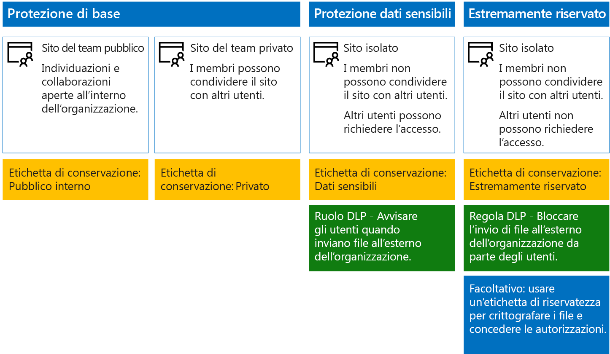

# Proteggere siti e file di SharePoint Online

 **Riepilogo:** suggerimenti di configurazione per proteggere i file in SharePoint Online e Office 365.
  
In questo articolo vengono forniti suggerimenti per la configurazione dei siti del team di SharePoint Online e per la protezione di file che consentono di collaborare in modo semplice pur garantendo alti livelli di sicurezza. In questo articolo vengono definiti quattro tipi di configurazione, a partire da un sito pubblico all'interno dell'organizzazione con i criteri di condivisione più aperti. Ogni configurazione aggiuntiva rappresenta un passaggio significativo per la protezione, ma rende la collaborazione e l'accesso alle risorse più difficile per il set di utenti rilevante. Utilizzare questi suggerimenti come punto di partenza e modificare le configurazioni per soddisfare le esigenze dell'organizzazione. 
  
Le configurazioni descritte in questo articolo sono allineate alle raccomandazioni di Microsoft per i tre livelli di protezione per dati, identità e dispositivi:
  
- Protezione di base
    
- Protezione dati sensibili
    
- Protezione dati altamente riservati
    
Per altre informazioni su questi livelli e sulle funzionalità consigliate per ogni livello, vedere le risorse seguenti. 
  
- [Protezione di dispositivi e identità per Office 365](https://docs.microsoft.com/office365/enterprise/microsoft-cloud-it-architecture-resources#BKMK_O365IDP)
    
- [Soluzioni per la protezione dei file in Office 365](https://docs.microsoft.com/office365/enterprise/microsoft-cloud-it-architecture-resources#BKMK_O365fileprotect)
    
## Panoramica delle funzionalità

I consigli per i siti del team di SharePoint Online si basano su una vasta gamma di funzionalità di Microsoft 365. La figura seguente mostra le configurazioni consigliate per quattro siti del team di SharePoint Online.

Come illustrato nell'esempio:
  
- la protezione di base include due opzioni per i siti del team di SharePoint Online, un sito pubblico e uno privato. I siti pubblici possono essere individuati e sono accessibili da chiunque nell'organizzazione. I siti privati possono essere individuati e sono accessibili solo dai membri del sito. Entrambe le configurazioni del sito consentono la condivisione all'esterno del gruppo. 
    
- I siti per la protezione dei dati sensibili ed estremamente riservati sono siti privati con accesso limitato solo ai membri di gruppi specifici.
    
- Le [etichette di conservazione](labels.md) consentono di classificare i file nei siti. Ogni sito del team di SharePoint Online è configurato in modo da etichettare automaticamente i file delle raccolte di documenti con un'etichetta di conservazione predefinita per il sito. In questo esempio le etichette, che corrispondono alle quattro configurazioni dei siti, sono Internal Public (Pubblico interno), Private (Privato), Sensitive (Dati sensibili) e Highly Confidential (Riservatezza elevata). Gli utenti possono modificare le etichette, ma questa configurazione garantisce che tutti i file ricevano un'etichetta predefinita.
    
- I criteri di [prevenzione della perdita dei dati](data-loss-prevention-policies.md) sono configurati in modo che le etichette di conservazione Sensibile ed Estremamente riservato avvisino o impediscano agli utenti di inviare questi tipi di file all'esterno dell'organizzazione.
    
- Se necessario per lo scenario specifico, è possibile usare le [etichette di riservatezza](sensitivity-labels.md) per proteggere file estremamente riservati con la crittografia e le autorizzazioni. Per i clienti di Azure Information Protection, è possibile usare le etichette di Azure Information Protection nel Centro conformità Microsoft 365 e, qualora si scegliesse di eseguire operazioni di configurazione aggiuntive o avanzate, le etichette saranno sincronizzate con il portale di Azure. Le etichette di Azure Information Protection e le etichette di riservatezza di Office 365 sono completamente compatibili tra loro. Questo significa, ad esempio, che non è necessario riclassificare o etichettare nuovamente contenuti etichettati da Azure Information Protection. Questo livello di protezione non è necessario per tutti i clienti. 
    
## Impostazioni a livello di tenant per SharePoint Online e OneDrive for Business

SharePoint Online e OneDrive for Business includono impostazioni a livello di tenant che influiscono su tutti i siti e gli utenti. Alcune di queste impostazioni possono essere modificate a livello di sito per essere più restrittive (ma non meno restrittive). In questa sezione vengono illustrate le impostazioni a livello di tenant che influiscono su sicurezza e collaborazione. 
  
### Condivisione

Per questa soluzione, è consigliabile usare le seguenti impostazioni a livello di tenant:
  
- Mantenere il criterio di condivisione predefinito che consente la condivisione completa, inclusa quella anonima, con tutti i tipi di account.
    
- Impostare la scadenza dei collegamenti anonimi, se desiderato.
    
- Modificare il tipo di collegamento predefinito per la condivisione in Dati interni. Ciò consente di impedire la perdita accidentale dei dati all'esterno dell'organizzazione.
    
Consentire la condivisione esterna potrebbe sembrare poco intuitivo, tuttavia, tale approccio fornisce maggiore controllo sulla condivisione dei file rispetto all'invio di file tramite posta elettronica. SharePoint Online e Outlook interagiscono per fornire esperienze di collaborazione sui file protetta. 
  
- Per impostazione predefinita, Outlook condivide un collegamento a un file anziché inviare il file in un messaggio di posta elettronica. 
    
- SharePoint Online e OneDrive for Business facilitano la condivisione dei collegamenti ai file con i collaboratori interni ed esterni all'organizzazione
    
L'utente, inoltre, dispone di controlli utili per gestire la condivisione esterna. Ad esempio, è possibile:
  
- Disabilitare un collegamento guest anonimo.
    
- Revocare l'accesso utente a un sito.
    
- Vedere chi ha accesso a un documento o un sito specifico.
    
- Impostare i collegamenti di condivisione anonimi in modo che abbiano una scadenza (impostazione del tenant).
    
- Limitare gli utenti che possono condividere all'esterno dell'organizzazione (impostazione del tenant).
    
### Usare la condivisione esterna con la prevenzione della perdita di dati

Se non si consente la condivisione esterna, gli utenti con esigenze aziendali troveranno strumenti e metodi alternativi. Microsoft consiglia di combinare la condivisione esterna con i criteri di prevenzione della perdita di dati per proteggere i file sensibili e altamente riservati.
  
### Impostazioni di accesso dispositivo

Le impostazioni di accesso dispositivo per SharePoint Online e OneDrive for Business consentono di determinare se l'accesso è limitato solo al browser (non è possibile scaricare i file) o se l'accesso è bloccato. Per altre informazioni, vedere [Controllare l'accesso da dispositivi non gestiti](https://docs.microsoft.com/it-IT/sharepoint/control-access-from-unmanaged-devices). 

Per usare impostazioni di accesso dispositivo con i criteri di accesso condizionale consigliati in Azure Active Directory, vedere [Suggerimenti sui criteri per la protezione di siti e file di SharePoint](https://docs.microsoft.com/it-IT/microsoft-365/enterprise/sharepoint-file-access-policies).
  
### OneDrive for Business

Visitare queste impostazioni per decidere se modificare le impostazioni predefinite per i siti OneDrive for Business. Attualmente, le impostazioni di condivisione e di accesso al dispositivo vengono duplicate dall'interfaccia di amministrazione di SharePoint Online e vengono applicate in entrambi gli ambienti.
  
## Configurazione del sito del team di SharePoint

La tabella seguente contiene il riepilogo delle operazioni di configurazione per ognuno dei siti del team descritti in precedenza in questo articolo. Utilizzare queste configurazioni come suggerimenti da cui partire per modificare i tipi di siti in modo da soddisfare le esigenze dell'organizzazione. Non tutte le organizzazioni necessitano di tutti i tipi di siti. Solo un numero limitato di organizzazioni richiedono una protezione estremamente riservata.
  
||||||
|:-----|:-----|:-----|:-----|:-----|
||**Protezione di base 1**   |**Protezione di base 2**   |**Protezione dati sensibili**   |**Riservatezza elevata**   |
|Descrizione    |Individuazione e collaborazione aperte all'interno dell'organizzazione.    |Sito privato e gruppo con condivisione consentita all'esterno del gruppo.    |Sito isolato, in cui i livelli di accesso sono definiti dall'appartenenza a gruppi specifici. La condivisione è consentita solo ai membri del sito. La prevenzione della perdita di dati avvisa gli utenti quando tentano di inviare file all'esterno dell'organizzazione.    |Sito isolato + crittografia dei file e autorizzazioni con Azure Information Protection. La prevenzione della perdita dei dati impedisce agli utenti di inviare file all'esterno dell'organizzazione.    |
|Sito del team privato o pubblico    |Pubblico    |Private    |Private    |Private    |
|Chi può accedere?    |Tutti gli utenti dell'organizzazione, inclusi gli utenti B2B e gli utenti guest.    |Solo i membri del sito. Altri utenti possono richiedere l'accesso.    |Solo i membri del sito. Altri utenti possono richiedere l'accesso.    |Solo i membri. Altri utenti non possono richiedere l'accesso.    |
|Controlli di condivisione a livello di sito    |Condivisione consentita con chiunque. Impostazioni predefinite.    |Condivisione consentita con chiunque. Impostazioni predefinite.    |I membri non possono condividere l'accesso al sito.    I non membri possono richiedere l'accesso al sito, ma tali richieste devono essere gestite da un amministratore del sito.    |I membri non possono condividere l'accesso al sito.    I non membri non possono richiedere l'accesso al sito o ai contenuti.    |
|Controlli di accesso dispositivo a livello di sito    |Nessun controllo aggiuntivo.    |Nessun controllo aggiuntivo.    |I controlli a livello di sito saranno disponibili a breve e impediranno agli utenti di scaricare file su dispositivi collegati non compatibili o non di dominio. Ciò consente di accedere solo al browser da tutti gli altri dispositivi.    |Controlli a livello di sito, presto disponibili, impediscono agli utenti di scaricare file su dispositivi collegati non compatibili o non appartenenti al dominio.    |
|Etichette di conservazione    |Pubblico di livello interno    |Private    |Dati sensibili    |Highly Confidential (Riservatezza elevata)    |
|Criteri di prevenzione della perdita di dati (DLP)    |||Gli utenti vengono avvisati se inviano file con etichetta Sensitive (Dati sensibili) all'esterno dell'organizzazione.    Per bloccare la condivisione esterna di tipi di dati riservati, ad esempio numeri di carta di credito o altri dati personali, è possibile configurare criteri DLP aggiuntivi per questi tipi di dati (inclusi i tipi di dati personalizzati che è necessario configurare).    |Bloccare l'invio di file contrassegnati come estremamente riservati all'esterno dell'organizzazione da parte degli utenti. Consentire agli utenti di sostituire questa impostazione specificando giustificazioni, inclusa l'informazione sugli utenti con cui si condivide il file.    |
|Etichette di riservatezza    ||||Usare le etichette di riservatezza per crittografare e concedere automaticamente le autorizzazioni per i file. Le etichette di riservatezza usano Azure Information Protection per crittografare i file. Questa protezione viaggia con i file in caso di perdita.    Office 365 non può leggere i file crittografati con Azure Information Protection. Inoltre, i criteri DLP possono funzionare solo con i metadati (comprese le etichette), ma non con i contenuti di tali file (ad esempio i numeri di carta di credito all'interno dei file).    |
   
Riguardo ai passaggi da seguire per eseguire la distribuzione dei quattro diversi tipi di siti del team di SharePoint Online in questa soluzione, vedere [Distribuzione dei siti di SharePoint Online per tre livelli di protezione ](deploy-sharepoint-online-sites-for-three-tiers-of-protection.md). Per le istruzioni riguardanti la creazione di un ambiente di sviluppo/test, vedere [Proteggere i siti di SharePoint Online in un ambiente di sviluppo/test](secure-sharepoint-online-sites-in-a-dev-test-environment.md). 
  
## Etichette di conservazione di Office 365

L'uso delle etichette di conservazione è consigliato per ambienti con dati sensibili. Dopo aver configurato e pubblicato le etichette di conservazione:
  
- È possibile applicare un'etichetta predefinita a una raccolta documenti in un sito del team di SharePoint Online, in modo che tutti i documenti nella raccolta dispongano di un'etichetta predefinita. 
    
- È possibile applicare automaticamente etichette al contenuto se questo soddisfa le condizioni specifiche.
    
- È possibile applicare criteri di prevenzione della perdita dei dati che si basano sulle etichette di conservazione.
    
- Gli utenti dell'organizzazione possono applicare manualmente un'etichetta al contenuto in Outlook sul web, Outlook 2010 e versioni successive, OneDrive for Business, SharePoint Online e gruppi di Office 365. Gli utenti, spesso, conoscono al meglio il tipo di contenuto cui stanno lavorando, pertanto possono classificarlo e applicarvi i criteri DLP appropriati.
    

  
Come indica l'illustrazione, questa soluzione include la creazione delle etichette di conservazione seguenti:
  
- Highly Confidential (Riservatezza elevata)
    
- Dati sensibili
    
- Private
    
- Pubblico di livello interno
    
Queste etichette vengono mappate ai siti consigliati in illustrazioni e grafici presenti nelle sezioni precedenti di questo articolo. In questa soluzione viene consigliato di configurare i criteri DLP per impedire la perdita di file contrassegnati come sensibili ed estremamente riservati.
  
Per la procedura di configurazione delle etichette di conservazione e dei criteri di prevenzione della perdita dei dati in questa soluzione, vedere [Proteggere i file di SharePoint Online con le etichette di conservazione e la prevenzione della perdita dei dati](protect-sharepoint-online-files-with-office-365-labels-and-dlp.md).
  
## Etichette di riservatezza 

Se necessario per lo scenario di sicurezza specifico, è possibile usare le etichette di riservatezza per applicare le protezioni che seguono i file ovunque vanno. Le etichette di riservatezza nel Centro conformità Microsoft 365 sono uguali alle etichette di Azure Information Protection. Per questa soluzione, si consiglia di usare criteri di Azure Information Protection con ambito e un'etichetta secondaria dell'etichetta Highly Confidential (Riservatezza elevata) per crittografare e concedere le autorizzazioni per i file che devono essere protetti con il massimo livello di sicurezza. 
  
Tenere presente che quando si applica la crittografia di Azure Information Protection ai file archiviati in Office 365, il servizio non è in grado di elaborare il contenuto di questi file. La creazione condivisa, eDiscovery, la ricerca, Delve e altre funzionalità di collaborazione non funzionano. I criteri di prevenzione della perdita dei dati funzionano solo con i metadati, incluse le etichette di conservazione, ma non con il contenuto dei file, ad esempio i numeri di carta di credito all'interno dei file.

Per altre informazioni, vedere [Panoramica delle etichette di riservatezza](sensitivity-labels.md).

    
### Aggiunta delle autorizzazioni per gli utenti esterni

Esistono due modi per concedere agli utenti esterni l'accesso ai file protetti con Azure Information Protection. In entrambi i casi gli utenti esterni devono avere un account Azure AD. Se gli utenti esterni non sono membri di un'organizzazione che usa Azure AD, possono ottenere un account Azure AD come utente singolo da questa pagina di iscrizione: [https://aka.ms/aip-signup](https://aka.ms/aip-signup).
  
- Aggiungere utenti esterni a un gruppo di Azure AD che viene usato per configurare la protezione di un'etichetta
    
     È necessario per prima cosa aggiungere l'account come utente B2B nella propria directory. Il [caching dell'appartenenza a gruppi da parte di Azure Rights Management](https://docs.microsoft.com/information-protection/plan-design/prepare#group-membership-caching-by-azure-rights-management) può richiedere un paio d'ore. Con questo metodo, le autorizzazioni vengono concesse per tutti i file esistenti protetti con l'etichetta, inclusi i file protetti prima dell'aggiunta di un utente al gruppo di Azure AD.
    
- Aggiungere utenti esterni direttamente alla protezione dell'etichetta
    
     È possibile aggiungere tutti gli utenti di un'organizzazione (ad esempio Fabrikam.com), un gruppo di Azure AD (ad esempio, un gruppo dell'amministrazione all'interno di un'organizzazione) o un singolo utente. Ad esempio, è possibile aggiungere un team esterno di autorità della protezione per un'etichetta. Con questo metodo, vengono concesse le autorizzazioni solo ai file protetti con l'etichetta dopo che viene aggiunta un'entità esterna alla protezione.
    
### Distribuzione e uso di Azure Information Protection

Per la procedura di configurazione di Azure Information Protection in questa soluzione, vedere [Proteggere i file di SharePoint Online con Azure Information Protection](protect-sharepoint-online-files-with-azure-information-protection.md).
  
## Vedere anche

[Guida sulla sicurezza Microsoft per organizzazioni che si occupano della campagna politica, no profit e altre organizzazioni agili](microsoft-security-guidance-for-political-campaigns-nonprofits-and-other-agile-o.md)
  
[Adozione del cloud e soluzioni ibride](https://docs.microsoft.com/office365/enterprise/cloud-adoption-and-hybrid-solutions)
  
[Proteggere i siti di SharePoint Online in un ambiente di sviluppo/test](secure-sharepoint-online-sites-in-a-dev-test-environment.md)

