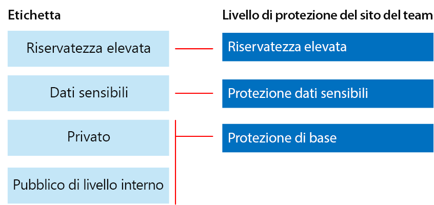
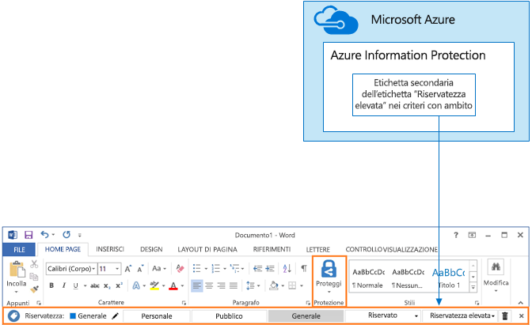

# Proteggere siti e file di SharePoint OnlineSecure SharePoint Online sites and files

 **Riepilogo:** suggerimenti di configurazione per proteggere i file in SharePoint Online e Office 365.**Summary:** Configuration recommendations for protecting files in SharePoint Online and Office 365.
  
In questo articolo vengono forniti suggerimenti per la configurazione dei siti del team di SharePoint Online e per la protezione di file che consentono di collaborare in modo semplice pur garantendo alti livelli di sicurezza. In questo articolo vengono definiti quattro tipi di configurazione, a partire da un sito pubblico all'interno dell'organizzazione con i criteri di condivisione più aperti. Ogni configurazione aggiuntiva rappresenta un passaggio significativo per la protezione, ma rende la collaborazione e l'accesso alle risorse più difficile per il set di utenti rilevante. Utilizzare questi suggerimenti come punto di partenza e modificare le configurazioni per soddisfare le esigenze dell'organizzazione.This article provides recommendations for configuring SharePoint Online team sites and file protection that balances security with ease of collaboration. This article defines four different configurations, starting with a public site within your organization with the most open sharing policies. Each additional configuration represents a meaningful step up in protection, but the ability to access and collaborate on resources is reduced to the relevant set of users. Use these recommendations as a starting point and adjust the configurations to meet the needs of your organization. 
  
Le configurazioni descritte in questo articolo sono allineate alle raccomandazioni di Microsoft per i tre livelli di protezione per dati, identità e dispositivi:The configurations in this article align with Microsoft's recommendations for three tiers of protection for data, identities, and devices:
  
- Protezione di baseBaseline protection
    
- Protezione dati sensibiliSensitive protection
    
- Protezione dati altamente riservatiHighly confidential protection
    
Per altre informazioni su questi livelli e sulle funzionalità consigliate per ogni livello, vedere le risorse seguenti.For more information about these tiers and capabilities recommended for each tier, see the following resources. 
  
- [Protezione di dispositivi e identità per Office 365Identity and Device Protection for Office 365](https://docs.microsoft.com/office365/enterprise/microsoft-cloud-it-architecture-resources#BKMK_O365IDP)
    
- [Soluzioni per la protezione dei file in Office 365File Protection Solutions in Office 365](https://docs.microsoft.com/office365/enterprise/microsoft-cloud-it-architecture-resources#BKMK_O365fileprotect)
    
## Panoramica delle funzionalitàCapability overview

Suggerimenti per il disegno di siti del team di SharePoint Online su un'ampia gamma di funzionalità di Office 365. Per i siti con dati estremamente riservati, è consigliabile Protezione delle informazioni di Azure. Questo è incluso in Enterprise Mobility + Security (EMS).Recommendations for SharePoint Online team sites draw on a variety of Office 365 capabilities. For highly confidential sites, Azure Information Protection is recommended. This is included in Enterprise Mobility + Security (EMS). 
  
La figura seguente mostra le configurazioni consigliate per quattro siti del team di SharePoint Online.The following illustration shows the recommended configurations for four SharePoint Online team sites.

Come illustrato nell'esempio:As illustrated:
  
- la protezione di base include due opzioni per i siti del team di SharePoint Online, un sito pubblico e uno privato. I siti pubblici possono essere individuati e sono accessibili da chiunque nell'organizzazione. I siti privati possono essere individuati e sono accessibili solo dai membri del sito. Entrambe le configurazioni del sito consentono la condivisione all'esterno del gruppo.Baseline protection includes two options for SharePoint Online team sites — a public site and private site. Public sites can be discovered and accessed by anybody in the organization. Private sites can only be discovered and accessed by members of the site. Both of these site configurations allow for sharing outside the group. 
    
- I siti per la protezione dei dati sensibili ed estremamente riservati sono siti privati con accesso limitato solo ai membri di gruppi specifici.Sites for sensitive and highly confidential protection are private sites with access limited only to members of specific groups.
    
- Le etichette di Office 365 permettono di classificare i dati in base al livello di protezione necessario. Tutti i siti del team di SharePoint Online sono configurati per assegnare automaticamente un'etichetta ai file nelle raccolte documenti con un'etichetta predefinita per il sito. Le etichette riportate nell'esempio sono Dati pubblici interni, Dati privati, Dati riservati e Dati estremamente riservati, in corrispondenza delle quattro configurazioni del sito. Gli utenti possono modificare le etichette, ma grazie a questa configurazione tutti i file ricevono un'etichetta predefinita.Office 365 labels provide a way to classify data with a needed protection level. Each of the SharePoint Online team sites are configured to automatically label files in document libraries with a default label for the site. Corresponding to the four site configurations, the labels in this example are Internal Public, Private, Sensitive, and Highly Confidential. Users can change the labels, but this configuration ensures all files receive a default label.
    
- I criteri di prevenzione della perdita dei dati sono configurati affinché le etichette di Office 365 Riservati ed Estremamente riservati avvisino o impediscano agli utenti quando provano a inviare questi tipi di file all'esterno dell'organizzazioneData loss prevention (DLP) policies are configured for the Sensitive and Highly Confidential Office 365 labels to either warn or prevent users when they attempt to send these types of files outside the organization.
    
- Se necessario per lo scenario specifico, è possibile utilizzare Azure Information Protection per crittografare e concedere autorizzazioni ai file estremamente riservati. Questa possibilità non è consigliata per tutti i clienti.If needed for your scenario, you can use Azure Information Protection to encrypt and grants permissions to files that are highly confidential. This is not recommended for all customers.
    
## Impostazioni a livello di tenant per SharePoint Online e OneDrive for BusinessTenant-wide settings for SharePoint Online and OneDrive for Business

SharePoint Online e OneDrive for Business includono impostazioni a livello di tenant che influiscono su tutti i siti e gli utenti. Alcune di queste impostazioni possono essere modificate a livello di sito per essere più restrittive (ma non meno restrittive). In questa sezione vengono illustrate le impostazioni a livello di tenant che influiscono su sicurezza e collaborazione.SharePoint Online and OneDrive for Business include tenant-wide settings that affect all sites and users. Some of these settings can also be adjusted at the site level to be more restrictive (but not less). This section discusses tenant-wide settings that affect security and collaboration. 
  
### CondivisioneSharing

Per questa soluzione, è consigliabile usare le seguenti impostazioni a livello di tenant:For this solution, we recommend the following tenant-wide settings:
  
- Mantenere il criterio di condivisione predefinito che consente la condivisione completa, inclusa quella anonima, con tutti i tipi di account.Keep the default sharing policy that allows all sharing with all account types, including anonymous sharing.
    
- Impostare la scadenza dei collegamenti anonimi, se desiderato.Set anonymous links to expire, if desired.
    
- Modificare il tipo di collegamento predefinito per la condivisione in Dati interni. Ciò consente di impedire la perdita accidentale dei dati all'esterno dell'organizzazione.Change the default link type for sharing to Internal. This helps prevent accidental data leakage outside your organization.
    
Consentire la condivisione esterna potrebbe sembrare poco intuitivo, tuttavia, tale approccio fornisce maggiore controllo sulla condivisione dei file rispetto all'invio di file tramite posta elettronica. SharePoint Online e Outlook interagiscono per fornire esperienze di collaborazione sui file protetta.While it might seem counterintuitive to allow external sharing, this approach provides more control over file sharing compared to sending files in email. SharePoint Online and Outlook work together to provide secure collaboration on files. 
  
- Per impostazione predefinita, Outlook condivide un collegamento a un file anziché inviare il file in un messaggio di posta elettronica.By default, Outlook shares a link to a file instead of sending the file in email. 
    
- SharePoint Online e OneDrive for Business facilitano la condivisione dei collegamenti ai file con i collaboratori interni ed esterni all'organizzazioneSharePoint Online and OneDrive for Business make it easy to share links to files with contributors who are both inside and outside your organization
    
L'utente, inoltre, dispone di controlli utili per gestire la condivisione esterna. Ad esempio, è possibile:You also have controls to help govern external sharing. For example, you can:
  
- Disabilitare un collegamento guest anonimo.Disable an anonymous guest link.
    
- Revocare l'accesso utente a un sito.Revoke user access to a site.
    
- Vedere chi ha accesso a un documento o un sito specifico.See who has access to a specific site or document.
    
- Impostare i collegamenti di condivisione anonimi in modo che abbiano una scadenza (impostazione del tenant).Set anonymous sharing links to expire (tenant setting).
    
- Limitare gli utenti che possono condividere all'esterno dell'organizzazione (impostazione del tenant).Limit who can share outside your organization (tenant setting).
    
### Usare la condivisione esterna con la prevenzione della perdita di datiUse external sharing together with data loss prevention (DLP)

Se non si consente la condivisione esterna, gli utenti con esigenze aziendali troveranno strumenti e metodi alternativi. Microsoft consiglia di combinare la condivisione esterna con i criteri di prevenzione della perdita di dati per proteggere i file sensibili e altamente riservati.If you don't allow external sharing, users with a business need will find alternate tools and methods. Microsoft recommends you combine external sharing with DLP policies to protect sensitive and highly confidential files.
  
### Impostazioni di accesso dispositivoDevice access settings

Le impostazioni di accesso dispositivo per SharePoint Online e OneDrive for Business consentono di determinare se l'accesso è limitato solo al browser (non è possibile scaricare i file) o se l'accesso è bloccato. Queste impostazioni sono attualmente nella prima versione e si applicano a livello di tenant. Sarà presto disponibile la possibilità di configurare i criteri di accesso dispositivo a livello di sito. Per questa soluzione, è consigliabile non usare impostazioni di accesso dispositivo valide a livello di tenant.Device access settings for SharePoint Online and OneDrive for Business let you determine whether access is limited to browser only (files can't be downloaded) or if access is blocked. These settings are currently in First Release and apply tenant-wide. Coming soon is the ability to configure device access policies at the site level. For this solution, we recommend not using device access settings that apply tenant-wide.
  
Per usare le impostazioni di accesso dispositivo mentre sono nella prima versione: [Impostare le opzioni Standard o First Release in Office 365](https://support.office.com/article/Set-up-the-Standard-or-First-Release-options-in-Office-365-3B3ADFA4-1777-4FF0-B606-FB8732101F47).To use device access settings while these are in first release: [Set up the Standard or First Release Options in Office 365](https://support.office.com/article/Set-up-the-Standard-or-First-Release-options-in-Office-365-3B3ADFA4-1777-4FF0-B606-FB8732101F47).
  
### OneDrive for BusinessOneDrive for Business

Visitare queste impostazioni per decidere se modificare le impostazioni predefinite per i siti OneDrive for Business. Attualmente, le impostazioni di condivisione e di accesso al dispositivo vengono duplicate dall'interfaccia di amministrazione di SharePoint Online e vengono applicate in entrambi gli ambienti.Visit these settings to decide if you want to change the default settings for OneDrive for Business sites. Currently, the sharing and device access settings are duplicated from the SharePoint Online admin center and apply to both environments.
  
## Configurazione del sito del team di SharePointSharePoint team site configuration

La tabella seguente contiene il riepilogo delle operazioni di configurazione per ognuno dei siti del team descritti in precedenza in questo articolo. Utilizzare queste configurazioni come suggerimenti da cui partire per modificare i tipi di siti in modo da soddisfare le esigenze dell'organizzazione. Non tutte le organizzazioni necessitano di tutti i tipi di siti. Solo un numero limitato di organizzazioni richiedono una protezione estremamente riservata.The following table summarizes the configuration for each of the team sites described earlier in this article. Use these configurations as starting point recommendations and adjust the site types and configurations to meet the needs of your organization. Not every organization needs every type of site. Only a small number of organizations require highly confidential protection.
  
||||||
|:-----|:-----|:-----|:-----|:-----|
||**Protezione di base 1****Baseline protection #1**   |**Protezione di base 2****Baseline protection #2**   |**Protezione dati sensibili****Sensitive protection**   |**Riservatezza elevata****Highly confidential**   |
|DescrizioneDescription    |Individuazione e collaborazione aperte all'interno dell'organizzazione.Open discovery and collaboration within the organization.    |Sito privato e gruppo con condivisione consentita all'esterno del gruppo.Private site and group with sharing allowed outside the group.    |Sito isolato, in cui i livelli di accesso sono definiti dall'appartenenza a gruppi specifici. La condivisione è consentita solo ai membri del sito. La prevenzione della perdita di dati avvisa gli utenti quando tentano di inviare file all'esterno dell'organizzazione.Isolated site, in which levels of access are defined by membership in specific groups. Sharing is only allowed to members of the site. DLP warns users when attempting to send files outside the organization.    |Sito isolato + crittografia dei file e autorizzazioni con Azure Information Protection. La prevenzione della perdita dei dati impedisce agli utenti di inviare file all'esterno dell'organizzazione.Isolated site + file encryption and permissions with Azure Information Protection. DLP prevents users from sending files outside the organization.    |
|Sito del team privato o pubblicoPrivate or public team site    |PubblicoPublic    |PrivatePrivate    |PrivatePrivate    |PrivatePrivate    |
|Chi può accedere?Who has access?    |Tutti gli utenti dell'organizzazione, inclusi gli utenti B2B e gli utenti guest.Everybody in the organization, including B2B users and guest users.    |Solo i membri del sito. Altri utenti possono richiedere l'accesso.Members of the site only. Others can request access.    |Solo i membri del sito. Altri utenti possono richiedere l'accesso.Members of the site only. Others can request access.    |Solo i membri. Altri utenti non possono richiedere l'accesso.Members only. Others cannot request access.    |
|Controlli di condivisione a livello di sitoSite-level sharing controls    |Condivisione consentita con chiunque. Impostazioni predefinite.Sharing allowed with anybody. Default settings.    |Condivisione consentita con chiunque. Impostazioni predefinite.Sharing allowed with anybody. Default settings.    |I membri non possono condividere l'accesso al sito.Members cannot share access to the site.    I non membri possono richiedere l'accesso al sito, ma tali richieste devono essere gestite da un amministratore del sito.Non-members can request access to the site, but these requests need to be addressed by a site administrator.    |I membri non possono condividere l'accesso al sito.Members cannot share access to the site.    I non membri non possono richiedere l'accesso al sito o ai contenuti.Non-members cannot request access to the site or contents.    |
|Controlli di accesso dispositivo a livello di sitoSite-level device access controls    |Nessun controllo aggiuntivo.No additional controls.    |Nessun controllo aggiuntivo.No additional controls.    |I controlli a livello di sito saranno disponibili a breve e impediranno agli utenti di scaricare file su dispositivi collegati non compatibili o non di dominio. Ciò consente di accedere solo al browser da tutti gli altri dispositivi.Site-level controls are coming soon, which prevents users from downloading files to non-compliant or non-domain joined devices. This allows browser-only access from all other devices.    |Controlli a livello di sito, presto disponibili, impediscono agli utenti di scaricare file su dispositivi collegati non compatibili o non appartenenti al dominio.Site-level controls are coming soon, which blocks downloading of files to non-compliant or non-domain joined devices.    |
|Etichette di Office 365Office 365 labels    |Internal PublicInternal Public    |PrivatePrivate    |Dati sensibiliSensitive    |Highly Confidential (Riservatezza elevata)Highly Confidential    |
|Criteri di prevenzione della perdita di dati (DLP)DLP policies    |||Gli utenti vengono avvisati se inviano file con etichetta Sensitive (Dati sensibili) all'esterno dell'organizzazione.Warn users when sending files that are labeled as Sensitive outside the organization.    Per bloccare la condivisione esterna di tipi di dati riservati, ad esempio numeri di carta di credito o altri dati personali, è possibile configurare criteri DLP aggiuntivi per questi tipi di dati (inclusi i tipi di dati personalizzati che è necessario configurare).To block external sharing of sensitive data types, such as credit card numbers or other personal data, you can configure additional DLP policies for these data types (including custom data types you configure).    |Bloccare l'invio di file contrassegnati come estremamente riservati all'esterno dell'organizzazione da parte degli utenti. Consentire agli utenti di sostituire questa impostazione specificando giustificazioni, inclusa l'informazione sugli utenti con cui si condivide il file.Block users from sending files that are labeled as highly confidential outside organization. Allow users to override this by providing justification, including who they are sharing the file with.    |
|Azure Information ProtectionAzure Information Protection    ||||Utilizzare Azure Information Protection per crittografare automaticamente i file e concedere autorizzazioni per essi. Questo tipo di protezione viaggia con i file in caso di perdita.Use Azure Information Protection to automatically encrypt and grant permissions to files. This protection travels with the files in case they are leaked.    Office 365 non può leggere i file crittografati con Azure Information Protection. Inoltre, i criteri DLP possono funzionare solo con i metadati (comprese le etichette), ma non con i contenuti di tali file (ad esempio i numeri di carta di credito all'interno dei file).Office 365 cannot read files encrypted with Azure Information Protection. Additionally, DLP policies can only work with the metadata (including labels) but not the contents of these files (such as credit card numbers within files).    |
   
Riguardo ai passaggi da seguire per eseguire la distribuzione dei quattro diversi tipi di siti del team di SharePoint Online in questa soluzione, vedere [Distribuzione dei siti di SharePoint Online per tre livelli di protezione ](deploy-sharepoint-online-sites-for-three-tiers-of-protection.md). Per le istruzioni riguardanti la creazione di un ambiente di sviluppo/test, vedere [Proteggere i siti di SharePoint Online in un ambiente di sviluppo/test](secure-sharepoint-online-sites-in-a-dev-test-environment.md).For the steps to deploy the four different types of SharePoint Online team sites in this solution, see [Deploy SharePoint Online sites for three tiers of protection](deploy-sharepoint-online-sites-for-three-tiers-of-protection.md). For the steps to create a dev/test environment, see [Secure SharePoint Online sites in a dev/test environment](secure-sharepoint-online-sites-in-a-dev-test-environment.md). 
  
## Classificazione ed etichette di Office 365Office 365 classification and labels

Si consiglia di utilizzare le etichette di Office 365 per ambienti con dati riservati. Dopo aver configurato e pubblicato le etichette di Office 365:Using Office 365 labels is recommended for environments with sensitive data. After you configure and publish Office 365 labels:
  
- È possibile applicare un'etichetta predefinita a una raccolta documenti in un sito del team di SharePoint Online, in modo che tutti i documenti nella raccolta dispongano di un'etichetta predefinita.You can apply a default label to a document library in a SharePoint Online team site, so that all documents in that library get the default label. 
    
- È possibile applicare automaticamente etichette al contenuto se questo soddisfa le condizioni specifiche.You can apply labels to content automatically if it matches specific conditions.
    
- È possibile applicare criteri DLP che si basano sulle etichette di Office 365.You can apply DLP policies that are based on Office 365 labels.
    
- Gli utenti dell'organizzazione possono applicare manualmente un'etichetta al contenuto in Outlook sul web, Outlook 2010 e versioni successive, OneDrive for Business, SharePoint Online e gruppi di Office 365. Gli utenti, spesso, conoscono al meglio il tipo di contenuto cui stanno lavorando, pertanto possono classificarlo e applicarvi i criteri DLP appropriati.People in your organization can apply a label manually to content in Outlook on the web, Outlook 2010 and later, OneDrive for Business, SharePoint Online, and Office 365 groups. Users often know best what type of content they're working with, so they can classify it and have the appropriate DLP policy applied.
    

  
Come indica l'illustrazione, questa soluzione include la creazione delle etichette seguenti:As illustrated, this solution includes creating the following labels:
  
- Highly Confidential (Riservatezza elevata)Highly Confidential
    
- Dati sensibiliSensitive
    
- PrivatePrivate
    
- Pubblico di livello internoInternal Public
    
Queste etichette vengono mappate ai siti consigliati in illustrazioni e grafici presenti nelle sezioni precedenti di questo articolo. In questa soluzione viene consigliato di configurare i criteri DLP per impedire la perdita di file contrassegnati come sensibili ed estremamente riservati.These labels are mapped to the recommended sites in the illustrations and charts earlier in this article. This solution recommends configuring DLP policies to help prevent the leakage of files labeled as Sensitive and Highly Confidential.
  
Per la procedura di configurazione delle etichette di Office 365 e dei criteri di prevenzione della perdita di dati in questa soluzione, vedere [Proteggere i file di SharePoint Online con le etichette di Office 365 e DLP](protect-sharepoint-online-files-with-office-365-labels-and-dlp.md).For the steps to configure Office 365 labels and DLP policies in this solution, see [Protect SharePoint Online files with Office 365 labels and DLP](protect-sharepoint-online-files-with-office-365-labels-and-dlp.md).
  
## Azure Information ProtectionAzure Information Protection

Se garantite per lo scenario di sicurezza, è possibile usare Azure Information Protection per applicare le etichette e le protezioni che seguono i file ovunque vanno. Le etichette di Azure Information Protection sono diverse da quelle di Office 365. Per questa soluzione, si consiglia di usare criteri di Azure Information Protection con ambito e un'etichetta secondaria dell'etichetta Highly Confidential (Riservatezza elevata) per crittografare e concedere le autorizzazioni per i file che devono essere protetti con il massimo livello di sicurezza.If warranted for your security scenario, you can use Azure Information Protection to apply labels and protections that follow the files wherever they go. Azure Information Protection labels are different than Office 365 labels. For this solution, we recommend you use a scoped Azure Information Protection policy and a sub-label of the Highly Confidential label to encrypt and grant permissions to files that need to be protected with the highest level of security. 
  
Tenere presente che quando si applica la crittografia di Azure Information Protection ai file archiviati in Office 365, il servizio non è in grado di elaborare il contenuto di questi file. La creazione condivisa, eDiscovery, la ricerca, Delve e altre funzionalità di collaborazione non funzionano. I criteri DLP funzionano solo con i metadati, incluse le etichette di Office 365, ma non con il contenuto dei file, ad esempio i numeri di carta di credito all'interno dei file.Be aware that when Azure Information Protection encryption is applied to files stored in Office 365, the service cannot process the contents of these files. Co-authoring, eDiscovery, search, Delve, and other collaborative features do not work. DLP policies can only work with the metadata (including Office 365 labels) but not the contents of these files (such as credit card numbers within files).
  

  
Come illustrato nell'esempio:As illustrated:
  
- I criteri e le etichette di Azure Information Protection vengono configurati nel portale di Microsoft Azure. È consigliabile configurare un'etichetta secondaria di criteri di Azure Information Protection con ambito.You configure Azure Information Protection policies and labels in the Microsoft Azure portal. Configuring a sub-label of a scoped Azure Information Protection policy is recommended.
    
- Le etichette di Azure Information Protection sono visualizzate in una barra **Information Protection** nelle applicazioni di Office.Azure Information Protection labels show up as an **Information protection** bar in Office applications.
    
### Aggiunta delle autorizzazioni per gli utenti esterniAdding permissions for external users

Esistono due modi per concedere agli utenti esterni l'accesso ai file protetti con Azure Information Protection. In entrambi i casi gli utenti esterni devono avere un account Azure AD. Se gli utenti esterni non sono membri di un'organizzazione che usa Azure AD, possono ottenere un account Azure AD come utente singolo da questa pagina di iscrizione: [https://aka.ms/aip-signup](https://aka.ms/aip-signup).There are two ways you can grant external users access to files protected with Azure Information Protection. In both these cases, external users must have an Azure AD account. If external users aren't members of an organization that uses Azure AD, they can obtain an Azure AD account as an individual by using this sign-up page: [https://aka.ms/aip-signup](https://aka.ms/aip-signup).
  
- Aggiungere utenti esterni a un gruppo di Azure AD che viene usato per configurare la protezione di un'etichettaAdd external users to an Azure AD group that is used to configure protection for a label
    
     È necessario per prima cosa aggiungere l'account come utente B2B nella propria directory. Il [caching dell'appartenenza a gruppi da parte di Azure Rights Management](https://docs.microsoft.com/information-protection/plan-design/prepare#group-membership-caching-by-azure-rights-management) può richiedere un paio d'ore. Con questo metodo, le autorizzazioni vengono concesse per tutti i file esistenti protetti con l'etichetta, inclusi i file protetti prima dell'aggiunta di un utente al gruppo di Azure AD.You'll need to first add the account as a B2B user in your directory. It can take a couple of hours for [group membership caching by Azure Rights Management](https://docs.microsoft.com/information-protection/plan-design/prepare#group-membership-caching-by-azure-rights-management). With this method, permissions are granted to all existing files protected with the label (even files protected before a user is added to the Azure AD group).
    
- Aggiungere utenti esterni direttamente alla protezione dell'etichettaAdd external users directly to the label protection
    
     È possibile aggiungere tutti gli utenti di un'organizzazione (ad esempio Fabrikam.com), un gruppo di Azure AD (ad esempio, un gruppo dell'amministrazione all'interno di un'organizzazione) o un singolo utente. Ad esempio, è possibile aggiungere un team esterno di autorità della protezione per un'etichetta. Con questo metodo, vengono concesse le autorizzazioni solo ai file protetti con l'etichetta dopo che viene aggiunta un'entità esterna alla protezione.You can add all users from an organization (e.g. Fabrikam.com), an Azure AD group (such as a finance group within an organization), or an individual user. For example, you can add an external team of regulators to the protection for a label. With this method, permissions are granted only to files protected with the label after the external entity is added to the protection.
    
### Distribuzione e uso di Azure Information ProtectionDeploying and using Azure Information Protection

Per la procedura di configurazione di Azure Information Protection in questa soluzione, vedere [Proteggere i file di SharePoint Online con Azure Information Protection](protect-sharepoint-online-files-with-azure-information-protection.md).For the steps to configure Azure Information Protection in this solution, see [Protect SharePoint Online files with Azure Information Protection](protect-sharepoint-online-files-with-azure-information-protection.md).
  
## Vedere ancheSee Also

[Guida sulla sicurezza Microsoft per organizzazioni che si occupano della campagna politica, no profit e altre organizzazioni agiliMicrosoft Security Guidance for Political Campaigns, Nonprofits, and Other Agile Organizations](microsoft-security-guidance-for-political-campaigns-nonprofits-and-other-agile-o.md)
  
[Adozione del cloud e soluzioni ibrideCloud adoption and hybrid solutions](https://docs.microsoft.com/office365/enterprise/cloud-adoption-and-hybrid-solutions)
  
[Proteggere i siti di SharePoint Online in un ambiente di sviluppo/testSecure SharePoint Online sites in a dev/test environment](secure-sharepoint-online-sites-in-a-dev-test-environment.md)

