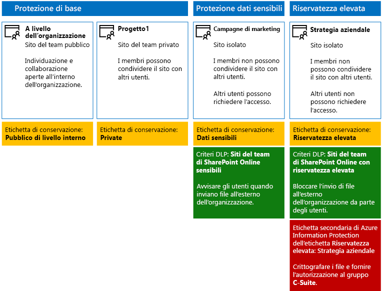
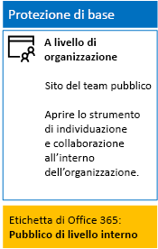
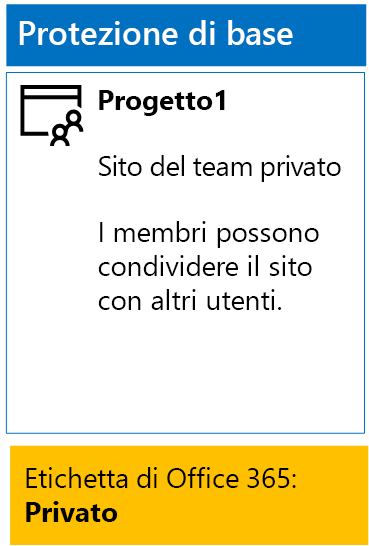
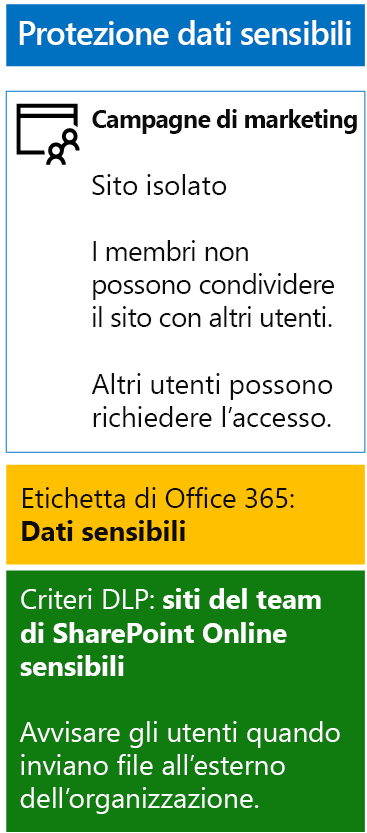
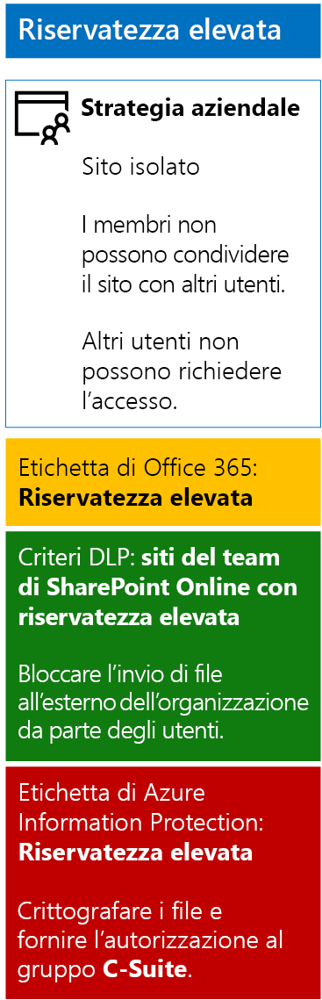

# <a name="secure-sharepoint-online-sites-in-a-devtest-environment"></a>Proteggere i siti di SharePoint Online in un ambiente di sviluppo/test

 **Riepilogo:** creare siti del team di SharePoint Online pubblici, privati, riservati ed estremamente riservati in un ambiente di sviluppo/test.
  
Questo articolo contiene istruzioni dettagliate per la creazione di un ambiente di sviluppo e test che includa i quattro tipi diversi di sito del team di SharePoint Online per la [soluzione di protezione di siti e file di SharePoint Online](secure-sharepoint-online-sites-and-files.md).
  

  
Usare questo ambiente di sviluppo e test per sperimentare i comportamenti della protezione delle informazioni e ottimizzare le impostazioni in base alle esigenze specifiche prima di distribuire siti del team di SharePoint Online nell'ambiente di produzione.
  
## <a name="phase-1-create-your-devtest-environment"></a>Fase 1: Creare l'ambiente di sviluppo/test

In questa fase si ottengono le sottoscrizioni di valutazione per Office 365 ed Enterprise Mobility + Security per un'organizzazione fittizia.
  
Per prima cosa, seguire le istruzioni della **fase 2** nell'articolo relativo all'[ambiente di sviluppo/test di Office 365](https://docs.microsoft.com/office365/enterprise/office-365-dev-test-environment).
  
Iscriversi quindi per la sottoscrizione di valutazione di EMS e aggiungerla alla stessa organizzazione della sottoscrizione di prova di Office 365.
  
1. Se necessario, accedere al portale di Office 365 con le credenziali dell'account amministratore globale della sottoscrizione di valutazione. Per informazioni, vedere [Dove accedere a Office 365](https://support.office.com/Article/Where-to-sign-in-to-Office-365-e9eb7d51-5430-4929-91ab-6157c5a050b4).
    
2. Fare clic sul riquadro **Amministratore**.
    
3. Nella scheda **Interfaccia di amministrazione di Office** del browser fare clic su **Fatturazione > Servizi di acquisto** nel riquadro di spostamento di sinistra.
    
4. Nella pagina **Acquisto di servizi**, individuare la voce **Enterprise Mobility + Security E5**. Posizionare il puntatore del mouse su di essa e fare clic su **Avvia la versione di valutazione gratuita**.
    
5. Nella pagina **Conferma l'ordine**, fare clic su **Prova adesso**.
    
6. Nella pagina **Ricevuta ordine** fare clic su **Continua**.
    
Abilitare quindi la licenza Enterprise Mobility + Security E5 per l'account amministratore globale.
  
1. Nella scheda **Interfaccia di amministrazione di Office 365** del browser fare clic su **Utenti > Utenti attivi** nel riquadro di spostamento di sinistra.
    
2. Fare clic sull'account amministratore globale e quindi su **Modifica** per le **licenze del prodotto**.
    
3. Nel riquadro **Licenze per i prodotti**, impostare la licenza per i prodotti di **Enterprise Mobility + Security E5** su **Attiva**, fare clic su **Salva** e quindi fare doppio clic su **Chiudi**.
    
## <a name="phase-2-create-and-configure-your-azure-active-directory-ad-groups-and-users"></a>Fase 2: Creare e configurare i gruppi e gli utenti di Azure Active Directory (AD)

In questa fase vengono creati e configurati i gruppi e gli utenti di Azure AD per l'organizzazione fittizia.
  
Innanzitutto, creare un set di gruppi per un'organizzazione tipica con il portale di Azure.
  
1. Creare una scheda separata nel browser, quindi passare al portale di Azure all'indirizzo [https://portal.azure.com](https://portal.azure.com). Se necessario, accedere con le credenziali dell'account amministratore globale della sottoscrizione di valutazione di Office 365 E5.
    
2. Nel portale di Azure fare clic su **Azure Active Directory > Gruppi**.
    
3. Nel pannello **Gruppi - Tutti i gruppi** fare clic su **+ Nuovo gruppo**.
    
4. Nel pannello **Gruppo**:
    
  - Selezionare **Office 365** in **Tipo di gruppo**.
    
  - Digitare **C-Suite** in **Nome**.
    
  - Selezionare **Assegnato** in **Tipo di appartenenza**.
      
5. Fare clic su **Crea** e quindi chiudere il pannello **Gruppo**.
    
6. Ripetere i passaggi da 3 a 5 per i nomi dei gruppi seguenti:
    
  - IT staff
    
  - Research staff
    
  - Regular staff
    
  - Marketing staff
    
  - Sales staff
    
7. Tenere aperta la scheda del portale di Azure nel browser.
    
Successivamente, si configurano le licenze automatiche in modo che ai membri dei gruppi vengano automaticamente assegnate le licenze per le sottoscrizioni di Office 365 ed EMS.
  
1. Nel portale di Azure fare clic su **Azure Active Directory > Licenze > Tutti i prodotti**.
    
2. Nell'elenco, selezionare **Enterprise Mobility + Security E5** e **Office 365 Enterprise E5**, quindi fare clic su **Assegna**.
    
3. Nel pannello **Assegnare licenza** fare clic su **Utenti e gruppi**.
    
4. Nell'elenco dei gruppi selezionare gli elementi seguenti:
    
  - C-Suite
    
  - IT staff
    
  - Research staff
    
  - Regular staff
    
  - Marketing staff
    
  - Personale addetto alle vendite
    
5. Fare clic su **Seleziona**, quindi su **Assegna**.
    
6. Chiudere la scheda del portale di Azure nel browser.
    
È quindi necessario [connettersi al modulo PowerShell di Azure Active Directory V2](https://go.microsoft.com/fwlink/?linkid=842218).
  
Inserire il nome dell'organizzazione, la posizione e una password comune; eseguire quindi questi comandi dal prompt dei comandi di PowerShell o Integrated Script Environment (ISE) per creare account utente e aggiungerli ai rispettivi gruppi:
  
```
$orgName="<organization name, such as contoso for the contoso.onmicrosoft.com trial subscription domain name>"
$location="<the ISO ALPHA2 country code, such as US for the United States>"
$commonPassword="<common password for all the new accounts>"

$PasswordProfile=New-Object -TypeName Microsoft.Open.AzureAD.Model.PasswordProfile
$PasswordProfile.Password=$commonPassword

$groupName="C-Suite"
$userNames=@("CEO","CFO","CIO") 
$groupID=(Get-AzureADGroup | Where { $_.DisplayName -eq $groupName }).ObjectID
ForEach ($element in $userNames){ 
New-AzureADUser -DisplayName $element -PasswordProfile $PasswordProfile -UserPrincipalName ($element + "@" + $orgName + ".onmicrosoft.com") -AccountEnabled $true -MailNickName $element -UsageLocation $location 
Add-AzureADGroupMember -RefObjectId (Get-AzureADUser | Where { $_.DisplayName -eq $element }).ObjectID -ObjectId $groupID
}
$groupName="IT staff"
$userNames=@("ITAdmin1","ITAdmin2") 
$groupID=(Get-AzureADGroup | Where { $_.DisplayName -eq $groupName }).ObjectID
ForEach ($element in $userNames){ 
New-AzureADUser -DisplayName $element -PasswordProfile $PasswordProfile -UserPrincipalName ($element + "@" + $orgName + ".onmicrosoft.com") -AccountEnabled $true -MailNickName $element -UsageLocation $location 
Add-AzureADGroupMember -RefObjectId (Get-AzureADUser | Where { $_.DisplayName -eq $element }).ObjectID -ObjectId $groupID
}
$groupName="Research staff"
$userNames=@("Researcher1") 
$groupID=(Get-AzureADGroup | Where { $_.DisplayName -eq $groupName }).ObjectID
ForEach ($element in $userNames){ 
New-AzureADUser -DisplayName $element -PasswordProfile $PasswordProfile -UserPrincipalName ($element + "@" + $orgName + ".onmicrosoft.com") -AccountEnabled $true -MailNickName $element -UsageLocation $location 
Add-AzureADGroupMember -RefObjectId (Get-AzureADUser | Where { $_.DisplayName -eq $element }).ObjectID -ObjectId $groupID
}
$groupName="Regular staff"
$userNames=@("Regular1", "Regular2") 
$groupID=(Get-AzureADGroup | Where { $_.DisplayName -eq $groupName }).ObjectID
ForEach ($element in $userNames){ 
New-AzureADUser -DisplayName $element -PasswordProfile $PasswordProfile -UserPrincipalName ($element + "@" + $orgName + ".onmicrosoft.com") -AccountEnabled $true -MailNickName $element -UsageLocation $location 
Add-AzureADGroupMember -RefObjectId (Get-AzureADUser | Where { $_.DisplayName -eq $element }).ObjectID -ObjectId $groupID
}
$groupName="Marketing staff"
$userNames=@("Marketing1", "Marketing2") 
$groupID=(Get-AzureADGroup | Where { $_.DisplayName -eq $groupName }).ObjectID
ForEach ($element in $userNames){ 
New-AzureADUser -DisplayName $element -PasswordProfile $PasswordProfile -UserPrincipalName ($element + "@" + $orgName + ".onmicrosoft.com") -AccountEnabled $true -MailNickName $element -UsageLocation $location 
Add-AzureADGroupMember -RefObjectId (Get-AzureADUser | Where { $_.DisplayName -eq $element }).ObjectID -ObjectId $groupID
}
$groupName="Sales staff"
$userNames=@("SalesPerson1") 
$groupID=(Get-AzureADGroup | Where { $_.DisplayName -eq $groupName }).ObjectID
ForEach ($element in $userNames){ 
New-AzureADUser -DisplayName $element -PasswordProfile $PasswordProfile -UserPrincipalName ($element + "@" + $orgName + ".onmicrosoft.com") -AccountEnabled $true -MailNickName $element -UsageLocation $location 
Add-AzureADGroupMember -RefObjectId (Get-AzureADUser | Where { $_.DisplayName -eq $element }).ObjectID -ObjectId $groupID
}
```

> [!NOTE]
> L'utilizzo di una password comune in questo caso è per rendere automatica e facile la configurazione per un ambiente di sviluppo/test. Non è una scelta consigliata per sottoscrizioni di produzione. 
  
Seguire questi passaggi per verificare che le licenze basate su gruppo funzionino correttamente.
  
1. Dalla scheda **Microsoft Office Home** del browser fare clic sul riquadro **Amministratore**.
    
2. Dalla nuova scheda **Interfaccia di amministrazione di Office** del browser fare clic su **Utenti**.
    
3. Fare clic su **CEO** nell'elenco degli utenti.
    
4. Nel riquadro in cui sono elencate le proprietà dell'account utente **CEO** verificare che all'account siano state assegnate le licenze **Enterprise Mobility + Security E5** e **Office 365 Enterprise E5** (nell'elenco delle **licenze del prodotto**).
    
## <a name="phase-3-create-office-365-labels"></a>Fase 3: Creare le etichette di Office 365

In questa fase vengono create le etichette per i diversi livelli di sicurezza per cartelle di documenti dei siti del team di SharePoint Online.
  
1. Se necessario, usare un'istanza privata del browser Internet e accedere al portale di Office 365 con l'account amministratore globale della sottoscrizione di valutazione di Office 365 E5. Per informazioni, vedere [Dove accedere a Office 365](https://support.office.com/Article/Where-to-sign-in-to-Office-365-e9eb7d51-5430-4929-91ab-6157c5a050b4).
    
2. Dalla scheda **Microsoft Office Home** fare clic sul riquadro **Amministratore**.
    
3. Dalla nuova scheda **Interfaccia di amministrazione di Office** del browser fare clic su **Interfacce di amministrazione > Sicurezza e conformità**.
    
4. Dalla nuova scheda **Home: Sicurezza e conformità** del browser fare clic su Classificazioni > Etichette.
    
5. Nel riquadro **Home > Etichette**, fare clic sulla scheda **Conservazione** e quindi su **Crea un'etichetta**.
    
6. Nel riquadro **Name your label** (Denomina l'etichetta) digitare **Internal Public**, quindi fare clic su **Avanti**.
    
7. Nel riquadro **Label settings** (Importazioni etichetta) fare clic su **Avanti**.
    
8. Nel riquadro **Verifica le impostazioni** fare clic su **Crea questa etichetta** e fare clic su **Chiudi**.
    
9. Ripetere i passaggi 5-8 per queste etichette aggiuntive:
    
  - Private
    
  - Dati sensibili
    
  - Highly Confidential (Riservatezza elevata)
    
10. Dal riquadro **Home > Etichette** fare clic su **Publish labels** (Pubblica etichette).
    
11. Nel riquadro **Choose labels to publish** (Scegli etichette da pubblicare) fare clic su **Choose labels to publish** (Scegli etichette da pubblicare).
    
12. Nel riquadro **Choose labels** (Scegli etichette) fare clic su **Aggiungi** e selezionare le quattro etichette.
    
13. Fare clic su **Fine**.
    
14. Nel riquadro **Choose labels to publish** (Scegli etichette da pubblicare) fare clic su **Avanti**.
    
15. Nel riquadro **Choose locations** (Scegli posizioni) fare clic su **Avanti**.
    
16. Nel riquadro **Denomina il criterio** digitare **Example organization** in **Nome**, quindi fare clic su **Avanti**.
    
17. Nel riquadro **Verifica le impostazioni** fare clic su **Publish labels** (Pubblica etichette), quindi fare clic su **Chiudi**.
    
## <a name="phase-4-create-your-sharepoint-online-team-sites"></a>Fase 4: creare i siti del team di SharePoint Online

In questa fase vengono creati e configurati i quattro tipi di siti del team di SharePoint Online per l'organizzazione di esempio.
  
### <a name="organization-wide-team-site"></a>Sito del team per l'intera organizzazione

Per creare un sito pubblico iniziale per il team di SharePoint Online, eseguire queste operazioni:
  
1. Se necessario, usare un browser sul computer locale e accedere al portale di Office 365 con l'account amministratore globale. Per informazioni, vedere [Dove accedere a Office 365](https://support.office.com/Article/Where-to-sign-in-to-Office-365-e9eb7d51-5430-4929-91ab-6157c5a050b4).
    
2. Nell'elenco dei riquadri fare clic su **SharePoint**.
    
3. Nella nuova scheda **SharePoint** del browser fare clic su + **Crea sito**.
    
4. Nella pagina **Crea un sito** fare clic su **Sito del team**.
    
5. In **Nome sito** digitare **Organization wide**. 
    
6. Come **descrizione del sito del team** digitare **Sito SharePoint per l'intera organizzazione**.
    
7. In **Impostazioni privacy** selezionare **Public – anyone in the organization can access this site** (Pubblico: qualsiasi persona dell'organizzazione può accedere a questo sito) e quindi fare clic su **Avanti**.
    
8. Nel riquadro **Who do you want to add?** (Chi si desidera aggiungere?) fare clic su **Fine**.
    
Configurare quindi la cartella dei documenti del sito del team dell'intera organizzazione per l'etichetta Internal Public.
  
1. Nella scheda **Organization wide - Home** (A livello di organizzazione - Home) del browser fare clic su **Documenti**.
    
2. Fare clic sull'icona delle impostazioni e selezionare **Impostazioni raccolta**.
    
3. In **Autorizzazioni e gestione** fare clic su **Apply label to items in this library** (Applica etichetta agli elementi in questa libreria).
    
4. In **Impostazioni: Applica etichetta** selezionare **Internal Public**, quindi fare clic su **Salva**.
    
Di seguito è riportata la configurazione risultante.
  

  
### <a name="project-1-team-site"></a>Sito del team Project 1

Per creare un sito del team SharePoint Online privato iniziale per un progetto all'interno dell'organizzazione, eseguire queste operazioni:
  
1. Se necessario, usare un browser sul computer locale e accedere al portale di Office 365 con l'account amministratore globale. Per informazioni, vedere [Dove accedere a Office 365](https://support.office.com/Article/Where-to-sign-in-to-Office-365-e9eb7d51-5430-4929-91ab-6157c5a050b4).
    
2. Nell'elenco dei riquadri fare clic su **SharePoint**.
    
3. Nella nuova scheda **SharePoint** del browser fare clic su + **Crea sito**.
    
4. Nella pagina **Crea un sito** fare clic su **Sito del team**.
    
5. In **Nome del sito** digitare **Project 1**. 
    
6. Come **descrizione del sito del team** digitare **Sito SharePoint per Project 1**.
    
7. In **Impostazioni privacy** selezionare **Private - only members can access this site** (Privato: solo i membri possono accedere a questo sito) e quindi fare clic su **Avanti**.
    
8. Nel riquadro **Who do you want to add?** (Chi si desidera aggiungere?) fare clic su **Fine**.
    
Configurare quindi la cartella dei documenti del sito del team Project 1 per l'etichetta Private.
  
1. Nella scheda **Project 1: Home** del browser fare clic su **Documenti**.
    
2. Fare clic sull'icona delle impostazioni e selezionare **Impostazioni raccolta**.
    
3. In **Autorizzazioni e gestione** fare clic su **Apply label to items in this library** (Applica etichetta agli elementi in questa libreria).
    
4. In **Impostazioni - Applica etichetta**, selezionare **Privato** e quindi fare clic su **Salva**.
    
Di seguito è riportata la configurazione risultante.
  

  
### <a name="marketing-campaigns-team-site"></a>Sito del team delle campagne di marketing

Per creare un sito del team di SharePoint Online isolato per i dati sensibili delle risorse della campagna di marketing, eseguire le operazioni seguenti:
  
1. Usando un browser sul computer locale, accedere al portale di Office 365 con il proprio account amministratore globale. Per informazioni, vedere [Dove accedere a Office 365](https://support.office.com/Article/Where-to-sign-in-to-Office-365-e9eb7d51-5430-4929-91ab-6157c5a050b4).
    
2. Nell'elenco dei riquadri fare clic su **SharePoint**.
    
3. Nella nuova scheda **SharePoint** del browser fare clic su + **Crea sito**.
    
4. Nella pagina **Crea un sito** fare clic su **Sito del team**.
    
5. Come **nome del sito del team** digitare **Marketing campaigns**.
    
6. Come **descrizione del sito del team** digitare **SharePoint site for marketing campaign resources (sensitive)** (Sito SharePoint per le risorse delle campagne marketing - dati sensibili).
    
7.  In **Impostazioni privacy** selezionare **Private - only members can access this site** (Privato: solo i membri possono accedere a questo sito) e quindi fare clic su **Avanti**.
    
8. Nel riquadro **Who do you want to add?** (Chi si desidera aggiungere?) fare clic su **Fine**.
    
9. Nella nuova scheda **Campagne marketing** visualizzata nel browser, nella barra degli strumenti fare clic sull'icona delle impostazioni, quindi su **Autorizzazioni sito**.
    
10. Nel riquadro **Autorizzazioni sito** fare clic su **Advanced permissions settings** (Impostazioni autorizzazioni avanzate).
    
11. Nella nuova scheda **Autorizzazioni** del browser fare clic su **Impostazioni richieste di accesso**.
    
12. Nella finestra di dialogo **Impostazioni richieste di accesso** deselezionare le caselle di controllo **Consenti ai membri di condividere il sito e singoli file e cartelle** e **Consenti ai membri di invitare altre persone nel gruppo di membri del sito**; digitare **ITAdmin1@**\<nome dell'organizzazione>**.onmicrosoft.com** in **Invia tutte le richieste di accesso**, quindi fare clic su **OK**.
    
13. Fare clic su **Marketing campaigns - Members** (Campagne di marketing - Membri) nell'elenco.
    
14. Nella pagina **Utenti e gruppi** fare clic su **Nuovo**.
    
15. Nella finestra di dialogo **Condividi** digitare **Personale addetto al marketing**, selezionarlo e quindi fare clic su **Condividi**.
    
16. Ripetere i passaggi 14 e 15 per l'account utente **Researcher1**.
    
17. Fare clic sul pulsante Indietro del browser.
    
18. Fare clic su **Marketing campaigns - Owners** (Campagne di marketing - Proprietari) nell'elenco.
    
19. Nella pagina **Utenti e gruppi** fare clic su **Nuovo**.
    
20. Nella finestra di dialogo **Condividi**, digitare **Staff IT**, selezionarlo e quindi fare clic su **Condividi**.
    
21. Fare clic sul pulsante Indietro del browser.
    
22. Chiudere la scheda **Utenti e gruppi** visualizzata nel browser, fare clic sulla scheda **Marketing campaigns-Home** (Campagne di marketing - Home), quindi chiudere il riquadro **Autorizzazioni sito**.
    
Ecco i risultati della configurazione delle autorizzazioni:
  
- Il gruppo **Marketing campaigns - Members** (Campagne di marketing - Membri) di SharePoint contiene solo il gruppo **Marketing campaigns**, che contiene l'account utente amministratore globale, il gruppo **Marketing staff**, che contiene gli account utente Marketing1 e Marketing2, e l'account utente **Researcher1**.
    
- Il gruppo **Marketing campaigns - Owners** (Campagne di marketing - Proprietari) di SharePoint contiene solo il gruppo **IT staff**, che a sua volta contiene solo gli account utente ITAdmin1 e ITAdmin2.
    
- Il gruppo **Marketing campaigns - Visitors** (Campagne di marketing - Visitatori) di SharePoint non contiene gruppi né account utente.
    
- I membri non possono modificare le autorizzazioni a livello di sito, operazione che può essere eseguita solo dai membri del gruppo **Marketing campaigns - Owners**.
    
- Altri account utente non possono accedere al sito o alle sue risorse, ma possono richiedere l'accesso al sito, che invierà un'e-mail alla cassetta postale dell'account utente ITAdmin1.
    
Successivamente, configurare la cartella dei documenti del sito del team Campagne marketing per l'etichetta Riservato.
  
1. Nella scheda **Marketing campaigns - Home** (Campagne di marketing - Home) del browser fare clic su **Documenti**.
    
2. Fare clic sull'icona delle impostazioni e selezionare **Impostazioni raccolta**.
    
3. In **Autorizzazioni e gestione** fare clic su **Apply label to items in this library** (Applica etichetta agli elementi in questa libreria).
    
4. In **Impostazioni - Applica etichetta** selezionare **Riservato** e quindi fare clic su **Salva**.
    
Configurare quindi un criterio di prevenzione della perdita di dati che informa gli utenti quando condividono un documento presente su un sito del team di SharePoint Online con etichetta Sensitive, incluso il sito Marketing campaigns, all'esterno dell'organizzazione.
  
1. Dalla scheda **Microsoft Office Home** del browser fare clic sul riquadro **Sicurezza &amp; Conformità**.
    
2. Nella nuova scheda **Sicurezza e conformità** del browser fare clic su **Prevenzione perdita dati > Criterio**.
    
3. Nel riquadro **Prevenzione perdita dati** fare clic su **+ Crea un criterio**.
    
4. Nel riquadro **Inizia con un modello o crea un criterio personalizzato**, fare clic su **Personalizza**, quindi su **Avanti**.
    
5. Nel riquadro **Denomina il criterio**, digitare **Siti del team di SharePoint Online con etichetta Riservato** in **Nome**, quindi fare clic su **Avanti**.
    
6. Nel riquadro **Choose locations** (Scegli posizioni) fare clic su **Let me choose specific locations** (Consenti di scegliere posizioni specifiche) e fare clic su **Avanti**.
    
7. Nell'elenco di località, disabilitare le località **Posta elettronica di Exchange** e **Account di OneDrive**, quindi fare clic su **Avanti**.
    
8. Nel riquadro **Customize the types of sensitive info you want to protect** (Personalizza i tipi di informazioni sensibili da proteggere) fare clic su **Modifica**.
    
9. Nel riquadro per **scegliere i tipi di contenuto da proteggere**, fare clic su **Aggiungi** nella casella di riepilogo a discesa, quindi fare clic su **Etichette**.
    
10. Nel riquadro **Etichette**, fare clic su **+ Aggiungi**, selezionare l’etichetta **Riservato** fare clic su **Aggiungi**, quindi fare clic su **Fine**.
    
11. Nel riquadro **Choose the types of content to protect** (Scegli i tipi di contenuto da proteggere) fare clic su **Salva**.
    
12. Nel riquadro **Customize the types of sensitive info you want to protect** (Personalizza i tipi di informazioni sensibili da proteggere) fare clic su **Avanti**.
    
13. Nel riquadro **What do you want to do if we detect sensitive info?** (Selezionare come procedere in caso di informazioni sensibili rilevate) fare clic su **Customize the tip and email** (Personalizza suggerimento e messaggio di posta elettronica).
    
14. Nel riquadro **Customize policy tips and email notifications** (Personalizza i suggerimenti per i criteri e le notifiche tramite posta elettronica) fare clic su **Customize the policy tip text** (Personalizza testo suggerimento per criterio).
    
15. Nella casella di testo digitare o incollare quanto segue:
    
  - Per condividere con un utente esterno all'organizzazione, scaricare il file e quindi aprirlo. Fare clic su File, Proteggi documento, Crittografa con password, quindi specificare una password complessa. Inviare la password in un'e-mail separata o con altri mezzi di comunicazione.
    
16. Fare clic su **OK**.
    
17. Nel riquadro **Quale operazione eseguire se vengono rilevate informazioni riservate?**, deselezionare la casella di testo per **bloccare la condivisione e limitare l'accesso al contenuto condiviso**, quindi fare clic su **Avanti**.
    
18. Nel riquadro **Abilitare il criterio o eseguire prima un test?**, fare clic su **Sì, abilitarlo immediatamente**, quindi su **Avanti**.
    
19. Nel riquadro **Verifica le impostazioni** fare clic su **Crea** e quindi su **Chiudi**.
    
Di seguito è riportata la configurazione risultante.
  

  
### <a name="company-strategy-team-site"></a>Sito del team di strategia aziendale

Per creare un sito del team di SharePoint Online isolato per i dati altamente riservati delle risorse aziendali strategiche dei dirigenti dell'organizzazione, eseguire le operazioni seguenti:
  
1. Se necessario, usare un browser sul computer locale e accedere al portale di Office 365 con l'account amministratore globale. Per informazioni, vedere [Dove accedere a Office 365](https://support.office.com/Article/Where-to-sign-in-to-Office-365-e9eb7d51-5430-4929-91ab-6157c5a050b4).
    
2. Nell'elenco dei riquadri fare clic su **SharePoint**.
    
3. Nella nuova scheda **SharePoint** del browser fare clic su + **Crea sito**.
    
4. Nella pagina **Crea sito** fare clic su **Sito del team**.
    
5. Come **nome del sito del team** digitare **Company strategy** (Strategia aziendale).
    
6. Come **descrizione del sito del team** digitare **Sito di SharePoint per la strategia aziendale - Informazioni altamente riservate**.
    
7.  In **Impostazioni privacy** selezionare **Private - only members can access this site** (Privato: solo i membri possono accedere a questo sito) e quindi fare clic su **Avanti**.
    
8. Nel riquadro **Who do you want to add?** (Chi si desidera aggiungere?) fare clic su **Fine**.
    
9. Nella nuova scheda **Strategia aziendale** visualizzata nel browser fare clic sull'icona delle impostazioni nella barra degli strumenti, quindi su **Autorizzazioni sito**.
    
10. Nel riquadro **Autorizzazioni sito** fare clic su **Advanced permissions settings** (Impostazioni autorizzazioni avanzate).
    
11. Nella nuova scheda **Autorizzazioni** del browser fare clic su **Impostazioni richieste di accesso**.
    
12. Nella finestra di dialogo **Impostazioni richieste di accesso**, deselezionare **Consenti ai membri di condividere il sito e singoli file e cartelle** e **Consenti ai membri di invitare altre persone nel gruppo di membri del sito** (le tre caselle di controllo devono essere deselezionate), quindi fare clic su **OK**.
    
13. Fare clic su **Membri strategia aziendale** nell'elenco.
    
14. Nella pagina **Utenti e gruppi** fare clic su **Nuovo**.
    
15. Nella finestra di dialogo **Condividi** digitare **C-Suite**, selezionarlo e quindi fare clic su **Condividi**.
    
16. Fare clic su **Proprietari strategia aziendale** nell'elenco.
    
17. Nella pagina **Utenti e gruppi** fare clic su **Nuovo**.
    
18. Nella finestra di dialogo **Condividi**, digitare **Staff IT**, selezionarlo e quindi fare clic su **Condividi**.
    
19. Fare clic sul pulsante Indietro del browser.
    
20. Chiudere la scheda **Utenti e gruppi** visualizzata nel browser, fare clic sulla scheda **Strategia aziendale-Home**, quindi chiudere il riquadro **Autorizzazioni sito**.
    
Ecco i risultati della configurazione delle autorizzazioni:
  
- Il gruppo **Company strategy - Members** (Strategia aziendale - Membri) di SharePoint contiene solo il gruppo **C-Suite**, che contiene solo gli account utente CEO, CFO e CIO, e il gruppo **Company strategy**, che contiene solo l'account utente amministratore globale.
    
- Il gruppo **Strategia aziendale - Proprietari** di SharePoint contiene solo il gruppo **IT staff**, che a sua volta contiene solo gli account utente ITAdmin1 e ITAdmin2.
    
- Il gruppo **Strategia aziendale - Visitatori** di SharePoint non contiene gruppi né account utente.
    
- I membri non possono modificare le autorizzazioni a livello di sito, operazione che può essere eseguita solo dai membri del gruppo **Company strategy - Owners**.
    
- Gli altri account utente non possono accedere al sito o alle relative risorse né richiedere l'accesso al sito. Le autorizzazioni aggiuntive per il sito devono essere eseguite dall'amministratore globale o da un membro del gruppo **Company strategy - Owners**.
    
Successivamente, configurare la cartella dei documenti del sito del team Strategia aziendale per l'etichetta Estremamente riservato.
  
1. Nella scheda **Strategia aziendale - Home** del browser fare clic su **Documenti**.
    
2. Fare clic sull'icona delle impostazioni e selezionare **Impostazioni raccolta**.
    
3. In **Autorizzazioni e gestione** fare clic su **Apply label to items in this library** (Applica etichetta agli elementi in questa libreria).
    
4. In **Impostazioni - Applica etichetta**, selezionare **Estremamente riservato** e quindi fare clic su **Salva**.
    
Configurare un criterio di prevenzione della perdita di dati che blocchi gli utenti quando condividono un documento presente su un sito del team di SharePoint Online con etichetta Highly Confidential, incluso il sito Company strategy, all'esterno dell'organizzazione.
  
1. Se necessario, usare un browser nel computer locale e accedere al portale di Office 365 con un account con il ruolo Amministratore della sicurezza o Amministratore società. Per informazioni, vedere [Dove accedere a Office 365](https://support.office.com/Article/Where-to-sign-in-to-Office-365-e9eb7d51-5430-4929-91ab-6157c5a050b4).
    
2. Dalla scheda **Microsoft Office Home** del browser fare clic sul riquadro **Sicurezza &amp; Conformità**.
    
3. Nella nuova scheda **Sicurezza e conformità** del browser fare clic su **Prevenzione perdita dati > Criterio**.
    
4. Nel riquadro **Prevenzione perdita dati** fare clic su **+ Crea un criterio**.
    
5. Nel riquadro **Inizia con un modello o crea un criterio personalizzato**, fare clic su **Personalizza**, quindi su **Avanti**.
    
6. Nel riquadro **Denomina il criterio**, digitare **Siti del team di SharePoint Online con etichetta Estremamente riservato** in **Nome**, quindi fare clic su **Avanti**.
    
7. Nel riquadro **Choose locations** (Scegli posizioni) fare clic su **Let me choose specific locations** (Consenti di scegliere posizioni specifiche) e fare clic su **Avanti**.
    
8. Nell'elenco di località, disabilitare le località **Posta elettronica di Exchange** e **Account di OneDrive**, quindi fare clic su **Avanti**.
    
9. Nel riquadro **Customize the types of sensitive info you want to protect** (Personalizza i tipi di informazioni sensibili da proteggere) fare clic su **Modifica**.
    
10. Nel riquadro per **scegliere i tipi di contenuto da proteggere**, fare clic su **Aggiungi** nella casella di riepilogo a discesa, quindi fare clic su **Etichette**.
    
11. Nel riquadro **Etichette**, fare clic su **+ Aggiungi**, selezionare l’etichetta **Estremamente riservato**, fare clic su **Aggiungi**, quindi fare clic su **Fine**.
    
12. Nel riquadro **Choose the types of content to protect** (Scegli i tipi di contenuto da proteggere) fare clic su **Salva**.
    
13. Nel riquadro **Customize the types of sensitive info you want to protect** (Personalizza i tipi di informazioni sensibili da proteggere) fare clic su **Avanti**.
    
14. Nel riquadro **What do you want to do if we detect sensitive info?** (Selezionare come procedere in caso di informazioni sensibili rilevate) fare clic su **Customize the tip and email** (Personalizza suggerimento e messaggio di posta elettronica).
    
15. Nel riquadro **Customize policy tips and email notifications** (Personalizza i suggerimenti per i criteri e le notifiche tramite posta elettronica) fare clic su **Customize the policy tip text** (Personalizza testo suggerimento per criterio).
    
16. Nella casella di testo digitare o incollare quanto segue:
    
  - Per condividere con un utente esterno all'organizzazione, scaricare il file e quindi aprirlo. Fare clic su File, Proteggi documento, Crittografa con password, quindi specificare una password complessa. Inviare la password in un'e-mail separata o con altri mezzi di comunicazione.
    
17. Fare clic su **OK**.
    
18. Nel riquadro **Quale operazione eseguire se vengono rilevate informazioni riservate?**, fare clic su **Avanti**.
    
19. Nel riquadro **Abilitare il criterio o eseguire prima un test?**, fare clic su **Sì, abilitarlo immediatamente**, quindi su **Avanti**.
    
20. Nel riquadro **Verifica le impostazioni** fare clic su **Crea** e quindi su **Chiudi**.
    
Seguire quindi le istruzioni in [Attivare Azure RMS dall'interfaccia di amministrazione di Office 365](https://docs.microsoft.com/information-protection/deploy-use/activate-office365).
  
Successivamente, configurare Azure Information Protection con nuovi criteri e un'etichetta secondaria con ambito per il gruppo C-Suite per la protezione e le autorizzazioni con la procedura seguente:
  
1. Accedere al portale di Office 365 con un account che dispone del ruolo Amministratore della sicurezza oppure Amministratore della società. Per informazioni, vedere [Dove accedere a Office 365 per le aziende](https://support.office.com/Article/Where-to-sign-in-to-Office-365-e9eb7d51-5430-4929-91ab-6157c5a050b4).
    
2. In un'altra scheda del browser, accedere al portale di Azure ([https://portal.azure.com](https://portal.azure.com)).
    
3. Se è la prima volta che viene configurato Azure Information Protection, consultare queste [istruzioni](https://docs.microsoft.com/information-protection/deploy-use/configure-policy#to-access-the-azure-information-protection-blade-for-the-first-time).
    
4. Nel riquadro dell'elenco, fare clic su **Ulteriori servizi**, digitare **Informazioni**, quindi fare clic su **Azure Information Protection**.

5. Fare clic su **Etichette**.
    
6. Fare clic con il pulsante destro del mouse sull'etichetta **Estremamente riservato**, quindi su **Aggiungi un'etichetta secondaria**.
    
7. Digitare **Membri C-Suite** in **Nome** e **Descrizione**.
    
8. In **Configurare le autorizzazioni per documenti e messaggi di posta elettronica contenenti questa etichetta** fare clic su **Proteggi**.
    
9. Nella sezione **Protezione** fare clic su **Azure (chiave cloud)**.
    
10. Nel pannello **Protezione** fare clic su **+ Aggiungi autorizzazioni** in **Impostazioni di protezione**.
    
11. Nel pannello **Aggiungi autorizzazioni**, in **Specifica utenti e gruppi** fare clic su **+ Sfoglia la directory**.
    
12. Nel riquadro **Utenti e gruppi di AAD** selezionare **C-Suite** e quindi fare clic su **Seleziona**.
    
13. In **Scegliere le autorizzazioni dal set di impostazioni o imposta personalizzato** fare clic su **Personalizza**, quindi sulla casella **Visualizza diritti**, **Modifica contenuto**, ** Salva**, **Rispondi** e **Rispondi a tutti**
    
14. Fare due volte clic su **OK**.
    
15. Nel pannello **Etichetta secondaria** fare clic su **Salva**, quindi su **OK**.

16. Nel pannello **Azure Information Protection** fare clic su **Criteri > + Aggiungi un nuovo criterio**.
    
17. Digitare **CompanyStrategy** in **Nome criterio** e **Documenti nel sito del team di strategia aziendale** in **Descrizione**.
    
18. Fare clic su **Selezionare gli utenti o i gruppi a cui viene applicato il criterio > Utenti/Gruppi**, quindi selezionare **C-Suite**.
    
19. Fare clic su **Seleziona > OK**.

20. Fare clic su **Aggiungi o rimuovi etichette**. Nel riquadro **Criteri: Aggiungere o rimuovere etichette** fare clic su **C-Suite**, quindi su **OK**.   

21. Fare clic su **Salva**, quindi su **OK**.
    
Per proteggere un documento con Azure Information Protection e la nuova etichetta, è necessario [installare il client di Azure Information Protection in un computer di test](https://docs.microsoft.com/information-protection/rms-client/install-client-app), installare Office dal portale di Office 365 e quindi accedere da Microsoft Word con un account del gruppo **C-Suite** della sottoscrizione di valutazione.
  
Di seguito è riportata la configurazione risultante.
  

  
A questo punto si è pronti a creare documenti in questi quattro siti e a testare l'accesso ai siti usando diversi account utente della sottoscrizione di valutazione.
  
Di seguito è riportata la configurazione completa per tutti i quattro siti del team di SharePoint Online.
  

  
## <a name="next-step"></a>Passaggio successivo

Quando si è pronti per la distribuzione di produzione dei siti di SharePoint Online protetti, vedere [Proteggere siti e file di SharePoint Online](secure-sharepoint-online-sites-and-files.md) per informazioni dettagliate e collegamenti ad articoli relativi alle procedure di distribuzione.
  
## <a name="see-also"></a>Vedere anche

[Protezione di file e siti di SharePoint Online](secure-sharepoint-online-sites-and-files.md)
  
[Adozione del cloud e soluzioni ibride](https://docs.microsoft.com/office365/enterprise/cloud-adoption-and-hybrid-solutions)
  
[Guida sulla sicurezza Microsoft per organizzazioni che si occupano della campagna politica, no profit e altre organizzazioni agili](microsoft-security-guidance-for-political-campaigns-nonprofits-and-other-agile-o.md)


