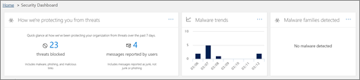

# Panoramica della sicurezza di dashboard

La sicurezza &amp; centro conformità consente all'organizzazione di gestire la protezione dei dati e conformità. Inizio in 2018 marzo, la sicurezza &amp; centro conformità delle funzionalità di un nuovo Dashboard sicurezza è possibile utilizzare per controllare lo stato di protezione di rischio, visualizzare e agire avvisi di protezione. 
  
Guardare il video per una panoramica e leggere questo articolo per ulteriori informazioni.
  
> [!VIDEO https://www.microsoft.com/videoplayer/embed/3540b1f8-62d2-47fa-a07d-d7ad76f55b0f?autoplay=false]
  
In base alle quali include la sottoscrizione a Office 365 dell'organizzazione, il Dashboard di protezione include le sezioni seguenti:
  
- [Stato di protezione di rischio](#threat-protection-status)
    
- [Approfondimenti](#insights)
    
- [Business intelligence di rischio](#threat-intelligence)
    
- [Tendenze](#trends)
    
Per visualizzare il Dashboard di protezione, nelle [protezione di Office 365 &amp; centro conformità](go-to-the-securitycompliance-center.md), andare alla **gestione delle minacce** \> **Dashboard**.
  
> [!NOTE]
> È necessario essere un amministratore globale Office 365, l'amministratore della sicurezza o lettore di protezione per visualizzare il Dashboard di sicurezza. Vedere [le autorizzazioni di sicurezza di Office 365 &amp; centro conformità](permissions-in-the-security-and-compliance-center.md). 
  
## Stato di protezione di rischio

Nell'angolo superiore sinistro del Dashboard di sicurezza è un widget stato protezione rischio che mostra l'efficacia di protezione di rischio. Questo widget viene illustrato uno sguardo le minacce quanti sono state bloccate da [Office 365 Exchange Online Protection](anti-spam-protection.md) e la [Protezione di Office 365 avanzate rischio](office-365-atp.md) , se configurata, negli ultimi sette giorni. Inoltre, questo widget visualizza il numero di messaggi di posta elettronica rilevato come classificazioni non corrette e segnalate tramite l' [utilizzo del componente aggiuntivo di report](https://support.office.com/article/b5caa9f1-cdf3-4443-af8c-ff724ea719d2). Esaminare la protezione da posta indesiderata, anti-malware e i criteri di anti-phishing per migliorare la configurazione.
  

  
Inoltre, Malware report possono essere utilizzati per tenere traccia delle tendenze più recenti in contenuto dannoso destinate a nell'organizzazione. Fare clic su una tessera per visualizzare ulteriori informazioni nel report.
  
## Approfondimenti

Informativa non solo identificare problemi principali, che è consigliabile consultare, nonché suggerimenti e le azioni da prendere in considerazione. Ad esempio, si potrebbe visualizzare che phishing messaggi di posta elettronica vengono recapitati in quanto alcuni utenti sono disabilitate le relative opzioni posta indesiderata. Per ulteriori informazioni sul funzionamento delle informazioni, vedere [report e sui concetti di Office 365 Security &amp; centro conformità](reports-and-insights-in-security-and-compliance.md).
  
## Business intelligence di rischio

Se l'organizzazione dispone di [Business Intelligence di Office 365 rischio](office-365-ti.md), il Dashboard di sicurezza ha una sezione di **Business Intelligence di rischio** che include strumenti avanzati. Team di protezione dell'organizzazione possono utilizzare le informazioni di questa sezione per acquisire familiarità con campagne emergenti, analizzare le minacce e gestire risolte. 
  

  
> [!TIP]
> Business Intelligence di Office 365 rischio è incluso in Office 365 Enterprise E5; Se l'organizzazione utilizza un'altra sottoscrizione Office 365 Enterprise, Business Intelligence di Office 365 rischio può essere acquistato come componente aggiuntivo. Per ulteriori informazioni, vedere [Business Intelligence di Office 365 rischio](office-365-ti.md). 
  
## Tendenze

Nella parte inferiore della Dashboard di protezione è una sezione **tendenze** , che vengono riepilogate le tendenze del flusso di posta elettronica per l'organizzazione. Report vengono fornite informazioni sulla posta elettronica classificata come posta indesiderata, malware, tentativi di phishing e posta elettronica valido. Fare clic su una tessera per visualizzare informazioni più dettagliate nel report. 
  

  
E, se la sottoscrizione dell'organizzazione Office 365 include [Intelligence rischio di Office 365](office-365-ti.md), è inoltre necessario un report **gli avvisi di recente threat management** in questa sezione che consente il team di protezione visualizzare e agire sulle priorità alta avvisi di protezione. 
  
## Argomenti correlati

[Visualizzare i report di protezione posta elettronica in sicurezza &amp; centro conformità](view-email-security-reports.md)
  
[Visualizzare i report per la protezione rischio avanzate di Office 365](view-reports-for-atp.md)
  
[Office 365 Advanced Threat Protection](office-365-atp.md)
  
[Office 365 Threat Intelligence](office-365-ti.md)
  

