# Panoramica delle etichette di riservatezza

Per svolgere il loro lavoro, i membri dell’organizzazione devono collaborare con altri utenti, sia all’interno sia all’esterno dell'organizzazione. Questo significa che i contenuti non sono più protetti da un firewall, ma si spostano tra dispositivi, applicazioni e servizi. E quando si spostano, è preferibile che lo facciano in modo sicuro e protetto, nel rispetto dei criteri aziendali e di conformità dell'organizzazione.

Con le etichette di riservatezza in Office 365, è possibile classificare e proteggere il contenuto riservato senza ostacolare la produttività e la capacità di collaborare degli utenti.

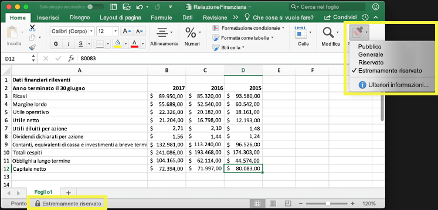

È possibile usare le etichette di riservatezza per:
  
- **Applicare al contenuto etichettato le impostazioni di protezione, ad esempio crittografia o filigrane.** Ad esempio, gli utenti possono applicare un'etichetta Riservato a un documento o a un messaggio di posta elettronica, e quell'etichetta può crittografare il contenuto e applicare una filigrana Riservato.    

- **Proteggere il contenuto nelle applicazioni di Office su piattaforme e dispositivi diversi. ** Le etichette di riservatezza funzionano nelle applicazioni di Office in Windows, Mac, iOS e Android. Il supporto per le applicazioni web di Office sarà disponibile a breve.
    
- **Impedire che i contenuti riservati escano dall'organizzazione nei dispositivi che eseguono Windows**, grazie a Endpoint Protection in Microsoft Intune. Quando si applica un'etichetta di riservatezza a contenuti che si trovano in un dispositivo Windows, la protezione endpoint può impedire che vengano copiati in un'applicazione di terze parti, ad esempio Twitter o Gmail, o che vengano copiati in un archivio rimovibile, ad esempio un'unità USB.

- **Estendere le etichette di riservatezza ad applicazioni e servizi di terze parti.** Con l'SDK di Microsoft Information Protection, le applicazioni di terze parti in Windows, Mac e Linux possono leggere le etichette di riservatezza e applicare le impostazioni di protezione. Il supporto per le applicazioni in iOS e Android sarà disponibile a breve.

- **Classificare i contenuti senza usare le impostazioni di protezione.** È inoltre possibile assegnare ai contenuti una semplice classificazione (ad esempio un adesivo) che persiste e si sposta con i contenuti mentre vengono utilizzati e condivisi. È possibile usare questa classificazione per generare report sull'uso e visualizzare i dati delle attività relativi ai contenuti riservati. In base a queste informazioni, è sempre possibile decidere in un secondo momento di applicare le impostazioni di protezione.
    
In tutti questi casi, le etichette di riservatezza in Office 365 aiutano a identificare le azioni corrette da eseguire per ogni contenuto. Con le etichette di riservatezza è possibile classificare i dati all'interno dell'organizzazione e applicare impostazioni di protezione in base alla classificazione.
  
Le etichette di riservatezza vengono create nel Centro sicurezza e conformità di Office 365. Il Centro sicurezza e conformità è ora l'unico luogo in cui configurare i criteri e le etichette di riservatezza in Azure Information Protection e Office 365. Queste etichette di riservatezza possono essere usate da Azure Information Protection, dalle applicazioni di Office e dai servizi di Office 365.

Per i clienti di Azure Information Protection, è possibile usare le etichette di Azure Information Protection nel Centro sicurezza e conformità e, qualora si scegliesse di eseguire operazioni di configurazione aggiuntive o avanzate, le etichette saranno sincronizzate con il portale di Azure. **Le etichette di Azure Information Protection e le etichette di riservatezza di Office 365 sono completamente compatibili tra loro.** Questo significa, ad esempio, che non è necessario riclassificare o etichettare nuovamente contenuti etichettati da Azure Information Protection.

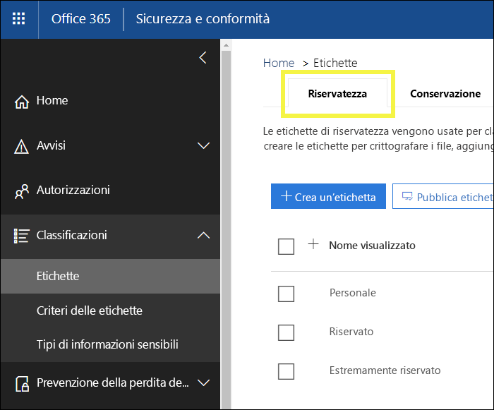

## Cos’è un'etichetta di riservatezza

Un'etichetta di riservatezza assegnata a un documento o a un messaggio di posta elettronica è come un semplice tag, cioè:

- **Personalizzabile.** È possibile creare categorie per diversi livelli di contenuti riservati all'interno dell'organizzazione, ad esempio Personale, Pubblico, Generale, Riservato e Riservatezza elevata.

- **Non crittografato.** Poiché l'etichetta non è crittografata, è disponibile per l’applicazione di azioni di protezione ai contenuti etichettati da parte di applicazioni e servizi di terze parti.

- **Persistente.** Quando al contenuto è applicata un'etichetta di riservatezza, questa persiste nei metadati del messaggio di posta elettronica o del documento. Questo significa che l'etichetta, incluse le impostazioni di protezione, si sposta con il contenuto e diventa la base per l'applicazione dei criteri.

Nelle applicazioni di Office, un’etichetta di riservatezza viene visualizzata semplicemente come tag in un messaggio di posta elettronica o in un documento.

A ciascun contenuto può essere applicata una sola etichetta di riservatezza. Si noti che è possibile applicare a un elemento una sola un'etichetta di riservatezza e una sola [etichetta di conservazione](labels.md).

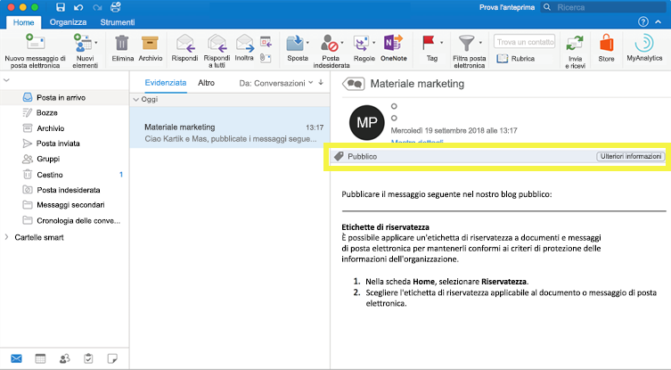

## Operazioni eseguibili dalle etichette di riservatezza

Quando si applica un'etichetta di riservatezza a un messaggio di posta elettronica o a un documento, vengono applicate ai contenuti le impostazioni di protezione per quell'etichetta. Con un'etichetta di riservatezza, è possibile:

- **Crittografare** solo il messaggio di posta elettronica o sia il messaggio di posta elettronica sia i documenti. È possibile scegliere quali utenti o gruppi sono autorizzati ad eseguire determinate operazioni e per quanto tempo. Ad esempio, è possibile autorizzare gli utenti di un dominio specifico all'esterno dell'organizzazione a esaminare i contenuti per soli 7 giorni a partire dall'applicazione dell'etichetta.

- **Contrassegnare il contenuto** aggiungendo filigrane, intestazioni o piè di pagina ai messaggi di posta elettronica o ai documenti che hanno l'etichetta applicata. Le filigrane sono applicate solo ai documenti, non ai messaggi di posta elettronica, e hanno un limite di 255 caratteri. Inoltre, le intestazioni e i piè di pagina hanno un limite di 1024 caratteri ( tranne in Excel, dove hanno un limite di 255 caratteri o meno, a seconda che il documento contenga altre intestazioni o piè di pagina e altri fattori).

    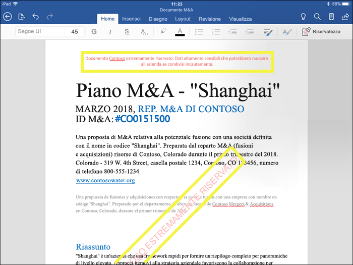

- 
  **Evitare la perdita di dati** attivando la protezione endpoint in Intune. Se i contenuti riservati vengono scaricati, è possibile impedire la perdita dei dati dai dispositivi Windows. Ad esempio, non è possibile copiare contenuti etichettati in Dropbox, Gmail o in un'unità USB. Affinché le etichette di riservatezza possano utilizzare Windows Information Protection (WIP), è necessario creare prima un criterio di protezione delle app nel portale di Azure. Per ulteriori informazioni, vedere [Come Windows Information Protection protegge i file con etichetta di riservatezza](https://docs.microsoft.com/en-us/windows/security/information-protection/windows-information-protection/how-wip-works-with-labels?branch=vsts17546553).

Tutte queste opzioni sono disponibili quando si crea un'etichetta in Centro sicurezza e conformità.

### Priorità dell’etichetta (l’ordine è importante)

Quando si creano le etichette di riservatezza nel Centro sicurezza e conformità, queste vengono visualizzate in un elenco nella scheda **Riservatezza** nella pagina **Etichette**. In questo elenco, l'ordine delle etichette è importante perché ne riflette la priorità. È importante che l'etichetta con il grado di riservatezza più restrittivo, come Riservatezza elevata, sia visualizzata nella **parte inferiore** dell'elenco, e che l’etichetta con il grado di riservatezza meno restrittivo, ad esempio Pubblico, sia visualizzata nella **parte superiore**.

È possibile applicare solo un’etichetta di riservatezza a un documento o a un messaggio di posta elettronica. Se si richiede agli utenti di fornire una motivazione per modificare l'etichetta applicando una classificazione inferiore, l'ordine dell'elenco stabilisce quale classificazione è inferiore.

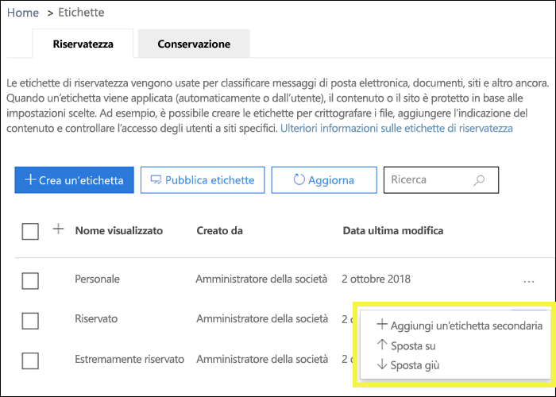

### Sottoetichette (raggruppamento etichette)

Con le sottoetichette, è possibile raggruppare una o più etichette sotto un'intestazione che viene visualizzata da un utente in un'applicazione di Office. Ad esempio, in Riservato, l'organizzazione potrebbe usare varie etichette diverse per tipi specifici di quella classificazione. In questo esempio, l'etichetta Riservato è una semplice etichetta di testo senza alcuna impostazione di protezione e, poiché contiene sottoetichette, non può quindi essere applicata al contenuto. Piuttosto, gli utenti devono scegliere Riservato per visualizzare le sottoetichette e quindi scegliere una sottoetichetta da applicare al contenuto.

Le sottoetichette sono solo un modo per presentare le etichette agli utenti in gruppi logici. Le sottoetichette non ereditano le impostazioni dell’etichetta che le contiene.

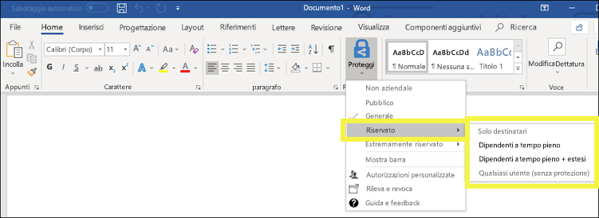

### Modificare o eliminare un'etichetta di riservatezza

Se si elimina un'etichetta di riservatezza nel Centro sicurezza e conformità, tenere presente che l'etichetta non viene rimossa dal contenuto e che le impostazioni di protezione continuano a essere applicate al contenuto.

Se si modifica un'etichetta di riservatezza nel Centro sicurezza e conformità, sarà applicata al contenuto la versione dell’etichetta originalmente applicata su di esso.

## Operazioni eseguibili dai criteri di etichetta

Dopo aver creato le etichette di riservatezza, è necessario pubblicarle per renderle disponibili agli utenti dell'organizzazione, che possono quindi applicare etichette al contenuto. A differenza delle etichette di conservazione, che vengono pubblicate in percorsi, ad esempio tutte le cassette postali di Exchange, le etichette di riservatezza vengono pubblicate a utenti o gruppi. Le etichette di riservatezza saranno visualizzate nelle applicazioni di Office per quegli utenti e gruppi.

Con un criterio di etichetta, è possibile:

- **Scegliere gli utenti e i gruppi che visualizzeranno le etichette.** Le etichette possono essere pubblicate in un gruppo di sicurezza abilitato per la posta elettronica, un gruppo di distribuzione, un gruppo di Office 365 o un gruppo di distribuzione dinamico.

- **Applicare un'etichetta predefinita** a tutti i nuovi documenti e messaggi di posta elettronica creati dagli utenti e dai gruppi inclusi nel criterio di etichetta. Questa etichetta predefinita può impostare un livello di base di impostazioni di protezione che si desidera applicare a tutto il contenuto.

- **Richiedere una motivazione per modificare un'etichetta.** Se il contenuto è contrassegnato come Riservato e un utente desidera rimuovere l'etichetta o sostituirla con una classificazione inferiore, ad esempio un'etichetta denominata Pubblico, è possibile richiedere che l'utente fornisca una motivazione quando esegue questa operazione. Le motivazioni saranno sottoposte a esame dell’amministratore. Attualmente stiamo lavorando a un report in cui gli amministratori potranno visualizzare le motivazioni dell'utente.

    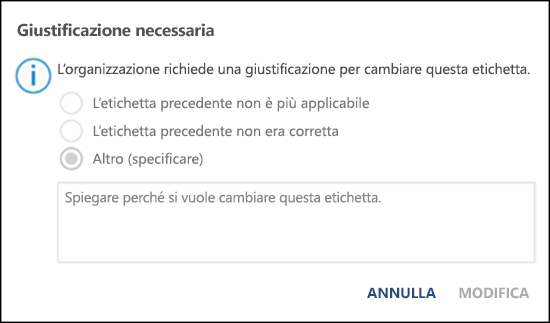

- **Fornire collegamento a una pagina della Guida personalizzata.** Se gli utenti non conoscono il significato delle etichette di riservatezza o non sanno come usarle, è possibile indicare un URL con maggiori informazioni, visualizzato nella parte inferiore del menu etichetta di riservatezza nelle applicazioni di Office.

    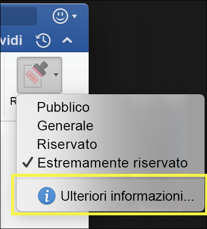

Dopo aver creato un criterio di etichetta e aver assegnato le etichette di riservatezza a utenti e gruppi, le etichette saranno disponibili per quegli utenti nelle applicazioni di Office in un'ora o meno.

## Come iniziare

Iniziare con le etichette di riservatezza è una procedura veloce:

1. **Definire le etichette.** Prima di tutto, è necessario stabilire la tassonomia per definire i diversi livelli di contenuti riservati. Utilizzare nomi o termini comuni che abbiano un significato per gli utenti. Ad esempio, è possibile iniziare con etichette come Personale, Pubblico, Generale, Riservato e Riservatezza elevata. È possibile usare sottoetichette per raggruppare le etichette simili per categoria. Inoltre, quando si crea un'etichetta, è necessaria una descrizione comando, che viene visualizzata nelle applicazioni di Office quando si passa il mouse su un'opzione di etichetta sulla barra multifunzione.

1. **Definire le operazioni eseguibili da ciascuna etichetta.** Quindi, configurare le impostazioni di protezione che si desidera associare a ciascuna etichetta. Ad esempio, a un contenuto con un basso grado di riservatezza (un'etichetta "Generale") potrebbe essere applicata solo un'intestazione o un piè di pagina, mentre a un contenuto con un maggiore grado di riservatezza (un'etichetta "Riservato") potrebbe essere applicata una filigrana, la crittografia e WIP, per garantire che possano accedervi solo gli utenti con privilegi.
 
1. **Definire chi ha accesso alle etichette.** Dopo avere definito le etichette dell’organizzazione, queste sono pubblicate in un criterio di etichetta che controlla quali utenti e gruppi possono visualizzarle. Una singola etichetta è riutilizzabile (è definita una sola volta e quindi è possibile includerla in diversi criteri di etichetta assegnati a più utenti). Ma perché un'etichetta possa essere assegnata al contenuto, è necessario prima pubblicarla in modo che sia disponibile nelle applicazioni di Office e in altri servizi. Quando si inizia, è possibile provare a usare le etichette di riservatezza assegnandole a pochi utenti.

Ecco il flusso di base delle operazioni eseguite da amministratore, utente e applicazione di Office per consentire il funzionamento delle etichette di riservatezza.

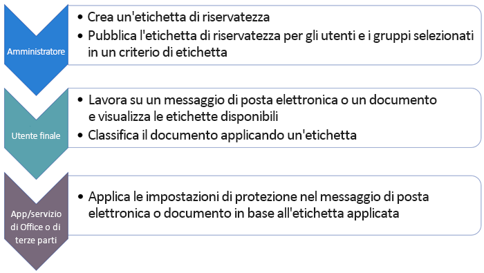

## Posizioni in cui è possibile visualizzare le etichette di riservatezza

Le etichette di riservatezza vengono visualizzate nell'interfaccia utente delle app di Office. Per visualizzare la disponibilità corrente per piattaforme e applicazioni specifiche, vedere **[Oggi dov'è disponibile questa funzionalità?](https://support.office.com/it-IT/article/apply-sensitivity-labels-to-your-documents-and-email-within-office-2f96e7cd-d5a4-403b-8bd7-4cc636bae0f9?ad=US&ui=en-US&rs=en-US#bkmk_whereavailable)**

### App di Office in Windows

Nelle app di Office nei dispositivi che eseguono Windows, le etichette di riservatezza sono visualizzate nel pulsante **Riservatezza** nella scheda **Home** della barra multifunzione. L'etichetta applicata viene visualizzata anche nella barra di stato nella parte inferiore della finestra.

Il supporto nativo per le etichette di riservatezza nelle app di Office in Windows sarà disponibile a breve.

Se si è un cliente esistente di Azure Information Protection, è possibile distribuire il client di assegnazione delle etichette unificato di Azure Information Protection, che supporta le etichette di riservatezza, Per ulteriori informazioni riguardanti il download del client, vedere [Client di etichettatura unificata di Azure Information Protection: informazioni sul rilascio della versione](https://docs.microsoft.com/it-IT/azure/information-protection/rms-client/unifiedlabelingclient-version-release-history). Attualmente stiamo lavorando al supporto nativo per le etichette di riservatezza nelle app di Office in Windows, in modo da rendere il client di assegnazione delle etichette unificata di Azure Information Protection non più necessario.

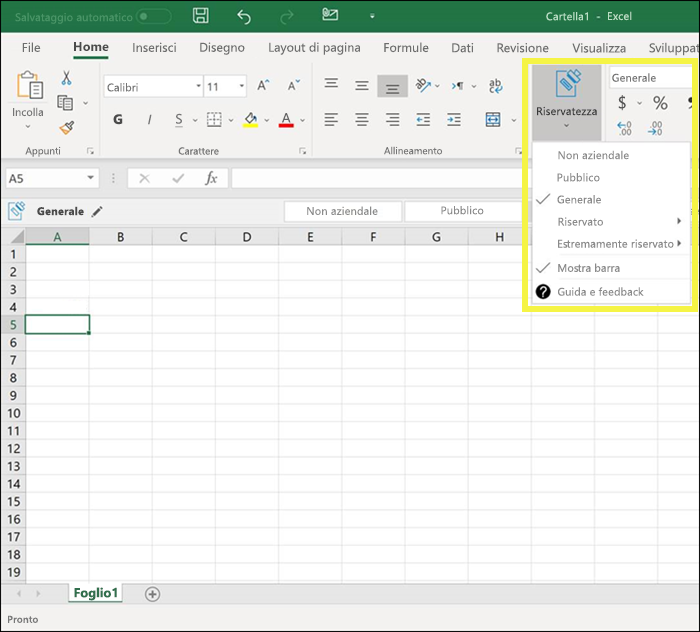

### Applicazioni di Office per Mac

Nelle applicazioni di Office nei dispositivi Mac, le etichette di riservatezza sono visualizzate nel pulsante **Riservatezza** nella scheda **Home** della barra multifunzione. L’etichetta applicata viene visualizzata anche nella barra di stato nella parte inferiore della finestra.

### Applicazioni di Office in iOS

Nelle applicazioni di Office nei dispositivi iOS, le etichette di riservatezza sono visualizzate nel pulsante **Riservatezza** nella scheda **Home** della barra multifunzione. L’etichetta applicata viene visualizzata anche nella barra di stato nella parte inferiore della finestra.

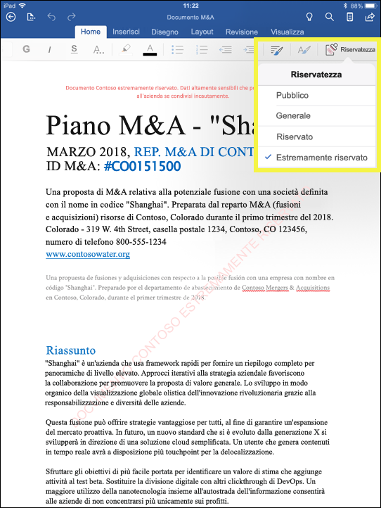

### Applicazioni di Office in Android

Nelle applicazioni di Office nei dispositivi Android, le etichette di riservatezza sono visualizzate nel pulsante **Riservatezza** nella scheda **Home** della barra multifunzione. L’etichetta applicata viene visualizzata anche nella barra di stato nella parte inferiore della finestra.

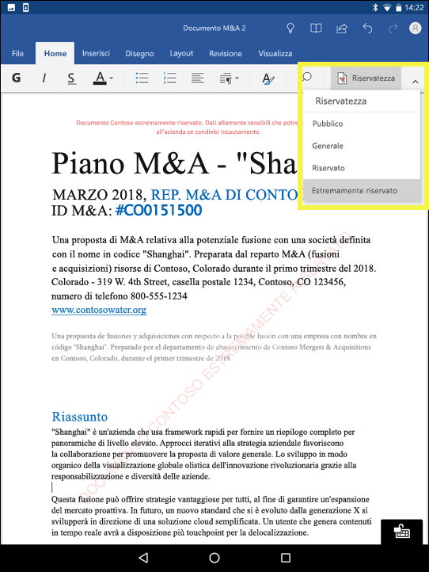

### Ulteriori informazioni sulle etichette di riservatezza nelle applicazioni di Office

- [Applicare etichette di riservatezza ai documenti e ai messaggi di posta elettronica in Office](https://support.office.com/it-IT/article/apply-sensitivity-labels-to-your-documents-and-email-within-office-2f96e7cd-d5a4-403b-8bd7-4cc636bae0f9)
- [Problemi noti quando si applicano le etichette di riservatezza per i file di Office](https://support.office.com/it-IT/article/known-issues-when-you-apply-sensitivity-labels-to-your-office-files-b169d687-2bbd-4e21-a440-7da1b2743edc)

## Funzionamento delle etichette di riservatezza con etichette esistenti di Azure Information Protection

Gli utenti di Azure Information Protection possono attualmente classificare e assegnare etichette ai contenuti in Windows con il client di assegnazione delle etichette unificato di Azure Information Protection. Le etichette esistenti di Azure Information Protection sono perfettamente integrate con le nuove etichette di riservatezza. Questo significa che è possibile:

- Mantenere le etichette esistenti di Azure Information Protection in documenti e messaggi di posta elettronica.
- Mantenere la configurazione di etichetta Azure Information Protection esistente.

Se si usano le etichette di Azure Information Protection, per il momento è consigliabile evitare di creare nuove etichette nel Centro sicurezza e conformità finché non è stata completata la migrazione. L’[argomento migrazione Azure Information Protection](https://docs.microsoft.com/it-IT/azure/information-protection/configure-policy-migrate-labels) contiene informazioni importanti e alcuni avvisi specifici. Se non si è ancora pronti per eseguire la migrazione dei tenant di produzione alle etichette di riservatezza, non è bisogna preoccuparsi: per il momento, gli utenti possono continuare a usare il client di Azure Information Protection e gli amministratori possono continuare a usare il portale di Azure per la gestione.

## Proteggere il contenuto nei dispositivi Windows con Endpoint Protection in Microsoft Intune

Quando si crea un'etichetta di riservatezza, è possibile comunicare a Windows che i file con questa etichetta sono riservati e devono essere protetti dalla perdita di dati quando sono archiviati nei dispositivi Windows. L’opzione consente di garantire che il contenuto con questa etichetta sia condiviso o copiato solo in percorsi approvati, anche quando è archiviato in un punto finale. In sostanza, attivare questa opzione per un'etichetta di riservatezza indica che si tratta di dati molto importanti che richiedono vincoli di utilizzo aggiuntivi.

Quando si attiva questa opzione, Windows può leggere, comprendere ed agire sulle etichette di riservatezza nei documenti e applicare automaticamente Windows Information Protection (WIP) al contenuto, indipendentemente da come raggiunge un dispositivo Windows gestito. Ciò consente di proteggere i file con etichetta dalla perdita accidentale, con o senza applicazione di crittografia.

Ad esempio, Windows è in grado di comprendere che a un documento Word presente nel computer di un utente è applicata un'etichetta, e WIP è in grado di applicare un criterio di protezione di app per evitare la copia o la condivisione dei dati in una posizione privata da quel dispositivo (ad esempio un ONeDrive personale, account di posta elettronica personale, social media o unità USB).

Se un utente tenta di caricare i dati cui è applicata l’etichetta in un account personale di Gmail, vedrà questo messaggio.

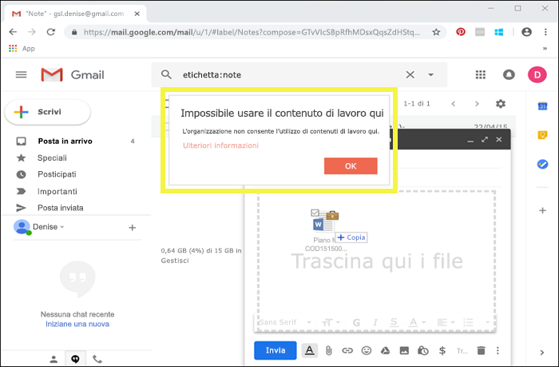

E se un utente tenta di salvare il contenuto cui è applicata l’etichetta in un'unità USB, vedrà questo messaggio.

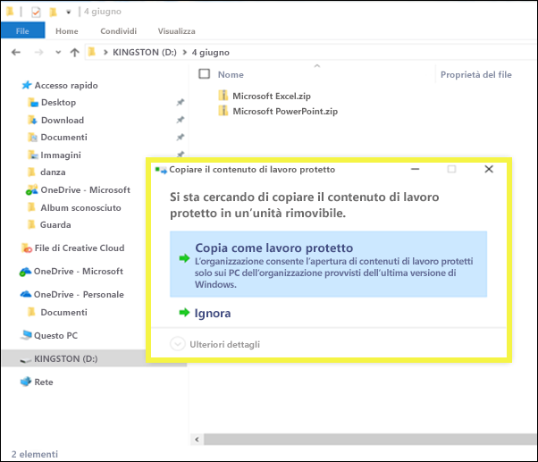

### Prerequisiti importanti

Affinché le etichette di riservatezza possano utilizzare WIP, è necessario eseguire prima i prerequisiti descritti di seguito: [Come Windows Information Protection protegge i file con un'etichetta di riservatezza](https://docs.microsoft.com/en-us/windows/security/information-protection/windows-information-protection/how-wip-works-with-labels?branch=vsts17546553). Questo argomento illustra i prerequisiti seguenti:

- Assicurarsi di eseguire Windows 10 versione 1809 o successive.
- [Impostare Windows Defender Advanced Threat Protection (WDATP)](https://docs.microsoft.com/it-IT/windows/security/threat-protection/windows-defender-atp/get-started), che analizza il contenuto di un'etichetta e applica la relativa protezione WIP. ATP esegue alcune operazioni in modo indipendente da WIP, ad esempio la creazione di report relativi ad anomalie.
- Creare un criterio di Windows Information Protection (WIP) valido per i dispositivi endpoint. È possibile farlo in una di queste posizioni:
    - [Creare un criterio di Windows Information Protection (WIP) con MDM tramite il portale di Azure per Microsoft Intune](https://docs.microsoft.com/it-IT/windows/security/information-protection/windows-information-protection/create-wip-policy-using-intune-azure)
    - [Creare e distribuire un criterio di Windows Information Protection (WIP) con System Center Configuration Manager](https://docs.microsoft.com/it-IT/windows/security/information-protection/windows-information-protection/create-wip-policy-using-sccm)

## Estendere le etichette di riservatezza ad applicazioni e servizi di terze parti con SDK di Microsoft Information Protection

Poiché un'etichetta di riservatezza viene mantenuta come testo non crittografato nei metadati di un documento, applicazioni e servizi di terze parti possono scegliere di supportare l’identificazione e la protezione di contenuti che contengono tale etichetta. Il supporto in altre applicazioni e servizi è in continua espansione.

Con [SDK di Microsoft Information Protection](https://docs.microsoft.com/it-IT/information-protection/develop/), le applicazioni e i servizi di terze possono leggere e applicare ai documenti le etichette di riservatezza e protezione. SDK supporta le applicazioni in Windows, Mac e Linux. Il supporto per le applicazioni in iOS e Android sarà disponibile a breve.

Tramite SDK, è possibile etichettare e proteggere il contenuto in modo tale da funzionare con altre applicazioni e servizi di Microsoft Information Protection, ad esempio le applicazioni di Office, i servizi di Office 365, lo scanner Azure Information Protection, Microsoft Cloud App Security e molte altre soluzioni partner. Ad esempio, ottenere altre informazioni sul [supporto per le etichette di riservatezza in Adobe Acrobat](https://techcommunity.microsoft.com/t5/Azure-Information-Protection/Starting-October-use-Adobe-Acrobat-Reader-for-PDFs-protected-by/ba-p/262738).

Per ulteriori informazioni sulla protezione di SDK di Microsoft Information Protection, vedere l’[annuncio nel blog Tech Community](https://techcommunity.microsoft.com/t5/Microsoft-Information-Protection/Microsoft-Information-Protection-SDK-Now-Generally-Available/ba-p/263144). È inoltre possibile ottenere maggiori informazioni sulle [soluzioni partner integrate con Microsoft Information Protection](https://techcommunity.microsoft.com/t5/Azure-Information-Protection/Microsoft-Information-Protection-showcases-integrated-partner/ba-p/262657).

## Autorizzazioni

Ai membri del team di conformità che creeranno etichette di riservatezza è necessario assegnare autorizzazioni per il Centro sicurezza e conformità. Per impostazione predefinita, l'amministratore del tenant avrà accesso a questa posizione e potrà fornire ai responsabili della conformità e ad altre persone l'accesso al Centro sicurezza e conformità, senza concedere tutte le autorizzazioni di un amministratore del tenant. A questo scopo, è consigliabile accedere alla pagina **Autorizzazioni** del Centro sicurezza e conformità, modificare il gruppo di ruoli **Amministratore conformità** e aggiungere membri a tale gruppo di ruoli.

Per ulteriori informazioni, vedere Concedere agli utenti l'accesso al Centro sicurezza e conformità di Office 365.

Queste autorizzazioni sono necessarie solo per creare e applicare etichette e criteri di etichetta. L'applicazione dei criteri non richiede l'accesso al contenuto.
