# Panoramica delle etichette di riservatezzaOverview of sensitivity labels

Per svolgere il loro lavoro, i membri dell’organizzazione devono collaborare con altri utenti, sia all’interno sia all’esterno dell'organizzazione. Questo significa che i contenuti non sono più protetti da un firewall, ma si spostano tra dispositivi, applicazioni e servizi. E quando si spostano, è preferibile che lo facciano in modo sicuro e protetto, nel rispetto dei criteri aziendali e di conformità dell'organizzazione.To get their work done, people in your organization need to collaborate with others both inside and outside the organization. This means that content no longer stays behind a firewall – it roams everywhere, across devices, apps, and services. And when it roams, you want it to do so in a secure, protected way that meets your organization’s business and compliance policies.

Con le etichette di riservatezza è possibile classificare e proteggere il contenuto riservato senza ostacolare la produttività e la capacità di collaborare degli utenti.With sensitivity labels, you can classify and help protect your sensitive content, while making sure that your people’s productivity and ability to collaborate isn’t hindered.

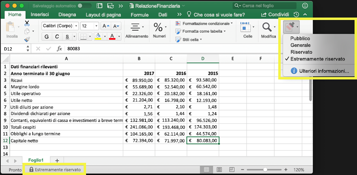

È possibile usare le etichette di riservatezza per:You can use sensitivity labels to:
  
- **Applicare al contenuto etichettato le impostazioni di protezione, ad esempio crittografia o filigrane.** Ad esempio, gli utenti possono applicare un'etichetta Riservato a un documento o a un messaggio di posta elettronica, e quell'etichetta può crittografare il contenuto e applicare una filigrana Riservato.**Enforce protection settings such as encryption or watermarks on labeled content.** For example, your users can apply a Confidential label to a document or email, and that label can encrypt the content and apply a Confidential watermark.    

- \*\*Proteggere il contenuto nelle applicazioni di Office su piattaforme e dispositivi diversi. \*\* Le etichette di riservatezza funzionano nelle applicazioni di Office in Windows, Mac, iOS e Android. Il supporto per le applicazioni web di Office sarà disponibile a breve.**Protect content in Office apps across different platforms and devices.** Sensitivity labels work in Office apps on Windows, Mac, iOS, and Android. Support for Office web apps is coming soon.
    
- **Impedire che i contenuti riservati escano dall'organizzazione nei dispositivi che eseguono Windows**, grazie a Endpoint Protection in Microsoft Intune. Quando si applica un'etichetta di riservatezza a contenuti che si trovano in un dispositivo Windows, la protezione endpoint può impedire che vengano copiati in un'applicazione di terze parti, ad esempio Twitter o Gmail, o che vengano copiati in un archivio rimovibile, ad esempio un'unità USB.**Prevent sensitive content from leaving your organization on devices running Windows**, by using endpoint protection in Microsoft Intune. After a sensitivity label has been applied to content that resides on a Windows device, endpoint protection can prevent that content from being copied to a third-party app, such as Twitter or Gmail, or being copied to removable storage, such as a USB drive.

- **Proteggere i contenuti in app e servizi di terze parti** con Microsoft Cloud App Security.**Protect content in third-party apps and services**, by using Microsoft Cloud App Security. Con Cloud App Security è possibile rilevare, classificare, etichettare e proteggere i contenuti in servizi e app di terze parti, ad esempio SalesForce, Box o DropBox, anche se l'applicazione o servizio di terze parti non legge o supporta le etichette di riservatezza.With Cloud App Security, you can detect, classify, label, and protect content in third-party apps and services, such as SalesForce, Box, or DropBox, even if the third-party app or service does not read or support sensitivity labels.

- **Estendere le etichette di riservatezza ad applicazioni e servizi di terze parti.** Con l'SDK di Microsoft Information Protection, le applicazioni di terze parti in Windows, Mac e Linux possono leggere le etichette di riservatezza e applicare le impostazioni di protezione. Il supporto per le applicazioni in iOS e Android sarà disponibile a breve.**Extend sensitivity labels to third-party apps and services.** With the Microsoft Information Protection SDK, third-party apps on Windows, Mac, and Linux can read sensitivity labels and apply protection settings. Support for apps on iOS and Android is coming soon.

- **Classificare i contenuti senza usare le impostazioni di protezione.** È inoltre possibile assegnare ai contenuti una semplice classificazione (ad esempio un adesivo) che persiste e si sposta con i contenuti mentre vengono utilizzati e condivisi. È possibile usare questa classificazione per generare report sull'uso e visualizzare i dati delle attività relativi ai contenuti riservati. In base a queste informazioni, è sempre possibile decidere in un secondo momento di applicare le impostazioni di protezione.**Classify content without using any protection settings.** You can also simply assign a classification to content (like a sticker) that persists and roams with the content as it's used and shared. You can use this classification to generate usage reports and see activity data for your sensitive content. Based on this information, you can always choose at a later time to apply protection settings.
    
In tutti questi casi, le etichette di riservatezza in Office 365 aiutano a identificare le azioni corrette da eseguire per ogni contenuto. Con le etichette di riservatezza è possibile classificare i dati all'interno dell'organizzazione e applicare impostazioni di protezione in base alla classificazione.In all of these cases, sensitivity labels in Office 365 can help you take the right actions on the right content. With sensitivity labels, you can classify data across your organization and enforce protection settings based on that classification.
  
Le etichette di riservatezza vengono create nel Centro conformità Microsoft 365, nel Centro sicurezza Microsoft 365 o nel Centro sicurezza e conformità di Office 365. Queste etichette di riservatezza possono essere usate da Azure Information Protection, dalle app di Office e dai servizi di Office 365.You create sensitivity labels in the Microsoft 365 compliance center, Microsoft 365 security center, or Office 365 Security & Compliance Center. These sensitivity labels can be used by Azure Information Protection, Office apps, and Office 365 services.

Per i clienti di Azure Information Protection, è possibile usare le etichette di Azure Information Protection nelle altre interfacce di amministrazione e, qualora si scegliesse di eseguire operazioni di configurazione aggiuntive o avanzate, le etichette saranno sincronizzate con il portale di Azure.For Azure Information Protection customers, you can use your Azure Information Protection labels in the other admin centers, and your labels will be synced with the Azure portal in case you choose to perform additional or advanced configuration. **Le etichette di Azure Information Protection e le etichette di riservatezza di Office 365 sono completamente compatibili tra loro.****Azure Information Protection labels and Office 365 sensitivity labels are fully compatible with each other.** Questo significa, ad esempio, che non è necessario riclassificare o etichettare nuovamente contenuti etichettati da Azure Information Protection.This means, for example, if you have content labeled by Azure Information Protection, you won’t need to reclassify or relabel your content.

## Cos’è un'etichetta di riservatezzaWhat a sensitivity label is

Un'etichetta di riservatezza assegnata a un documento o a un messaggio di posta elettronica è come un semplice tag, cioè:When you assign a sensitivity label to a document or email, it’s simply like a tag that is:

- **Personalizzabile.** È possibile creare categorie per diversi livelli di contenuti riservati all'interno dell'organizzazione, ad esempio Personale, Pubblico, Generale, Riservato e Riservatezza elevata.**Customizable.** You can create categories for different levels of sensitive content in your organization, such as Personal, Public, General, Confidential, and Highly Confidential.

- **Non crittografato.** Poiché l'etichetta non è crittografata, è disponibile per l’applicazione di azioni di protezione ai contenuti etichettati da parte di applicazioni e servizi di terze parti.**Clear text.** Because the label is in clear text, it’s available for third-party apps and services to apply protective actions to labeled content.

- **Persistente.** Quando al contenuto è applicata un'etichetta di riservatezza, questa persiste nei metadati del messaggio di posta elettronica o del documento. Questo significa che l'etichetta, incluse le impostazioni di protezione, si sposta con il contenuto e diventa la base per l'applicazione dei criteri.**Persistent.** After a sensitivity label is applied to content, it persists in the metadata of that email or document. This means the label roams with the content, including the protection settings, and becomes the basis for applying and enforcing policies.

Nelle applicazioni di Office, un’etichetta di riservatezza viene visualizzata semplicemente come tag in un messaggio di posta elettronica o in un documento.In the Office apps, a sensitivity label simply appears as a tag on an email or document.

A ciascun contenuto può essere applicata una sola etichetta di riservatezza. Si noti che è possibile applicare a un elemento una sola un'etichetta di riservatezza e una sola [etichetta di conservazione](labels.md).Each item of content can have a single sensitivity label applied to it. But note that an item can have both a single sensitivity label and a single [retention label](labels.md) applied to it.

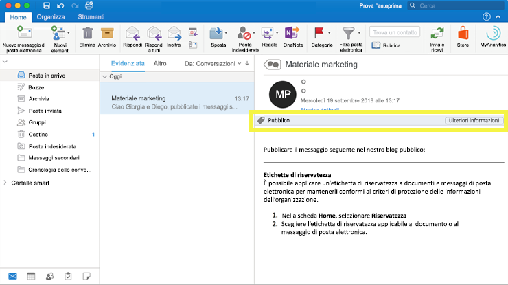

## Operazioni eseguibili dalle etichette di riservatezzaWhat sensitivity labels can do

Quando si applica un'etichetta di riservatezza a un messaggio di posta elettronica o a un documento, vengono applicate ai contenuti le impostazioni di protezione per quell'etichetta. Con un'etichetta di riservatezza, è possibile:After a sensitivity label is applied to an email or document, the protection settings for that label are enforced on the content. With a sensitivity label, you can:

- **Crittografare** solo il messaggio di posta elettronica o sia il messaggio di posta elettronica sia i documenti. È possibile scegliere quali utenti o gruppi sono autorizzati ad eseguire determinate operazioni e per quanto tempo. Ad esempio, è possibile autorizzare gli utenti di un dominio specifico all'esterno dell'organizzazione a esaminare i contenuti per soli 7 giorni a partire dall'applicazione dell'etichetta. Per altre informazioni, vedere [Limitare l’accesso al contenuto utilizzando la crittografia nelle etichette di riservatezza](encryption-sensitivity-labels.md).**Encrypt** email only or both email and documents. You can choose which users or group have permissions to perform which actions and for how long. For example, you can choose to allow users in a specific domain outside your organization to have permissions to review the content for only 7 days after the content is labeled. For more information, see [Restrict access to content by using encryption in sensitivity labels](encryption-sensitivity-labels.md).

- **Contrassegnare il contenuto** aggiungendo filigrane, intestazioni o piè di pagina ai messaggi di posta elettronica o ai documenti che hanno l'etichetta applicata. Le filigrane sono applicate solo ai documenti, non ai messaggi di posta elettronica, e hanno un limite di 255 caratteri. Inoltre, le intestazioni e i piè di pagina hanno un limite di 1024 caratteri ( tranne in Excel, dove hanno un limite di 255 caratteri o meno, a seconda che il documento contenga altre intestazioni o piè di pagina e altri fattori).**Mark the content** by adding custom watermarks, headers, or footers to email or documents that have the label applied. Note that watermarks are applied only to documents, not email, and they're limited to 255 characters. Also, headers and footers are limited to 1024 characters (except in Excel, where they're limited to 255 characters or fewer, depending on whether the document contains other headers or footers and other factors.)

    

- **Evitare la perdita di dati** attivando la protezione endpoint in Intune. Se i contenuti riservati vengono scaricati, è possibile impedire la perdita dei dati dai dispositivi Windows. Ad esempio, non è possibile copiare contenuti etichettati in Dropbox, Gmail o in un'unità USB. Per consentire l'uso di Windows Information Protection (WIP) nelle le etichette di riservatezza, è necessario creare prima un criterio di protezione delle app nel portale di Azure. Per altre informazioni, vedere [Come Windows Information Protection protegge i file con etichetta di riservatezza](https://docs.microsoft.com/windows/security/information-protection/windows-information-protection/how-wip-works-with-labels?branch=vsts17546553).**Prevent data loss** by turning on endpoint protection in Intune. If sensitive content gets downloaded, you can help prevent the loss of data from Windows devices. For example, you can’t copy labeled content into Dropbox, Gmail, or USB drive. Before your sensitivity labels can use Windows Information Protection (WIP), you first need to create an app protection policy in the Azure portal. For more information, see [How Windows Information Protection protects files with a sensitivity label](https://docs.microsoft.com/windows/security/information-protection/windows-information-protection/how-wip-works-with-labels?branch=vsts17546553).

- **Applicare automaticamente l'etichetta a contenuto che contiene informazioni sensibili.** È possibile selezionare i tipi di informazioni sensibili che si intende etichettare e scegliere se applicare l'etichetta automaticamente oppure chiedere agli utenti di applicare l'etichetta consigliata. Se si consiglia un'etichetta, il messaggio di richiesta visualizza qualsiasi testo selezionato. Per altre informazioni, vedere [Applicare automaticamente un'etichetta di riservatezza al contenuto](apply-sensitivity-label-automatically.md).**Apply the label automatically to content that contains sensitive information.** You can choose what types of sensitive information that you want labeled, and the label can either be applied automatically, or you can prompt users to apply the label that you recommend. If you recommend a label, the prompt displays whatever text you choose. For more information, see [Apply a sensitivity label to content automatically](apply-sensitivity-label-automatically.md).

    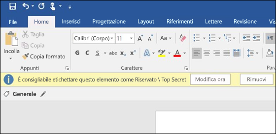

Tutte queste opzioni sono disponibili quando si crea un'etichetta di riservatezza.All of these options are available when you create a sensitivity label.

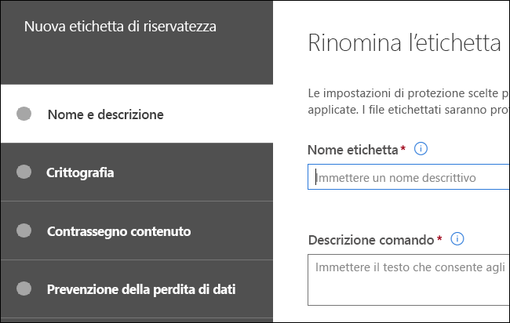

### Priorità dell’etichetta (l’ordine è importante)Label priority (order matters)

Quando si creano le etichette di riservatezza nel Centro sicurezza, queste vengono visualizzate in un elenco nella scheda **Riservatezza** nella pagina **Etichette**.When you create your sensitivity labels, they appear in a list on the **Sensitivity** tab on the **Labels** page. In questo elenco, l'ordine delle etichette è importante perché ne riflette la priorità.In this list, the order of the labels is important because it reflects their priority. È importante che l'etichetta con il grado di riservatezza più restrittivo, come Riservatezza elevata, sia visualizzata nella **parte inferiore** dell'elenco e che l'etichetta con il grado di riservatezza meno restrittivo, ad esempio Pubblico, sia visualizzata nella **parte superiore**.You want your most restrictive sensitivity label, such as Highly Confidential, to appear at the **bottom** of the list, and your least restrictive sensitivity label, such as Public, to appear at the **top**.

È possibile applicare solo un’etichetta di riservatezza a un documento o a un messaggio di posta elettronica. Se si richiede agli utenti di fornire una motivazione per modificare l'etichetta applicando una classificazione inferiore, l'ordine dell'elenco stabilisce quale classificazione è inferiore.A document or email can have only a single sensitivity label applied to it. If you require your users to provide a justification for changing the label to a lower classification, the order of this list determines what's a lower classification.

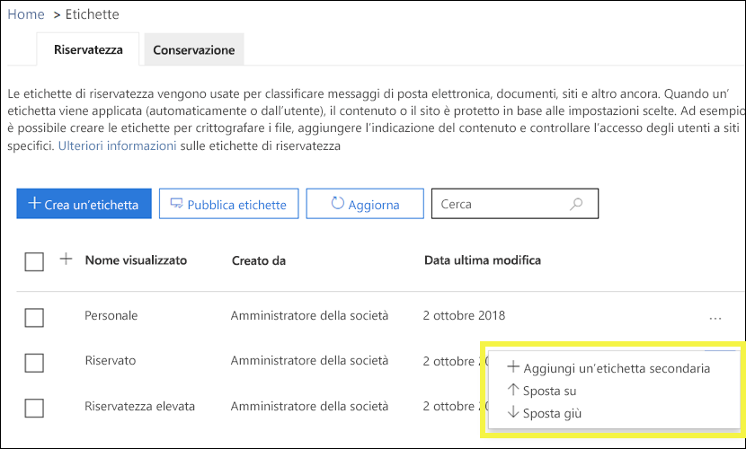

Si noti che, oltre alla priorità dell'etichetta, è importante anche l'ordine dei criteri di etichetta. Vedere [Priorità dei criteri di etichetta (l'ordine è importante)](#label-policy-priority-order-matters).Note that in addition to label priority, the order of the label policies also matters - see [Label policy priority (order matters)](#label-policy-priority-order-matters).

### Sottoetichette (raggruppamento etichette)Sublabels (grouping labels)

Con le sottoetichette è possibile raggruppare uno o più etichette sotto un'etichetta padre visualizzata dall'utente in un'app di Office.With sublabels, you can group one or more labels below a parent label that a user sees in an Office app. Ad esempio, sotto l'etichetta Riservato l'organizzazione può usare etichette diverse per tipi specifici di tale classificazione.For example, under Confidential, your organization might use several different labels for specific types of that classification. In questo esempio l'etichetta padre Riservato è semplicemente un'etichetta di testo senza impostazioni di sicurezza e non può essere applicata al contenuto perché contiene sottoetichette.In this example, the parent label Confidential is simply a text label with no protection settings, and because it has sublabels, it can’t be applied to content. Gli utenti devono invece scegliere Riservato per visualizzare le sottoetichette e in seguito possono scegliere una sottoetichetta da applicare al contenuto.Instead, users must choose Confidential to view the sublabels, and then they can choose a sublabel to apply to content.

Le sottoetichette sono solo un modo per presentare le etichette agli utenti in gruppi logici.Sublabels are simply a way to present labels to users in logical groups. Non ereditano le impostazioni dell'etichetta padre che le contiene.Sublabels don’t inherit any settings from their parent label. A differenza delle etichette padre, le sottoetichette possono essere applicate al contenuto.Sublabels can be applied to content; parent labels cannot.

È consigliabile non scegliere un'etichetta padre come etichetta predefinita (vedere la sezione successiva) o configurare un'etichetta padre in modo che venga applicata automaticamente o consigliata perché le etichette padre non vengono applicate al contenuto in app di Office che usano con il client di assegnazione delle etichette unificato Azure Information Protection.(Also, you should not choose a parent label as the default label (see next section), or configure a parent label to be auto-applied or recommended, because the parent label won't be applied to content in Office apps that use the Azure Information Protection unified labeling client.)

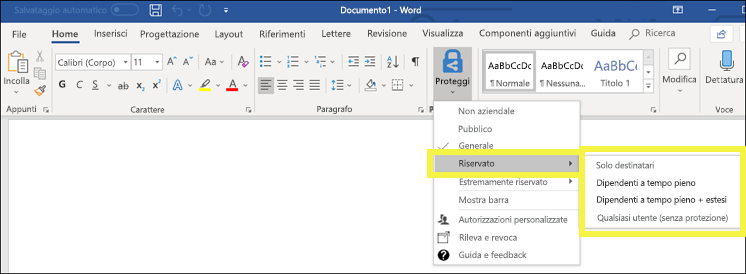

### Modificare o eliminare un'etichetta di riservatezzaEditing or deleting a sensitivity label

Se si elimina un'etichetta di riservatezza, tenere presente che l'etichetta non viene rimossa dal contenuto e che le impostazioni di protezione continuano a essere applicate al contenuto.If you delete a sensitivity label, note that the label is not removed from content, and any protection settings continue to be enforced on the content.

Se si modifica un'etichetta di riservatezza, sarà applicata al contenuto la versione dell'etichetta originalmente applicata su di esso.If you edit a sensitivity label, the version of the label that was applied to content is what’s enforced on that content.

## Operazioni eseguibili dai criteri di etichettaWhat label policies can do

Dopo aver creato le etichette di riservatezza, è necessario pubblicarle per renderle disponibili agli utenti dell'organizzazione, che possono quindi applicare etichette al contenuto. A differenza delle etichette di conservazione, che vengono pubblicate in percorsi, ad esempio tutte le cassette postali di Exchange, le etichette di riservatezza vengono pubblicate a utenti o gruppi. Le etichette di riservatezza saranno visualizzate nelle applicazioni di Office per quegli utenti e gruppi.After you create your sensitivity labels, you need to publish them, to make them available to people in your organization, who can then apply the labels to content. Unlike retention labels, which are published to locations, such as all Exchange mailboxes, sensitivity labels are published to users or groups. Sensitivity labels then appear in Office apps for those users and groups.

Con un criterio di etichetta, è possibile:With a label policy, you can:

- **Scegliere gli utenti e i gruppi che visualizzeranno le etichette.** Le etichette possono essere pubblicate in un gruppo di sicurezza abilitato per la posta elettronica, un gruppo di distribuzione, un gruppo di Office 365 o un gruppo di distribuzione dinamico.**Choose which users and groups see the labels.** Labels can be published to any email-enabled security group, distribution group, Office 365 group, or dynamic distribution group.

- **Applicare un'etichetta predefinita** a tutti i nuovi documenti e messaggi di posta elettronica creati dagli utenti e dai gruppi inclusi nel criterio di etichetta. Questa etichetta predefinita può impostare un livello di base di impostazioni di protezione che si desidera applicare a tutto il contenuto.**Apply a default label** to all new documents and email created by the users and groups included in the label policy. This default label can set a base level of protection settings that you want applied to all your content.

- **Richiedere una motivazione per modificare un'etichetta.** Se il contenuto è contrassegnato come Riservato e un utente desidera rimuovere l'etichetta o sostituirla con una classificazione inferiore, ad esempio un'etichetta denominata Pubblico, è possibile richiedere che l'utente fornisca una motivazione quando esegue questa operazione. Le motivazioni saranno sottoposte a esame dell’amministratore. Attualmente stiamo lavorando a un report in cui gli amministratori potranno visualizzare le motivazioni dell'utente.**Require a justification for changing a label.** If content is marked Confidential and a user wants to remove that label or replace it with a lower classification, such as a label named Public, you can require that the user provide a justification when performing this action. These justifications will be available for the admin to review. We’re currently working on a report where admins can view the user justifications.

    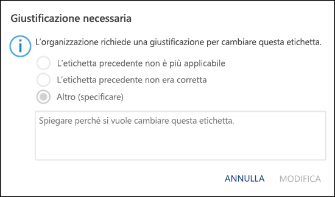

- **Richiedere agli utenti di applicare un'etichetta alla posta elettronica e ai documenti.** Se si vuole che tutto il contenuto di un utente sia etichettato, è possibile richiedere l'applicazione di un'etichetta a tutti i documenti salvati e i messaggi di posta elettronica inviati. L'etichetta può essere assegnata manualmente dall'utente, automaticamente come risultato di una condizione oppure assegnata per impostazione predefinita (opzione per etichetta predefinita descritta in precedenza). Ecco il messaggio di richiesta visualizzato in Outlook quando un utente deve assegnare un'etichetta.**Require users to apply a label to their email and documents.** If you want all of a user's content to be labeled, you can require that a label must be applied to all of their saved documents and sent emails. The label can be assigned manually by the user, automatically as a result of a condition, or be assigned by default (the default label option described above). Here's the prompt shown in Outlook when a user is required to assign a label.

    > [!NOTE]
    > L'etichettatura obbligatoria richiede un abbonamento ad Azure Information Protection. A tale scopo, è necessario scaricare e installare il [client Azure Information Protection](https://www.microsoft.com/download/details.aspx?id=53018) o il [client di assegnazione delle etichette unificato Azure Information Protection](https://docs.microsoft.com/azure/information-protection/rms-client/install-unifiedlabelingclient-app). Microsoft sta lavorando al supporto nativo per questa funzionalità nelle applicazioni di Office, in modo che il client Azure Information Protection non sia necessario. Inoltre, poiché il client viene eseguito solo in Windows, questa funzionalità non è ancora supportata in Mac, iOS e Android.Mandatory labeling requires an Azure Information Protection subscription. To use this feature, you must download and install either the [Azure Information Protection client](https://www.microsoft.com/download/details.aspx?id=53018) or the later [Azure Information Protection unified labeling client](https://docs.microsoft.com/azure/information-protection/rms-client/install-unifiedlabelingclient-app). We're working on native support for this feature in Office apps, so that it won't require the Azure Information Protection client. Also, the client runs only on Windows, so this feature is not yet supported on Mac, iOS, and Android.

    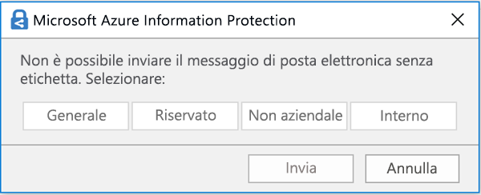

- **Fornire il collegamento a una pagina della Guida personalizzata.** Se gli utenti non conoscono il significato delle etichette di riservatezza o non sanno come usarle, è possibile fornire un URL che consente di accedere a maggiori informazioni, visualizzato nella parte inferiore del menu dell'etichetta di riservatezza nelle app di Office.**Provide help link to a custom help page.** If your users aren’t sure what your sensitivity labels mean or how they should be used, you can provide a Learn More URL that appears at the bottom of the Sensitivity label menu in the Office apps.

    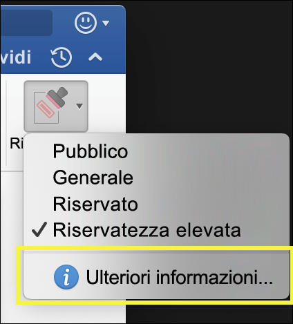

Dopo aver creato un criterio di etichetta e aver assegnato le etichette di riservatezza a utenti e gruppi, le etichette saranno disponibili per quegli utenti nelle applicazioni di Office in un'ora o meno.After you create a label policy and assign sensitivity labels to users and groups, those people will see those labels available in the Office apps in an hour or less.

### Priorità dei criteri di etichetta (l’ordine è importante)Label priority (order matters)

Per rendere disponibili le etichette di riservatezza agli utenti, è possibile pubblicarle in un criterio di etichetta di riservatezza, incluso in un elenco della scheda **Criteri di riservatezza** nella pagina **Criteri etichetta**.You make your sensitivity labels available to users by publishing them in a sensitivity label policy, which appears in a list on the **Sensitivity policies** tab on the **Label policies** page. Come le etichette di riservatezza (vedere la sezione precedente [Priorità dell'etichetta (l'ordine è importante)](#label-priority-order-matters)), l'ordine dei criteri di etichetta di riservatezza è importante perché ne rispecchia la priorità.Just like sensitivity labels (see the above section [Label priority (order matters)](#label-priority-order-matters)), the order of the sensitivity label policies is important because it reflects their priority. Il criterio di etichetta con priorità più bassa viene visualizzato nella parte **superiore**, mentre il criterio di etichetta con priorità più alta viene visualizzato nella parte **inferiore**.The label policy with lowest priority is shown at the **top**, and label policy with the highest priority is shown at the **bottom**.

Un criterio di etichetta è costituito da:A label policy consists of:

- Un set di etichette.A set of labels.
- Lo scopo dei criteri di etichetta, ossia gli utenti e i gruppi inclusi nel criterio.The scope of the label policy, meaning the users and groups included in the policy.
- Le impostazioni dei criteri di etichetta descritte sopra (etichetta predefinita, motivazione, etichette obbligatorie e collegamento alla guida).The settings of the label policy described above (default label, justification, mandatory label, and help link).

È possibile includere un utente in più criteri di etichetta. L'utente visualizzerà tutte le etichette di riservatezza di tali criteri.You can include a user in multiple label policies, and the user will see all of the sensitivity labels from those policies. Vedrà però le impostazioni dei criteri solo del criterio di etichetta con la priorità più alta.However, a user will see the policy settings from only the label policy with the highest priority.

Se un utente o un gruppo dell'organizzazione non vede più un'opzione nel criterio di etichetta previsto, ad esempio un'etichetta predefinita o obbligatoria, controllare l'ordine dei criteri di etichetta di riservatezza.If a user or group in your organization is not seeing an option in the label policy that you intended, such as a default or mandatory label, check the order of the sensitivity label policies. Per riordinare i criteri di etichetta, selezionare un criterio di etichetta di riservatezza > scegliere i puntini di sospensione a destra > **Spostare su** o **Sposta giù**.To re-order the label policies, select a sensitivity label policy > choose the ellipsis on the right > **Move down** or **Move up**.

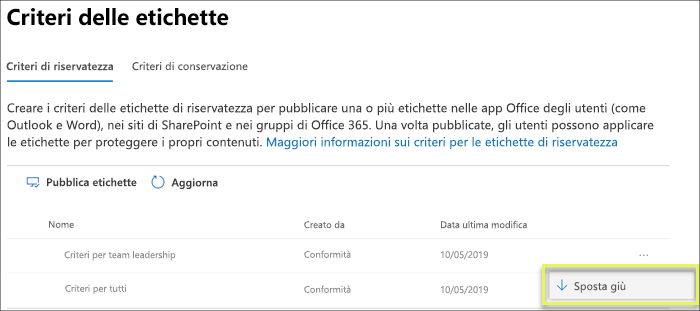

Tenere presente che, mentre la priorità è importante per i criteri di etichetta di riservatezza, **non** è invece importante per i criteri di etichetta di conservazione.Note that while priority matters for sensitivity label policies, it does **not** matter for retention label policies. Come descritto nei [Principi di conservazione, cosa ha la precedenza?](labels.md#the-principles-of-retention-or-what-takes-precedence), il contenuto può essere soggetto a più criteri di conservazione.As explained in [The principles of retention, or what takes precedence?](labels.md#the-principles-of-retention-or-what-takes-precedence), content can be subject to multiple retention policies.

## Come iniziareHow to get started

Iniziare con le etichette di riservatezza è una procedura veloce:Getting started with sensitivity labels is a quick process:

1. **Definire le etichette.** Prima di tutto, è necessario stabilire la tassonomia per definire i diversi livelli di contenuti riservati. Utilizzare nomi o termini comuni che abbiano un significato per gli utenti. Ad esempio, è possibile iniziare con etichette come Personale, Pubblico, Generale, Riservato e Riservatezza elevata. È possibile usare sottoetichette per raggruppare le etichette simili per categoria. Inoltre, quando si crea un'etichetta, è necessaria una descrizione comando, che viene visualizzata nelle applicazioni di Office quando si passa il mouse su un'opzione di etichetta sulla barra multifunzione.**Define the labels.** First, you want to establish your taxonomy for defining different levels of sensitive content. You should use common names or terms that make sense to your users. For example, you can start with labels such as Personal, Public, General, Confidential, and Highly Confidential. You can use sublabels to group similar labels by category. Also, when you create a label, a tool tip is required, which appears in the Office apps when a user hovers over a label option on the Ribbon.

1. **Definire le operazioni eseguibili da ciascuna etichetta.** Quindi, configurare le impostazioni di protezione che si desidera associare a ciascuna etichetta. Ad esempio, a un contenuto con un basso grado di riservatezza (un'etichetta "Generale") potrebbe essere applicata solo un'intestazione o un piè di pagina, mentre a un contenuto con un maggiore grado di riservatezza (un'etichetta "Riservato") potrebbe essere applicata una filigrana, la crittografia e WIP, per garantire che possano accedervi solo gli utenti con privilegi.**Define what each label can do.** Then, configure the protection settings you want associated with each label. For example, lower sensitivity content (a “General” label) might simply have a header or footer applied to it, while higher sensitivity content (a “Confidential” label) may have a watermark, encryption, and WIP applied to it, to help ensure that only privileged users can access it.
 
1. **Definire chi ha accesso alle etichette.** Dopo avere definito le etichette dell’organizzazione, queste sono pubblicate in un criterio di etichetta che controlla quali utenti e gruppi possono visualizzarle. Una singola etichetta è riutilizzabile (è definita una sola volta e quindi è possibile includerla in diversi criteri di etichetta assegnati a più utenti). Ma perché un'etichetta possa essere assegnata al contenuto, è necessario prima pubblicarla in modo che sia disponibile nelle applicazioni di Office e in altri servizi. Quando si inizia, è possibile provare a usare le etichette di riservatezza assegnandole a pochi utenti.**Define who gets the labels.** After you define your organization’s labels, you publish them in a label policy that controls which users and groups see those labels. A single label is reusable – you define it once, and then you can include it in several label policies assigned to different users. But in order for a label to be assigned to content, you must first publish that label so that it’s available in Office apps and other services. When just starting out, you can pilot your sensitivity labels by assigning them to just a few people.

Ecco il flusso di base delle operazioni eseguite da amministratore, utente e applicazione di Office per consentire il funzionamento delle etichette di riservatezza.Here’s the basic flow of what the admin, user, and Office app do to make sensitivity labels work.

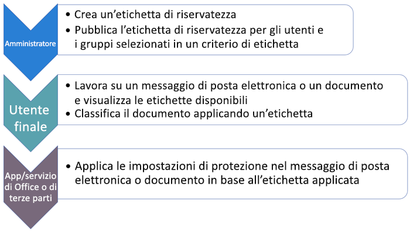

## Posizioni in cui è possibile visualizzare le etichette di riservatezzaWhere sensitivity labels can appear

Le etichette di riservatezza vengono visualizzate nell'interfaccia utente delle app di Office. Per visualizzare la disponibilità corrente per piattaforme e applicazioni specifiche, vedere **[Oggi dov'è disponibile questa funzionalità?](https://support.office.com/article/apply-sensitivity-labels-to-your-documents-and-email-within-office-2f96e7cd-d5a4-403b-8bd7-4cc636bae0f9?ad=US&ui=en-US&rs=en-US#bkmk_whereavailable)**Sensitivity labels appear in the UI of Office apps. To view the current availability for specific apps and platforms, see **[Where is the feature available today?](https://support.office.com/article/apply-sensitivity-labels-to-your-documents-and-email-within-office-2f96e7cd-d5a4-403b-8bd7-4cc636bae0f9?ad=US&ui=en-US&rs=en-US#bkmk_whereavailable)**

### App di Office in WindowsOffice apps on Windows

Nelle app di Office nei dispositivi che eseguono Windows, le etichette di riservatezza sono visualizzate nel pulsante **Riservatezza** nella scheda **Home** della barra multifunzione. L'etichetta applicata viene visualizzata anche nella barra di stato nella parte inferiore della finestra.In Office apps on devices running Windows, sensitivity labels appear on the **Sensitivity** button, on the **Home** tab on the Ribbon. The label applied also appears in the Status bar at the bottom of the window.

Il supporto nativo per le etichette di riservatezza nelle app di Office in Windows sarà disponibile a breve.Coming soon is native support for sensitivity labels in Office apps on Windows.

Se si è un cliente esistente di Azure Information Protection, è possibile distribuire il client di assegnazione delle etichette unificato di Azure Information Protection, che supporta le etichette di riservatezza, Per ulteriori informazioni riguardanti il download del client, vedere [Client di etichettatura unificata di Azure Information Protection: informazioni sul rilascio della versione](https://docs.microsoft.com/azure/information-protection/rms-client/unifiedlabelingclient-version-release-history). Attualmente stiamo lavorando al supporto nativo per le etichette di riservatezza nelle app di Office in Windows, in modo da rendere il client di assegnazione delle etichette unificata di Azure Information Protection non più necessario.If you're an existing Azure Information Protection customer, you can deploy the Azure Information Protection unified labeling client, which supports sensitivity labels. For more information about downloading the client, see [Azure Information Protection unified labeling client: Version release information](https://docs.microsoft.com/azure/information-protection/rms-client/unifiedlabelingclient-version-release-history). We’re currently working on native support for sensitivity labels in Office apps on Windows, so that the Azure Information Protection unified labeling client will no longer be required.

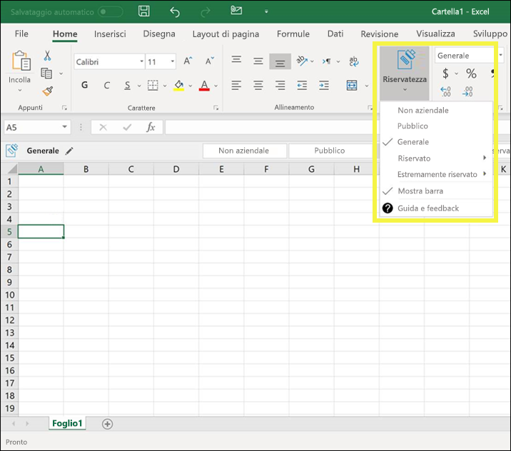

### Applicazioni di Office per MacOffice apps on Mac

Nelle applicazioni di Office nei dispositivi Mac, le etichette di riservatezza sono visualizzate nel pulsante **Riservatezza** nella scheda **Home** della barra multifunzione. L’etichetta applicata viene visualizzata anche nella barra di stato nella parte inferiore della finestra.In Office apps on Mac devices, sensitivity labels appear on the **Sensitivity** button, on the **Home** tab on the Ribbon. The label applied also appears in the Status bar at the bottom of the window.

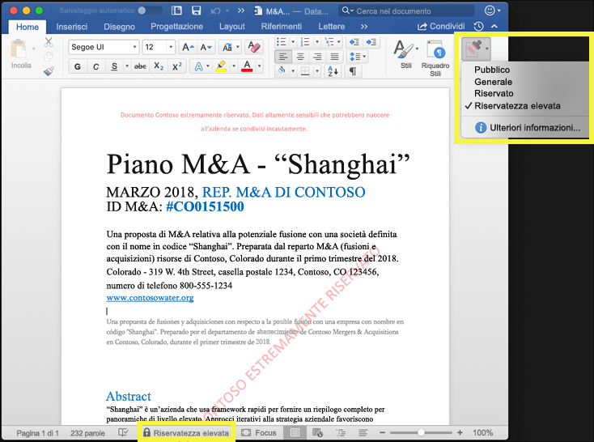

### Applicazioni di Office in iOSOffice apps on iOS

Nelle applicazioni di Office nei dispositivi iOS, le etichette di riservatezza sono visualizzate nel pulsante **Riservatezza** nella scheda **Home** della barra multifunzione. L’etichetta applicata viene visualizzata anche nella barra di stato nella parte inferiore della finestra.In Office apps on iOS devices, sensitivity labels appear on the **Sensitivity** button, on the **Home** tab on the Ribbon. The label applied also appears in the Status bar at the bottom of the window.

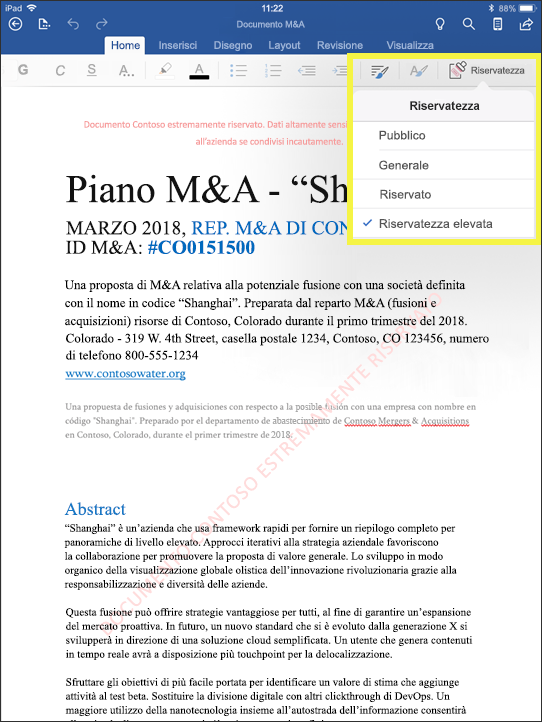

### Applicazioni di Office in AndroidOffice apps on Android

Nelle applicazioni di Office nei dispositivi Android, le etichette di riservatezza sono visualizzate nel pulsante **Riservatezza** nella scheda **Home** della barra multifunzione. L’etichetta applicata viene visualizzata anche nella barra di stato nella parte inferiore della finestra.In Office apps on Android devices, sensitivity labels appear on the **Sensitivity** button, on the **Home** tab on the Ribbon. The label applied also appears in the Status bar at the bottom of the window.

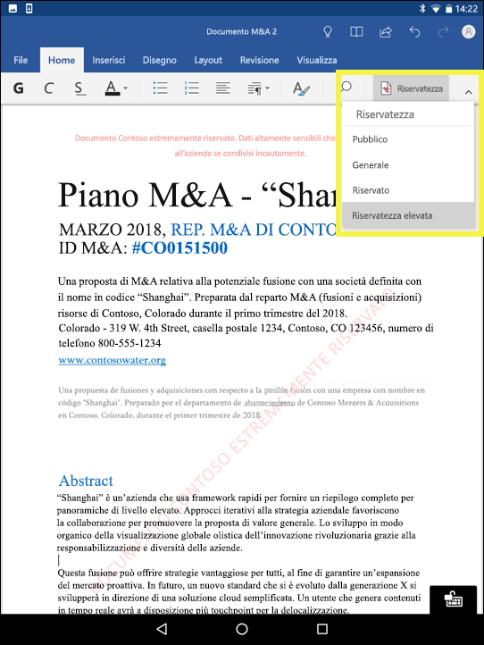

### Ulteriori informazioni sulle etichette di riservatezza nelle applicazioni di OfficeMore information on sensitivity labels in Office apps

- [Applicare etichette di riservatezza ai documenti e ai messaggi di posta elettronica in OfficeApply sensitivity labels to your documents and email within Office](https://support.office.com/article/apply-sensitivity-labels-to-your-documents-and-email-within-office-2f96e7cd-d5a4-403b-8bd7-4cc636bae0f9)
- [Problemi noti quando si applicano le etichette di riservatezza per i file di OfficeKnown issues when you apply sensitivity labels to your Office files](https://support.office.com/article/known-issues-when-you-apply-sensitivity-labels-to-your-office-files-b169d687-2bbd-4e21-a440-7da1b2743edc)

## Funzionamento delle etichette di riservatezza con etichette esistenti di Azure Information ProtectionHow sensitivity labels work with existing Azure Information Protection labels

Gli utenti di Azure Information Protection possono attualmente classificare e assegnare etichette ai contenuti in Windows con il client di assegnazione delle etichette unificato di Azure Information Protection. Le etichette esistenti di Azure Information Protection sono perfettamente integrate con le nuove etichette di riservatezza. Questo significa che è possibile:Azure Information Protection users are currently able to classify and label content on Windows by using the Azure Information Protection unified labeling client. Existing Azure Information Protection labels work seamlessly with new sensitivity labels. This means you can:

- Mantenere le etichette esistenti di Azure Information Protection in documenti e messaggi di posta elettronica.Keep your existing Azure Information Protection labels on documents and email.
- Mantenere la configurazione di etichetta Azure Information Protection esistente.Keep your existing Azure Information Protection label configuration.

Se si usano le etichette di Azure Information Protection, per il momento è consigliabile evitare di creare nuove etichette nelle altre interfacce di amministrazione finché non è stata completata la migrazione.If you are using Azure Information Protection labels, for now we recommend that you avoid creating new labels in other admin centers until after you’ve completed your migration. L'[argomento sulla migrazione di etichette di Azure Information Protection](https://docs.microsoft.com/azure/information-protection/configure-policy-migrate-labels) contiene informazioni importanti e alcuni avvisi specifici.The [Azure Information Protection migration topic](https://docs.microsoft.com/azure/information-protection/configure-policy-migrate-labels) has important information and some specific caveats. Se non si è ancora pronti per eseguire la migrazione dei tenant di produzione alle etichette di riservatezza, non c'è motivo di preoccuparsi: per il momento, gli utenti possono continuare a usare il client di Azure Information Protection e gli amministratori possono continuare a usare il portale di Azure per la gestione.If you are not yet ready to migrate your production tenants to sensitivity labels, there is no cause for concern: for the moment, your users can continue using the Azure Information Protection client, and admins can continue using the Azure portal for management.

## Proteggere il contenuto nei dispositivi Windows con Endpoint Protection in Microsoft IntuneProtect content on Windows devices by using endpoint protection in Microsoft Intune

Quando si crea un'etichetta di riservatezza, è possibile comunicare a Windows che i file con questa etichetta sono riservati e devono essere protetti dalla perdita di dati quando sono archiviati nei dispositivi Windows. L’opzione consente di garantire che il contenuto con questa etichetta sia condiviso o copiato solo in percorsi approvati, anche quando è archiviato in un punto finale. In sostanza, attivare questa opzione per un'etichetta di riservatezza indica che si tratta di dati molto importanti che richiedono vincoli di utilizzo aggiuntivi.When you create a sensitivity label, you have the option to tell Windows that files with this label are sensitive and need to be protected against data leakage when stored on Windows devices. This option can help ensure that content with this label can be shared or copied only to sanctioned locations, even when it’s stored on an endpoint. In essence, turning on this option for a sensitivity label tells Windows that this is extra critical data that warrants additional usage constraints.

Quando si attiva questa opzione, Windows può leggere, comprendere ed agire sulle etichette di riservatezza nei documenti e applicare automaticamente Windows Information Protection (WIP) al contenuto, indipendentemente da come raggiunge un dispositivo Windows gestito. Ciò consente di proteggere i file con etichetta dalla perdita accidentale, con o senza applicazione di crittografia.When you turn on this option, Windows can read, understand, and act on sensitivity labels in documents and automatically apply Windows Information Protection (WIP) on content, no matter how it reaches a managed Windows device. This helps protect labeled files from accidental leakage, with or without applying encryption.

Ad esempio, Windows è in grado di comprendere che a un documento Word presente nel computer di un utente è applicata un'etichetta, e WIP è in grado di applicare un criterio di protezione di app per evitare la copia o la condivisione dei dati in una posizione privata da quel dispositivo (ad esempio un OneDrive personale, account di posta elettronica personale, social media o unità USB).For example, Windows can understand that a Word document residing on a user’s machine has a Confidential label applied to it, and WIP can apply an app protection policy to prevent the copying or sharing of the data to any non-work location from that device (such as a personal OneDrive, personal email accounts, social media, or USB drives).

Se un utente tenta di caricare i dati cui è applicata l’etichetta in un account personale di Gmail, vedrà questo messaggio.If a user attempts to upload labeled content to a personal Gmail account, they see this message.

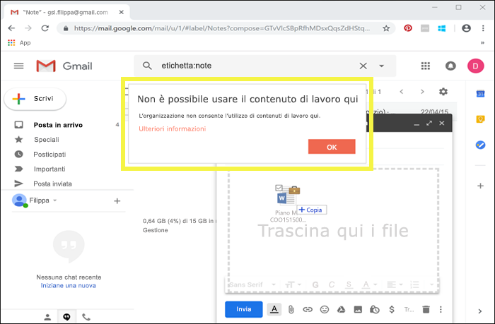

E se un utente tenta di salvare il contenuto cui è applicata l’etichetta in un'unità USB, vedrà questo messaggio.And if a user attempts to save labeled content to a USB drive, they see this message.

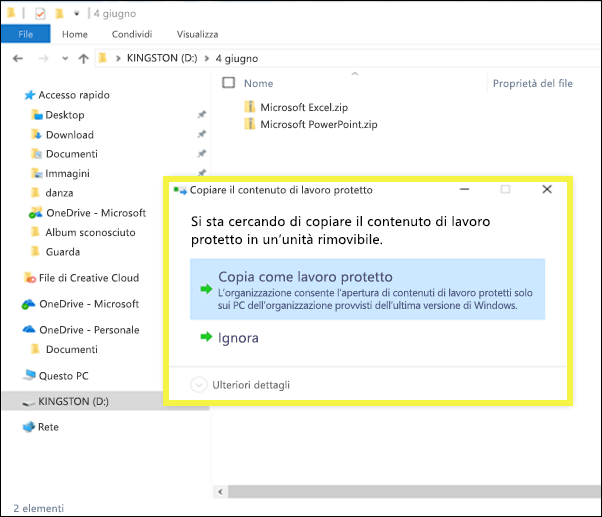

### Prerequisiti importantiImportant prerequisites

Affinché le etichette di riservatezza possano utilizzare WIP, è necessario eseguire prima i prerequisiti descritti di seguito: [Come Windows Information Protection protegge i file con un'etichetta di riservatezza](https://docs.microsoft.com/windows/security/information-protection/windows-information-protection/how-wip-works-with-labels?branch=vsts17546553). Questo argomento illustra i prerequisiti seguenti:Before your sensitivity labels can use WIP, you first need to do the prerequisites described here: [How Windows Information Protection protects files with a sensitivity label](https://docs.microsoft.com/windows/security/information-protection/windows-information-protection/how-wip-works-with-labels?branch=vsts17546553). This topic describes the following prerequisites:

- Assicurarsi di eseguire Windows 10 versione 1809 o successive.Make sure you're running Windows 10, version 1809 or later.
- [Configurare Microsoft Defender Advanced Threat Protection (Microsoft Defender ATP)](https://docs.microsoft.com/windows/security/threat-protection/microsoft-defender-atp/get-started), che analizza il contenuto di un'etichetta e applica la relativa protezione WIP.[Set up Windows Defender Advanced Threat Protection (WDATP)](https://docs.microsoft.com/windows/security/threat-protection/microsoft-defender-atp/get-started), which scans content for a label and applies the corresponding WIP protection. ATP performs some actions independently from WIP, such as reporting anomalies. ATP esegue alcune operazioni in modo indipendente da WIP, ad esempio la segnalazione di anomalie.ATP performs some actions independently from WIP, such as reporting anomalies.
- Creare un criterio di Windows Information Protection (WIP) valido per i dispositivi endpoint. È possibile farlo in una di queste posizioni:Create a Windows Information Protection (WIP) policy that applies to endpoint devices. You can do this in either of these locations:
    - [Creare un criterio di Windows Information Protection (WIP) con MDM tramite il portale di Azure per Microsoft IntuneCreate a Windows Information Protection (WIP) policy with MDM using the Azure portal for Microsoft Intune](https://docs.microsoft.com/windows/security/information-protection/windows-information-protection/create-wip-policy-using-intune-azure)
    - [Creare e distribuire un criterio di Windows Information Protection (WIP) con System Center Configuration ManagerCreate and deploy a Windows Information Protection (WIP) policy using System Center Configuration Manager](https://docs.microsoft.com/windows/security/information-protection/windows-information-protection/create-wip-policy-using-sccm)

## Proteggere i contenuti in app e servizi di terze parti con Microsoft Cloud App SecurityProtect content in third-party apps and services by using Microsoft Cloud App Security

Proteggere i contenuti in app e servizi di terze parti con Cloud App Security (CAS).Protect content in third-party apps and services by using Cloud App Security (CAS). Con CAS, è possibile rilevare, classificare, etichettare e proteggere i contenuti in servizi e app di terze parti, ad esempio SalesForce, Box o DropBox.With CAS, you can detect, classify, label, and protect content in third-party services and apps, such as SalesForce, Box, or Dropbox. Ad esempio Dropbox potrebbe non comprendere un'etichetta di riservatezza, ma CAS può entrare in contatto e proteggere il contenuto cui è applicata l'etichetta.For example, Dropbox might not understand a sensitivity label, but CAS can reach out and protect labeled content in that location.

Per altre informazioni, vedere [Applicare automaticamente etichette di classificazione di Azure Information Protection](https://docs.microsoft.com/cloud-app-security/use-case-information-protection).For more information, see [Automatically apply Azure Information Protection classification labels](https://docs.microsoft.com/cloud-app-security/use-case-information-protection).

### Prerequisiti importantiImportant prerequisites

Prima che le etichette di riservatezza possano usare CAS, è necessario eseguire i prerequisiti descritti di seguito: [Applicare automaticamente le etichette di classificazione di Azure Information Protection](https://docs.microsoft.com/cloud-app-security/use-case-information-protection).Before your sensitivity labels can use CAS, you first need to do the prerequisites described here: [Automatically apply Azure Information Protection classification labels](https://docs.microsoft.com/cloud-app-security/use-case-information-protection). In questo argomento sono descritti i prerequisiti seguenti:This topic describes the following prerequisites:

- [Abilitare Cloud App Security e Azure Information Protection](https://docs.microsoft.com/cloud-app-security/azip-integration) per il tenant.[Enable Cloud App Security and Azure Information Protection](https://docs.microsoft.com/cloud-app-security/azip-integration) for your tenant.
- [Connettere l'app](https://docs.microsoft.com/cloud-app-security/enable-instant-visibility-protection-and-governance-actions-for-your-apps) a Cloud App Security.[Connect the app](https://docs.microsoft.com/cloud-app-security/enable-instant-visibility-protection-and-governance-actions-for-your-apps) to Cloud App Security.

## Estendere le etichette di riservatezza ad applicazioni e servizi di terze parti con SDK di Microsoft Information ProtectionExtend sensitivity labels to third-party apps and services by using the Microsoft Information Protection SDK

Poiché un'etichetta di riservatezza viene mantenuta come testo non crittografato nei metadati di un documento, applicazioni e servizi di terze parti possono scegliere di supportare l’identificazione e la protezione di contenuti che contengono tale etichetta. Il supporto in altre applicazioni e servizi è in continua espansione.Because a sensitivity label is persisted as clear text in the metadata of a document, third-party apps and services can choose to support identifying and protecting content that contains such a label. Support in other apps and services is always expanding.

Con [SDK di Microsoft Information Protection](https://docs.microsoft.com/information-protection/develop/), le applicazioni e i servizi di terze possono leggere e applicare ai documenti le etichette di riservatezza e protezione. SDK supporta le applicazioni in Windows, Mac e Linux. Il supporto per le applicazioni in iOS e Android sarà disponibile a breve.With the [Microsoft Information Protection SDK](https://docs.microsoft.com/information-protection/develop/), third-party apps and services can read and apply sensitivity labels and protection to documents. The SDK supports apps on Windows, Mac, and Linux. Coming soon is support for apps on iOS and Android.

Tramite SDK, è possibile etichettare e proteggere il contenuto in modo tale da funzionare con altre applicazioni e servizi di Microsoft Information Protection, ad esempio le applicazioni di Office, i servizi di Office 365, lo scanner Azure Information Protection, Microsoft Cloud App Security e molte altre soluzioni partner. Ad esempio, ottenere altre informazioni sul [supporto per le etichette di riservatezza in Adobe Acrobat](https://techcommunity.microsoft.com/t5/Azure-Information-Protection/Starting-October-use-Adobe-Acrobat-Reader-for-PDFs-protected-by/ba-p/262738).Using the SDK, you can label and protect content in a way that works with other Microsoft Information Protection apps and services, such as Office apps, Office 365 services, the Azure Information Protection scanner, Microsoft Cloud App Security, and several other partner solutions. For example, learn more about [support for sensitivity labels in Adobe Acrobat](https://techcommunity.microsoft.com/t5/Azure-Information-Protection/Starting-October-use-Adobe-Acrobat-Reader-for-PDFs-protected-by/ba-p/262738).

Per ulteriori informazioni sulla protezione di SDK di Microsoft Information Protection, vedere l’[annuncio nel blog Tech Community](https://techcommunity.microsoft.com/t5/Microsoft-Information-Protection/Microsoft-Information-Protection-SDK-Now-Generally-Available/ba-p/263144). È inoltre possibile ottenere maggiori informazioni sulle [soluzioni partner integrate con Microsoft Information Protection](https://techcommunity.microsoft.com/t5/Azure-Information-Protection/Microsoft-Information-Protection-showcases-integrated-partner/ba-p/262657).To learn more about the Microsoft Information Protection SDK, see the [announcement on the Tech Community blog](https://techcommunity.microsoft.com/t5/Microsoft-Information-Protection/Microsoft-Information-Protection-SDK-Now-Generally-Available/ba-p/263144). You can also learn about [partner solutions that are integrated with Microsoft Information Protection](https://techcommunity.microsoft.com/t5/Azure-Information-Protection/Microsoft-Information-Protection-showcases-integrated-partner/ba-p/262657).

## AutorizzazioniPermissions

I membri del team di conformità che creano un'etichetta di riservatezza necessitano delle autorizzazioni per il Centro conformità Microsoft 365, il Centro sicurezza Microsoft 365 o il Centro sicurezza e conformità di Office 365.Members of your compliance team who will create sensitivity labels need permissions to the Microsoft 365 compliance center, Microsoft 365 security center, or Office 365 Security & Compliance Center. Per impostazione predefinita, l'amministratore del tenant avrà accesso a queste interfacce di amministrazione e potrà fornire ai responsabili della conformità e ad altri utenti l'accesso, senza concedere tutte le autorizzazioni di un amministratore tenant. Per eseguire questa operazione, è consigliabile andare sulla pagina **Autorizzazioni di uno di questi interfacce di amministrazione, quindi aggiungere membri al gruppo di ruoli di **Amministratore di conformità** o Amministratore della sicurezza**.Members of your compliance team who will create retention policies need permissions to the Security  Compliance Center. By default, your tenant admin will have access to this location and can give compliance officers and other people access to the Security  Compliance Center, without giving them all of the permissions of a tenant admin. To do this, we recommend that you go to the Permissions page of the Security  Compliance Center, edit the Compliance Administrator role group, and add members to that role group.

Per ulteriori informazioni, vedere [Concedere agli utenti l'accesso al Centro sicurezza e conformità di Office 365](grant-access-to-the-security-and-compliance-center.md).For more information, see [Give users access to the Office 365 Security & Compliance Center](grant-access-to-the-security-and-compliance-center.md).

Queste autorizzazioni sono necessarie solo per creare e applicare etichette e criteri di etichetta. L'applicazione dei criteri non richiede l'accesso al contenuto.These permissions are required only to create and apply labels and a label policy. Policy enforcement does not require access to the content.
