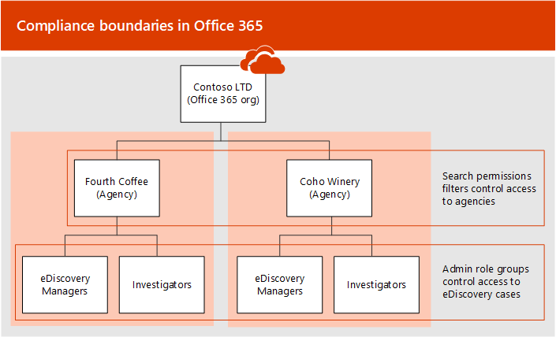

# <a name="set-up-compliance-boundaries-for-ediscovery-investigations-in-office-365"></a><span data-ttu-id="2ffe4-104">Impostare i limiti di conformità per le indagini eDiscovery in Office 365</span><span class="sxs-lookup"><span data-stu-id="2ffe4-104">Set up compliance boundaries for eDiscovery investigations in Office 365</span></span>

<span data-ttu-id="2ffe4-p102">Limiti di conformità creare confini logici all'interno dell'organizzazione Office 365 che controllano i percorsi di contenuto utente (ad esempio le cassette postali, i siti di SharePoint e gli account OneDrive) che possono eseguire ricerche eDiscovery Manager. Inoltre, conformità limiti controllano l'accesso dei casi eDiscovery consentono di gestire l'ufficio legale, risorse umane o altre indagini all'interno dell'organizzazione. La necessità di limiti di conformità è spesso necessaria per le aziende delle Nazioni a più che devono rispettare normative e gli assalti dati geografici e negli enti pubblici, spesso suddivisa in diverse enti regionali. In Office 365, della Guida dei limiti di conformità vengano soddisfatti questi requisiti durante l'esecuzione di contenuto managing indagini con casi di eDiscovery e le ricerche.</span><span class="sxs-lookup"><span data-stu-id="2ffe4-p102">Compliance boundaries create logical boundaries within an Office 365 organization that control the user content locations (such as mailboxes, SharePoint sites, and OneDrive accounts) that eDiscovery managers can search. Additionally, compliance boundaries control who can access eDiscovery cases used to manage the legal, human resources, or other investigations within your organization. The need for compliance boundaries is often necessary for multi-nations corporations that have to respect geographical boarders and regulations, and for governments, which are often divided into different agencies. In Office 365, compliance boundaries help you meet these requirements when performing content searches and managing investigations with eDiscovery cases.</span></span>
  
<span data-ttu-id="2ffe4-109">L'esempio che verrà utilizzata nell'illustrazione seguente per illustrare il funzionamento dei limiti di conformità.</span><span class="sxs-lookup"><span data-stu-id="2ffe4-109">We'll use the example in the following illustration to explain how compliance boundaries work.</span></span>
  

  
<span data-ttu-id="2ffe4-p103">In questo esempio, Contoso LTD è un'organizzazione di Office 365 costituita da due filiali, Fourth Coffee e Coho Winery. L'azienda richiede che ricercatori e strumenti di gestione di eDiscovery possono effettuare la ricerca solo le cassette postali di Exchange, gli account di OneDrive e siti di SharePoint nel loro Agenzia. Inoltre, i responsabili di eDiscovery e ricercatori viene visualizzato solo casi di eDiscovery nel nella loro agenzia e possono accedere solo i casi è un membro del. Ecco come dei limiti di conformità soddisfano questi requisiti.</span><span class="sxs-lookup"><span data-stu-id="2ffe4-p103">In this example, Contoso LTD is an Office 365 organization that consists of two subsidiaries, Fourth Coffee and Coho Winery. The business requires that eDiscovery mangers and investigators can only search the Exchange mailboxes, OneDrive accounts, and SharePoint sites in their agency. Additionally, eDiscovery managers and investigators can only see eDiscovery cases in the in their agency, and they can only access the cases that they're a member of. Here's how compliance boundaries meet these requirements.</span></span>
  
- <span data-ttu-id="2ffe4-p104">Le autorizzazioni di ricerca filtro funzionalità di ricerca di contenuti controlli i percorsi di contenuti che possono eseguire ricerche ricercatori e i responsabili di eDiscovery. Di conseguenza, i responsabili di eDiscovery e ricercatori in agenzia Fourth Coffee ricerca è possono solo i percorsi di contenuti in filiale Fourth Coffee. La stessa restrizione si applica a quelle della filiale Coho Winery.</span><span class="sxs-lookup"><span data-stu-id="2ffe4-p104">The search permissions filtering functionality in Content Search controls the content locations that eDiscovery managers and investigators can search. This means eDiscovery managers and investigators in the Fourth Coffee agency can only search content locations in the Fourth Coffee subsidiary. The same restriction applies to the Coho Winery subsidiary.</span></span>
    
    <span data-ttu-id="2ffe4-p105">Gruppi di ruolo controllare quali utenti può visualizzare i casi di eDiscovery in Office 365 Security &amp; centro conformità. Ciò significa che ricercatori ed eDiscovery Manager possono visualizzare solo i casi di eDiscovery in loro Agenzia.</span><span class="sxs-lookup"><span data-stu-id="2ffe4-p105">Role groups control who can see the eDiscovery cases in the Office 365 Security &amp; Compliance Center. This means that eDiscovery managers and investigators can only see the eDiscovery cases in their agency.</span></span>
    
- <span data-ttu-id="2ffe4-p106">Gruppi di ruoli controllano che possono assegnare i membri a un caso eDiscovery. Ciò significa ricercatori e i responsabili di eDiscovery possono assegnare solo i membri per i casi in cui vengono anch ' essi essere membri del.</span><span class="sxs-lookup"><span data-stu-id="2ffe4-p106">Role groups also control who can assign members to an eDiscovery case. This means eDiscovery managers and investigators can only assign members to cases that they themselves are a member of.</span></span>
    
<span data-ttu-id="2ffe4-122">Di seguito è il processo per la configurazione dei limiti di conformità:</span><span class="sxs-lookup"><span data-stu-id="2ffe4-122">Here's the process for setting up compliance boundaries:</span></span>
  
[<span data-ttu-id="2ffe4-123">Passaggio 1: Identificare un attributo utente per definire le enti governativi</span><span class="sxs-lookup"><span data-stu-id="2ffe4-123">Step 1: Identify a user attribute to define your agencies</span></span>](#step-1-identify-a-user-attribute-to-define-your-agencies)

[<span data-ttu-id="2ffe4-124">Passaggio 2: File di una richiesta con il supporto Microsoft per sincronizzare l'attributo utente per l'account OneDrive</span><span class="sxs-lookup"><span data-stu-id="2ffe4-124">Step 2: File a request with Microsoft Support to synchronize the user attribute to OneDrive accounts</span></span>](#step-2-file-a-request-with-microsoft-support-to-synchronize-the-user-attribute-to-onedrive-accounts)

[<span data-ttu-id="2ffe4-125">Passaggio 3: Creare un gruppo di ruoli per ogni agenzia</span><span class="sxs-lookup"><span data-stu-id="2ffe4-125">Step 3: Create a role group for each agency</span></span>](#step-3-create-a-role-group-for-each-agency)

[<span data-ttu-id="2ffe4-126">Passaggio 4: Creare un filtro di autorizzazioni di ricerca per applicare il limite di conformità</span><span class="sxs-lookup"><span data-stu-id="2ffe4-126">Step 4: Create a search permissions filter to enforce the compliance boundary</span></span>](#step-4-create-a-search-permissions-filter-to-enforce-the-compliance-boundary)

[<span data-ttu-id="2ffe4-127">Passaggio 5: Creare un caso eDiscovery per indagini una stretta tra le</span><span class="sxs-lookup"><span data-stu-id="2ffe4-127">Step 5: Create an eDiscovery case for an intra-agency investigations</span></span>](#step-5-create-an-ediscovery-case-for-an-intra-agency-investigations)
  
## <a name="step-1-identify-a-user-attribute-to-define-your-agencies"></a><span data-ttu-id="2ffe4-128">Passaggio 1: Identificare un attributo utente per definire le enti governativi</span><span class="sxs-lookup"><span data-stu-id="2ffe4-128">Step 1: Identify a user attribute to define your agencies</span></span>

<span data-ttu-id="2ffe4-p107">Il primo passaggio consiste per scegliere un attributo di Azure Active Directory da utilizzare che definirà le agenzie. Questo attributo viene utilizzato per creare il filtro di autorizzazioni di ricerca che consente di limitare una ricerca eDiscovery responsabile per la ricerca solo le posizioni del contenuto di utenti vengono assegnati un valore specifico per questo attributo. Ad esempio, si supponga che Contoso decide di usare l'attributo **reparto** . È il valore per questo attributo per gli utenti in filiale Fourth Coffee `FourthCoffee` e il valore per gli utenti in filiale Coho Winery sarà `CohoWinery`. Nel passaggio 4, si utilizzerà questo `attribute:value` percorsi eseguire una ricerca eDiscovery Manager del contenuto coppia (ad esempio, *Reparto: FourthCoffee* ) per limitare l'utente.</span><span class="sxs-lookup"><span data-stu-id="2ffe4-p107">The first step is to choose an Azure Active Directory attribute to use that will define your agencies. This attribute will be used to create the search permissions filter that limits an eDiscovery manager to search only the content locations of users who are assigned a specific value for this attribute. For example, let's say Contoso decides to use the **Department** attribute. The value for this attribute for users in the Fourth Coffee subsidiary would be  `FourthCoffee`  and the value for users in Coho Winery subsidiary would be `CohoWinery`. In Step 4, you'll use this  `attribute:value`  pair (for example,  *Department:FourthCoffee*  ) to limit the user content locations that eDiscovery managers can search.</span></span> 
  
<span data-ttu-id="2ffe4-134">Ecco un elenco di attributi utente Azure Active Directory che è possibile utilizzare per i limiti di conformità:</span><span class="sxs-lookup"><span data-stu-id="2ffe4-134">Here's a list of Azure Active Directory user attributes that you can use for compliance boundaries:</span></span>
  
- <span data-ttu-id="2ffe4-135">Company</span><span class="sxs-lookup"><span data-stu-id="2ffe4-135">Company</span></span>
    
- <span data-ttu-id="2ffe4-136">CountryCode</span><span class="sxs-lookup"><span data-stu-id="2ffe4-136">CountryCode</span></span>
    
- <span data-ttu-id="2ffe4-137">CustomAttribute1 - CustomAttribute15</span><span class="sxs-lookup"><span data-stu-id="2ffe4-137">CustomAttribute1 - CustomAttribute15</span></span>
    
- <span data-ttu-id="2ffe4-138">Reparto</span><span class="sxs-lookup"><span data-stu-id="2ffe4-138">Department</span></span>
    
- <span data-ttu-id="2ffe4-139">Ufficio</span><span class="sxs-lookup"><span data-stu-id="2ffe4-139">Office</span></span>
    
<span data-ttu-id="2ffe4-140">Sebbene ulteriori attributi utente siano disponibili, in particolare per cassette postali di Exchange, gli attributi sopra elencati sono le uniche è attualmente supportate da OneDrive.</span><span class="sxs-lookup"><span data-stu-id="2ffe4-140">Although more user attributes are available, particularly for Exchange mailboxes, the attributes listed above are the only ones currently supported by OneDrive.</span></span>
  
## <a name="step-2-file-a-request-with-microsoft-support-to-synchronize-the-user-attribute-to-onedrive-accounts"></a><span data-ttu-id="2ffe4-141">Passaggio 2: File di una richiesta con il supporto Microsoft per sincronizzare l'attributo utente per l'account OneDrive</span><span class="sxs-lookup"><span data-stu-id="2ffe4-141">Step 2: File a request with Microsoft Support to synchronize the user attribute to OneDrive accounts</span></span>

<span data-ttu-id="2ffe4-p108">Il passaggio successivo consiste nel file di una richiesta con il supporto Microsoft per sincronizzare l'attributo di Azure Active Directory che si è scelto nel passaggio 1 di tutti gli account OneDrive nell'organizzazione. Dopo l'esecuzione della sincronizzazione, l'attributo (e il relativo valore) è selezionato nel passaggio 1 verrà mappato a una proprietà gestita nascosta in SharePoint denominato `ComplianceAttribute`. Utilizzare questo attributo per creare il filtro di autorizzazioni di ricerca di OneDrive nel passaggio 4.</span><span class="sxs-lookup"><span data-stu-id="2ffe4-p108">The next step is to file a request with Microsoft Support to synchronize the Azure Active Directory attribute that you chose in Step 1 to all OneDrive accounts in your organization. After this synchronization occurs, the attribute (and its value) that you chose in Step 1 will be mapped to a hidden managed property in SharePoint named  `ComplianceAttribute`. You'll use this attribute to create the search permissions filter for OneDrive in Step 4.</span></span>
  
<span data-ttu-id="2ffe4-145">Quando si invia la richiesta al supporto tecnico Microsoft, sono incluse le informazioni seguenti:</span><span class="sxs-lookup"><span data-stu-id="2ffe4-145">Include the following information when you submit the request to Microsoft support:</span></span>
  
- <span data-ttu-id="2ffe4-146">Il nome di dominio predefinito dell'organizzazione Office 365</span><span class="sxs-lookup"><span data-stu-id="2ffe4-146">The default domain name of your Office 365 organization</span></span>
    
- <span data-ttu-id="2ffe4-147">Il nome dell'attributo Azure Active Directory (dal passaggio 1)</span><span class="sxs-lookup"><span data-stu-id="2ffe4-147">The name of the Azure Active Directory attribute (from Step 1)</span></span>
    
- <span data-ttu-id="2ffe4-p109">Il titolo o la descrizione dello scopo della richiesta di supporto seguenti: "Abilitare OneDrive per Business sincronizzazione con Azure Active Directory per la conformità filtri di protezione". Ciò consente di instradare la richiesta a Office 365 eDiscovery team di progettazione che verrà implementata la richiesta.</span><span class="sxs-lookup"><span data-stu-id="2ffe4-p109">The following title or description of the purpose of the support request: "Enable OneDrive for Business Synchronization with Azure Active Directory for Compliance Security Filters". This will help route the request to the Office 365 eDiscovery engineering team who will implement the request.</span></span>
    
<span data-ttu-id="2ffe4-p110">Dopo aver apportato la modifica di progettazione e l'attributo viene sincronizzato con OneDrive, supporto Microsoft verrà inviato è il numero di build è stata effettuata la modifica in e una data di distribuzione stimate. Si noti che il processo di distribuzione richiede in genere 4-6 settimane dopo avere inviato la richiesta di supporto.</span><span class="sxs-lookup"><span data-stu-id="2ffe4-p110">After the engineering change is made and the attribute is synchronized to OneDrive, Microsoft Support will send you the build number that the change was made in and an estimated deployment date. Note that the deployment process usually takes 4-6 weeks after you submit the support request.</span></span>
  
 <span data-ttu-id="2ffe4-p111">**Importante:** È possibile completare il passaggio 3 a 5 passaggio prima che la modifica viene distribuita. Ma che eseguono ricerche di contenuto non restituirà documenti dai siti OneDrive specificati nel filtro autorizzazioni ricerca fino a dopo la modifica viene distribuita.</span><span class="sxs-lookup"><span data-stu-id="2ffe4-p111">**Important:** You can complete Step 3 through Step 5 before the change is deployed. But running content searches won't return documents from OneDrive sites specified in the search permissions filter until after the change is deployed.</span></span> 
  
## <a name="step-3-create-a-role-group-for-each-agency"></a><span data-ttu-id="2ffe4-154">Passaggio 3: Creare un gruppo di ruoli per ogni agenzia</span><span class="sxs-lookup"><span data-stu-id="2ffe4-154">Step 3: Create a role group for each agency</span></span>

<span data-ttu-id="2ffe4-p112">Il passaggio successivo consiste nel creare i gruppi di ruoli in Office 365 Security &amp; centro conformità che verrà allineato con l'enti regionali. È consigliabile creare un nuovo gruppo di ruoli copiando il gruppo Manager eDiscovery incorporati, aggiungere i membri appropriati e la rimozione dei ruoli che potrebbero non essere applicabili alle proprie esigenze. Per ulteriori informazioni sui ruoli di eDiscovery, vedere [assegnare autorizzazioni di eDiscovery in Office 365 Security &amp; centro conformità](assign-ediscovery-permissions.md).</span><span class="sxs-lookup"><span data-stu-id="2ffe4-p112">The next step is to create the role groups in the Office 365 Security &amp; Compliance Center that will align with your agencies. We recommend that you create a new role group by copying the built-in eDiscovery Managers group, adding the appropriate members, and removing roles that may not be applicable to your needs. For more information about eDiscovery-related roles, see [Assign eDiscovery permissions in the Office‍ 365 Security &amp; Compliance Center](assign-ediscovery-permissions.md).</span></span>
  
<span data-ttu-id="2ffe4-158">Per creare i gruppi di ruoli, passare alla pagina **autorizzazioni** di sicurezza &amp; centro conformità e creare un gruppo di ruoli per ogni team in ogni agenzia che utilizzerà i limiti di conformità e casi di eDiscovery per gestire indagini.</span><span class="sxs-lookup"><span data-stu-id="2ffe4-158">To create the role groups, go to the **Permissions** page in the Security &amp; Compliance Center and create a role group for each team in each agency that will use compliance boundaries and eDiscovery cases to manage investigations.</span></span> 
  
<span data-ttu-id="2ffe4-159">Utilizza lo scenario di limiti di conformità di Contoso, è necessario creare quattro gruppi di ruoli e i membri appropriati aggiunto a ciascuno di essi.</span><span class="sxs-lookup"><span data-stu-id="2ffe4-159">Using the Contoso compliance boundaries scenario, four role groups need to be created and the appropriate members added to each one.</span></span>
  
- <span data-ttu-id="2ffe4-160">Fourth Coffee eDiscovery Manager</span><span class="sxs-lookup"><span data-stu-id="2ffe4-160">Fourth Coffee eDiscovery Managers</span></span>
    
- <span data-ttu-id="2ffe4-161">Fourth Coffee ricercatori</span><span class="sxs-lookup"><span data-stu-id="2ffe4-161">Fourth Coffee Investigators</span></span>
    
- <span data-ttu-id="2ffe4-162">Coho Winery eDiscovery Manager</span><span class="sxs-lookup"><span data-stu-id="2ffe4-162">Coho Winery eDiscovery Managers</span></span>
    
- <span data-ttu-id="2ffe4-163">Coho Winery ricercatori</span><span class="sxs-lookup"><span data-stu-id="2ffe4-163">Coho Winery Investigators</span></span>
    

  
## <a name="step-4-create-a-search-permissions-filter-to-enforce-the-compliance-boundary"></a><span data-ttu-id="2ffe4-164">Passaggio 4: Creare un filtro di autorizzazioni di ricerca per applicare il limite di conformità</span><span class="sxs-lookup"><span data-stu-id="2ffe4-164">Step 4: Create a search permissions filter to enforce the compliance boundary</span></span>
<span data-ttu-id="2ffe4-165"><a name="step4"> </a></span><span class="sxs-lookup"><span data-stu-id="2ffe4-165"></span></span>

<span data-ttu-id="2ffe4-p113">Dopo aver creato i gruppi di ruoli per ogni agenzia, il passaggio successivo consiste nel creare i filtri di autorizzazioni ricerca associare ogni gruppo di ruolo per il relativo agenzia specifico e definisce il limite di conformità. È necessario creare un filtro di autorizzazioni di ricerca per ogni agenzia. Per ulteriori informazioni sulla creazione di filtri di autorizzazioni di sicurezza, vedere [configurare autorizzazioni di filtro per la ricerca del contenuto](permissions-filtering-for-content-search.md).</span><span class="sxs-lookup"><span data-stu-id="2ffe4-p113">After you've created role groups for each agency, the next step is to create the search permissions filters that associate each role group to its specific agency and defines the compliance boundary itself. You need to create one search permissions filter for each agency. For more information about creating security permissions filters, see [Configure permissions filtering for Content Search](permissions-filtering-for-content-search.md).</span></span>
  
<span data-ttu-id="2ffe4-169">Di seguito è riportata la sintassi utilizzata per creare un filtro di autorizzazioni di ricerca utilizzato per i limiti di conformità.</span><span class="sxs-lookup"><span data-stu-id="2ffe4-169">Here's the syntax that's used to create a search permissions filter used for compliance boundaries.</span></span>

```
New-ComplianceSecurityFilter -FilterName <name of filter> -Users <role groups> -Filters "Mailbox_<Compliance attribute from Step 1>  -eq '<AttributeVale> '", "Site_ComplianceAttribute  -eq <AttributeValue>' -or Site_Path -like <SharePointURL> *'" -Action <Action >
```
  
<span data-ttu-id="2ffe4-170">Ecco una descrizione di ciascun parametro nel comando:</span><span class="sxs-lookup"><span data-stu-id="2ffe4-170">Here's a description of each parameter in the command:</span></span>
  
-  <span data-ttu-id="2ffe4-p114">`FilterName`-Specifica il nome del filtro. Utilizzare un nome che descrive o identifica l'agenzia che filtrano verrà utilizzato.</span><span class="sxs-lookup"><span data-stu-id="2ffe4-p114">`FilterName` - Specifies the name of the filter. Use a name that describes or identifies the agency that filter will be used in.</span></span> 
    
-  <span data-ttu-id="2ffe4-p115">`Users`-Consente di specificare gli utenti o gruppi di cui ottenere il filtro applicato per le azioni di ricerca del contenuto che eseguono. Per i limiti di conformità, questo parametro consente di specificare i gruppi di ruoli (creato nel passaggio 3) ente che si desidera creare il filtro per. Si che tratta di un parametro multivalore in modo che è possibile includere uno o più gruppi di ruoli, separati da virgole.</span><span class="sxs-lookup"><span data-stu-id="2ffe4-p115">`Users` - Specifies the users or groups who get this filter applied to the Content Search actions they perform. For compliance boundaries, this parameter specifies the role groups (that you created in Step 3) in the agency that you're creating the filter for. Note this is a multi-value parameter so you can include one or more role groups, separated by commas.</span></span> 
    
-  <span data-ttu-id="2ffe4-p116">`Filters`-Consente di specificare i criteri di ricerca per il filtro. Per i bordi della conformità, definire i filtri seguenti. Ognuno di essi si applica a un percorso di contenuto utente.</span><span class="sxs-lookup"><span data-stu-id="2ffe4-p116">`Filters` - Specifies the search criteria for the filter. For the compliance boundaries, you will define the following filters. Each one applies to a user content location.</span></span> 
    
  -  <span data-ttu-id="2ffe4-p117">`Mailbox`-Consente di specificare le cassette postali che i gruppi di ruoli definiti nel `Users` parametro può eseguire ricerche. Per i limiti di conformità, *ComplianceAttribute* è lo stesso attributo identificato nel passaggio 1 e *AttributeValue* consente di specificare l'Agenzia. Questo filtro consente ai membri del gruppo di ruoli per effettuare la ricerca solo le cassette postali in un ente specifico; ad esempio `"Mailbox_Department -eq 'FourthCoffee'"` .</span><span class="sxs-lookup"><span data-stu-id="2ffe4-p117">`Mailbox` - Specifies the mailboxes that the role groups defined in the  `Users` parameter can search. For compliance boundaries,  *ComplianceAttribute*  is the same attribute that you identified in Step 1 and  *AttributeValue*  specifies the agency. This filter allow members of the role group to only search the mailboxes in a specific agency; for example,  `"Mailbox_Department -eq 'FourthCoffee'"` .</span></span> 
    
  -  <span data-ttu-id="2ffe4-p118">`Site`-Consente di specificare gli account OneDrive i gruppi di ruoli definiti nel `Users` parametro può eseguire ricerche. Per il filtro di OneDrive, utilizzare la stringa effettiva `ComplianceAttribute`; questo verrà eseguito il mapping allo stesso attributo identificato nel passaggio 1 e che viene sincronizzato con account OneDrive a causa della richiesta di supporto che inviato nel passaggio 2;  *AttributeValue* consente di specificare l'Agenzia. Questo filtro consente ai membri del gruppo di ruoli in cui cercare solo gli account OneDrive agenzia specifica; ad esempio `"Site_ComplianceAttribute -eq 'FourthCoffee'"`.</span><span class="sxs-lookup"><span data-stu-id="2ffe4-p118">`Site` - Specifies the OneDrive accounts that the role groups defined in the  `Users` parameter can search. For the OneDrive filter, use the actual string  `ComplianceAttribute`; this will map to the same attribute that you identified in Step 1 and that's synchronized to OneDrive accounts as a result of the support request that you submitted in Step 2;  *AttributeValue*  specifies the agency. This filter allow members of the role group to only search the OneDrive accounts in a specific agency; for example,  `"Site_ComplianceAttribute -eq 'FourthCoffee'"`.</span></span>
    
  -  <span data-ttu-id="2ffe4-p119">`Site_Path`-Consente di specificare i siti di SharePoint che i gruppi di ruoli definiti nel `Users` parametro può eseguire ricerche. *SharePointURL* consente di specificare i siti ente membri del gruppo di ruolo possono eseguire ricerche; Per esempio`Site_Path -like 'https://contoso.sharepoint.com/sites/FourthCoffee*'"`</span><span class="sxs-lookup"><span data-stu-id="2ffe4-p119">`Site_Path` - Specifies the SharePoint sites that the role groups defined in the  `Users` parameter can search. The  *SharePointURL*  specifies the sites in the agency that members of the role group can search; for example,  `Site_Path -like 'https://contoso.sharepoint.com/sites/FourthCoffee*'"`</span></span>
    
-  <span data-ttu-id="2ffe4-p120">`Action`-Specifica il tipo di azione Compliance ricerca che il filtro viene applicato a. Ad esempio `-Action Search` il filtro si applica solo quando i membri dei gruppi di ruolo definito nel `Users` parametro consente di eseguire una ricerca di contenuto. In questo caso, non sarebbe applicato il filtro per l'esportazione dei risultati della ricerca. Per i bordi della conformità, utilizzare `-Action All` in modo che il filtro viene applicato a tutte le azioni di ricerca.</span><span class="sxs-lookup"><span data-stu-id="2ffe4-p120">`Action` - Specifies the type of Compliance Search action that the filter is applied to. For example,  `-Action Search` would only apply the filter when members of the role groups defined in the  `Users` parameter runs a content search. In this case, the filter wouldn't be applied when exporting search results. For compliance boundaries, use  `-Action All` so the filter applies to all search actions.</span></span> 
    
    <span data-ttu-id="2ffe4-191">Per un elenco delle azioni di ricerca del contenuto, vedere la sezione "New-ComplianceSecurityFilter" [configurare autorizzazioni di filtro per la ricerca del contenuto](permissions-filtering-for-content-search.md#new-compliancesecurityfilter).</span><span class="sxs-lookup"><span data-stu-id="2ffe4-191">For a list of the Content Search actions, see the "New-ComplianceSecurityFilter" section in [Configure permissions filtering for Content Search](permissions-filtering-for-content-search.md#new-compliancesecurityfilter).</span></span>
    
<span data-ttu-id="2ffe4-192">Di seguito sono riportati esempi dei filtri autorizzazioni due ricerca creati per supportare lo scenario dei limiti di conformità Contoso.</span><span class="sxs-lookup"><span data-stu-id="2ffe4-192">Here are examples of the two search permissions filters that would be created to support the Contoso compliance boundaries scenario.</span></span>
  
 <span data-ttu-id="2ffe4-193">**Fourth Coffee**</span><span class="sxs-lookup"><span data-stu-id="2ffe4-193">**Fourth Coffee**</span></span>

```
New-ComplianceSecurityFilter -FilterName "Fourth Coffee Security Filter" -Users "Fourth Coffee eDiscovery Managers", "Fourth Coffee Investigators" -Filters "Mailbox_Department -eq 'FourthCoffee'", "Site_ComplianceAttribute -eq 'FourthCoffee' -or Site_Path -like 'https://contoso.sharepoint.com/sites/FourthCoffee*'" -Action ALL
```
   
 <span data-ttu-id="2ffe4-194">**Coho Winery**</span><span class="sxs-lookup"><span data-stu-id="2ffe4-194">**Coho Winery**</span></span>

```
New-ComplianceSecurityFilter -FilterName "Coho Winery Security Filter" -Users "Coho Winery eDiscovery Managers", "Coho Winery Investigators" -Filters "Mailbox_Department -eq 'CohoWinery'", "Site_ComplianceAttribute -eq 'CohoWinery' -or Site_Path -like 'https://contoso.sharepoint.com/sites/CohoWinery*'" -Action ALL
```

## <a name="step-5-create-an-ediscovery-case-for-an-intra-agency-investigations"></a><span data-ttu-id="2ffe4-195">Passaggio 5: Creare un caso eDiscovery per indagini una stretta tra le</span><span class="sxs-lookup"><span data-stu-id="2ffe4-195">Step 5: Create an eDiscovery case for an intra-agency investigations</span></span>

<span data-ttu-id="2ffe4-p121">Il passaggio finale consiste nel creare un nuovo caso nella protezione &amp; centro conformità e quindi aggiungere il gruppo di ruoli, ovvero creato nel passaggio 3: come membro del case. Di conseguenza, due importanti caratteristiche di utilizzo dei limiti di conformità:</span><span class="sxs-lookup"><span data-stu-id="2ffe4-p121">The final step is to create a new eDiscovery case in the Security &amp; Compliance Center and then add the role group—that you created in Step 3—as a member of the case. This results in two important characteristics of using compliance boundaries:</span></span>
  
- <span data-ttu-id="2ffe4-p122">Solo i membri del gruppo di ruoli aggiunti al caso sarà in grado di visualizzare e accedere il caso di sicurezza &amp; centro conformità. Se il gruppo di ruoli Fourth Coffee ricercatori è l'unico membro di un caso, ad esempio, i membri del gruppo di ruolo Manager eDiscovery Fourth Coffee (o membri di qualsiasi altro gruppo) non saranno in grado di visualizzare o accedere il caso.</span><span class="sxs-lookup"><span data-stu-id="2ffe4-p122">Only members of the role group added to the case will be able to see and access the case in the Security &amp; Compliance Center. For example, if the Fourth Coffee Investigators role group is the only member of a case, then members of the Fourth Coffee eDiscovery Managers role group (or members of any other role group) won't be able to see or access the case.</span></span>
    
- <span data-ttu-id="2ffe4-200">Quando un membro del gruppo di ruoli assegnato a un caso viene eseguita una ricerca associata al caso, sono solo saranno in grado di cercare i percorsi contenuti all'interno di loro agency (che è definita dal filtro autorizzazioni ricerca creato nel passaggio 4.)</span><span class="sxs-lookup"><span data-stu-id="2ffe4-200">When a member of the role group assigned to a case runs a search associated with the case, they will only be able to search the content locations within their agency (which is defined by the search permissions filter that you created in Step 4.)</span></span>


<span data-ttu-id="2ffe4-201">Per creare un nuovo caso e assegnare i membri:</span><span class="sxs-lookup"><span data-stu-id="2ffe4-201">To create a new case and assign members:</span></span>
    
1. <span data-ttu-id="2ffe4-202">Andare alla pagina di **eDiscovery** in sicurezza &amp; centro conformità e creare un nuovo caso.</span><span class="sxs-lookup"><span data-stu-id="2ffe4-202">Go to the **eDiscovery** page in the Security &amp; Compliance Center and create a new case.</span></span> 
    
2. <span data-ttu-id="2ffe4-203">Nell'elenco dei casi di eDiscovery, fare clic sul nome del caso che appena creato.</span><span class="sxs-lookup"><span data-stu-id="2ffe4-203">In the list of eDiscovery cases, click the name of the case you just created.</span></span>
    
3. <span data-ttu-id="2ffe4-204">Nella pagina comparsa **Gestisci in questo caso** , in **gruppi di ruoli Gestisci**, fare clic su  **Add**.</span><span class="sxs-lookup"><span data-stu-id="2ffe4-204">In the **Manage this case** flyout page, under **Mange role groups**, click  **Add**.</span></span>
    
    
  
4. <span data-ttu-id="2ffe4-206">Nell'elenco dei gruppi di ruoli, selezionare uno dei gruppi di ruolo creato nel passaggio 3 e fare clic su **Aggiungi**.</span><span class="sxs-lookup"><span data-stu-id="2ffe4-206">In the list of role groups, select one of the role groups that you created in Step 3, and click **Add**.</span></span>
    
5. <span data-ttu-id="2ffe4-207">Fare clic su **Salva** in comparsa **Gestisci questo case** per salvare le modifiche.</span><span class="sxs-lookup"><span data-stu-id="2ffe4-207">Click **Save** on the **Manage this case** flyout to save the change.</span></span> 

## <a name="compliance-boundary-limitations"></a><span data-ttu-id="2ffe4-208">Limitazioni di limite di conformità</span><span class="sxs-lookup"><span data-stu-id="2ffe4-208">Compliance boundary limitations</span></span>

<span data-ttu-id="2ffe4-209">Durante la gestione dei casi di eDiscovery e indagini che utilizzano dei confini di conformità, tenere presenti le limitazioni seguenti.</span><span class="sxs-lookup"><span data-stu-id="2ffe4-209">Keep the following limitations in mind when managing eDiscovery cases and investigations that use of compliance boundaries.</span></span>
  
- <span data-ttu-id="2ffe4-p123">Durante la creazione e l'esecuzione di una ricerca di contenuto, è possibile selezionare i percorsi di contenuti che si trovano all'esterno l'Agenzia. A causa del filtro di autorizzazioni di ricerca il contenuto da tali posizioni non saranno incluse nei risultati della ricerca.</span><span class="sxs-lookup"><span data-stu-id="2ffe4-p123">When creating and running a Content Search, you can select content locations that are outside of your agency. However, because of the search permissions filter, content from those locations won't be included in the search results.</span></span>
    
- <span data-ttu-id="2ffe4-p124">Limiti di conformità non si applicano a esenzioni in casi di eDiscovery. Ciò significa che un gestore di eDiscovery in un ente possibile inserire un utente in un ente diverso in attesa. Tuttavia, verrà applicato al limite di conformità se il gestore di eDiscovery cerca i percorsi di contenuti dell'utente che è stato messo in attesa. Pertanto, gestione di eDiscovery non sarà possibile ricerca in grado i percorsi di contenuti dell'utente, anche se fossero in grado di effettuare l'utente in attesa.</span><span class="sxs-lookup"><span data-stu-id="2ffe4-p124">Compliance boundaries don't apply to holds in eDiscovery cases. That means an eDiscovery manager in one agency can place a user in a different agency on hold. However, the compliance boundary will be enforced if the eDiscovery manager searches the content locations of the user who was placed on hold. That means the eDiscovery manager won't be able search the user's content locations, even though they were able to place the user on hold.</span></span>
    
    <span data-ttu-id="2ffe4-216">Tenere inoltre statistiche verranno applicata solo ai percorsi di contenuti nell'ente.</span><span class="sxs-lookup"><span data-stu-id="2ffe4-216">Additionally, hold statistics will only apply to content locations in the agency.</span></span>
    
- <span data-ttu-id="2ffe4-217">Filtri di ricerca per le autorizzazioni non vengono applicati alle cartelle pubbliche di Exchange.</span><span class="sxs-lookup"><span data-stu-id="2ffe4-217">Search permissions filters aren't applied to Exchange public folders.</span></span>

## <a name="searching-and-exporting-sharepoint-content-in-multi-geo-environments"></a><span data-ttu-id="2ffe4-218">Ricerca e l'esportazione del contenuto di SharePoint negli ambienti Multi-Geo</span><span class="sxs-lookup"><span data-stu-id="2ffe4-218">Searching and exporting SharePoint content in Multi-Geo environments</span></span>

<span data-ttu-id="2ffe4-219">Filtri di ricerca per le autorizzazioni consentono inoltre di controllare in cui il contenuto viene instradato per l'esportazione e i centri dati possono essere eseguita la ricerca OneDrive account e i siti di SharePoint in un [ambiente Multi-Geo SharePoint](https://go.microsoft.com/fwlink/?linkid=860840):</span><span class="sxs-lookup"><span data-stu-id="2ffe4-219">Search permissions filters also let you control where content is routed for export and which datacenters can be searched SharePoint sites and OneDrive accounts in a [SharePoint Multi-Geo environment](https://go.microsoft.com/fwlink/?linkid=860840):</span></span>
  
- <span data-ttu-id="2ffe4-p125">Esportare i risultati della ricerca da un centro dati specifici. Ciò significa che è possibile specificare che i dati al centro posizione che i risultati verranno esportati dalla ricerca.</span><span class="sxs-lookup"><span data-stu-id="2ffe4-p125">Export search results from a specific data center. This means that you can specify the data center location that search results will be exported from.</span></span>
    
- <span data-ttu-id="2ffe4-p126">Instradare la ricerca di OneDrive account e i siti di SharePoint a un centro dati satellitari. Ciò significa che è possibile specificare l'ubicazione del centro dati in cui verranno eseguite ricerche.</span><span class="sxs-lookup"><span data-stu-id="2ffe4-p126">Route searches of SharePoint sites and OneDrive accounts to a satellite data center. This means you can specify the data center location where searches will be run.</span></span>
    
<span data-ttu-id="2ffe4-224">Utilizzare il parametro **Region** per i cmdlet **New-ComplianceSecurityFilter** o **Set-ComplianceSecurityFilter** per creare o modificare i Data Center sarà instradato attraverso l'esportazione.</span><span class="sxs-lookup"><span data-stu-id="2ffe4-224">Use the **Region** parameter for **New-ComplianceSecurityFilter** or **Set-ComplianceSecurityFilter** cmdlets to create or change which datacenter the export will be routed through.</span></span>
  
|<span data-ttu-id="2ffe4-225">**Valore del parametro**</span><span class="sxs-lookup"><span data-stu-id="2ffe4-225">**Parameter value**</span></span>|<span data-ttu-id="2ffe4-226">**Ubicazione del centro dati**</span><span class="sxs-lookup"><span data-stu-id="2ffe4-226">**Data center location**</span></span>|
|:-----|:-----|
|<span data-ttu-id="2ffe4-227">NAM</span><span class="sxs-lookup"><span data-stu-id="2ffe4-227">NAM</span></span>  <br/> |<span data-ttu-id="2ffe4-228">Nord America (dati effettivi Center sono negli Stati Uniti)</span><span class="sxs-lookup"><span data-stu-id="2ffe4-228">North American (actual data centers are in the US)</span></span>  <br/> |
|<span data-ttu-id="2ffe4-229">EUR</span><span class="sxs-lookup"><span data-stu-id="2ffe4-229">EUR</span></span>  <br/> |<span data-ttu-id="2ffe4-230">Europa</span><span class="sxs-lookup"><span data-stu-id="2ffe4-230">Europe</span></span>  <br/> |
|<span data-ttu-id="2ffe4-231">APC</span><span class="sxs-lookup"><span data-stu-id="2ffe4-231">APC</span></span>  <br/> |<span data-ttu-id="2ffe4-232">Asia Pacifico</span><span class="sxs-lookup"><span data-stu-id="2ffe4-232">Asia Pacific</span></span>  <br/> |
|<span data-ttu-id="2ffe4-233">CAN</span><span class="sxs-lookup"><span data-stu-id="2ffe4-233">CAN</span></span> <br/> |<span data-ttu-id="2ffe4-234">Canada</span><span class="sxs-lookup"><span data-stu-id="2ffe4-234">Canada</span></span>
   
<span data-ttu-id="2ffe4-p127">Analogamente, è possibile utilizzare i seguenti valori per i valori dei parametri **area** per controllare i data center in ricerche di contenuto verranno eseguiti nel durante la ricerca dei percorsi di SharePoint e OneDrive. Si noti che nella tabella seguente vengono inoltre i data center di esportazioni saranno instradate attraverso.</span><span class="sxs-lookup"><span data-stu-id="2ffe4-p127">Similarly, you can use the following values for the **Region** parameter values to control which data center that Content Searches will run in when searching SharePoint and OneDrive locations. Note that the following table also shows which data center exports will be routed through.</span></span> 
  
|<span data-ttu-id="2ffe4-237">**Valore del parametro**</span><span class="sxs-lookup"><span data-stu-id="2ffe4-237">**Parameter value**</span></span>|<span data-ttu-id="2ffe4-238">**Percorsi di routing per l'esportazione del centro dati**</span><span class="sxs-lookup"><span data-stu-id="2ffe4-238">**Data center routing locations for export**</span></span>|
|:-----|:-----|
|<span data-ttu-id="2ffe4-239">NAM</span><span class="sxs-lookup"><span data-stu-id="2ffe4-239">NAM</span></span>  <br/> |<span data-ttu-id="2ffe4-240">IT</span><span class="sxs-lookup"><span data-stu-id="2ffe4-240">US</span></span>  <br/> |
|<span data-ttu-id="2ffe4-241">EUR</span><span class="sxs-lookup"><span data-stu-id="2ffe4-241">EUR</span></span>  <br/> |<span data-ttu-id="2ffe4-242">Europa</span><span class="sxs-lookup"><span data-stu-id="2ffe4-242">Europe</span></span>  <br/> |
|<span data-ttu-id="2ffe4-243">APC</span><span class="sxs-lookup"><span data-stu-id="2ffe4-243">APC</span></span>  <br/> |<span data-ttu-id="2ffe4-244">Asia Pacifico</span><span class="sxs-lookup"><span data-stu-id="2ffe4-244">Asia Pacific</span></span>  <br/> |
|<span data-ttu-id="2ffe4-245">CAN</span><span class="sxs-lookup"><span data-stu-id="2ffe4-245">CAN</span></span>  <br/> |<span data-ttu-id="2ffe4-246">IT</span><span class="sxs-lookup"><span data-stu-id="2ffe4-246">US</span></span>  <br/> |
|<span data-ttu-id="2ffe4-247">AUS</span><span class="sxs-lookup"><span data-stu-id="2ffe4-247">AUS</span></span>  <br/> |<span data-ttu-id="2ffe4-248">Asia Pacifico</span><span class="sxs-lookup"><span data-stu-id="2ffe4-248">Asia Pacific</span></span>  <br/> |
|<span data-ttu-id="2ffe4-249">KOR</span><span class="sxs-lookup"><span data-stu-id="2ffe4-249">KOR</span></span>  <br/> |<span data-ttu-id="2ffe4-250">Centro dati predefinito dell'organizzazione</span><span class="sxs-lookup"><span data-stu-id="2ffe4-250">The organization's default data center</span></span>  <br/> |
|<span data-ttu-id="2ffe4-251">GBR</span><span class="sxs-lookup"><span data-stu-id="2ffe4-251">GBR</span></span>  <br/> |<span data-ttu-id="2ffe4-252">Europa</span><span class="sxs-lookup"><span data-stu-id="2ffe4-252">Europe</span></span>  <br/> |
|<span data-ttu-id="2ffe4-253">JPN</span><span class="sxs-lookup"><span data-stu-id="2ffe4-253">JPN</span></span>  <br/> |<span data-ttu-id="2ffe4-254">Asia Pacifico</span><span class="sxs-lookup"><span data-stu-id="2ffe4-254">Asia Pacific</span></span>  <br/> |
|<span data-ttu-id="2ffe4-255">RICERCA</span><span class="sxs-lookup"><span data-stu-id="2ffe4-255">IND</span></span>  <br/> |<span data-ttu-id="2ffe4-256">Asia Pacifico</span><span class="sxs-lookup"><span data-stu-id="2ffe4-256">Asia Pacific</span></span>  <br/> |
|<span data-ttu-id="2ffe4-257">LAM</span><span class="sxs-lookup"><span data-stu-id="2ffe4-257">LAM</span></span>  <br/> |<span data-ttu-id="2ffe4-258">IT</span><span class="sxs-lookup"><span data-stu-id="2ffe4-258">US</span></span>  <br/> |
   
 <span data-ttu-id="2ffe4-259">**Nota:** Se non si specifica il parametro Region per un filtro di autorizzazioni di ricerca, vengono esportati i risultati della ricerca dal centro dati più vicino.</span><span class="sxs-lookup"><span data-stu-id="2ffe4-259">**Note:** If you don't specify the Region parameter for a search permissions filter, then search results are exported from the closest data center.</span></span> 
  
<span data-ttu-id="2ffe4-p128">Di seguito sono riportati esempi dell'utilizzo di **-area** parametro durante la creazione di filtri di autorizzazione di ricerca per i limiti di conformità. Si presuppone che la filiale Fourth Coffee si trova in Nord America e che Coho Winery in Europa.</span><span class="sxs-lookup"><span data-stu-id="2ffe4-p128">Here are examples of using the **-Region** parameter when creating search permission filters for compliance boundaries. This assumes that the Fourth Coffee subsidiary is located in North America and that Coho Winery is in Europe.</span></span> 
  
```
New-ComplianceSecurityFilter -FilterName "Fourth Coffee Security Filter" -Users "Fourth Coffee eDiscovery Managers", "Fourth Coffee Investigators" -Filters "Mailbox_Department -eq 'FourthCoffee'", "Site_Department -eq 'FourthCoffee' -or Site_Path -like 'https://contoso.sharepoint.com/sites/FourthCoffee*'" -Action ALL -Region NAM
```

```
New-ComplianceSecurityFilter -FilterName "Coho Winery Security Filter" -Users "Coho Winery eDiscovery Managers", "Coho Winery Investigators" -Filters "Mailbox_Department -eq 'CohoWinery'", "Site_Department -eq 'CohoWinery' -or Site_Path -like 'https://contoso.sharepoint.com/sites/CohoWinery*'" -Action ALL -Region EUR
```
   
<span data-ttu-id="2ffe4-262">Tenere presenti durante la ricerca e l'esportazione di SharePoint e OneDrive i seguenti aspetti contenuto in ambienti multi-geo.</span><span class="sxs-lookup"><span data-stu-id="2ffe4-262">Keep the following things in mind when searching and exporting SharePoint and OneDrive content in multi-geo environments.</span></span>
  
- <span data-ttu-id="2ffe4-p129">Il parametro **Region** non controllare le ricerche delle cassette postali di Exchange; tutti i data Center verrà eseguita la ricerca quando si esegue la ricerca delle cassette postali. Per limitare l'ambito di Exchange che è possono eseguire la ricerca di cassette postali, utilizzare il parametro **filtri** quando si crea o modifica di un filtro di autorizzazioni di ricerca.</span><span class="sxs-lookup"><span data-stu-id="2ffe4-p129">The **Region** parameter doesn't control searches of Exchange mailboxes; all data centers will be searched when you search mailboxes. To limit the scope of which Exchange mailboxes can be searched, use the **Filters** parameter when creating or changing a search permissions filter.</span></span> 
    
- <span data-ttu-id="2ffe4-265">Se è necessario che una ricerca eDiscovery Manager eseguire ricerche in più aree di SharePoint, è necessario creare un account utente diverso per tale eDiscovery manager che può essere utilizzato nel filtro delle autorizzazioni di ricerca per specificare l'area alternativo qualora la Siti di SharePoint o gli account OneDrive si trovano.</span><span class="sxs-lookup"><span data-stu-id="2ffe4-265">If it's necessary for an eDiscovery Manager to search across multiple SharePoint regions, you'll need to create a different user account for that eDiscovery manager that can be used in the search permissions filter to specify the alternate region where the SharePoint sites or OneDrive accounts are located.</span></span>
    
- <span data-ttu-id="2ffe4-p130">Durante la ricerca di contenuto in SharePoint e OneDrive, il parametro **Region** indirizza le ricerche per principale o satellitare posizioni in manager eDiscovery eseguirà indagini eDiscovery. Se un gestore di eDiscovery eseguita la ricerca dei siti di SharePoint e OneDrive di fuori l'area specificata nel filtro delle autorizzazioni di ricerca, non verrà restituito alcun risultato di ricerca.</span><span class="sxs-lookup"><span data-stu-id="2ffe4-p130">When searching for content in SharePoint and OneDrive, the **Region** parameter directs searches to either the main or satellite location where the eDiscovery manager will conduct eDiscovery investigations. If an eDiscovery manager searches SharePoint and OneDrive sites outside of the region that's specified in the search permissions filter, no search results will be returned.</span></span> 
    
- <span data-ttu-id="2ffe4-p131">Per l'esportazione dei risultati della ricerca, il contenuto da tutti i percorsi di contenuti, inclusi Exchange, Skype per Business, SharePoint, OneDrive e altri servizi in Office 365 è possibile eseguire la ricerca utilizzando lo strumento di ricerca di contenuto, verrà caricato nel percorso di archiviazione Azure nel centro dati specificato dal parametro **Region** . Consente alle organizzazioni di mantenere in conformità non consentendo contenuto tra i bordi controllati da esportare. Se nessuna regione è specificata nel filtro delle autorizzazioni di ricerca, il contenuto caricato all'area predefinita dell'organizzazione.</span><span class="sxs-lookup"><span data-stu-id="2ffe4-p131">When exporting search results, content from all content locations (including Exchange, Skype for Business, SharePoint, OneDrive and other Office 365 services that you can search by using the Content Search tool) will be uploaded to the Azure storage location in the data center that's specified by the **Region** parameter. This helps organizations stay within compliance by not allowing content to be exported across controlled borders. If no region is specified in the search permissions filter, content is uploaded to the organization's default region.</span></span> 
    
- <span data-ttu-id="2ffe4-271">È possibile modificare un filtro di autorizzazioni di ricerca esistente per aggiungere o modificare l'area eseguendo il comando seguente:</span><span class="sxs-lookup"><span data-stu-id="2ffe4-271">You can edit an existing search permissions filter to add or change the region by running the following command:</span></span>

    ```
    Set-ComplianceSecurityFilter -FilterName <Filter name>  -Region <Region>
    ```
 
## <a name="frequently-asked-questions"></a><span data-ttu-id="2ffe4-272">Domande frequenti</span><span class="sxs-lookup"><span data-stu-id="2ffe4-272">Frequently asked questions</span></span>

 <span data-ttu-id="2ffe4-273">**Chi può creare e gestire i filtri di ricerca autorizzazioni (utilizzando New-ComplianceSecurityFilter e i cmdlet Set-ComplianceSecurityFilter)?**</span><span class="sxs-lookup"><span data-stu-id="2ffe4-273">**Who can create and manage search permissions filters (using New-ComplianceSecurityFilter and Set-ComplianceSecurityFilter cmdlets )?**</span></span>
  
<span data-ttu-id="2ffe4-274">Per creare, visualizzare e modificare i filtri di ricerca per le autorizzazioni, è necessario essere membri del gruppo di ruoli Gestione organizzazione in sicurezza &amp; centro conformità.</span><span class="sxs-lookup"><span data-stu-id="2ffe4-274">To create, view and modify search permissions filters, you have to be a member of the Organization Management role group in the Security &amp; Compliance Center.</span></span>
  
 <span data-ttu-id="2ffe4-275">**Se un gestore di eDiscovery è assegnato a più di un gruppo di ruolo che si espande su più enti regionali, come cui cercare il contenuto di un ente o l'altro?**</span><span class="sxs-lookup"><span data-stu-id="2ffe4-275">**If an eDiscovery manager is assigned to more than one role group that spans multiple agencies, how do they search for content in one agency or the other?**</span></span>
  
<span data-ttu-id="2ffe4-p132">Gestione di eDiscovery può aggiungere parametri per le query di ricerca che verrà limitare la ricerca a un ente specifico. Ad esempio, se un'organizzazione ha specificato la proprietà **CustomAttribute10** per distinguere enti, può aggiungere le seguenti per le query di ricerca OneDrive account e le cassette postali in un ente specifici: `CustomAttribute10:<value> AND Site_ComplianceAttribute:<value>`.</span><span class="sxs-lookup"><span data-stu-id="2ffe4-p132">The eDiscovery manager can add parameters to their search query that will restrict the search to a specific agency. For example, if an organization has specified the **CustomAttribute10** property to differentiate agencies, they can append the following to their search query to search mailboxes and OneDrive accounts in a specific agency:  `CustomAttribute10:<value> AND Site_ComplianceAttribute:<value>`.</span></span>
  
 <span data-ttu-id="2ffe4-278">**Cosa succede se si modifica il valore dell'attributo in cui viene utilizzata come l'attributo di conformità in un filtro di autorizzazioni di ricerca?**</span><span class="sxs-lookup"><span data-stu-id="2ffe4-278">**What happens if the value of the attribute that's used as the compliance attribute in a search permissions filter is changed?**</span></span>
  
<span data-ttu-id="2ffe4-p133">Sono necessari fino a 3 giorni per un filtro di ricerca delle autorizzazioni applicare il limite di conformità, se si modifica il valore dell'attributo viene utilizzato nel filtro. Ad esempio, nello scenario di Contoso si supponga che un utente in agenzia Fourth Coffee viene trasferito al ente Coho Winery. Di conseguenza, il valore dell'attributo **reparto** sull'oggetto utente viene modificato da *FourthCoffee* a *CohoWinery* . In questo caso, investitori e Fourth Coffee eDiscovery verranno visualizzati i risultati della ricerca per tale utente per backup 3 giorni dopo la modifica dell'attributo. Analogamente, richiede fino a 3 giorni prima di responsabili di eDiscovery Coho Winery e ricercatori verranno visualizzati i risultati della ricerca per l'utente.</span><span class="sxs-lookup"><span data-stu-id="2ffe4-p133">It takes up to 3 days for a search permissions filter to enforce the compliance boundary if the value of the attribute that's used in the filter is changed. For example, in the Contoso scenario let's say that a user in the Fourth Coffee agency is transferred to the Coho Winery agency. As a result, the value of the **Department** attribute on the user object is changed from  *FourthCoffee*  to  *CohoWinery*  . In this situation, Fourth Coffee eDiscovery and investors will get search results for that user for up 3 days after the attribute is changed. Similarly, it will take up to 3 days before Coho Winery eDiscovery managers and investigators will get search results for the user.</span></span> 
  
 <span data-ttu-id="2ffe4-284">**Un manager di eDiscovery possono visualizzare il contenuto da due limiti di conformità separato.**</span><span class="sxs-lookup"><span data-stu-id="2ffe4-284">**Can an eDiscovery manager see content from two separate compliance boundaries?**</span></span>
  
<span data-ttu-id="2ffe4-p134">Sì. Possono essere eseguita aggiungendo l'utente ai gruppi di ruolo che sono visibili agli enti governativi entrambi.</span><span class="sxs-lookup"><span data-stu-id="2ffe4-p134">Yes. This can be done by adding the user to role groups that have visibility to both agencies.</span></span>
  
 <span data-ttu-id="2ffe4-287">**La ricerca funzioni filtri autorizzazioni esenzioni casi di eDiscovery, i criteri di conservazione Office 365 o DLP?**</span><span class="sxs-lookup"><span data-stu-id="2ffe4-287">**Do search permissions filters work for eDiscovery case holds, Office 365 retention policies, or DLP?**</span></span>
  
<span data-ttu-id="2ffe4-288">No, non ora</span><span class="sxs-lookup"><span data-stu-id="2ffe4-288">No, not at this time</span></span>
  
 <span data-ttu-id="2ffe4-289">**Se specifica un'area di controllo in cui il contenuto viene esportato, ma non è un'organizzazione di SharePoint in tale area, è comunque di ricerca SharePoint?**</span><span class="sxs-lookup"><span data-stu-id="2ffe4-289">**If I specify a region to control where content is exported, but I don't have a SharePoint organization in that region, can I still search SharePoint?**</span></span>
  
<span data-ttu-id="2ffe4-290">Se l'area specificata nel filtro delle autorizzazioni di ricerca non esiste nell'organizzazione, verrà eseguita la ricerca nell'area predefinita.</span><span class="sxs-lookup"><span data-stu-id="2ffe4-290">If the region specified in the search permissions filter doesn't exist in your organization, the default region will be searched.</span></span>
  
 <span data-ttu-id="2ffe4-291">**Che cos'è il numero massimo di filtri di ricerca per le autorizzazioni che possono essere creati in un'organizzazione?**</span><span class="sxs-lookup"><span data-stu-id="2ffe4-291">**What is the maximum number of search permissions filters that can be created in an organization?**</span></span>
  
<span data-ttu-id="2ffe4-p135">Non esiste alcun limite al numero di filtri di ricerca per le autorizzazioni che possono essere creati in un'organizzazione. Tuttavia, le prestazioni della ricerca inciderà quando sono presenti più di 100 filtri di ricerca per le autorizzazioni. Per mantenere al minimo il numero di filtri di ricerca per le autorizzazioni nell'organizzazione, creare filtri di combinano le regole di Exchange, SharePoint e OneDrive in un filtro di autorizzazioni singola ricerca quando possibile.</span><span class="sxs-lookup"><span data-stu-id="2ffe4-p135">There is no limit to the number of search permissions filters that can be created in an organization. However, search performance will be impacted when there are more than 100 search permissions filters. To keep the number of search permissions filters in your organization as small as possible, create filters that combine rules for Exchange, SharePoint, and OneDrive into a single search permissions filter whenever possible.</span></span>
