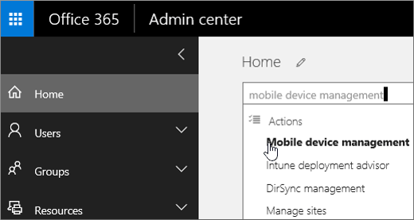
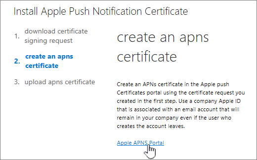

# Set up Mobile Device Management (MDM) in Office 365Set up Mobile Device Management (MDM) in Office 365

Il protocollo incorporati Mobile Device Management (MDM) per Office 365 consente di proteggere e gestire i dispositivi mobili degli utenti quali iPhone, iPad, Androids, e i telefoni Windows. È possibile creare e gestire criteri per, in remoto a comparsa da un dispositivo e visualizzare i rapporti dettagliati dispositivo.The built-in Mobile Device Management (MDM) for Office 365 helps you secure and manage your users' mobile devices like iPhones, iPads, Androids, and Windows phones. You can create and manage device security policies, remotely wipe a device, and view detailed device reports.
  
Quesiti? Che abbiamo [le domande frequenti per rispondere alle domande più comuni](frequently-asked-questions-about-mdm.md). Tenere presente che non è possibile utilizzare un [partner: amministrazione delegata offerta](https://support.office.com/article/26530dc0-ebba-415b-86b1-b55bc06b073e) per la gestione di gestione dei dispositivi mobili per Office 365.Have questions? We've put together [a FAQ to help address common questions](frequently-asked-questions-about-mdm.md). Be aware that you cannot use a [Partners: Offer delegated administration](https://support.office.com/article/26530dc0-ebba-415b-86b1-b55bc06b073e) to manage Mobile Device Management for Office 365. 
  
Gestione dei dispositivi fa parte della sicurezza &amp; centro conformità pertanto sarà necessario passare disponibili per avviare il programma di installazione MDM.Device management is part of the Security &amp; Compliance Center so you'll need to go there to kick off MDM setup.
  
Per configurare la gestione dei dispositivi mobili per Office 365 è necessario:To set up Mobile Device Management for Office 365 you'll need to:
  
1. [Attivare il servizio di gestione dei dispositivi mobiliActivate the Mobile Device Management service](#activate-the-mobile-device-management-service)  
2. [Configurazione di gestione dei dispositivi mobiliSet up Mobile Device Management](#set-up-mobile-device-management)
3. [Verificare che gli utenti di registrare i dispositiviMake sure users enroll their devices](#step-4-recommended-manage-device-security-policies)
  
## Attivare il servizio di gestione dei dispositivi mobiliActivate the Mobile Device Management service

1. Accedere a Office 365 con l'account di lavoro o della scuola.Sign in to Office 365 with your work or school account. 
    
2. Accedere a [protezione &amp; centro conformità](https://protection.office.com).Go to [Security &amp; Compliance Center](https://protection.office.com).
    
3. Passare a **prevenzione della perdita di dati** \> **Device management** e selezionare l'opzione **è possibile iniziare** per avviare il processo di attivazione.Navigate to **Data loss prevention** \> **Device management** and click **Let's get started** to kick off the activation process. 
    
    
  
4. Viene creato un criterio di sicurezza predefinito consente di iniziare. Aggiornare il nome del criterio di protezione in questa pagina e quindi fare clic su **Avvia il programma di installazione**.We created a default security policy for you to help you get started. Update the name of the security policy on this page, and then click **Start setup**.
    
    
  
5. Si verrà visualizzata la schermata di installazione che Visualizza stato sull'impostazione di configurazione del servizio.You'll see the setup screen that shows progress on setting up the service.
    
    
  
> [!TIP]
> È inoltre possibile individuare **Il programma di installazione MDM** attraverso la ricerca. Nell'interfaccia di amministrazione di Office 365 \> **Home** page di gestione dei tipi di dispositivi mobili nella casella di **ricerca** . > You can also locate **MDM Setup** through Search. In the Office 365 admin center \> **Home** page, type mobile device management in the **Search** box. > 
  
È possibile richiedere tempo per attivare la gestione dei dispositivi mobili per Office 365, ma quando si è terminato, si riceverà un messaggio di posta elettronica che illustra i passaggi successivi da eseguire.It can take some time to activate Mobile Device Management for Office 365, but when it finishes, you'll receive an email that explains the next steps to take.
  
## Configurazione di gestione dei dispositivi mobiliSet up Mobile Device Management

Quando il servizio è pronto, completare i quattro passaggi seguenti per completare l'installazione. Potrebbe essere necessario fare clic su [Gestisci impostazioni](https://portal.office.com/EAdmin/Device/IntuneInventory.aspx) nella pagina **gestione dei dispositivi** nella protezione &amp; centro conformità per visualizzare le impostazioni seguenti.When the service is ready, complete the following four steps to finish setup. You may need to click [Manage settings](https://portal.office.com/EAdmin/Device/IntuneInventory.aspx) on the **Device management** page in the Security &amp; Compliance Center to see the following settings. 
  

  
### Passaggio 1: Domini (obbligatorio) Configure per MDMStep 1: (Required) Configure domains for MDM

Se non si dispone di un dominio personalizzato associato a Office 365 o se non si sta Gestione dispositivi Windows, è possibile ignorare questa sezione. In caso contrario, sarà necessario aggiungere i record DNS per il dominio nell'host DNS. Se sono stati aggiunti i record già, come parte dell'impostazione del dominio a Office 365, impostazione è stata eseguita. Dopo avere aggiunto i record, vengono reindirizzati gli utenti di Office 365 dell'organizzazione che effettuano l'accesso nel dispositivo Windows con un indirizzo di posta elettronica che utilizza il dominio personalizzato per effettuare la registrazione MDM per Office 365.If you don't have a custom domain associated with Office 365 or if you're not managing Windows devices, you can skip this section. Otherwise, you'll need to add DNS records for the domain at your DNS host. If you've added the records already, as part of setting up your domain with Office 365, you're all set. After you add the records, Office 365 users in your organization who sign in on their Windows device with an email address that uses your custom domain are redirected to enroll in MDM for Office 365.
  
Bisogno di informazioni di configurazione di record? Individuare il registrar nell'elenco indicato nella [creazione di record DNS per Office 365 quando si gestiscono i record DNS](https://support.office.com/article/b0f3fdca-8a80-4e8e-9ef3-61e8a2a9ab23) e selezionare il nome del servizio di registrazione per accedere alla Guida dettagliata per la creazione di record DNS. Utilizzare le istruzioni per aggiungere i record di due operazioni seguenti:Need help setting up the records? Find your domain registrar in the list provided in [Create DNS records for Office 365 when you manage your DNS records](https://support.office.com/article/b0f3fdca-8a80-4e8e-9ef3-61e8a2a9ab23) and select the registrar name to go to step-by-step help for creating DNS records. Use those instructions to add the following two records: 
  
|**Nome host****Host name**|**Tipo di record****Record type**|**Indirizzo****Address**|**TTL****TTL**|
|:-----|:-----|:-----|:-----|
|EnterpriseEnrollmentEnterpriseEnrollment    |CNAMECNAME    |EnterpriseEnrollment.manage.microsoft.comEnterpriseEnrollment.manage.microsoft.com    |36003600    |
|EnterpriseRegistrationEnterpriseRegistration    |CNAMECNAME    |EnterpriseRegistration.windows.netEnterpriseRegistration.windows.net    |36003600    |
   
Dopo avere aggiunto i due record, tornare alla protezione &amp; centro conformità e passare alla **gestione dei dispositivi** \> **Gestisci impostazioni** per completare il passaggio successivo.After you add the two records, go back to the Security &amp; Compliance Center and navigate to **Device management** \> **Manage settings** to complete the next step. 
  
### Passaggio 2: Configure (obbligatoria) un certificato APNs per i dispositivi iOSStep 2: (Required) Configure an APNs Certificate for iOS devices

Per gestire iOS dispositivi quali iPhone e iPad, è necessario creare un certificato APNs.To manage iOS devices like iPad and iPhones, you need to create an APNs certificate.
  
A tale scopo, seguire i passaggi da **configurare** collegamenti nella **pagina di gestione di dispositivi mobili del programma di installazione**.To do this, follow the steps from the **Set up** links on the **Setup mobile device management page**.
  
1. Accanto a **Configura un certificato APNs per i dispositivi iOS**, selezionare **l'impostazione**.Next to **Configure a APNs Certificate for iOS devices**, select **Set up**.
    
2. Selezionare **Scarica i file CSR** e salvare la richiesta di firma del certificato in un punto nel computer da ricordare.Select **Download your CSR file** and save the Certificate signing request to a somewhere on your computer that you'll remember. 
    
    
  
3. Selezionare **Avanti**.Select **Next**.
    
4. Creare un certificato punto.Create an APN certificate.
    
  - Selezionare **Apple APNS Portal** per aprire il portale dei certificati Push di Apple.Select **Apple APNS Portal** to open the Apple Push Certificates Portal. 
    
    
  
  - Accedere con un ID di Apple.Sign in with an Apple ID.
    
    > [!IMPORTANT]
    > Utilizzare una società che Apple ID associato a un account di posta elettronica che rimarrà con l'organizzazione anche se l'utente che gestisce l'account non. Salvare questo ID perché è necessario utilizzare lo stesso ID al momento rinnovare il certificato.Use a company Apple ID associated with an email account that will remain with your organization even if the user who manages the account leaves. Save this ID because you'll need to use the same ID when it's time to renew the certificate. 
  
  - Selezionare **Crea un certificato** e accettare le **Condizioni per l'utilizzo**.Select **Create a Certificate** and accept the **Terms of Use**.
    
  - **Passare** la richiesta di firma del certificato è stato scaricato nel computer di Office 365 e selezionare **Carica**.**Browse** to the Certificate signing request you downloaded to your computer from Office 365 and select **Upload**.
    
  - **Scaricare** il certificato punto creato per il portale certificato Push Apple per il computer.**Download** the APN certificate created by the Apple Push Certificate Portal to your computer. 
    
    > [!TIP]
    > Se si riscontrano problemi con il download del certificato, aggiornare il browser.If you're having trouble downloading the certificate, refresh your browser. 
  
5. Tornare a Office 365 e selezionare **Avanti** per accedere alla pagina **APNS caricare certificati** .Go back to Office 365 and select **Next** to get to the **Upload APNS certificate** page. 
    
6. Selezionare il certificato punto che è stato scaricato dal portale di certificati Push di Apple.Browse to the APN certificate you downloaded from the Apple Push Certificates Portal.
    
    
  
7. Selezionare **Fine**.Select **Finish**.
    
Dopo aver aggiunto certificato punto, tornare alla protezione &amp; centro conformità e passare alla **gestione dei dispositivi** \> **Gestisci impostazioni** per completare il passaggio successivo.After you add APN Certificate, go back to the Security &amp; Compliance Center and navigate to **Device management** \> **Manage settings** to complete the next step. 
  
### Passaggio 3: (Scelta consigliata) configurazione l'autenticazione a più fattoriStep 3: (Recommended) Set up multi-factor authentication

Se non viene visualizzata l'autenticazione a più fattori (MFA) in **procedure consigliate**, è possibile ignorare questa sezione. Se questa opzione è elencata, è consigliabile che attivare MFA nel portale di Azure Active Directory per aumentare la protezione della gestione dei dispositivi mobili per il processo di registrazione di Office 365. È disattivata per impostazione predefinita.If you don't see multi-factor authentication (MFA) under **Recommended steps**, you can skip this section. If this option is listed, we recommend you turn on MFA in the Azure AD portal to increase the security of the Mobile Device Management for Office 365 enrollment process. It is turned off by default.
  
MFA contribuisce a proteggere l'accesso a Office 365 per l'iscrizione al dispositivo mobile per richiedere una seconda forma di autenticazione. Gli utenti verrà richiesto di confermare una chiamata telefonica, un messaggio di testo o una notifica app nel dispositivo mobile dopo aver immesso correttamente la password di account di lavoro. I dispositivi possono registrare solo una volta completata questa seconda forma dell'autenticazione. Dopo che i dispositivi degli utenti vengono iscritti a gestione dei dispositivi mobili per Office 365, gli utenti possono accedere alle risorse di Office 365 con proprio account di lavoro.MFA helps secure the sign in to Office 365 for mobile device enrollment by requiring a second form of authentication. Users are required to acknowledge a phone call, text message, or app notification on their mobile device after correctly entering their work account password. They can only enroll their device after this second form of authentication is completed. After users' devices are enrolled in Mobile Device Management for Office 365, users can access Office 365 resources with just their work account.
  
Nella casella **impostare l'autenticazione a più fattori**, selezionare **l'impostazione**. Per informazioni su come attivare MFA nel portale di Azure Active Directory, vedere [configurare l'autenticazione a più fattori](https://go.microsoft.com/fwlink/p/?LinkId=519255).Next to **Set up multi-factor authentication**, select **Set up**. To learn how to turn on MFA in the Azure AD portal, see [Set up multi-factor authentication](https://go.microsoft.com/fwlink/p/?LinkId=519255).
  
Dopo aver impostato MFA, tornare alla protezione &amp; centro conformità e passare alla **gestione dei dispositivi** \> **Gestisci impostazioni** per completare il passaggio successivo.After you set up MFA, go back to the Security &amp; Compliance Center and navigate to **Device management** \> **Manage settings** to complete the next step. 
  
### Passaggio 4: Criteri Manage (scelta consigliata)Step 4: (Recommended) Manage device security policies

Il passaggio successivo consiste nel creare e distribuire criteri di protezione di dispositivo per migliorare la protezione dei dati dell'organizzazione Office 365. Ad esempio si consentono di impedire la perdita di dati se un utente viene a mancare proprio dispositivo mediante la creazione di un criterio di blocco dispositivi dopo 5 minuti di inattività e dispone di dispositivi svuotare o meno dopo gli errori di accesso 3.The next step is to create and deploy device security policies to help protect your Office 365 organization's data. For example, you can help prevent data loss if a user loses their device by creating a policy to lock devices after 5 minutes of inactivity and have devices wiped after 3 sign-in failures.
  
Nella **protezione &amp; centro conformità**, andare a **criteri di protezione** \> **criteri per** creare criteri di protezione dispositivo e le regole di accesso.In the **Security &amp; Compliance Center**, go to **Security policies** \> **Device security policies** to create device security policies and access rules. 
  

  
Per istruzioni dettagliate su come creare un nuovo criterio, vedere [creazione e la distribuzione di criteri di protezione dispositivo](create-device-security-policies.md).For step by step instructions on how to create a new policy, see [Create and deploy device security policies](create-device-security-policies.md).
  
> [!TIP]
>  Quando si crea un nuovo criterio, è possibile impostare i criteri per consentire violazione dei criteri di accesso e report in un dispositivo dell'utente non è compatibile con il criterio. È possibile visualizzare il numero di dispositivi mobili verranno interessati dal criterio senza bloccando l'accesso a Office 365. > Prima di distribuire un nuovo criterio a tutti gli utenti nell'organizzazione, è consigliabile che testarla su dispositivi utilizzati da un numero limitato di utenti. >, Inoltre, prima di distribuire i criteri, l'organizzazione informati automaticamente il potenziale impatto della registrazione di un dispositivo di MDM per Office 365. A seconda di come impostare i criteri, i dispositivi che non soddisfano li (dispositivi non Compatible) potrebbero bloccare l'accesso a Office 365. Dispositivi non Compatible potrebbero anche essere apps installate, foto e altre informazioni personali che, in un dispositivo iscritti vengano eliminati se viene cancellato il dispositivo. Ulteriori informazioni sulla: [a comparsa da un dispositivo mobile in Office 365](wipe-a-mobile-device.md).When you create a new policy, you might want to set the policy to allow access and report policy violation where a user's device isn't compliant with the policy. This lets you see how many mobile devices would be impacted by the policy without blocking access to Office 365. >  Before you deploy a new policy to everyone in your organization, we recommend you test it on the devices used by a small number of users. >  Also, before you deploy policies, let your organization know the potential impacts of enrolling a device in MDM for Office 365. Depending on how you set up the policies, devices that don't comply with them (non-compliant devices) could be blocked from accessing Office 365. Non-compliant devices might also have apps installed, photos, and other personal information which, on an enrolled device, could be deleted if the device is wiped. More info: [Wipe a mobile device in Office 365](wipe-a-mobile-device.md). 
  
## Verificare che gli utenti di registrare i dispositiviMake sure users enroll their devices

Dopo aver creato e distribuito un criterio di gestione di dispositivi mobili, ogni utente di Office 365 con licenza all'interno dell'organizzazione che si applica il criterio dispositivi verrà visualizzato un messaggio di registrazione al successivo che accesso a Office 365 da un dispositivo mobile. È necessario eseguire la procedura di attivazione e la registrazione prima di poter accedere a documenti e posta elettronica di Office 365. Vedere [registrazione il dispositivo mobile per lavoro o scuola](enroll-your-mobile-device.md).After you've created and deployed a mobile device management policy, each licensed Office 365 user in your organization that the device policy applies to will receive an enrollment message the next time they sign into Office 365 from their mobile device. They must complete the enrollment and activation steps before they can access Office 365 email and documents. See [Enroll your mobile device for work or school](enroll-your-mobile-device.md).
  
> [!IMPORTANT]
> Se la lingua preferita dell'utente non è supportata dal processo di registrazione, gli utenti possono ricevere notifica della registrazione e i passaggi nei rispettivi dispositivi mobili in un'altra lingua. Non tutte le lingue supportate in Office 365 sono attualmente supportate per il processo di registrazione su dispositivi mobili.If a user's preferred language isn't supported by the enrollment process, users may receive enrollment notification and steps on their mobile devices in another language. Not all languages supported in Office 365 are currently supported for the enrollment process on mobile devices. 
  
Gli utenti con dispositivi Android o iOS necessari per installare l'app portale della società come parte del processo di registrazione.Users with Android or iOS devices are required to install the Company Portal app as part of the enrollment process.
  
## Argomenti correlatiRelated Topics

[Funzionalità di gestione dei dispositivi mobiliCapabilities of Mobile Device Management](capabilities-of-mobile-device-management.md)
  
[Creazione e distribuzione dei criteri di sicurezza del dispositivoCreate and deploy device security policies](create-device-security-policies.md)
  

