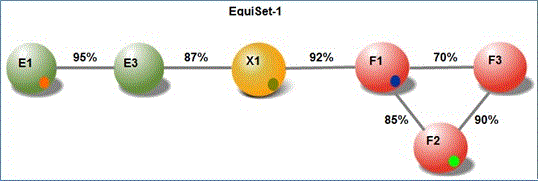

# Informazioni sulla similarità dei documenti di Office 365 Advanced eDiscoveryUnderstand document similarity in Office 365 Advanced eDiscovery

> [!NOTE]
> EDiscovery avanzate richiede un Office 365 E3 con il componente aggiuntivo avanzate conformità o una sottoscrizione E5 per l'organizzazione. Se non sono dial plan e desidera provare eDiscovery avanzate, è possibile [iscrizione a una versione di valutazione di Office 365 Enterprise E5](https://go.microsoft.com/fwlink/p/?LinkID=698279).Advanced eDiscovery requires an Office 365 E3 with the Advanced Compliance add-on or an E5 subscription for your organization. If you don't have that plan and want to try Advanced eDiscovery, you can [sign up for a trial of Office 365 Enterprise E5](https://go.microsoft.com/fwlink/p/?LinkID=698279). 
  
In eDiscovery avanzate, similarità documento è il livello minimo di somiglianza necessario per i due documenti devono essere considerati quasi duplicati.In Advanced eDiscovery, Document Similarity is the minimal level of resemblance required for two documents to be considered as near-duplicates.
  
> [!TIP]
> Per la maggior parte delle applicazioni di business, è consigliabile utilizzare un valore similarità di 60-75%. Per i materiali, il riconoscimento ottico caratteri (OCR) molto scarso di qualità inferiore similarità valori possono essere applicati.For most business applications, it is recommended to use a Similarity value of 60%-75%. For very poor quality optical character recognition (OCR) material, lower Similarity values can be applied. 
  
> [!NOTE]
> Dopo che è impostata e l'esecuzione di un determinato case, il valore similarità non può essere modificato.After it's set and run for a given case, the Similarity value cannot be changed. 
  
All'interno di un set di duplicati Near (ND), potrebbe essere documenti con un livello di somiglianza di sotto della soglia similarità. Per un documento a un set di ND, deve essere presente almeno un documento in ND impostare con un livello di somiglianza che superano la similarità.Within a Near-duplicate (ND) set, there may be documents with a level of resemblance below the Similarity threshold. For a document to join an ND set, there must be at least one document in the ND set with a level of resemblance exceeding the Similarity. 
  
Si supponga ad esempio la similarità è impostata su 80%, documento F1 analogo al documento F2 a livello di 85% e documenti F2 utilizza il formato documento F3 a livello del 90%.For example, assume the Similarity is set to 80%, document F1 resembles document F2 at a level of 85%, and document F2 resembles document F3 at a level of 90%. 
  
Tuttavia, documento F1 potrebbe essere simile documento F3 a livello di solo il 70%, di sotto della soglia. Tuttavia, in questo esempio i documenti F1, F2 e F3 uno ND vengono visualizzati tutti impostati. Analogamente, utilizzando un valore similarità 80%, si può avere creato due set, EquiSet-1 e 2 EquiSet. EquiSet 1 contiene documenti E1 ed E2. Equiset 2 contiene documenti F1, F2 e F3.However, document F1 may resemble document F3 at a level of only 70%, which is below the threshold. Nonetheless, in this example, documents F1, F2, and F3 all appear in the one ND set. Similarly, using a Similarity value of 80%, we may have created two sets, EquiSet-1 and EquiSet-2. EquiSet-1 contains documents E1 and E2. Equiset-2 contains documents F1, F2, and F3. 
  
Come indicato di seguito sono illustrati i livelli di somiglianza:The levels of resemblance are illustrated as follows:
  

  
Si presuppone che un altro documento, X1, viene inserito. Somiglianza tra X1 ed E3 è 87%. Analogamente, la somiglianza tra X1 e F1 è 92%. Di conseguenza, EquiSet -1, EquiSet -2 e X1 sono stati unificati nello un ND set.Assume that another document, X1, is now inserted. The resemblance between X1 and E3 is 87%. Similarly, the resemblance between X1 and F1 is 92%. As a result, EquiSet -1, EquiSet -2, and X1 are now combined into one ND set.
  

  
> [!NOTE]
> Se i due documenti vengono assegnate a un gruppo ND, rimangono contemporaneamente nello stesso set di ND, anche se altri documenti vengono aggiunte all'insieme o se gli insiemi vengono uniti.If any two documents are assigned to one ND set, they will remain together in the same ND set, even if additional documents are added to the set or if the sets are merged. 
  
Dopo l'unione di insiemi, è possibile modificare il documento Pivot quando vengono aggiunti nuovi documenti a un set di.After sets are merged, the Pivot document can change when new documents are added to a set. 
  
## Vedere ancheSee also

[Office 365 Advanced eDiscoveryOffice 365 Advanced eDiscovery](office-365-advanced-ediscovery.md)
  
[Impostazione delle opzioni di analisiSetting Analyze options](set-analyze-options-in-advanced-ediscovery.md)
  
[Impostazione Ignora testoSetting ignore text](set-ignore-text-in-advanced-ediscovery.md)
  
[Impostazioni avanzate di analisi di impostazioneSetting Analyze advanced settings](set-analyze-advanced-settings-in-advanced-ediscovery.md)
  
[Visualizzazione dei risultati di analisiViewing Analyze results](view-analyze-results-in-advanced-ediscovery.md)

