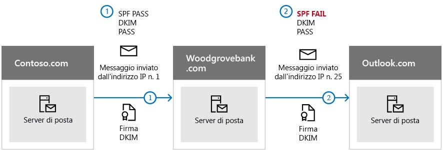

# <a name="use-dkim-to-validate-outbound-email-sent-from-your-custom-domain-in-office-365"></a>Utilizzare DKIM per convalidare la posta elettronica in uscita inviata dal dominio personalizzato in Office 365

 **Riepilogo:** In questo articolo viene descritto come utilizzare DomainKeys Identified Mail (DKIM) insieme a Office 365 per essere certi che i sistemi di posta elettronica di destinazione ritengano attendibili i messaggi inviati dal dominio personalizzato. 
  
È necessario utilizzare DKIM in aggiunta a SPF e DMARC per impedire agli spoofer di inviare messaggi che sembrano provenire dal proprio dominio. DKIM consente di aggiungere una firma digitale nell'intestazione dei messaggi di posta elettronica. Non è complicato come sembra. Quando si configura DKIM, il dominio viene autorizzato ad associare (oppure firmare) il proprio nome ai messaggi di posta elettronica utilizzando l'autenticazione di crittografia. I sistemi di posta elettronica che ricevono messaggi dal dominio dell'utente possono utilizzare questa firma digitale per stabilire la legittimità del messaggio ricevuto.
  
In sostanza, si utilizza una chiave privata per crittografare l'intestazione nel messaggio di posta elettronica in uscita dal proprio dominio. Nei record DNS del dominio viene pubblicata una chiave pubblica utilizzata dai server di ricezione per decodificare la firma. La chiave pubblica viene utilizzata per verificare che i messaggi provengano realmente dall'utente e non da qualche operazione di spoofing in atto nel dominio.
  
Office 365 consente di configurare automaticamente DKIM per i domini iniziali. Il dominio iniziale è il dominio creato da Office 365 per l'utente al momento della sua registrazione per il servizio, ad esempio, contoso.onmicrosoft.com. Non è necessario eseguire nessuna operazione per configurare DKIM per il dominio iniziale. Per ulteriori informazioni sui domini, vedere [Domande frequenti sui domini](https://support.office.com/en-us/article/Domains-FAQ-1272bad0-4bd4-4796-8005-67d6fb3afc5a#bkmk_whydoihaveanonmicrosoft.comdomain).
  
È possibile scegliere di non eseguire nessuna operazione su DKIM anche per il dominio personalizzato. Se non viene configurato DKIM per il dominio personalizzato, Office 365 crea una coppia di chiave pubblica e privata, abilita la firma DKIM e configura il criterio predefinito di Office 365 per il dominio personalizzato. Sebbene questa configurazione sia sufficiente per la maggior parte dei clienti di Office 365, è necessario configurare manualmente la chiave DKIM per il dominio personalizzato nei casi seguenti:
  
- Sono disponibili più domini personalizzati in Office 365
    
- Si intende configurare anche DMARC (consigliato)
    
- Si desidera gestire la chiave privata
    
- Si desidera personalizzare i record CNAME
    
- Si configurano le chiavi DKIM per la posta elettronica creata da un dominio di terze parti, ad esempio, un mailer di massa di terze parti.
    
Contenuto dell'articolo:
  
- [In che modo DKIM è più efficace di SPF per impedire lo spoofing dannoso in Office 365](use-dkim-to-validate-outbound-email.md#HowDKIMWorks)
    
- [Operazioni necessarie per configurare manualmente la chiave DKIM in Office 365](use-dkim-to-validate-outbound-email.md#SetUpDKIMO365)
    
- [Per configurare DKIM per più domini personalizzati in Office 365](use-dkim-to-validate-outbound-email.md#DKIMMultiDomain)
    
- [Disabilitazione del criterio di firma DKIM per un dominio personalizzato di Office 365](use-dkim-to-validate-outbound-email.md#DisableDKIMSigningPolicy)
    
- [Comportamento predefinito per DKIM e Office 365](use-dkim-to-validate-outbound-email.md#DefaultDKIMbehavior)
    
- [Configurare DKIM in modo che un servizio di terze parti possa inviare la posta elettronica o effettuarne lo spoofing per conto del dominio personalizzato dell'utente](use-dkim-to-validate-outbound-email.md#SetUp3rdPartyspoof)
    
- [Passaggi successivi: Dopo aver configurato DKIM per Office 365](use-dkim-to-validate-outbound-email.md#DKIMNextSteps)
    
## <a name="how-dkim-works-better-than-spf-alone-to-prevent-malicious-spoofing-in-office-365"></a>In che modo DKIM è più efficace di SPF per impedire lo spoofing dannoso in Office 365
<a name="HowDKIMWorks"> </a>

SPF consente di aggiungere informazioni alla busta del messaggio, ma DKIM esegue la crittografia di una firma all'interno dell'intestazione del messaggio. Quando si inoltra un messaggio, alcune parti della busta possono essere eliminate dal server di inoltro. Dal momento che la firma digitale rimane unita al messaggio di posta elettronica perché fa parte dell'intestazione, DKIM funziona anche quando un messaggio è stato inoltrato come mostrato nell'esempio seguente.
  

  
In questo esempio, se è stato pubblicato soltanto un record SPF TXT per il dominio, il server di posta del mittente avrebbe potuto contrassegnare la posta come indesiderata e generare un risultato falso positivo. L'aggiunta di DKIM in questo scenario riduce i rapporti spam falsi positivi. Dal momento che DKIM si affida alla crittografia della chiave pubblica per eseguire l'autenticazione e non soltanto agli indirizzi IP, la chiave DKIM è considerata come una forma di autenticazione più affidabile rispetto a SPF. È opportuno utilizzare sia SPF che DKIM e DMARC nella propria distribuzione.
  
In sostanza, DKIM utilizza una chiave privata per inserire una firma crittografata all'interno delle intestazioni dei messaggi. Il dominio di firma o dominio di uscita viene inserito come valore del campo **d=** nell'intestazione. Il dominio di verifica o dominio del destinatario utilizza il campo **d=** per cercare la chiave pubblica dal DNS ed esegue l'autenticazione del messaggio. Se il messaggio viene verificato, i controlli DKIM hanno esito positivo. 
  
## <a name="what-you-need-to-do-to-manually-set-up-dkim-in-office-365"></a>Operazioni necessarie per configurare manualmente la chiave DKIM in Office 365
<a name="SetUpDKIMO365"> </a>

Per configurare DKIM, eseguire la procedura seguente:
  
- [Pubblicare due record CNAME per il dominio personalizzato in DNS](use-dkim-to-validate-outbound-email.md#Publish2CNAME)
    
- [Abilitare la firma DKIM per il dominio personalizzato in Office 365](use-dkim-to-validate-outbound-email.md#EnableDKIMinO365)
    
### <a name="publish-two-cname-records-for-your-custom-domain-in-dns"></a>Pubblicare due record CNAME per il dominio personalizzato in DNS
<a name="Publish2CNAME"> </a>

Per ogni dominio al quale si intende aggiungere una firma DKIM in DNS è necessario pubblicare due record CNAME. Un record CNAME viene usato da DNS per specificare che il nome canonico di un dominio è l'alias di un altro nome di dominio. 
  
  Office 365 esegue la rotazione automatica delle chiavi utilizzando due record indicati dall'utente. Se è stato eseguito il provisioning di domini personalizzati oltre al dominio iniziale in Office 365, è necessario pubblicare due record CNAME per ogni dominio aggiuntivo. Pertanto, se sono disponibili due domini, è necessario pubblicare altri due record CNAME e così via. 
  
Per i record CNAME, utilizzare il formato seguente:
  
```
Host name:          selector1._domainkey.<domain>
Points to address or value: selector1-<domainGUID>._domainkey.<initialDomain> 
TTL:                3600
Host name:          selector2._domainkey.<domain>
Points to address or value: selector2-<domainGUID>._domainkey.<initialDomain> 
TTL:                3600

```

Dove:
  
-  Per Office 365, i selettori saranno sempre "selector1" o "selector2". 
    
-  _domainGUID_ corrisponde al  _domainGUID_ nel record MX personalizzato del dominio personalizzato visualizzato prima di mail.protection.outlook.com. Ad esempio, nel seguente record MX per il dominio contoso.com, il  _domainGUID_ è contoso-com: 
    
  ```
  contoso.com.  3600  IN  MX   5 contoso-com.mail.protection.outlook.com
  ```

-  _initialDomain_ è il dominio utilizzato per la registrazione di Office 365. Per informazioni su come determinare il dominio iniziale, vedere [Domande frequenti sui domini](https://support.office.com/en-us/article/Domains-FAQ-1272bad0-4bd4-4796-8005-67d6fb3afc5a#bkmk_whydoihaveanonmicrosoft.comdomain).
    
Ad esempio, se si dispone di un dominio iniziale di cohovineyardandwinery.onmicrosoft.com e di due domini personalizzati cohovineyard.com e cohowinery.com, è necessario configurare due record CNAME per ogni dominio aggiuntivo, per un totale di quattro record CNAME.
  
```
Host name:          selector1._domainkey.cohovineyard.com  
Points to address or value: selector1-cohovineyard-com._domainkey.cohovineyardandwinery.onmicrosoft.com
TTL:                3600
Host name:          selector2._domainkey.cohovineyard.com  
Points to address or value: selector2-cohovineyard-com._domainkey.cohovineyardandwinery.onmicrosoft.com
TTL:                3600
Host name:          selector1._domainkey.cohowinery.com
Points to address or value: selector1-cohowinery-com._domainkey.cohovineyardandwinery.onmicrosoft.com 
TTL:                3600
 
Host name:          selector2._domainkey.cohowinery.com
Points to address or value: selector2-cohowinery-com._domainkey.cohovineyardandwinery.onmicrosoft.com 
TTL:                3600
```

### <a name="enable-dkim-signing-for-your-custom-domain-in-office-365"></a>Abilitare la firma DKIM per il dominio personalizzato in Office 365
<a name="EnableDKIMinO365"> </a>

Dopo aver pubblicato i record CNAME in DNS, è possibile abilitare la firma DKIM tramite Office 365. È possibile eseguire questa operazione tramite l'interfaccia di amministrazione di Office 365 oppure PowerShell.
  
#### <a name="to-enable-dkim-signing-for-your-custom-domain-through-the-office-365-admin-center"></a>Per abilitare la firma DKIM del dominio personalizzato tramite l'interfaccia di amministrazione di Office 365

1. [Accedere a Office 365](https://support.office.microsoft.com/article/Sign-in-to-Office-365-e9eb7d51-5430-4929-91ab-6157c5a050b4) con l'account aziendale o dell'istituto di istruzione. 
    
2. Selezionare l'icona di avvio delle app in alto a sinistra e scegliere **Amministrazione**.
    
3. Nel riquadro di spostamento in basso a sinistra, espandere **Amministrazione** e scegliere **Exchange**.
    
4. Accedere a **Protezione** \> **dkim**.
    
5. Selezionare il dominio per il quale si desidera abilitare DKIM, quindi, in **Firma i messaggi per questo dominio con firme DKIM** scegliere **Abilita**. Ripetere questo passaggio per ogni dominio personalizzato.
    
#### <a name="to-enable-dkim-signing-for-your-custom-domain-by-using-powershell"></a>Per abilitare la firma DKIM del dominio personalizzato usando PowerShell

1. [Connettersi a Exchange Online tramite Remote PowerShell](https://technet.microsoft.com/library/jj984289%28v=exchg.160%29.aspx).
    
2. Eseguire il seguente cmdlet:
    
  ```
  New-DkimSigningConfig -DomainName <domain> -Enabled $true
  ```

    _domain_ è il nome del dominio personalizzato per cui si desidera abilitare la firma DKIM. 
    
    Ad esempio, per domain contoso.com:
    
  ```
  New-DkimSigningConfig -DomainName contoso.com -Enabled $true
  ```

#### <a name="to-confirm-dkim-signing-is-configured-properly-for-office-365"></a>Per confermare che la firma DKIM sia configurata in modo corretto in Office 365

Attendere qualche minuto prima di effettuare i passaggi seguenti e confermare di aver configurato DKIM in modo corretto. In questo modo, le informazioni DKIM sul dominio possono essere distribuite nella rete.
  
- Inviare un messaggio da un account incluso nel dominio Office 365 con DKIM abilitato a un altro account di posta elettronica, ad esempio, outlook.com o Hotmail.com.
    
- Non utilizzare un account aol.com per effettuare test. AOL potrebbe ignorare il controllo DKIM se la verifica SPF ha esito positivo. In questo modo, il test verrebbe annullato.
    
- Aprire il messaggio e osservare l'intestazione. Le istruzioni per visualizzare l'intestazione del messaggio variano in base al client di messaggistica usato. Per istruzioni sulla visualizzazione delle intestazioni dei messaggi in Outlook, vedere [Visualizzare le intestazioni dei messaggi di posta elettronica](https://support.office.com/article/CD039382-DC6E-4264-AC74-C048563D212C).
    
     Il messaggio con firma DKIM conterrà il nome host e il dominio definiti durante la pubblicazione delle voci CNAME. Il messaggio avrà un aspetto analogo a quello riportato nell'esempio: 
    
  ```
  From: Example User <example@contoso.com> 
  DKIM-Signature: v=1; a=rsa-sha256; q=dns/txt; c=relaxed/relaxed; 
      s=selector1; d=contoso.com; t=1429912795; 
      h=From:To:Message-ID:Subject:MIME-Version:Content-Type; 
      bh=<body hash>; 
      b=<signed field>;
  
  ```

- Cercare l'intestazione Authentication-Results. Anche se ogni servizio di ricezione utilizza un formato differente per indicare la posta in arrivo, il risultato deve includere **DKIM=pass** o **DKIM=OK**. 
    
## <a name="to-configure-dkim-for-more-than-one-custom-domain-in-office-365"></a>Per configurare DKIM per più domini personalizzati in Office 365
<a name="DKIMMultiDomain"> </a>

Se in futuro si decide di aggiungere un altro dominio personalizzato e di abilitare DKIM, è necessario eseguire la procedura indicata in questo articolo per ogni dominio. In particolare, completare tutti i passaggi elencati in [Operazioni necessarie per configurare manualmente la chiave DKIM in Office 365](use-dkim-to-validate-outbound-email.md#SetUpDKIMO365).
  
## <a name="disabling-the-dkim-signing-policy-for-a-custom-domain-in-office-365"></a>Disabilitazione del criterio di firma DKIM per un dominio personalizzato di Office 365
<a name="DisableDKIMSigningPolicy"> </a>

La disabilitazione del criterio di firma non disattiva completamente DKIM. Dopo un periodo di tempo, Office 365 applicherà automaticamente il suo criterio predefinito al dominio. Per ulteriori informazioni vedere [Comportamento predefinito per DKIM e Office 365](use-dkim-to-validate-outbound-email.md#DefaultDKIMbehavior).
  
### <a name="to-disable-the-dkim-signing-policy-by-using-windows-powershell"></a>Per disabilitare il criterio di firma DKIM usando Windows PowerShell

1. [Connettersi a Exchange Online tramite Remote PowerShell](https://technet.microsoft.com/library/jj984289%28v=exchg.160%29.aspx).
    
2. Eseguire uno dei comandi seguenti per ogni dominio per il quale si desidera disabilitare la firma DKIM.
    
  ```
  $p=Get-DkimSigningConfig -identity <domain>
  $p[0] | set-DkimSigningConfig -enabled $false
  
  ```

    Ad esempio:
    
  ```
  $p=Get-DkimSigningConfig -identity contoso.com
  $p[0] | set-DkimSigningConfig -enabled $false
  ```

    Oppure
    
  ```
  Set-DkimSigningConfig -identity $p[<number>].identity -enabled $false
  
  ```

    Dove  _number_ è l'indice del criterio. Ad esempio: 
    
  ```
  Set-DkimSigningConfig -identity $p[0].identity -enabled $false
  ```

## <a name="default-behavior-for-dkim-and-office-365"></a>Comportamento predefinito per DKIM e Office 365
<a name="DefaultDKIMbehavior"> </a>

Se non si abilita DKIM, Office 365 crea automaticamente una chiave pubblica DKIM da 1024 bit per il dominio personalizzato e la chiave privata associata, la quale viene archiviata nei datacenter Microsoft. Per impostazione predefinita, Office 365 utilizza una configurazione di firma predefinita per i domini che non dispongono di un criterio. Ciò significa che se l'utente non configura DKIM, Office 365 utilizza il criterio predefinito e le chiavi create per abilitare DKIM nel dominio.
  
Inoltre, se si disabilita la firma DKIM dopo l'attivazione, Office 365 applica automaticamente (dopo un determinato periodo di tempo) il criterio predefinito di Office 365 per il dominio.
  
Nell'esempio seguente, considerare che la chiave DKIM per fabrikam.com sia stata abilitata da Office 365 e non dall'amministratore del dominio. Questo errore indica che i record CNAME necessari non sono presenti nel sistema DNS. Le firme DKIM per i messaggi di posta elettronica provenienti dal dominio avranno un aspetto analogo al seguente:
  
```
From: Second Example <second.example@fabrikam.com> 
DKIM-Signature: v=1; a=rsa-sha256; q=dns/txt; c=relaxed/relaxed; 
    s=selector1-fabrikam-com; d=contoso.onmicrosoft.com; t=1429912795; 
    h=From:To:Message-ID:Subject:MIME-Version:Content-Type; 
    bh=<body hash>; 
    b=<signed field>;

```

In questo caso, il nome host e il dominio includono i valori a cui dovrebbe puntare CNAME se la firma DKIM per fabrikam.com fosse stata abilitata dall'amministratore di dominio. Infine, ogni messaggio inviato da Office 365 sarà firmato con la chiave DKIM. Se la chiave DKIM è stata abilitata dall'utente, il dominio sarà identico a quello dell'indirizzo "Da:", in questo caso, fabrikam.com. In caso contrario, non verrà allineato e utilizzerà il dominio iniziale dell'organizzazione. Per informazioni su come determinare il dominio iniziale, vedere [Domande frequenti sui domini](https://support.office.com/en-us/article/Domains-FAQ-1272bad0-4bd4-4796-8005-67d6fb3afc5a#bkmk_whydoihaveanonmicrosoft.comdomain).
  
## <a name="set-up-dkim-so-that-a-third-party-service-can-send-or-spoof-email-on-behalf-of-your-custom-domain"></a>Configurare DKIM in modo che un servizio di terze parti possa inviare la posta elettronica o effettuarne lo spoofing per conto del dominio personalizzato dell'utente
<a name="SetUp3rdPartyspoof"> </a>

Alcuni provider di servizi di posta di massa o di software come servizio consentono di configurare le chiavi DKIM per la posta elettronica che viene creata dal servizio. Per configurare i record DNS necessari, l'utente e la terza parte devono essere coordinati. Nessuna organizzazione esegue questa operazione nello stesso modo. Al contrario, il processo dipende interamente dell'organizzazione.
  
Messaggio di esempio che mostra una chiave DKIM correttamente configurata per contoso.com e bulkemailprovider.com avrà l'aspetto seguente:
  
```
Return-Path: <communication@bulkemailprovider.com>
 From: <sender@contoso.com>
 DKIM-Signature: s=s1024; d=contoso.com
 Subject: Here is a message from Bulk Email Provider's infrastructure, but with a DKIM signature authorized by contoso.com
```

In questo esempio, per raggiungere il risultato:
  
1. Il provider di posta elettronica di massa ha fornito a Contoso una chiave DKIM pubblica.
    
2. Contoso ha pubblicato la chiave DKIM nel suo record DNS.
    
3. Durante l'invio della posta elettronica, il provider della posta elettronica inviata in blocco firma la chiave con quella privata corrispondente. In questo modo, il provider della posta elettronica inviata in blocco ha allegato la firma DKIM all'intestazione del messaggio.
    
4. I sistemi di ricezione della posta elettronica eseguono un confronto tra il valore d=\<domain\> della chiave DKIM firmata e il dominio nell'indirizzo Da: (5322.From) del messaggio. In questo esempio, i valori corrispondono a:
    
    sender@ **contoso.com**
    
    d= **contoso.com**
    
## <a name="next-steps-after-you-set-up-dkim-for-office-365"></a>Passaggi successivi: Dopo aver configurato DKIM per Office 365
<a name="DKIMNextSteps"> </a>

Sebbene DKIM è progettato per impedire attacchi di spoofing, DKIM funziona meglio con SPF e DMARC. Dopo aver impostato i DKIM, se non già configurati SPF è consigliabile farlo. Per una breve introduzione a SPF e per ottenere una configurazione rapidamente, vedere [impostare SPF in Office 365 per evitare attacchi di spoofing](set-up-spf-in-office-365-to-help-prevent-spoofing.md). Per una più approfondita dei come Office 365 utilizza SPF o per le distribuzioni di risoluzione dei problemi o non standard, ad esempio le distribuzioni ibride, iniziare con [la modalità di Office 365 utilizza mittente Policy Framework (SPF) per impedire attacchi di spoofing](how-office-365-uses-spf-to-prevent-spoofing.md). Successivamente, vedere [Utilizzo DMARC per convalidare la posta elettronica in Office 365](use-dmarc-to-validate-email.md). [Intestazioni messaggi della protezione da posta indesiderata](anti-spam-message-headers.md) sono inclusi i campi di intestazione e la sintassi utilizzati da Office 365 per le verifiche DKIM. 
  

