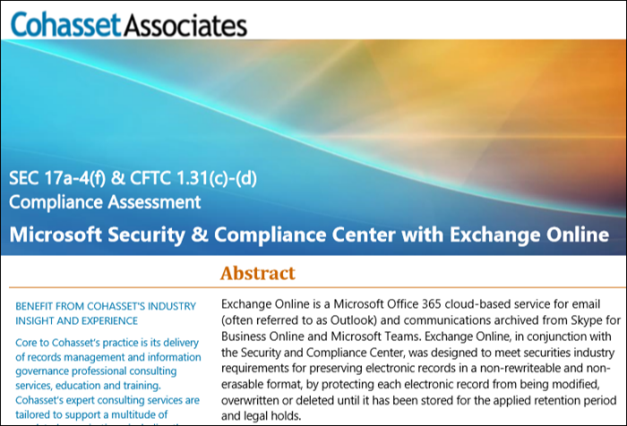

# Usare Exchange Online e il Centro sicurezza e conformità per conformarsi alla regola SEC 17a-4

Se l'organizzazione deve conformarsi agli standard normativi per la conservazione dei dati, il Centro sicurezza e conformità di Office 365 offre funzionalità per la gestione del ciclo di vita dei dati in Exchange Online, tra cui la possibilità di conservare, controllare, cercare ed esportare i dati. Queste funzionalità sono sufficienti a soddisfare le esigenze della maggior parte delle organizzazioni.

Tuttavia, alcune organizzazioni in settori fortemente regolamentati sono soggette a requisiti normativi più rigidi. Ad esempio, gli istituti finanziari come le banche o gli intermediari di borsa, sono soggetti alla regola 17a-4 emanata dalla Securities and Exchange Commission (SEC). La regola 17a-4 prevede requisiti specifici per l'archiviazione elettronica dei dati, tra cui molti aspetti riguardanti la gestione dei record, come la durata, il formato, la qualità, la disponibilità e la conformità della conservazione dei record.

Per aiutare queste organizzazioni a comprendere meglio in che modo è possibile sfruttare il Centro sicurezza e conformità per soddisfare gli obblighi normativi per Exchange Online, in modo specifico in relazione ai requisiti della regola 17a-4, è stata rilasciata una valutazione in collaborazione con Cohasset Associates.

Cohasset ha comprovato che se si esegue la configurazione di Exchange Online e del Centro sicurezza e conformità come consigliato vengono soddisfatti i requisiti di archiviazione pertinenti delle regole CFTC 1.31(c)-(d), FINRA 4511 e SEC 17a-4. L'obiettivo è stato individuato in questo set di regole perché rappresenta le indicazioni più prescrittive a livello globale per la conservazione dei record degli istituti finanziari.

## Scaricare la valutazione Cohasset

È possibile [scaricare la valutazione Cohasset qui](https://servicetrust.microsoft.com/ViewPage/TrustDocuments?command=Download&downloadType=Document&downloadId=9fa8349d-a0c9-47d9-93ad-472aa0fa44ec&docTab=6d000410-c9e9-11e7-9a91-892aae8839ad_FAQ_and_White_Papers).

## La valutazione è specifica per Exchange Online

Si noti che la valutazione è specifica per Exchange Online e non include altri servizi di Office 365, ad esempio SharePoint Online o OneDrive for Business, anche se in futuro è previsto il supporto per tali servizi in relazione alla regola SEC 17a-4.

È importante comprendere che anche Skype for Business e Teams archiviano i dati in Exchange Online. Di conseguenza, la valutazione include i messaggi provenienti da Skype for Business e i messaggi di canale e chat di Teams.

## L'uso della protezione dell'archiviazione è fondamentale per la configurazione consigliata

I settori fortemente regolamentati sono spesso tenuti ad archiviare le comunicazioni elettroniche per soddisfare il requisito WORM (write once, read many), che prescrive una soluzione di archiviazione in cui un record deve essere:

- Conservato per un periodo di conservazione necessario che non può essere abbreviato, ma solo aumentato.
- Non modificabile, ovvero il record non può essere sovrascritto, cancellato né modificato durante il periodo di conservazione necessario.

In Exchange Online, applicando un [criterio di conservazione](retention-policies.md) alla cassetta postale di un utente è possibile conservarne tutti i contenuti. In effetti, se un utente prova a eliminare o modificare un messaggio di posta elettronica, una copia precedente alla modifica verrà conservata in una posizione protetta e nascosta della cassetta postale. I criteri di conservazione garantiscono che un'organizzazione possa conservare le comunicazioni elettroniche, ma che sia comunque possibile modificare quei criteri.

Applicando la protezione dell'archiviazione a un criterio di conservazione, un'organizzazione si assicura che il criterio non possa essere modificato. In effetti, in seguito all'applicazione della protezione dell'archiviazione a un criterio di conservazione vengono limitate le azioni seguenti:

- Il periodo di conservazione dei criteri può essere solo aumentato, ma non ridotto.
- È possibile aggiungere gli utenti ai criteri, ma non rimuoverli.
- Un amministratore non può eliminare il criterio di conservazione.

La protezione dell'archiviazione consente di soddisfare i requisiti normativi della regola SEC 17a-4.

## Come configurare la protezione dell'archiviazione

È possibile proteggere un criterio di conservazione con PowerShell. Per altre informazioni, vedere [Blocco dei criteri di conservazione](retention-policies.md#locking-a-retention-policy).

## Limitazioni note

Microsoft è consapevole di alcune limitazioni in Exchange Online e sta lavorando attivamente per risolverle, prevedendo di rilasciare il supporto per questi scenari entro luglio 2019:

- Il controllo a livello di elemento non è disponibile nelle cassette postali del gruppo di Office 365.
- Le comunicazioni in thread non sono disponibili per i messaggi di chat e canali di Teams.
- Gli apprezzamenti per i messaggi di chat e canali di Teams non vengono conservati.
