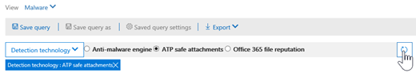

# Utilizzo di Esplora minacce nel centro &amp; sicurezza e conformitàUse Threat Explorer in the Security &amp; Compliance Center

Se l'organizzazione dispone di [Office 365 Advanced Threat Protection Plan 2](office-365-ti.md) (ATP) ed è necessario disporre delle autorizzazioni necessarie, è possibile utilizzare l'esploratore di minacce (denominato anche Esplora risorse) per identificare e analizzare le minacce.If your organization has [Office 365 Advanced Threat Protection Plan 2](office-365-ti.md) (ATP), and you have the necessary permissions, you can use Threat Explorer (also referred to as Explorer) to identify and analyze threats. Per utilizzare Esplora risorse, nel centro sicurezza &amp; e conformità, accedere a **gestione** \> \*\*\*\* minacce.(To use Explorer, in the Security &amp; Compliance Center, go to **Threat management** \> **Explorer**.)

Explorer è uno strumento potente e quasi in tempo reale che consente ai team di operazioni di sicurezza di analizzare e rispondere alle &amp; minacce nel centro sicurezza e conformità.Explorer is a powerful, near real-time tool to help Security Operations teams investigate and respond to threats in the Security &amp; Compliance Center. Di seguito sono riportate alcune delle operazioni che è possibile eseguire:Here are some of the things you can do:
- [Vedere malware rilevato dalle funzionalità di sicurezza di Office 365See malware that was detected by Office 365 security features](#see-malware-detected-in-email-by-technology)
- [Visualizzare i dati relativi agli URL di phishing e fare clic su verdettoView data about phishing URLs and click verdict](#view-data-about-phishing-urls-and-click-verdict)
- [Avviare un processo di analisi e risposta automatizzato da una visualizzazione in Esplora risorseStart an automated investigation and response process from a view in Explorer](#start-automated-investigation-and-response)
- ... [e altro ancora](#more-ways-to-use-explorer)!... [and more](#more-ways-to-use-explorer)!

## Vedere malware rilevato in posta elettronica dalla tecnologiaSee malware detected in email by technology

Si supponga di voler vedere il malware rilevato nella posta elettronica e la tecnologia in Office 365.Suppose you want to see malware that was detected in email, and by what technology in Office 365. A tale scopo, utilizzare la visualizzazione malware di > per la [posta elettronica](threat-explorer-views.md#email--malware) di Esplora risorse.To do this, use the [Email > Malware](threat-explorer-views.md#email--malware) view of Explorer.

1. Nel centro sicurezza & Compliance ([https://protection.office.com](https://protection.office.com)), scegliere **gestione** > \*\*\*\* minacce.In the Security & Compliance Center ([https://protection.office.com](https://protection.office.com)), choose **Threat management** > **Explorer**.
2. Scegliere**malware** **tramite posta elettronica** > dal menu **Visualizza** .In the **View** menu, choose **Email** > **Malware**.  
3. Fare clic su **mittente**e quindi scegliere**tecnologia di rilevamento**di **base** > .Click **Sender**, and then choose **Basic** > **Detection technology**. Le tecnologie di rilevamento sono ora disponibili come filtri per il report.Your detection technologies are now available as filters for the report.   
4. Selezionare un'opzione e quindi fare clic sul pulsante Aggiorna per applicare il filtro.Select an option, and then click the Refresh button to apply that filter.   

Il rapporto viene aggiornato per visualizzare i risultati rilevati dal malware nella posta elettronica, utilizzando l'opzione di tecnologia selezionata.The report refreshes to show the results malware detected in email, using the technology option you selected. Da qui, è possibile eseguire un'ulteriore analisi.From here, you can conduct further analysis.

## Visualizzare i dati relativi agli URL di phishing e fare clic su verdettoView data about phishing URLs and click verdict

Si supponga di voler vedere tentativi di phishing tramite URL nella posta elettronica, incluso un elenco di URL che sono stati consentiti, bloccati e ignorati.Suppose you want to see phishing attempts through URLs in email, including a list of URLs that were allowed, blocked, and overridden.  L'identificazione degli URL a cui è stato fatto clic richiede [collegamenti sicuri ATP](atp-safe-links.md).Identifying URLs that were clicked requires [ATP Safe links](atp-safe-links.md). (Accertarsi di aver configurato e applicato i [criteri dei collegamenti sicuri di ATP](set-up-atp-safe-links-policies.md) agli utenti per la protezione e la registrazione di clic di verdetti da ATP Safe Links.) Per esaminare gli URL di phishing nei messaggi e fare clic su URL nei messaggi di phishing, utilizzare la visualizzazione [phishing > di posta elettronica](threat-explorer-views.md#email--phish) di Esplora risorse.(Make sure you have set up and applied [ATP Safe Links policies](set-up-atp-safe-links-policies.md) to your users for click-time protection and logging of click verdicts by ATP Safe Links.) To review phish URLs in messages and clicks on URLs in phish messages, use the [Email > Phish](threat-explorer-views.md#email--phish) view of Explorer.

1. Nel centro sicurezza & Compliance ([https://protection.office.com](https://protection.office.com)), scegliere **gestione** > \*\*\*\* minacce.In the Security & Compliance Center ([https://protection.office.com](https://protection.office.com)), choose **Threat management** > **Explorer**.
2. Nel menu **Visualizza** scegliere **posta elettronica** > **phishing**.In the **View** menu, choose **Email** > **Phish**.  
3. Fare clic su **sender**e quindi scegliere **urls** > \*\*\*\*.Click **Sender**, and then choose **URLs** > **Click verdict**.
4. Selezionare una o più opzioni, ad esempio **bloccate** e **bloccate**, e quindi fare clic sul pulsante **Aggiorna** per applicare il filtro.Select one or more options, such as **Blocked** and **Block overridden**, and then click the **Refresh** button to apply that filter.  

Il rapporto viene aggiornato per visualizzare due diverse tabelle URL nella scheda URL seguente:The report refreshes to show two different URL tables on the URL tab below:
1. Gli URL **principali** sono gli URL contenuti nei messaggi che sono stati filtrati fino a e l'azione di recapito della posta elettronica conta per ogni URL.**Top URLs** are the URLs contained in the messages you have filtered down to, and the email delivery action counts for each URL. Nella visualizzazione posta elettronica di phishing, in genere l'elenco conterrà URL legittimi.In the phish email view, this list typically will contain legitimate URLs. I pirati informatici includono una combinazione di URL buoni e cattivi nei loro messaggi per cercare di farli recapitare, ma renderà i collegamenti dannosi più interessanti per l'utente a cui fare clic.Attackers include a mix of good and bad URLs in their messages to try to get them delivered, but they'll make the malicious links more interesting for the user to click. La tabella degli URL è ordinata in base al numero totale di messaggi di posta elettronica (Nota: questa colonna non viene visualizzata per semplificare la visualizzazione).The table of URLs is sorted by total email count (NOTE: This column is not shown to simplify the view).
2. I **clic principali** sono gli URL con collegamenti sicuri che sono stati selezionati, ordinati in base al numero di clic totale (la colonna non viene visualizzata per semplificare la visualizzazione).**Top clicks** are the Safe Links wrapped URLs that were clicked, sorted by total click count (this column is also not shown to simplify the view). Numeri totali per colonna indicano i collegamenti sicuri fare clic su conteggio verdetto per ogni URL selezionato.Total counts by column indicate the Safe Links click verdict count for each clicked URL. Nella visualizzazione posta elettronica di phishing, questi sono più spesso collegamenti sospetti o malevoli, ma possono includere URL puliti che si verificano nei messaggi di phishing.In the phish email view, these will more often be suspicious or malicious links, but could include clean URLs that happen to be in phish messages. Gli URL che fanno clic su collegamenti non spostati non verranno visualizzati qui.URL clicks on unwrapped links will not show up here.

Le due tabelle degli URL mostrano gli URL principali nei messaggi di posta elettronica di phishing in base allo stato di recapito e visualizzano gli URL che sono stati bloccati (o sono stati visitati nonostante un avviso), in modo da poter capire quali collegamenti negativi sono stati ricevuti dagli utenti e interagito con gli utenti.The two URLs tables show top URLs in phishing emails by delivery status, and they show URL clicks that were blocked (or visited despite a warning) so that you can understand what potential bad links were received by users and interacted with by users. Da qui, è possibile eseguire un'ulteriore analisi.From here, you can conduct further analysis. Ad esempio, al di sotto del grafico, è possibile visualizzare gli URL principali nei messaggi di posta elettronica bloccati nell'ambiente dell'organizzazione.For example, below the chart, you can see the top URLs in emails that were blocked in your organization's environment. 

 

Selezionare un URL per visualizzare informazioni più dettagliate.Select a URL to view more detailed information. Si noti che nella finestra di dialogo URL a comparsa, il filtro nei messaggi di posta elettronica viene rimosso per visualizzare la visualizzazione completa dell'esposizione dell'URL nell'ambiente in uso.Note that in the URL flyout dialog, the filtering on emails is removed in order to show you the full view of the URL's exposure in your environment. In questo modo è possibile filtrare i messaggi di posta elettronica in Esplora risorse a quelli di cui si è preoccupati, individuare URL specifici che sono potenziali minacce e quindi espandere la propria comprensione dell'esposizione all'URL nell'ambiente (tramite la finestra di dialogo Dettagli URL) senza dover aggiungere filtri URL al Visualizzazione di Esplora risorse.This lets you filter down emails in Explorer to ones you are concerned about, find specific URLs that are potential threats, then expand your understanding of the URL exposure in your environment (via the URL details dialog) without having to add URL filters to the Explorer view itself.

## Esaminare i messaggi di posta elettronica segnalati dagli utentiReview email messages reported by users

Si supponga di voler visualizzare i messaggi di posta elettronica che gli utenti dell'organizzazione hanno segnalato come posta indesiderata, non indesiderata o phishing tramite il [componente aggiuntivo segnala messaggio per Outlook e Outlook sul Web](enable-the-report-message-add-in.md).Suppose you want to see email messages that users in your organization have reported as Junk, Not Junk, or Phishing by using the [Report Message add-in for Outlook and Outlook on the web](enable-the-report-message-add-in.md). A tale scopo, utilizzare la visualizzazione [> di posta elettronica segnalata dall'utente](threat-explorer-views.md#email--user-reported) di Esplora risorse.To do this, use the [Email > User-reported](threat-explorer-views.md#email--user-reported) view of Explorer.

1. Nel centro sicurezza & Compliance ([https://protection.office.com](https://protection.office.com)), scegliere **gestione** > \*\*\*\* minacce.In the Security & Compliance Center ([https://protection.office.com](https://protection.office.com)), choose **Threat management** > **Explorer**.
2. Nel menu **Visualizza** scegliere la **posta elettronica** > **segnalata dall'utente**.In the **View** menu, choose **Email** > **User-reported**.  
3. Fare clic su **mittente**e quindi scegliere**tipo di report**di **base** > .Click **Sender**, and then choose **Basic** > **Report type**.
4. Selezionare un'opzione, ad esempio **phishing**, e quindi fare clic sul pulsante **Aggiorna** .Select an option, such as **Phish**, and then click the **Refresh** button.    

Il rapporto viene aggiornato per visualizzare i dati relativi ai messaggi di posta elettronica che gli utenti dell'organizzazione hanno segnalato come tentativo di phishing.The report refreshes to show data about email messages that people in your organization have reported as a phishing attempt. È possibile utilizzare queste informazioni per eseguire un'ulteriore analisi e, se necessario, regolare i [criteri di anti-phishing ATP](set-up-anti-phishing-policies.md).You can use this information to conduct further analysis, and if necessary, adjust your [ATP anti-phishing policies](set-up-anti-phishing-policies.md).

## Avviare l'analisi e la risposta automatizzataStart automated investigation and response

(Nuovo!) L' [analisi e la risposta automatizzate](automated-investigation-response-office.md), aggiunte di recente a ATP piano 2, possono salvare il team delle operazioni di sicurezza molto tempo e fatica nell'analisi e nell'attenuazione degli attacchi cibernetici.(NEW!) [Automated investigation and response](automated-investigation-response-office.md), recently added to ATP Plan 2, can save your security operations team a lot of time and effort in investigating and mitigating cyber attacks. Oltre a configurare gli avvisi che possono attivare un PlayBook per la sicurezza, è possibile avviare un processo di analisi e risposta automatizzato da una visualizzazione di Esplora risorse.In addition to configuring alerts that can trigger a security playbook, you can start an automated investigation and response process from a view in Explorer. 

Per ulteriori informazioni, vedere [esempio: un amministratore della sicurezza attiva un'indagine da Esplora minacce](automated-investigation-response-office.md#example-a-security-administrator-triggers-an-investigation-from-threat-explorer).For details on this, see [Example: A security administrator triggers an investigation from Threat Explorer](automated-investigation-response-office.md#example-a-security-administrator-triggers-an-investigation-from-threat-explorer).

## Altre modalità di utilizzo di Esplora risorseMore ways to use Explorer

Oltre agli scenari descritti in questo articolo, sono disponibili molte altre opzioni per la creazione di report con Esplora risorse.In addition to the scenarios outlined in this article, you have many more reporting options available with Explorer. 
- [Identificare e analizzare i messaggi di posta elettronica dannosi recapitatiFind and investigate malicious email that was delivered](investigate-malicious-email-that-was-delivered.md)
- [Visualizzare i file dannosi rilevati in SharePoint Online, OneDrive e Microsoft TeamsView malicious files detected in SharePoint Online, OneDrive, and Microsoft Teams](malicious-files-detected-in-spo-odb-or-teams.md)
- [Ottenere una panoramica delle visualizzazioni in Esplora minacceGet an overview of the views in Threat Explorer](threat-explorer-views.md)

## Licenze e autorizzazioni necessarieRequired licenses and permissions

Explorer è incluso in [Office 365 Advanced Threat Protection Plan 2](office-365-ti.md).Explorer is included in [Office 365 Advanced Threat Protection Plan 2](office-365-ti.md). 

Per visualizzare e utilizzare Esplora risorse, è necessario disporre delle autorizzazioni appropriate, ad esempio quelle concesse a un amministratore della sicurezza o a un lettore di sicurezza.To view and use Explorer, you must have appropriate permissions, such as those granted to a security administrator or security reader. 

- Per il centro &amp; sicurezza e conformità, è necessario che sia assegnato uno dei ruoli seguenti:For the Security &amp; Compliance Center, you must have one of the following roles assigned:
    - Gestione organizzazioneOrganization Management
    - Amministratore della sicurezza (è possibile assegnarlo nell'interfaccia di amministrazione di Azure Active[https://aad.portal.azure.com](https://aad.portal.azure.com)directory ())Security Administrator (this can be assigned in the Azure Active Directory admin center ([https://aad.portal.azure.com](https://aad.portal.azure.com)))
    - Lettore di sicurezzaSecurity Reader

- Per Exchange Online, è necessario che sia assegnato uno dei ruoli seguenti nell'interfaccia di amministrazione di Exchange ([https://outlook.office365.com/ecp](https://outlook.office365.com/ecp)) o con i cmdlet di PowerShell (vedere [Exchange Online PowerShell](https://docs.microsoft.com/powershell/exchange/exchange-online/exchange-online-powershell?view=exchange-ps)):For Exchange Online, you must have one of the following roles assigned in either the Exchange admin center ([https://outlook.office365.com/ecp](https://outlook.office365.com/ecp)) or with PowerShell cmdlets (See [Exchange Online PowerShell](https://docs.microsoft.com/powershell/exchange/exchange-online/exchange-online-powershell?view=exchange-ps)):
    - Gestione organizzazioneOrganization Management
    - Gestione organizzazione in sola visualizzazioneView-only Organization Management
    - Ruolo Destinatari di sola letturaView-Only Recipients role
    - Gestione della conformitàCompliance Management

Per ulteriori informazioni sui ruoli e sulle autorizzazioni, vedere le risorse seguenti:To learn more about roles and permissions, see the following resources:

- [Permissions in the Office 365 Security &amp; Compliance CenterPermissions in the Office 365 Security &amp; Compliance Center](permissions-in-the-security-and-compliance-center.md)

- [Autorizzazioni funzionalità in Exchange OnlineFeature permissions in Exchange Online](https://docs.microsoft.com/exchange/permissions-exo/feature-permissions)
  
