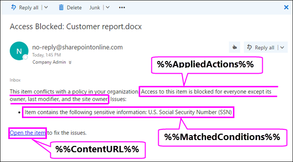

# Inviare notifiche tramite posta elettronica e visualizzare i suggerimenti per i criteri DLP

È possibile utilizzare un criterio di prevenzione della perdita di dati (DLP) per identificare, monitorare e proteggere le informazioni riservate in Office 365. Si desidera che gli utenti dell'organizzazione che lavorano con queste informazioni riservate vengano conformi ai criteri DLP, ma non si desidera bloccarli inutilmente dall'ottenere il proprio lavoro. Questa è la posizione in cui le notifiche di posta elettronica e i suggerimenti criteri possono essere utili
  

  
Un suggerimento per i criteri è una notifica o un avviso visualizzato quando un utente utilizza contenuto che è in conflitto con un criterio DLP, ad esempio il contenuto come una cartella di lavoro di Excel in un sito di OneDrive for business che contiene informazioni personali e che è condiviso con un utente esterno.
  
È possibile utilizzare le notifiche di posta elettronica e i suggerimenti per i criteri per aumentare la consapevolezza e aiutare a informare gli utenti sui criteri dell'organizzazione. È inoltre possibile fornire agli utenti la possibilità di ignorare il criterio, in modo che non siano bloccati se hanno una necessità aziendale valida o se il criterio rileva un falso positivo.
  
Nel centro sicurezza &amp; e conformità di Office 365, quando si crea un criterio DLP, è possibile configurare le notifiche degli utenti in:
  
- Inviare una notifica di posta elettronica agli utenti scelti che descrivono il problema.
    
- Visualizzare un suggerimento per i criteri per il contenuto che è in conflitto con il criterio DLP:
    
  - Per la posta elettronica in Outlook sul Web e Outlook 2013 e versioni successive, il suggerimento del criterio viene visualizzato nella parte superiore di un messaggio sopra i destinatari mentre il messaggio è in fase di composizione.
    
  - Per i documenti in un account OneDrive for business o in un sito di SharePoint Online, il suggerimento per i criteri è indicato da un'icona di avviso che viene visualizzata sull'elemento. Per visualizzare altre informazioni, è possibile selezionare un elemento e quindi fare **** del riquadro informazioni informazioni nell'angolo in alto a destra della pagina per aprire il riquadro dei dettagli. 
    
  - Per i documenti di Excel 2016, PowerPoint 2016 e Word 2016 archiviati in un sito di OneDrive for business o in un sito di SharePoint Online incluso nei criteri DLP, il suggerimento per i criteri viene visualizzato sulla barra dei messaggi e sulla visualizzazione Backstage (menu **file** \> ** Info**).
    
## Aggiungere notifiche utente a un criterio DLP

Quando si crea un criterio DLP, entrambe le notifiche di posta elettronica e i suggerimenti per i criteri fanno parte della sezione **notifiche utente** . 
  
1. Passare a [https://protection.office.com](https://protection.office.com).
    
2. Accedere a Office 365 utilizzando l'account aziendale o dell'Istituto di istruzione. Si è ora nel centro sicurezza &amp; e conformità di Office 365.
    
3. Nel &amp; centro \> sicurezza e conformità left navigation \> **policy** \> di prevenzione \> della **perdita dei dati** **+ creare un criterio**.
    
    
  
4. Scegliere il modello di criteri DLP che protegge i tipi di informazioni riservate necessarie \> **successivamente**.
    
    Per iniziare con un modello vuoto, fare **** \> clic su Custom Custom **policy** \> **Next**.
    
5. Denominare \> il criterio **successivo**.
    
6. Per scegliere i percorsi che si desidera proteggere dal criterio DLP, effettuare una delle seguenti operazioni:
    
  - scegliere **tutte le posizioni in Office 365** \> **avanti**.
    
  - Scegliere **Consenti di scegliere le posizioni** \> specifiche **successive**.
    
    Per includere o escludere un'intera posizione, ad esempio tutti i messaggi di posta elettronica di Exchange o tutti gli account di OneDrive, attivare o disattivare lo **stato** di tale percorso. 
    
    Per includere solo i siti di SharePoint specifici o gli account di OneDrive, passare lo **stato** su attivato e quindi fare clic sui collegamenti in **Includi** per scegliere i siti o gli account specifici. 
    
7. Scegliere **Usa impostazioni** \> avanzate **successive**.
    
8. Scegliere **+ nuova regola**.
    
9. Nell'editor delle regole, in **notifiche utente**, impostare lo stato su.
    
    
  
## Opzioni di configurazione delle notifiche di posta elettronica

Per ogni regola in un criterio DLP, è possibile:
  
- Inviare la notifica agli utenti selezionati. Questi utenti possono essere il proprietario del contenuto, l'autore dell'ultima modifica apportata al contenuto, il proprietario del sito in cui è archiviato il contenuto o un utente specifico.
    
- Personalizzare il testo incluso nella notifica tramite HTML o token. Per ulteriori informazioni, vedere la sezione riportata di seguito.
    
> [!NOTE]
>  Le notifiche tramite posta elettronica possono essere inviate solo ai singoli destinatari, non ai gruppi o alle liste di distribuzione. > solo il nuovo contenuto attiverà una notifica tramite posta elettronica. La modifica del contenuto esistente attiverà suggerimenti per i criteri, ma non una notifica tramite posta elettronica. 
  

  
### Notifica di posta elettronica predefinita

Le notifiche dispongono di una riga dell'oggetto che inizia con l'azione intrapresa, ad esempio "notifica", "messaggio bloccato" per la posta elettronica o "accesso bloccato" per i documenti. Se la notifica è relativa a un documento, il corpo del messaggio di notifica include un collegamento che consente di visualizzare il sito in cui è archiviato il documento e di aprire il suggerimento per i criteri per il documento, in cui è possibile risolvere eventuali problemi (vedere la sezione relativa ai suggerimenti per i criteri). Se la notifica è relativa a un messaggio, la notifica include come allegato il messaggio che corrisponde a un criterio DLP.
  

  
Per impostazione predefinita, le notifiche consentono di visualizzare testo simile a quanto segue per un elemento in un sito. Il testo di notifica è configurato separatamente per ogni regola affinché venga visualizzato in modo diverso a seconda della regola che viene soddisfatta.

|**Se la regola del criterio DLP…**|**La notifica predefinita per i documenti di SharePoint o OneDrive for business dice che questo è...**|**La notifica predefinita per i messaggi di Outlook dice che questo è...**|
|:-----|:-----|:-----|
|Invia una notifica ma non consente la sostituzione    |Questo elemento è in conflitto con un criterio dell'organizzazione.    |Il messaggio di posta elettronica è in conflitto con un criterio nell'organizzazione.    |
|Blocca l'accesso, invia una notifica e consente di ignorarla    |Questo elemento è in conflitto con un criterio nell'organizzazione. Se non si risolve questo conflitto, potrebbe essere bloccato l'accesso a questo file.    |Il messaggio di posta elettronica è in conflitto con un criterio nell'organizzazione. Il messaggio non è stato recapitato a tutti i destinatari.    |
|Blocca l'accesso e invia una notifica    |Questo elemento è in conflitto con un criterio dell'organizzazione. L'accesso a questo elemento è limitato al proprietario, all'autore dell'ultima modifica e all'amministratore della raccolta siti principale.    |Il messaggio di posta elettronica è in conflitto con un criterio nell'organizzazione. Il messaggio non è stato recapitato a tutti i destinatari.    |
   
### Notifica di posta elettronica personalizzata

È possibile creare una notifica di posta elettronica personalizzata anziché inviare la notifica di posta elettronica predefinita agli amministratori o agli utenti finali. La notifica di posta elettronica personalizzata supporta HTML e ha un limite di 5.000 caratteri. È possibile utilizzare HTML per includere immagini, formattazione e altre personalizzazioni nella notifica.
  
È inoltre possibile utilizzare i token seguenti per personalizzare la notifica di posta elettronica. Questi token sono variabili che vengono sostituite da informazioni specifiche nella notifica inviata.

|**Token**|**Descrizione**|
|:-----|:-----|
|%% AppliedActions%%    |Le azioni applicate al contenuto.    |
|%% ContentURL%%    |URL del documento nel sito di SharePoint Online o OneDrive for business.    |
|%% MatchedConditions%%    |Le condizioni corrispondenti al contenuto. Utilizzare questo token per informare gli utenti dei possibili problemi relativi al contenuto.    |
   

  
## Opzioni di configurazione dei suggerimenti per i criteri

Per ogni regola in un criterio DLP, è possibile configurare suggerimenti per i criteri per:
  
- Notificare semplicemente alla persona che il contenuto è in conflitto con un criterio DLP, in modo che possano intervenire per risolvere il conflitto. È possibile utilizzare il testo predefinito (vedere le tabelle riPortate di seguito) oppure immettere testo personalizzato sui criteri specifici dell'organizzazione.
    
- Consentire all'utente di ignorare il criterio DLP. In alternativa, è possibile:
    
  - Richiedere alla persona di immettere una giustificazione aziendale per l'override del criterio. Queste informazioni sono registrate ed è possibile visualizzarle nei report DLP nella sezione **report** del Centro sicurezza &amp; e conformità. 
    
  - Consentire all'utente di segnalare un falso positivo e di ignorare il criterio DLP. Anche questa informazione viene registrata per il report affinché sia possibile utilizzare falsi positivi per ottimizzare le regole.
    

  
Ad esempio, si può avere un criterio DLP applicato ai siti di OneDrive for business che individuano informazioni di identificazione personale (PII) e questo criterio ha tre regole:
  
1. Prima regola: Se vengono rilevate meno di cinque istanze di queste informazioni riservate in un documento e il documento è condiviso con utenti interni all'organizzazione, l'azione **Invia una notifica** mostra un suggerimento per i criteri. Non sono necessarie opzioni per ignorare i suggerimenti per i criteri perché la regola sta semplicemente informando l'utente senza bloccargli l'accesso. 
    
2. Seconda regola: se in un documento sono rilevate più di cinque istanze di queste informazioni riservate e il documento viene condiviso con persone all'interno dell'organizzazione, l'azione **blocca l'accesso al contenuto** limita le autorizzazioni per il file e la ** Invia un'** azione di notifica consente agli utenti di ignorare le azioni in questa regola fornendo una giustificazione aziendale. L'attività dell'organizzazione a volte richiede agli utenti interni la condivisione dei dati delle informazioni personali e non si desidera che il criterio DLP blocchi questo lavoro. 
    
3. Terza regola: Se vengono rilevate più di cinque istanze di queste informazioni riservate in un documento e il documento è condiviso con utenti esterni all'organizzazione, l'azione **Blocca accesso al contenuto** limita le autorizzazioni per il file e l'azione **Invia una notifica** non consente agli utenti di ignorare le azioni in questa regola perché l'informazione è condivisa esternamente. In nessun caso gli utenti dell'organizzazione possono condividere dati PII all'esterno dell'organizzazione. 
    
Di seguito sono riportati alcuni punti per comprendere l'utilizzo di un suggerimento per i criteri per ignorare una regola:
  
- La possibilità di eseguire l'override è per ogni regola e sostituisce tutte le azioni della regola (ad eccezione dell'invio di una notifica, che non può essere sottoposta a override).
    
- È possibile che il contenuto corrisponda a diverse regole in un criterio DLP, ma viene visualizzato solo il suggerimento per i criteri della regola più restrittiva e con priorità più alta. Ad esempio, un suggerimento per i criteri di una regola che blocca l'accesso al contenuto verrà visualizzato su un suggerimento per i criteri da una regola che invia semplicemente una notifica. In questo modo viene impedito agli utenti di visualizzare una cascata di suggerimenti per i criteri.
    
- Se i suggerimenti per i criteri nella regola più restrittiva consentono all'utente di ignorare la regola, in questo modo vengono ignorate anche le altre regole per le quali è stata rilevata una corrispondenza del contenuto.
    
## Suggerimenti per i criteri nei siti OneDrive for Business e SharePoint Online

Quando un documento in un sito di OneDrive for business o in un sito di SharePoint Online corrisponde a una regola in un criterio DLP e questa regola utilizza suggerimenti per i criteri, i suggerimenti per i criteri visualizzano icone speciali nel documento:
  
1. Se la regola invia una notifica relativa al file, viene visualizzata l'icona di avviso.
    
2. Se la regola blocca l'accesso al documento, viene visualizzata l'icona di blocco.
    

  
Per eseguire un'azione su un documento, è possibile selezionare l' \> icona **** seleziona informazioni riquadro delle informazioni nell'angolo in alto a destra della pagina per aprire il suggerimento per \> i **criteri di visualizzazione**del riquadro dei dettagli.
  
Il suggerimento per i criteri elenca i problemi con il contenuto e, se i suggerimenti per i criteri sono configurati con queste opzioni, è possibile selezionare **Risolvi** e quindi **ignorare** il suggerimento per i criteri oppure **segnalare** un falso positivo. 
  

  

  
I criteri DLP sono sincronizzati con i siti e il contenuto viene valutato periodicamente e in modo asincrono, quindi potrebbe esserci un breve ritardo tra il momento in cui viene creato il criterio DLP e il momento in cui si iniziano a visualizzare i suggerimenti per i criteri. Potrebbe verificarsi un ritardo simile da quando si risolve o si ignora un suggerimento per i criteri a quando scompare l'icona sul documento nel sito.
  
### Testo predefinito per i suggerimenti dei criteri nei siti

Per impostazione predefinita, i suggerimenti per i criteri consentono di visualizzare testo simile a quanto segue per un elemento in un sito. Il testo di notifica è configurato separatamente per ogni regola affinché venga visualizzato in modo diverso a seconda della regola che viene soddisfatta.

|**Se la regola del criterio DLP…**|**Nel suggerimento per i criteri predefinito viene visualizzato…**|
|:-----|:-----|
|Invia una notifica ma non consente la sostituzione    |Questo elemento è in conflitto con un criterio dell'organizzazione.    |
|Blocca l'accesso, invia una notifica e consente di ignorarla    |Questo elemento è in conflitto con un criterio nell'organizzazione. Se non si risolve questo conflitto, potrebbe essere bloccato l'accesso a questo file.    |
|Blocca l'accesso e invia una notifica    |Questo elemento è in conflitto con un criterio dell'organizzazione. L'accesso a questo elemento è limitato al proprietario, all'autore dell'ultima modifica e all'amministratore della raccolta siti principale.    |
   
### Testo personalizzato per i suggerimenti sui criteri nei siti

È possibile personalizzare il testo per i suggerimenti per i criteri separatamente dalla notifica di posta elettronica. A differenza del testo personalizzato per le notifiche di posta elettronica (vedere la sezione precedente), il testo personalizzato per i suggerimenti per i criteri non accetta HTML o token. Al contrario, il testo personalizzato per i suggerimenti per i criteri è testo normale solo con un limite di 256 caratteri.
  
## Suggerimenti per i criteri in Outlook sul Web e Outlook 2013 e versioni successive

Quando si compone un nuovo messaggio di posta elettronica in Outlook sul Web e Outlook 2013 e versioni successive, viene visualizzato un suggerimento per i criteri se si aggiunge contenuto che corrisponde a una regola in un criterio DLP e che la regola utilizza suggerimenti per i criteri. Il suggerimento del criterio viene visualizzato nella parte superiore del messaggio, al di sopra dei destinatari, mentre il messaggio viene composto.
  

  
I suggerimenti per i criteri funzionano se le informazioni riservate vengono visualizzate nel corpo del messaggio, nella riga dell'oggetto o anche in un allegato del messaggio, come illustrato di seguito.
  

  
Se i suggerimenti per i criteri sono configurati in modo da consentire la sostituzione, è possibile scegliere **Mostra dettagli** \> **sostituzione** \> immettere una \> **** giustificazione aziendale o segnalare un falso positivo.
  

  

  
Si noti che quando si aggiungono informazioni riservate a un messaggio di posta elettronica, potrebbe verificarsi una latenza tra quando vengono aggiunte le informazioni riservate e quando viene visualizzato il suggerimento per i criteri.

### Outlook 2013 e versioni successive supporta la visualizzazione di suggerimenti per i criteri solo per alcune condizioni

Attualmente, Outlook 2013 e versioni successive supporta la visualizzazione dei suggerimenti per i criteri solo per queste condizioni:

- Contenuto contiene
- Contenuto condiviso

Attualmente stiamo lavorando al supporto per mostrare suggerimenti per i criteri per altre condizioni. Sono inclusi i seguenti:

- Non è stato possibile analizzare il contenuto di un allegato di posta elettronica
- Il contenuto di un allegato di posta elettronica non ha completato l'analisi
- L'estensione del file allegato è
- L'allegato è protetto da password
- La proprietà Document è
- Il dominio del destinatario è
- L'indirizzo IP del mittente è

Tenere presente che tutte queste condizioni funzionano in Outlook, in cui corrispondono ai contenuti e applicano azioni protettive sul contenuto. Tuttavia, la visualizzazione di suggerimenti per i criteri per gli utenti non è ancora supportata.
  
### Suggerimenti per i criteri nell'interfaccia di amministrazione di Exchange e nel centro &amp; sicurezza e conformità di Office 365

I suggerimenti per i criteri possono essere compatibili con i criteri DLP e le regole del flusso di posta creati nell'interfaccia di amministrazione di Exchange oppure con i &amp; criteri DLP creati nel centro sicurezza e conformità di Office 365, ma non in entrambi. Ciò è dovuto al fatto che questi criteri sono archiviati in posizioni diverse, ma i suggerimenti per i criteri possono essere disegnati solo da una singola posizione.
  
Se sono stati configurati suggerimenti per i criteri nell'interfaccia di amministrazione di Exchange, eventuali suggerimenti per i criteri configurati nel centro sicurezza &amp; e conformità di Office 365 non verranno visualizzati per gli utenti in Outlook sul Web e Outlook 2013 e versioni successive finché non si disattivano i suggerimenti in Exchange interfaccia di amministrazione. In questo modo, le regole del flusso di posta di Exchange correnti (note anche come regole di trasporto) continueranno a funzionare fino a quando non si sceglie &amp; di passare al centro sicurezza e conformità di Office 365.
  
Si noti che, mentre i suggerimenti per i criteri possono essere disegnati solo da una singola posizione, le notifiche di posta elettronica vengono sempre inviate, anche se si &amp; utilizzano i criteri DLP sia nel centro conformità sicurezza di Office 365 sia nell'interfaccia di amministrazione di Exchange.
  
### Testo predefinito per i suggerimenti per i criteri in posta elettronica

Per impostazione predefinita, i suggerimenti per i criteri mostrano testo simile al seguente per la posta elettronica.

|**Se la regola del criterio DLP…**|**Nel suggerimento per i criteri predefinito viene visualizzato…**|
|:-----|:-----|
|Invia una notifica ma non consente la sostituzione    |La posta elettronica è in conflitto con un criterio nell'organizzazione.    |
|Blocca l'accesso, invia una notifica e consente di ignorarla    |La posta elettronica è in conflitto con un criterio nell'organizzazione.    |
|Blocca l'accesso e invia una notifica    |La posta elettronica è in conflitto con un criterio nell'organizzazione.    |
   
## Suggerimenti per i criteri in Excel 2016, PowerPoint 2016 e Word 2016

Quando gli utenti lavorano con contenuti riservati nelle versioni desktop di Excel 2016, PowerPoint 2016 e Word 2016, i suggerimenti per i criteri possono informarli in tempo reale che il contenuto è in conflitto con un criterio DLP. Ciò richiede che:
  
- Il documento di Office è archiviato in un sito OneDrive for Business o SharePoint Online.
    
- Il sito è incluso in un criterio DLP configurato per l'utilizzo di suggerimenti per i criteri.
    
Questi programmi desktop di Office 2016 sincronizzano automaticamente i criteri DLP direttamente da Office 365 e quindi eseguono l'analisi dei documenti in modo da evitare conflitti con i criteri DLP e visualizzare i suggerimenti per i criteri in tempo reale.
  
A seconda della modalità di configurazione dei suggerimenti per i criteri nel criterio DLP, gli utenti possono scegliere se ignorare semplicemente il suggerimento per i criteri, ignorare il criterio con o senza una motivazione aziendale oppure segnalare un falso positivo.
  
I suggerimenti per i criteri vengono visualizzati nella barra dei messaggi.
  

  
I suggerimenti per i criteri sono visibili anche nella visualizzazione Backstage (nella scheda **File**). 
  

  
Se i suggerimenti per i criteri nel criterio DLP sono configurati con queste opzioni, è possibile selezionare **Risolvi** per **ignorare** un suggerimento per i criteri oppure **segnalare** un falso positivo. 
  

  
In ognuno di questi programmi desktop di Office 2016, gli utenti possono scegliere se disattivare i suggerimenti per i criteri. Se disattivati, i suggerimenti per i criteri che sono delle semplici notifiche non vengono visualizzati nella barra dei messaggi o nella visualizzazione Backstage (nella scheda **File**). Tuttavia, i suggerimenti per i criteri di blocco o sostituzione continuano a essere visualizzati e a ricevere notifiche di posta elettronica. Inoltre, la disattivazione dei suggerimenti per i criteri non esclude il documento da eventuali criteri DLP che vi sono stati applicati. 
  
### Testo predefinito per i suggerimenti per i criteri in Excel 2016, PowerPoint 2016 e Word 2016

Per impostazione predefinita, i suggerimenti per i criteri mostrano un testo simile a quanto segue nella barra dei messaggi e nella visualizzazione Backstage di un documento aperto. Il testo di notifica è configurato separatamente per ogni regola affinché venga visualizzato in modo diverso a seconda della regola che viene soddisfatta.

|**Se la regola del criterio DLP…**|**Nel suggerimento per i criteri predefinito viene visualizzato…**|
|:-----|:-----|
|Invia una notifica ma non consente la sostituzione    |Questo file è in conflitto con un criterio nell'organizzazione. Per ulteriori informazioni, passare al menu **file** .  |
|Blocca l'accesso, invia una notifica e consente di ignorarla    |Questo file è in conflitto con un criterio nell'organizzazione. Se non si risolve questo conflitto, potrebbe essere bloccato l'accesso a questo file. Per ulteriori informazioni, passare al menu **file** .  |
|Blocca l'accesso e invia una notifica    |Questo file è in conflitto con un criterio nell'organizzazione. Se non si risolve questo conflitto, potrebbe essere bloccato l'accesso a questo file. Per ulteriori informazioni, passare al menu **file** .  |
   
### Testo personalizzato per i suggerimenti per i criteri in Excel 2016, PowerPoint 2016 e Word 2016

È possibile personalizzare il testo per i suggerimenti per i criteri separatamente dalla notifica di posta elettronica. A differenza del testo personalizzato per le notifiche di posta elettronica (vedere la sezione precedente), il testo personalizzato per i suggerimenti per i criteri non accetta HTML o token. Al contrario, il testo personalizzato per i suggerimenti per i criteri è testo normale solo con un limite di 256 caratteri.
  
## Ulteriori informazioni

- [Panoramica relativa ai criteri di prevenzione della perdita di dati](data-loss-prevention-policies.md)
    
- [Creare un criterio di prevenzione della perdita dei dati da un modello](create-a-dlp-policy-from-a-template.md)
    
- [Creare un criterio di prevenzione della perdita dei dati per proteggere i documenti con FCI o altre proprietà](protect-documents-that-have-fci-or-other-properties.md)
    
- [Elementi inclusi nei modelli di criteri di prevenzione della perdita dei dati](what-the-dlp-policy-templates-include.md)
    
- [Cosa individuano le tipologie di informazioni sensibili](what-the-sensitive-information-types-look-for.md)
    

