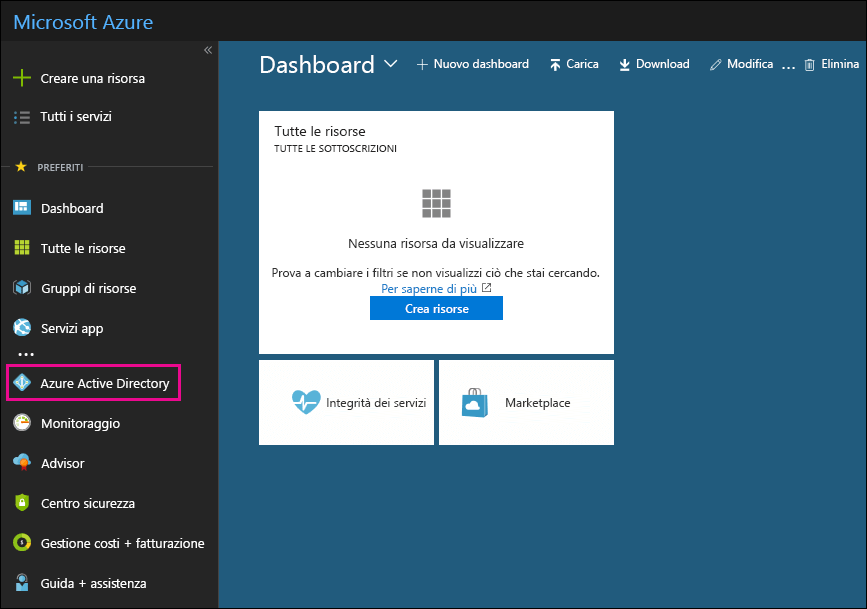

# Utilizzare la sottoscrizione di Azure Active Directory gratuita in Office 365Use your free Azure Active Directory subscription

Se l'organizzazione ha una sottoscrizione a pagamento a Office 365, Microsoft Dynamics CRM Online, Enterprise Mobility Suite o altri servizi Microsoft, si dispone di una sottoscrizione gratuita a Microsoft Azure Active Directory. Gli amministratori possono usare Azure AD per creare e gestire account utente e di gruppo. Per usare Azure AD, basta andare al portale di Azure e accedere utilizzando il tuo account Office 365.If your organization has a paid subscription to Office 365, Microsoft Dynamics CRM Online, Enterprise Mobility Suite, or other Microsoft services, you have a free subscription to Microsoft Azure Active Directory. You and other admins can use Azure AD to create and manage user and group accounts. To use Azure AD, just go to the Azure portal and sign in using your Office 365 account.
  
## Informazioni preliminariBefore you begin

Utilizzare una sessione di esplorazione privata (non una sessione normale) per accedere al portale di Azure (nel passaggio 1 in basso) poiché in questo modo si evita di passare ad Azure le credenziali usate per accedere. Per aprire una sessione InPrivate Browsing in Internet Explorer o in Mozilla FireFox, basta premere CTRL+SHIFT+P. Per aprire una sessione di esplorazione privata in Google Chrome (finestra di navigazione in incognito), premere CTRL+SHIFT+N.Use a private browsing session (not a regular session) to access the Azure portal (in step 1 below) because this will prevent the credential that you are currently logged on with from being passed to Azure. To open an InPrivate Browsing session in Internet Explorer or a Private Browsing session in Mozilla FireFox, just press CTRL+SHIFT+P. To open a private browsing session in Google Chrome (called an incognito window), press CTRL+SHIFT+N.
  
## Accedere ad Azure Active DirectoryIsolation and Access Control in Azure Active Directory

1. Andare a [portal.azure.com](https://portal.azure.com) e accedere con il proprio account professionale o studente di Office 365.Go to [portal.azure.com](https://portal.azure.com) and sign in with your Office 365 work or student account. 
    
2. Nel riquadro di spostamento a sinistra nel portale di Azure, fare clic su **Azure Active Directory**.In the left navigation pane in the Azure portal, click **Azure Active Directory**.
    
    
  
    Viene visualizzata l'interfaccia di amministrazione di **Azure Active Directory**.The **Azure Active Directory** admin center is displayed. 
    
## Ulteriori informazioniMore information

- È inoltre possibile accedere all'interfaccia di amministrazione di **Azure Active Directory** da quella di Office 365. Nel riquadro di spostamento a sinistra dell'interfaccia di amministrazione di Office 365, fare clic su **Interfacce di amministrazione** \> **Azure Active Directory**.You can also access the **Azure Active Directory** admin center from the Office 365 admin center. In the left navigation pane of the Office 365 admin center , click **Admin centers** \> **Azure Active Directory**.
    
- Per informazioni sulla gestione degli utenti e dei gruppi e sull'esecuzione di altre attività di gestione delle directory, vedere [Gestione della directory di Azure AD](https://docs.microsoft.com/azure/active-directory/active-directory-administer).For information about managing users and groups and performing other directory management tasks, see [Administering your Azure AD directoryhttp://go.microsoft.com/fwlink/p/?LinkId=512488](https://docs.microsoft.com/azure/active-directory/active-directory-administer).
