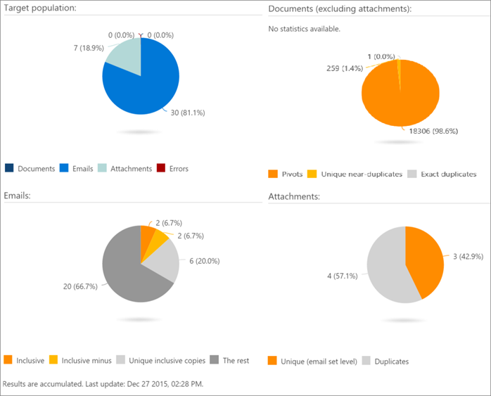

# Visualizzare i risultati dell'analisi in Office 365 Advanced eDiscovery

> [!NOTE]
> Per usare Advanced eDiscovery è necessario avere Office 365 E3 con il componente aggiuntivo Advanced Compliance o un abbonamento E5 dell'organizzazione. Se non si ha questo piano e si desidera provare Advanced eDiscovery, è possibile [richiedere una valutazione di Office 365 Enterprise E5](https://go.microsoft.com/fwlink/p/?LinkID=698279). 
  
In Advanced eDiscovery, Progress and results for the Analyze Process può essere visualizzato in una vasta gamma di visualizzazioni come descritto di seguito.
  
## Visualizzazione dello stato dell'attività Analyze

In **prepara \> analisi \> stato \> attività risultati**, lo stato viene visualizzato durante e dopo l'analisi dell'esecuzione del processo. 
  

  
Le attività visualizzate possono variare a seconda delle opzioni selezionate. 
  
- **ND/et: Setup**: prepara per l'esecuzione, ad esempio set di parametri Run e case.
    
- **ND/et: calcolo ND**: processi di analisi quasi duplicati dei file.
    
- **ND/et: et calculation**: esegue l'analisi del thread di posta elettronica sull'intero set di messaggi di posta elettronica.
    
- **ND/et: pivot e similitudini**: esegue l'elaborazione di pivot e file di somiglianza.
    
- **ND/et: aggiornamento dei metadati**: finalizza i nuovi dati raccolti nei file del database.
    
- **Temi: calcolo**dei temi: esecuzione dell'analisi dei temi. (Visualizzato solo se selezionato).
    
- **Stato attività**: questa riga viene visualizzata dopo il completamento dell'attività. Mentre le attività sono in esecuzione, viene visualizzata la durata di esecuzione.
    
> [!NOTE]
> I risultati dell'analisi di quasi duplicati e di thread di posta elettronica (ND ed ED) si applicano al numero di documenti da elaborare. Non include file duplicati esatti. 
  
## Visualizzazione near-Duplicates and mail Threads status

I risultati della popolazione di **destinazione** visualizzano il numero di documenti, messaggi di posta elettronica, allegati ed errori nella popolazione di destinazione. 
  
Nei risultati dei **documenti** vengono visualizzati il numero di pivot, i duplicati univoci e i file duplicati esatti. 
  
I **** risultati dei messaggi di posta elettronica visualizzano il numero di copie inclusive, inclusive, uniche e inclusive e il resto del messaggio. I diversi tipi di risultati del messaggio di posta elettronica sono: 
  
- **Inclusive**: un messaggio di posta elettronica incluso è il nodo di terminazione in un thread di posta elettronica e contiene tutta la cronologia precedente di quel thread. Di conseguenza, il revisore può concentrarsi in modo sicuro sul messaggio di posta elettronica incluso, senza la necessità di leggere i messaggi precedenti nel thread. 
    
- **Inclusione meno**: un messaggio di posta elettronica incluso è definito come incluso meno se sono presenti uno o più allegati diversi associati ai padri dei messaggi inclusivi. In questo contesto, il termine padre viene utilizzato per i messaggi che si trovano verso l'alto sul thread di posta elettronica o le conversazioni incluse in tale messaggio di posta elettronica incluso specifico. Un revisore può utilizzare l'indicazione meno inclusiva come un segnale che, sebbene potrebbe non essere necessario esaminare il contenuto dei genitori inclusi nella posta elettronica, potrebbe essere utile esaminare gli allegati associati ai padri del percorso inclusivo. 
    
- **Copia inclusiva**: un messaggio di posta elettronica incluso è designato come copia inclusiva se si tratta della copia di un altro messaggi contrassegnato come inclusivo o inclusivo meno. In altre parole, questo messaggio ha lo stesso oggetto e corpo di un altro messaggio inclusivo e, come tale, risiede nello stesso nodo. Poiché i messaggi di copia inclusivi contengono lo stesso contenuto, è possibile che in genere vengano ignorati nel processo di revisione. 
    
- **The Rest**: indica la posta elettronica che non contiene contenuti univoci e pertanto non rientra in nessuna delle tre categorie precedenti. Questi messaggi di posta elettronica non devono essere esaminati. Se un messaggio contiene un allegato che non è incluso in una posta elettronica inclusa in un secondo momento, potrebbe essere necessario esaminare l'allegato. Ciò è indicato dall'esistenza di un messaggio di posta elettronica meno incluso all'interno del thread.
    
I risultati degli **allegati** visualizzano il numero di allegati, in base al tipo di elementi unici e duplicati. 
  

  
## Vedere anche

[Office 365 Advanced eDiscovery](office-365-advanced-ediscovery.md)
  
[Informazioni sulla somiglianza del documento](understand-document-similarity-in-advanced-ediscovery.md)
  
[Impostazione delle opzioni di analisi](set-analyze-options-in-advanced-ediscovery.md)
  
[Impostazione Ignora testo](set-ignore-text-in-advanced-ediscovery.md)
  
[Impostazione analisi impostazioni avanzate](view-analyze-results-in-advanced-ediscovery.md)

