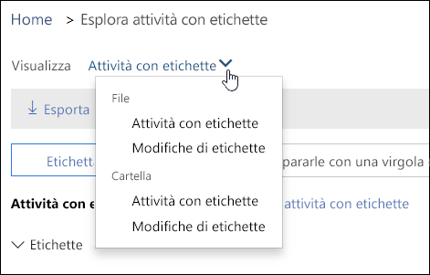
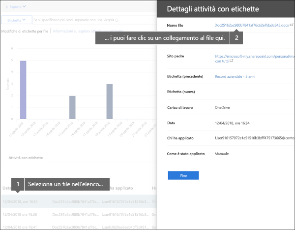
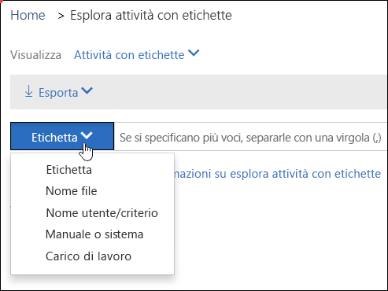

# Visualizzare le attività delle etichette per i documenti

Dopo aver creato le etichette, è consigliabile verificare che vengano applicate al contenuto come previsto. Con Esplora attività con etichette nel Centro sicurezza e conformità di Office 365, è possibile cercare e visualizzare rapidamente le attività con etichette per tutto il contenuto di SharePoint e OneDrive for Business degli ultimi 30 giorni. Si tratta di dati in tempo reale che offrono un quadro chiaro di ciò che accade nel tenant.
  
Ad esempio, con Esplora attività con etichette è possibile:
  
- Visualizzare la frequenza con cui ogni etichetta è stata applicata ogni giorno (fino a 30 giorni).
    
- Vedere chi ha etichettato il file, quale file e in che data, visualizzando anche un collegamento al sito in cui si trova il file.
    
- Visualizzare quali etichette di file sono state modificate o rimosse, quali sono le etichette vecchie o nuove e chi ha apportato la modifica.
    
- Filtrare i dati per visualizzare tutte le attività con etichette per un'etichetta, un file o un utente specifico. È anche possibile filtrare le attività con etichette in base alla posizione (SharePoint o OneDrive for Business) e in base a come è stata applicata l'etichetta, se manualmente o automaticamente.
    
- Visualizzare le attività con etichette per le cartelle e i singoli documenti. A breve sarà possibile visualizzare il numero dei file nella cartella che sono stati denominati dopo aver assegnato un'etichetta alla cartella.
    
Esplora attività con etichette è disponibile nel Centro sicurezza&amp; e conformità > **Governance dei dati** > **Esplora attività con etichette**.
  
Esplora attività con etichette richiede un abbonamento a Office 365 Enterprise E5.
  

  
## Visualizzare le attività con etichette per file o cartelle

Nella parte superiore di Esplora attività con etichette è possibile scegliere se visualizzare le attività per file o cartelle. Le attività della cartella riguardano solo la cartella, non i file al suo interno.
  
È consigliabile visualizzare le attività con etichette per le cartelle perché, se si etichetta una cartella, anche a tutti i file contenuti sarà applicata l'etichetta, ad eccezione di quelli a cui è già applicata esplicitamente un'etichetta. Di conseguenza, etichettare le cartelle potrebbe interessare un numero significativo di file. Per ulteriori informazioni, vedere [Applicazione di un'etichetta di conservazione predefinita a tutto il contenuto in una raccolta, una cartella o un set di documenti di SharePoint](labels.md#applying-a-default-retention-label-to-all-content-in-a-sharepoint-library-folder-or-document-set).
  

  
### Attività con etichette

 **Attività con etichette** include tutte le azioni relative alle etichette: **aggiunta**, **rimozione** o **modifica**. Questa visualizzazione può essere usata per ottenere un quadro completo del numero di file a cui, ogni giorno, è stata applicata una specifica etichetta. 
  
### Modifiche di etichette

 **Modifiche di etichette** include le azioni potenzialmente pericolose di **rimozione** o **modifica** di un'etichetta. È possibile usare questa visualizzazione per vedere rapidamente queste azioni rischiose e l'utente che le ha eseguite. Nell'elenco delle attività sotto il grafico è possibile selezionare un file e fare clic su un collegamento al file nel riquadro dei dettagli a destra. 
  

  
## Filtrare le attività con etichette

È possibile filtrare rapidamente i dati per visualizzare tutte le attività con etichette per un'etichetta, un file o un utente specifico. È anche possibile filtrare le attività con etichette in base alla posizione (SharePoint o OneDrive for Business) e in base a come è stata applicata l'etichetta, se manualmente o automaticamente.
  

  

