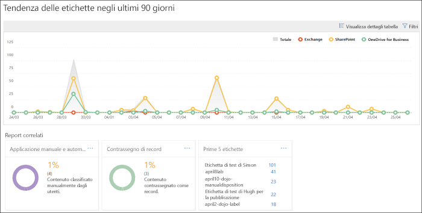
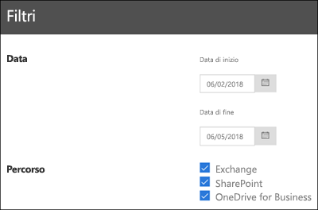

# Visualizzare i report sulla governance dei dati

Dopo aver creato le etichette, è consigliabile verificare che queste vengano applicate al contenuto nel modo previsto. I report sulla governance dei dati nel Centro sicurezza e conformità di Office 365 consentono di visualizzare rapidamente:
  
- **Prime 5 etichette** Questo report mostra le principali 5 etichette applicate al contenuto. Fare clic sul report per visualizzare un elenco di tutte le etichette recentemente applicate al contenuto. È possibile visualizzare il numero di ogni etichetta, la posizione, la modalità di applicazione, le azioni di conservazione relative, se si tratta di un record e il tipo di disposizione. 
    
- **Applicazione manuale e automatica** Questo report mostra il numero di tutti i contenuti etichettati manualmente o automaticamente e la percentuale di contenuto etichettata manualmente e quella etichettata automaticamente. 
    
- **Contrassegno dei record** Questo report mostra il numero di tutti i contenuti contrassegnati come record o non record e le rispettive percentuali. 
    
- **Tendenza delle etichette negli ultimi 90 giorni** Questo report mostra il numero e la posizione di tutte le etichette applicate negli ultimi 90 giorni. 
    
Tutti questi report mostrano il contenuto etichettato di Exchange, SharePoint e OneDrive for Business.
  
È possibile trovare questi report in Centro sicurezza e conformità \> **Governance dei dati** \> **Dashboard**.
  

  
È possibile filtrare i report sulla governance dei dati per data (fino a 90 giorni) e posizione (Exchange, SharePoint e OneDrive for Business). I dati più recenti possono richiedere fino a 24 ore prima di essere visualizzati nei report.
  

  

