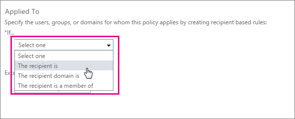

# <a name="zero-hour-auto-purge---protection-against-spam-and-malware"></a><span data-ttu-id="1914a-104">ZAP: protezione contro la posta indesiderata e malware</span><span class="sxs-lookup"><span data-stu-id="1914a-104">Zero-hour auto purge - protection against spam and malware</span></span>

<span data-ttu-id="1914a-p102">Eliminazione automatica zero ore (ZAP) è una funzionalità di protezione posta elettronica in grado di rilevare i messaggi con la posta indesiderata o malware che sono già stati consegnati alla posta in arrivo degli utenti e quindi viene eseguito il rendering del contenuto dannoso dannosa. Come ZAP esegue questa operazione dipende dal tipo di contenuto dannoso rilevato.</span><span class="sxs-lookup"><span data-stu-id="1914a-p102">Zero-hour auto purge (ZAP) is an email protection feature that detects messages with spam or malware that have already been delivered to your users' inboxes, and then renders the malicious content harmless. How ZAP does this depends on the type of malicious content detected.</span></span>
  
<span data-ttu-id="1914a-107">ZAP è disponibile con l'impostazione predefinita, Exchange Online Protection incluso in qualsiasi sottoscrizione a Office 365 che contiene le cassette postali di Exchange Online.</span><span class="sxs-lookup"><span data-stu-id="1914a-107">ZAP is available with the default Exchange Online Protection that is included with any Office 365 subscription that contains Exchange Online mailboxes.</span></span>
  
## <a name="how-does-zap-work"></a><span data-ttu-id="1914a-108">Funzionamento ZAP</span><span class="sxs-lookup"><span data-stu-id="1914a-108">How does ZAP work?</span></span>

<span data-ttu-id="1914a-p103">Aggiornamenti di Office 365 firme malware e motore di protezione da posta indesiderate in tempo reale a intervalli giornalieri. Gli utenti possono comunque dannoso messaggi vengano recapitati posta in arrivo per una serie di motivi, tra cui quando il contenuto è stato weaponized alla volta dopo che è stato innanzitutto inviato agli utenti. ZAP indirizzi questo monitorando continuamente viene aggiornata per le firme di posta indesiderata e malware Office 365, e pertanto individuare e rimuovere già contenuti ai messaggi di posta in arrivo. Per la posta che è già stata identificata come posta indesiderata, ZAP Sposta i messaggi non letti nella cartella posta indesiderata dell'utente. Per appena rilevato malware, ZAP rimuove gli allegati dal messaggio di posta elettronica, indipendentemente dal fatto che la posta elettronica è stato letto o non. È invece per i messaggi che sono stati classificati in modo non corretto come dannose.</span><span class="sxs-lookup"><span data-stu-id="1914a-p103">Office 365 updates anti-spam engine and malware signatures in real-time on a daily basis. However, your users might still get malicious messages delivered to their inboxes for a variety of reasons, including when the content was weaponized at a time after it was first delivered to users. ZAP addresses this by continually monitoring updates to the Office 365 spam and malware signatures, and can therefore find and remove previously delivered messages already in inboxes. For mail that was already identified as spam, ZAP moves unread messages to the user's Junk mail folder. For newly detected malware, ZAP removes the attachments from the email message, regardless of whether the mail was read or not. The reverse is true for messages that were incorrectly classified as malicious.</span></span>
  
<span data-ttu-id="1914a-115">L'azione ZAP è semplice per la cassetta postale utente potrà non riceve una notifica che di posta elettronica è stato spostato.</span><span class="sxs-lookup"><span data-stu-id="1914a-115">The ZAP action is seamless for the mailbox user, he or she is not notified the mail has been moved.</span></span>
  
<span data-ttu-id="1914a-116">Consenti regole degli utenti finali, [regole del flusso di posta elettronica](https://go.microsoft.com/fwlink/p/?LinkId=722755)e gli elenchi o altri filtri hanno la precedenza su ZAP.</span><span class="sxs-lookup"><span data-stu-id="1914a-116">Allow lists, [mail flow rules](https://go.microsoft.com/fwlink/p/?LinkId=722755), and end user rules or additional filters take precedence over ZAP.</span></span>
  
 <span data-ttu-id="1914a-117">**Contenuto dell'articolo**</span><span class="sxs-lookup"><span data-stu-id="1914a-117">**In this article:**</span></span>
  
> [<span data-ttu-id="1914a-118">Impostare i criteri di filtro posta indesiderata</span><span class="sxs-lookup"><span data-stu-id="1914a-118">Set spam filter policy</span></span>](zero-hour-auto-purge.md#BK_SetSpam)
    
> [<span data-ttu-id="1914a-119">Vedere se ZAP spostato il messaggio</span><span class="sxs-lookup"><span data-stu-id="1914a-119">See if ZAP moved your message</span></span>](zero-hour-auto-purge.md#BK_DidZAPMove)
    
> [<span data-ttu-id="1914a-120">Disabilitare ZAP</span><span class="sxs-lookup"><span data-stu-id="1914a-120">Disable ZAP</span></span>](zero-hour-auto-purge.md#BK_Posh)
    
> [<span data-ttu-id="1914a-121">Domande frequenti</span><span class="sxs-lookup"><span data-stu-id="1914a-121">FAQ</span></span>](zero-hour-auto-purge.md#BK_FAQ)
    
## <a name="working-with-zap"></a><span data-ttu-id="1914a-122">Utilizzo di ZAP</span><span class="sxs-lookup"><span data-stu-id="1914a-122">Working with ZAP</span></span>

<span data-ttu-id="1914a-123">ZAP è attivata per impostazione predefinita, ma è necessario assicurarsi che siano soddisfatti due condizioni:</span><span class="sxs-lookup"><span data-stu-id="1914a-123">ZAP is turned on by default, but you do have to make sure a couple of conditions are met:</span></span>
  
- <span data-ttu-id="1914a-124">Criterio di filtro posta indesiderata è impostata su [spostare il messaggio nella cartella posta indesiderata](zero-hour-auto-purge.md#BK_SetSpam).</span><span class="sxs-lookup"><span data-stu-id="1914a-124">Spam filter policy is set to [Move message to Junk Email folder](zero-hour-auto-purge.md#BK_SetSpam).</span></span>
    
    <span data-ttu-id="1914a-125">È inoltre possibile creare un nuovo criterio di filtro posta indesiderata che si applica solo a un insieme di utenti se non si desidera che tutte le cassette postali per essere analizzata da ZAP.</span><span class="sxs-lookup"><span data-stu-id="1914a-125">You can also create a new spam filter policy that applies only to a set of users if you don't want all mailboxes to be screened by ZAP.</span></span>
    
- <span data-ttu-id="1914a-126">L'utente [Opzioni \> posta indesiderata](https://support.office.com/article/068FA430-F8D7-4518-A8DA-8BC74958F05F).</span><span class="sxs-lookup"><span data-stu-id="1914a-126">The user's [Options \> Junk Email](https://support.office.com/article/068FA430-F8D7-4518-A8DA-8BC74958F05F).</span></span>
    
<span data-ttu-id="1914a-127">Se si desidera [visualizzare se ZAP spostato il messaggio](zero-hour-auto-purge.md#BK_DidZAPMove), è possibile utilizzare lo strumento di traccia messaggio Exchange Online.</span><span class="sxs-lookup"><span data-stu-id="1914a-127">If you want [to see if ZAP moved your message](zero-hour-auto-purge.md#BK_DidZAPMove), you can use the Exchange Online message trace tool.</span></span>
  
<span data-ttu-id="1914a-128">Gli amministratori inoltre possono [disabilitare ZAP](zero-hour-auto-purge.md#BK_Posh) tramite PowerShell.</span><span class="sxs-lookup"><span data-stu-id="1914a-128">Admins can also [disable ZAP](zero-hour-auto-purge.md#BK_Posh) by using PowerShell.</span></span> 
  
 <span data-ttu-id="1914a-129">**Per impostare il criterio di filtro posta indesiderata**</span><span class="sxs-lookup"><span data-stu-id="1914a-129">**To set spam filter policy**</span></span>
  
1. <span data-ttu-id="1914a-130">Accedere al [percorso di accesso a Office 365 per aziende](https://support.office.com/article/e9eb7d51-5430-4929-91ab-6157c5a050b4) e fare clic su **protezione** \> **Filtro posta indesiderata**.</span><span class="sxs-lookup"><span data-stu-id="1914a-130">Sign in to the [Where to sign in to Office 365 for business](https://support.office.com/article/e9eb7d51-5430-4929-91ab-6157c5a050b4) and choose **protection** \> **spam filter**.</span></span> 
    
    
  
2. <span data-ttu-id="1914a-132">Scegliere il criterio di filtro che si desidera modificare, oppure scegliere **Aggiungi** per crearne uno nuovo.</span><span class="sxs-lookup"><span data-stu-id="1914a-132">Either choose the filter policy you want to adjust, or choose **add** to create a new one.</span></span> 
    
    <span data-ttu-id="1914a-p104">Nella schermata precedente, il criterio è denominato "Default", ma se si creano spam ulteriori criteri di filtro è possibile fornire loro un nome diverso. È anche possibile applicare il criterio a un set limitato di utenti.</span><span class="sxs-lookup"><span data-stu-id="1914a-p104">In the previous screen shot, the policy is named "Default", but if you create additional spam filter policies you can give them a different name. You can also apply the policy to only a limited set of users.</span></span>
    
3. <span data-ttu-id="1914a-135">Nella finestra criteri, scegliere **azioni per la posta indesiderata e blocco**e verificare che **la posta indesiderata** è impostata su **Sposta il messaggio nella cartella posta indesiderata**.</span><span class="sxs-lookup"><span data-stu-id="1914a-135">In the policy window, choose **spam and bulk actions**, and make sure that **Spam** is set to **Move message to Junk Email folder**.</span></span> 
    
    <span data-ttu-id="1914a-136">Se si sceglie **Salva** a questo punto, il criterio viene applicato al tenant di Office 365.</span><span class="sxs-lookup"><span data-stu-id="1914a-136">If you choose **Save** at this point, the policy applies to your Office 365 tenant.</span></span> 
    
    
  
4. <span data-ttu-id="1914a-p105">Se è stato creato un nuovo criterio e si desidera applicare il criterio a solo un set di utenti, scorrimento nella finestra del filtro dei criteri e i controlli di menu nella sezione **Applicato a** scegliere i **destinatari**, **dominio**o **appartenenze a gruppi** è Se si desidera applicare il criterio. È inoltre possibile impostare eccezioni e le altre.</span><span class="sxs-lookup"><span data-stu-id="1914a-p105">If you created a new policy, and you want to apply the policy to only a set of users, scroll to the **Applied To** section in the policy filter window, and in the menu controls choose the **recipients**, **domain**, or **group memberships** you want to apply the policy to. You can also set additional conditions and exceptions.</span></span> 
    
    
  
    <span data-ttu-id="1914a-141">Scegliere **Salva** per applicare il criterio agli utenti selezionati.</span><span class="sxs-lookup"><span data-stu-id="1914a-141">Choose **Save** to apply the policy to the selected users.</span></span> 
    
 <span data-ttu-id="1914a-142">**Per vedere se ZAP spostato il messaggio**</span><span class="sxs-lookup"><span data-stu-id="1914a-142">**To see if ZAP moved your message**</span></span>
  
- <span data-ttu-id="1914a-143">È possibile utilizzare per determinare se il messaggio è stato spostato dal ZAP [individuare e risolvere i problemi di recapito di posta elettronica come un amministratore aziendale di Office 365](https://support.office.com/article/e7758b99-1896-41db-bf39-51e2dba21de6) :</span><span class="sxs-lookup"><span data-stu-id="1914a-143">You can use the [Find and fix email delivery issues as an Office 365 for business admin](https://support.office.com/article/e7758b99-1896-41db-bf39-51e2dba21de6) to determine if the message was moved by ZAP:</span></span> 
    
    <span data-ttu-id="1914a-144">Cercare il testo "ora Zero automatico di eliminazione (ZAP)" le informazioni di traccia per identificare un messaggio in cui è stato spostato dal ZAP.</span><span class="sxs-lookup"><span data-stu-id="1914a-144">Look for the text "Zero-Hour Auto Purge (ZAP)" in your trace details to identify a message that was moved by ZAP.</span></span>
    
 <span data-ttu-id="1914a-145">**Per disabilitare ZAP**</span><span class="sxs-lookup"><span data-stu-id="1914a-145">**To disable ZAP**</span></span>
  
- <span data-ttu-id="1914a-146">Se si desidera disabilitare ZAP per il tenant di Office 365 o un insieme di utenti, utilizzare il parametro **ZapEnabled** del [Set-HostedContentFilterPolicy](https://go.microsoft.com/fwlink/p/?LinkId=722758), un cmdlet EOP.</span><span class="sxs-lookup"><span data-stu-id="1914a-146">If you want to disable ZAP for your Office 365 tenant, or a set of users, use the **ZapEnabled** parameter of [Set-HostedContentFilterPolicy](https://go.microsoft.com/fwlink/p/?LinkId=722758), an EOP cmdlet.</span></span>
    
    <span data-ttu-id="1914a-147">Nell'esempio seguente, ZAP è disabilitata per un criterio di filtro dei contenuti denominato "Test".</span><span class="sxs-lookup"><span data-stu-id="1914a-147">In the following example, ZAP is disabled for a content filter policy named "Test".</span></span>
    
||
|:-----|
|
```
  Set-HostedContentFilterPolicy -Identity Test -ZapEnabled $false
```

|
   
## <a name="faq"></a><span data-ttu-id="1914a-148">Domande frequenti</span><span class="sxs-lookup"><span data-stu-id="1914a-148">FAQ</span></span>
<span data-ttu-id="1914a-149"><a name="BK_FAQ"> </a></span><span class="sxs-lookup"><span data-stu-id="1914a-149"></span></span>

 <span data-ttu-id="1914a-150">**Cosa succede se un messaggio viene spostato nella cartella posta indesiderata?**</span><span class="sxs-lookup"><span data-stu-id="1914a-150">**What happens if a legitimate message is moved to the junk mail folder?**</span></span>
  
<span data-ttu-id="1914a-p106">È consigliabile eseguire il normale processo di creazione di rapporti per falsi positivi. È l'unico motivo il messaggio verrà spostato dalla posta in arrivo nella cartella posta indesiderata in quanto il servizio ha rilevato che il messaggio era posta indesiderata o dannosi.</span><span class="sxs-lookup"><span data-stu-id="1914a-p106">You should follow the normal reporting process for false-positives. The only reason the message would be moved from the inbox to the junk mail folder would be because the service has determined that the message was spam or malicious.</span></span>
  
 <span data-ttu-id="1914a-153">**Se è possibile utilizzare alla quarantena di Office 365 anziché nella cartella posta indesiderata?**</span><span class="sxs-lookup"><span data-stu-id="1914a-153">**What if I use the Office 365 quarantine instead of the junk mail folder?**</span></span>
  
<span data-ttu-id="1914a-154">ZAP non vengono spostati i messaggi in quarantena dalla posta in arrivo in questa fase.</span><span class="sxs-lookup"><span data-stu-id="1914a-154">ZAP doesn't move messages into quarantine from the Inbox at this time.</span></span>
  
 <span data-ttu-id="1914a-155">**Se dispone di una regola di flusso di posta personalizzato (bloccare o consentire regola)?**</span><span class="sxs-lookup"><span data-stu-id="1914a-155">**What If I have a custom mail flow rule (Block/ Allow Rule)?**</span></span>
  
<span data-ttu-id="1914a-p107">Le regole create da admins (regole del flusso di posta elettronica) o Consenti e blocca regole hanno la precedenza. Tali messaggi vengono esclusi dai criteri di funzionalità.</span><span class="sxs-lookup"><span data-stu-id="1914a-p107">Rules created by admins (mail flow rules) or Block and Allow rules take precedence. Such messages are excluded from the feature criteria.</span></span>
  
## <a name="related-topics"></a><span data-ttu-id="1914a-158">Argomenti correlati</span><span class="sxs-lookup"><span data-stu-id="1914a-158">Related Topics</span></span>
<span data-ttu-id="1914a-159"><a name="BK_FAQ"> </a></span><span class="sxs-lookup"><span data-stu-id="1914a-159"></span></span>

[<span data-ttu-id="1914a-160">Protezione dalla posta indesiderata in Office 365</span><span class="sxs-lookup"><span data-stu-id="1914a-160">Office 365 Email Anti-Spam Protection</span></span>](anti-spam-protection.md)
  
[<span data-ttu-id="1914a-161">Bloccare la posta indesiderata utilizzando il filtro di Office 365 al fine di evitare problemi di falsi negativi</span><span class="sxs-lookup"><span data-stu-id="1914a-161">Block email spam with the Office 365 spam filter to prevent false negative issues</span></span>](block-email-spam-to-prevent-false-negatives.md)
  

